<p align="center">
  <a href="../../README.md">English</a> |
  <a href="README.zh-CN.md">简体中文</a> |
  <a href="README.ja-JP.md">日本語</a> |
  <a href="README.ko-KR.md">한국어</a> |
  <a href="README.vi-VN.md">Tiếng Việt</a> |
  <a href="README.pt-BR.md">Português</a> |
  <a href="README.es.md">Español</a> |
  <strong>Deutsch</strong> |
  <a href="README.fr.md">Français</a> |
  <a href="README.hi.md">हिंदी</a>
</p>

<div align="center">

<a href="https://flowser.ai">
  
</a>

*Entwickelt von Weltklasse-Ingenieuren, für Vibecoders bei*<br>
*[flowser.ai](https://flowser.ai) — KI-Agenten mit Computern für GTM*

<br>

# vibecode-pro-max-kit

<br>

<p align="center">
  
  <br><br>
  <em>"Totale Konzentration — Spec-Atmung, Zehnte Form: Der Vibe Flow bricht niemals ab."</em><br>
  <strong>— Tanjiro Kamado</strong>
</p>

*Füge es in jedes Projekt ein. Dein KI-Agent bekommt einen vollständigen plan-first Entwicklungsprozess — 7 kontrollierte Phasen, selbstheilende Prüfschleifen und einen Autopiloten, der von Anfang bis Ende läuft, ohne seinen Platz zu verlieren.*

<table align="center">
<tr>
<td width="50%" valign="top"><strong>📦 Installation mit einem Befehl</strong><br>Eine einzige <code>curl</code>-Zeile installiert es in jedes Projekt. Es erkennt neue und wiederkehrende Nutzer und überschreibt niemals deine Dateien.</td>
<td width="50%" valign="top"><strong>🌐 Funktioniert überall</strong><br>Jeder Tech-Stack, jede Sprache und jeder KI-Coding-Agent — Claude Code, Codex, Cursor, Windsurf, Copilot und mehr.</td>
</tr>
<tr>
<td valign="top"><strong>🧭 RIPER-5 plan-first Workflow</strong><br>7 kontrollierte Phasen (Research → Spec → Innovate → Plan → Validate → Execute → Update-Process) hindern den Agenten daran, direkt mit dem Coden zu beginnen.</td>
<td valign="top"><strong>🚀 Autopilot-Modus (quick / fast / full)</strong><br>Starte einen handfreien Durchlauf ab jeder Phase mit einem einzigen Satz. Drei Spuren passen den Aufwand dem Risiko an.</td>
</tr>
<tr>
<td valign="top"><strong>🎯 <code>/goal</code> — das Weiterlaufen-bis-fertig-Token</strong><br>Ein einziger kopierbarer Block hält den Agenten Phase für Phase am Laufen, ohne anzuhalten — und nimmt den Durchlauf in einer neuen Sitzung wieder auf.</td>
<td valign="top"><strong>🔁 PVL + EVL selbstheilende Schleifen</strong><br>Plan-prüfen-beheben und Test-prüfen-beheben Schleifen finden Lücken, beheben sie und prüfen erneut — jeweils bis zu 10 Zyklen.</td>
</tr>
<tr>
<td valign="top"><strong>🔍 vc-autoresearch</strong><br>Eine wiederverwendbare Schleife aus Lücken-finden → beheben → wiederholen, die du auf Pläne, Tests, Specs, Docs oder Evals ausrichten kannst.</td>
<td valign="top"><strong>🧪 Machbarkeits-Prüfungen</strong><br>Test-vor-dem-Bauen Urteile (VIABLE / NOT-VIABLE), bevor der Agent sich auf einen Designansatz festlegt.</td>
</tr>
<tr>
<td valign="top"><strong>🎛️ Smarter Strategiewähler</strong><br>Vor jeder Phase wägt er einen Agenten gegen viele oder ein koordiniertes Team ab — mit Kostenschätzungen — und wählt die günstigste passende Option.</td>
<td valign="top"><strong>🧮 Smarter Modelleinsatz</strong><br>Das teure Modell schreibt nur Code; das günstigere erledigt alles andere. Niedrigere Kosten, gleiche Qualität.</td>
</tr>
<tr>
<td valign="top"><strong>🤔 Absichtsklärung</strong><br>Bei einer vagen Anfrage stellt der Agent einige gezielte Fragen vorab, anstatt zu raten und das Falsche zu bauen.</td>
<td valign="top"><strong>🛡️ 36 Validatoren</strong><br>Mechanische Korrektheitsprüfungen — keine Meinungen — bewachen die eigene Struktur des Kits und erkennen Abweichungen, bevor sie veröffentlicht werden.</td>
</tr>
<tr>
<td valign="top"><strong>🏗️ Phasenprogramme</strong><br>Große Projekte werden in unabhängige Phasen mit Qualitäts-Gates dazwischen aufgeteilt, damit umfangreiche Arbeit nicht auseinanderfällt.</td>
<td valign="top"><strong>🔀 Programme, die sich selbst umstrukturieren</strong><br>Während es lernt, fügt der Agent neue Phasen ein, ordnet Arbeit um und überspringt blockierte Schritte — der Plan passt sich spontan an.</td>
</tr>
<tr>
<td valign="top"><strong>🧠 Verliert nie seinen Platz</strong><br>Fortschrittsnotizen werden nach jeder Phase auf die Festplatte geschrieben, sodass ein Durchlauf einen Speicher-Reset übersteht und genau dort weitermacht, wo er aufgehört hat.</td>
<td valign="top"><strong>📚 Selbst verbesserndes Projektgedächtnis</strong><br>Es lernt deine Codebasis beim Setup kennen und hält nach jeder ausgelieferten Funktion seine gemeinsamen Notizen aktuell, sodass Docs nie veralten.</td>
</tr>
<tr>
<td valign="top"><strong>⚡ Quick Fix + Fast Mode</strong><br>Leichte Spuren für kleine Änderungen überspringen den schweren Zeremoniell, sodass ein einzeiliger Fix ein einzeiliger Fix bleibt.</td>
<td valign="top"><strong>🧱 Geschichtete, automatisch erkannte Skills</strong><br>Skills sind in klaren Schichten organisiert und werden automatisch gefunden — der Agent findet immer das richtige Werkzeug für den Schritt.</td>
</tr>
<tr>
<td valign="top"><strong>🤖 15 Agenten · 33 Skills · 10 Hooks</strong><br>Ein vollständiges Team aus spezialisierten Agenten, wiederverwendbaren Skills und Sicherheits-Hooks, alle sofort miteinander verbunden.</td>
<td valign="top"><strong>🔄 Vollständiger Kit-Lebenszyklus</strong><br>Installieren, einrichten, aktualisieren und veröffentlichen sind jeweils ein einziger Befehl — jedes Projekt sicher auf dem neuesten Kit halten.</td>
</tr>
<tr>
<td valign="top"><strong>📝 SPEC — deine Freigabe in einfacher Sprache</strong><br>Vor jedem Design gibst du an, was gebaut werden soll — in einfachen User Stories — der günstigste Ort, um ein Missverständnis zu erkennen.</td>
<td valign="top"><strong>🎯 Prüft immer deine Absicht</strong><br>Jede spätere Phase gleicht mit deiner SPEC ab: Bauen wir tatsächlich das, worum du gebeten hast?</td>
</tr>
</table>

<p>
  <a href="https://github.com/withkynam/vibecode-pro-max-kit/stargazers"></a>
  <a href="https://github.com/withkynam/vibecode-pro-max-kit/network/members"></a>
  <a href="LICENSE"></a>
  <a href="https://github.com/withkynam/vibecode-pro-max-kit/graphs/contributors"></a>
  <a href="https://github.com/withkynam/vibecode-pro-max-kit/actions/workflows/validate.yml"></a>
  <a href="CHANGELOG.md"></a>
  
  
  
  
</p>

<p>
  <strong>Das einfachste, flexibelste und teamfreundlichste Coding-Kit für</strong><br><br>
  <a href="https://github.com/anthropics/claude-code"></a>&nbsp;
  <a href="https://github.com/openai/codex"></a>&nbsp;
  <a href="https://cursor.com"></a>&nbsp;
  <a href="https://windsurf.com"></a><br>
  <a href="https://github.com/google-gemini/gemini-cli"></a>&nbsp;
  <a href="https://github.com/opencode-ai/opencode"></a>&nbsp;
  <a href="https://github.com/features/copilot"></a>
</p>

<p>
  <em>Funktioniert mit jedem Tech-Stack, jeder Sprache, jedem Projekt</em><br><br>
  <picture>
    <source media="(prefers-color-scheme: dark)" srcset="https://skillicons.dev/icons?i=ts%2Cjs%2Creact%2Cnextjs%2Cvue%2Cnuxt%2Csvelte%2Cangular%2Cnodejs%2Cexpress%2Cbun%2Cpython%2Cdjango%2Cflask%2Cfastapi&theme=dark&perline=15" />
    <source media="(prefers-color-scheme: light)" srcset="https://skillicons.dev/icons?i=ts%2Cjs%2Creact%2Cnextjs%2Cvue%2Cnuxt%2Csvelte%2Cangular%2Cnodejs%2Cexpress%2Cbun%2Cpython%2Cdjango%2Cflask%2Cfastapi&theme=light&perline=15" />
    
  </picture>
  <br>
  <picture>
    <source media="(prefers-color-scheme: dark)" srcset="https://skillicons.dev/icons?i=ruby%2Crails%2Cgo%2Crust%2Cjava%2Cspring%2Ckotlin%2Cswift%2Cphp%2Claravel%2Ccs%2Cdotnet%2Celixir%2Cgraphql%2Cprisma&theme=dark&perline=15" />
    <source media="(prefers-color-scheme: light)" srcset="https://skillicons.dev/icons?i=ruby%2Crails%2Cgo%2Crust%2Cjava%2Cspring%2Ckotlin%2Cswift%2Cphp%2Claravel%2Ccs%2Cdotnet%2Celixir%2Cgraphql%2Cprisma&theme=light&perline=15" />
    
  </picture>
  <br>
  <picture>
    <source media="(prefers-color-scheme: dark)" srcset="https://skillicons.dev/icons?i=supabase%2Cfirebase%2Cpostgres%2Cmongodb%2Credis%2Cdocker%2Ckubernetes%2Caws%2Cgcp%2Cazure%2Cvercel%2Ccloudflare%2Ctailwind%2Celectron&theme=dark&perline=15" />
    <source media="(prefers-color-scheme: light)" srcset="https://skillicons.dev/icons?i=supabase%2Cfirebase%2Cpostgres%2Cmongodb%2Credis%2Cdocker%2Ckubernetes%2Caws%2Cgcp%2Cazure%2Cvercel%2Ccloudflare%2Ctailwind%2Celectron&theme=light&perline=15" />
    
  </picture>
  <br>
  <p><em>Nicht nur zur Dekoration. Wenn du <code>vc-setup</code> ausführst, scannen Agenten deine Codebasis,<br>
  erkennen deinen Stack und erstellen projektspezifische Wissensgruppen, die jeder Skill liest, bevor er arbeitet.<br>
  Andere Harnesses binden Agenten an eine Sprache — <code>rust-review-agent</code>, <code>python-linter</code> — anderswo nutzlos.<br>
  Dieses passt sich jeder Kombination oben an und baut Wissen auf, während du auslieferst.</em></p>
</p>

</div>

---

## ⚡ Loslegen — Ein Befehl, 30 Sekunden

> **Voraussetzungen:** Node.js ≥ 22, git, bash (macOS / Linux / WSL; auf Alpine: `apk add bash`).

**Es gibt nur einen Befehl, und er funktioniert für alle.** Führe ihn im Projektordner aus. Er erkennt, ob du neu oder wiederkehrend bist, installiert sicher ohne deine Dateien zu überschreiben, und *sagt dir dann genau, was du als Nächstes schreiben sollst.*

```bash
curl -fsSL https://raw.githubusercontent.com/withkynam/vibecode-pro-max-kit/main/install.sh | bash
```

Wenn er fertig ist, gibt er eine von zwei Meldungen aus — **lies das Ende der Ausgabe und tue genau das, was dort steht:**

<table>
<tr>
<td width="50%" valign="top">
<h3>🆕 Neues Projekt</h3>
Der Installer erkennt kein Harness und gibt aus:
<br><br>
<code>Next: Run: claude → Say: "Run vc-setup"</code>
<br><br>
<strong>→ Öffne deinen Agenten und sage <code>Run vc-setup</code></strong>
<br><br>
<sub>vc-setup erkennt deinen Tech-Stack, erstellt den <code>process/</code>-Ordner, scannt deine Codebasis und füllt deine <em>echte</em> Architektur, Konventionen und Testbefehle ein — ein Gespräch, keine Checkliste.</sub>
</td>
<td width="50%" valign="top">
<h3>🔄 Vorhandenes Harness (Upgrade)</h3>
Der Installer erkennt eine vorherige Installation und gibt aus:
<br><br>
<code>Next (upgrade detected): Run: claude → Say: "Run vc-update"</code>
<br><br>
<strong>→ Öffne deinen Agenten und sage <code>Run vc-update</code></strong>
<br><br>
<sub>vc-update holt die neueste Version und gibt dir bei gefundenen Plänen oder Ordnern im alten Format einen fertigen Prompt zum Einfügen, der den Umzug mit <strong>null Datenverlust</strong> abschließt. Dein <code>process/</code>-Ordner wird nie angefasst.</sub>
</td>
</tr>
</table>

> 💡 **Du musst nie den Befehl erraten.** `install.sh` führt dich: neu → `vc-setup`, Upgrade → `vc-update`. Die Installation erneut auszuführen ist immer sicher — sie bricht nichts. **Codex-Nutzer:** Gib `/vc-setup` (oder `/vc-update`) ein, anstatt es im Chat zu schreiben.

<br>

<details>
<summary><strong>📦 Was die Installation auf die Festplatte legt (nicht-destruktiv)</strong></summary>

<br>

```
your-project/
├── .claude/
│   ├── agents/              # 🤖 15 Agenten-Definitionen (.md)
│   ├── skills/              # ⚡ 33 Skills (je ein Verzeichnis mit SKILL.md)
│   └── hooks/               # 🪝 10 Lifecycle-Hooks (.cjs / .mjs)
├── .codex/agents/           # 🔄 Gespiegelte Agenten für Codex
├── .agents/skills →         # 🔗 Symlink zu .claude/skills (Codex-Erkennung)
├── CLAUDE.md                # 📋 Orchestrator + Routing-Regeln
├── AGENTS.md                # 📖 Agenten- und Skill-Registry (toolübergreifend)
└── process/
    └── development-protocols/  # 📜 22 gemeinsame Workflow-Docs (durch Install befüllt)
                                #    context/, Pläne, Features → durch vc-setup erstellt
```

- **Nicht-destruktiv.** Deine bestehenden `.claude/skills/`, `.claude/agents/`, `process/` und `settings.json` werden niemals gelöscht. Nur kit-eigene Dateien werden geschrieben oder aktualisiert.
- **Bestehende Konfiguration?** Wird in `.vibecode-backup/` gesichert; deine `settings.json` wird danach wiederhergestellt.
- **Bestehende `CLAUDE.md`?** Wird als `CLAUDE.md.pre-vibecode` gesichert.
- **Bestehender `process/`-Ordner?** Wird von der Installation nie angefasst — `vc-setup` / `vc-update` migrieren ihn interaktiv und zeigen dir vorher den Diff.

> **Einmalige Erstinstallations-Einschränkung:** Falls du eigene Skills/Agenten hast, deren Namen mit `vc-` beginnen (dem reservierten Kit-Namespace), und du hast die Installation noch nie zuvor ausgeführt, könnte der Schritt zur Entfernung veralteter Dateien sie markieren. Führe nach der Installation `ls .claude/skills/ .claude/agents/` aus, um es zu bestätigen. Verwende ein Nicht-`vc-`-Präfix (`my-`, `team-`, `proj-`) für eigene Ergänzungen, um dies vollständig zu vermeiden.

</details>

<details>
<summary><strong>🤖 Lieber das Setup vom Agenten aus steuern? (vollständiger Prompt)</strong></summary>

<br>

> Öffne Claude Code oder Codex **mit deinem Projektordner als Arbeitsverzeichnis** und füge dann Folgendes ein:

```
First, install the vibecode-pro-max-kit agent harness by running this command:

curl -fsSL https://raw.githubusercontent.com/withkynam/vibecode-pro-max-kit/main/install.sh | bash

After install completes, run vc-setup and follow the full interactive flow:

1. DETECT — Read package.json (or go.mod, Cargo.toml, pyproject.toml, etc.), detect my
   stack: framework, package manager, monorepo structure, test framework, database, auth.
   Also check for any existing .claude/, process/, or context files.
2. SHOW ME WHAT YOU FOUND — Summarize detection and wait for me to confirm. If this is an
   existing project, tell me what looks good vs what could be improved.
3. ASK ME ABOUT THE PROJECT — Have a real conversation. Ask follow-ups, probe anything
   vague, keep going until you genuinely understand it. Summarize back and confirm.
4. SCAFFOLD — Create the process/ directory. If process/ already exists, show me the plan
   and wait for approval. Never silently move or delete my files.
5. STUDY — Deep-scan and populate process/context/all-context.md with REAL content: repo
   structure, stack + versions, patterns, import aliases, env vars, routes, schema, tests.
   No placeholder text.
6. VALIDATE — Run all validation checks to confirm everything is wired correctly.

Rules: read and preserve good existing context; show me a summary before each major change
and wait for my OK; never create empty placeholder files; ask before reorganizing.
```

</details>

<details>
<summary>Inhaltsverzeichnis</summary>

- [Auf einen Blick](#-auf-einen-blick) · [Das Problem](#-das-problem) · [Die Lösung](#️-die-lösung)
- [Die Vibe-Coding-Revolution](#die-vibe-coding-revolution) · [Für wen ist das gedacht?](#für-wen-ist-das-gedacht) · [Vergleich](#vergleich) · [Was macht das besonders?](#-was-macht-das-besonders)
- [Wie es funktioniert: Der Koordinator](#-wie-es-funktioniert--der-koordinator) · [Der RIPER-5 Lebenszyklus](#-der-riper-5-lebenszyklus) · [Absichtsklärung](#-absichtsklärung)
- [Die zwei Qualitätsschleifen (PVL + EVL)](#-die-zwei-qualitätsschleifen--pvl--evl) · [Strategievergleich + Modellpolitik](#-strategievergleich--modellpolitik) · [Autopilot-Modus](#-autopilot-modus--handfreies-riper-5) · [Machbarkeits-Prüfungen + Validatoren](#-machbarkeits-prüfungen--das-validator-sicherheitsnetz)
- [Eingebaute Sicherheitssysteme](#-eingebaute-sicherheitssysteme) · [Vor-Implementierungs-Intelligenz](#-vor-implementierungs-intelligenz) · [Qualitätspipeline](#-qualitätspipeline--in-die-ausführung-eingebaut)
- [Plan-Lebenszyklus](#-der-plan-lebenszyklus) · [Phasenprogramme](#-phasenprogramme--große-projekte-die-nicht-auseinanderfallen) · [Kontext-Gruppen](#-kontext-gruppen) · [Feature-Ordner](#-feature-ordner) · [Skill-Schichten](#-skill-schichten) · [Selbst verbesserndes Gedächtnis](#-selbst verbesserndes-projektgedächtnis)
- [Was ist enthalten](#-was-ist-enthalten) · [Quick Fix + Fast Mode](#-quick-fix--fast-mode) · [Kit-Lebenszyklus](#-kit-lebenszyklus-installieren--einrichten--aktualisieren--veröffentlichen) · [Mitwirken](#mitwirken)

</details>

---

## 🎁 Auf einen Blick

<table>
<tr>
<td align="center" width="25%" valign="top"><h1>🤖</h1><h3>15</h3><strong>Agenten</strong><br><sub>Einer pro Phase + 6 Spezialisten</sub></td>
<td align="center" width="25%" valign="top"><h1>⚡</h1><h3>33</h3><strong>Skills</strong><br><sub>20 Workflow + 13 Helfer, per Keyword gefunden</sub></td>
<td align="center" width="25%" valign="top"><h1>🪝</h1><h3>10</h3><strong>Hooks</strong><br><sub>Sicherheitsleitplanken + automatisches Kontext-Laden</sub></td>
<td align="center" width="25%" valign="top"><h1>📜</h1><h3>22</h3><strong>Protokolle</strong><br><sub>Gemeinsame Regeln, die alle Agenten befolgen</sub></td>
</tr>
<tr>
<td align="center" width="25%" valign="top"><h1>🛡️</h1><h3>36</h3><strong>Validatoren</strong><br><sub>Automatisierte Prüfungen, die Fehler vor der Veröffentlichung abfangen</sub></td>
<td align="center" width="25%" valign="top"><h1>🔧</h1><h3>7</h3><strong>Tools</strong><br><sub>Claude Code · Codex · Cursor · Windsurf · Antigravity · OpenCode · Copilot</sub></td>
<td align="center" width="25%" valign="top"><h1>🌍</h1><h3>10</h3><strong>Sprachen</strong><br><sub>EN · 中文 · 日本語 · 한국어 · VI · PT · DE · FR · ES · हिन्दी</sub></td>
<td align="center" width="25%" valign="top"><h1>⚡</h1><h3>30s</h3><strong>Installation</strong><br><sub>Ein Befehl, dann führt dein Agent den Rest durch</sub></td>
</tr>
<tr>
<td align="center" width="25%" valign="top"><h1>🛩️</h1><strong>Autopilot</strong><br><sub>3 Spuren (quick / fast / full) — ab jeder Phase starten, läuft von Anfang bis Ende ohne Stopp</sub></td>
<td align="center" width="25%" valign="top"><h1>📌</h1><strong>/goal Blöcke</strong><br><sub>Kurze kopierbare Texte, die handfreie Durchläufe nach einem Reset sitzungsübergreifend fortsetzen</sub></td>
<td align="center" width="25%" valign="top"><h1>🔁</h1><strong>vc-autoresearch</strong><br><sub>Lücken-finden → beheben → wiederholen Schleife (gemeinsames Werkzeug für Pläne, Tests und Evals)</sub></td>
<td align="center" width="25%" valign="top"><h1>🔬</h1><strong>Machbarkeits-Prüfungen</strong><br><sub>Test-vor-dem-Bauen Urteile (VIABLE / NOT-VIABLE) bevor ein Design festgelegt wird</sub></td>
</tr>
</table>

---

## 🔥 Das Problem

Du bittest Claude, „Webhook-Unterstützung hinzuzufügen." Es fängt sofort an, Code zu schreiben. Keine Fragen zu deiner Architektur. Kein Blick auf bestehende Muster. Kein Plan. Du bekommst 400 Zeilen, die nicht zu deiner Codebasis passen, und verbringst eine Stunde damit, sie zu korrigieren.

**Aber das ist nur die Oberfläche.** Die tieferen Probleme treffen härter:

<table>
<tr>
<td width="50%" valign="top">
<h1>🧠</h1>
<strong>Kontext stirbt nach jeder Sitzung</strong><br><br>
Dein Agent vergisst alles, was er gelernt hat. Dieselben Fehler, dieselben Fragen, jedes Mal. Kein Gedächtnis, kein aufbauendes Wissen.
</td>
<td width="50%" valign="top">
<h1>📄</h1>
<strong>Docs veralten sofort</strong><br><br>
Du hast letzte Woche großartige Kontext-Docs geschrieben. Die sind schon wieder veraltet. Nichts aktualisiert sie automatisch, wenn sich die Codebasis weiterentwickelt.
</td>
</tr>
<tr>
<td width="50%" valign="top">
<h1>💥</h1>
<strong>Große Aufgaben kollabieren auf halbem Weg</strong><br><br>
Das Context-Fenster füllt sich, der Zustand geht verloren, der Agent beginnt zu halluzinieren. In Stunde 3 fängst du von vorne an.
</td>
<td width="50%" valign="top">
<h1>🤝</h1>
<strong>Keine Specs, kein Review, keine Zusammenarbeit</strong><br><br>
Dein PM kann nicht prüfen, was der Agent gleich bauen wird. Es gibt keinen schriftlichen Plan zum Teilen, Besprechen oder Genehmigen, bevor Code geschrieben wird.
</td>
</tr>
<tr>
<td width="50%" valign="top">
<h1>🎭</h1>
<strong>Architekturentscheidungen werden halluziniert</strong><br><br>
Der Agent erfindet Muster, anstatt zu recherchieren, wie andere Codebasen dasselbe Problem gelöst haben.
</td>
<td width="50%" valign="top">
<h1>🚀</h1>
<strong>Nichts verifiziert „fertig"</strong><br><br>
Der Agent sagt „alle Tests bestehen" — hat sie aber nie eigenständig erneut ausgeführt. Du merkst es in der Produktion.
</td>
</tr>
</table>

**Dein Agent hat Intelligenz, aber keinen Prozess, kein Gedächtnis und keine Möglichkeit, mit deinem Team zusammenzuarbeiten.** Ob Entwickler, PM oder CEO, der gerade mit Vibe Coding anfängt — dieses Problem trifft jeden gleich, und die Lösung ist dieselbe: **Gib deinem Agenten einen echten Entwicklungsprozess.**

---

## 🛠️ Die Lösung

Dieses Kit installiert ein vollständiges Entwicklungssystem in dein Projekt — nicht nur eine `CLAUDE.md`, sondern **15 spezialisierte Agenten, 33 Skills, 10 Hooks und 22 Protokolle** — mit einem phasengesperrten Workflow, der deinen Agenten dazu bringt, **zu verstehen, bevor er baut, und zu beweisen, bevor er ausliefert.**

<br>

<table>
<tr>
<td align="center" width="50%" valign="top"><h1>📋</h1><strong>Plan-first Ansatz</strong><br><br><sub>PMs und Entwickler prüfen denselben schriftlichen Plan, bevor eine Zeile Code geschrieben wird</sub></td>
<td align="center" width="50%" valign="top"><h1>🔄</h1><strong>Selbst verbesserndes Wissen</strong><br><br><sub>Aktualisiert sich jedes Mal, wenn eine Funktion ausgeliefert wird — Docs veralten nie</sub></td>
</tr>
<tr>
<td align="center" width="50%" valign="top"><h1>⚡</h1><strong>Handfreie Ausführung</strong><br><br><sub>Übersteht Sitzungs-Resets — läuft stundenlang, nicht minutenlang</sub></td>
<td align="center" width="50%" valign="top"><h1>🧬</h1><strong>Architektur-Recherche</strong><br><br><sub>Studiert echte Codebasen, bevor Designentscheidungen getroffen werden</sub></td>
</tr>
<tr>
<td align="center" width="50%" valign="top"><h1>✅</h1><strong>Zwei Qualitätsprüfungen</strong><br><br><sub>Pläne werden vor dem Coden geprüft; Tests werden danach eigenständig erneut ausgeführt</sub></td>
<td align="center" width="50%" valign="top"><h1>🧭</h1><strong>Smartes Wissens-Routing</strong><br><br><sub>Lädt nur das Relevante — nicht jedes Mal die gesamte Wissensbasis</sub></td>
</tr>
</table>

<br>

### Der vollständige RIPER-5 Ablauf — 7 Phasen, jeder Schritt kontrolliert

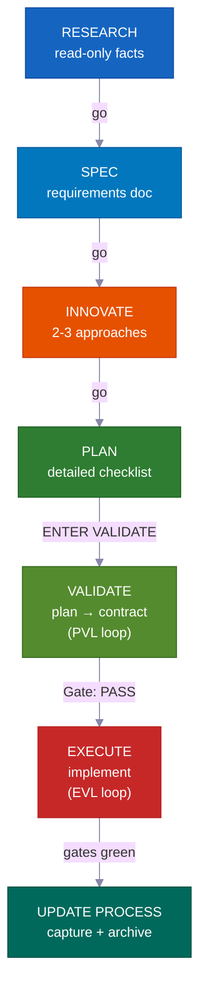

**Im interaktiven Modus** wartet jede Phase auf dein „go", bevor sie weitermacht — du bleibst bei jedem Schritt eingebunden. **Im Autopilot- oder /goal-Modus** gibst du die Genehmigung einmal vorab, dann steuert das System sich selbst bis zum Ende. Es stoppt nur bei drei spezifischen harten Stopps, die unten aufgeführt sind. **VALIDATE** und der Post-EXECUTE Re-Test sind nicht optional — sie sind harte Gates, die schlechte Arbeit vom Ausliefern abhalten — und sie laufen in beiden Modi automatisch.

---

## Die Vibe-Coding-Revolution

<div align="center">
<h3><em>"Die heißeste neue Programmiersprache ist Englisch."</em></h3>
<strong>— Andrej Karpathy</strong>
</div>

<br>

**Vibe Coding hat verändert, wer Software bauen kann. Plan-first Entwicklung verändert, was sie ausliefern können.**

<table>
<tr>
<td align="center" width="50%"><h3>63%</h3><sub>der Vibe-Coding-Nutzer sind <strong>KEINE</strong> Entwickler</sub></td>
<td align="center" width="50%"><h3>16,2 Mio.</h3><sub>Citizen Developer weltweit<br>(38% jährliches Wachstum)</sub></td>
</tr>
<tr>
<td align="center" width="50%"><h3>4,7 Mrd. $</h3><sub>Vibe-Coding-Markt<br>wächst jährlich um 38%</sub></td>
<td align="center" width="50%"><h3>25%</h3><sub>der YC W25 Startups hatten Codebasen mit über 95% KI-generiertem Code</sub></td>
</tr>
</table>

Die meisten Tools helfen dir, ein Projekt zu starten. Dieses Kit hilft dir, es **fertigzustellen** — mit Plänen, die dein Team prüfen kann, Wissen, das nie veraltet, und Sicherheitsprüfungen, die Fehler abfangen, bevor sie ausgeliefert werden.

---

## Für wen ist das gedacht?

<div align="center">
<h3><em>"Es kommt nicht darauf an, wer es getippt hat. Sondern was geliefert wurde."</em></h3>
<strong>— Garry Tan, YC</strong>
</div>

<br>

<table>
<tr>
<td width="50%" valign="top">
<h1>🧑‍💼</h1>
<strong>CEO / Gründer</strong><br><br>
<em>„Bau mir ein SaaS mit Auth, Billing und einer Landing Page"</em><br><br>
Der Agent recherchiert deinen Stack, schreibt einen Architekturplan zur Prüfung, implementiert mit Tests und dokumentiert jede Entscheidung für deinen technischen Mitgründer zur späteren Überprüfung.
</td>
<td width="50%" valign="top">
<h1>📊</h1>
<strong>Product Manager</strong><br><br>
<em>„Erstelle ein Dashboard mit MRR, Churn und Wachstums-Metriken"</em><br><br>
Es generiert eine PRD-artige SPEC, holt deine Genehmigung vor dem Coden ein, implementiert nach Spec und archiviert den Plan als durchsuchbare Projekthistorie.
</td>
</tr>
<tr>
<td width="50%" valign="top">
<h1>🎨</h1>
<strong>Designer</strong><br><br>
<em>„Passe diesen Figma-Screenshot pixelgenau an"</em><br><br>
Der design-bewusste Agent analysiert deinen Mockup, implementiert Komponente für Komponente mit deinen Design-Tokens und startet visuelle Vergleichsprüfungen.
</td>
<td width="50%" valign="top">
<h1>⚙️</h1>
<strong>Ingenieur</strong><br><br>
<em>„Refaktoriere das Auth-Modul für RBAC-Unterstützung ohne Ausfallzeit"</em><br><br>
Es recherchiert deinen aktuellen Auth-Code und wie andere Codebasen RBAC gelöst haben, schreibt einen Migrationsplan, der zeigt, welche Dateien betroffen sein könnten, und implementiert sicher mit Rollback-Hinweisen.
</td>
</tr>
</table>

---

## Vergleich

| Feature | vibecode-pro-max-kit | Superpowers | GSD | gstack |
|---------|---------------------|-------------|-----|--------|
| Plan-first Lebenszyklus | Vollständiges RIPER-5 (research → spec → innovate → plan → validate → execute → update) | Verpflichtende Workflows | Context-Rot-Fix | Teilweise |
| Phasengesperrte Sicherheit | Agent-Tools sind pro Phase eingeschränkt (read-only Research, kein Schreiben in Innovate) | Skill-basierte Einschränkungen | Phasentrennung | Keine |
| Qualitätsprüfungsschleifen | **Zwei** — PVL (Plan prüfen) + EVL (Tests eigenständig erneut ausführen) | Pro Skill | Keine automatischen | Keine |
| Multi-Tool-Unterstützung | 7 Tools via `AGENTS.md` + `SKILL.md` offene Standards | Claude Code Plugin | 14 Runtimes | 1 Tool |
| Automatisch verbesserndes Wissen | Thematisch gruppiertes Wissen, nach jeder Funktion aktualisiert | Plugin-Speicher | Festplatten-Zustand | Manuell |
| Teamzusammenarbeit | Gemeinsame Pläne, Specs und Review-Dateien | Solo | Solo | Solo |
| Skills-System | 33 automatisch erkannte, keyword-gematchte bei jedem Prompt | 86 kombinierbare Skills | Meta-Prompting | 23 Rollen-Tools |
| Große mehrphasige Projekte | Umbrella-Pläne + phasenweise innere Schleife mit Regressionsprüfungen | Einzelaufgabe | Einzelaufgabe | Einzelaufgabe |
| Handfreier Modus | Autopilot (3 Spuren) + dauerhaftes `/goal`-Einverständnis | Manuell | Manuell | Manuell |
| Installation | 30s `curl` + automatisch gesteuertes Setup | Plugin-Marktplatz | npx one-liner | git clone |

> **Zur Laufzeit-Breite:** GSD unterstützt 14 Runtimes. Wir unterstützen 7 tiefgründig — mit vollständigen Agenten-Harnesses, Skill-Erkennung und Lifecycle-Hooks auf jeder Plattform. Breite vs. Tiefe: deine Wahl.

---

## ⚡ Was macht das besonders?

<table>
<tr>
<td width="50%" valign="top">
<h1>🔒</h1>
<strong>Phasengesperrte Tool-Einschränkungen</strong><br><br>
Dein Agent kann während der Recherche buchstäblich <strong>keinen</strong> Code schreiben. RESEARCH ist read-only, INNOVATE hat kein Write, PLAN/VALIDATE schreiben nur in <code>process/</code>. <strong>Echte Fähigkeitsgrenzen</strong>, keine Vorschläge.
</td>
<td width="50%" valign="top">
<h1>🎯</h1>
<strong>Der leitende Agent berührt nie Code</strong><br><br>
Der Koordinator leitet weiter, überwacht und steuert Schleifen — er <strong>bearbeitet nie Quelldateien oder führt Tests selbst aus</strong>. Jede Bearbeitung und jeder Testlauf findet innerhalb eines dedizierten Unter-Agenten statt. Keine versteckte Arbeit.
</td>
</tr>
<tr>
<td width="50%" valign="top">
<h1>🔍</h1>
<strong>Automatische Skill-Erkennung</strong><br><br>
Vor der Bearbeitung jeder Anfrage werden <strong>33 Skills</strong> gescannt und Keywords abgeglichen. Sage „Webhook-Unterstützung hinzufügen" und <code>vc-security</code> + <code>vc-scenario</code> werden automatisch hinzugezogen.
</td>
<td width="50%" valign="top">
<h1>💾</h1>
<strong>Übersteht Sitzungs-Resets</strong><br><br>
Pläne, Berichte, Wissens-Docs und Erkenntnisse liegen alle auf der Festplatte. Der Startup-Hook stellt Genehmigungsgates nach einem Sitzungs-Reset wieder her. <strong>Nichts geht verloren.</strong>
</td>
</tr>
<tr>
<td width="50%" valign="top">
<h1>🛡️</h1>
<strong>Selbst-überwachende Schrittsperre</strong><br><br>
Wenn der Agent dabei ist, einen erforderlichen Schritt zu überspringen, hält er sich selbst auf: <em>„PHASE JUMPING PREVENTED."</em> Eine <strong>eingebaute Schutzfunktion gegen Abkürzungen</strong>.
</td>
<td width="50%" valign="top">
<h1>🔄</h1>
<strong>Funktioniert mit 7 KI-Coding-Tools</strong><br><br>
Zwei offene Standards — <code>AGENTS.md</code> und <code>SKILL.md</code> — bedeuten <strong>keine Adapter, keine Plugins.</strong> Starte in Claude Code, wechsle zu Cursor, weiter in Codex.
</td>
</tr>
</table>

---

## 🧭 Wie es funktioniert — Der Koordinator

Deine Hauptsitzung ist ein **Koordinator** (auch Orchestrator genannt), kein Arbeiter. Er macht vier Dinge und nichts anderes:

```
Deine Anfrage
  → Schritt 0: Skill-Erkennung (33 Skills scannen, Keywords abgleichen, Kandidaten anhängen)
  → Absicht erkennen (Funktion / Bug / Frage / Refactoring / UI) + Unklarheit bewerten
  → Zum richtigen Agenten in einem frischen Context-Fenster weiterleiten
  → Überwachen: Schrittkonformität, Statuscodes, Schleifen steuern
```

<table>
<tr>
<td width="50%" valign="top">
<h1>🧑‍✈️</h1>
<strong>Er delegiert, implementiert nie</strong><br><br>
Research → <code>vc-research-agent</code>. Plan → <code>vc-plan-agent</code>. Code → <code>vc-execute-agent</code>. Der Koordinator übergibt den richtigen Kontext und wartet — er erledigt die eigentliche Arbeit nie selbst.
</td>
<td width="50%" valign="top">
<h1>🚫</h1>
<strong>Keine versteckte Ausführung — niemals</strong><br><br>
Sobald ein Plan mit einer vereinbarten Checkliste existiert, startet „ENTER EXECUTE MODE" <strong>immer</strong> <code>vc-execute-agent</code>. Selbst ein einzeiliger Fix läuft durch ihn. Tests laufen nur innerhalb eines dedizierten <code>vc-tester</code>. Das gilt unabhängig von der Änderungsgröße.
</td>
</tr>
<tr>
<td width="50%" valign="top">
<h1>📨</h1>
<strong>Klare Statuscodes, keine vagen Signale</strong><br><br>
Jeder Unter-Agent endet mit einem von: <code>DONE</code> · <code>DONE_WITH_CONCERNS</code> · <code>BLOCKED</code> · <code>NEEDS_CONTEXT</code>. Der Koordinator ignoriert nie einen Blocker und wiederholt denselben blockierten Ansatz nie dreimal.
</td>
<td width="50%" valign="top">
<h1>🔁</h1>
<strong>Er steuert die Behebungsschleifen</strong><br><br>
Unter-Agenten laufen einmal, melden ein Ergebnis und stoppen. Nur der Koordinator startet sie neu. Er steuert sowohl die PVL (plan-prüfen-beheben) als auch die EVL (test-prüfen-beheben) Schleifen und besitzt das gesamte Tracking.
</td>
</tr>
</table>

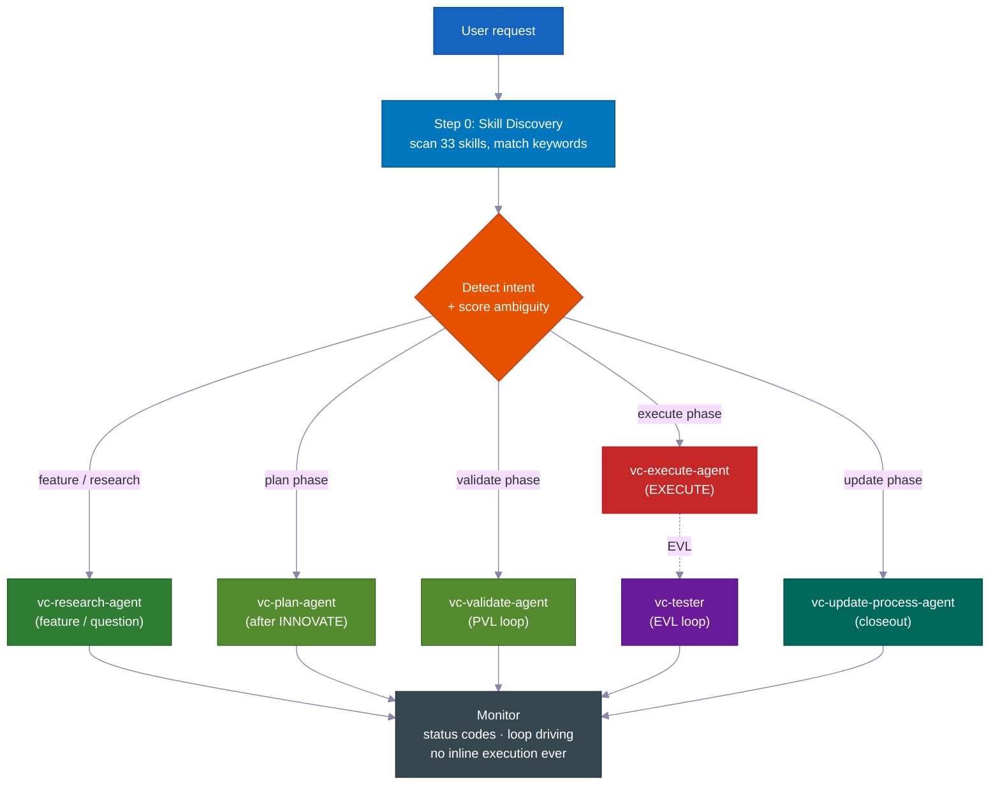

> **Warum das wichtig ist:** Ein Agent, der sowohl entscheiden als auch heimlich bearbeiten kann, wird Wege finden, den Plan zu überspringen. Indem der Koordinator von den Arbeitern (Unter-Agenten) getrennt wird, ist der Prozess strukturell ehrlich — der einzige Weg, Code zu schreiben, ist, die erforderlichen Schritte zu durchlaufen.

---
## 📊 Der RIPER-5-Lebenszyklus

| Phase | Was passiert | Agent | Sie sagen |
|-------|-------------|-------|---------|
| 🔍 **RESEARCH** | Rein lesende Informationssammlung — Codebasis und Web. Verändert keine Dateien. | `vc-research-agent` | *(automatisch bei Feature-Anfragen)* |
| 📝 **SPEC** | Anforderungsdokument zur Produktfindung — User Stories, Abnahmekriterien, außer Umfang — zur **Prüfung durch Sie, bevor ein Entwurf beginnt**. | `vc-spec-agent` | `go` / `ENTER SPEC MODE` |
| 💡 **INNOVATE** | 2–3 Ansätze mit Vor- und Nachteilen erkunden. Entscheidungszusammenfassung (gewählt + abgelehnt + Begründung). | `vc-innovate-agent` | `go` |
| 📋 **PLAN** | Detaillierte Spezifikation schreiben: Berührungspunkte, öffentliche Schnittstellen, welche Dateien angefasst werden dürfen, Nachweise, Übergabe-Zusammenfassung. | `vc-plan-agent` | `go` |
| ✅ **VALIDATE** | Den Plan in eine vereinbarte Checkliste umwandeln (V1–V7-Prüfpunkte). Ergebnis: **PASS / CONDITIONAL / BLOCKED**. Führt den PVL-Durchlauf aus. | `vc-validate-agent` | `ENTER VALIDATE MODE` |
| ⚡ **EXECUTE** | Den Plan *genau* umsetzen. Fortschrittsnotizen im Phasenbericht, Abweichungsprotokoll, Selbstprüfung. Danach führt der EVL-Durchlauf die Prüfpunkte erneut aus. | `vc-execute-agent` | `ENTER EXECUTE MODE` |
| 🧠 **UPDATE PROCESS** | Erkenntnisse festhalten, Kontext aktualisieren, Plan archivieren, Abschlussbericht schreiben. | `vc-update-process-agent` | *(empfohlen nach nicht-trivialen Arbeiten)* |

> 📝 **Warum SPEC eine eigene Phase ist:** Die meisten Systeme springen direkt von „verstehen" zu „entwerfen". Ein eigener Produktfindungs-SPEC-Schritt bedeutet, dass *Sie* (oder Ihr Product Manager) genehmigen, **was** gebaut wird — in einfachen User Stories und Abnahmekriterien — *bevor* der Agent über das **Wie** diskutiert. Es ist der günstigste Moment, um ein Missverständnis aufzudecken. (Im inneren Durchlauf eines Phasenprogramms wird SPEC übersprungen — der übergeordnete SPEC gilt für alle Phasen.)
>
> **Der SPEC ist der Maßstab.** Er beschreibt das erwartete Verhalten in einfachen Worten, die Sie in einer Minute überfliegen können. Jede nachfolgende Phase — Innovate, Plan, Validate, Execute — prüft immer wieder gegen ihn und stellt dieselbe Frage: *Bauen wir wirklich das, was Sie angefordert haben?* Wenn die Arbeit abzudriften beginnt, ist der SPEC das, was es auffängt.

```mermaid
flowchart TD
    U["Sie: was ich wirklich möchte<br>(in eigenen Worten)"] --> S["📝 SPEC<br>erwartetes Verhalten + Abnahme-<br>kriterien — Sie genehmigen"]
    S --> I["💡 INNOVATE"]
    S --> P["📋 PLAN"]
    S --> V["✅ VALIDATE"]
    S --> E["⚡ EXECUTE"]
    I -.->|"Rückprüfung"| Q{"Ist das, was<br>Sie angefordert haben?"}
    P -.->|"Rückprüfung"| Q
    V -.->|"Rückprüfung"| Q
    E -.->|"Rückprüfung"| Q
    Q -->|yes| GO["weiter bauen"]
    Q -->|no| S
```

<br>

### 💻 Beispielsitzungen

```
# 🆕 Feature-Anfrage
You: "add webhook support to the API"
→ Skill discovery surfaces: vc-scenario, vc-security
→ research-agent gathers context (read-only, can't touch code)
→ "go" → spec-agent writes requirements doc → you approve
→ "go" → innovate-agent compares approaches → decision summary
→ "go" → plan-agent writes the plan, listing which files it will touch
→ "ENTER VALIDATE MODE" → validate-agent gates the plan (PVL loop) → Gate: PASS
→ "ENTER EXECUTE MODE" → execute-agent implements → tester re-runs gates (EVL) → reviewer → git-manager
→ Closeout packet: what changed, what's verified, recommended next step
```

```
# 🐛 Fehlerbehebung
You: "login redirect is broken"
→ Routes to vc-debugger → gathers evidence FIRST → 2-3 competing hypotheses
→ Systematically eliminates each → root cause with proof chain
→ execute-agent implements the fix → EVL re-test → quality pipeline
```

```
# ⏩ Fast mode
You: "ENTER FAST MODE - add rate limiting middleware"
→ Compressed RESEARCH + SPEC + INNOVATE + PLAN + VALIDATE in one pass
→ Mandatory safety pause after VALIDATE → you review → "ENTER EXECUTE MODE"
```

```
# 🤖 Autopilot (hands-free)
You: "autopilot full: build a notifications system"
→ ONE consolidated clarification round → provisional /goal block (standing consent)
→ Drives the full RIPER-5 sequence autonomously, pausing only on hard stops
```

```
# 🏗️ Großes Programm
You: "build a full testing platform"
→ Umbrella plan + phase plans in a feature folder
→ Each phase inner loop: research → innovate → plan → PVL → execute → EVL → update
→ Progress survives context compaction — durable reports on disk
```

---

## 🎯 Absichtsklärung

Vor der Weiterleitung bewertet der Lead-Agent die Mehrdeutigkeit Ihrer Anfrage anhand von **4 binären Signalen (0–4)** und wählt eine Stufe. Fragen stellt er *nur, wenn sie tatsächlich etwas am weiteren Vorgehen ändern würden.*

| Stufe | Wann | Verhalten |
|---|---|---|
| **Stufe 0** — stille automatische Weiterleitung | Wertung 0–1, oder Sie sagten „go" / „just do it", oder Sie setzen einen Plan fort | Leitet sofort weiter, keine Fragen |
| **Stufe 1** — kurze Zusammenfassung | Wertung 2 | Nennt sein Verständnis und die gewählte Route in einer Zeile, macht dann weiter |
| **Stufe 2** — Fragen | Wertung 3+ | Stellt gezielte Mehrfachauswahl-Fragen vor der Weiterleitung |

> 🧠 **Maximal zwei Runden.** Ist nach Stufe 2 noch unklar, stellt er eine letzte direkte Frage und leitet dann standardmäßig zum Research-Agent mit dem engstmöglichen Umfang weiter. Klärungsrunden laufen nie endlos. Nach RESEARCH prüft er die Absicht erneut — zeigt die Recherche, dass die Anfrage anders war als angenommen, wird sie neu aufgegriffen; ist sie bestätigt, geht es ohne Nachfragen weiter.

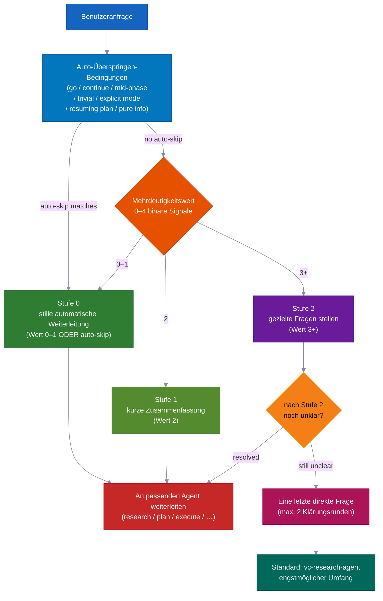

---

## ✅ Die zwei Qualitätsdurchläufe — PVL + EVL

Die meisten Systeme prüfen einmal — wenn überhaupt. Dieses System umschließt EXECUTE mit **zwei unabhängigen Durchläufen** — einen vor dem Schreiben von Code, einen danach.

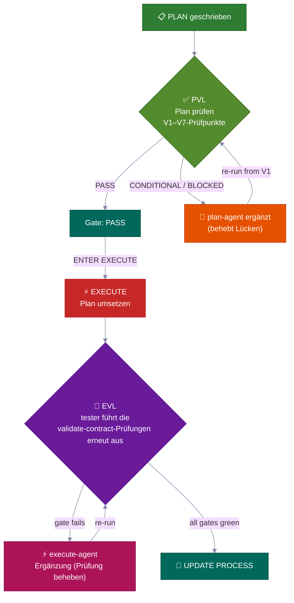

<table>
<tr>
<td width="50%" valign="top">
<h3>📋 PVL — Plan-Validate-Fix</h3>
Vor EXECUTE führt <code>vc-validate-agent</code> den Plan durch <strong>V1–V7-Prüfpunkte</strong> — verteilt auf mehrere Agents, die Infrastruktur, Testabdeckung, grundlegende Änderungen, Sicherheit und Machbarkeit je Abschnitt prüfen. Ein <strong>CONDITIONAL</strong> oder <strong>BLOCKED</strong> im ersten Durchlauf ist nie das Ende — es führt zurück zu <code>vc-plan-agent</code>, um den Plan zu aktualisieren, dann erneut ab V1.
<br><br>
<sub>Verfolgt von <code>vc-autoresearch</code> (domain: plan) — ein Lücken-suchen-und-beheben-Durchlauf. 10-Runden-Limit. Plateau-Erkennung. Nur <strong>Gate: PASS</strong> (oder ein CONDITIONAL, das Sie ausdrücklich akzeptieren) schaltet EXECUTE frei.</sub>
</td>
<td width="50%" valign="top">
<h3>🧪 EVL — Execute-Validate-Fix</h3>
Nachdem EXECUTE meldet, fertig zu sein — <strong>auch wenn es behauptet, alle Prüfpunkte sind grün</strong> — startet der Lead-Agent <strong>immer</strong> <code>vc-tester</code>, um die exakt vereinbarten Checklisten-Testbefehle unabhängig erneut auszuführen. Ein fehlgeschlagener Prüfpunkt führt zu einer gezielten <code>vc-execute-agent</code>-Korrektur, dann wird erneut getestet.
<br><br>
<sub>Verfolgt von <code>vc-autoresearch</code> (domain: tests). 10-Runden-Limit. Die eigene interne „iterate until green"-Schleife des execute-agents <strong>ersetzt</strong> diese unabhängige Bestätigung <strong>niemals</strong>.</sub>
</td>
</tr>
</table>

> 💎 **Die Ergebnisleiter:** **PASS** → weiter · **CONDITIONAL** → behebbare Lücken; der Durchlauf startet (oder Sie akzeptieren sie protokolliert) · **BLOCKED** → ein tieferes Problem; zurück zu PLAN (im Autopilot-Betrieb: die Lücke kommt ins Backlog, der Durchlauf läuft weiter).

### 🔁 vc-autoresearch — Gemeinsame Durchlauf-Engine

Sowohl PVL als auch EVL nutzen dieselbe Tracking-Schicht: **`vc-autoresearch`** — ein Lücken-suchen → beheben → wiederholen-Durchlauf. Der Lead-Agent steuert den Durchlauf — er besitzt den Rundenzähler, Berichte je Runde, das TSV-Protokoll sowie Plateau-/Limit-/Regressionsprüfungen. Worker-Agents sind Fire-and-Forget: Sie geben ein Ergebnis zurück und stoppen. Kein Agent startet sich selbst neu oder startet einen anderen Phasen-Agent.

Dieselbe Engine kann eigenständig laufen: „Diese Spezifikation härten", „alle Lint-Fehler beheben", „Testabdeckung verbessern", „diese Dokumentation verbessern" — jede wiederholte Lücken-suchen-und-beheben-Aufgabe in 6 Bereichen (spec · tests · ux · docs · plan · errors).

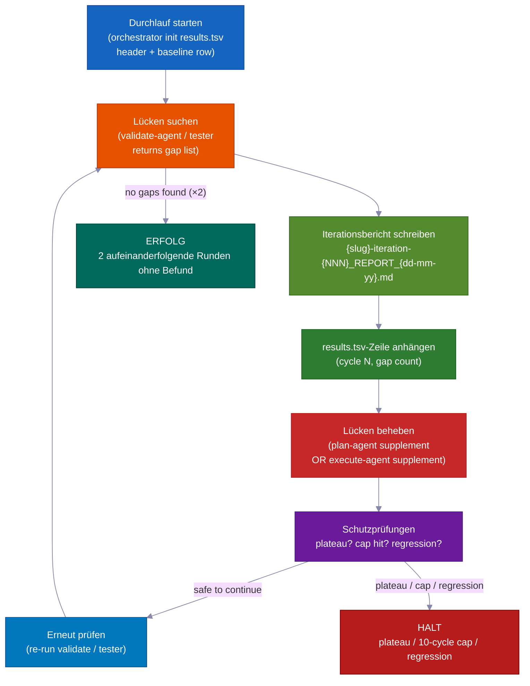

| Modus | Tut | Stoppt wenn |
|---|---|---|
| `vc-autoresearch` (Kern) | Lücken suchen → beheben → wiederholen | keine Lücken gefunden ODER Metrikziel erreicht |
| `vc-autoresearch:probe` | 8 Personas befragen das Korpus bis zur Sättigung | keine neuen Einschränkungen für 3 Runden |
| `vc-autoresearch:reason` | gegnerische Debatte mit blinden Richtern | Richter konvergieren oder Iterationslimit erreicht |
| `vc-autoresearch:evals` | TSV-Ergebnisse analysieren — Trends, Plateaus, Empfehlungen | nur Analyse |

**Stoppbedingungen:** SUCCESS (2 aufeinanderfolgende Runden ohne Befund) · HALT_PLATEAU (3 Runden ohne Fortschritt) · HALT_CAP (hartes 10-Runden-Limit) · HALT_REGRESSION (eine bisher bestandene Prüfung schlägt fehl).

---

## 👥 Strategievergleich + Modellrichtlinie

Bei **jedem Phasenübergang** ruft der Lead-Agent `vc-agent-strategy-compare` auf, um zu empfehlen, *wie* die nächste Phase ausgeführt werden soll — mit Kostenschätzungen.

| Strategie | Wann | Koordination |
|---|---|---|
| **Sequenziell** | Arbeit hängt vom vorherigen Ergebnis ab | Ein Agent nach dem anderen |
| **Parallele Subagents** | Unabhängige Dimensionen, Fire-and-Forget | Keine — Lead-Agent sammelt und kombiniert Ergebnisse |
| **Workflow** | Vorhersehbare Aufteilung der Arbeit über eine Liste | Skriptgesteuerte Schritte |
| **Agent-Team** | Agents müssen während des Durchlaufs miteinander kommunizieren (z. B. jeder bearbeitet eigene Dateien über 3+ Phasenpläne) | TeamCreate + gemeinsame Aufgabenliste + SendMessage |

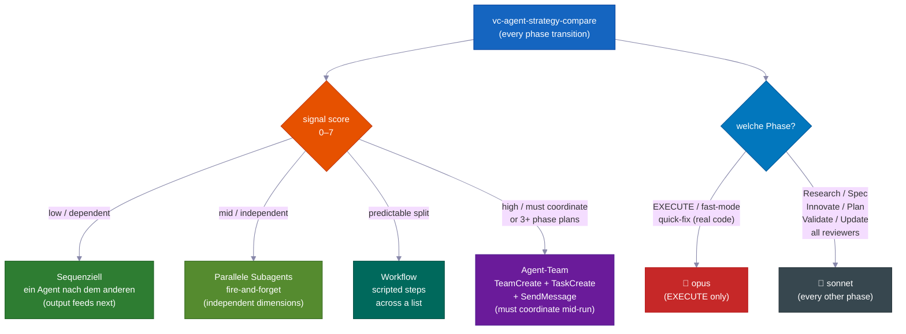

> ⚠️ **„Agent-Team" bedeutet die echte Maschinerie** — namentlich benannte Teammitglieder, eine gemeinsame Aufgabenliste und agentenübergreifende Nachrichten — *nicht* schlichte parallele Agents, die als „Team" bezeichnet werden. Es ist **verpflichtend** (nicht optional) bei der Erstellung von 3+ Phasenplänen und bei Mehr-Datei-Bearbeitungen, bei denen jeder Agent in seinen eigenen Dateien bleiben muss. Nur ein echtes Team kann während des Durchlaufs kommunizieren.

### 🧮 Modellauswahlrichtlinie

| Phase | Modell | Warum |
|---|---|---|
| **EXECUTE** (+ fast-mode, quick-fix mit echtem Code) | 🔴 **opus** | Echte Quelltextbearbeitung, Builds, Migrationen |
| Research · Spec · Innovate · Plan · Validate · Update · alle Prüfer/Forscher | 🔵 **sonnet** | Planung und Analyse — günstiger, völlig ausreichend |

> Wenn Arbeit auf mehrere Agents verteilt wird, verwendet nur der *codierende* Agent opus. Jeder Prüfer, Forscher, Validator und Planer verwendet sonnet. Der Lead-Agent nennt das Modell jedes Mal, wenn er einen Worker-Agent startet.

---

## 🤖 Autopilot-Modus — Vollautomatisches RIPER-5

Sagen Sie **`autopilot [task]`** (oder `run autopilot`, `autonomous mode`, `ENTER AUTOPILOT MODE`) und der Agent führt die *gesamte* verbleibende RIPER-5-Sequenz mit **einer** Klärungsrunde vorab aus — danach keine weiteren Pausen, bis er fertig ist.

**Überall auslösbar:** Autopilot kann zu Beginn einer Sitzung *oder* an jedem Punkt während einer Sitzung starten. Beim Auslösen liest der Lead-Agent die auf der Festplatte gespeicherten Dateien, um festzustellen, in welcher RIPER-5-Phase Sie sich bereits befinden, und setzt dann dort fort und steuert den Rest selbstständig.

| Zustand auf der Festplatte | Einstiegsphase |
|---|---|
| Keine SPEC-Datei | Start bei RESEARCH |
| SPEC-Datei vorhanden | Weiter nach SPEC (INNOVATE) |
| Plan-Datei vorhanden | Weiter nach PLAN (VALIDATE) |
| Validate-contract mit PASS/CONDITIONAL | Weiter zu EXECUTE |

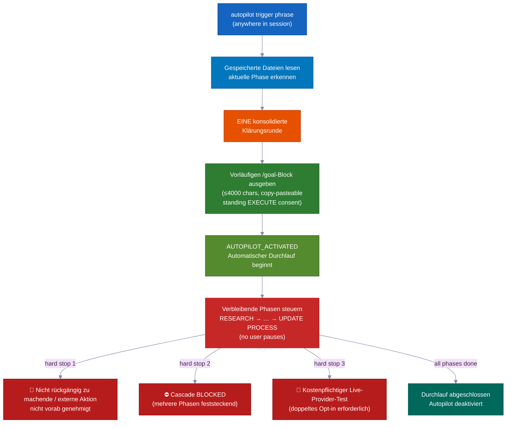

```
You: "autopilot full: add team invitations with email + role management"
→ Reads saved files → detects current phase → enters there
→ ONE consolidated clarification round (scope, hard stops, autonomy boundaries, first-phase strategy)
→ Provisional /goal block emitted (≤4000 chars, copy-pasteable, standing EXECUTE consent)
→ AUTOPILOT_ACTIVATED → drives remaining phases on its own
→ Stops ONLY for hard stops
```

### Drei Spuren — Aufwand dem Risiko anpassen

| Spur | Auslöser | Ablauf |
|---|---|---|
| 🟢 **quick** | `autopilot quick: [task]` | Scouten → Bearbeiten → gezielte Prüfung. Kein Plan, kein Vertrag, kein EVL. |
| 🟡 **fast** | `autopilot fast: [task]` | Komprimiert R→S→I→P→V → EXECUTE + EVL. |
| 🔴 **full** | `autopilot [task]` / `autopilot full:` | Vollständiges RIPER-5 (Standard). |

### 🌙 Vollautomatisch: Ein Satz, gebaut während Sie schlafen

Sagen Sie `autopilot full: [task]` — oder fügen Sie einen `/goal`-Block ein — und Folgendes passiert alles mit **null menschlichem Eingriff**:

- **Plan-prüfen-und-beheben-Schleife** — findet Lücken im Plan, behebt sie und prüft erneut. Bis zu 10 Runden selbstständig.
- **Bauen-testen-und-beheben-Schleife** — schreibt Code, führt Tests aus, behebt Fehler, führt erneut aus. Bis zu 10 Runden selbstständig. Vertraut dem eigenen „alles grün" nie — ein separater Prüfer (vc-tester) führt jeden Test unabhängig erneut aus, um es zu bestätigen.
- **Phasenübergang** — bewegt sich von Recherche über Plan zu Code bis fertig, ohne auf Sie zu warten.
- **Setzt nach einem Speicher-Reset fort** — Pläne, Berichte und Fortschritt liegen als Dateien auf der Festplatte. Nach einer Komprimierung (wenn das Kurzzeitgedächtnis der KI geleert wird) liest die nächste Sitzung diese Dateien und macht genau dort weiter, wo sie aufgehört hat.
- **Blockiertes Feature? Beiseitelegen und weitermachen** — kann eine Phase nicht aufgelöst werden, schreibt der Agent eine Backlog-Notiz und macht mit dem nächsten Feature weiter. Sie können viele Features parallel betreiben, ohne dass ein Blocker alles stoppt.
- **Agent-Teams für parallele Features** — mehrere Agents können gleichzeitig separate Features bauen, jeder auf seine eigenen Dateien beschränkt, sodass sie nie kollidieren. Ein blockiertes Feature wird geparkt, nicht zu einem Hindernis für den Rest.

### Hard Stops werden immer angezeigt (auch im Autopilot)

Dies sind die **einzigen drei Momente**, in denen er anhält und Sie fragt:

- 🛑 Alles, was nicht rückgängig gemacht werden kann oder die Außenwelt erreicht und nicht vorab genehmigt wurde (live gehen, echte Nachrichten senden, Geld abbuchen)
- ⛔ Mehrere Phasen in Folge kommen ohne Fortschritt nicht weiter — eine echte Sackgasse, die Ihre Aufmerksamkeit verdient
- 💸 Ein Test, der echtes Geld bei einem kostenpflichtigen externen Dienst ausgeben würde — er fragt vorher

---

### 🎯 /goal — das Token für den autonomen Durchlauf

**Verpflichtend, keine Dekoration:** Nachdem jede VALIDATE-Phase abgeschlossen ist, *muss* der Lead-Agent einen kopierfähigen `/goal`-Block ausgeben, bevor EXECUTE startet. Dies ist eine verpflichtende Übergabedatei — kein optionaler Kommentar.

**Formatanforderungen:**

| Blocktyp | Pflichtfelder | Hartes Limit |
|---|---|---|
| Post-VALIDATE-Block | SESSION GOAL · Charter+umbrella plan · Autonomy · Hard stop conditions · Next phase · Validate contract · Execute start | ≤ 4000 Zeichen |
| Vorläufiger (Autopilot-)Block | SESSION GOAL · ENTRY PHASE · REMAINING PHASES · CLARIFICATIONS LOCKED · EXECUTE CONSENT · DECISION POLICY · HARD STOPS · TEST GATES · START (+ optionales LANE) | ≤ 4000 Zeichen |

Der `/goal`-Befehl lehnt Blöcke ab, die länger als 4000 Zeichen sind. Kurz halten — die Pflichtfelder als Struktur nutzen, kein Prosaaufsatz.

**Eigenständiger /goal-Modus:** Fügen Sie einen `/goal`-Block in eine neue Sitzung ein, und der Durchlauf setzt bei der in `START` genannten Phase fort. Klärungen und Entscheidungsregeln sind bereits festgelegt — keine neue Klärungsrunde. Unter einem stehenden `/goal` entscheidet der Agent bei jedem reversiblen Schritt selbstständig, sendet BLOCKED-Punkte an ein Backlog und schreibt seine eigenen Berichte — aber **die Delegation an Worker-Agents bleibt verpflichtend.** Autopilot entfernt nur *Genehmigungspausen*, niemals die no-inline-execution-Regel.

Wird validiert durch `validate-autopilot-goal-block.mjs`.

---

## 🔬 Machbarkeitsprüfungen + Das Validator-Sicherheitsnetz

### 🔬 Machbarkeitsprüfungen — Annahme testen, bevor darauf gebaut wird

Wenn SPEC, INNOVATE oder VALIDATE auf eine Kernannahme trifft, die durch reines Lesen nicht bestätigt werden kann, gibt es `VC-FEASIBILITY-PROBE-NEEDED` aus und stoppt. Der Lead-Agent startet `vc-debugger`, um einen echten Test durchzuführen und ein **VERDICT** zu schreiben:

| Ergebnis | Bedeutung |
|---|---|
| ✅ **VIABLE** | Annahme hält — Entwurf darf darauf aufbauen |
| ❌ **NOT-VIABLE** | Annahme ist falsch — dieser Ansatz ist verboten |
| ❓ **INCONCLUSIVE** | Konnte nicht bewiesen werden — wird als bekannte Lücke weitergeführt |

Jedes Ergebnis enthält eine dreiteilige Designnotiz: **was das Ergebnis erlaubt · was es ausschließt · was noch unklar ist** — wortgenau zurück in die pausierte Phase eingespielt. Prüfungen sind **kostenmäßig klassifiziert** (`cheap-local` / `needs-container` / `needs-live-provider` → doppeltes Opt-in / `needs-browser` / `needs-cf`), sodass eine kostenpflichtige oder eine gemeinsam genutzte Ressourcenprüfung nie stillschweigend ausgeführt wird.

### 🛡️ 36 Validatoren — mechanische Korrektheit, keine Meinung

Das Kit enthält **36 Validatorskripte**, die aus „Hat der Agent die Regeln befolgt?" ein klares Bestanden/Nicht-bestanden-Ergebnis machen. Sie laufen nach jeder Phase, die Harness-Dateien berührt, und als verpflichtende Prüfpunkte in UPDATE PROCESS:

| Validator-Familie | Prüft |
|---|---|
| `vc-audit-vc` | Agent-Parität (Claude/Codex), Skill-Registry, Kit-Portabilität, Agent-Frontmatter |
| `vc-audit-context` | Kontext-Routing, Discovery-Frontmatter, Skill-Schlüsselwörter |
| `vc-audit-plans` | Plan-Inventar, Umbrella-Zustand, Phasenvollständigkeit, Phasenberichte, Backlog-Notizen |
| 14 VC-System-Verhaltensvalidatoren | Jeder besitzt ein Bestanden/Nicht-bestanden-Fixture-Paar — strategy-compare-Ausgabe, Abschluss, intent-clarify, Machbarkeitsergebnis, autoresearch-Protokoll und mehr |

---

## 🛡️ Eingebaute Sicherheitssysteme

Dies sind keine Richtlinien — es sind **harte Regeln**, die in jeden Agent eingebaut sind.

<table>
<tr>
<td width="50%" valign="top">
<h1>📝</h1>
<strong>Fortschrittsnotizen, keine Pausen während der Ausführung</strong><br><br>
Während der Codierung schreibt der Agent Fortschrittsnotizen in die Phasenberichtsdatei. Keine Pause mitten im Durchlauf, keine „Weiter oder zurück?"-Abfrage. Tritt ein Problem auf, das eine Planänderung erfordert, stoppt er und kehrt zu PLAN zurück. Andernfalls macht er weiter.
</td>
<td width="50%" valign="top">
<h1>🚫</h1>
<strong>Nie still abweichen</strong><br><br>
Trifft die Codierung auf ein Problem, das eine Planänderung erfordert, <strong>stoppt der Agent sofort</strong>, erklärt es und kehrt zu PLAN zurück. Kein stilles Improvisieren.
</td>
</tr>
<tr>
<td width="50%" valign="top">
<h1>🔐</h1>
<strong>Datenschutz-Sicherheitshaken</strong><br><br>
Der Agent ist <strong>gesperrt vom Lesen</strong> von <code>.env</code>-, Anmeldedaten-, SSH-Schlüssel- und <code>.pem</code>-Dateien ohne ausdrückliche Genehmigung.
</td>
<td width="50%" valign="top">
<h1>⚠️</h1>
<strong>Hochrisiko-Nachweispakete</strong><br><br>
Bei Authentifizierung, Abrechnung, Schema-Migrationen oder Änderungen an öffentlichen APIs verlangt das System ein formelles <strong>5-Datei-Nachweispaket</strong>, bevor die Arbeit als „erledigt" gilt — immer manuell, nie automatisch umgangen.
</td>
</tr>
<tr>
<td width="50%" valign="top">
<h1>📨</h1>
<strong>Statuscodes-Disziplin</strong><br><br>
Worker-Agents müssen mit <code>DONE</code> / <code>DONE_WITH_CONCERNS</code> / <code>BLOCKED</code> / <code>NEEDS_CONTEXT</code> schließen. Blockierungen werden nie ignoriert; Korrektheitsprobleme werden zu Aktionspunkten.
</td>
<td width="50%" valign="top">
<h1>📊</h1>
<strong>Abschluss + Drift-Bewertung</strong><br><br>
Nach der Codierung bewertet ein Abschlusspaket die Dringlichkeit: <strong>LOW</strong> (leichte Berührung) → <strong>MEDIUM</strong> (bedeutend) → <strong>HIGH</strong> (Harness-/Protokolldateien berührt), und empfiehlt den nächsten sicheren Schritt.
</td>
</tr>
</table>

---

## 🔍 Intelligenz vor der Umsetzung

Bevor eine einzige Codezeile geschrieben wird, können drei Spezialist-Skills Probleme aufdecken:

<table>
<tr>
<td width="50%" valign="top">
<h1>🎭</h1>
<strong>5-Personas-Debatte — <code>vc-predict</code></strong><br><br>
Architekt, Sicherheit, Performance, UX und Advocatus Diaboli debattieren Ihren Plan. Liefert ein <strong>GO / CAUTION / STOP</strong>-Ergebnis, bevor Sie eine Zeile schreiben.
</td>
<td width="50%" valign="top">
<h1>🎲</h1>
<strong>12-Dimensionen-Randfälle — <code>vc-scenario</code></strong><br><br>
Zerlegt ein Feature über 12 Dimensionen (Benutzertypen, Eingabe-Extremwerte, Timing, Skalierung, Zustand, Umgebung, Fehler, Authentifizierung, Daten, Integrationen, Compliance, Geschäftslogik). Die Ausgabe dient gleichzeitig als Testspezifikation.
</td>
</tr>
<tr>
<td width="50%" valign="top">
<h1>🔐</h1>
<strong>STRIDE + OWASP-Prüfung — <code>vc-security</code></strong><br><br>
Sicherheitsprüfung mit zwei Methoden, einschließlich Abhängigkeitsprüfung, Geheimnis-Erkennung und einem <strong>Auto-Fix-Modus</strong>, der nach Schweregrad sortiert und Kritisches zuerst mit Regressionssicherung behebt.
</td>
<td width="50%" valign="top">
<h1>🔬</h1>
<strong>Nachweise zuerst, dann Debugging — <code>vc-debugger</code></strong><br><br>
Sammelt Nachweise → bildet 2–3 konkurrierende Hypothesen → testet jede → dokumentiert den Ausschlussweg. <strong>Rät nie — beweist.</strong>
</td>
</tr>
</table>

---

## ✅ Qualitätspipeline — in die Ausführung eingebaut

**Tests zuerst, dann Code.** Die vereinbarte Checkliste (geschrieben, bevor Code angefasst wird) definiert die genauen Tests, die bestehen müssen. Der execute-agent schreibt Code, bis diese Tests grün sind. Dann führt ein separater Prüfer — `vc-tester` — jeden Test selbstständig erneut aus, um es zu bestätigen. Das eigene „alles grün" des execute-agents wird nie für bare Münze genommen. Am Ende prüft der Reviewer, ob das gesamte Projekt noch zusammen funktioniert, nicht nur das neue Teil.

Der execute-agent schreibt nicht nur Code und ist fertig. Er durchläuft automatisch eine **Qualitätspipeline**:

<br>

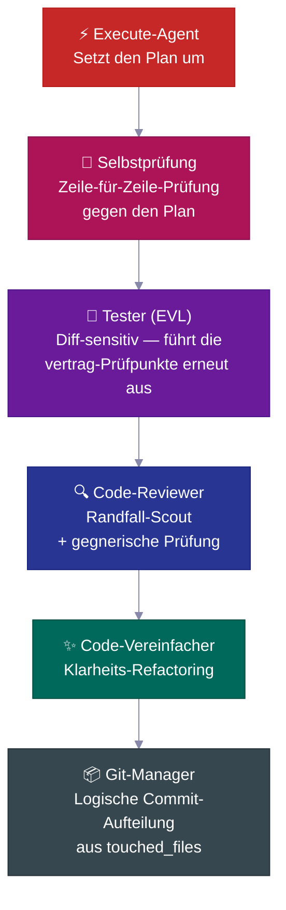

| Schritt | Was er tut |
|---|---|
| 🔎 **Selbstprüfung** | Prüft jeden Checklisten-Punkt gegen den Plan, protokolliert jede Abweichung |
| 🧪 **Tester (EVL)** | Führt die vereinbarten Checklisten-Tests unabhängig erneut aus; ordnet geänderte Dateien → Testdateien zu, eskaliert zur vollständigen Suite wenn >70 % zugeordnet |
| 🔍 **Code-Reviewer** | Sendet vor der Prüfung einen Randfall-Scout aus; prüft N+1-Abfragen, Auth-Pfade, Datenlecks |
| ✨ **Vereinfacher** | Bereinigt den Code nach der Prüfung für mehr Klarheit — keine Verhaltensänderungen |
| 📦 **Git-Manager** | Empfängt `touched_files`, teilt in logische konventionelle Commits auf, lehnt unbekannte Dateien ab |

---
## 📋 Der Plan-Lebenszyklus

Jedes nicht-triviale Feature folgt einem **Plan-Lebenszyklus** — ein schriftliches Konzept, das erstellt, geprüft, umgesetzt und anschließend als dauerhafte Projekthistorie archiviert wird.

<br>

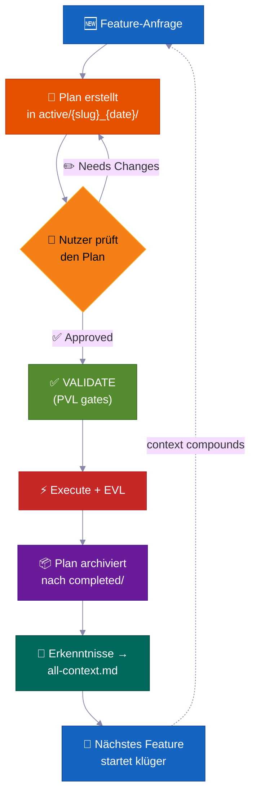

> 💡 Wenn jemand in sechs Monaten fragt *„Warum haben wir die Authentifizierung so gebaut?"*, findet sich die Antwort in `completed/`. Nicht verloren in einem Chat-Thread.

**Wo Pläne abgelegt werden — Task-Ordner-Konvention:**

```
process/
├── general-plans/
│   ├── active/
│   │   └── webhooks_28-05-26/          # 📋 Task-Ordner: Plan + zugehörige Berichte/Referenzen
│   │       └── webhooks_PLAN_28-05-26.md
│   ├── completed/                       # ✅ Archiviert (durchsuchbare Historie)
│   └── backlog/                         # 📌 Zurückgestellte Arbeit
└── features/
    └── billing/                         # 🏷️ Feature-spezifisch (5+ Artefakte)
        ├── active/{slug}_{date}/
        ├── completed/
        └── backlog/
```

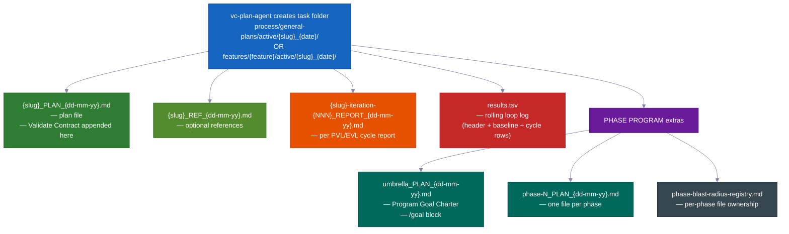

> Jeder Plan enthält: 📍 **Berührungspunkte** (erstellte/geänderte Dateien) · 📜 **öffentliche Verträge** · 💥 **welche Dateien er anfassen darf** (was brechen könnte, was zu testen ist) · ✅ **Nachweise** · 🔄 **Übergabe-Handoff**. `vc-plan-discovery` findet den richtigen Plan zum Fortsetzen; der `post-write-plan-check`-Hook prüft die Plan-Struktur bei jedem Schreiben.

---

## 🏗️ Phasenprogramme — Große Projekte, die nicht auseinanderfallen

Normale Features nutzen einen einzelnen Plan. **Große Mehrphasen-Projekte** verwenden ein Phasenprogramm — einen Übersichtsplan plus Einzelpläne pro Phase, die jeweils einen vollständigen **7-stufigen inneren Durchlauf** mit eigenen Prüfpunkten und einem gespeicherten Bericht durchlaufen.

<br>

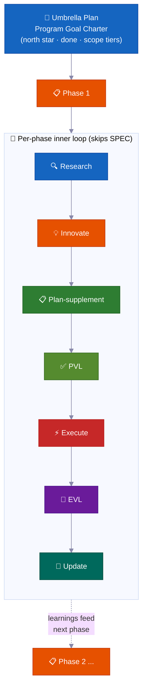

| | Merkmal | Warum es wichtig ist |
|---|---|---|
| 🔄 | **Erneute Recherche in jeder Phase** | Prüft auf Codedrift, liest aktuelle Berichte, aktualisiert Annahmen |
| ✅ | **Prüfpunkte pro Phase** | Eine Phase gilt erst als abgeschlossen, wenn Nachweise vorliegen. Ehrlicher Status: `PLANNED → CODE DONE → TESTING → VERIFIED` oder `BLOCKED` |
| 📄 | **Gespeicherte Berichte** | Jede Phase schreibt Ergebnisse auf die Festplatte — Fortschritt überlebt einen Speicher-Reset |
| 🧠 | **Erkenntnisse fließen vorwärts** | Entdeckungen aus Phase 1 aktualisieren den Plan für Phase 2, bevor die Programmierung beginnt |
| 🏗️ | **Fundament vs. Erweiterung** | Trennt klar „Architektur beweisen" von „alles umsetzen" |
| 🚧 | **Ehrlicher Umgang mit Blockierungen** | Feststeckende Phasen bleiben `BLOCKED` mit Nachweisen. Kein grüner Status auf Lüge |

<br>

### 🔀 Das Programm passt sich beim Lernen selbst an

Der zu Beginn erstellte Plan ist eine grobe Karte, kein fixer Vertrag. Während das Programm läuft, passt er sich an — so muss man nicht jeden Schritt im Voraus vorhersagen.

**Es kann mitten im Lauf eine neue Phase einfügen.**
Beim Arbeiten kann der Agent einen fehlenden Schritt entdecken — etwas, das vor der nächsten Phase erledigt sein muss. In diesem Fall fügt er direkt dort eine neue Phase ein, nummeriert die übrigen neu und macht weiter. Kein Mensch muss eingreifen. (Internes Signal: `MID_PROGRAM_PLAN_CREATED` — der neue Plan wird automatisch auf die Festplatte geschrieben und zur Registry hinzugefügt.)

**Es kann Phasen umordnen.**
Recherchen zeigen manchmal, dass die geplante Reihenfolge falsch ist — zum Beispiel wenn Phase 3 auf etwas angewiesen ist, das erst Phase 4 liefert. Der Agent ordnet die verbleibenden Phasen neu an und hält fest, warum. (Internes Signal: `PHASE_RESTRUCTURE_NOTICE` — als Prüfprotokoll im Phasenbericht gespeichert, nicht als Blockierung.)

**Er aktualisiert den Plan jeder Phase kurz vor der Programmierung.**
Bevor eine Phase mit dem Programmieren beginnt, prüft eine kurze Recherche, was das Programm bisher gelernt hat. Anschließend wird die Checkliste dieser Phase mit neuen Erkenntnissen ergänzt. Dieser Schritt heißt **plan-supplement**. Pläne sind niemals eingefroren — sie nehmen aktuelle Erkenntnisse aus früheren Phasen auf.

**Er überspringt Arbeit, die noch nicht beginnen kann.**
Wenn eine Phase von etwas abhängt, das noch nicht bereit ist — ein Dienst, der noch nicht gebaut wurde, eine Entscheidung, die noch nicht gefallen ist — markiert der Agent diese Phase als abhängigkeitsblockiert, legt sie beiseite und geht zur nächsten über. Das gesamte Programm kommt nicht zum Stillstand, weil eine Phase wartet.

**Er weiß, wann er stoppen und fragen muss.**
Eine einzelne feststeckende Phase wird einfach im Backlog geparkt und das Programm läuft weiter. Wenn aber mehrere Phasen hintereinander gegen eine Wand stoßen ohne Fortschritt, wertet der Agent das als echte Sackgasse — einen **Kaskadenstopp** — und hält inne, um zu zeigen, was passiert ist. Eine feststeckende Phase ist normal. Mehrere hintereinander signalisieren, dass etwas strukturell nicht stimmt.

**Er führt ein live-Anzeigetafel.**
Jedes Programm hat einen einseitigen Statusbereich im Übersichtsplan, der zeigt, welche Phase gerade aktuell ist, ob sie abgeschlossen ist und wo der Bericht liegt. Jeder — oder der Agent selbst nach einem Speicher-Reset — kann ihn lesen und genau wissen, wo die Dinge stehen. Außerdem führt er eine einfache Dateiregistrierung, damit zwei gleichzeitig arbeitende Phasen niemals dieselben Dateien bearbeiten.

**Eine große Abschlussprüfung.**
Am Ende des gesamten Programms führt der Agent einen End-to-End-Test durch, der sicherstellt, dass das gesamte Projekt noch zusammenarbeitet — nicht nur jedes einzelne Teil für sich. Individuelle Phasenprüfpunkte beweisen, dass jedes Teil funktioniert; diese abschließende Prüfung beweist, dass die Teile als Ganzes funktionieren.

---

### 🧠 Er verliert nie seinen Platz (überlebt einen Speicher-Reset)

Lange Aufgaben werden korrekt abgeschlossen — selbst wenn der Speicher der KI zwischendurch zurückgesetzt wird. Plan, Fortschritt und Nachweise liegen in Dateien auf der Festplatte, nicht nur im Kopf des Agenten.

KI-Agenten haben ein begrenztes Arbeitsgedächtnis. Bei einer langen Aufgabe füllt sich dieses und wird komprimiert — Details können verschwimmen. Wenn eine neue Sitzung beginnt (oder der Speicher gelöscht wird), rät der Agent nicht, wo er aufgehört hat. Er liest die Dateien.

So funktioniert das genau:

**1. Er schreibt nach jeder Phase einen kurzen Bericht.**
Wenn eine Phase endet, wird eine Berichtsdatei auf die Festplatte geschrieben. Der Fortschritt liegt in Ihrem Projektordner, nicht nur im Kopf des Agenten. Eine Speicherkomprimierung kann keine Datei löschen.

**2. Er führt eine Checkliste der erledigten Schritte.**
Jeder Phasenplan enthält eine **Phase Loop Progress**-Liste — Kontrollkästchen für jeden Schritt (Recherche, Plan-Prüfung, Build, Test, Erkenntnisse festhalten). Nach einem Reset liest der Agent diese Kästchen und kennt den genauen nächsten Schritt. Er muss nicht aufgeholt werden.

**3. Ein kurzer „Umschlag" zu Beginn jeder Phase.**
Jeder Worker-Agent (ein fokussierter Helfer, der eine Phase der Arbeit erledigt) beginnt mit dem Ausgeben eines **Context Envelope** — eine 10-Felder-Notiz: welches Feature, welche Phase, welcher Branch, welche Plandatei, welche Tests auszuführen sind. Das Lesen dauert Sekunden. Der Agent ist bereit, bevor er irgendetwas tut.

**4. Er vertraut den Dateien mehr als seinem eigenen Gedächtnis.**
Bei der Wiederaufnahme prüft der Agent, was tatsächlich im Code und in der Git-Historie steht, verglichen mit dem, was der Plan sagt. Der tatsächliche Zustand gewinnt. Ein veralteter Plan kann den Agenten nicht dazu verleiten, Arbeit zu wiederholen oder Schritte zu überspringen.

**5. Eine laufende Anzeigetafel und Berichte pro Runde.**
Jede Korrekturrunde (die Plan-Prüfschleife und die Build-Test-Schleife) führt eine `results.tsv`-Anzeigetafeldatei — eine Zeile pro Runde, die nachverfolgt, wie viele Probleme noch übrig sind. Wenn eine Sitzung mitten in einer Schleife endet, liest die nächste Sitzung den Stand, setzt bei der richtigen Runde an und macht weiter. Keine Runden gehen verloren.

**6. Er injiziert beim Fortsetzen eine Erinnerung.**
Wenn der Speicher komprimiert wird, lädt das System automatisch die aktuelle Statusnotiz in die neue Sitzung. Wenn eine Genehmigung ausstand — etwa ein Prüfpunkt, der ein „Ja" brauchte, bevor es weiterging — weist die Erinnerung darauf hin. Nichts wird stillschweigend übergangen.

> 💡 Kurz gesagt: Sie können einen Autopilot-Lauf starten, Ihren Laptop zuklappen und Stunden später zurückkehren. Der Agent wird genau dort sein, wo er sein sollte — oder setzt beim letzten gespeicherten Prüfpunkt an, mit Nachweisen auf der Festplatte.

---

## 🧠 Kontextgruppen

Projektwissen ist in **Kontextgruppen** organisiert — stabile Wissensbereiche, jede mit einer `all-{group}.md`-Router-Datei, die den Agenten sagt, was wann zu lesen ist. Agenten folgen dem Router und laden nur das Relevante — nicht jedes Mal die gesamte Wissensbasis.

<br>

```
process/context/
├── all-context.md              # 🧭 Root-Router — Architektur, Stack, Muster, Konventionen
├── tests/all-tests.md          # 🧪 Test-Runner, Befehle, Debug-Verfahren
├── container/all-container.md   # 🐳 Docker, Deployment, Infra-Verfahren
├── uxui/all-uxui.md            # 🎨 Komponenten, Design-Token, Muster
├── infra/all-infra.md          # 🖥️ Server-Infrastruktur, Deployment
└── {your-domain}/all-{domain}.md  # 📚 Jede Domain mit 3+ dauerhaften Docs (automatisch hochgestuft)
```

| | Funktionsweise |
|---|---|
| 🧭 **Router-Muster** | Agenten lesen nur, was für ihre Aufgabe relevant ist |
| 📏 **Automatische Hochstufung** | Themen mit 3+ Docs (oder einer einzelnen Datei, die zu groß wird) erhalten eine eigene Gruppe |
| 🔄 **Immer aktuell** | Wird von `vc-update-process-agent` nach jedem nicht-trivialen Feature aktualisiert |
| 🧪 **Prüfbar** | `vc-audit-context` prüft Routing, Discovery-Frontmatter und Konsistenz |
| 📨 **Context Envelope** | Jeder innere-Schleifen-Agent gibt beim Start eine 10-Felder-Notiz aus (Feature → Phase → Sitzungsziel → Branch → Worktree → Kontextgruppe → Blast-Radius-Pakete → aktiver Plan → Test-Runner → Validate-Contract), damit ein frischer Worker-Agent genau weiß, wo er steht |

> Das Kit liefert nur den Protokoll-Startwert — Ihre Kontextgruppen werden **für Ihr Projekt** von `vc-setup` erstellt, indem Ihr tatsächlicher Code gescannt wird. Sie sind ein Muster, keine feste Liste.

---

## 📁 Feature-Ordner

Wenn sich für ein Thema 5 oder mehr Dateien ansammeln, erhält es einen eigenen **Feature-Ordner** — einen vollständigen Lebenszyklus-Container.

```
process/features/{feature}/
├── active/{slug}_{date}/   # 📋 Pläne in Bearbeitung (Berichte/Referenzen nebenan)
├── completed/              # ✅ Archivierte Pläne (durchsuchbare Entscheidungshistorie)
└── backlog/                # 📌 Zurückgestellte Arbeit (Agenten prüfen, bevor sie duplizieren)
```

| | Was passiert |
|---|---|
| 🆕 | Neue Arbeit beginnt in `active/` → Berichte sammeln sich an → Plan wird in `completed/` archiviert |
| 📌 | Zurückgestellte Arbeit kommt ins `backlog/` — Agenten prüfen es, bevor sie doppelte Pläne erstellen |
| 📦 | Feature-Hochstufung erfolgt automatisch, wenn allgemeine Artefakte 5+ erreichen |
| 🔍 | Jedes Feature hat eine vollständige, in sich geschlossene Historie — Pläne, Entscheidungen, Berichte, Recherchen |

---

## 🧱 Skill-Ebenen

Die 33 Skills fallen in drei Ebenen. Jede `SKILL.md` deklariert ihre `layer` + `trigger_keywords` im Frontmatter, und ein generierter Katalog hält die Erkennung schnell.

<table>
<tr>
<td width="33%" valign="top">
<h1>🎭</h1>
<strong>Actor agents</strong><br><br>
Besitzen eine Phase oder Rolle. Liegen in <code>.claude/agents/</code> — das sind die 15 Agenten, keine Skills.
</td>
<td width="33%" valign="top">
<h1>📜</h1>
<strong>Contract skills (20)</strong><br><br>
Jeder produziert eine bestimmte Datei oder vereinbarte Ausgabe — <code>vc-generate-plan</code>, <code>vc-validate-findings</code>, <code>vc-autopilot</code>, die Audits. Ergebnisse können überprüft werden.
</td>
<td width="33%" valign="top">
<h1>🛠️</h1>
<strong>Helper skills (13)</strong><br><br>
Verbessern <em>wie</em> Agenten arbeiten, produzieren selbst keine Datei — <code>vc-scout</code>, <code>vc-sequential-thinking</code>, <code>vc-problem-solving</code>, <code>vc-docs-seeker</code>.
</td>
</tr>
</table>

---

## 🧠 Selbstverbesserndes Projektgedächtnis

Jedes abgeschlossene Feature speist Erkenntnisse zurück in das Kontextsystem — **das Wissen baut sich auf, es wird nicht zurückgesetzt.**

Die meisten KI-unterstützten Codebasen haben die gegenteilige Eigenschaft: Jede neue Sitzung startet kalt. Der Agent liest dieselben Dateien erneut, entdeckt dieselben Muster neu und trifft dieselben Entscheidungen neu — weil die Erkenntnisse der letzten Sitzung nur in einem Chat-Fenster lebten. Die Antwort des Kits ist kein Prompt-Trick. Es ist ein **dauerhaftes Kontextdateisystem** (`process/context/`), das jeder Agent beim Sitzungsstart liest, jeder Validator schützt und jedes abgeschlossene Feature bereichert.

Sechs Monate und viele Speicher-Resets später weiß der Agent immer noch *warum* Ihre Authentifizierung so funktioniert — weil dieses Wissen auf der Festplatte liegt, geroutet und prüfbar ist, nicht in einer toten Sitzung gefangen.

<br>

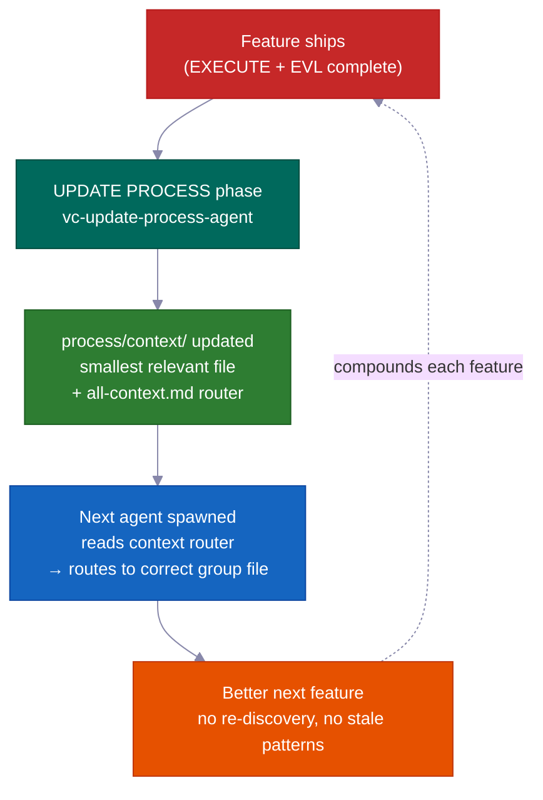

### Der Kernmechanismus: `process/context/` als portables, gemeinsames Gedächtnis

`process/context/` enthält strukturiertes Wissen, das in Themengruppen organisiert ist — Architekturentscheidungen, Programmierstil-Konventionen, Deployment-Schritte, Testmuster, Infrastruktur-Fakten. Im Gegensatz zu einem Chat-Verlauf ist dieses Wissen:

- **in jeden Worker-Agenten eingebaut** — `vc-context-discovery` leitet jeden gespawnten Agenten zum richtigen `all-{group}.md`-Router für seine Aufgabe und dann zur kleinsten relevanten Tiefendatei. Ein Recherche-Agent, ein Plan-Agent und ein Programmier-Agent starten alle mit demselben gemeinsamen Verständnis
- **überlebt einen Speicher-Reset** — es liegt auf der Festplatte, nicht in einem Kontextfenster; eine komprimierte Sitzung verliert nichts davon
- **ist sowohl von Claude als auch von Codex lesbar** — `.agents/skills` ist ein Shortcut-Link zu `.claude/skills/`, sodass dasselbe Kontextsystem beide Agenten ohne Duplizierung bedient

Der Root-Router (`all-context.md`) verweist auf Gruppen-Router (`all-{group}.md`), die zur kleinsten relevanten Tiefendatei weiterleiten. Agenten folgen dem Router — sie kodieren Dateipfade nie fest. Das bedeutet, dass Umbenennungen und Gruppenaufteilungen nur Router-Änderungen erfordern, keine codebase-weite Suche.

```
process/context/
├── all-context.md                  ← Root-Router (Architektur, Stack, Muster)
├── tests/all-tests.md              ← Test-Runner, Debugging, Befehle
├── container/all-container.md      ← Docker, Deployment, Infra-Verfahren
├── uxui/all-uxui.md                ← Komponenten, Design-Token, visuelle Konventionen
└── {domain}/all-{domain}.md        ← Jede Domain mit 3+ dauerhaften Docs (automatisch hochgestuft)
```

<br>

### Was es selbstverbessernd macht (nicht nur „lebendige Docs")

Die Formulierung „lebendige Docs" bedeutet meist „Docs, die wir aktuell halten wollen, aber meistens vergessen." Dieses System erzwingt die Absicht mechanisch.

**Die UPDATE PROCESS-Phase erfordert eine dateibezogene Kontextprüfung, bevor sie abgeschlossen werden kann.** `vc-update-process-agent` kann eine Phase erst abschließen, wenn jede potenziell betroffene Kontextdatei mit einem konkreten Grund pro Datei geprüft wurde. „Keine Aktualisierungen nötig" ist erlaubt — aber es muss jede geprüfte Datei benennen und erklären warum. Vage Begründungen werden abgelehnt. Der Prüfpunkt ist binär: die Prüfung dokumentieren, oder die Phase schließt nicht.

Die vollständige Rückkopplungsschleife pro abgeschlossenem Feature:

| Schritt | Verantwortlicher | Was passiert |
|------|-------|-------------|
| 1. Git-Diff-Analyse | `vc-scout` | Ordnet geänderte Dateien betroffenen Kontextbereichen zu |
| 2. Datei-bezogene Prüfung | `vc-update-process-agent` | Benennt jede Kontextdatei, gibt die Aktualisierung oder ein explizites „keine Änderung + Grund" an |
| 3. Aktualisierungen angewendet | parallele Worker-Agenten | Die Kontextdatei jedes Bereichs wird mit neuen Mustern, Entscheidungen, Erkenntnissen aktualisiert |
| 4. Routing verifiziert | `validate-context-discovery.mjs` | Bestätigt, dass jedes Dokument indiziert und Router konsistent sind |
| 5. Erkennung bestätigt | `validate-all-context.mjs` | Bestätigt, dass `all-context.md` und Gruppen-Router zu den aktuellen Dateien auf der Festplatte passen |

Ihr 100. Feature profitiert von allem, was in den ersten 99 gelernt wurde — nicht als Wunsch, sondern als mechanische Garantie.

<br>

### Vorschau: Erkenntnisse fließen vorwärts, nicht nur rückwärts

Jeder Phasenbericht enthält einen `## Forward Preview`-Abschnitt, der für den Agenten der *nächsten* Phase geschrieben wird. Er liefert die genauen Befehle, um grün zu bleiben, Abhängigkeitsänderungen und mitten in der Phase gefundene Dateiänderungen. Der Agent, der Phase 3 übernimmt, muss die Ausgabe von Phase 2 nicht neu lesen und raten, was wichtig ist. Er bekommt eine fokussierte Zusammenfassung.

Das unterscheidet sich von Kontextdokumenten: Kontextdokumente tragen *dauerhaftes* Wissen (Entscheidungen, die feature-übergreifend gültig bleiben); Forward Preview trägt *vorübergehenden* Übergabestatus (was die nächste Arbeitssitzung gerade jetzt wissen muss).

<br>

### Validator-Suite verhindert Verfall

Dauerhaftes Wissen veraltet, wenn niemand es prüft. Das Kit liefert Validatoren, die als Teil jedes Phasenabschlusses laufen:

| Validator | Was er findet |
|-----------|----------------|
| `validate-context-discovery.mjs` | Docs, die von keinem Router indiziert werden; defekte Links; fehlende Frontmatter |
| `validate-all-context.mjs` | `all-context.md` nicht synchron mit den tatsächlichen Dateien auf der Festplatte |
| `validate-skill-keywords.mjs` | Skills ohne `trigger_keywords`- oder `layer`-Felder (unterbricht Routing Schritt 0) |
| `validate-protocol-discovery.mjs` | Protokolldateien in `process/development-protocols/` ohne Discovery-Frontmatter |

Diese laufen wie automatisierte Prüfungen — ein veraltetes oder verwaistes Dokument schlägt fehl. Das System überwacht seine eigene Gesundheit.

<br>

### Kontextgruppen organisieren sich selbst

Gruppen werden automatisch erstellt, wenn ein Thema 3+ Docs erreicht oder eine einzelne Datei über ~800 Zeilen geht. Agenten folgen Routern und kodieren Pfade nie fest — das Hinzufügen einer neuen Gruppe (z.B. `process/context/billing/all-billing.md`) erfordert daher nur eine Router-Aktualisierung, keine Änderungen an jedem Agenten, der Abrechnung erwähnt. Der Router ist die stabile Referenz; die Dateien dahinter können sich frei reorganisieren.

> Das Kit startet Kontextgruppen aus Ihrer echten Codebasis (via `vc-setup`). Die Gruppen sind keine feste Liste — sie sind ein Muster. Ihr Auth-Bereich, Ihr Infra-Bereich, Ihr Zahlungsbereich werden jeweils zu erstklassig routbarem Wissen, während das Projekt wächst.

---

## 🤖 Was drin ist

<br>

### 15 Agenten

<details>
<summary>Klicken, um die Agenten-Liste zu erweitern</summary>

<br>

**Kern-Workflow-Agenten** — einer pro RIPER-5-Phase (R → SPEC → I → P → V → E → UP):

| Agent | Modell | Rolle |
|-------|:---:|------|
| 🔍 `vc-research-agent` | sonnet | Codebase- und Web-Recherche, nur-lesend. Widerspruchsverfolgung eingebaut |
| 📝 `vc-spec-agent` | sonnet | Product-Discovery-Anforderungsdokument vor INNOVATE. Produziert `*_SPEC_*.md` |
| 💡 `vc-innovate-agent` | sonnet | 2-3 Ansätze vergleichen. Entscheidungszusammenfassung (gewählt + abgelehnt) vor PLAN |
| 📋 `vc-plan-agent` | sonnet | Plan mit Anti-Abkürzungs-Wächtern schreiben. „Ich weiß schon wie" ist kein Plan |
| ✅ `vc-validate-agent` | sonnet | Plan → vereinbarte Checkliste (V1–V7). Prüfpunkt: PASS/CONDITIONAL/BLOCKED |
| ⚡ `vc-execute-agent` | **opus** | Gemäß Plan umsetzen. Fortschrittsnotizen zum Phasenbericht, Abweichungsprotokoll, Selbstprüfung |
| ⏩ `vc-fast-mode-agent` | **opus** | Komprimiertes R→S→I→P→V mit einer erforderlichen Sicherheitspause vor EXECUTE |
| 🔧 `vc-quick-fix-agent` | **opus** | QUICK FIX lane: eine kleine, risikoarme Änderung + eingeschränkte Prüfung, kein Plan/Validate |
| 🧠 `vc-update-process-agent` | sonnet | 7-Phasen-Abschluss: archivieren, Kontext aktualisieren, veraltete Artefakte scannen, Erkenntnisse festhalten |

<br>

**Spezialisten-Agenten** — während EXECUTE oder eigenständig aufgerufen:

| Agent | Rolle |
|-------|------|
| 🐛 `vc-debugger` | Sammelt Nachweise, bevor er eine Hypothese bildet. Konkurrierende Hypothesen, Ausschlussketten, Machbarkeitssonden |
| 🧪 `vc-tester` | Änderungsbewusst. Führt vereinbarte Checklisten-Tests erneut aus (EVL). Eskaliert automatisch bei Konfigurationsänderungen |
| 🔎 `vc-code-reviewer` | Schickt einen Grenzfall-Scout VOR der Prüfung. N+1-Erkennung, Auth-Pfad-Prüfung |
| ✨ `vc-code-simplifier` | Bereinigt Code für Übersichtlichkeit ohne Verhaltensänderung |
| 🎨 `vc-ui-ux-designer` | Design-bewusstes Frontend. Kann mitten beim Bauen einen Recherche-Worker spawnen |
| 📦 `vc-git-manager` | Teilt in logische Commits aus `touched_files` auf. Verweigert unbekannte Dateien |

</details>

<br>

### 33 Skills (automatisch erkannt)

<details>
<summary>Klicken, um die Skill-Liste zu erweitern (20 Contract + 13 Helper)</summary>

<br>

**📜 Contract skills (20)** — besitzen ein Artefakt: `vc-generate-plan` · `vc-generate-context` · `vc-generate-spec` · `vc-generate-closeout` · `vc-generate-phase-program` · `vc-audit-context` · `vc-audit-plans` · `vc-audit-vc` · `vc-update` · `vc-publish` · `vc-feasibility-test` · `vc-risk-evidence-pack` · `vc-test-coverage-plan` · `vc-validate-findings` · `vc-autoresearch` · `vc-intent-clarify` · `vc-autopilot` · `vc-agent-strategy-compare` · `vc-plan-discovery` · `vc-context-discovery`

**🛠️ Helper skills (13)** — verbessern die Arbeitsweise von Agenten: `vc-review-situation` · `vc-sequential-thinking` · `vc-problem-solving` · `vc-scout` · `vc-debug` · `vc-docs-seeker` · `vc-frontend-design` · `vc-agent-browser` · `vc-web-testing` · `vc-setup` · `vc-predict` · `vc-scenario` · `vc-security`

</details>

> **⚠️ Namensregel:** Verwenden Sie das Präfix `vc-` NICHT für Ihre eigenen Skills oder Agenten — dieser Namespace ist für kit-gelieferte Dateien reserviert, und der Stale-Removal-Wächter behandelt jeden `vc-*`-Pfad unter `.claude/skills/` und `.claude/agents/` als kit-eigentum. Verwenden Sie stattdessen `my-`, `team-` oder `proj-`.

<br>

### 🪝 10 Hooks

| Hook | Was er tut |
|------|-------------|
| 🔐 `privacy-block.cjs` | Blockiert das Lesen von `.env`, Anmeldedaten, SSH-Schlüsseln. Erfordert ausdrückliche Genehmigung |
| 🚫 `scout-block.cjs` | Verhindert das Wandern in `node_modules/`, `dist/`. Gitignore-Syntax `.ckignore` |
| 🧠 `session-init.cjs` | Erkennt Stack, injiziert Env, stellt Genehmigungstore nach Komprimierung wieder her |
| 💉 `subagent-init.cjs` | Injiziert einen kompakten Kontextblock in jeden Subagenten |
| ✨ `post-edit-simplify-reminder.cjs` | Nach 5+ Bearbeitungen wird zur Ausführung des Simplifiers aufgefordert (nicht-blockierend, gedrosselt) |
| 📛 `descriptive-name.cjs` | Sprachbewusste Datei-Benennungskonventionen bei jedem Write |
| 📊 `session-state.cjs` | Sitzungsmetriken + Token-Bewusstsein |
| 📋 `post-write-plan-check.mjs` | Validiert Plan-Artefakt-Struktur bei jedem Write in eine `*_PLAN_*.md` |
| 🧹 `post-commit-lint.mjs` | Prüft Conventional-Commits-Präfix bei jedem `git commit` |
| 🔍 `stop-validator-sweep.cjs` | Führt Kern-Harness-Validatoren aus, wenn die Sitzung endet |

<br>

**Wo alles liegt:**

```text
your-project/
├── .claude/{agents,skills,hooks}/   # 🤖 15 Agenten · ⚡ 33 Skills · 🪝 10 Hooks
├── .codex/agents/                   # 🔄 Gespiegelt für Codex
├── .agents/skills -> .claude/skills # 🔗 Symlink für Codex-Erkennung
├── CLAUDE.md · AGENTS.md            # 📋 Orchestrator-Konfiguration + plattformübergreifende Registry
└── process/
    ├── context/                     # 🧠 Automatisch geroutete Wissensbereiche
    ├── general-plans/               # 📋 Übergreifende Pläne + Task-Ordner
    ├── features/                    # 🏷️ Feature-spezifische Lebenszyklus-Ordner
    └── development-protocols/       # 📜 22 gemeinsame Workflow-Dokumente
```

---

## ⚡ Quick Fix + Fast Mode

Zwei leichtere Optionen für Fälle, in denen der vollständige RIPER-5-Prozess mehr ist als die Aufgabe erfordert:

<table>
<tr>
<td width="50%" valign="top">
<h1>🔧</h1>
<strong>Quick Fix</strong> — <code>"quick fix: …"</code><br><br>
Größer als ein triviales Einzeiler-Script, kleiner als „braucht einen Plan." Der Lead-Agent recherchiert nur-lesend → einzeilige Bestätigung → spawnt <code>vc-quick-fix-agent</code> für die Änderung + eine eingeschränkte Prüfung nur der geänderten Dateien. <strong>Kein Plan, keine vereinbarte Checkliste, kein EVL.</strong>
<br><br>
<sub>Wird sofort abgebrochen, wenn die Änderung Schema, Auth, API, Abrechnung oder Migrationsbereiche berührt — dann wird zur vollständigen RESEARCH weitergeleitet.</sub>
</td>
<td width="50%" valign="top">
<h1>⏩</h1>
<strong>Fast Mode</strong> — <code>"ENTER FAST MODE - …"</code><br><br>
Komprimiert RESEARCH + SPEC + INNOVATE + PLAN + VALIDATE in einem Durchgang — aber **schreibt dennoch einen Plan, schreibt eine vereinbarte Checkliste und pausiert vor EXECUTE.**
<br><br>
<sub>Im normalen Fast Mode gibt es eine Pause nach VALIDATE — Sie prüfen, dann sagen Sie „ENTER EXECUTE MODE." Verwenden Sie <code>autopilot fast: [task]</code>, um diese Pause zu entfernen und ohne Unterbrechung bis zum Ende zu laufen.</sub>
</td>
</tr>
</table>

---

## 🔄 Kit-Lebenszyklus: Installieren · Einrichten · Aktualisieren · Veröffentlichen

| Befehl | Was er tut | Wann |
|---|---|---|
| `curl … install.sh \| bash` | Synchronisiert Kit-Dateien ohne Ihre zu überschreiben; erkennt automatisch Neuinstallation vs. Upgrade und leitet Sie | Erste Installation + jedes Upgrade |
| **Run vc-setup** | Erkennt Stack, richtet `process/` ein, scannt Codebasis tiefgehend, befüllt echten Kontext | Nach einer Neuinstallation |
| **Run vc-update** | Berechnet ein präzises Diff, zeigt was sich ändern wird, wartet auf Ihre Bestätigung; migriert alte Pläne/Ordner ohne Datenverlust | Bei jedem Upgrade |
| **Run vc-publish** *(Maintainer)* | Veröffentlicht Harness-Änderungen zurück in das Kit-Repo | Beitrag zum Kit selbst |

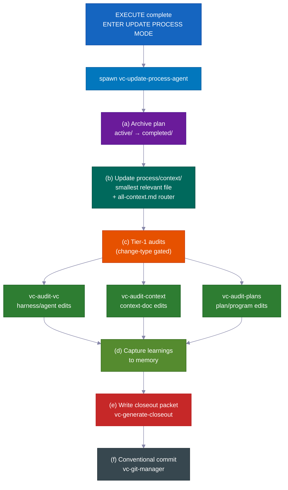

> 💡 `vc-update` zeigt eine Vorschau des Diffs und wartet auf Ihre Bestätigung. Ihr `process/`-Verzeichnis und projektspezifische Inhalte werden **niemals** stillschweigend geändert. Die Installation erneut auszuführen ist sicher.

---

## 💡 Weitere Gründe, warum es einfach funktioniert

Viele kleine, kluge Standardeinstellungen ergeben weniger Überwachungsaufwand und niedrigere Kosten.

- **Jede Rolle erhält nur die Werkzeuge, die sie braucht.** Während der Planung kann der Agent buchstäblich keinen Code bearbeiten — diese Werkzeuge sind abgeschaltet. Das hindert den Agenten daran, vorzupreschen und Dinge zu ändern, bevor der Plan genehmigt ist. Das System lässt es schlicht nicht zu.

- **Das Premium-KI-Modell wird nur dort eingesetzt, wo es zählt.** Das Schreiben von Code nutzt das Top-Modell. Planung, Recherche, Überprüfung und Prüfungen verwenden alle ein günstigeres, schnelleres Modell. Das Ergebnis: etwa 60–70 % niedrigere Kosten im Vergleich zum Einsatz des Top-Modells für alles — ohne Qualitätsverlust bei der wichtigen Arbeit.

- **Riskante Annahmen werden getestet, bevor darauf aufgebaut wird.** Wenn der Agent nicht sicher ist, ob etwas funktioniert — ein bestimmtes API-Verhalten, ein Bibliotheks-Feature, eine Infrastrukturannahme — führt er zuerst ein kleines echtes Experiment durch. Das Ergebnis ist klar: funktioniert, funktioniert nicht, oder unklar. Dieses Urteil und eine klartextliche Notiz fließen direkt in den Plan ein. Der Agent verbringt keine Stunden damit, auf einer falschen Annahme aufzubauen.

- **Ordentliche, aussagekräftige Sicherungspunkte.** Änderungen werden automatisch in sauberen, logischen Abschnitten mit klaren Nachrichten gespeichert. Die Historie ist leicht lesbar und lässt sich Stück für Stück rückgängig machen.

- **Hilfreiche automatische Erinnerungen.** Kleine eingebaute Helfer mahnen zu Dingen wie dem Ausführen der richtigen Prüfungen auf geänderten Dateien, dem Einfachhalten von Code und dem Schreiben einer ordentlichen Commit-Nachricht. Die Qualität bleibt hoch, ohne dass Sie sie überwachen müssen.

- **Die selbstverbessernde Schleife kann eigenständig laufen.** Dieselbe „Probleme finden, beheben, wiederholen"-Engine, die Plan-Prüfungen und Test-Korrekturen antreibt, funktioniert auch als eigenständiges Werkzeug für jeden unordentlichen Bereich — eine Spezifikation, die Docs, die Tests, eine Fehlerliste. Man braucht kein vollständiges Feature-Build, um es zu nutzen.

- **Eingebauter Nachweis, dass die Workflow-Regeln tatsächlich funktionieren.** Das Kit wird mit einer eigenen Test-Suite geliefert: ein Satz von Prüfungen mit bekannt-guten und bekannt-schlechten Beispielen, die beweisen, dass sich die Workflow-Regeln korrekt verhalten. Das System prüft sich selbst. Man muss nicht darauf vertrauen, dass die Leitplanken aktiv sind — man kann die Prüfungen ausführen und sehen.

---

## Mitwirken

Wir freuen uns über Beiträge! Siehe [CONTRIBUTING.md](CONTRIBUTING.md) für Richtlinien.

<br>

**Schnelllinks:**

- 🐛 [Fehler melden](https://github.com/withkynam/vibecode-pro-max-kit/issues/new?template=1.bug_report.yml)
- 💡 [Feature anfragen](https://github.com/withkynam/vibecode-pro-max-kit/issues/new?template=2.feature_request.yml)
- ⚡ [Skill einreichen](https://github.com/withkynam/vibecode-pro-max-kit/issues/new?template=3.skill_submission.yml)
- 🌐 [Übersetzung hinzufügen](https://github.com/withkynam/vibecode-pro-max-kit/issues/new?template=5.translation.yml)

<br>

<a href="https://github.com/withkynam/vibecode-pro-max-kit/graphs/contributors">
  
</a>

<br>

### 🙏 Danksagung

vibecode-pro-max-kit konzentriert sich auf das spezifikationsgesteuerte Entwicklungs-Framework und die selbstverbessernde Kontextorganisation, ohne Sie mit 80+ Skills zu überladen. Weniger Werkzeuge, mehr Struktur.

---

## ⭐ Star-Verlauf

<a href="https://star-history.com/#withkynam/vibecode-pro-max-kit&Date">
 <picture>
   <source media="(prefers-color-scheme: dark)" srcset="https://api.star-history.com/svg?repos=withkynam/vibecode-pro-max-kit&type=Date&theme=dark" />
   <source media="(prefers-color-scheme: light)" srcset="https://api.star-history.com/svg?repos=withkynam/vibecode-pro-max-kit&type=Date" />
   
 </picture>
</a>

---

## 📄 Lizenz

MIT
