<p align="center">
  <a href="../../README.md">English</a> |
  <a href="README.zh-CN.md">简体中文</a> |
  <a href="README.ja-JP.md">日本語</a> |
  <a href="README.ko-KR.md">한국어</a> |
  <a href="README.vi-VN.md">Tiếng Việt</a> |
  <a href="README.pt-BR.md">Português</a> |
  <strong>Español</strong> |
  <a href="README.de.md">Deutsch</a> |
  <a href="README.fr.md">Français</a> |
  <a href="README.hi.md">हिंदी</a>
</p>

<div align="center">

<a href="https://flowser.ai">
  
</a>

*Creado por ingenieros de clase mundial, para vibecoders en*<br>
*[flowser.ai](https://flowser.ai) — Agentes de IA con computadoras para GTM*

<br>

# vibecode-pro-max-kit

<br>

<p align="center">
  
  <br><br>
  <em>"Concentración Total — Respiración de Especificación, Décima Forma: el Flujo Vibe nunca se rompe."</em><br>
  <strong>— Tanjiro Kamado</strong>
</p>

*Añádelo a cualquier proyecto. Tu agente de IA obtiene un proceso de desarrollo completo orientado al plan — 7 fases con controles, bucles de autocorrección y piloto automático que funciona de inicio a fin sin perder el hilo.*

<table align="center">
<tr>
<td width="50%" valign="top"><strong>📦 Instalación en un solo comando</strong><br>Una línea con <code>curl</code> lo integra en cualquier proyecto. Detecta si eres nuevo o usuario habitual y nunca sobreescribe tus archivos.</td>
<td width="50%" valign="top"><strong>🌐 Funciona en todas partes</strong><br>Cualquier stack tecnológico, cualquier lenguaje y cualquier agente de código de IA: Claude Code, Codex, Cursor, Windsurf, Copilot y más.</td>
</tr>
<tr>
<td valign="top"><strong>🧭 Flujo de trabajo RIPER-5 orientado al plan</strong><br>7 fases con controles (Research → Spec → Innovate → Plan → Validate → Execute → Update-Process) evitan que el agente salte directamente al código.</td>
<td valign="top"><strong>🚀 Modo piloto automático (quick / fast / full)</strong><br>Inicia una ejecución sin intervención en cualquier fase con una sola frase. Tres carriles ajustan la formalidad al nivel de riesgo.</td>
</tr>
<tr>
<td valign="top"><strong>🎯 <code>/goal</code> — el token de ejecución continua</strong><br>Un bloque que se puede copiar y pegar mantiene al agente avanzando fase a fase sin detenerse — y retoma la ejecución en una sesión nueva.</td>
<td valign="top"><strong>🔁 Bucles de autocorrección PVL + EVL</strong><br>Los bucles de comprobación-y-corrección del plan y de las pruebas detectan errores, los corrigen y vuelven a verificar solos — hasta 10 ciclos cada uno.</td>
</tr>
<tr>
<td valign="top"><strong>🔍 vc-autoresearch</strong><br>Un bucle reutilizable de encontrar-errores → corregir → repetir que puedes aplicar a planes, pruebas, especificaciones, documentación o evaluaciones.</td>
<td valign="top"><strong>🧪 Sondas de viabilidad</strong><br>Veredictos de prueba-antes-de-construir (VIABLE / NOT-VIABLE) antes de que el agente se comprometa con cualquier enfoque de diseño.</td>
</tr>
<tr>
<td valign="top"><strong>🎛️ Selector de estrategia inteligente</strong><br>Antes de cada fase, evalúa un agente versus varios versus un equipo coordinado — con estimaciones de coste — y elige la opción más económica que se adapte.</td>
<td valign="top"><strong>🧮 Uso inteligente de modelos</strong><br>El modelo costoso solo escribe código; el modelo más económico hace todo lo demás. Menor coste, misma calidad.</td>
</tr>
<tr>
<td valign="top"><strong>🤔 Aclaración de intención</strong><br>Cuando una solicitud es vaga, el agente hace unas pocas preguntas concretas al inicio en lugar de adivinar y construir algo incorrecto.</td>
<td valign="top"><strong>🛡️ 36 validadores</strong><br>Verificaciones mecánicas de corrección — no opiniones — protegen la estructura propia del kit y detectan desviaciones antes de que lleguen a producción.</td>
</tr>
<tr>
<td valign="top"><strong>🏗️ Programas de fases</strong><br>Los proyectos grandes se dividen en fases independientes con controles de calidad entre ellas, para que el trabajo grande no se derrumbe.</td>
<td valign="top"><strong>🔀 Programas que se reorganizan solos</strong><br>A medida que aprende, el agente inserta nuevas fases, reordena el trabajo y omite pasos bloqueados — el plan se adapta sobre la marcha.</td>
</tr>
<tr>
<td valign="top"><strong>🧠 Nunca pierde el hilo</strong><br>El progreso se escribe en disco en cada fase, por lo que una ejecución sobrevive a un reinicio de memoria y retoma exactamente donde lo dejó.</td>
<td valign="top"><strong>📚 Memoria de proyecto que mejora sola</strong><br>Aprende tu base de código en la configuración inicial y mantiene sus propias notas compartidas actualizadas tras cada entrega, para que la documentación nunca quede desfasada.</td>
</tr>
<tr>
<td valign="top"><strong>⚡ Quick Fix + Fast Mode</strong><br>Carriles ligeros para cambios pequeños que omiten la formalidad completa, para que una corrección de una línea siga siendo una corrección de una línea.</td>
<td valign="top"><strong>🧱 Habilidades organizadas y autodescubiertas</strong><br>Las habilidades están organizadas en capas claras y se descubren automáticamente — el agente siempre encuentra la herramienta adecuada para cada paso.</td>
</tr>
<tr>
<td valign="top"><strong>🤖 15 agentes · 33 habilidades · 10 hooks</strong><br>Un equipo completo de agentes especializados, habilidades reutilizables y hooks de seguridad, todos conectados desde el primer momento.</td>
<td valign="top"><strong>🔄 Ciclo de vida completo del kit</strong><br>Instalar, configurar, actualizar y publicar son un solo comando cada uno — manteniendo todos los proyectos en la versión más reciente del kit de forma segura.</td>
</tr>
<tr>
<td valign="top"><strong>📝 SPEC — tu aprobación en lenguaje sencillo</strong><br>Antes de cualquier diseño, describes lo que hay que construir en historias de usuario simples — el momento más económico para detectar malentendidos.</td>
<td valign="top"><strong>🎯 Siempre verifica tu intención</strong><br>Cada fase posterior se mide contra tu SPEC: ¿lo que estamos construyendo es realmente lo que pediste?</td>
</tr>
</table>

<p>
  <a href="https://github.com/withkynam/vibecode-pro-max-kit/stargazers"></a>
  <a href="https://github.com/withkynam/vibecode-pro-max-kit/network/members"></a>
  <a href="LICENSE"></a>
  <a href="https://github.com/withkynam/vibecode-pro-max-kit/graphs/contributors"></a>
  <a href="https://github.com/withkynam/vibecode-pro-max-kit/actions/workflows/validate.yml"></a>
  <a href="CHANGELOG.md"></a>
  
  
  
  
</p>

<p>
  <strong>El kit de desarrollo más simple, flexible y apto para equipos, para</strong><br><br>
  <a href="https://github.com/anthropics/claude-code"></a>&nbsp;
  <a href="https://github.com/openai/codex"></a>&nbsp;
  <a href="https://cursor.com"></a>&nbsp;
  <a href="https://windsurf.com"></a><br>
  <a href="https://github.com/google-gemini/gemini-cli"></a>&nbsp;
  <a href="https://github.com/opencode-ai/opencode"></a>&nbsp;
  <a href="https://github.com/features/copilot"></a>
</p>

<p>
  <em>Funciona con cualquier stack tecnológico, cualquier lenguaje, cualquier proyecto</em><br><br>
  <picture>
    <source media="(prefers-color-scheme: dark)" srcset="https://skillicons.dev/icons?i=ts%2Cjs%2Creact%2Cnextjs%2Cvue%2Cnuxt%2Csvelte%2Cangular%2Cnodejs%2Cexpress%2Cbun%2Cpython%2Cdjango%2Cflask%2Cfastapi&theme=dark&perline=15" />
    <source media="(prefers-color-scheme: light)" srcset="https://skillicons.dev/icons?i=ts%2Cjs%2Creact%2Cnextjs%2Cvue%2Cnuxt%2Csvelte%2Cangular%2Cnodejs%2Cexpress%2Cbun%2Cpython%2Cdjango%2Cflask%2Cfastapi&theme=light&perline=15" />
    
  </picture>
  <br>
  <picture>
    <source media="(prefers-color-scheme: dark)" srcset="https://skillicons.dev/icons?i=ruby%2Crails%2Cgo%2Crust%2Cjava%2Cspring%2Ckotlin%2Cswift%2Cphp%2Claravel%2Ccs%2Cdotnet%2Celixir%2Cgraphql%2Cprisma&theme=dark&perline=15" />
    <source media="(prefers-color-scheme: light)" srcset="https://skillicons.dev/icons?i=ruby%2Crails%2Cgo%2Crust%2Cjava%2Cspring%2Ckotlin%2Cswift%2Cphp%2Claravel%2Ccs%2Cdotnet%2Celixir%2Cgraphql%2Cprisma&theme=light&perline=15" />
    
  </picture>
  <br>
  <picture>
    <source media="(prefers-color-scheme: dark)" srcset="https://skillicons.dev/icons?i=supabase%2Cfirebase%2Cpostgres%2Cmongodb%2Credis%2Cdocker%2Ckubernetes%2Caws%2Cgcp%2Cazure%2Cvercel%2Ccloudflare%2Ctailwind%2Celectron&theme=dark&perline=15" />
    <source media="(prefers-color-scheme: light)" srcset="https://skillicons.dev/icons?i=supabase%2Cfirebase%2Cpostgres%2Cmongodb%2Credis%2Cdocker%2Ckubernetes%2Caws%2Cgcp%2Cazure%2Cvercel%2Ccloudflare%2Ctailwind%2Celectron&theme=light&perline=15" />
    
  </picture>
  <br>
  <p><em>No es solo decorativo. Cuando ejecutas <code>vc-setup</code>, los agentes escanean tu base de código,<br>
  detectan tu stack y construyen grupos de conocimiento específicos del proyecto que cada habilidad lee antes de actuar.<br>
  Otros harnesses bloquean a los agentes en un solo lenguaje — <code>rust-review-agent</code>, <code>python-linter</code> — inútiles en otro contexto.<br>
  Este se adapta a cualquier combinación de las anteriores y acumula conocimiento a medida que entregas.</em></p>
</p>

</div>

---

## ⚡ Empieza Ya — Un Comando, 30 Segundos

> **Requisitos previos:** Node.js ≥ 22, git, bash (macOS / Linux / WSL; en Alpine: `apk add bash`).

**Hay un solo comando y funciona para todos.** Ejecútalo dentro de la carpeta de tu proyecto. Detecta si eres usuario nuevo o habitual, instala de forma segura sin sobreescribir tus archivos y luego *te dice exactamente qué hacer a continuación.*

```bash
curl -fsSL https://raw.githubusercontent.com/withkynam/vibecode-pro-max-kit/main/install.sh | bash
```

Cuando termine, muestra uno de dos mensajes — **lee el final de la salida y haz exactamente lo que indica:**

<table>
<tr>
<td width="50%" valign="top">
<h3>🆕 Proyecto nuevo</h3>
El instalador detecta que no hay harness y muestra:
<br><br>
<code>Next: Run: claude → Say: "Run vc-setup"</code>
<br><br>
<strong>→ Abre tu agente y di <code>Run vc-setup</code></strong>
<br><br>
<sub>vc-setup detecta tu stack tecnológico, crea la carpeta <code>process/</code>, escanea tu base de código y rellena tu arquitectura <em>real</em>, convenciones y comandos de prueba — una conversación, no una lista de comprobación.</sub>
</td>
<td width="50%" valign="top">
<h3>🔄 Harness existente (actualización)</h3>
El instalador detecta una instalación previa y muestra:
<br><br>
<code>Next (upgrade detected): Run: claude → Say: "Run vc-update"</code>
<br><br>
<strong>→ Abre tu agente y di <code>Run vc-update</code></strong>
<br><br>
<sub>vc-update descarga la versión más reciente y, si encuentra planes o carpetas en formato antiguo, te da un prompt listo para pegar que completa la migración con <strong>cero pérdida de datos</strong>. Tu carpeta <code>process/</code> nunca se toca.</sub>
</td>
</tr>
</table>

> 💡 **Nunca tendrás que adivinar el comando.** `install.sh` te dirige: nuevo → `vc-setup`, actualización → `vc-update`. Volver a ejecutar la instalación siempre es seguro — nunca rompe nada. **Usuarios de Codex:** ejecuta `/vc-setup` (o `/vc-update`) en lugar de decirlo en el chat.

<br>

<details>
<summary><strong>📦 Qué instala en disco (no destructivo)</strong></summary>

<br>

```
your-project/
├── .claude/
│   ├── agents/              # 🤖 15 agent definitions (.md)
│   ├── skills/              # ⚡ 33 skills (each a dir with SKILL.md)
│   └── hooks/               # 🪝 10 lifecycle hooks (.cjs / .mjs)
├── .codex/agents/           # 🔄 Mirrored agents for Codex
├── .agents/skills →         # 🔗 Symlink to .claude/skills (Codex discovery)
├── CLAUDE.md                # 📋 Orchestrator + routing rules
├── AGENTS.md                # 📖 Agent + skill registry (cross-tool)
└── process/
    └── development-protocols/  # 📜 22 shared workflow docs (seeded by install)
                                #    context/, plans, features → built by vc-setup
```

- **No destructivo.** Tus `.claude/skills/`, `.claude/agents/`, `process/` y `settings.json` existentes nunca se borran. Solo se escriben o actualizan los archivos propiedad del kit.
- **¿Configuración existente?** Se respalda en `.vibecode-backup/`; tu `settings.json` se restaura después.
- **¿`CLAUDE.md` existente?** Se respalda como `CLAUDE.md.pre-vibecode`.
- **¿`process/` existente?** La instalación nunca lo toca — `vc-setup` / `vc-update` lo migran de forma interactiva, mostrándote primero las diferencias.

> **Advertencia en la primera instalación:** si tienes habilidades o agentes personalizados cuyos nombres comienzan con `vc-` (el espacio de nombres reservado del kit) y *nunca* has ejecutado la instalación antes, el paso de eliminación de elementos obsoletos podría marcarlos. Tras la instalación, ejecuta `ls .claude/skills/ .claude/agents/` para confirmarlo. Usa un prefijo distinto de `vc-` (`my-`, `team-`, `proj-`) para tus propias adiciones y evitar esto por completo.

</details>

<details>
<summary><strong>🤖 ¿Prefieres configurarlo desde tu agente? (prompt completo)</strong></summary>

<br>

> Abre Claude Code o Codex **con la carpeta de tu proyecto como directorio de trabajo** y luego pega:

```
First, install the vibecode-pro-max-kit agent harness by running this command:

curl -fsSL https://raw.githubusercontent.com/withkynam/vibecode-pro-max-kit/main/install.sh | bash

After install completes, run vc-setup and follow the full interactive flow:

1. DETECT — Read package.json (or go.mod, Cargo.toml, pyproject.toml, etc.), detect my
   stack: framework, package manager, monorepo structure, test framework, database, auth.
   Also check for any existing .claude/, process/, or context files.
2. SHOW ME WHAT YOU FOUND — Summarize detection and wait for me to confirm. If this is an
   existing project, tell me what looks good vs what could be improved.
3. ASK ME ABOUT THE PROJECT — Have a real conversation. Ask follow-ups, probe anything
   vague, keep going until you genuinely understand it. Summarize back and confirm.
4. SCAFFOLD — Create the process/ directory. If process/ already exists, show me the plan
   and wait for approval. Never silently move or delete my files.
5. STUDY — Deep-scan and populate process/context/all-context.md with REAL content: repo
   structure, stack + versions, patterns, import aliases, env vars, routes, schema, tests.
   No placeholder text.
6. VALIDATE — Run all validation checks to confirm everything is wired correctly.

Rules: read and preserve good existing context; show me a summary before each major change
and wait for my OK; never create empty placeholder files; ask before reorganizing.
```

</details>

<details>
<summary>Tabla de contenidos</summary>

- [De un vistazo](#-de-un-vistazo) · [El problema](#-el-problema) · [La solución](#-la-solución)
- [La revolución del Vibe Coding](#la-revolución-del-vibe-coding) · [Para quién es esto](#para-quién-es-esto) · [Cómo se compara](#cómo-se-compara) · [Qué lo hace diferente](#-qué-lo-hace-diferente)
- [Cómo funciona: el coordinador](#-cómo-funciona--el-coordinador) · [El ciclo de vida RIPER-5](#-el-ciclo-de-vida-riper-5) · [Aclaración de intención](#-aclaración-de-intención)
- [Los dos bucles de calidad (PVL + EVL)](#-los-dos-bucles-de-calidad--pvl--evl) · [Comparación de estrategias + política de modelos](#-comparación-de-estrategias--política-de-modelos) · [Modo piloto automático](#-modo-piloto-automático--riper-5-sin-intervención) · [Sondas de viabilidad + validadores](#-sondas-de-viabilidad--la-red-de-seguridad-de-validadores)
- [Sistemas de seguridad integrados](#-sistemas-de-seguridad-integrados) · [Inteligencia previa a la implementación](#-inteligencia-previa-a-la-implementación) · [Cadena de calidad](#-cadena-de-calidad--integrada-en-la-ejecución)
- [Ciclo de vida del plan](#-el-ciclo-de-vida-del-plan) · [Programas de fases](#-programas-de-fases--proyectos-grandes-que-no-se-derrumban) · [Grupos de contexto](#-grupos-de-contexto) · [Carpetas de funcionalidades](#-carpetas-de-funcionalidades) · [Capas de habilidades](#-capas-de-habilidades) · [Memoria que mejora sola](#-memoria-de-proyecto-que-mejora-sola)
- [Qué incluye](#-qué-incluye) · [Quick Fix + Fast Mode](#-quick-fix--fast-mode) · [Ciclo de vida del kit](#-ciclo-de-vida-del-kit-install--setup--update--publish) · [Contribuir](#contribuir)

</details>

---

## 🎁 De un Vistazo

<table>
<tr>
<td align="center" width="25%" valign="top"><h1>🤖</h1><h3>15</h3><strong>Agentes</strong><br><sub>Uno por fase + 6 agentes especialistas</sub></td>
<td align="center" width="25%" valign="top"><h1>⚡</h1><h3>33</h3><strong>Habilidades</strong><br><sub>20 de flujo de trabajo + 13 de ayuda, asociadas por palabra clave</sub></td>
<td align="center" width="25%" valign="top"><h1>🪝</h1><h3>10</h3><strong>Hooks</strong><br><sub>Barreras de seguridad + carga automática de contexto</sub></td>
<td align="center" width="25%" valign="top"><h1>📜</h1><h3>22</h3><strong>Protocolos</strong><br><sub>Reglas compartidas que sigue cada agente</sub></td>
</tr>
<tr>
<td align="center" width="25%" valign="top"><h1>🛡️</h1><h3>36</h3><strong>Validadores</strong><br><sub>Verificaciones automáticas que detectan errores antes de que lleguen a producción</sub></td>
<td align="center" width="25%" valign="top"><h1>🔧</h1><h3>7</h3><strong>Herramientas</strong><br><sub>Claude Code · Codex · Cursor · Windsurf · Antigravity · OpenCode · Copilot</sub></td>
<td align="center" width="25%" valign="top"><h1>🌍</h1><h3>10</h3><strong>Idiomas</strong><br><sub>EN · 中文 · 日本語 · 한국어 · VI · PT · DE · FR · ES · हिन्दी</sub></td>
<td align="center" width="25%" valign="top"><h1>⚡</h1><h3>30s</h3><strong>Instalación</strong><br><sub>Un comando, luego tu agente guía el resto</sub></td>
</tr>
<tr>
<td align="center" width="25%" valign="top"><h1>🛩️</h1><strong>Piloto automático</strong><br><sub>3 carriles (quick / fast / full) — arranca en cualquier fase, funciona de inicio a fin sin parar</sub></td>
<td align="center" width="25%" valign="top"><h1>📌</h1><strong>Bloques /goal</strong><br><sub>Textos cortos que se copian y pegan para retomar ejecuciones sin intervención entre sesiones tras un reinicio</sub></td>
<td align="center" width="25%" valign="top"><h1>🔁</h1><strong>vc-autoresearch</strong><br><sub>Bucle de encontrar-errores → corregir → repetir (herramienta compartida para planes, pruebas y evaluaciones)</sub></td>
<td align="center" width="25%" valign="top"><h1>🔬</h1><strong>Sondas de viabilidad</strong><br><sub>Veredictos de prueba-antes-de-construir (VIABLE / NOT-VIABLE) antes de comprometerse con un diseño</sub></td>
</tr>
</table>

---

## 🔥 El Problema

Le pides a Claude que "añada soporte para webhooks". Inmediatamente empieza a escribir código. Sin preguntas sobre tu arquitectura. Sin revisar los patrones existentes. Sin plan. Obtienes 400 líneas que no encajan en tu base de código y te pasas una hora arreglándolo.

**Pero eso es solo la superficie.** Los problemas más profundos duelen más:

<table>
<tr>
<td width="50%" valign="top">
<h1>🧠</h1>
<strong>El contexto muere en cada sesión</strong><br><br>
Tu agente olvida todo lo que aprendió. Los mismos errores, las mismas preguntas, cada vez. Sin memoria, sin conocimiento acumulado.
</td>
<td width="50%" valign="top">
<h1>📄</h1>
<strong>La documentación queda obsoleta al instante</strong><br><br>
Escribiste buena documentación de contexto la semana pasada. Ya está desactualizada. Nada la actualiza automáticamente a medida que evoluciona la base de código.
</td>
</tr>
<tr>
<td width="50%" valign="top">
<h1>💥</h1>
<strong>Las tareas grandes colapsan a mitad de camino</strong><br><br>
La ventana de contexto se llena, el estado se pierde y el agente empieza a alucinar. Reinicias desde cero en la hora 3.
</td>
<td width="50%" valign="top">
<h1>🤝</h1>
<strong>Sin especificaciones, sin revisión, sin colaboración</strong><br><br>
Tu PM no puede revisar lo que el agente está a punto de construir. No hay un plan escrito para compartir, discutir o aprobar antes de escribir el código.
</td>
</tr>
<tr>
<td width="50%" valign="top">
<h1>🎭</h1>
<strong>Las decisiones de arquitectura se inventan</strong><br><br>
El agente inventa patrones en lugar de investigar cómo otras bases de código resolvieron el mismo problema.
</td>
<td width="50%" valign="top">
<h1>🚀</h1>
<strong>Nadie verifica que esté "listo"</strong><br><br>
El agente dice "todas las pruebas pasan" — pero nunca las volvió a ejecutar de forma independiente. Te enteras en producción.
</td>
</tr>
</table>

**Tu agente tiene inteligencia pero no tiene proceso, no tiene memoria y no tiene manera de colaborar con tu equipo.** Tanto si eres desarrollador, PM o CEO que acaba de empezar con el vibe coding — esto afecta a todos de la misma manera, y la solución es la misma: **dale a tu agente un proceso de desarrollo real.**

---

## 🛠️ La Solución

Este kit instala un sistema de desarrollo completo en tu proyecto — no solo un `CLAUDE.md`, sino **15 agentes especializados, 33 habilidades, 10 hooks y 22 protocolos** — con un flujo de trabajo por fases que hace que tu agente **comprenda antes de construir, y demuestre antes de entregar.**

<br>

<table>
<tr>
<td align="center" width="50%" valign="top"><h1>📋</h1><strong>Enfoque orientado al plan</strong><br><br><sub>PMs y desarrolladores revisan el mismo plan escrito antes de escribir cualquier código</sub></td>
<td align="center" width="50%" valign="top"><h1>🔄</h1><strong>Conocimiento que mejora solo</strong><br><br><sub>Se actualiza cada vez que se entrega una funcionalidad — la documentación nunca queda obsoleta</sub></td>
</tr>
<tr>
<td align="center" width="50%" valign="top"><h1>⚡</h1><strong>Ejecución sin intervención</strong><br><br><sub>Sobrevive a los reinicios de sesión — funciona durante horas, no minutos</sub></td>
<td align="center" width="50%" valign="top"><h1>🧬</h1><strong>Investigación de arquitectura</strong><br><br><sub>Estudia bases de código reales antes de tomar decisiones de diseño</sub></td>
</tr>
<tr>
<td align="center" width="50%" valign="top"><h1>✅</h1><strong>Dos controles de calidad</strong><br><br><sub>Los planes se verifican antes de codificar; las pruebas se vuelven a ejecutar de forma independiente después</sub></td>
<td align="center" width="50%" valign="top"><h1>🧭</h1><strong>Enrutamiento inteligente de conocimiento</strong><br><br><sub>Carga solo lo que es relevante — no toda tu base de conocimiento cada vez</sub></td>
</tr>
</table>

<br>

### El flujo completo RIPER-5 — 7 fases, cada paso con control

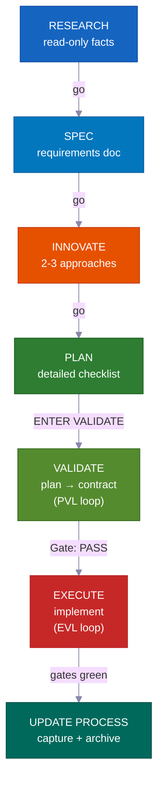

**En modo interactivo**, cada fase espera tu "go" antes de continuar — tú permaneces en el circuito en cada paso. **En modo piloto automático o /goal**, das la aprobación una vez al inicio y el sistema se dirige solo hasta el final. Solo se detiene en tres casos específicos que se indican a continuación. **VALIDATE** y la repetición de pruebas tras EXECUTE no son opcionales — son controles obligatorios que impiden que el trabajo deficiente llegue a producción — y se ejecutan automáticamente en ambos modos.

---

## La Revolución del Vibe Coding

<div align="center">
<h3><em>"El lenguaje de programación más popular nuevo es el inglés."</em></h3>
<strong>— Andrej Karpathy</strong>
</div>

<br>

**El vibe coding cambió quién puede construir software. El desarrollo orientado al plan cambia lo que pueden entregar.**

<table>
<tr>
<td align="center" width="50%"><h3>63%</h3><sub>de los usuarios de vibe coding <strong>NO</strong> son desarrolladores</sub></td>
<td align="center" width="50%"><h3>16.2M</h3><sub>desarrolladores ciudadanos en todo el mundo<br>(crecimiento interanual del 38%)</sub></td>
</tr>
<tr>
<td align="center" width="50%"><h3>$4.7B</h3><sub>mercado de vibe coding<br>creciendo un 38% anual</sub></td>
<td align="center" width="50%"><h3>25%</h3><sub>de las startups de YC W25 tenían bases de código con más del 95% generadas por IA</sub></td>
</tr>
</table>

La mayoría de las herramientas te ayudan a iniciar un proyecto. Este kit te ayuda a **terminarlo** — con planes que tu equipo puede revisar, conocimiento que nunca queda obsoleto y controles de seguridad que detectan errores antes de que lleguen a producción.

---

## ¿Para Quién Es Esto?

<div align="center">
<h3><em>"Lo importante no es quién lo escribió. Es lo que se entregó."</em></h3>
<strong>— Garry Tan, YC</strong>
</div>

<br>

<table>
<tr>
<td width="50%" valign="top">
<h1>🧑‍💼</h1>
<strong>CEO / Fundador</strong><br><br>
<em>"Construye un SaaS con autenticación, facturación y una página de aterrizaje"</em><br><br>
El agente investiga tu stack, escribe un plan de arquitectura que puedes revisar, implementa con pruebas y captura cada decisión para que tu cofundador técnico pueda auditarla más tarde.
</td>
<td width="50%" valign="top">
<h1>📊</h1>
<strong>Product Manager</strong><br><br>
<em>"Crea un panel que muestre MRR, churn y métricas de crecimiento"</em><br><br>
Genera un SPEC estilo PRD, obtiene tu aprobación antes de escribir código, implementa según lo acordado y archiva el plan como historial de proyecto consultable.
</td>
</tr>
<tr>
<td width="50%" valign="top">
<h1>🎨</h1>
<strong>Diseñador</strong><br><br>
<em>"Replica este mockup de Figma con precisión de pixel"</em><br><br>
El agente con conciencia de diseño analiza tu mockup, implementa componente a componente con tus tokens de diseño y lanza verificaciones de comparación visual.
</td>
<td width="50%" valign="top">
<h1>⚙️</h1>
<strong>Ingeniero</strong><br><br>
<em>"Refactoriza el módulo de autenticación para soportar RBAC sin tiempo de inactividad"</em><br><br>
Investiga tu código de autenticación actual y cómo otras bases de código resolvieron RBAC, escribe un plan de migración que indica qué archivos podrían verse afectados y luego lo construye de forma segura con notas de reversión.
</td>
</tr>
</table>

---

## Cómo Se Compara

| Funcionalidad | vibecode-pro-max-kit | Superpowers | GSD | gstack |
|---------|---------------------|-------------|-----|--------|
| Ciclo de vida orientado al plan | RIPER-5 completo (research → spec → innovate → plan → validate → execute → update) | Flujos de trabajo obligatorios | Corrección de deterioro de contexto | Parcial |
| Restricciones por fase | Las herramientas del agente están restringidas por fase (investigación de solo lectura, sin escritura en innovate) | Restricciones basadas en habilidades | Separación de fases | Ninguna |
| Bucles de control de calidad | **Dos** — PVL (verificar el plan) + EVL (volver a ejecutar pruebas de forma independiente) | Por habilidad | Ninguno automático | Ninguno |
| Soporte multi-herramienta | 7 herramientas mediante estándares abiertos `AGENTS.md` + `SKILL.md` | Plugin de Claude Code | 14 entornos de ejecución | 1 herramienta |
| Conocimiento que mejora solo | Conocimiento agrupado por tema, actualizado tras cada funcionalidad | Memoria de plugin | Estado persistente en disco | Manual |
| Colaboración en equipo | Planes, especificaciones y archivos de revisión compartidos | Individual | Individual | Individual |
| Sistema de habilidades | 33 autodescubiertas, asociadas por palabra clave en cada prompt | 86 habilidades componibles | Meta-prompting | 23 herramientas de rol |
| Proyectos grandes multifase | Planes globales + bucle interno por fase con verificaciones de regresión | Tarea única | Tarea única | Tarea única |
| Modo sin intervención | Piloto automático (3 carriles) + consentimiento permanente `/goal` | Manual | Manual | Manual |
| Instalación | 30s `curl` + configuración enrutada automáticamente | Marketplace de plugins | npx one-liner | git clone |

> **Sobre la amplitud de entornos:** GSD soporta 14 entornos de ejecución. Nosotros soportamos 7 en profundidad — con harnesses de agentes completos, descubrimiento de habilidades y hooks de ciclo de vida en cada plataforma. Amplitud frente a profundidad: tú decides.

---

## ⚡ Qué Lo Hace Diferente

<table>
<tr>
<td width="50%" valign="top">
<h1>🔒</h1>
<strong>Restricciones de herramientas por fase</strong><br><br>
Tu agente literalmente <strong>no puede</strong> escribir código durante la investigación. RESEARCH es de solo lectura, INNOVATE no tiene escritura, PLAN/VALIDATE solo escriben en <code>process/</code>. <strong>Límites de capacidad reales</strong>, no meras sugerencias.
</td>
<td width="50%" valign="top">
<h1>🎯</h1>
<strong>El agente principal nunca toca el código</strong><br><br>
El coordinador enruta, supervisa y dirige los bucles — <strong>nunca edita archivos fuente ni ejecuta pruebas por sí mismo</strong>. Cada edición y cada ejecución de prueba ocurre dentro de un subagente dedicado. Sin trabajo oculto.
</td>
</tr>
<tr>
<td width="50%" valign="top">
<h1>🔍</h1>
<strong>Descubrimiento automático de habilidades</strong><br><br>
Antes de gestionar cualquier solicitud, escanea <strong>33 habilidades</strong> y asocia palabras clave. Di "añade soporte para webhooks" y <code>vc-security</code> + <code>vc-scenario</code> se incorporan automáticamente.
</td>
<td width="50%" valign="top">
<h1>💾</h1>
<strong>Sobrevive a los reinicios de sesión</strong><br><br>
Planes, informes, documentación de conocimiento y aprendizajes viven en disco. El hook de inicio restaura los controles de aprobación tras un reinicio de sesión. <strong>No se pierde nada.</strong>
</td>
</tr>
<tr>
<td width="50%" valign="top">
<h1>🛡️</h1>
<strong>Guardia de fase autovigilante</strong><br><br>
Cuando el agente está a punto de saltarse un paso obligatorio, se detiene solo: <em>"PHASE JUMPING PREVENTED."</em> Una <strong>barrera integrada contra los atajos</strong>.
</td>
<td width="50%" valign="top">
<h1>🔄</h1>
<strong>Funciona con 7 herramientas de código IA</strong><br><br>
Dos estándares abiertos — <code>AGENTS.md</code> y <code>SKILL.md</code> — significan <strong>cero adaptadores, cero plugins.</strong> Empieza en Claude Code, cambia a Cursor, continúa en Codex.
</td>
</tr>
</table>

---

## 🧭 Cómo Funciona — El Coordinador

Tu sesión principal es un **coordinador** (llamado el orquestador), no un trabajador. Hace cuatro cosas y nada más:

```
Tu solicitud
  → Step 0: Skill Discovery (scan 33 skills, match keywords, attach candidates)
  → Detectar intención (funcionalidad / error / pregunta / refactor / UI) + puntuar ambigüedad
  → Enrutar al agente correcto en una ventana de contexto nueva
  → Supervisar: cumplimiento de pasos, códigos de estado, gestión de bucles
```

<table>
<tr>
<td width="50%" valign="top">
<h1>🧑‍✈️</h1>
<strong>Delega, nunca implementa</strong><br><br>
Investigación → <code>vc-research-agent</code>. Plan → <code>vc-plan-agent</code>. Código → <code>vc-execute-agent</code>. El coordinador transfiere el contexto correcto y espera — nunca hace el trabajo real por sí mismo.
</td>
<td width="50%" valign="top">
<h1>🚫</h1>
<strong>Sin ejecución oculta — nunca</strong><br><br>
En el momento en que existe un plan con una lista de verificación acordada, "ENTER EXECUTE MODE" <strong>siempre</strong> lanza <code>vc-execute-agent</code>. Incluso una corrección de una línea pasa por él. Las pruebas solo se ejecutan dentro de un <code>vc-tester</code> dedicado. Esto se mantiene independientemente del tamaño del cambio.
</td>
</tr>
<tr>
<td width="50%" valign="top">
<h1>📨</h1>
<strong>Códigos de estado claros, no señales vagas</strong><br><br>
Cada subagente termina con uno de: <code>DONE</code> · <code>DONE_WITH_CONCERNS</code> · <code>BLOCKED</code> · <code>NEEDS_CONTEXT</code>. El coordinador nunca ignora un bloqueo y nunca reintenta el mismo enfoque bloqueado tres veces.
</td>
<td width="50%" valign="top">
<h1>🔁</h1>
<strong>Gestiona los bucles de corrección</strong><br><br>
Los subagentes se ejecutan una vez, reportan un resultado y se detienen. Solo el coordinador los vuelve a lanzar. Gestiona tanto el bucle PVL (verificar-y-corregir el plan) como el EVL (verificar-y-corregir las pruebas) y mantiene todo el seguimiento.
</td>
</tr>
</table>

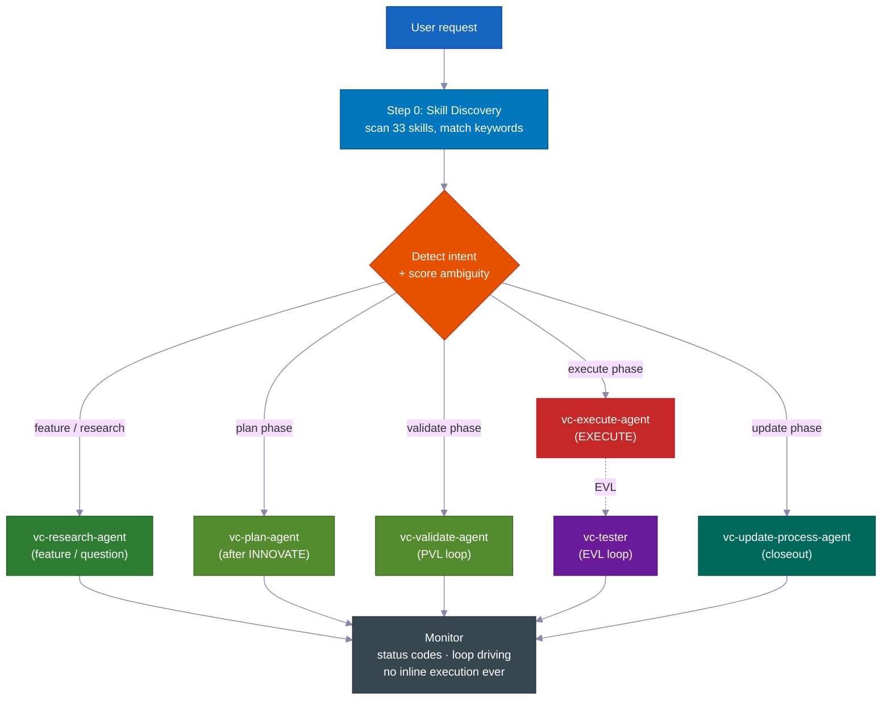

> **Por qué importa:** un agente que puede tanto decidir *como* editar en secreto encontrará la manera de saltarse el plan. Al separar el coordinador de los trabajadores (subagentes), el proceso se vuelve estructuralmente honesto — la única manera de escribir código es pasar por los pasos obligatorios.

---
## 📊 El ciclo de vida RIPER-5

| Fase | Qué ocurre | Agente | Usted dice |
|-------|-------------|-------|---------|
| 🔍 **RESEARCH** | Recopilación de información de solo lectura — código base y web. No modifica archivos. | `vc-research-agent` | *(automático en solicitudes de funcionalidades)* |
| 📝 **SPEC** | Documento de requisitos de descubrimiento de producto — historias de usuario, criterios de aceptación, fuera de alcance — para **su revisión antes de cualquier diseño**. | `vc-spec-agent` | `go` / `ENTER SPEC MODE` |
| 💡 **INNOVATE** | Exploración de 2-3 enfoques con sus ventajas y desventajas. Resumen de decisión (elegido + rechazados + por qué). | `vc-innovate-agent` | `go` |
| 📋 **PLAN** | Redacción de la especificación detallada: puntos de contacto, contratos públicos, qué archivos puede tocar, evidencia de verificación, resumen de retomada. | `vc-plan-agent` | `go` |
| ✅ **VALIDATE** | Convertir el plan en una lista de verificación acordada (puntos de control V1–V7). Veredicto: **PASS / CONDITIONAL / BLOCKED**. Ejecuta el bucle PVL. | `vc-validate-agent` | `ENTER VALIDATE MODE` |
| ⚡ **EXECUTE** | Implementar *exactamente* el plan. Notas de progreso en el informe de fase, protocolo de desviación, autorrevisión. Luego el bucle EVL vuelve a ejecutar los puntos de control. | `vc-execute-agent` | `ENTER EXECUTE MODE` |
| 🧠 **UPDATE PROCESS** | Registrar aprendizajes, actualizar contexto, archivar el plan, redactar el paquete de cierre. | `vc-update-process-agent` | *(recomendado después de trabajo no trivial)* |

> 📝 **Por qué SPEC es su propia fase:** la mayoría de los sistemas pasan de "comprender" a "diseñar" directamente. Insertar un paso de SPEC de descubrimiento de producto significa que *usted* (o su gestor de producto) da el visto bueno a **qué** se va a construir — en historias de usuario e criterios de aceptación sencillos — *antes* de que el agente debata el **cómo**. Es el lugar más barato posible para detectar un malentendido. (Dentro del bucle interno de un programa de fases, SPEC se omite — la SPEC general rige todas las fases.)
>
> **La SPEC es la vara de medir.** Establece el comportamiento esperado en términos simples que se pueden revisar en un minuto. Cada fase posterior — Innovate, Plan, Validate, Execute — se remite a ella y formula la misma pregunta: *¿lo que estamos construyendo es realmente lo que usted pidió?* Cuando el trabajo empieza a desviarse, la SPEC es lo que lo detecta.

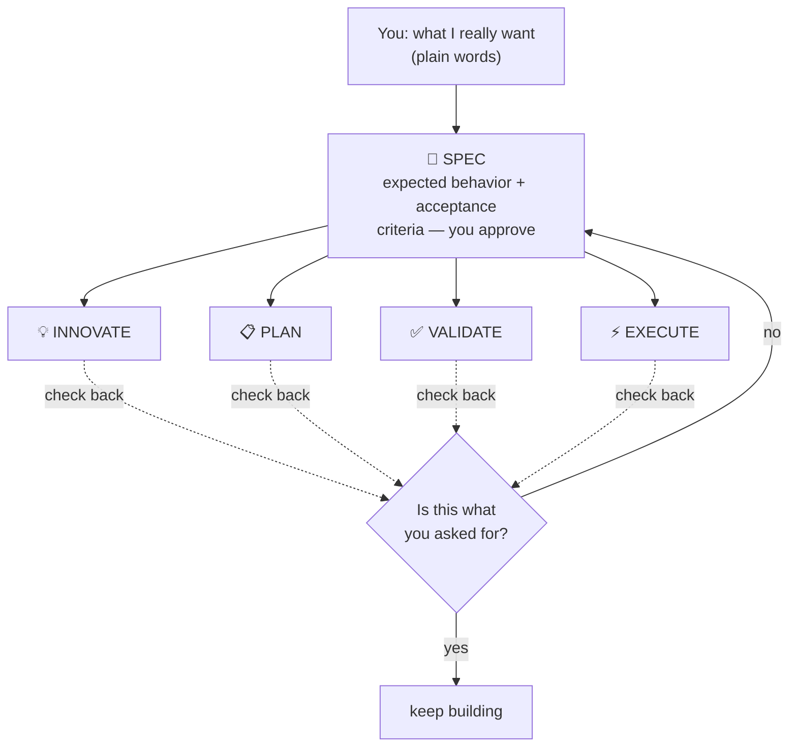

<br>

### 💻 Sesiones de ejemplo

```
# 🆕 Feature request
You: "add webhook support to the API"
→ Skill discovery surfaces: vc-scenario, vc-security
→ research-agent gathers context (read-only, can't touch code)
→ "go" → spec-agent writes requirements doc → you approve
→ "go" → innovate-agent compares approaches → decision summary
→ "go" → plan-agent writes the plan, listing which files it will touch
→ "ENTER VALIDATE MODE" → validate-agent gates the plan (PVL loop) → Gate: PASS
→ "ENTER EXECUTE MODE" → execute-agent implements → tester re-runs gates (EVL) → reviewer → git-manager
→ Closeout packet: what changed, what's verified, recommended next step
```

```
# 🐛 Bug fix
You: "login redirect is broken"
→ Routes to vc-debugger → gathers evidence FIRST → 2-3 competing hypotheses
→ Systematically eliminates each → root cause with proof chain
→ execute-agent implements the fix → EVL re-test → quality pipeline
```

```
# ⏩ Fast mode
You: "ENTER FAST MODE - add rate limiting middleware"
→ Compressed RESEARCH + SPEC + INNOVATE + PLAN + VALIDATE in one pass
→ Mandatory safety pause after VALIDATE → you review → "ENTER EXECUTE MODE"
```

```
# 🤖 Autopilot (hands-free)
You: "autopilot full: build a notifications system"
→ ONE consolidated clarification round → provisional /goal block (standing consent)
→ Drives the full RIPER-5 sequence autonomously, pausing only on hard stops
```

```
# 🏗️ Large program
You: "build a full testing platform"
→ Umbrella plan + phase plans in a feature folder
→ Each phase inner loop: research → innovate → plan → PVL → execute → EVL → update
→ Progress survives context compaction — durable reports on disk
```

---

## 🎯 Clarificación de intención

Antes de enrutar, el agente principal puntúa la ambigüedad de su solicitud en **4 señales binarias (0–4)** y elige un nivel. Hace preguntas *solo cuando realmente cambiarían lo que va a hacer.*

| Nivel | Cuándo | Comportamiento |
|---|---|---|
| **Nivel 0** — enrutamiento automático silencioso | Puntuación 0–1, o usted dijo "go" / "just do it", o retomando un plan | Enruta inmediatamente, sin preguntas |
| **Nivel 1** — resumen en línea | Puntuación 2 | Expone su comprensión y la ruta elegida en una línea, y continúa |
| **Nivel 2** — preguntas | Puntuación 3+ | Formula preguntas de opción múltiple enfocadas antes de enrutar |

> 🧠 **Dos rondas como máximo.** Si tras el Nivel 2 persiste la ambigüedad, formula una última pregunta directa y después recurre de manera predeterminada a la investigación con el alcance más acotado posible. Nunca repite la clarificación indefinidamente. Tras RESEARCH, vuelve a verificar la intención — si la investigación muestra que la solicitud era distinta a lo supuesto, la vuelve a presentar; si se confirma, continúa sin preguntar de nuevo.

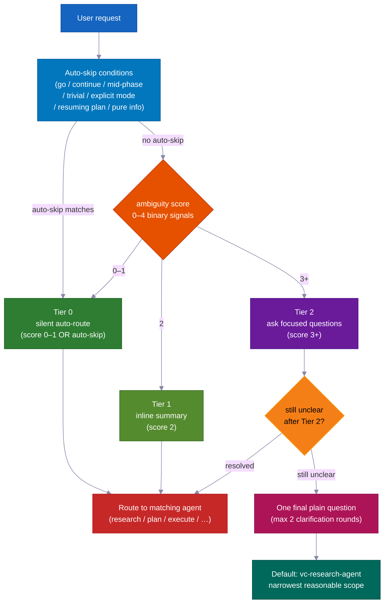

---

## ✅ Los dos bucles de calidad — PVL + EVL

La mayoría de los sistemas verifican *una vez*, si es que lo hacen. Este envuelve EXECUTE en **dos bucles independientes** — uno antes de escribir código, otro después.

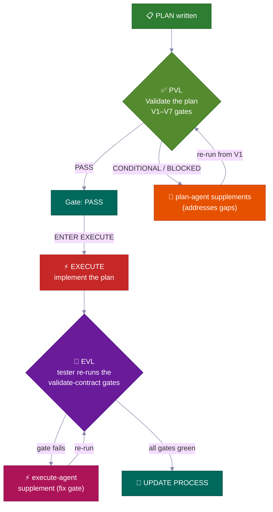

<table>
<tr>
<td width="50%" valign="top">
<h3>📋 PVL — Plan-Validate-Fix</h3>
Antes de EXECUTE, <code>vc-validate-agent</code> somete el plan a <strong>puntos de control V1–V7</strong> — distribuyendo el trabajo entre varios agentes para cubrir infraestructura, cobertura de pruebas, cambios disruptivos, seguridad y viabilidad por sección. Un <strong>CONDITIONAL</strong> o <strong>BLOCKED</strong> en el primer pase nunca es el final — regresa a <code>vc-plan-agent</code> para actualizar el plan y luego vuelve a verificar desde V1.
<br><br>
<sub>Gestionado por <code>vc-autoresearch</code> (dominio: plan) — un bucle de búsqueda y corrección de brechas. Límite de 10 ciclos. Detección de estancamiento. Solo <strong>Gate: PASS</strong> (o un CONDITIONAL que usted acepte explícitamente) desbloquea EXECUTE.</sub>
</td>
<td width="50%" valign="top">
<h3>🧪 EVL — Execute-Validate-Fix</h3>
Cuando EXECUTE informa que ha terminado — <strong>incluso cuando asegura que todos los puntos de control están en verde</strong> — el agente principal <strong>siempre</strong> lanza <code>vc-tester</code> para volver a ejecutar de forma independiente los comandos de prueba exactos de la lista acordada. Un punto de control fallido dirige a una corrección acotada de <code>vc-execute-agent</code>, y luego vuelve a probarse.
<br><br>
<sub>Gestionado por <code>vc-autoresearch</code> (dominio: tests). Límite de 10 ciclos. El bucle interno "iterar hasta verde" del propio execute-agent <strong>nunca</strong> sustituye esta confirmación independiente.</sub>
</td>
</tr>
</table>

> 💎 **La escala de veredictos:** **PASS** → continuar · **CONDITIONAL** → brechas subsanables; el bucle actúa (o usted las acepta de manera formal) · **BLOCKED** → un problema más profundo; vuelve a PLAN (en modo autopiloto: la brecha pasa a una lista de pendientes y la ejecución continúa).

### 🔁 vc-autoresearch — Motor de bucle compartido

Tanto PVL como EVL utilizan la misma capa de seguimiento: **`vc-autoresearch`** — un bucle de buscar brechas → corregir → repetir. El agente principal conduce el bucle — es dueño del contador de rondas, los informes por ronda, el registro TSV y las verificaciones de estancamiento, límite y regresión. Los agentes de trabajo son de tipo "lanzar y olvidar": devuelven un resultado y se detienen. Ningún agente se relanza a sí mismo ni lanza otro agente de fase.

El mismo motor puede funcionar de forma independiente: "reforzar esta especificación", "corregir todos los errores de lint", "mejorar la cobertura de pruebas", "mejorar esta documentación" — cualquier tarea repetida de búsqueda y corrección de brechas en 6 dominios (spec · tests · ux · docs · plan · errors).

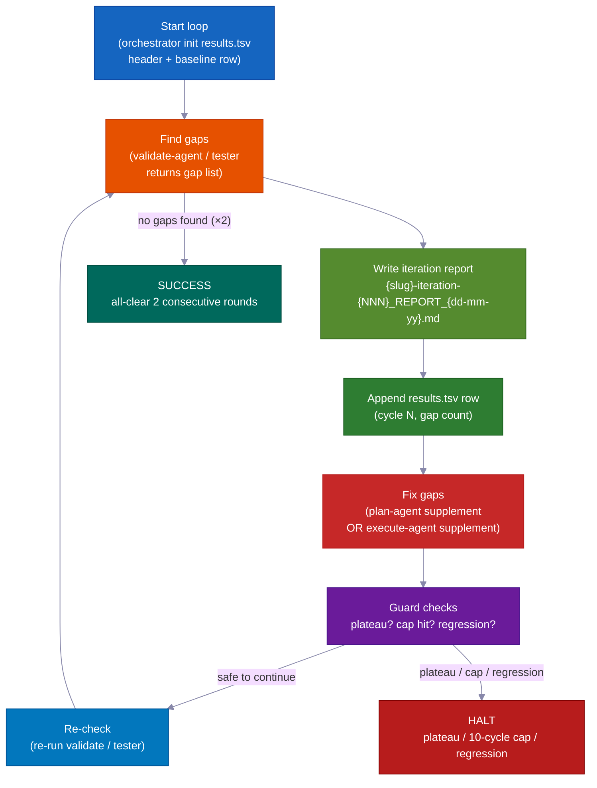

| Modo | Qué hace | Se detiene cuando |
|---|---|---|
| `vc-autoresearch` (núcleo) | busca brechas → corrige → repite | no se encuentran brechas O se alcanza el objetivo de la métrica |
| `vc-autoresearch:probe` | 8 personas interrogan el corpus hasta la saturación | no hay nuevas restricciones durante 3 rondas |
| `vc-autoresearch:reason` | debate adversarial con jueces ciegos | los jueces convergen o se alcanza el límite de iteraciones |
| `vc-autoresearch:evals` | analiza los resultados TSV — tendencias, estancamientos, recomendaciones | solo análisis |

**Condiciones de parada:** SUCCESS (todo despejado dos rondas seguidas) · HALT_PLATEAU (sin progreso durante 3 rondas) · HALT_CAP (límite estricto de 10 rondas) · HALT_REGRESSION (una verificación que pasaba ahora falla).

---

## 👥 Comparación de estrategias y política de modelos

En **cada transición de fase**, el agente principal invoca `vc-agent-strategy-compare` para recomendar *cómo* ejecutar la siguiente fase — con estimaciones de costo.

| Estrategia | Cuándo | Coordinación |
|---|---|---|
| **Secuencial** | El trabajo depende de la salida anterior | Un agente a la vez |
| **Subagentes en paralelo** | Dimensiones independientes, sin seguimiento posterior | Ninguna — el agente principal recoge y combina los resultados |
| **Flujo de trabajo** | División predecible del trabajo a través de una lista | Pasos programados |
| **Equipo de agentes** | Los agentes deben comunicarse entre sí durante la ejecución (p. ej., cada uno toca archivos separados en 3+ planes de fase) | TeamCreate + lista de tareas compartida + SendMessage |

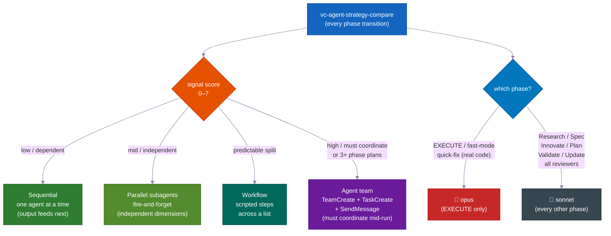

> ⚠️ **"Equipo de agentes" significa la maquinaria real** — compañeros de equipo con nombre, una lista de tareas compartida y mensajería entre agentes — *no* simples agentes en paralelo llamados "equipo". Es **obligatorio** (no opcional) para crear 3+ planes de fase y para ediciones de múltiples archivos en las que los agentes deben mantenerse cada uno en sus propios archivos. Solo un equipo verdadero puede comunicarse mientras trabaja.

### 🧮 Política de selección de modelos

| Fase | Modelo | Por qué |
|---|---|---|
| **EXECUTE** (+ fast-mode, quick-fix con código real) | 🔴 **opus** | Ediciones reales de código fuente, compilaciones, migraciones |
| Research · Spec · Innovate · Plan · Validate · Update · todos los revisores/investigadores | 🔵 **sonnet** | Planificación y análisis — más económico, completamente capaz |

> Cuando el trabajo se distribuye entre varios agentes, solo el agente de *codificación* usa opus. Cada revisor, investigador, validador y planificador usa sonnet. El agente principal indica el modelo cada vez que lanza un agente de trabajo.

---

## 🤖 Modo Autopiloto — RIPER-5 sin intervención

Diga **`autopilot [tarea]`** (o `run autopilot`, `autonomous mode`, `ENTER AUTOPILOT MODE`) y el agente ejecuta *toda* la secuencia RIPER-5 restante con **una** ronda de clarificación inicial — y luego no hay más pausas hasta que termina.

**Se activa en cualquier punto:** el autopiloto puede iniciarse al comienzo de una sesión *o* en cualquier momento durante la misma. Al activarse, el agente principal lee los archivos guardados en disco para determinar en qué fase de RIPER-5 se encuentra ya, y desde allí continúa y conduce el resto de manera autónoma.

| Estado en disco | Fase de entrada |
|---|---|
| Sin archivo SPEC | Comenzar en RESEARCH |
| Archivo SPEC presente | Saltar a post-SPEC (INNOVATE) |
| Archivo de plan presente | Saltar a post-PLAN (VALIDATE) |
| Contrato de validación con PASS/CONDITIONAL | Saltar a EXECUTE |

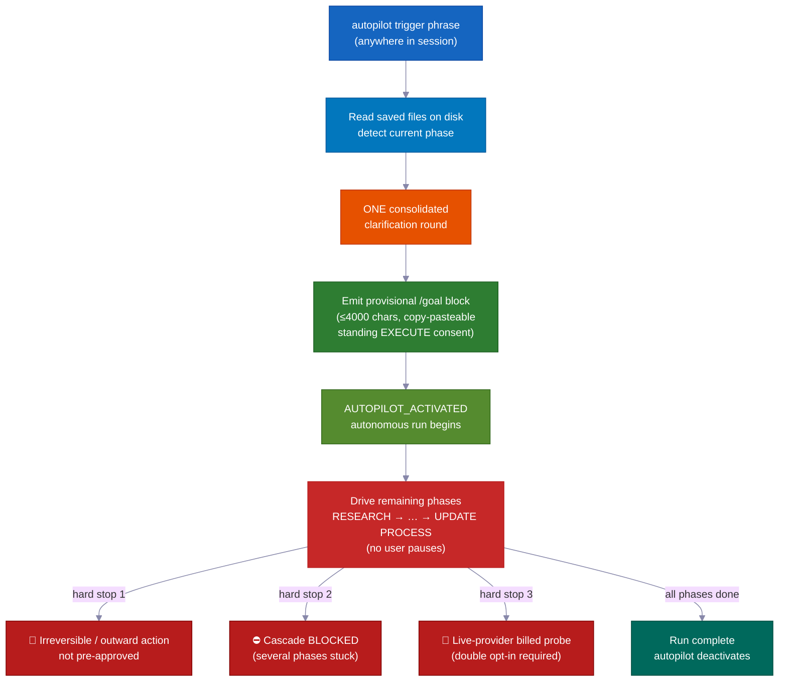

```
You: "autopilot full: add team invitations with email + role management"
→ Reads saved files → detects current phase → enters there
→ ONE consolidated clarification round (scope, hard stops, autonomy boundaries, first-phase strategy)
→ Provisional /goal block emitted (≤4000 chars, copy-pasteable, standing EXECUTE consent)
→ AUTOPILOT_ACTIVATED → drives remaining phases on its own
→ Stops ONLY for hard stops
```

### Tres modos — adapte el nivel de formalidad al riesgo

| Modo | Activación | Flujo |
|---|---|---|
| 🟢 **quick** | `autopilot quick: [tarea]` | Exploración → edición → verificación acotada. Sin plan, sin contrato, sin EVL. |
| 🟡 **fast** | `autopilot fast: [tarea]` | R→S→I→P→V comprimidos → EXECUTE + EVL. |
| 🔴 **full** | `autopilot [tarea]` / `autopilot full:` | RIPER-5 completo (predeterminado). |

### 🌙 Sin intervención: una frase, construido mientras usted duerme

Diga `autopilot full: [tarea]` — o pegue un bloque `/goal` — y todo lo siguiente ocurre con **cero intervención humana**:

- **Bucle de verificación y corrección del plan** — encuentra brechas en el plan, las corrige y vuelve a verificar. Hasta 10 rondas por sí solo.
- **Bucle de construcción, prueba y corrección** — escribe código, ejecuta pruebas, corrige fallos, vuelve a ejecutar. Hasta 10 rondas por sí solo. Nunca confía en su propio "todo en verde" — un verificador independiente (`vc-tester`) vuelve a ejecutar todas las pruebas de forma autónoma para confirmar.
- **Avance de fase en fase** — pasa de investigación a plan, de plan a código y de código a finalizado sin esperarle.
- **Retoma tras un reinicio de memoria** — los planes, informes y el progreso se guardan como archivos en disco. Tras la compactación (cuando la memoria a corto plazo de la IA se borra), la siguiente sesión lee esos archivos y continúa exactamente donde se quedó.
- **¿Funcionalidad bloqueada? La pospone y sigue adelante** — si una fase no puede resolverse, el agente escribe una nota en la lista de pendientes y avanza a la siguiente funcionalidad. Puede ejecutar muchas funcionalidades en paralelo sin que un bloqueador lo detenga todo.
- **Equipos de agentes para funcionalidades en paralelo** — varios agentes pueden construir funcionalidades separadas al mismo tiempo, cada uno limitado a sus propios archivos para que nunca colisionen. Una funcionalidad bloqueada queda apartada, no bloquea al resto.

### Las paradas de emergencia siempre se muestran (incluso en autopiloto)

Estas son las **únicas tres veces que se detiene y le pregunta**:

- 🛑 Cualquier cosa que no pueda deshacer, o que alcance el mundo exterior y no haya sido preaprobada (publicar en producción, enviar mensajes reales, cobrar dinero)
- ⛔ Varias fases seguidas se bloquean sin progreso — un callejón sin salida real que merece su atención
- 💸 Una prueba que gastaría dinero real en un servicio externo de pago — pregunta antes de ejecutarla

---

### 🎯 /goal — el token de ejecución autónoma

**Obligatorio, no decorativo:** después de que cada fase VALIDATE se completa, el agente principal *debe* emitir un bloque `/goal` listo para copiar y pegar antes de que comience EXECUTE. Se trata de un archivo de traspaso obligatorio — no un comentario opcional.

**Restricciones de formato:**

| Tipo de bloque | Campos obligatorios | Límite estricto |
|---|---|---|
| Bloque post-VALIDATE | SESSION GOAL · Charter+umbrella plan · Autonomy · Hard stop conditions · Next phase · Validate contract · Execute start | ≤ 4000 chars |
| Bloque provisional (autopiloto) | SESSION GOAL · ENTRY PHASE · REMAINING PHASES · CLARIFICATIONS LOCKED · EXECUTE CONSENT · DECISION POLICY · HARD STOPS · TEST GATES · START (+ LANE opcional) | ≤ 4000 chars |

El comando `/goal` rechaza bloques de más de 4000 caracteres. Manténgalo breve — use los campos obligatorios como estructura, no como un ensayo en prosa.

**Modo /goal independiente:** pegue un bloque `/goal` en una nueva sesión y la ejecución se retoma desde la fase indicada en `START`. Las clarificaciones y las reglas de decisión ya están establecidas — no se inicia una nueva ronda de clarificación. Con un `/goal` activo, el agente decide por sí mismo en cada paso reversible, envía los elementos BLOCKED a una lista de pendientes y redacta sus propios informes — pero **la delegación a agentes de trabajo sigue siendo obligatoria.** El modo autopiloto elimina *solo las pausas de aprobación*, nunca la regla de no-ejecución-en-línea.

Validado por `validate-autopilot-goal-block.mjs`.

---

## 🔬 Sondeos de viabilidad + La red de seguridad de validadores

### 🔬 Sondeos de viabilidad — pruebe el supuesto antes de construir sobre él

Cuando SPEC, INNOVATE o VALIDATE encuentra un supuesto clave que no puede confirmar solo con lectura, emite `VC-FEASIBILITY-PROBE-NEEDED` y se detiene. El agente principal lanza `vc-debugger` para ejecutar una prueba real y redactar un **VERDICT**:

| Veredicto | Significado |
|---|---|
| ✅ **VIABLE** | El supuesto se cumple — el diseño puede basarse en él |
| ❌ **NOT-VIABLE** | El supuesto es falso — ese enfoque queda descartado |
| ❓ **INCONCLUSIVE** | No se pudo probar — se registra como una brecha conocida |

Cada veredicto viene acompañado de una nota de diseño de 3 partes: **qué permite el resultado · qué descarta · qué sigue siendo incierto** — introducida tal cual en la fase pausada. Los sondeos tienen una **clasificación de costo** (`cheap-local` / `needs-container` / `needs-live-provider` → doble confirmación / `needs-browser` / `needs-cf`) para que un sondeo facturado o con recursos compartidos nunca se ejecute de forma silenciosa.

### 🛡️ 36 validadores — corrección mecánica, no de opinión

El kit incluye **36 scripts validadores** que convierten "¿siguió el agente las reglas?" en un resultado claro de aprobado/reprobado. Se ejecutan después de cualquier fase que toque los archivos del sistema, y como puntos de control obligatorios en UPDATE PROCESS:

| Familia de validadores | Verifica |
|---|---|
| `vc-audit-vc` | Paridad de agentes (Claude/Codex), registro de habilidades, portabilidad del kit, metadatos de agentes |
| `vc-audit-context` | Enrutamiento de contexto, metadatos de descubrimiento, palabras clave de habilidades |
| `vc-audit-plans` | Inventario de planes, estado general, completitud de fases, informes de fases, notas de pendientes |
| 14 validadores de comportamiento del sistema VC | Cada uno tiene un par de ejemplos de aprobado/reprobado — salida de comparación de estrategias, cierre, clarificación de intención, veredicto de viabilidad, registro de autoresearch, y más |

---

## 🛡️ Sistemas de seguridad integrados

Estas no son pautas — son **reglas estrictas** incorporadas en cada agente.

<table>
<tr>
<td width="50%" valign="top">
<h1>📝</h1>
<strong>Notas de progreso, no pausas a mitad de la ejecución</strong><br><br>
Durante la codificación, el agente escribe notas de progreso en el archivo de informe de fase mientras trabaja. Sin pausas a mitad de la ejecución, sin mensajes de "¿continuar o volver?". Si encuentra un problema que requiere un cambio de plan, se detiene y regresa a PLAN. De lo contrario, sigue adelante.
</td>
<td width="50%" valign="top">
<h1>🚫</h1>
<strong>Nunca desviarse en silencio</strong><br><br>
Si durante la codificación surge un problema que requiere un cambio de plan, el agente <strong>se detiene de inmediato</strong>, lo explica y regresa a PLAN. Sin improvisación silenciosa.
</td>
</tr>
<tr>
<td width="50%" valign="top">
<h1>🔐</h1>
<strong>Protección de privacidad mediante gancho</strong><br><br>
El agente tiene <strong>bloqueada la lectura</strong> de archivos <code>.env</code>, credenciales, claves SSH y archivos <code>.pem</code> sin aprobación explícita.
</td>
<td width="50%" valign="top">
<h1>⚠️</h1>
<strong>Paquetes de evidencia para tareas de alto riesgo</strong><br><br>
Para cambios de autenticación, facturación, migraciones de esquema o modificaciones de API pública, el sistema exige un <strong>paquete de evidencia de 5 archivos</strong> antes de considerar el trabajo "terminado" — siempre manual, nunca omitido automáticamente.
</td>
</tr>
<tr>
<td width="50%" valign="top">
<h1>📨</h1>
<strong>Disciplina de códigos de estado</strong><br><br>
Los agentes de trabajo deben cerrar con <code>DONE</code> / <code>DONE_WITH_CONCERNS</code> / <code>BLOCKED</code> / <code>NEEDS_CONTEXT</code>. Los bloqueos nunca se ignoran; las dudas de corrección se convierten en elementos de acción.
</td>
<td width="50%" valign="top">
<h1>📊</h1>
<strong>Cierre y puntuación de deriva</strong><br><br>
Después de la codificación, un paquete de cierre puntúa la urgencia: <strong>LOW</strong> (toque ligero) → <strong>MEDIUM</strong> (significativo) → <strong>HIGH</strong> (archivos del sistema o del protocolo modificados), y recomienda el siguiente paso seguro.
</td>
</tr>
</table>

---

## 🔍 Inteligencia pre-implementación

Antes de escribir una sola línea de código, tres habilidades especializadas pueden detectar problemas:

<table>
<tr>
<td width="50%" valign="top">
<h1>🎭</h1>
<strong>Debate de 5 personas — <code>vc-predict</code></strong><br><br>
Arquitecto, Seguridad, Rendimiento, UX y Abogado del Diablo debaten su plan. Produce un veredicto <strong>GO / CAUTION / STOP</strong> antes de escribir una línea.
</td>
<td width="50%" valign="top">
<h1>🎲</h1>
<strong>Casos extremos en 12 dimensiones — <code>vc-scenario</code></strong><br><br>
Descompone una funcionalidad en 12 dimensiones (tipos de usuario, extremos de entrada, temporización, escala, estado, entorno, errores, autenticación, datos, integraciones, cumplimiento, lógica de negocio). La salida sirve también como especificaciones de prueba.
</td>
</tr>
<tr>
<td width="50%" valign="top">
<h1>🔐</h1>
<strong>Auditoría STRIDE + OWASP — <code>vc-security</code></strong><br><br>
Auditoría de seguridad con doble metodología que incluye auditoría de dependencias, detección de secretos y un <strong>modo de corrección automática</strong> que ordena por gravedad y corrige primero los elementos Críticos con protecciones contra regresiones.
</td>
<td width="50%" valign="top">
<h1>🔬</h1>
<strong>Depuración basada en evidencia — <code>vc-debugger</code></strong><br><br>
Recopila evidencia → formula 2-3 hipótesis en competencia → prueba cada una → documenta el proceso de eliminación. <strong>Nunca adivina — demuestra.</strong>
</td>
</tr>
</table>

---

## ✅ Línea de calidad — integrada en la ejecución

**Pruebas primero, código después.** La lista de verificación acordada (redactada antes de tocar cualquier código) define las pruebas exactas que deben pasar. El execute-agent escribe código hasta que esas pruebas queden en verde. Luego un verificador independiente — `vc-tester` — vuelve a ejecutar todas las pruebas por su cuenta para confirmar. El propio "todo en verde" del execute-agent nunca se acepta sin más. Al final, el revisor comprueba que todo el proyecto sigue funcionando en conjunto, no solo la nueva pieza.

El execute-agent no se limita a escribir código y declarar que ha terminado. Avanza automáticamente a través de una **línea de calidad**:

<br>

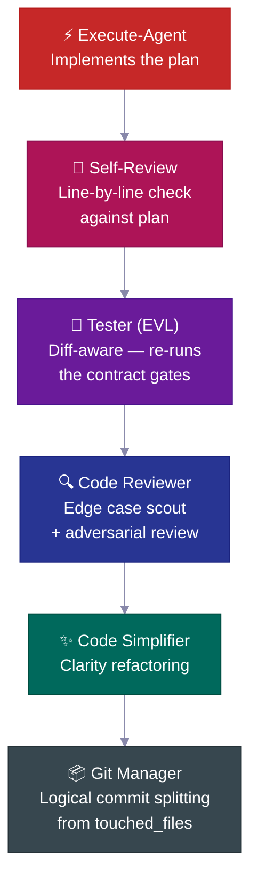

| Paso | Qué hace |
|---|---|
| 🔎 **Autorrevisión** | Verifica cada elemento de la lista frente al plan, registra cualquier desviación |
| 🧪 **Tester (EVL)** | Vuelve a ejecutar las pruebas de la lista acordada de forma independiente; mapea archivos modificados → archivos de prueba, escala a la suite completa cuando >70% está mapeado |
| 🔍 **Revisor de código** | Envía un explorador de casos extremos *antes* de la revisión; comprueba consultas N+1, rutas de autenticación, filtraciones de datos |
| ✨ **Simplificador** | Limpia el código para mayor claridad después de la revisión — sin cambios de comportamiento |
| 📦 **Gestor de Git** | Recibe `touched_files`, divide en commits convencionales lógicos, rechaza archivos desconocidos |

---
## 📋 El Ciclo de Vida de un Plan

Toda funcionalidad no trivial sigue un **ciclo de vida de plan** — una especificación escrita que se crea, se revisa, se implementa y luego se archiva como historial permanente del proyecto.

<br>

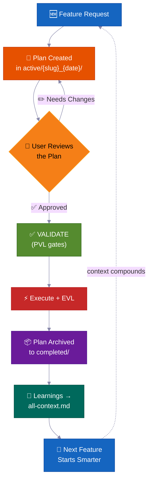

> 💡 Seis meses después, cuando alguien pregunte *"¿por qué construimos la autenticación de esta manera?"*, la respuesta estará en `completed/`. No perdida en un hilo de Slack.

**Dónde viven los planes — convención de carpeta de tarea:**

```
process/
├── general-plans/
│   ├── active/
│   │   └── webhooks_28-05-26/          # 📋 Carpeta de tarea: plan + informes/referencias colocalocadas
│   │       └── webhooks_PLAN_28-05-26.md
│   ├── completed/                       # ✅ Archivado (historial consultable)
│   └── backlog/                         # 📌 Trabajo diferido
└── features/
    └── billing/                         # 🏷️ Específico por funcionalidad (5+ artefactos)
        ├── active/{slug}_{date}/
        ├── completed/
        └── backlog/
```

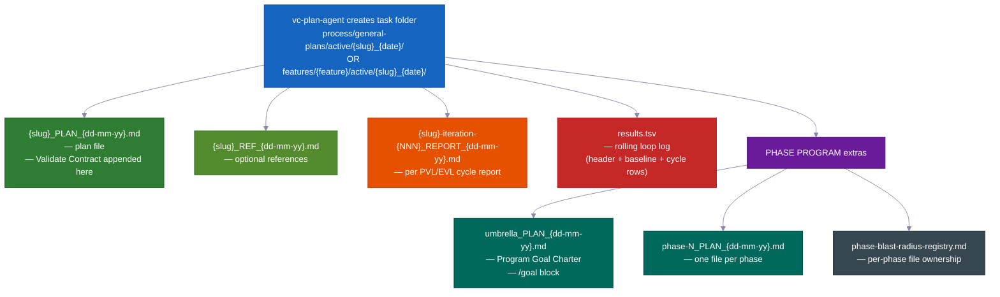

> Cada plan contiene: 📍 **puntos de contacto** (archivos creados/modificados) · 📜 **contratos públicos** · 💥 **qué archivos puede tocar** (qué podría romperse, qué hay que probar) · ✅ **evidencia de verificación** · 🔄 **entrega para retomar**. `vc-plan-discovery` encuentra el plan correcto para retomar; el hook `post-write-plan-check` verifica la estructura del plan en cada escritura.

---

## 🏗️ Programas de Fases — Proyectos Grandes Que No Se Desmoronan

Las funcionalidades normales usan un solo plan. **Los proyectos grandes de múltiples fases** usan un programa de fases: un plan paraguas más planes por fase, cada uno ejecutando un **bucle interno de 7 pasos** con sus propios puntos de control y un informe guardado.

<br>

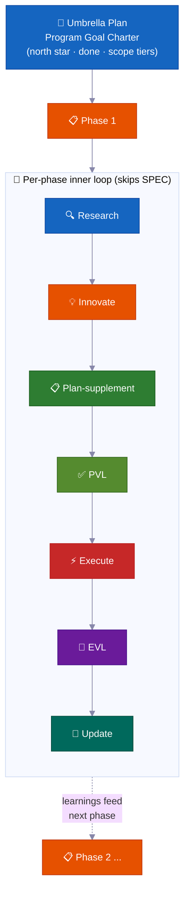

| | Característica | Por qué importa |
|---|---|---|
| 🔄 | **Nueva investigación en cada fase** | Verifica la deriva del código, lee los últimos informes y actualiza los supuestos |
| ✅ | **Puntos de control por fase** | Una fase no está terminada hasta que la evidencia lo demuestre. Estado honesto: `PLANNED → CODE DONE → TESTING → VERIFIED` o `BLOCKED` |
| 📄 | **Informes guardados** | Cada fase escribe resultados en disco — el progreso sobrevive a un reinicio de memoria |
| 🧠 | **Los aprendizajes se transmiten hacia adelante** | Los hallazgos de la Fase 1 actualizan el plan de la Fase 2 antes de comenzar a programar |
| 🏗️ | **Base vs expansión** | Separa explícitamente "demostrar la arquitectura" de "implementar todo" |
| 🚧 | **Gestión honesta de bloqueos** | Las fases bloqueadas permanecen en `BLOCKED` con evidencia. No se finge un estado verde |

<br>

### 🔀 El programa se remodela a medida que aprende

El plan que escribes al inicio es un mapa aproximado, no un contrato fijo. A medida que el programa avanza, se ajusta — así no tienes que predecir cada paso de antemano.

**Puede agregar una nueva fase en medio de una ejecución.**
Mientras trabaja, el agente puede descubrir un paso que falta — algo que debe ocurrir antes de que la siguiente fase pueda continuar. Cuando eso sucede, inserta una nueva fase justo ahí, renumera el resto y sigue adelante. Sin intervención humana. (Señal interna: `MID_PROGRAM_PLAN_CREATED` — el nuevo plan se escribe en disco y se agrega al registro automáticamente.)

**Puede reordenar las fases.**
La investigación a veces muestra que el orden planificado es incorrecto — por ejemplo, la Fase 3 depende de algo que solo produce la Fase 4. El agente reorganiza las fases restantes y registra el motivo. (Señal interna: `PHASE_RESTRUCTURE_NOTICE` — guardada en el informe de fase como rastro de auditoría, no como bloqueante.)

**Actualiza el plan de cada fase justo antes de programarla.**
Antes de que comience a programar cualquier fase, una breve revisión de investigación examina lo que el programa ha aprendido hasta el momento. Luego actualiza la lista de verificación de esa fase con los nuevos hallazgos. Este paso se llama **plan-supplement**. Los planes nunca se congelan — absorben hechos recientes de las fases anteriores.

**Omite el trabajo que aún no puede comenzar.**
Si una fase depende de algo que todavía no está listo — un servicio aún no construido, una decisión aún no tomada — el agente marca esa fase como bloqueada por dependencia, la deja de lado y pasa a la siguiente. El programa completo no se detiene porque una fase está esperando.

**Sabe cuándo detenerse y preguntar.**
Una sola fase bloqueada simplemente se deja en el backlog y el programa continúa. Pero si varias fases consecutivas chocan contra un muro sin progreso, el agente lo trata como un callejón sin salida real — una **parada en cascada** — y hace una pausa para mostrarte lo que ocurrió. Una fase bloqueada es normal. Varias seguidas señalan que algo estructural está mal.

**Mantiene un marcador en tiempo real.**
Cada programa tiene una sección de estado de una página en el plan paraguas que muestra cuál es la fase actual, si está terminada y dónde vive el informe. Cualquiera — o el propio agente tras un reinicio de memoria — puede leerlo y saber exactamente el estado de la situación. También mantiene un registro de archivos sencillo para que dos fases que trabajen al mismo tiempo nunca editen los mismos archivos.

**Una gran verificación final.**
Al final de todo el programa, el agente ejecuta una prueba de extremo a extremo que confirma que todo el proyecto sigue funcionando en conjunto — no solo cada parte por separado. Los puntos de control de cada fase demuestran que cada parte funciona; esta verificación final demuestra que las partes funcionan como un todo.

---

### 🧠 Nunca Pierde el Hilo (Sobrevive a un Reinicio de Memoria)

Los trabajos largos terminan correctamente — incluso cuando la memoria de la IA se reinicia a mitad del proceso. El plan, el progreso y la prueba viven en archivos en disco, no solo en la cabeza del agente.

Los agentes de IA tienen una memoria de trabajo limitada. En un trabajo largo esa memoria se llena y se comprime — los detalles pueden difuminarse. Cuando comienza una nueva sesión (o se borra la memoria), el agente no adivina dónde lo dejó. Lee los archivos.

Así es exactamente como funciona:

**1. Escribe un breve informe después de cada fase.**
Cuando termina una fase, se escribe un archivo de informe en disco. El progreso vive en la carpeta de tu proyecto, no solo en la cabeza del agente. Una compresión de memoria no puede borrar un archivo.

**2. Mantiene una lista de verificación de los pasos completados.**
Cada plan de fase tiene una lista de **Phase Loop Progress** — casillas de verificación para cada paso (investigación, comprobación del plan, construcción, prueba, captura de aprendizajes). Tras un reinicio, el agente lee esas casillas y conoce el siguiente paso exacto. No hace falta ponerlo al día.

**3. Un breve "sobre" al inicio de cada fase.**
Cada agente trabajador (un ayudante especializado que realiza una fase del trabajo) comienza emitiendo un **Context Envelope** — una nota de 10 campos: qué funcionalidad, qué fase, qué rama, qué archivo de plan, qué pruebas ejecutar. Se lee en segundos. El agente está listo antes de hacer cualquier cosa.

**4. Confía en los archivos más que en su propia memoria.**
Al retomar, el agente verifica lo que hay realmente en el código y en el historial de git frente a lo que dice el plan. El estado real prevalece. Un plan que quedó desactualizado no puede engañar al agente para que repita trabajo u omita pasos.

**5. Un marcador en curso e informes por ronda.**
Cada bucle de corrección (el bucle de comprobación del plan y el bucle de construcción-prueba) mantiene un archivo marcador `results.tsv` — una fila por ronda, con seguimiento de cuántos problemas quedan. Cuando una sesión termina a mitad del bucle, la siguiente sesión lee el conteo, retoma en la ronda correcta y continúa. No se pierde ninguna ronda.

**6. Reinyecta un recordatorio al retomar.**
Cuando la memoria se comprime, el sistema recarga automáticamente la nota de estado más reciente en la nueva sesión. Si había alguna aprobación pendiente — por ejemplo, un punto de control que requería un "sí" antes de continuar — el recordatorio lo señala. Nada se omite silenciosamente.

> 💡 En resumen: puedes iniciar una ejecución en piloto automático, cerrar tu portátil y volver horas después. El agente estará exactamente donde debe — o retomará desde el último punto de control guardado, con evidencia en disco que lo demuestra.

---

## 🧠 Grupos de Contexto

El conocimiento del proyecto se organiza en **grupos de contexto** — áreas de conocimiento estables, cada una con un archivo enrutador `all-{group}.md` que indica a los agentes qué leer y cuándo. Los agentes siguen el enrutador y cargan solo lo relevante — no toda la base de conocimiento cada vez.

<br>

```
process/context/
├── all-context.md              # 🧭 Enrutador raíz — arquitectura, pila, patrones, convenciones
├── tests/all-tests.md          # 🧪 Ejecutores de prueba, comandos, procedimientos de depuración
├── container/all-container.md   # 🐳 Docker, despliegue, procedimientos de infraestructura
├── uxui/all-uxui.md            # 🎨 Componentes, tokens de diseño, patrones
├── infra/all-infra.md          # 🖥️ Infraestructura de servidores, despliegue
└── {your-domain}/all-{domain}.md  # 📚 Cualquier dominio con 3+ documentos duraderos (promovido automáticamente)
```

| | Cómo funciona |
|---|---|
| 🧭 **Patrón de enrutador** | Los agentes leen solo lo relevante para su tarea |
| 📏 **Promoción automática** | Los temas con 3+ documentos (o un solo archivo que crece demasiado) obtienen su propio grupo |
| 🔄 **Siempre actualizado** | Lo actualiza `vc-update-process-agent` tras cada funcionalidad no trivial |
| 🧪 **Auditable** | `vc-audit-context` verifica el enrutamiento, el frontmatter de descubrimiento y la coherencia |
| 📨 **Context Envelope** | Cada agente del bucle interno emite una nota de 10 campos al inicio (feature → phase → session-goal → branch → worktree → context-group → blast-radius-packages → active-plan → test-runner → validate-contract) para que un agente trabajador recién iniciado sepa exactamente dónde se encuentra |

> El kit solo incluye la semilla del protocolo — tus grupos de contexto son **construidos para tu proyecto** por `vc-setup`, escaneando tu código real. Son un patrón, no una lista fija.

---

## 📁 Carpetas de Funcionalidad

Cuando un tema acumula 5 o más archivos, obtiene su propia **carpeta de funcionalidad** — un contenedor de ciclo de vida completo.

```
process/features/{feature}/
├── active/{slug}_{date}/   # 📋 Planes en curso (informes/referencias colocalizados)
├── completed/              # ✅ Planes archivados (historial de decisiones consultable)
└── backlog/                # 📌 Trabajo diferido (los agentes lo consultan antes de duplicar)
```

| | Qué ocurre |
|---|---|
| 🆕 | El nuevo trabajo comienza en `active/` → los informes se acumulan → el plan se archiva en `completed/` |
| 📌 | El trabajo diferido va a `backlog/` — los agentes lo consultan antes de crear planes duplicados |
| 📦 | La promoción de funcionalidad ocurre automáticamente cuando los artefactos generales llegan a 5+ |
| 🔍 | Cada funcionalidad tiene un historial completo y autónomo — planes, decisiones, informes, investigación |

---

## 🧱 Capas de Habilidades

Las 33 habilidades se dividen en tres capas. Cada `SKILL.md` declara su `layer` + `trigger_keywords` en el frontmatter, y un catálogo generado mantiene el descubrimiento rápido.

<table>
<tr>
<td width="33%" valign="top">
<h1>🎭</h1>
<strong>Agentes actores</strong><br><br>
Poseen una fase o un rol. Viven en <code>.claude/agents/</code> — son los 15 agentes, no habilidades.
</td>
<td width="33%" valign="top">
<h1>📜</h1>
<strong>Habilidades de contrato (20)</strong><br><br>
Cada una produce un archivo específico o una salida acordada — <code>vc-generate-plan</code>, <code>vc-validate-findings</code>, <code>vc-autopilot</code>, las auditorías. Los resultados pueden verificarse.
</td>
<td width="33%" valign="top">
<h1>🛠️</h1>
<strong>Habilidades de apoyo (13)</strong><br><br>
Mejoran <em>cómo</em> trabajan los agentes, sin producir archivos propios — <code>vc-scout</code>, <code>vc-sequential-thinking</code>, <code>vc-problem-solving</code>, <code>vc-docs-seeker</code>.
</td>
</tr>
</table>

---

## 🧠 Memoria de Proyecto que Mejora Sola

Cada funcionalidad completada retroalimenta los aprendizajes al sistema de contexto — **el conocimiento se acumula, no se reinicia.**

La mayoría de los proyectos asistidos por IA tienen la propiedad contraria: cada nueva sesión empieza desde cero. El agente vuelve a leer los mismos archivos, vuelve a descubrir los mismos patrones y vuelve a tomar las mismas decisiones — porque el conocimiento de la sesión anterior solo vivía en una ventana de chat. La respuesta del kit no es un truco de instrucciones. Es un **sistema de archivos de contexto duradero** (`process/context/`) que cada agente lee al inicio de la sesión, cada validador protege y cada funcionalidad completada enriquece.

Seis meses y muchos reinicios de memoria después, el agente todavía sabe *por qué* tu autenticación funciona como funciona — porque ese conocimiento está en disco, enrutado y auditable, no atrapado en una sesión muerta.

<br>

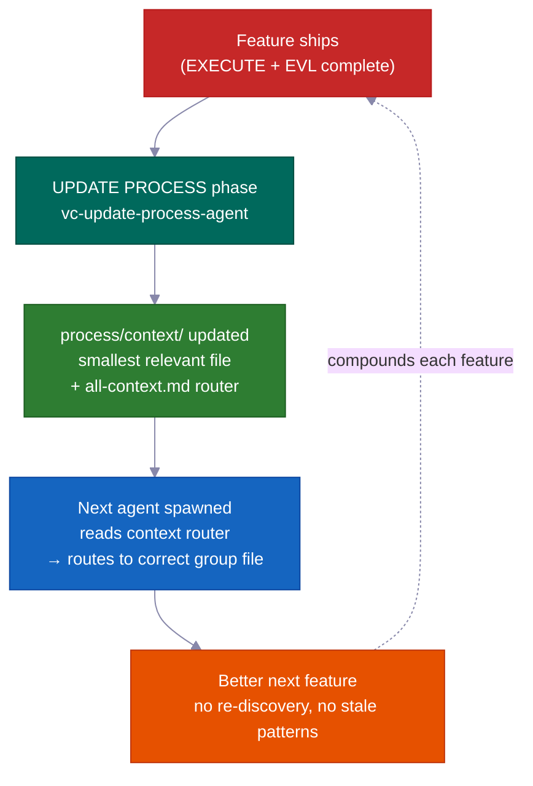

### El mecanismo central: `process/context/` como memoria portátil y compartida

`process/context/` almacena conocimiento estructurado organizado en grupos temáticos — decisiones de arquitectura, convenciones de código, pasos de despliegue, patrones de prueba, datos de infraestructura. A diferencia de un historial de chat, este conocimiento:

- **viaja a cada agente trabajador** — `vc-context-discovery` enruta cada agente iniciado al enrutador `all-{group}.md` correcto para su tarea, y luego al archivo profundo más pequeño relevante. Un agente de investigación, uno de planificación y uno de programación comienzan todos con el mismo entendimiento compartido
- **sobrevive a un reinicio de memoria** — está en disco, no en una ventana de contexto; una sesión comprimida no pierde nada
- **es legible tanto por Claude como por Codex** — `.agents/skills` es un enlace directo a `.claude/skills/`, por lo que el mismo sistema de contexto sirve a ambos agentes sin duplicación

El enrutador raíz (`all-context.md`) apunta a enrutadores de grupo (`all-{group}.md`), que enrutan al archivo profundo más pequeño relevante. Los agentes siguen el enrutador — nunca codifican rutas de archivo en duro. Esto significa que los cambios de nombre y las divisiones de grupo solo requieren ediciones del enrutador, no una búsqueda en todo el código.

```
process/context/
├── all-context.md                  ← enrutador raíz (arquitectura, pila, patrones)
├── tests/all-tests.md              ← ejecutores de prueba, depuración, comandos
├── container/all-container.md      ← Docker, despliegue, procedimientos de infraestructura
├── uxui/all-uxui.md                ← componentes, tokens de diseño, convenciones visuales
└── {domain}/all-{domain}.md        ← cualquier dominio con 3+ documentos duraderos (promovido automáticamente)
```

<br>

### Qué lo hace mejorar solo (no solo "documentación viva")

La expresión "documentación viva" suele significar "documentación que pretendemos mantener actualizada pero que en su mayoría olvidamos." Este sistema hace cumplir la intención de forma mecánica.

**La fase UPDATE PROCESS requiere una revisión de contexto por archivo antes de poder cerrarse.** `vc-update-process-agent` no puede terminar una fase hasta que cada archivo de contexto potencialmente afectado haya sido revisado con un motivo concreto por archivo. "No se necesitan actualizaciones" está permitido — pero debe nombrar cada archivo revisado y explicar por qué. Los motivos vagos son rechazados. El punto de control es binario: registrar la revisión, o la fase no se cierra.

El bucle de retroalimentación completo por cada funcionalidad completada:

| Paso | Responsable | Qué ocurre |
|------|-------|-------------|
| 1. Análisis de git diff | `vc-scout` | Mapea los archivos modificados → áreas de contexto afectadas |
| 2. Revisión por archivo | `vc-update-process-agent` | Nombra cada archivo de contexto, indica la actualización o un explícito "sin cambio + motivo" |
| 3. Actualizaciones aplicadas | agentes trabajadores en paralelo | El archivo de contexto de cada área se actualiza con nuevos patrones, decisiones y aprendizajes |
| 4. Enrutamiento verificado | `validate-context-discovery.mjs` | Confirma que cada documento está indexado y que los enrutadores son coherentes |
| 5. Descubrimiento confirmado | `validate-all-context.mjs` | Confirma que `all-context.md` y los enrutadores de grupo coinciden con los archivos actuales en disco |

Tu funcionalidad número 100 se beneficia de todo lo aprendido en las 99 primeras — no como aspiración, sino como garantía mecánica.

<br>

### Vista anticipada: los aprendizajes se transmiten hacia adelante, no solo hacia atrás

Cada informe de fase incluye una sección `## Forward Preview` escrita para el agente de la *siguiente* fase. Incluye los comandos exactos para mantener todo en verde, los cambios de dependencias y los cambios de alcance de archivos detectados a mitad de fase. El agente que retoma la Fase 3 no tiene que releer la salida de la Fase 2 y adivinar qué importa. Recibe un resumen enfocado.

Esto es diferente a los documentos de contexto: los documentos de contexto contienen conocimiento *duradero* (decisiones que se mantienen válidas a lo largo de funcionalidades); Forward Preview contiene un estado de entrega *temporal* (lo que la siguiente sesión de trabajo necesita saber ahora mismo).

<br>

### El conjunto de validadores previene la obsolescencia

El conocimiento duradero queda desactualizado cuando nadie lo verifica. El kit incluye validadores que se ejecutan como parte del cierre de cada fase:

| Validador | Qué detecta |
|-----------|----------------|
| `validate-context-discovery.mjs` | Documentos no indexados por ningún enrutador; enlaces rotos; frontmatter faltante |
| `validate-all-context.mjs` | `all-context.md` desincronizado con los archivos reales en disco |
| `validate-skill-keywords.mjs` | Habilidades sin campos `trigger_keywords` o `layer` (rompe el enrutamiento del Paso 0) |
| `validate-protocol-discovery.mjs` | Archivos de protocolo en `process/development-protocols/` sin frontmatter de descubrimiento |

Se ejecutan como verificaciones automáticas — un documento obsoleto o huérfano falla. El sistema vigila su propia salud.

<br>

### Los grupos de contexto se organizan solos

Los grupos se crean automáticamente cuando un tema alcanza 3+ documentos o un solo archivo supera las ~800 líneas. Los agentes siguen los enrutadores y nunca codifican rutas en duro — por lo que agregar un nuevo grupo (p. ej., `process/context/billing/all-billing.md`) solo requiere actualizar el enrutador, no modificar cada agente que mencione facturación. El enrutador es la referencia estable; los archivos que hay detrás de él pueden reorganizarse libremente.

> El kit siembra los grupos de contexto a partir de tu código base real (mediante `vc-setup`). Los grupos no son una lista fija — son un patrón. Tu área de autenticación, tu área de infraestructura y tu área de pagos se convierten cada una en conocimiento enrutable de primera clase a medida que el proyecto crece.

---

## 🤖 Qué Hay Dentro

<br>

### 15 Agentes

<details>
<summary>Haz clic para ver la lista de agentes</summary>

<br>

**Agentes del flujo de trabajo principal** — uno por fase RIPER-5 (R → SPEC → I → P → V → E → UP):

| Agente | Modelo | Rol |
|-------|:---:|------|
| 🔍 `vc-research-agent` | sonnet | Investigación de código base y web, solo lectura. Seguimiento de contradicciones integrado |
| 📝 `vc-spec-agent` | sonnet | Documento de requisitos de descubrimiento de producto antes de INNOVATE. Produce `*_SPEC_*.md` |
| 💡 `vc-innovate-agent` | sonnet | Compara 2-3 enfoques. Resumen de decisión (elegido + rechazado) antes de PLAN |
| 📋 `vc-plan-agent` | sonnet | Escribe el plan con protecciones contra atajos. "Ya sé cómo hacerlo" no es un plan |
| ✅ `vc-validate-agent` | sonnet | Convierte el plan en una lista de verificación acordada (V1–V7). Punto de control: PASS/CONDITIONAL/BLOCKED |
| ⚡ `vc-execute-agent` | **opus** | Implementa según el plan. Notas de progreso al informe de fase, protocolo de desviación, autorrevisión |
| ⏩ `vc-fast-mode-agent` | **opus** | R→S→I→P→V comprimido con una pausa de seguridad obligatoria antes de EXECUTE |
| 🔧 `vc-quick-fix-agent` | **opus** | Carril QUICK FIX: una pequeña edición de bajo riesgo + verificación acotada, sin plan/validación |
| 🧠 `vc-update-process-agent` | sonnet | Cierre de 7 fases: archivar, actualizar contexto, escaneo de artefactos obsoletos, aprendizajes |

<br>

**Agentes especialistas** — llamados durante EXECUTE o de forma independiente:

| Agente | Rol |
|-------|------|
| 🐛 `vc-debugger` | Recopila evidencia antes de formular una hipótesis. Hipótesis en competencia, cadenas de eliminación, sondas de viabilidad |
| 🧪 `vc-tester` | Consciente de los cambios. Vuelve a ejecutar las pruebas de la lista de verificación acordada (EVL). Escala automáticamente ante cambios de configuración |
| 🔎 `vc-code-reviewer` | Envía un explorador de casos límite ANTES de la revisión. Detección N+1, verificación de rutas de autenticación |
| ✨ `vc-code-simplifier` | Ordena el código para mayor claridad sin cambiar el comportamiento |
| 🎨 `vc-ui-ux-designer` | Frontend consciente del diseño. Puede iniciar un agente de investigación a mitad de la construcción |
| 📦 `vc-git-manager` | Divide en commits lógicos desde `touched_files`. Rechaza archivos desconocidos |

</details>

<br>

### 33 Habilidades (descubrimiento automático)

<details>
<summary>Haz clic para ver la lista de habilidades (20 de contrato + 13 de apoyo)</summary>

<br>

**📜 Habilidades de contrato (20)** — poseen un artefacto: `vc-generate-plan` · `vc-generate-context` · `vc-generate-spec` · `vc-generate-closeout` · `vc-generate-phase-program` · `vc-audit-context` · `vc-audit-plans` · `vc-audit-vc` · `vc-update` · `vc-publish` · `vc-feasibility-test` · `vc-risk-evidence-pack` · `vc-test-coverage-plan` · `vc-validate-findings` · `vc-autoresearch` · `vc-intent-clarify` · `vc-autopilot` · `vc-agent-strategy-compare` · `vc-plan-discovery` · `vc-context-discovery`

**🛠️ Habilidades de apoyo (13)** — mejoran cómo trabajan los agentes: `vc-review-situation` · `vc-sequential-thinking` · `vc-problem-solving` · `vc-scout` · `vc-debug` · `vc-docs-seeker` · `vc-frontend-design` · `vc-agent-browser` · `vc-web-testing` · `vc-setup` · `vc-predict` · `vc-scenario` · `vc-security`

</details>

> **⚠️ Regla de nomenclatura:** NO uses el prefijo `vc-` para tus propias habilidades o agentes — ese espacio de nombres está reservado para los archivos incluidos en el kit, y el guardián de eliminación de obsoletos trata cualquier ruta `vc-*` bajo `.claude/skills/` y `.claude/agents/` como propiedad del kit. Usa `my-`, `team-` o `proj-` en su lugar.

<br>

### 🪝 10 Ganchos

| Gancho | Qué hace |
|------|-------------|
| 🔐 `privacy-block.cjs` | Bloquea la lectura de `.env`, credenciales, claves SSH. Requiere aprobación explícita |
| 🚫 `scout-block.cjs` | Evita deambular por `node_modules/`, `dist/`. `.ckignore` con sintaxis gitignore |
| 🧠 `session-init.cjs` | Detecta la pila, inyecta el entorno, recupera puntos de aprobación tras compresión |
| 💉 `subagent-init.cjs` | Inyecta un bloque de contexto compacto en cada subagente |
| ✨ `post-edit-simplify-reminder.cjs` | Tras 5+ ediciones, sugiere ejecutar el simplificador (no bloqueante, con límite de frecuencia) |
| 📛 `descriptive-name.cjs` | Convenciones de nomenclatura de archivos según el lenguaje en cada escritura |
| 📊 `session-state.cjs` | Métricas de sesión y conciencia de tokens |
| 📋 `post-write-plan-check.mjs` | Valida la estructura del artefacto de plan en cada escritura a un `*_PLAN_*.md` |
| 🧹 `post-commit-lint.mjs` | Verifica el prefijo de commits convencionales en cada `git commit` |
| 🔍 `stop-validator-sweep.cjs` | Ejecuta los validadores principales del arnés cuando la sesión se detiene |

<br>

**Dónde vive todo:**

```text
your-project/
├── .claude/{agents,skills,hooks}/   # 🤖 15 agentes · ⚡ 33 habilidades · 🪝 10 ganchos
├── .codex/agents/                   # 🔄 Reflejado para Codex
├── .agents/skills -> .claude/skills # 🔗 Enlace simbólico para el descubrimiento de Codex
├── CLAUDE.md · AGENTS.md            # 📋 Configuración del orquestador + registro entre herramientas
└── process/
    ├── context/                     # 🧠 Dominios de conocimiento con enrutamiento automático
    ├── general-plans/               # 📋 Planes transversales + carpetas de tarea
    ├── features/                    # 🏷️ Carpetas de ciclo de vida por funcionalidad
    └── development-protocols/       # 📜 22 documentos de flujo de trabajo compartido
```

---

## ⚡ Corrección Rápida + Modo Rápido

Dos opciones más ligeras para cuando el proceso RIPER-5 completo es más de lo que el trabajo necesita:

<table>
<tr>
<td width="50%" valign="top">
<h1>🔧</h1>
<strong>Corrección Rápida</strong> — <code>"quick fix: …"</code><br><br>
Más grande que un simple retoque de una línea, más pequeño que "necesita un plan." El agente principal explora en modo solo lectura → confirmación de una línea → inicia <code>vc-quick-fix-agent</code> para la edición + una verificación acotada solo a los archivos tocados. <strong>Sin plan, sin lista de verificación acordada, sin EVL.</strong>
<br><br>
<sub>Se cancela de inmediato si el cambio toca superficies de esquema, autenticación, API, facturación o migración — en ese caso se enruta a RESEARCH completo.</sub>
</td>
<td width="50%" valign="top">
<h1>⏩</h1>
<strong>Modo Rápido</strong> — <code>"ENTER FAST MODE - …"</code><br><br>
Comprime RESEARCH + SPEC + INNOVATE + PLAN + VALIDATE en un solo paso — pero aun así <strong>escribe un plan, escribe una lista de verificación acordada y hace una pausa antes de EXECUTE.</strong>
<br><br>
<sub>En el Modo Rápido estándar hay una pausa tras VALIDATE — tú revisas y luego dices "ENTER EXECUTE MODE." Usa <code>autopilot fast: [task]</code> para eliminar esa pausa y ejecutar todo de principio a fin sin detenerse.</sub>
</td>
</tr>
</table>

---

## 🔄 Ciclo de Vida del Kit: Instalar · Configurar · Actualizar · Publicar

| Comando | Qué hace | Cuándo |
|---|---|---|
| `curl … install.sh \| bash` | Sincroniza los archivos del kit sin sobrescribir los tuyos; detecta automáticamente si es instalación nueva o actualización y te guía | Primera instalación + cada actualización |
| **Ejecutar vc-setup** | Detecta la pila, estructura `process/`, escanea en profundidad el código base, rellena el contexto real | Tras una instalación nueva |
| **Ejecutar vc-update** | Calcula un diff preciso, muestra qué cambiará, espera tu confirmación; migra planes/carpetas en formato antiguo sin pérdida de datos | En cada actualización |
| **Ejecutar vc-publish** *(mantenedores)* | Publica los cambios del arnés de vuelta al repositorio del kit | Al contribuir al kit mismo |

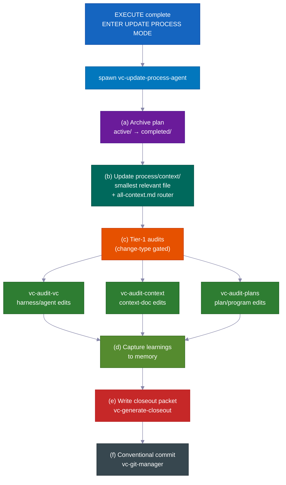

> 💡 `vc-update` muestra una vista previa del diff y espera tu confirmación. Tu directorio `process/` y el contenido específico del proyecto **nunca** se modifican en silencio. Volver a ejecutar la instalación es seguro aunque se haga dos veces.

---

## 💡 Más Razones por las Que Simplemente Funciona

Muchos pequeños valores predeterminados inteligentes se suman para reducir la supervisión necesaria y el costo.

- **Cada rol solo obtiene las herramientas que necesita.** Durante la planificación, el agente literalmente no puede editar código — esas herramientas están desactivadas. Esto evita que el agente se adelante y cambie cosas antes de que el plan esté aprobado. El sistema simplemente no lo permite.

- **Usa el modelo de IA premium solo donde importa.** La escritura de código usa el modelo más avanzado. La planificación, la investigación, la revisión y la verificación usan un modelo más económico y rápido. El resultado: un costo aproximadamente 60–70% menor en comparación con usar el modelo más avanzado para todo — sin pérdida de calidad en el trabajo que realmente importa.

- **Prueba las suposiciones arriesgadas antes de construir sobre ellas.** Cuando el agente no está seguro de que algo funcionará — un comportamiento específico de API, una característica de biblioteca, una suposición de infraestructura — primero realiza un pequeño experimento real. El resultado es claro: funciona, no funciona o no está claro. Ese veredicto y una nota en lenguaje sencillo se incluyen directamente en el plan. El agente no pierde horas construyendo sobre una suposición incorrecta.

- **Puntos de guardado ordenados y con significado.** Los cambios se confirman en fragmentos lógicos y limpios con mensajes claros — de forma automática. El historial es fácil de leer y fácil de deshacer una parte a la vez.

- **Recordatorios automáticos útiles.** Pequeños ayudantes integrados sugieren cosas como ejecutar las verificaciones correctas en los archivos modificados, mantener el código simple y escribir un mensaje de commit adecuado. La calidad se mantiene alta sin que tengas que supervisarlo.

- **Puedes ejecutar el bucle de mejora continua por tu cuenta.** El mismo motor de "encontrar problemas, corregirlos, repetir" que impulsa la comprobación del plan y la corrección de pruebas también funciona como herramienta independiente en cualquier área desordenada — una especificación, la documentación, las pruebas, una lista de errores. No necesitas una funcionalidad completa para usarlo.

- **Prueba incorporada de que las reglas del flujo de trabajo realmente funcionan.** El kit incluye su propio conjunto de pruebas: un conjunto de verificaciones con ejemplos conocidos como buenos y malos que demuestran que las reglas del flujo de trabajo se comportan correctamente. El sistema se verifica a sí mismo. No tienes que confiar en que los mecanismos de protección están activos — puedes ejecutar las verificaciones y verlo.

---

## Contribuir

¡Damos la bienvenida a las contribuciones! Consulta [CONTRIBUTING.md](CONTRIBUTING.md) para conocer las pautas.

<br>

**Enlaces rápidos:**

- 🐛 [Reportar un error](https://github.com/withkynam/vibecode-pro-max-kit/issues/new?template=1.bug_report.yml)
- 💡 [Solicitar una funcionalidad](https://github.com/withkynam/vibecode-pro-max-kit/issues/new?template=2.feature_request.yml)
- ⚡ [Enviar una habilidad](https://github.com/withkynam/vibecode-pro-max-kit/issues/new?template=3.skill_submission.yml)
- 🌐 [Añadir una traducción](https://github.com/withkynam/vibecode-pro-max-kit/issues/new?template=5.translation.yml)

<br>

<a href="https://github.com/withkynam/vibecode-pro-max-kit/graphs/contributors">
  
</a>

<br>

### 🙏 Créditos

vibecode-pro-max-kit se centra en el marco de desarrollo basado en especificaciones y la organización de contexto que mejora sola, sin sobrecargarte con más de 80 habilidades. Menos herramientas, más estructura.

---

## ⭐ Historial de Estrellas

<a href="https://star-history.com/#withkynam/vibecode-pro-max-kit&Date">
 <picture>
   <source media="(prefers-color-scheme: dark)" srcset="https://api.star-history.com/svg?repos=withkynam/vibecode-pro-max-kit&type=Date&theme=dark" />
   <source media="(prefers-color-scheme: light)" srcset="https://api.star-history.com/svg?repos=withkynam/vibecode-pro-max-kit&type=Date" />
   
 </picture>
</a>

---

## 📄 Licencia

MIT
