<p align="center">
  <a href="../../README.md">English</a> |
  <a href="README.zh-CN.md">简体中文</a> |
  <a href="README.ja-JP.md">日本語</a> |
  <a href="README.ko-KR.md">한국어</a> |
  <a href="README.vi-VN.md">Tiếng Việt</a> |
  <a href="README.pt-BR.md">Português</a> |
  <a href="README.es.md">Español</a> |
  <a href="README.de.md">Deutsch</a> |
  <strong>Français</strong> |
  <a href="README.hi.md">हिंदी</a>
</p>

<div align="center">

<a href="https://flowser.ai">
  
</a>

*Conçu par des ingénieurs de haut niveau, pour les vibecoders de*<br>
*[flowser.ai](https://flowser.ai) — Agents IA avec ordinateurs pour la mise sur le marché*

<br>

# vibecode-pro-max-kit

<br>

<p align="center">
  
  <br><br>
  <em>"Concentration Totale — Respiration Spec, Dixième Forme : le Vibe Flow ne s'arrête jamais."</em><br>
  <strong>— Tanjiro Kamado</strong>
</p>

*Déposez ceci dans n'importe quel projet. Votre agent IA obtient un processus de développement complet axé sur la planification — 7 phases contrôlées, des boucles d'auto-correction, et un pilote automatique qui s'exécute du début à la fin sans perdre sa place.*

<table align="center">
<tr>
<td width="50%" valign="top"><strong>📦 Installation en une commande</strong><br>Une seule ligne <code>curl</code> suffit pour l'intégrer dans n'importe quel projet. Elle détecte les nouveaux utilisateurs et ceux qui reviennent, et ne remplace jamais vos fichiers.</td>
<td width="50%" valign="top"><strong>🌐 Fonctionne partout</strong><br>N'importe quelle stack technique, n'importe quel langage, et n'importe quel agent de codage IA — Claude Code, Codex, Cursor, Windsurf, Copilot, et plus encore.</td>
</tr>
<tr>
<td valign="top"><strong>🧭 Workflow RIPER-5 axé sur la planification</strong><br>7 phases contrôlées (Research → Spec → Innovate → Plan → Validate → Execute → Update-Process) empêchent l'agent de passer directement au code.</td>
<td valign="top"><strong>🚀 Mode pilote automatique (quick / fast / full)</strong><br>Lancez une exécution sans intervention à n'importe quelle phase avec une simple phrase. Trois modes adaptent le niveau de contrôle au risque.</td>
</tr>
<tr>
<td valign="top"><strong>🎯 <code>/goal</code> — le jeton d'exécution jusqu'à la fin</strong><br>Un bloc à copier-coller maintient l'agent en marche phase après phase sans s'arrêter — et reprend l'exécution dans une nouvelle session.</td>
<td valign="top"><strong>🔁 Boucles d'auto-correction PVL + EVL</strong><br>Les boucles de vérification du plan et des tests détectent les problèmes, les corrigent et vérifient à nouveau de façon autonome — jusqu'à 10 cycles chacune.</td>
</tr>
<tr>
<td valign="top"><strong>🔍 vc-autoresearch</strong><br>Une boucle réutilisable trouver-les-lacunes → corriger → répéter que vous pouvez appliquer aux plans, tests, specs, docs ou évaluations.</td>
<td valign="top"><strong>🧪 Sondes de faisabilité</strong><br>Des verdicts tester-avant-de-construire (VIABLE / NOT-VIABLE) avant que l'agent ne s'engage dans une approche de conception.</td>
</tr>
<tr>
<td valign="top"><strong>🎛️ Sélecteur de stratégie intelligent</strong><br>Avant chaque phase, il évalue un agent seul contre plusieurs contre une équipe coordonnée — avec des estimations de coût — et choisit la solution la moins chère qui convient.</td>
<td valign="top"><strong>🧮 Utilisation intelligente des modèles</strong><br>Le modèle coûteux n'écrit que du code ; le modèle moins cher fait tout le reste. Coût réduit, même qualité.</td>
</tr>
<tr>
<td valign="top"><strong>🤔 Clarification des intentions</strong><br>Lorsqu'une demande est vague, l'agent pose quelques questions précises dès le départ plutôt que de deviner et de construire la mauvaise chose.</td>
<td valign="top"><strong>🛡️ 36 validateurs</strong><br>Des vérifications mécaniques de conformité — pas des opinions — protègent la structure interne du kit et détectent les dérives avant qu'elles ne soient livrées.</td>
</tr>
<tr>
<td valign="top"><strong>🏗️ Programmes par phases</strong><br>Les grands projets sont découpés en phases indépendantes avec des portes de qualité entre elles, pour que les gros travaux ne s'effondrent pas.</td>
<td valign="top"><strong>🔀 Programmes qui se restructurent d'eux-mêmes</strong><br>Au fur et à mesure qu'il apprend, l'agent insère de nouvelles phases, réorganise le travail et saute les étapes bloquées — le plan s'adapte à la volée.</td>
</tr>
<tr>
<td valign="top"><strong>🧠 Ne perd jamais sa place</strong><br>Les notes de progression sont écrites sur le disque à chaque phase, de sorte qu'une exécution survive à une réinitialisation mémoire et reprenne exactement là où elle s'est arrêtée.</td>
<td valign="top"><strong>📚 Mémoire de projet auto-améliorante</strong><br>Il apprend votre codebase à l'installation et maintient ses propres notes partagées à jour après chaque fonctionnalité livrée, pour que la documentation ne soit jamais obsolète.</td>
</tr>
<tr>
<td valign="top"><strong>⚡ Quick Fix + Fast Mode</strong><br>Des modes allégés pour les petits changements permettent d'éviter les procédures lourdes, de sorte qu'une correction d'une ligne reste une correction d'une ligne.</td>
<td valign="top"><strong>🧱 Skills en couches, auto-découverts</strong><br>Les skills sont organisés en couches claires et découverts automatiquement — l'agent trouve toujours le bon outil pour l'étape.</td>
</tr>
<tr>
<td valign="top"><strong>🤖 15 agents · 33 skills · 10 hooks</strong><br>Une équipe complète d'agents spécialisés, de skills réutilisables et de hooks de sécurité, tous connectés dès le départ.</td>
<td valign="top"><strong>🔄 Cycle de vie complet du kit</strong><br>L'installation, la configuration, la mise à jour et la publication sont chacune une seule commande — permettant à chaque projet de rester sur la dernière version du kit en toute sécurité.</td>
</tr>
<tr>
<td valign="top"><strong>📝 SPEC — votre validation en langage simple</strong><br>Avant toute conception, vous décrivez ce qu'il faut construire en simples récits utilisateur — le moment le moins coûteux pour repérer un malentendu.</td>
<td valign="top"><strong>🎯 Vérifie toujours vos intentions</strong><br>Chaque phase ultérieure se mesure à votre SPEC : est-ce qu'on construit vraiment ce que vous avez demandé ?</td>
</tr>
</table>

<p>
  <a href="https://github.com/withkynam/vibecode-pro-max-kit/stargazers"></a>
  <a href="https://github.com/withkynam/vibecode-pro-max-kit/network/members"></a>
  <a href="LICENSE"></a>
  <a href="https://github.com/withkynam/vibecode-pro-max-kit/graphs/contributors"></a>
  <a href="https://github.com/withkynam/vibecode-pro-max-kit/actions/workflows/validate.yml"></a>
  <a href="CHANGELOG.md"></a>
  
  
  
  
</p>

<p>
  <strong>Le kit de codage le plus simple, flexible et adapté aux équipes pour</strong><br><br>
  <a href="https://github.com/anthropics/claude-code"></a>&nbsp;
  <a href="https://github.com/openai/codex"></a>&nbsp;
  <a href="https://cursor.com"></a>&nbsp;
  <a href="https://windsurf.com"></a><br>
  <a href="https://github.com/google-gemini/gemini-cli"></a>&nbsp;
  <a href="https://github.com/opencode-ai/opencode"></a>&nbsp;
  <a href="https://github.com/features/copilot"></a>
</p>

<p>
  <em>Fonctionne avec n'importe quelle stack technique, n'importe quel langage, n'importe quel projet</em><br><br>
  <picture>
    <source media="(prefers-color-scheme: dark)" srcset="https://skillicons.dev/icons?i=ts%2Cjs%2Creact%2Cnextjs%2Cvue%2Cnuxt%2Csvelte%2Cangular%2Cnodejs%2Cexpress%2Cbun%2Cpython%2Cdjango%2Cflask%2Cfastapi&theme=dark&perline=15" />
    <source media="(prefers-color-scheme: light)" srcset="https://skillicons.dev/icons?i=ts%2Cjs%2Creact%2Cnextjs%2Cvue%2Cnuxt%2Csvelte%2Cangular%2Cnodejs%2Cexpress%2Cbun%2Cpython%2Cdjango%2Cflask%2Cfastapi&theme=light&perline=15" />
    
  </picture>
  <br>
  <picture>
    <source media="(prefers-color-scheme: dark)" srcset="https://skillicons.dev/icons?i=ruby%2Crails%2Cgo%2Crust%2Cjava%2Cspring%2Ckotlin%2Cswift%2Cphp%2Claravel%2Ccs%2Cdotnet%2Celixir%2Cgraphql%2Cprisma&theme=dark&perline=15" />
    <source media="(prefers-color-scheme: light)" srcset="https://skillicons.dev/icons?i=ruby%2Crails%2Cgo%2Crust%2Cjava%2Cspring%2Ckotlin%2Cswift%2Cphp%2Claravel%2Ccs%2Cdotnet%2Celixir%2Cgraphql%2Cprisma&theme=light&perline=15" />
    
  </picture>
  <br>
  <picture>
    <source media="(prefers-color-scheme: dark)" srcset="https://skillicons.dev/icons?i=supabase%2Cfirebase%2Cpostgres%2Cmongodb%2Credis%2Cdocker%2Ckubernetes%2Caws%2Cgcp%2Cazure%2Cvercel%2Ccloudflare%2Ctailwind%2Celectron&theme=dark&perline=15" />
    <source media="(prefers-color-scheme: light)" srcset="https://skillicons.dev/icons?i=supabase%2Cfirebase%2Cpostgres%2Cmongodb%2Credis%2Cdocker%2Ckubernetes%2Caws%2Cgcp%2Cazure%2Cvercel%2Ccloudflare%2Ctailwind%2Celectron&theme=light&perline=15" />
    
  </picture>
  <br>
  <p><em>Pas seulement décoratif. Quand vous lancez <code>vc-setup</code>, des agents analysent votre codebase,<br>
  détectent votre stack, et construisent des groupes de contexte spécifiques au projet que chaque skill lit avant de travailler.<br>
  D'autres kits verrouillent les agents sur un seul langage — <code>rust-review-agent</code>, <code>python-linter</code> — inutiles ailleurs.<br>
  Celui-ci s'adapte à n'importe quelle combinaison ci-dessus et accumule les connaissances au fil des livraisons.</em></p>
</p>

</div>

---

## ⚡ Démarrer — Une commande, 30 secondes

> **Prérequis :** Node.js ≥ 22, git, bash (macOS / Linux / WSL ; sur Alpine : `apk add bash`).

**Il n'existe qu'une seule commande, et elle fonctionne pour tout le monde.** Exécutez-la dans votre dossier de projet. Elle détecte si vous êtes un nouvel utilisateur ou si vous revenez, s'installe en toute sécurité sans écraser vos fichiers, puis *vous indique exactement quoi dire ensuite.*

```bash
curl -fsSL https://raw.githubusercontent.com/withkynam/vibecode-pro-max-kit/main/install.sh | bash
```

Une fois terminé, elle affiche l'un de deux messages — **lisez le bas de la sortie et faites exactement ce qu'il indique :**

<table>
<tr>
<td width="50%" valign="top">
<h3>🆕 Nouveau projet</h3>
L'installateur ne détecte pas de kit et affiche :
<br><br>
<code>Next: Run: claude → Say: "Run vc-setup"</code>
<br><br>
<strong>→ Ouvrez votre agent et dites <code>Run vc-setup</code></strong>
<br><br>
<sub>vc-setup détecte votre stack technique, crée le dossier <code>process/</code>, analyse votre codebase et remplit vos <em>vraies</em> conventions d'architecture et commandes de test — une conversation, pas une checklist.</sub>
</td>
<td width="50%" valign="top">
<h3>🔄 Kit existant (mise à jour)</h3>
L'installateur détecte une installation précédente et affiche :
<br><br>
<code>Next (upgrade detected): Run: claude → Say: "Run vc-update"</code>
<br><br>
<strong>→ Ouvrez votre agent et dites <code>Run vc-update</code></strong>
<br><br>
<sub>vc-update récupère la dernière version et, s'il trouve des plans ou dossiers au format ancien, vous fournit un message prêt à coller pour finaliser la migration avec <strong>zéro perte de données</strong>. Votre dossier <code>process/</code> n'est jamais modifié.</sub>
</td>
</tr>
</table>

> 💡 **Vous n'avez jamais à deviner la commande.** `install.sh` vous oriente : nouveau → `vc-setup`, mise à jour → `vc-update`. Relancer l'installation est toujours sans risque — rien ne sera cassé. **Utilisateurs Codex :** exécutez `/vc-setup` (ou `/vc-update`) au lieu de le dire dans le chat.

<br>

<details>
<summary><strong>📦 Ce que l'installation dépose sur le disque (non destructif)</strong></summary>

<br>

```
your-project/
├── .claude/
│   ├── agents/              # 🤖 15 définitions d'agents (.md)
│   ├── skills/              # ⚡ 33 skills (chacun un dossier avec SKILL.md)
│   └── hooks/               # 🪝 10 hooks de cycle de vie (.cjs / .mjs)
├── .codex/agents/           # 🔄 Agents dupliqués pour Codex
├── .agents/skills →         # 🔗 Lien symbolique vers .claude/skills (découverte Codex)
├── CLAUDE.md                # 📋 Orchestrateur + règles de routage
├── AGENTS.md                # 📖 Registre des agents + skills (multi-outils)
└── process/
    └── development-protocols/  # 📜 22 docs de workflow partagés (déposés par l'installation)
                                #    context/, plans, features → construits par vc-setup
```

- **Non destructif.** Vos dossiers `.claude/skills/`, `.claude/agents/`, `process/` et `settings.json` existants ne sont jamais effacés. Seuls les fichiers appartenant au kit sont écrits ou mis à jour.
- **Configuration existante ?** Sauvegardée dans `.vibecode-backup/` ; votre `settings.json` est restauré ensuite.
- **`CLAUDE.md` existant ?** Sauvegardé sous `CLAUDE.md.pre-vibecode`.
- **`process/` existant ?** Jamais modifié par l'installation — `vc-setup` / `vc-update` le migrent de façon interactive, en vous montrant d'abord le diff.

> **Mise en garde pour la première installation :** si vous avez des skills/agents personnalisés dont les noms commencent par `vc-` (l'espace de noms réservé du kit) et que vous n'avez *jamais* exécuté l'installation auparavant, l'étape de suppression des fichiers obsolètes peut les signaler. Après l'installation, exécutez `ls .claude/skills/ .claude/agents/` pour vérifier. Utilisez un préfixe autre que `vc-` (`my-`, `team-`, `proj-`) pour vos propres ajouts afin d'éviter ce problème.

</details>

<details>
<summary><strong>🤖 Vous préférez piloter la configuration depuis votre agent ? (message complet)</strong></summary>

<br>

> Ouvrez Claude Code ou Codex **avec votre dossier de projet comme répertoire de travail**, puis collez :

```
First, install the vibecode-pro-max-kit agent harness by running this command:

curl -fsSL https://raw.githubusercontent.com/withkynam/vibecode-pro-max-kit/main/install.sh | bash

After install completes, run vc-setup and follow the full interactive flow:

1. DETECT — Read package.json (or go.mod, Cargo.toml, pyproject.toml, etc.), detect my
   stack: framework, package manager, monorepo structure, test framework, database, auth.
   Also check for any existing .claude/, process/, or context files.
2. SHOW ME WHAT YOU FOUND — Summarize detection and wait for me to confirm. If this is an
   existing project, tell me what looks good vs what could be improved.
3. ASK ME ABOUT THE PROJECT — Have a real conversation. Ask follow-ups, probe anything
   vague, keep going until you genuinely understand it. Summarize back and confirm.
4. SCAFFOLD — Create the process/ directory. If process/ already exists, show me the plan
   and wait for approval. Never silently move or delete my files.
5. STUDY — Deep-scan and populate process/context/all-context.md with REAL content: repo
   structure, stack + versions, patterns, import aliases, env vars, routes, schema, tests.
   No placeholder text.
6. VALIDATE — Run all validation checks to confirm everything is wired correctly.

Rules: read and preserve good existing context; show me a summary before each major change
and wait for my OK; never create empty placeholder files; ask before reorganizing.
```

</details>

<details>
<summary>Table des matières</summary>

- [En un coup d'œil](#-en-un-coup-dœil) · [Le Problème](#-le-problème) · [La Solution](#️-la-solution)
- [La Révolution du Vibe Coding](#la-révolution-du-vibe-coding) · [Pour qui est-ce ?](#pour-qui-est-ce-) · [Comparaison](#comment-cela-se-compare) · [Ce qui rend cela différent](#-ce-qui-rend-cela-différent)
- [Comment ça fonctionne : le Coordinateur](#-comment-ça-fonctionne--le-coordinateur) · [Le Cycle de vie RIPER-5](#-le-cycle-de-vie-riper-5) · [Clarification des intentions](#-clarification-des-intentions)
- [Les deux boucles de qualité (PVL + EVL)](#-les-deux-boucles-de-qualité--pvl--evl) · [Stratégie compare + politique de modèles](#-stratégie-compare--politique-de-modèles) · [Mode pilote automatique](#-mode-pilote-automatique--riper-5-en-mains-libres) · [Sondes de faisabilité + Validateurs](#-sondes-de-faisabilité--le-filet-de-sécurité-des-validateurs)
- [Systèmes de sécurité intégrés](#️-systèmes-de-sécurité-intégrés) · [Intelligence pré-implémentation](#-intelligence-pré-implémentation) · [Pipeline qualité](#-pipeline-qualité--intégré-à-lexécution)
- [Cycle de vie du plan](#-le-cycle-de-vie-du-plan) · [Programmes par phases](#-programmes-par-phases--de-grands-projets-qui-ne-seffondrent-pas) · [Context Groups](#-context-groups) · [Dossiers de fonctionnalités](#-dossiers-de-fonctionnalités) · [Couches de skills](#-couches-de-skills) · [Mémoire auto-améliorante](#-mémoire-de-projet-auto-améliorante)
- [Ce qui est inclus](#-ce-qui-est-inclus) · [Quick Fix + Fast Mode](#-quick-fix--fast-mode) · [Cycle de vie du kit](#-cycle-de-vie-du-kit-installation--configuration--mise-à-jour--publication) · [Contribuer](#contribuer)

</details>

---

## 🎁 En un coup d'œil

<table>
<tr>
<td align="center" width="25%" valign="top"><h1>🤖</h1><h3>15</h3><strong>Agents</strong><br><sub>Un par phase + 6 agents spécialistes</sub></td>
<td align="center" width="25%" valign="top"><h1>⚡</h1><h3>33</h3><strong>Skills</strong><br><sub>20 de workflow + 13 d'aide, associés par mot-clé</sub></td>
<td align="center" width="25%" valign="top"><h1>🪝</h1><h3>10</h3><strong>Hooks</strong><br><sub>Garde-fous + chargement automatique du contexte</sub></td>
<td align="center" width="25%" valign="top"><h1>📜</h1><h3>22</h3><strong>Protocoles</strong><br><sub>Règles partagées que chaque agent respecte</sub></td>
</tr>
<tr>
<td align="center" width="25%" valign="top"><h1>🛡️</h1><h3>36</h3><strong>Validateurs</strong><br><sub>Vérifications automatisées qui détectent les erreurs avant qu'elles ne soient livrées</sub></td>
<td align="center" width="25%" valign="top"><h1>🔧</h1><h3>7</h3><strong>Outils</strong><br><sub>Claude Code · Codex · Cursor · Windsurf · Antigravity · OpenCode · Copilot</sub></td>
<td align="center" width="25%" valign="top"><h1>🌍</h1><h3>10</h3><strong>Langues</strong><br><sub>EN · 中文 · 日本語 · 한국어 · VI · PT · DE · FR · ES · हिन्दी</sub></td>
<td align="center" width="25%" valign="top"><h1>⚡</h1><h3>30s</h3><strong>Installation</strong><br><sub>Une commande, puis votre agent guide la suite</sub></td>
</tr>
<tr>
<td align="center" width="25%" valign="top"><h1>🛩️</h1><strong>Pilote automatique</strong><br><sub>3 modes (quick / fast / full) — démarre à n'importe quelle phase, s'exécute du début à la fin sans s'arrêter</sub></td>
<td align="center" width="25%" valign="top"><h1>📌</h1><strong>Blocs /goal</strong><br><sub>Courts textes à copier-coller qui reprennent des exécutions autonomes entre sessions après une réinitialisation</sub></td>
<td align="center" width="25%" valign="top"><h1>🔁</h1><strong>vc-autoresearch</strong><br><sub>Boucle trouver-les-lacunes → corriger → répéter (outil partagé pour les plans, tests et évaluations)</sub></td>
<td align="center" width="25%" valign="top"><h1>🔬</h1><strong>Sondes de faisabilité</strong><br><sub>Verdicts tester-avant-de-construire (VIABLE / NOT-VIABLE) avant de verrouiller une conception</sub></td>
</tr>
</table>

---

## 🔥 Le Problème

Vous demandez à Claude d'« ajouter la prise en charge des webhooks ». Il commence immédiatement à écrire du code. Aucune question sur votre architecture. Aucune vérification des patterns existants. Aucun plan. Vous obtenez 400 lignes qui ne correspondent pas à votre codebase, et vous passez une heure à les corriger.

**Mais ce n'est que la surface.** Les problèmes plus profonds sont encore plus graves :

<table>
<tr>
<td width="50%" valign="top">
<h1>🧠</h1>
<strong>Le contexte disparaît à chaque session</strong><br><br>
Votre agent oublie tout ce qu'il a appris. Mêmes erreurs, mêmes questions, à chaque fois. Pas de mémoire, pas d'accumulation de connaissances.
</td>
<td width="50%" valign="top">
<h1>📄</h1>
<strong>La documentation devient obsolète instantanément</strong><br><br>
Vous avez rédigé d'excellents docs de contexte la semaine dernière. Ils sont déjà dépassés. Rien ne les met à jour automatiquement au fur et à mesure que le codebase évolue.
</td>
</tr>
<tr>
<td width="50%" valign="top">
<h1>💥</h1>
<strong>Les grandes tâches s'effondrent à mi-chemin</strong><br><br>
La fenêtre de contexte se remplit, l'état est perdu, l'agent commence à halluciner. Vous repartez de zéro à la troisième heure.
</td>
<td width="50%" valign="top">
<h1>🤝</h1>
<strong>Pas de specs, pas de revue, pas de collaboration</strong><br><br>
Votre PM ne peut pas examiner ce que l'agent s'apprête à construire. Il n'existe aucun plan écrit à partager, discuter ou approuver avant que le code ne soit écrit.
</td>
</tr>
<tr>
<td width="50%" valign="top">
<h1>🎭</h1>
<strong>Les décisions d'architecture sont hallucinées</strong><br><br>
L'agent invente des patterns au lieu de rechercher comment d'autres codebases ont résolu le même problème.
</td>
<td width="50%" valign="top">
<h1>🚀</h1>
<strong>Rien ne vérifie que c'est « terminé »</strong><br><br>
L'agent dit « tous les tests passent » — mais il ne les a jamais relancés de façon indépendante. Vous le découvrez en production.
</td>
</tr>
</table>

**Votre agent possède de l'intelligence mais aucun processus, aucune mémoire, et aucun moyen de collaborer avec votre équipe.** Que vous soyez développeur, PM, ou PDG qui vient de découvrir le vibe coding — ce problème touche tout le monde de la même façon, et la solution est la même : **donnez à votre agent un vrai processus de développement.**

---

## 🛠️ La Solution

Ce kit installe un système de développement complet dans votre projet — pas seulement un `CLAUDE.md`, mais **15 agents spécialisés, 33 skills, 10 hooks et 22 protocoles** — avec un workflow à phases verrouillées qui oblige votre agent à **comprendre avant de construire, et à prouver avant de livrer.**

<br>

<table>
<tr>
<td align="center" width="50%" valign="top"><h1>📋</h1><strong>Approche axée sur la planification</strong><br><br><sub>Les PMs et les développeurs examinent le même plan écrit avant qu'une seule ligne de code ne soit écrite</sub></td>
<td align="center" width="50%" valign="top"><h1>🔄</h1><strong>Connaissances auto-améliorantes</strong><br><br><sub>Se met à jour automatiquement à chaque livraison de fonctionnalité — la documentation ne devient jamais obsolète</sub></td>
</tr>
<tr>
<td align="center" width="50%" valign="top"><h1>⚡</h1><strong>Exécution en mains libres</strong><br><br><sub>Survive aux réinitialisations de session — fonctionne pendant des heures, pas des minutes</sub></td>
<td align="center" width="50%" valign="top"><h1>🧬</h1><strong>Recherche d'architecture</strong><br><br><sub>Étudie de vrais codebases avant de prendre des décisions de conception</sub></td>
</tr>
<tr>
<td align="center" width="50%" valign="top"><h1>✅</h1><strong>Deux vérifications qualité</strong><br><br><sub>Les plans sont vérifiés avant le codage ; les tests sont relancés de façon indépendante après</sub></td>
<td align="center" width="50%" valign="top"><h1>🧭</h1><strong>Routage de contexte intelligent</strong><br><br><sub>Charge uniquement ce qui est pertinent — pas toute votre base de connaissances à chaque fois</sub></td>
</tr>
</table>

<br>

### Le flux RIPER-5 complet — 7 phases, chaque étape contrôlée

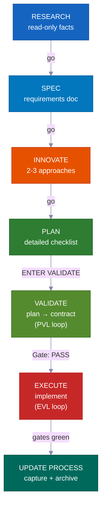

**En mode interactif**, chaque phase attend votre « go » avant de continuer — vous restez dans la boucle à chaque étape. **En mode pilote automatique ou /goal**, vous donnez votre approbation une seule fois au départ, puis le système se pilote tout seul jusqu'à la fin. Il ne s'arrête que pour trois situations spécifiques décrites ci-dessous. **VALIDATE** et le re-test post-EXECUTE ne sont pas optionnels — ce sont des portes obligatoires qui bloquent les travaux défectueux — et ils s'exécutent automatiquement dans les deux modes.

---

## La Révolution du Vibe Coding

<div align="center">
<h3><em>« Le nouveau langage de programmation le plus populaire, c'est l'anglais. »</em></h3>
<strong>— Andrej Karpathy</strong>
</div>

<br>

**Le vibe coding a changé qui peut créer des logiciels. Le développement axé sur la planification change ce qu'ils peuvent livrer.**

<table>
<tr>
<td align="center" width="50%"><h3>63%</h3><sub>des utilisateurs du vibe coding ne sont <strong>PAS</strong> des développeurs</sub></td>
<td align="center" width="50%"><h3>16,2 M</h3><sub>développeurs citoyens dans le monde<br>(croissance de 38 % par an)</sub></td>
</tr>
<tr>
<td align="center" width="50%"><h3>4,7 Mds $</h3><sub>marché du vibe coding<br>croissance annuelle de 38 %</sub></td>
<td align="center" width="50%"><h3>25%</h3><sub>des startups YC W25 avaient des codebases générées à 95 %+ par l'IA</sub></td>
</tr>
</table>

La plupart des outils vous aident à démarrer un projet. Ce kit vous aide à le **terminer** — avec des plans que votre équipe peut examiner, des connaissances qui ne deviennent jamais obsolètes, et des vérifications de sécurité qui détectent les erreurs avant qu'elles ne soient livrées.

---

## Pour qui est-ce ?

<div align="center">
<h3><em>« Ce qui compte, ce n'est pas qui l'a tapé. C'est ce qui a été livré. »</em></h3>
<strong>— Garry Tan, YC</strong>
</div>

<br>

<table>
<tr>
<td width="50%" valign="top">
<h1>🧑‍💼</h1>
<strong>PDG / Fondateur</strong><br><br>
<em>« Construis-moi un SaaS avec authentification, facturation et une landing page »</em><br><br>
L'agent recherche votre stack, rédige un plan d'architecture que vous pouvez examiner, implémente avec des tests, et documente chaque décision pour que votre co-fondateur technique puisse l'auditer ultérieurement.
</td>
<td width="50%" valign="top">
<h1>📊</h1>
<strong>Product Manager</strong><br><br>
<em>« Crée un tableau de bord affichant le MRR, le churn et les métriques de croissance »</em><br><br>
Il génère une spec de style PRD, obtient votre approbation avant d'écrire du code, implémente selon la spec, et archive le plan comme historique de projet consultable.
</td>
</tr>
<tr>
<td width="50%" valign="top">
<h1>🎨</h1>
<strong>Designer</strong><br><br>
<em>« Reproduis cette maquette Figma au pixel près »</em><br><br>
L'agent conscient du design analyse votre maquette, implémente composant par composant avec vos design tokens, et lance des vérifications de comparaison visuelle.
</td>
<td width="50%" valign="top">
<h1>⚙️</h1>
<strong>Ingénieur</strong><br><br>
<em>« Refactorise le module d'authentification pour prendre en charge le RBAC sans interruption de service »</em><br><br>
Il recherche votre code d'authentification actuel et comment d'autres codebases ont résolu le RBAC, rédige un plan de migration indiquant quels fichiers pourraient être affectés, puis construit de façon sécurisée avec des notes de rollback.
</td>
</tr>
</table>

---

## Comment cela se compare

| Fonctionnalité | vibecode-pro-max-kit | Superpowers | GSD | gstack |
|---------|---------------------|-------------|-----|--------|
| Cycle de vie axé sur la planification | RIPER-5 complet (research → spec → innovate → plan → validate → execute → update) | Workflows obligatoires | Correction du context-rot | Partiel |
| Sécurité à phases verrouillées | Les outils de l'agent sont restreints par phase (research en lecture seule, pas d'écriture en innovate) | Contraintes par skill | Séparation des phases | Aucune |
| Boucles de vérification qualité | **Deux** — PVL (vérifier le plan) + EVL (relancer les tests de façon indépendante) | Par skill | Aucune automatique | Aucune |
| Support multi-outils | 7 outils via `AGENTS.md` + standards ouverts `SKILL.md` | Plugin Claude Code | 14 runtimes | 1 outil |
| Connaissances auto-améliorantes | Connaissances regroupées par sujet, mises à jour après chaque fonctionnalité | Mémoire par plugin | État persisté sur disque | Manuel |
| Collaboration d'équipe | Plans partagés, specs et fichiers de revue | Solo | Solo | Solo |
| Système de skills | 33 auto-découverts, correspondance par mots-clés à chaque prompt | 86 skills composables | Meta-prompting | 23 outils de rôle |
| Grands projets multi-phases | Plans parapluie + boucle intérieure par phase avec vérifications de régression | Tâche unique | Tâche unique | Tâche unique |
| Mode mains libres | Pilote automatique (3 modes) + consentement permanent `/goal` | Manuel | Manuel | Manuel |
| Installation | 30s `curl` + configuration auto-routée | Marketplace de plugins | npx one-liner | git clone |

> **Sur l'étendue des runtimes :** GSD supporte 14 runtimes. Nous en supportons 7 en profondeur — avec des kits d'agents complets, la découverte de skills, et des hooks de cycle de vie sur chaque plateforme. Étendue ou profondeur : à vous de choisir.

---

## ⚡ Ce qui rend cela différent

<table>
<tr>
<td width="50%" valign="top">
<h1>🔒</h1>
<strong>Restrictions d'outils à phases verrouillées</strong><br><br>
Votre agent <strong>ne peut littéralement pas</strong> écrire du code pendant la recherche. RESEARCH est en lecture seule, INNOVATE n'a pas de Write, PLAN/VALIDATE n'écrivent que dans <code>process/</code>. <strong>Des limitations de capacité réelles</strong>, pas de simples suggestions.
</td>
<td width="50%" valign="top">
<h1>🎯</h1>
<strong>L'agent principal ne touche jamais au code</strong><br><br>
Le coordinateur route, surveille et pilote les boucles — il <strong>ne modifie jamais les fichiers source ni n'exécute les tests lui-même</strong>. Chaque modification et chaque exécution de test se déroulent dans un sous-agent dédié. Aucun travail caché.
</td>
</tr>
<tr>
<td width="50%" valign="top">
<h1>🔍</h1>
<strong>Découverte automatique de skills</strong><br><br>
Avant de traiter toute demande, il analyse <strong>33 skills</strong> et fait correspondre les mots-clés. Dites « add webhook support » et <code>vc-security</code> + <code>vc-scenario</code> sont intégrés automatiquement.
</td>
<td width="50%" valign="top">
<h1>💾</h1>
<strong>Survit aux réinitialisations de session</strong><br><br>
Plans, rapports, docs de contexte et apprentissages vivent tous sur le disque. Le hook de démarrage restaure les portes d'approbation après une réinitialisation de session. <strong>Rien n'est perdu.</strong>
</td>
</tr>
<tr>
<td width="50%" valign="top">
<h1>🛡️</h1>
<strong>Garde auto-policé contre les raccourcis</strong><br><br>
Quand l'agent est sur le point de sauter une étape obligatoire, il s'arrête lui-même : <em>« PHASE JUMPING PREVENTED. »</em> Un <strong>garde intégré contre les raccourcis</strong>.
</td>
<td width="50%" valign="top">
<h1>🔄</h1>
<strong>Fonctionne avec 7 outils de codage IA</strong><br><br>
Deux standards ouverts — <code>AGENTS.md</code> et <code>SKILL.md</code> — signifient <strong>zéro adaptateur, zéro plugin.</strong> Commencez dans Claude Code, passez à Cursor, continuez dans Codex.
</td>
</tr>
</table>

---

## 🧭 Comment ça fonctionne — Le Coordinateur

Votre session principale est un **coordinateur** (appelé l'orchestrateur), pas un exécutant. Il fait quatre choses et rien d'autre :

```
Votre demande
  → Étape 0 : Découverte de skills (analyser 33 skills, associer les mots-clés, attacher les candidats)
  → Détecter l'intention (fonctionnalité / bug / question / refactoring / UI) + évaluer l'ambiguïté
  → Router vers le bon agent dans une nouvelle fenêtre de contexte
  → Surveiller : conformité aux étapes, codes de statut, pilotage des boucles
```

<table>
<tr>
<td width="50%" valign="top">
<h1>🧑‍✈️</h1>
<strong>Il délègue, n'implémente jamais</strong><br><br>
Research → <code>vc-research-agent</code>. Plan → <code>vc-plan-agent</code>. Code → <code>vc-execute-agent</code>. Le coordinateur transmet le bon contexte et attend — il ne fait jamais le travail lui-même.
</td>
<td width="50%" valign="top">
<h1>🚫</h1>
<strong>Aucune exécution cachée — jamais</strong><br><br>
Dès qu'un plan avec une checklist approuvée existe, « ENTER EXECUTE MODE » <strong>lance toujours</strong> <code>vc-execute-agent</code>. Même une correction d'une ligne passe par lui. Les tests ne s'exécutent que dans un <code>vc-tester</code> dédié. Cela s'applique quelle que soit la taille du changement.
</td>
</tr>
<tr>
<td width="50%" valign="top">
<h1>📨</h1>
<strong>Codes de statut clairs, pas de signaux vagues</strong><br><br>
Chaque sous-agent termine avec l'un des codes suivants : <code>DONE</code> · <code>DONE_WITH_CONCERNS</code> · <code>BLOCKED</code> · <code>NEEDS_CONTEXT</code>. Le coordinateur n'ignore jamais un blocage et ne retente jamais la même approche bloquée trois fois.
</td>
<td width="50%" valign="top">
<h1>🔁</h1>
<strong>Il pilote les boucles de correction</strong><br><br>
Les sous-agents s'exécutent une fois, rapportent un résultat et s'arrêtent. Seul le coordinateur les relance. Il pilote à la fois la boucle PVL (vérification-correction du plan) et la boucle EVL (vérification-correction des tests), et gère tout le suivi.
</td>
</tr>
</table>

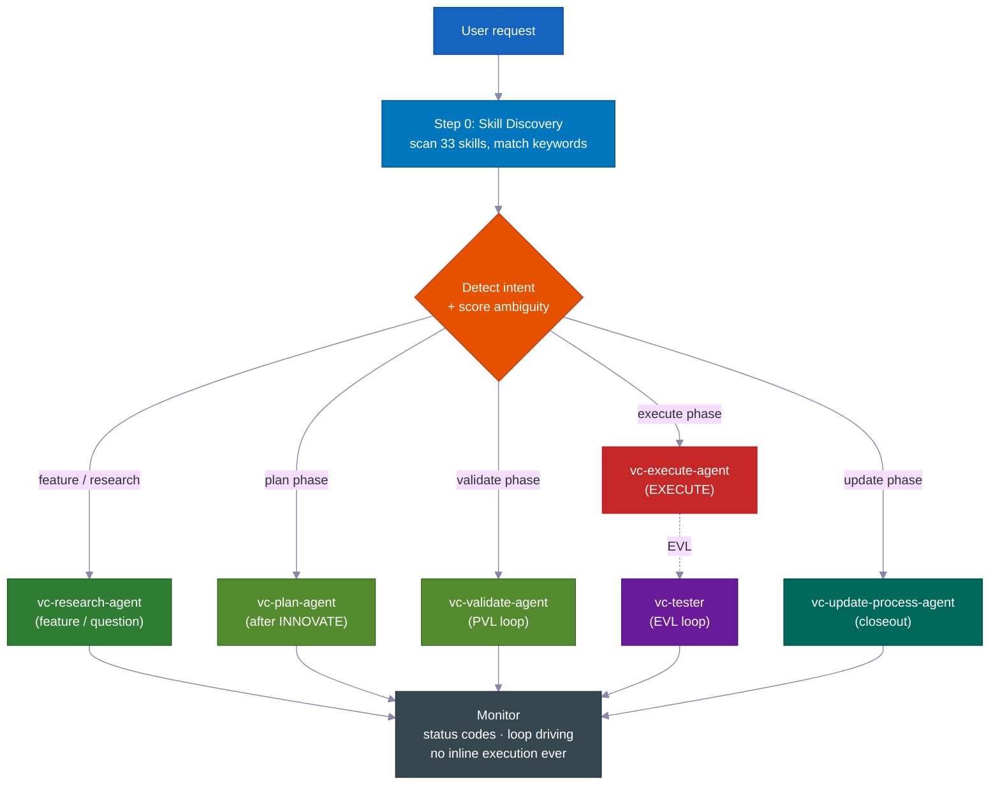

> **Pourquoi c'est important :** un agent qui peut à la fois décider *et* modifier discrètement des fichiers trouvera des moyens de contourner le plan. En séparant le coordinateur des exécutants (sous-agents), le processus devient structurellement honnête — la seule façon d'écrire du code est de passer par les étapes obligatoires.

---
## 📊 Le cycle de vie RIPER-5

| Phase | Ce qui se passe | Agent | Vous dites |
|-------|----------------|-------|------------|
| 🔍 **RESEARCH** | Collecte d'informations en lecture seule — base de code et web. Ne modifie jamais de fichiers. | `vc-research-agent` | *(automatique sur les demandes de fonctionnalité)* |
| 📝 **SPEC** | Document de définition des besoins — cas d'usage, critères d'acceptation, périmètre exclu — pour **votre validation avant toute conception**. | `vc-spec-agent` | `go` / `ENTER SPEC MODE` |
| 💡 **INNOVATE** | Exploration de 2 à 3 approches avec leurs compromis. Résumé de décision (approche retenue + approches écartées + justification). | `vc-innovate-agent` | `go` |
| 📋 **PLAN** | Rédaction du plan détaillé : points de contact, contrats publics, fichiers autorisés, preuves de vérification, passation de main. | `vc-plan-agent` | `go` |
| ✅ **VALIDATE** | Transformation du plan en liste de contrôle convenue (points de contrôle V1–V7). Verdict : **PASS / CONDITIONAL / BLOCKED**. Lance la boucle PVL. | `vc-validate-agent` | `ENTER VALIDATE MODE` |
| ⚡ **EXECUTE** | Mise en œuvre *exacte* du plan. Notes de progression dans le rapport de phase, protocole d'écart, auto-révision. Puis la boucle EVL repasse tous les points de contrôle. | `vc-execute-agent` | `ENTER EXECUTE MODE` |
| 🧠 **UPDATE PROCESS** | Capture des enseignements, mise à jour du contexte, archivage du plan, rédaction du bilan final. | `vc-update-process-agent` | *(recommandé après un travail non trivial)* |

> 📝 **Pourquoi SPEC est sa propre phase :** la plupart des systèmes passent directement de « comprendre » à « concevoir ». L'insertion d'une étape SPEC de définition des besoins signifie que *vous* (ou votre chef de produit) validez **ce qui** est construit — en cas d'usage simples et en critères d'acceptation — *avant* que l'agent débatte du **comment**. C'est l'endroit le moins coûteux pour corriger un malentendu. (Dans la boucle interne d'un programme par phases, SPEC est omise — la SPEC globale gouverne toutes les phases.)
>
> **La SPEC est la mesure étalon.** Elle décrit le comportement attendu en termes simples, lisibles en une minute. Chaque phase qui suit — Innovate, Plan, Validate, Execute — s'y réfère et pose la même question : *est-ce que ce que nous construisons correspond vraiment à ce que vous avez demandé ?* Quand le travail commence à dériver, c'est la SPEC qui le détecte.

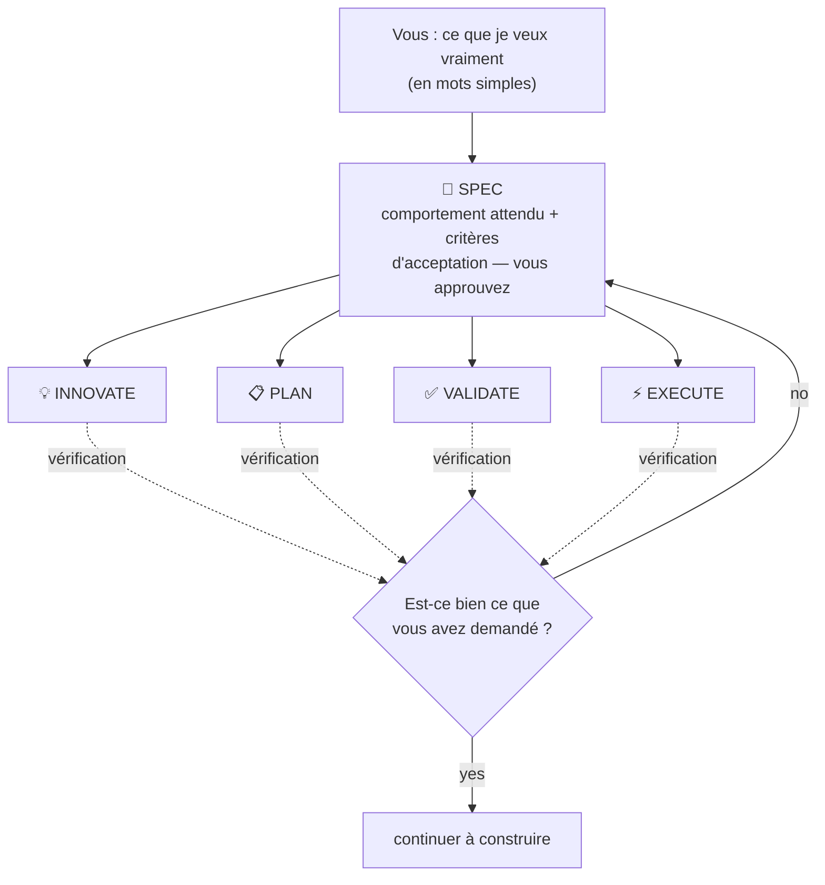

<br>

### 💻 Exemples de sessions

```
# 🆕 Demande de fonctionnalité
You: "add webhook support to the API"
→ Skill discovery surfaces: vc-scenario, vc-security
→ research-agent gathers context (read-only, can't touch code)
→ "go" → spec-agent writes requirements doc → you approve
→ "go" → innovate-agent compares approaches → decision summary
→ "go" → plan-agent writes the plan, listing which files it will touch
→ "ENTER VALIDATE MODE" → validate-agent gates the plan (PVL loop) → Gate: PASS
→ "ENTER EXECUTE MODE" → execute-agent implements → tester re-runs gates (EVL) → reviewer → git-manager
→ Closeout packet: what changed, what's verified, recommended next step
```

```
# 🐛 Correction de bug
You: "login redirect is broken"
→ Routes to vc-debugger → gathers evidence FIRST → 2-3 competing hypotheses
→ Systematically eliminates each → root cause with proof chain
→ execute-agent implements the fix → EVL re-test → quality pipeline
```

```
# ⏩ Mode rapide
You: "ENTER FAST MODE - add rate limiting middleware"
→ Compressed RESEARCH + SPEC + INNOVATE + PLAN + VALIDATE in one pass
→ Mandatory safety pause after VALIDATE → you review → "ENTER EXECUTE MODE"
```

```
# 🤖 Pilote automatique (mains libres)
You: "autopilot full: build a notifications system"
→ ONE consolidated clarification round → provisional /goal block (standing consent)
→ Drives the full RIPER-5 sequence autonomously, pausing only on hard stops
```

```
# 🏗️ Programme de grande envergure
You: "build a full testing platform"
→ Umbrella plan + phase plans in a feature folder
→ Each phase inner loop: research → innovate → plan → PVL → execute → EVL → update
→ Progress survives context compaction — durable reports on disk
```

---

## 🎯 Clarification d'intention

Avant de router, l'agent principal évalue l'ambiguïté de votre demande sur **4 signaux binaires (0–4)** et choisit un niveau. Il pose des questions *uniquement quand elles changeraient réellement ce qu'il fait*.

| Niveau | Quand | Comportement |
|---|---|---|
| **Niveau 0** — routage automatique silencieux | Score 0–1, ou vous avez dit « go » / « just do it », ou reprise d'un plan | Routage immédiat, aucune question |
| **Niveau 1** — résumé en ligne | Score 2 | Énonce sa compréhension + le chemin retenu en une ligne, puis continue |
| **Niveau 2** — questions | Score 3+ | Pose des questions ciblées à choix multiple avant de router |

> 🧠 **Deux tours maximum.** Si c'est encore flou après le Niveau 2, il pose une dernière question simple, puis par défaut oriente vers la recherche avec le périmètre le plus étroit possible. Il ne boucle jamais la clarification indéfiniment. Après RESEARCH, il vérifie à nouveau l'intention — si la recherche révèle que la demande était différente de ce qui avait été supposé, il la reformule ; si elle est confirmée, il continue sans reposer de questions.

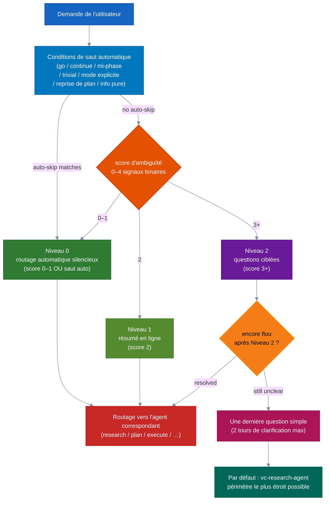

---

## ✅ Les deux boucles qualité — PVL + EVL

La plupart des systèmes vérifient *une fois*, si tant est qu'ils vérifient. Celui-ci encadre EXECUTE avec **deux boucles indépendantes** — l'une avant que le code soit écrit, l'autre après.

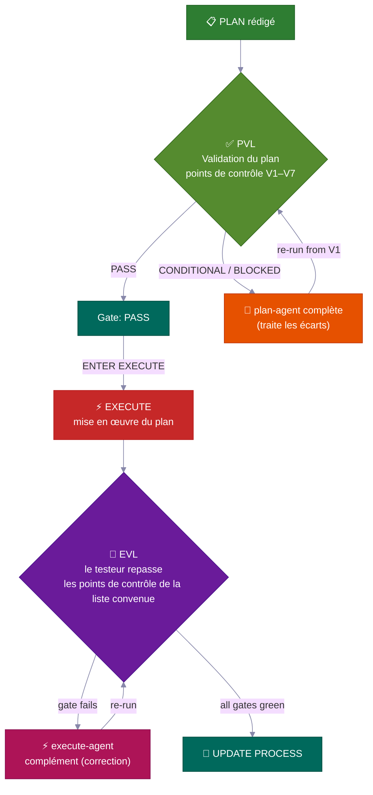

<table>
<tr>
<td width="50%" valign="top">
<h3>📋 PVL — Plan-Validate-Fix</h3>
Avant EXECUTE, <code>vc-validate-agent</code> soumet le plan à des <strong>points de contrôle V1–V7</strong> — en répartissant le travail entre plusieurs agents pour couvrir l'infrastructure, la couverture de tests, les changements cassants, la sécurité et la faisabilité par section. Un premier résultat <strong>CONDITIONAL</strong> ou <strong>BLOCKED</strong> n'est jamais définitif — il renvoie vers <code>vc-plan-agent</code> pour mettre à jour le plan, puis repasse depuis V1.
<br><br>
<sub>Suivi par <code>vc-autoresearch</code> (domain: plan) — une boucle de détection et correction d'écarts. Limite de 10 cycles. Détection de plateau. Seul <strong>Gate: PASS</strong> (ou un CONDITIONAL que vous acceptez explicitement) déverrouille EXECUTE.</sub>
</td>
<td width="50%" valign="top">
<h3>🧪 EVL — Execute-Validate-Fix</h3>
Une fois EXECUTE terminé — <strong>même quand il affirme que tous les points de contrôle sont au vert</strong> — l'agent principal <strong>déclenche toujours</strong> <code>vc-tester</code> pour repasser de façon indépendante les commandes de test exactes de la liste convenue. Un point de contrôle en échec renvoie vers un correctif ciblé de <code>vc-execute-agent</code>, puis reteste.
<br><br>
<sub>Suivi par <code>vc-autoresearch</code> (domain: tests). Limite de 10 cycles. La propre boucle interne « itérer jusqu'au vert » de l'execute-agent <strong>ne remplace jamais</strong> cette confirmation indépendante.</sub>
</td>
</tr>
</table>

> 💎 **L'échelle de verdict : PASS** → continuer · **CONDITIONAL** → écarts corrigeables ; la boucle se déclenche (ou vous les acceptez en les consignant) · **BLOCKED** → problème plus profond ; retour à PLAN (en pilote automatique : l'écart est mis en attente et l'exécution continue).

### 🔁 vc-autoresearch — Moteur de boucle partagé

PVL et EVL utilisent la même couche de suivi : **`vc-autoresearch`** — une boucle de détection → correction → répétition. L'agent principal pilote la boucle — il possède le compteur de tours, les rapports par tour, le journal TSV et les vérifications de plateau, de limite et de régression. Les agents de travail sont en mode « tire et oublie » : ils retournent un résultat et s'arrêtent. Aucun agent ne se relance lui-même ni ne lance un autre agent de phase.

Le même moteur peut fonctionner seul : « durcis cette spécification », « corrige tous les avertissements lint », « améliore la couverture de tests », « améliore cette documentation » — toute tâche répétée de détection et correction sur 6 domaines (spec · tests · ux · docs · plan · errors).

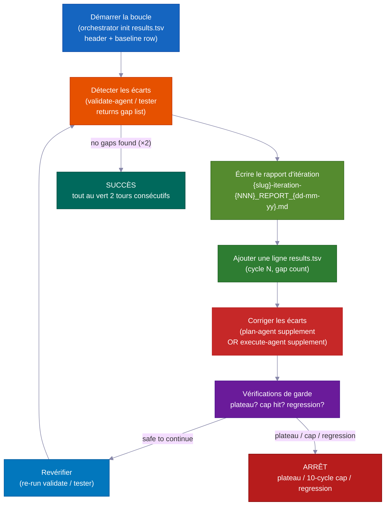

| Mode | Rôle | Arrêt quand |
|---|---|---|
| `vc-autoresearch` (core) | détecter les écarts → corriger → répéter | aucun écart trouvé OU objectif atteint |
| `vc-autoresearch:probe` | 8 personas interrogent le corpus jusqu'à saturation | aucune nouvelle contrainte pendant 3 tours |
| `vc-autoresearch:reason` | débat contradictoire avec juges aveugles | convergence des juges ou limite d'itération |
| `vc-autoresearch:evals` | analyser les résultats TSV — tendances, plateaux, recommandations | analyse uniquement |

**Conditions d'arrêt :** SUCCÈS (tout au vert deux tours de suite) · HALT_PLATEAU (aucun progrès pendant 3 tours) · HALT_CAP (limite stricte de 10 tours) · HALT_REGRESSION (un contrôle précédemment réussi échoue désormais).

---

## 👥 Comparaison de stratégie + politique de modèle

À **chaque transition de phase**, l'agent principal invoque `vc-agent-strategy-compare` pour recommander *comment* exécuter la phase suivante — avec des estimations de coût.

| Stratégie | Quand | Coordination |
|---|---|---|
| **Séquentielle** | Le travail dépend du résultat précédent | Un agent à la fois |
| **Sous-agents parallèles** | Dimensions indépendantes, mode tire-et-oublie | Aucune — l'agent principal collecte et combine les résultats |
| **Workflow** | Découpage prévisible du travail sur une liste | Étapes scriptées |
| **Équipe d'agents** | Les agents doivent se parler en cours d'exécution (ex. chacun touche des fichiers séparés sur 3+ plans de phase) | TeamCreate + liste de tâches partagée + SendMessage |

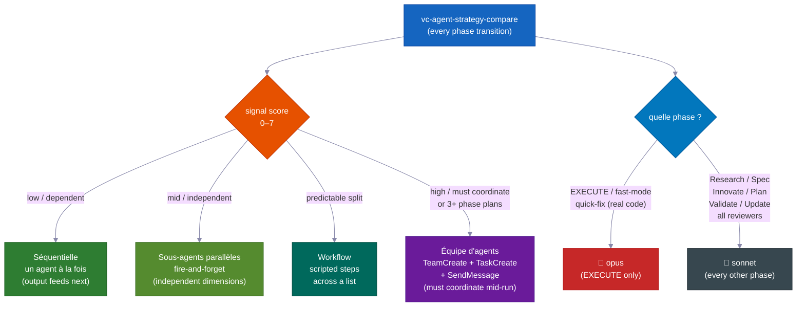

> ⚠️ **« Équipe d'agents » désigne le vrai mécanisme** — coéquipiers nommés, liste de tâches partagée et messagerie inter-agents — *pas* de simples agents parallèles appelés « équipe ». C'est **obligatoire** (non optionnel) pour la création de 3+ plans de phase et pour les modifications multi-fichiers où chaque agent doit rester dans ses propres fichiers. Seule une vraie équipe peut communiquer pendant l'exécution.

### 🧮 Politique de sélection des modèles

| Phase | Modèle | Pourquoi |
|---|---|---|
| **EXECUTE** (+ fast-mode, quick-fix avec vrai code) | 🔴 **opus** | Modifications réelles du code source, compilations, migrations |
| Research · Spec · Innovate · Plan · Validate · Update · tous les relecteurs/chercheurs | 🔵 **sonnet** | Planification et analyse — moins coûteux, largement suffisant |

> Quand le travail est réparti entre plusieurs agents, seul l'agent *de code* utilise opus. Chaque relecteur, chercheur, validateur et planificateur utilise sonnet. L'agent principal nomme le modèle chaque fois qu'il lance un agent de travail.

---

## 🤖 Mode pilote automatique — RIPER-5 mains libres

Dites **`autopilot [task]`** (ou `run autopilot`, `autonomous mode`, `ENTER AUTOPILOT MODE`) et l'agent exécute *toute* la séquence RIPER-5 restante avec **un seul** tour de clarification en amont — puis plus aucune pause jusqu'à la fin.

**Déclenchement n'importe où :** le pilote automatique peut démarrer au début d'une session *ou* à n'importe quel moment en cours de session. Au déclenchement, l'agent principal lit les fichiers sauvegardés sur le disque pour déterminer à quelle phase RIPER-5 vous en êtes, puis reprend à partir de là et pilote le reste seul.

| État sur le disque | Phase d'entrée |
|---|---|
| Aucun fichier SPEC | Démarrer à RESEARCH |
| Fichier SPEC présent | Passer à post-SPEC (INNOVATE) |
| Fichier de plan présent | Passer à post-PLAN (VALIDATE) |
| Contrat de validation avec PASS/CONDITIONAL | Passer à EXECUTE |

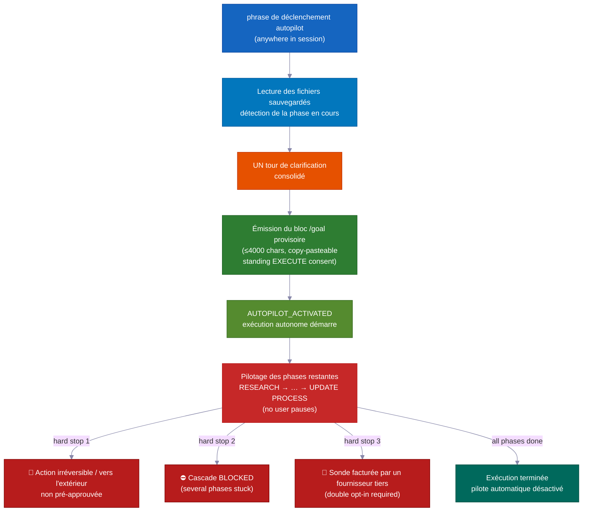

```
You: "autopilot full: add team invitations with email + role management"
→ Reads saved files → detects current phase → enters there
→ ONE consolidated clarification round (scope, hard stops, autonomy boundaries, first-phase strategy)
→ Provisional /goal block emitted (≤4000 chars, copy-pasteable, standing EXECUTE consent)
→ AUTOPILOT_ACTIVATED → drives remaining phases on its own
→ Stops ONLY for hard stops
```

### Trois voies — adapter le protocole au risque

| Voie | Déclencheur | Déroulement |
|---|---|---|
| 🟢 **quick** | `autopilot quick: [task]` | Exploration → modification → vérification ciblée. Ni plan, ni contrat, ni EVL. |
| 🟡 **fast** | `autopilot fast: [task]` | R→S→I→P→V compressé → EXECUTE + EVL. |
| 🔴 **full** | `autopilot [task]` / `autopilot full:` | RIPER-5 complet (par défaut). |

### 🌙 Mains libres : une phrase, construit pendant que vous dormez

Dites `autopilot full: [task]` — ou collez un bloc `/goal` — et tout ce qui suit se produit **sans aucune intervention humaine** :

- **Boucle de vérification et correction du plan** — détecte les écarts dans le plan, les corrige et re-vérifie. Jusqu'à 10 tours seul.
- **Boucle de construction, test et correction** — écrit le code, exécute les tests, corrige les échecs, relance. Jusqu'à 10 tours seul. Il ne fait jamais confiance à son propre « tout au vert » — un vérificateur distinct (vc-tester) repasse indépendamment chaque test pour confirmer.
- **Avancement de phase en phase** — passe de la recherche au plan, au code, jusqu'à la fin, sans attendre.
- **Reprend après une réinitialisation mémoire** — les plans, rapports et progressions vivent comme des fichiers sur le disque. Après une compaction (quand la mémoire à court terme de l'IA est effacée), la session suivante lit ces fichiers et reprend exactement là où elle s'était arrêtée.
- **Fonctionnalité bloquée ? La mettre de côté et continuer** — si une phase ne peut pas être résolue, l'agent rédige une note de backlog et passe à la fonctionnalité suivante. Vous pouvez exécuter plusieurs fonctionnalités en parallèle sans qu'un blocage n'arrête tout.
- **Équipes d'agents pour des fonctionnalités parallèles** — plusieurs agents peuvent construire des fonctionnalités séparées simultanément, chacun confiné à ses propres fichiers pour ne jamais entrer en collision. Une fonctionnalité bloquée est mise en attente, pas un obstacle pour le reste.

### Les arrêts forcés remontent toujours (même en pilote automatique)

Ce sont les **trois seuls moments où il s'arrête et vous demande** :

- 🛑 Toute action qu'il ne peut pas annuler, ou qui touche le monde extérieur et n'était pas pré-approuvée (mise en production, envoi de vrais messages, débit d'argent)
- ⛔ Plusieurs phases consécutives bloquées sans progrès — une véritable impasse qui mérite votre attention
- 💸 Un test qui dépenserait de l'argent réel sur un service externe payant — il demande avant d'exécuter

---

### 🎯 /goal — le jeton d'exécution autonome

**Obligatoire, pas décoratif :** après chaque fin de phase VALIDATE, l'agent principal *doit* émettre un bloc `/goal` copiable-collable avant le démarrage d'EXECUTE. C'est un fichier de passation obligatoire — pas un commentaire optionnel.

**Contraintes de format :**

| Type de bloc | Champs obligatoires | Limite stricte |
|---|---|---|
| Bloc post-VALIDATE | SESSION GOAL · Charter+umbrella plan · Autonomy · Hard stop conditions · Next phase · Validate contract · Execute start | ≤ 4000 chars |
| Bloc provisoire (autopilot) | SESSION GOAL · ENTRY PHASE · REMAINING PHASES · CLARIFICATIONS LOCKED · EXECUTE CONSENT · DECISION POLICY · HARD STOPS · TEST GATES · START (+ LANE optionnel) | ≤ 4000 chars |

La commande `/goal` rejette les blocs de plus de 4000 caractères. Restez concis — utilisez les champs obligatoires comme structure, pas comme essai en prose.

**Mode /goal autonome :** collez un bloc `/goal` dans une nouvelle session et l'exécution reprend à la phase nommée dans `START`. Les clarifications et règles de décision sont déjà définies — aucun nouveau tour de clarification. Sous un `/goal` actif, l'agent décide seul à chaque étape réversible, envoie les éléments BLOCKED vers un backlog et rédige ses propres rapports — mais **la délégation aux agents de travail reste obligatoire.** Le pilote automatique supprime uniquement les *pauses d'approbation*, jamais la règle d'interdiction d'exécution en ligne.

Validé par `validate-autopilot-goal-block.mjs`.

---

## 🔬 Sondes de faisabilité + Filet de sécurité des validateurs

### 🔬 Sondes de faisabilité — tester l'hypothèse avant de construire dessus

Quand SPEC, INNOVATE ou VALIDATE rencontre une hypothèse clé qu'il ne peut pas confirmer par simple lecture, il émet `VC-FEASIBILITY-PROBE-NEEDED` et s'arrête. L'agent principal lance `vc-debugger` pour exécuter un vrai test et rédiger un **VERDICT** :

| Verdict | Signification |
|---|---|
| ✅ **VIABLE** | L'hypothèse est valide — la conception peut s'appuyer dessus |
| ❌ **NOT-VIABLE** | L'hypothèse est fausse — cette approche est interdite |
| ❓ **INCONCLUSIVE** | Impossible de le prouver — conservé comme écart connu |

Chaque verdict comprend une note de conception en 3 parties : **ce que le résultat autorise · ce qu'il exclut · ce qui reste incertain** — retransmise mot pour mot dans la phase mise en pause. Les sondes sont **classées par coût** (`cheap-local` / `needs-container` / `needs-live-provider` → double opt-in / `needs-browser` / `needs-cf`) afin qu'une sonde facturée ou utilisant une ressource partagée ne s'exécute jamais silencieusement.

### 🛡️ 36 validateurs — exactitude mécanique, pas d'opinion

Le kit embarque **36 scripts de validation** qui transforment « l'agent a-t-il suivi les règles ? » en un résultat clair de réussite ou d'échec. Ils s'exécutent après toute phase touchant les fichiers du système, et comme points de contrôle obligatoires dans UPDATE PROCESS :

| Famille de validateurs | Contrôles |
|---|---|
| `vc-audit-vc` | Parité des agents (Claude/Codex), registre des compétences, portabilité du kit, frontmatter des agents |
| `vc-audit-context` | Routage de contexte, frontmatter de découverte, mots-clés des compétences |
| `vc-audit-plans` | Inventaire des plans, état de l'umbrella, complétude des phases, rapports de phase, notes de backlog |
| 14 validateurs de comportement du système vc | Chacun possède une paire de fixtures réussite/échec — sortie de comparaison de stratégie, bilan final, clarification d'intention, verdict de faisabilité, journal autoresearch, et plus encore |

---

## 🛡️ Systèmes de sécurité intégrés

Ce ne sont pas des recommandations — ce sont des **règles strictes** intégrées dans chaque agent.

<table>
<tr>
<td width="50%" valign="top">
<h1>📝</h1>
<strong>Notes de progression, pas de pauses en cours d'exécution</strong><br><br>
Pendant le codage, l'agent écrit des notes de progression dans le fichier de rapport de phase au fur et à mesure. Pas de pause en cours d'exécution, pas de message « continuer ou revenir ? ». S'il rencontre un problème nécessitant une modification du plan, il s'arrête et retourne à PLAN. Sinon il continue.
</td>
<td width="50%" valign="top">
<h1>🚫</h1>
<strong>Jamais d'écart silencieux</strong><br><br>
Si le codage rencontre un problème nécessitant une modification du plan, l'agent <strong>s'arrête immédiatement</strong>, l'explique et retourne à PLAN. Aucune improvisation silencieuse.
</td>
</tr>
<tr>
<td width="50%" valign="top">
<h1>🔐</h1>
<strong>Crochet de protection de la vie privée</strong><br><br>
L'agent est <strong>bloqué pour lire</strong> les fichiers <code>.env</code>, les identifiants, les clés SSH et les fichiers <code>.pem</code> sans approbation explicite.
</td>
<td width="50%" valign="top">
<h1>⚠️</h1>
<strong>Dossiers de preuves pour les risques élevés</strong><br><br>
Pour l'authentification, la facturation, les migrations de schéma ou les modifications d'API publique, le système exige un **dossier de preuves formel en 5 fichiers** avant de déclarer le travail « terminé » — toujours manuel, jamais contourné automatiquement.
</td>
</tr>
<tr>
<td width="50%" valign="top">
<h1>📨</h1>
<strong>Discipline des codes de statut</strong><br><br>
Les agents de travail doivent conclure avec <code>DONE</code> / <code>DONE_WITH_CONCERNS</code> / <code>BLOCKED</code> / <code>NEEDS_CONTEXT</code>. Les blocages ne sont jamais ignorés ; les problèmes d'exactitude deviennent des actions à mener.
</td>
<td width="50%" valign="top">
<h1>📊</h1>
<strong>Bilan final + score de dérive</strong><br><br>
Après le codage, un bilan final évalue l'urgence : <strong>LOW</strong> (intervention légère) → <strong>MEDIUM</strong> (significatif) → <strong>HIGH</strong> (fichiers du système ou de protocole touchés), et recommande la prochaine étape sûre.
</td>
</tr>
</table>

---

## 🔍 Intelligence pré-implémentation

Avant qu'une seule ligne de code ne soit écrite, trois compétences spécialisées peuvent détecter des problèmes :

<table>
<tr>
<td width="50%" valign="top">
<h1>🎭</h1>
<strong>Débat à 5 personas — <code>vc-predict</code></strong><br><br>
Architecte, Sécurité, Performance, UX et Avocat du diable débattent de votre plan. Produit un verdict <strong>GO / CAUTION / STOP</strong> avant que vous n'écriviez une ligne.
</td>
<td width="50%" valign="top">
<h1>🎲</h1>
<strong>Cas limites sur 12 dimensions — <code>vc-scenario</code></strong><br><br>
Décompose une fonctionnalité sur 12 dimensions (types d'utilisateurs, extrêmes de saisie, timing, échelle, état, environnement, erreurs, authentification, données, intégrations, conformité, logique métier). Le résultat sert également de spécifications de test.
</td>
</tr>
<tr>
<td width="50%" valign="top">
<h1>🔐</h1>
<strong>Audit STRIDE + OWASP — <code>vc-security</code></strong><br><br>
Audit de sécurité à double méthodologie avec audit des dépendances, détection de secrets et un **mode de correction automatique** qui trie par gravité et corrige les problèmes Critiques en premier avec des gardes contre les régressions.
</td>
<td width="50%" valign="top">
<h1>🔬</h1>
<strong>Débogage fondé sur les preuves — <code>vc-debugger</code></strong><br><br>
Collecte des preuves → formule 2 à 3 hypothèses concurrentes → teste chacune → documente le chemin d'élimination. <strong>Ne devine jamais — prouve.</strong>
</td>
</tr>
</table>

---

## ✅ Pipeline qualité — intégré à l'exécution

**Les tests d'abord, puis le code.** La liste de contrôle convenue (rédigée avant qu'un seul fichier de code ne soit touché) définit les tests exacts qui doivent réussir. L'execute-agent écrit du code jusqu'à ce que ces tests soient au vert. Puis un vérificateur distinct — `vc-tester` — repasse chaque test seul pour confirmer. Le propre « tout au vert » de l'execute-agent n'est jamais pris pour argent comptant. À la toute fin, le relecteur vérifie que l'ensemble du projet fonctionne encore ensemble, pas seulement la nouvelle partie.

L'execute-agent ne se contente pas d'écrire du code et de déclarer la tâche terminée. Il traverse automatiquement un **pipeline qualité** :

<br>

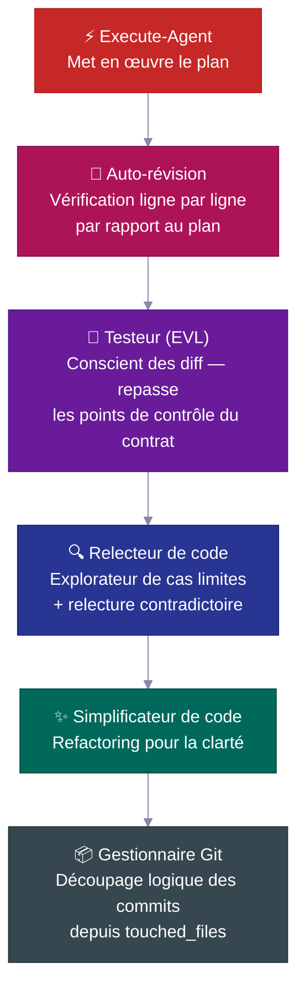

| Étape | Ce qu'elle fait |
|---|---|
| 🔎 **Auto-révision** | Vérifie chaque élément de la liste de contrôle par rapport au plan, consigne tout écart |
| 🧪 **Testeur (EVL)** | Repasse les tests de la liste convenue de façon indépendante ; associe les fichiers modifiés aux fichiers de test, monte en puissance vers la suite complète quand >70% sont associés |
| 🔍 **Relecteur de code** | Envoie un explorateur de cas limites *avant* la relecture ; vérifie les requêtes N+1, les chemins d'authentification, les fuites de données |
| ✨ **Simplificateur** | Nettoie le code pour la clarté après la relecture — sans modifier le comportement |
| 📦 **Gestionnaire Git** | Reçoit `touched_files`, découpe en commits conventionnels logiques, refuse les fichiers inconnus |

---
## 📋 Le cycle de vie d'un plan

Toute fonctionnalité non triviale suit un **cycle de vie de plan** — une spécification écrite qui est créée, révisée, utilisée comme base de développement, puis archivée en tant qu'historique permanent du projet.

<br>

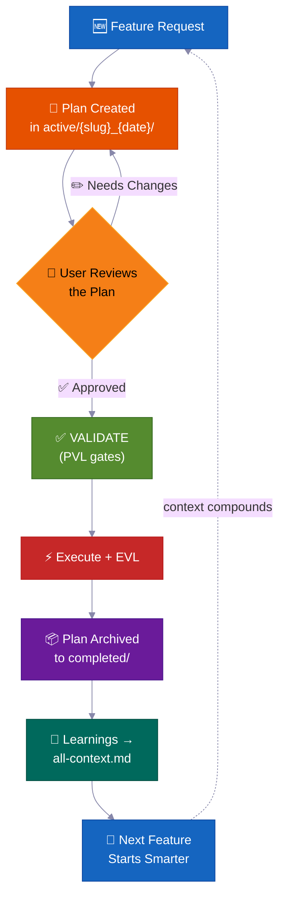

> 💡 Dans six mois, quand quelqu'un demandera *« pourquoi avons-nous construit l'authentification de cette façon ? »*, la réponse se trouvera dans `completed/`. Pas perdue dans un fil Slack.

**Où vivent les plans — convention de dossiers de tâches :**

```
process/
├── general-plans/
│   ├── active/
│   │   └── webhooks_28-05-26/          # 📋 Task folder: plan + colocated reports/refs
│   │       └── webhooks_PLAN_28-05-26.md
│   ├── completed/                       # ✅ Archived (searchable history)
│   └── backlog/                         # 📌 Deferred work
└── features/
    └── billing/                         # 🏷️ Feature-scoped (5+ artifacts)
        ├── active/{slug}_{date}/
        ├── completed/
        └── backlog/
```

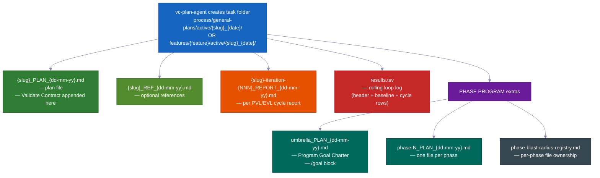

> Chaque plan contient : 📍 **points de contact** (fichiers créés/modifiés) · 📜 **contrats publics** · 💥 **les fichiers qu'il peut toucher** (ce qui pourrait casser, ce qu'il faut tester) · ✅ **preuves de vérification** · 🔄 **passation de relais**. `vc-plan-discovery` retrouve le bon plan à reprendre ; le hook `post-write-plan-check` vérifie la structure du plan à chaque écriture.

---

## 🏗️ Programmes par phases — Les grands projets qui ne s'effondrent pas

Les fonctionnalités ordinaires utilisent un seul plan. **Les grands projets multi-phases** utilisent un programme par phases — un plan chapeau plus des plans par phase, chacun exécutant une **boucle interne complète en 7 étapes** avec ses propres points de contrôle et un rapport sauvegardé.

<br>

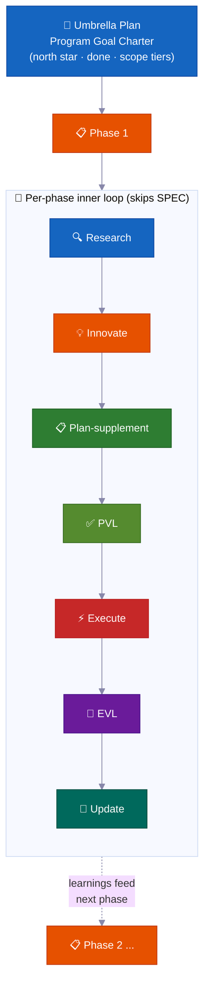

| | Fonctionnalité | Pourquoi c'est important |
|---|---|---|
| 🔄 | **Nouvelle recherche à chaque phase** | Vérifie la dérive du code, lit les derniers rapports, actualise les hypothèses |
| ✅ | **Points de contrôle par phase** | Une phase n'est pas terminée tant que les preuves ne le confirment pas. Statut honnête : `PLANNED → CODE DONE → TESTING → VERIFIED` ou `BLOCKED` |
| 📄 | **Rapports sauvegardés** | Chaque phase écrit ses résultats sur disque — la progression survit à une réinitialisation de la mémoire |
| 🧠 | **Les apprentissages se propagent en avant** | Les découvertes de la Phase 1 mettent à jour le plan de la Phase 2 avant que le code commence |
| 🏗️ | **Fondation vs expansion** | Sépare explicitement « valider l'architecture » de « tout implémenter » |
| 🚧 | **Gestion honnête des blocages** | Les phases bloquées restent à `BLOCKED` avec des preuves. Pas de faux statut vert |

<br>

### 🔀 Le programme se remodèle à mesure qu'il apprend

Le plan que vous écrivez au départ est une carte approximative, pas un contrat figé. Au fur et à mesure que le programme s'exécute, il s'ajuste — vous n'avez donc pas à prévoir chaque étape à l'avance.

**Il peut ajouter une nouvelle phase en cours d'exécution.**
En travaillant, l'agent peut découvrir une étape manquante — quelque chose qui doit se passer avant que la phase suivante puisse avancer. Dans ce cas, il insère une nouvelle phase à cet endroit, renuméroте le reste, et continue. Aucune intervention humaine nécessaire. (Signal interne : `MID_PROGRAM_PLAN_CREATED` — le nouveau plan est écrit sur disque et ajouté au registre automatiquement.)

**Il peut réordonner les phases.**
La recherche montre parfois que l'ordre prévu est incorrect — par exemple, la Phase 3 dépend de quelque chose que seule la Phase 4 produit. L'agent réorganise les phases restantes et consigne la raison. (Signal interne : `PHASE_RESTRUCTURE_NOTICE` — sauvegardé dans le rapport de phase comme trace d'audit, pas comme bloquant.)

**Il met à jour le plan de chaque phase juste avant de la coder.**
Avant qu'une phase commence à coder, une rapide revue de recherche examine ce que le programme a appris jusqu'ici. Elle met ensuite à jour la liste de contrôle de cette phase avec les nouvelles découvertes. C'est ce qu'on appelle une étape de **plan-supplement**. Les plans ne sont jamais figés — ils absorbent les faits récents des phases précédentes.

**Il saute le travail qui ne peut pas encore commencer.**
Si une phase dépend de quelque chose qui n'est pas encore prêt — un service pas encore construit, une décision pas encore prise — l'agent marque cette phase comme bloquée par une dépendance, la met de côté, et passe à la suivante. Le programme entier ne s'arrête pas parce qu'une phase attend.

**Il sait quand s'arrêter et demander.**
Une seule phase bloquée est simplement mise en attente et le programme continue. Mais si plusieurs phases consécutives se heurtent à un mur sans progrès, l'agent considère cela comme une impasse réelle — un **arrêt en cascade** — et s'interrompt pour vous montrer ce qui s'est passé. Une phase bloquée, c'est normal. Plusieurs d'affilée signalent un problème structurel.

**Il tient un tableau de bord en direct.**
Chaque programme dispose d'une section de statut d'une page dans le plan chapeau indiquant quelle phase est en cours, si elle est terminée, et où se trouve le rapport. N'importe qui — ou l'agent lui-même après une réinitialisation de la mémoire — peut le lire et savoir exactement où en sont les choses. Il tient également un simple registre de fichiers pour que deux phases travaillant en même temps ne modifient jamais les mêmes fichiers.

**Une grande vérification finale.**
À la fin du programme entier, l'agent effectue un test de bout en bout pour s'assurer que l'ensemble du projet fonctionne encore — pas seulement chaque partie individuellement. Les points de contrôle par phase prouvent que chaque partie fonctionne ; cette vérification finale prouve que les parties fonctionnent ensemble.

---

### 🧠 Il ne perd jamais sa place (survit à une réinitialisation de la mémoire)

Les longs travaux se terminent correctement — même quand la mémoire de l'IA se réinitialise en cours de route. Le plan, la progression et les preuves vivent dans des fichiers sur disque, pas seulement dans la tête de l'agent.

Les agents IA ont une mémoire de travail limitée. Sur un long travail, cette mémoire se remplit et se compresse — les détails peuvent se brouiller. Quand une nouvelle session commence (ou que la mémoire est effacée), l'agent ne devine pas où il s'était arrêté. Il lit les fichiers.

Voici exactement comment cela fonctionne :

**1. Il écrit un court rapport après chaque phase.**
Quand une phase se termine, un fichier de rapport est écrit sur disque. La progression vit dans votre dossier de projet, pas seulement dans la tête de l'agent. Une compression de mémoire ne peut pas effacer un fichier.

**2. Il tient une liste de contrôle des étapes terminées.**
Chaque plan de phase contient une liste **Phase Loop Progress** — des cases à cocher pour chaque étape (recherche, vérification du plan, construction, test, capture des apprentissages). Après une réinitialisation, l'agent lit ces cases et connaît exactement l'étape suivante. Pas besoin de le remettre à niveau.

**3. Une brève « enveloppe » au début de chaque phase.**
Chaque agent travailleur (un assistant spécialisé qui effectue une phase de travail) commence par émettre une **Context Envelope** — une note de 10 champs : quelle fonctionnalité, quelle phase, quelle branche, quel fichier de plan, quels tests exécuter. Quelques secondes suffisent pour la lire. L'agent est prêt avant de faire quoi que ce soit.

**4. Il fait confiance aux fichiers plutôt qu'à sa propre mémoire.**
À la reprise, l'agent vérifie ce qui se trouve réellement dans le code et l'historique git par rapport à ce que dit le plan. L'état réel l'emporte. Un plan devenu obsolète ne peut pas induire l'agent en erreur en répétant du travail ou en sautant des étapes.

**5. Un tableau de bord en direct et des rapports par cycle.**
Chaque boucle de correction (la boucle de vérification du plan et la boucle de construction-test) tient un fichier tableau de bord `results.tsv` — une ligne par cycle, suivant le nombre de problèmes restants. Quand une session se termine en plein milieu d'une boucle, la session suivante lit le compteur, reprend au bon cycle, et continue. Aucun cycle n'est perdu.

**6. Il réinjecte un rappel à la reprise.**
Quand la mémoire est compressée, le système recharge automatiquement la dernière note de statut dans la nouvelle session. Si une approbation était en attente — par exemple, un point de contrôle nécessitant un « oui » avant de continuer — le rappel le signale. Rien n'est silencieusement ignoré.

> 💡 En résumé : vous pouvez lancer une exécution en mode automatique, fermer votre ordinateur portable, et revenir des heures plus tard. L'agent sera exactement là où il devrait être — ou reprendra depuis le dernier point de contrôle sauvegardé, avec des preuves sur disque pour le confirmer.

---

## 🧠 Groupes de contexte

La connaissance du projet est organisée en **groupes de contexte** — des domaines de connaissance stables, chacun avec un fichier routeur `all-{group}.md` qui indique aux agents quoi lire et quand. Les agents suivent le routeur, ne chargeant que ce qui est pertinent — pas toute la base de connaissances à chaque fois.

<br>

```
process/context/
├── all-context.md              # 🧭 Root router — architecture, stack, patterns, conventions
├── tests/all-tests.md          # 🧪 Test runners, commands, debugging procedures
├── container/all-container.md   # 🐳 Docker, deployment, infra procedures
├── uxui/all-uxui.md            # 🎨 Components, design tokens, patterns
├── infra/all-infra.md          # 🖥️ Server infrastructure, deployment
└── {your-domain}/all-{domain}.md  # 📚 Any domain with 3+ durable docs (auto-promoted)
```

| | Comment ça fonctionne |
|---|---|
| 🧭 **Modèle routeur** | Les agents ne lisent que ce qui est pertinent pour leur tâche |
| 📏 **Promotion automatique** | Les sujets avec 3+ docs (ou un seul fichier devenu trop volumineux) obtiennent leur propre groupe |
| 🔄 **Toujours à jour** | Mis à jour par `vc-update-process-agent` après chaque fonctionnalité non triviale |
| 🧪 **Vérifiable** | `vc-audit-context` contrôle le routage, les métadonnées de découverte et la cohérence |
| 📨 **Context Envelope** | Chaque agent de boucle interne émet une note de 10 champs au démarrage (feature → phase → session-goal → branch → worktree → context-group → blast-radius-packages → active-plan → test-runner → validate-contract) pour qu'un agent travailleur fraîchement démarré sache exactement où il en est |

> Le kit ne livre que la base du protocole — vos groupes de contexte sont **construits pour votre projet** par `vc-setup`, en analysant votre vrai code. Ce sont des modèles, pas une liste fixe.

---

## 📁 Dossiers de fonctionnalités

Quand un sujet accumule 5 fichiers ou plus, il obtient son propre **dossier de fonctionnalité** — un conteneur de cycle de vie complet.

```
process/features/{feature}/
├── active/{slug}_{date}/   # 📋 Plans being worked on (reports/refs colocated)
├── completed/              # ✅ Archived plans (searchable decision history)
└── backlog/                # 📌 Deferred work (agents check before duplicating)
```

| | Ce qui se passe |
|---|---|
| 🆕 | Le nouveau travail commence dans `active/` → les rapports s'accumulent → le plan est archivé dans `completed/` |
| 📌 | Le travail différé va dans `backlog/` — les agents le vérifient avant de créer des plans en double |
| 📦 | La promotion de fonctionnalité se fait automatiquement quand les artefacts généraux atteignent 5+ |
| 🔍 | Chaque fonctionnalité possède un historique complet et autonome — plans, décisions, rapports, recherches |

---

## 🧱 Couches de compétences

Les 33 compétences se répartissent en trois couches. Chaque `SKILL.md` déclare sa `layer` + ses `trigger_keywords` dans l'en-tête, et un catalogue généré maintient la découverte rapide.

<table>
<tr>
<td width="33%" valign="top">
<h1>🎭</h1>
<strong>Agents acteurs</strong><br><br>
Possèdent une phase ou un rôle. Vivent dans <code>.claude/agents/</code> — ce sont les 15 agents, pas des compétences.
</td>
<td width="33%" valign="top">
<h1>📜</h1>
<strong>Compétences contractuelles (20)</strong><br><br>
Chacune produit un fichier spécifique ou une sortie convenue — <code>vc-generate-plan</code>, <code>vc-validate-findings</code>, <code>vc-autopilot</code>, les audits. Les résultats peuvent être vérifiés.
</td>
<td width="33%" valign="top">
<h1>🛠️</h1>
<strong>Compétences auxiliaires (13)</strong><br><br>
Améliorent <em>la façon dont</em> les agents travaillent, ne produisent aucun fichier propre — <code>vc-scout</code>, <code>vc-sequential-thinking</code>, <code>vc-problem-solving</code>, <code>vc-docs-seeker</code>.
</td>
</tr>
</table>

---

## 🧠 Mémoire de projet auto-améliorante

Chaque fonctionnalité terminée réinjecte ses apprentissages dans le système de contexte — **la connaissance s'accumule, elle ne se réinitialise pas.**

La plupart des bases de code assistées par IA ont la propriété inverse : chaque nouvelle session repart de zéro. L'agent relit les mêmes fichiers, redécouvre les mêmes modèles, et reprend les mêmes décisions — parce que les insights de la dernière session vivaient uniquement dans une fenêtre de chat. La réponse du kit n'est pas une astuce de prompt. C'est un **système de fichiers de contexte durable** (`process/context/`) que chaque agent lit au démarrage de session, que chaque validateur protège, et que chaque fonctionnalité terminée enrichit.

Six mois et de nombreuses réinitialisations de mémoire plus tard, l'agent sait toujours *pourquoi* votre authentification fonctionne ainsi — parce que cette connaissance est sur disque, routée et vérifiable, pas piégée dans une session morte.

<br>

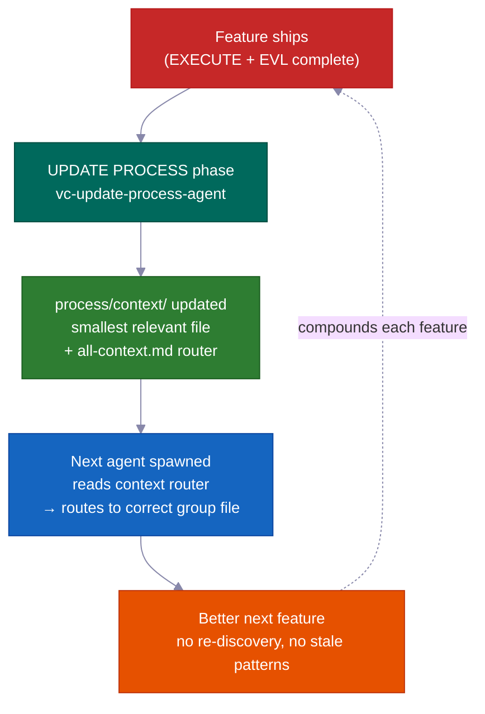

### Le mécanisme central : `process/context/` comme mémoire portable et partagée

`process/context/` contient des connaissances structurées organisées en groupes thématiques — décisions d'architecture, conventions de codage, étapes de déploiement, modèles de test, faits d'infrastructure. Contrairement à un historique de chat, cette connaissance :

- **voyage dans chaque agent travailleur** — `vc-context-discovery` oriente chaque agent démarré vers le bon routeur `all-{group}.md` pour sa tâche, puis vers le fichier approfondi le plus pertinent. Un agent de recherche, un agent de planification et un agent de codage démarrent tous avec la même compréhension partagée
- **survit à une réinitialisation de mémoire** — elle est sur disque, pas dans une fenêtre de contexte ; une session compressée n'en perd rien
- **est lisible par Claude et Codex** — `.agents/skills` est un lien raccourci vers `.claude/skills/`, de sorte que le même système de contexte sert les deux agents sans duplication

Le routeur racine (`all-context.md`) pointe vers les routeurs de groupe (`all-{group}.md`), qui orientent vers le fichier approfondi le plus pertinent. Les agents suivent le routeur — ils ne codent jamais en dur les chemins de fichiers. Cela signifie que les renommages et les divisions de groupes nécessitent uniquement des modifications de routeur, pas une recherche dans toute la base de code.

```
process/context/
├── all-context.md                  ← root router (architecture, stack, patterns)
├── tests/all-tests.md              ← test runners, debugging, commands
├── container/all-container.md      ← Docker, deployment, infra procedures
├── uxui/all-uxui.md                ← components, design tokens, visual conventions
└── {domain}/all-{domain}.md        ← any domain with 3+ durable docs (auto-promoted)
```

<br>

### Ce qui rend le système auto-améliorant (et pas seulement des « docs vivants »)

L'expression « docs vivants » signifie généralement « docs que nous avons l'intention de tenir à jour mais qu'on oublie surtout. » Ce système impose l'intention mécaniquement.

**La phase UPDATE PROCESS exige une revue de contexte par fichier avant de pouvoir se clôturer.** `vc-update-process-agent` ne peut pas terminer une phase tant que chaque fichier de contexte potentiellement affecté n'a pas été examiné avec une raison concrète par fichier. « Aucune mise à jour nécessaire » est autorisé — mais il doit nommer chaque fichier examiné et expliquer pourquoi. Les raisons vagues sont rejetées. Le point de contrôle est binaire : consigner la revue, ou la phase ne se clôt pas.

La boucle de rétroaction complète par fonctionnalité terminée :

| Étape | Responsable | Ce qui se passe |
|------|-------|-------------|
| 1. Analyse du diff git | `vc-scout` | Mappe les fichiers modifiés → zones de contexte affectées |
| 2. Revue par fichier | `vc-update-process-agent` | Nomme chaque fichier de contexte, indique la mise à jour ou un explicite « pas de changement + raison » |
| 3. Mises à jour appliquées | agents travailleurs en parallèle | Le fichier de contexte de chaque zone est mis à jour avec les nouveaux modèles, décisions, apprentissages |
| 4. Routage vérifié | `validate-context-discovery.mjs` | Confirme que chaque doc est indexé et que les routeurs sont cohérents |
| 5. Découverte confirmée | `validate-all-context.mjs` | Confirme que `all-context.md` et les routeurs de groupe correspondent aux fichiers actuels sur disque |

Votre 100ème fonctionnalité bénéficie de tout ce qui a été appris lors des 99 premières — pas comme une aspiration, mais comme une garantie mécanique.

<br>

### Aperçu en avant : les apprentissages se propagent vers l'avant, pas seulement en arrière

Chaque rapport de phase contient une section `## Forward Preview` écrite pour l'agent de la *prochaine* phase. Elle donne les commandes exactes à maintenir au vert, les changements de dépendances et les changements de portée de fichiers découverts en cours de phase. L'agent qui reprend la Phase 3 n'a pas à relire la sortie de la Phase 2 et à deviner ce qui compte. Il reçoit un résumé ciblé.

C'est différent des docs de contexte : les docs de contexte portent une connaissance *durable* (des décisions qui restent vraies d'une fonctionnalité à l'autre) ; Forward Preview porte un état de passation *temporaire* (ce que la prochaine session de travail doit savoir maintenant).

<br>

### La suite de validateurs prévient l'obsolescence

La connaissance durable devient obsolète quand personne ne la vérifie. Le kit livre des validateurs qui s'exécutent dans le cadre de chaque clôture de phase :

| Validateur | Ce qu'il détecte |
|-----------|----------------|
| `validate-context-discovery.mjs` | Docs non indexés par aucun routeur ; liens cassés ; métadonnées manquantes |
| `validate-all-context.mjs` | `all-context.md` désynchronisé avec les fichiers réels sur disque |
| `validate-skill-keywords.mjs` | Compétences sans champs `trigger_keywords` ou `layer` (casse le routage Étape 0) |
| `validate-protocol-discovery.mjs` | Fichiers de protocole dans `process/development-protocols/` sans métadonnées de découverte |

Ceux-ci s'exécutent comme des vérifications automatisées — un doc obsolète ou orphelin échoue. Le système surveille sa propre santé.

<br>

### Les groupes de contexte s'auto-organisent

Les groupes sont créés automatiquement quand un sujet atteint 3+ docs ou qu'un seul fichier dépasse ~800 lignes. Les agents suivent les routeurs et ne codent jamais les chemins en dur — ainsi, ajouter un nouveau groupe (ex. `process/context/billing/all-billing.md`) nécessite uniquement une mise à jour du routeur, pas de modifications de chaque agent qui mentionne la facturation. Le routeur est la référence stable ; les fichiers derrière lui peuvent se réorganiser librement.

> Le kit amorce les groupes de contexte depuis votre vraie base de code (via `vc-setup`). Les groupes ne sont pas une liste fixe — ce sont des modèles. Votre zone d'authentification, votre zone d'infrastructure, votre zone de paiements deviennent chacune une connaissance routable de premier ordre à mesure que le projet grandit.

---

## 🤖 Ce qui est inclus

<br>

### 15 Agents

<details>
<summary>Cliquez pour afficher la liste des agents</summary>

<br>

**Agents de flux principaux** — un par phase RIPER-5 (R → SPEC → I → P → V → E → UP) :

| Agent | Modèle | Rôle |
|-------|:---:|------|
| 🔍 `vc-research-agent` | sonnet | Recherche dans la base de code + web, lecture seule. Suivi des contradictions intégré |
| 📝 `vc-spec-agent` | sonnet | Document de spécifications pour la découverte produit avant INNOVATE. Produit `*_SPEC_*.md` |
| 💡 `vc-innovate-agent` | sonnet | Compare 2-3 approches. Résumé de décision (choisie + rejetée) avant PLAN |
| 📋 `vc-plan-agent` | sonnet | Rédige le plan avec des gardes anti-raccourcis. « Je sais déjà comment faire » n'est pas un plan |
| ✅ `vc-validate-agent` | sonnet | Transforme le plan en liste de contrôle convenue (V1–V7). Point de contrôle : PASS/CONDITIONAL/BLOCKED |
| ⚡ `vc-execute-agent` | **opus** | Implémente selon le plan. Notes de progression dans le rapport de phase, protocole de déviation, auto-révision |
| ⏩ `vc-fast-mode-agent` | **opus** | R→S→I→P→V compressés avec une pause de sécurité obligatoire avant EXECUTE |
| 🔧 `vc-quick-fix-agent` | **opus** | Voie QUICK FIX : une petite modification à faible risque + vérification ciblée, sans plan/validation |
| 🧠 `vc-update-process-agent` | sonnet | Clôture en 7 phases : archiver, mettre à jour le contexte, scan des artefacts obsolètes, apprentissages |

<br>

**Agents spécialistes** — appelés pendant EXECUTE ou en autonome :

| Agent | Rôle |
|-------|------|
| 🐛 `vc-debugger` | Collecte des preuves avant de formuler une hypothèse. Hypothèses concurrentes, chaînes d'élimination, sondes de faisabilité |
| 🧪 `vc-tester` | Sensible aux changements. Réexécute les tests de la liste de contrôle convenue (EVL). Escalade automatique sur les changements de config |
| 🔎 `vc-code-reviewer` | Envoie un éclaireur de cas limites AVANT la revue. Détection N+1, vérification des chemins d'authentification |
| ✨ `vc-code-simplifier` | Range le code pour plus de clarté sans modifier le comportement |
| 🎨 `vc-ui-ux-designer` | Frontend sensible au design. Peut démarrer un agent de recherche en cours de construction |
| 📦 `vc-git-manager` | Divise en commits logiques depuis `touched_files`. Refuse les fichiers inconnus |

</details>

<br>

### 33 Compétences (auto-découvertes)

<details>
<summary>Cliquez pour afficher la liste des compétences (20 contractuelles + 13 auxiliaires)</summary>

<br>

**📜 Compétences contractuelles (20)** — possèdent un artefact : `vc-generate-plan` · `vc-generate-context` · `vc-generate-spec` · `vc-generate-closeout` · `vc-generate-phase-program` · `vc-audit-context` · `vc-audit-plans` · `vc-audit-vc` · `vc-update` · `vc-publish` · `vc-feasibility-test` · `vc-risk-evidence-pack` · `vc-test-coverage-plan` · `vc-validate-findings` · `vc-autoresearch` · `vc-intent-clarify` · `vc-autopilot` · `vc-agent-strategy-compare` · `vc-plan-discovery` · `vc-context-discovery`

**🛠️ Compétences auxiliaires (13)** — améliorent le fonctionnement des agents : `vc-review-situation` · `vc-sequential-thinking` · `vc-problem-solving` · `vc-scout` · `vc-debug` · `vc-docs-seeker` · `vc-frontend-design` · `vc-agent-browser` · `vc-web-testing` · `vc-setup` · `vc-predict` · `vc-scenario` · `vc-security`

</details>

> **⚠️ Règle de nommage :** N'utilisez PAS le préfixe `vc-` pour vos propres compétences ou agents — cet espace de noms est réservé aux fichiers livrés par le kit, et la garde de suppression des éléments obsolètes traite tout chemin `vc-*` sous `.claude/skills/` et `.claude/agents/` comme appartenant au kit. Utilisez `my-`, `team-`, ou `proj-` à la place.

<br>

### 🪝 10 Hooks

| Hook | Ce qu'il fait |
|------|-------------|
| 🔐 `privacy-block.cjs` | Bloque la lecture de `.env`, des identifiants, des clés SSH. Nécessite une approbation explicite |
| 🚫 `scout-block.cjs` | Empêche de s'aventurer dans `node_modules/`, `dist/`. `.ckignore` avec syntaxe gitignore |
| 🧠 `session-init.cjs` | Détecte la pile technologique, injecte l'environnement, récupère les points d'approbation après compression |
| 💉 `subagent-init.cjs` | Injecte un bloc de contexte compact dans chaque sous-agent |
| ✨ `post-edit-simplify-reminder.cjs` | Après 5+ modifications, suggère d'exécuter le simplificateur (non bloquant, régulé) |
| 📛 `descriptive-name.cjs` | Conventions de nommage de fichiers selon la langue à chaque écriture |
| 📊 `session-state.cjs` | Métriques de session + gestion de la conscience des tokens |
| 📋 `post-write-plan-check.mjs` | Valide la structure des artefacts de plan à chaque écriture dans un `*_PLAN_*.md` |
| 🧹 `post-commit-lint.mjs` | Vérifie le préfixe conventional-commits à chaque `git commit` |
| 🔍 `stop-validator-sweep.cjs` | Exécute les validateurs principaux du harnais quand la session s'arrête |

<br>

**Où tout se trouve :**

```text
your-project/
├── .claude/{agents,skills,hooks}/   # 🤖 15 agents · ⚡ 33 skills · 🪝 10 hooks
├── .codex/agents/                   # 🔄 Mirrored for Codex
├── .agents/skills -> .claude/skills # 🔗 Symlink for Codex discovery
├── CLAUDE.md · AGENTS.md            # 📋 Orchestrator config + cross-tool registry
└── process/
    ├── context/                     # 🧠 Domaines de connaissance routés automatiquement
    ├── general-plans/               # 📋 Plans transversaux + dossiers de tâches
    ├── features/                    # 🏷️ Dossiers de cycle de vie par fonctionnalité
    └── development-protocols/       # 📜 22 documents de flux de travail partagés
```

---

## ⚡ Correction rapide + Mode rapide

Deux options allégées pour quand le processus RIPER-5 complet est plus que ce dont le travail a besoin :

<table>
<tr>
<td width="50%" valign="top">
<h1>🔧</h1>
<strong>Correction rapide</strong> — <code>"quick fix: …"</code><br><br>
Plus grand qu'un simple one-liner trivial, plus petit que « nécessite un plan ». L'agent principal effectue une exploration en lecture seule → confirmation en une ligne → démarre <code>vc-quick-fix-agent</code> pour la modification + une vérification ciblée sur les fichiers touchés uniquement. <strong>Pas de plan, pas de liste de contrôle convenue, pas de EVL.</strong>
<br><br>
<sub>Annulé immédiatement si la modification touche le schéma, l'authentification, l'API, la facturation ou les surfaces de migration — elle est alors routée vers RESEARCH complet.</sub>
</td>
<td width="50%" valign="top">
<h1>⏩</h1>
<strong>Mode rapide</strong> — <code>"ENTER FAST MODE - …"</code><br><br>
Compresse RESEARCH + SPEC + INNOVATE + PLAN + VALIDATE en un seul passage — mais **écrit quand même un plan, écrit une liste de contrôle convenue, et s'arrête avant EXECUTE.**
<br><br>
<sub>En Mode rapide standard, il y a une pause après VALIDATE — vous révisez, puis dites "ENTER EXECUTE MODE." Utilisez <code>autopilot fast: [task]</code> pour supprimer cette pause et aller jusqu'au bout sans s'arrêter.</sub>
</td>
</tr>
</table>

---

## 🔄 Cycle de vie du kit : Installer · Configurer · Mettre à jour · Publier

| Commande | Ce qu'elle fait | Quand |
|---|---|---|
| `curl … install.sh \| bash` | Synchronise les fichiers du kit sans écraser les vôtres ; détecte automatiquement nouvelle installation vs mise à jour et vous guide | Première installation + chaque mise à jour |
| **Exécuter vc-setup** | Détecte la pile, structure `process/`, analyse en profondeur la base de code, remplit le vrai contexte | Après une nouvelle installation |
| **Exécuter vc-update** | Calcule un diff précis, montre ce qui va changer, attend votre accord ; migre les plans/dossiers d'ancien format sans perte de données | À chaque mise à jour |
| **Exécuter vc-publish** *(mainteneurs)* | Publie les modifications du harnais vers le dépôt du kit | Contribution au kit lui-même |

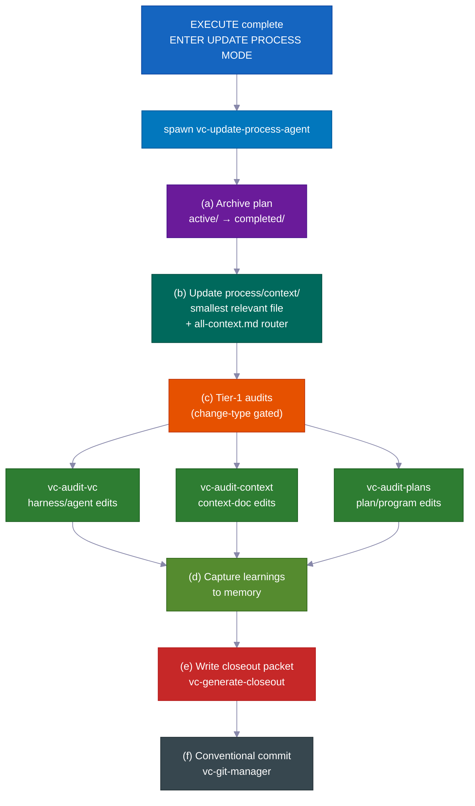

> 💡 `vc-update` affiche un aperçu du diff et attend votre accord. Votre répertoire `process/` et le contenu spécifique au projet ne sont **jamais** modifiés silencieusement. Relancer l'installation est sans risque.

---

## 💡 D'autres raisons pour lesquelles ça fonctionne

Beaucoup de petits réglages intelligents s'additionnent pour moins de surveillance et un coût réduit.

- **Chaque rôle n'obtient que les outils dont il a besoin.** Pendant la planification, l'agent ne peut littéralement pas modifier le code — ces outils sont désactivés. Cela empêche l'agent de prendre de l'avance et de changer des choses avant que le plan soit approuvé. Le système tout simplement ne le permet pas.

- **Il utilise le modèle IA premium uniquement là où ça compte.** L'écriture de code utilise le modèle supérieur. La planification, la recherche, la revue et la vérification utilisent un modèle moins cher et plus rapide. Résultat : environ 60–70 % de coût en moins comparé à utiliser le modèle supérieur pour tout — sans perte de qualité sur ce qui compte.

- **Il teste les suppositions risquées avant de construire dessus.** Quand l'agent n'est pas sûr que quelque chose fonctionnera — un comportement d'API spécifique, une fonctionnalité de bibliothèque, une hypothèse d'infrastructure — il effectue d'abord une petite expérience réelle. Le résultat est clair : fonctionne, ne fonctionne pas, ou incertain. Ce verdict et une note en langage simple sont directement intégrés dans le plan. L'agent ne passe pas des heures à construire sur une mauvaise hypothèse.

- **Des points de sauvegarde soignés et significatifs.** Les modifications sont commitées en morceaux logiques propres avec des messages clairs — automatiquement. L'historique est facile à lire et facile à annuler pièce par pièce.

- **Des rappels automatiques utiles.** De petits assistants intégrés rappellent des choses comme exécuter les bonnes vérifications sur les fichiers modifiés, garder le code simple, et écrire un message de commit approprié. La qualité reste élevée sans que vous ayez à la surveiller.

- **Vous pouvez exécuter la boucle auto-améliorante seule.** Le même moteur « trouver des problèmes, les corriger, répéter » qui pilote la vérification des plans et la correction des tests fonctionne également comme un outil autonome sur n'importe quelle zone désordonnée — une spec, les docs, les tests, une liste d'erreurs. Pas besoin d'une construction de fonctionnalité complète pour l'utiliser.

- **Preuve intégrée que les règles de flux de travail fonctionnent réellement.** Le kit est livré avec sa propre suite de tests : un ensemble de vérifications avec des exemples corrects et incorrects connus qui prouvent que les règles de flux de travail se comportent correctement. Le système se vérifie lui-même. Pas besoin de faire confiance que les garde-fous sont en place — vous pouvez exécuter les vérifications et voir.

---

## Contribuer

Les contributions sont les bienvenues ! Voir [CONTRIBUTING.md](CONTRIBUTING.md) pour les directives.

<br>

**Liens rapides :**

- 🐛 [Signaler un bug](https://github.com/withkynam/vibecode-pro-max-kit/issues/new?template=1.bug_report.yml)
- 💡 [Demander une fonctionnalité](https://github.com/withkynam/vibecode-pro-max-kit/issues/new?template=2.feature_request.yml)
- ⚡ [Soumettre une compétence](https://github.com/withkynam/vibecode-pro-max-kit/issues/new?template=3.skill_submission.yml)
- 🌐 [Ajouter une traduction](https://github.com/withkynam/vibecode-pro-max-kit/issues/new?template=5.translation.yml)

<br>

<a href="https://github.com/withkynam/vibecode-pro-max-kit/graphs/contributors">
  
</a>

<br>

### 🙏 Remerciements

vibecode-pro-max-kit se concentre sur le cadre de développement piloté par les spécifications et l'organisation de contexte auto-améliorante, sans vous surcharger de 80+ compétences. Moins d'outils, plus de structure.

---

## ⭐ Historique des étoiles

<a href="https://star-history.com/#withkynam/vibecode-pro-max-kit&Date">
 <picture>
   <source media="(prefers-color-scheme: dark)" srcset="https://api.star-history.com/svg?repos=withkynam/vibecode-pro-max-kit&type=Date&theme=dark" />
   <source media="(prefers-color-scheme: light)" srcset="https://api.star-history.com/svg?repos=withkynam/vibecode-pro-max-kit&type=Date" />
   
 </picture>
</a>

---

## 📄 Licence

MIT
