<p align="center">
  <a href="../../README.md">English</a> |
  <a href="README.zh-CN.md">简体中文</a> |
  <a href="README.ja-JP.md">日本語</a> |
  <a href="README.ko-KR.md">한국어</a> |
  <a href="README.vi-VN.md">Tiếng Việt</a> |
  <a href="README.pt-BR.md">Português</a> |
  <a href="README.es.md">Español</a> |
  <a href="README.de.md">Deutsch</a> |
  <a href="README.fr.md">Français</a> |
  <strong>हिंदी</strong>
</p>

<div align="center">

<a href="https://flowser.ai">
  
</a>

*विश्वस्तरीय इंजीनियरों द्वारा निर्मित, vibecoders के लिए*<br>
*[flowser.ai](https://flowser.ai) — GTM के लिए कंप्यूटर वाले AI Agents*

<br>

# vibecode-pro-max-kit

<br>

<p align="center">
  
  <br><br>
  <em>"पूर्ण एकाग्रता — Spec श्वास, दसवाँ रूप: Vibe Flow कभी नहीं टूटता।"</em><br>
  <strong>— तंजिरो कामादो</strong>
</p>

*इसे किसी भी project में डालें। आपके AI agent को एक पूरी plan-first development process मिल जाती है — 7 gated phases, self-healing check loops, और autopilot जो शुरू से अंत तक बिना अपनी जगह खोए चलता है।*

<table align="center">
<tr>
<td width="50%" valign="top"><strong>📦 एक command में install</strong><br>एक <code>curl</code> line इसे किसी भी project में डाल देती है। यह नए और पुराने दोनों users को detect करती है और आपकी files कभी overwrite नहीं करती।</td>
<td width="50%" valign="top"><strong>🌐 हर जगह काम करता है</strong><br>कोई भी tech stack, कोई भी language, और कोई भी AI coding agent — Claude Code, Codex, Cursor, Windsurf, Copilot, और अन्य।</td>
</tr>
<tr>
<td valign="top"><strong>🧭 RIPER-5 plan-first workflow</strong><br>7 gated phases (Research → Spec → Innovate → Plan → Validate → Execute → Update-Process) agent को सीधे code लिखने से रोकते हैं।</td>
<td valign="top"><strong>🚀 Autopilot mode (quick / fast / full)</strong><br>किसी भी phase पर एक ही phrase से hands-free run शुरू करें। तीन lanes जोखिम के अनुसार ceremony को adjust करती हैं।</td>
</tr>
<tr>
<td valign="top"><strong>🎯 <code>/goal</code> — run-until-done token</strong><br>एक copy-pasteable block agent को phase दर phase बिना रुके चलाता है — और fresh session में run फिर से शुरू कर देता है।</td>
<td valign="top"><strong>🔁 PVL + EVL self-healing loops</strong><br>Plan-check-fix और test-check-fix loops खुद gaps ढूंढते हैं, ठीक करते हैं, और दोबारा जांचते हैं — हर एक 10 cycles तक।</td>
</tr>
<tr>
<td valign="top"><strong>🔍 vc-autoresearch</strong><br>एक reusable find-gaps → fix → repeat loop जिसे आप plans, tests, specs, docs, या evals पर लगा सकते हैं।</td>
<td valign="top"><strong>🧪 Feasibility probes</strong><br>किसी भी design approach पर commit करने से पहले test-before-you-build verdicts (VIABLE / NOT-VIABLE)।</td>
</tr>
<tr>
<td valign="top"><strong>🎛️ Smart strategy picker</strong><br>हर phase से पहले यह तय करता है — एक agent, कई agents, या एक coordinated team — cost estimates के साथ — और सबसे सस्ता सही option चुनता है।</td>
<td valign="top"><strong>🧮 Smart model use</strong><br>महंगा model सिर्फ code लिखता है; सस्ता model बाकी सब करता है। कम लागत, वही quality।</td>
</tr>
<tr>
<td valign="top"><strong>🤔 Intent clarification</strong><br>जब request अस्पष्ट हो, agent अंदाज़ा लगाने और गलत चीज़ बनाने की बजाय पहले कुछ सटीक सवाल पूछता है।</td>
<td valign="top"><strong>🛡️ 36 validators</strong><br>Mechanical correctness checks — opinions नहीं — kit की अपनी structure की रक्षा करते हैं और ship होने से पहले drift को पकड़ते हैं।</td>
</tr>
<tr>
<td valign="top"><strong>🏗️ Phase programs</strong><br>बड़े projects को independent phases में बांटा जाता है जिनके बीच quality gates होते हैं, ताकि बड़ा काम बिखरे नहीं।</td>
<td valign="top"><strong>🔀 Programs जो खुद को reshape करते हैं</strong><br>सीखने के साथ-साथ agent नए phases insert करता है, काम को reorder करता है, और blocked steps skip करता है — plan उड़ान में adapt होती है।</td>
</tr>
<tr>
<td valign="top"><strong>🧠 कभी अपनी जगह नहीं खोता</strong><br>Progress notes हर phase पर disk पर लिखी जाती हैं, इसलिए run memory reset के बाद भी बचता है और ठीक वहीं से शुरू होता है जहाँ छोड़ा था।</td>
<td valign="top"><strong>📚 Self-improving project memory</strong><br>यह setup पर आपका codebase सीखता है और हर feature ship होने के बाद अपनी shared notes खुद update करता है, ताकि docs कभी stale न हों।</td>
</tr>
<tr>
<td valign="top"><strong>⚡ Quick Fix + Fast Mode</strong><br>छोटे बदलावों के लिए light lanes भारी ceremony skip करती हैं, ताकि एक-line fix एक-line fix ही रहे।</td>
<td valign="top"><strong>🧱 Layered, auto-discovered skills</strong><br>Skills स्पष्ट layers में organized हैं और automatically discover होती हैं — agent हमेशा हर step के लिए सही tool ढूंढ लेता है।</td>
</tr>
<tr>
<td valign="top"><strong>🤖 15 agents · 33 skills · 10 hooks</strong><br>Specialized agents, reusable skills, और safety hooks की पूरी team — box से बाहर सब कुछ एक-दूसरे से जुड़ा हुआ।</td>
<td valign="top"><strong>🔄 Full kit lifecycle</strong><br>Install, setup, update, और publish — हर एक एक ही command — हर project को safely latest kit पर रखते हैं।</td>
</tr>
<tr>
<td valign="top"><strong>📝 SPEC — आपकी plain-language sign-off</strong><br>किसी भी design से पहले, आप simple user stories में बताते हैं क्या बनाना है — गलतफहमी पकड़ने की सबसे सस्ती जगह।</td>
<td valign="top"><strong>🎯 हमेशा आपका intent जांचता है</strong><br>हर बाद का phase आपके SPEC से measure करता है: क्या हम वही बना रहे हैं जो आपने मांगा था?</td>
</tr>
</table>

<p>
  <a href="https://github.com/withkynam/vibecode-pro-max-kit/stargazers"></a>
  <a href="https://github.com/withkynam/vibecode-pro-max-kit/network/members"></a>
  <a href="LICENSE"></a>
  <a href="https://github.com/withkynam/vibecode-pro-max-kit/graphs/contributors"></a>
  <a href="https://github.com/withkynam/vibecode-pro-max-kit/actions/workflows/validate.yml"></a>
  <a href="CHANGELOG.md"></a>
  
  
  
  
</p>

<p>
  <strong>सबसे सरल, सबसे flexible, team-friendly coding kit</strong><br><br>
  <a href="https://github.com/anthropics/claude-code"></a>&nbsp;
  <a href="https://github.com/openai/codex"></a>&nbsp;
  <a href="https://cursor.com"></a>&nbsp;
  <a href="https://windsurf.com"></a><br>
  <a href="https://github.com/google-gemini/gemini-cli"></a>&nbsp;
  <a href="https://github.com/opencode-ai/opencode"></a>&nbsp;
  <a href="https://github.com/features/copilot"></a>
</p>

<p>
  <em>किसी भी tech stack, किसी भी language, किसी भी project पर काम करता है</em><br><br>
  <picture>
    <source media="(prefers-color-scheme: dark)" srcset="https://skillicons.dev/icons?i=ts%2Cjs%2Creact%2Cnextjs%2Cvue%2Cnuxt%2Csvelte%2Cangular%2Cnodejs%2Cexpress%2Cbun%2Cpython%2Cdjango%2Cflask%2Cfastapi&theme=dark&perline=15" />
    <source media="(prefers-color-scheme: light)" srcset="https://skillicons.dev/icons?i=ts%2Cjs%2Creact%2Cnextjs%2Cvue%2Cnuxt%2Csvelte%2Cangular%2Cnodejs%2Cexpress%2Cbun%2Cpython%2Cdjango%2Cflask%2Cfastapi&theme=light&perline=15" />
    
  </picture>
  <br>
  <picture>
    <source media="(prefers-color-scheme: dark)" srcset="https://skillicons.dev/icons?i=ruby%2Crails%2Cgo%2Crust%2Cjava%2Cspring%2Ckotlin%2Cswift%2Cphp%2Claravel%2Ccs%2Cdotnet%2Celixir%2Cgraphql%2Cprisma&theme=dark&perline=15" />
    <source media="(prefers-color-scheme: light)" srcset="https://skillicons.dev/icons?i=ruby%2Crails%2Cgo%2Crust%2Cjava%2Cspring%2Ckotlin%2Cswift%2Cphp%2Claravel%2Ccs%2Cdotnet%2Celixir%2Cgraphql%2Cprisma&theme=light&perline=15" />
    
  </picture>
  <br>
  <picture>
    <source media="(prefers-color-scheme: dark)" srcset="https://skillicons.dev/icons?i=supabase%2Cfirebase%2Cpostgres%2Cmongodb%2Credis%2Cdocker%2Ckubernetes%2Caws%2Cgcp%2Cazure%2Cvercel%2Ccloudflare%2Ctailwind%2Celectron&theme=dark&perline=15" />
    <source media="(prefers-color-scheme: light)" srcset="https://skillicons.dev/icons?i=supabase%2Cfirebase%2Cpostgres%2Cmongodb%2Credis%2Cdocker%2Ckubernetes%2Caws%2Cgcp%2Cazure%2Cvercel%2Ccloudflare%2Ctailwind%2Celectron&theme=light&perline=15" />
    
  </picture>
  <br>
  <p><em>यह केवल दिखावे के लिए नहीं है। जब आप <code>vc-setup</code> चलाते हैं, तो agents आपका codebase scan करते हैं,<br>
  आपका stack detect करते हैं, और project-specific knowledge groups बनाते हैं जिन्हें हर skill काम करने से पहले पढ़ती है।<br>
  दूसरे harnesses agents को एक language तक lock कर देते हैं — <code>rust-review-agent</code>, <code>python-linter</code> — जो कहीं और बेकार हैं।<br>
  यह ऊपर दिए किसी भी combination के अनुसार adapt होता है और ship करने के साथ-साथ knowledge बढ़ाता जाता है।</em></p>
</p>

</div>

---

## ⚡ शुरू करें — एक Command, 30 सेकंड

> **Prerequisites:** Node.js ≥ 22, git, bash (macOS / Linux / WSL; Alpine पर: `apk add bash`)।

**सिर्फ एक command है, और यह सबके लिए काम करती है।** इसे अपने project folder के अंदर चलाएं। यह detect करती है कि आप नए user हैं या पुराने, आपकी files overwrite किए बिना safely install होती है, और फिर *बिल्कुल सटीक अगला कदम बताती है।*

```bash
curl -fsSL https://raw.githubusercontent.com/withkynam/vibecode-pro-max-kit/main/install.sh | bash
```

जब यह पूरी हो जाए, तो दो में से एक message print होता है — **output के नीचे पढ़ें और ठीक वही करें जो लिखा है:**

<table>
<tr>
<td width="50%" valign="top">
<h3>🆕 Fresh project</h3>
Installer कोई harness नहीं पाता और print करता है:
<br><br>
<code>Next: Run: claude → Say: "Run vc-setup"</code>
<br><br>
<strong>→ अपना agent खोलें और कहें <code>Run vc-setup</code></strong>
<br><br>
<sub>vc-setup आपका tech stack detect करता है, <code>process/</code> folder बनाता है, आपका codebase scan करता है, और आपकी <em>वास्तविक</em> architecture, conventions, और test commands भरता है — एक बातचीत, checklist नहीं।</sub>
</td>
<td width="50%" valign="top">
<h3>🔄 Existing harness (upgrade)</h3>
Installer पुरानी install पाता है और print करता है:
<br><br>
<code>Next (upgrade detected): Run: claude → Say: "Run vc-update"</code>
<br><br>
<strong>→ अपना agent खोलें और कहें <code>Run vc-update</code></strong>
<br><br>
<sub>vc-update latest version pull करता है और अगर पुराने format के plans या folders मिलें, तो आपको एक ready-to-paste prompt देता है जो migration <strong>बिना किसी data loss के</strong> पूरी करता है। आपकी <code>process/</code> कभी नहीं छूई जाती।</sub>
</td>
</tr>
</table>

> 💡 **Command कभी guess नहीं करनी।** `install.sh` आपको route करता है: fresh → `vc-setup`, upgrade → `vc-update`। Install दोबारा चलाना हमेशा safe है — यह कुछ तोड़ता नहीं। **Codex users:** chat में कहने की बजाय `/vc-setup` (या `/vc-update`) run करें।

<br>

<details>
<summary><strong>📦 Install disk पर क्या रखता है (non-destructive)</strong></summary>

<br>

```
your-project/
├── .claude/
│   ├── agents/              # 🤖 15 agent definitions (.md)
│   ├── skills/              # ⚡ 33 skills (each a dir with SKILL.md)
│   └── hooks/               # 🪝 10 lifecycle hooks (.cjs / .mjs)
├── .codex/agents/           # 🔄 Codex के लिए mirrored agents
├── .agents/skills →         # 🔗 Symlink to .claude/skills (Codex discovery)
├── CLAUDE.md                # 📋 Orchestrator + routing rules
├── AGENTS.md                # 📖 Agent + skill registry (cross-tool)
└── process/
    └── development-protocols/  # 📜 22 shared workflow docs (install द्वारा seed किए)
                                #    context/, plans, features → vc-setup द्वारा बनाए जाते हैं
```

- **Non-destructive।** आपके मौजूदा `.claude/skills/`, `.claude/agents/`, `process/`, और `settings.json` कभी नहीं मिटाए जाते। केवल kit-owned files लिखी या update की जाती हैं।
- **पहले से config है?** `.vibecode-backup/` में backup; आपका `settings.json` बाद में restore होता है।
- **पहले से `CLAUDE.md` है?** `CLAUDE.md.pre-vibecode` के रूप में backup।
- **पहले से `process/` है?** Install कभी नहीं छूता — `vc-setup` / `vc-update` इसे interactively migrate करते हैं, पहले diff दिखाते हैं।

> **एक बार की पहली install caveat:** अगर आपके पास custom skills/agents हैं जिनके नाम `vc-` से शुरू होते हैं (reserved kit namespace) और आपने पहले कभी install नहीं चलाई, तो stale-removal step उन्हें flag कर सकता है। Install के बाद, `ls .claude/skills/ .claude/agents/` run करके confirm करें। इससे पूरी तरह बचने के लिए अपने additions के लिए non-`vc-` prefix (`my-`, `team-`, `proj-`) use करें।

</details>

<details>
<summary><strong>🤖 Agent से setup drive करना पसंद है? (full prompt)</strong></summary>

<br>

> Claude Code या Codex को **अपने project folder को working directory बनाकर** खोलें, फिर paste करें:

```
First, install the vibecode-pro-max-kit agent harness by running this command:

curl -fsSL https://raw.githubusercontent.com/withkynam/vibecode-pro-max-kit/main/install.sh | bash

After install completes, run vc-setup and follow the full interactive flow:

1. DETECT — Read package.json (or go.mod, Cargo.toml, pyproject.toml, etc.), detect my
   stack: framework, package manager, monorepo structure, test framework, database, auth.
   Also check for any existing .claude/, process/, or context files.
2. SHOW ME WHAT YOU FOUND — Summarize detection and wait for me to confirm. If this is an
   existing project, tell me what looks good vs what could be improved.
3. ASK ME ABOUT THE PROJECT — Have a real conversation. Ask follow-ups, probe anything
   vague, keep going until you genuinely understand it. Summarize back and confirm.
4. SCAFFOLD — Create the process/ directory. If process/ already exists, show me the plan
   and wait for approval. Never silently move or delete my files.
5. STUDY — Deep-scan and populate process/context/all-context.md with REAL content: repo
   structure, stack + versions, patterns, import aliases, env vars, routes, schema, tests.
   No placeholder text.
6. VALIDATE — Run all validation checks to confirm everything is wired correctly.

Rules: read and preserve good existing context; show me a summary before each major change
and wait for my OK; never create empty placeholder files; ask before reorganizing.
```

</details>

<details>
<summary>विषय सूची</summary>

- [एक नज़र में](#-at-a-glance) · [समस्या](#-the-problem) · [समाधान](#-the-fix)
- [Vibe Coding Revolution](#the-vibe-coding-revolution) · [यह किसके लिए है](#who-is-this-for) · [तुलना](#how-this-compares) · [यह अलग क्यों है](#-what-makes-this-different)
- [यह कैसे काम करता है: Coordinator](#-how-it-works--the-coordinator) · [RIPER-5 Lifecycle](#-the-riper-5-lifecycle) · [Intent Clarification](#-intent-clarification)
- [दो Quality Loops (PVL + EVL)](#-the-two-quality-loops--pvl--evl) · [Strategy Compare + Model Policy](#-strategy-compare--model-policy) · [Autopilot Mode](#-autopilot-mode--hands-free-riper-5) · [Feasibility Probes + Validators](#-feasibility-probes--the-validator-safety-net)
- [Built-in Safety Systems](#-built-in-safety-systems) · [Pre-Implementation Intelligence](#-pre-implementation-intelligence) · [Quality Pipeline](#-quality-pipeline--built-into-execution)
- [Plan Lifecycle](#-the-plan-lifecycle) · [Phase Programs](#-phase-programs--large-projects-that-dont-fall-apart) · [Context Groups](#-context-groups) · [Feature Folders](#-feature-folders) · [Skill Layers](#-skill-layers) · [Self-Improving Memory](#-self-improving-project-memory)
- [अंदर क्या है](#-whats-inside) · [Quick Fix + Fast Mode](#-quick-fix--fast-mode) · [Kit Lifecycle](#-kit-lifecycle-install--setup--update--publish) · [Contributing](#contributing)

</details>

---

## 🎁 एक नज़र में

<table>
<tr>
<td align="center" width="25%" valign="top"><h1>🤖</h1><h3>15</h3><strong>Agents</strong><br><sub>प्रत्येक phase के लिए एक + 6 specialist agents</sub></td>
<td align="center" width="25%" valign="top"><h1>⚡</h1><h3>33</h3><strong>Skills</strong><br><sub>20 workflow + 13 helper, keyword से matched</sub></td>
<td align="center" width="25%" valign="top"><h1>🪝</h1><h3>10</h3><strong>Hooks</strong><br><sub>Safety rails + automatic context loading</sub></td>
<td align="center" width="25%" valign="top"><h1>📜</h1><h3>22</h3><strong>Protocols</strong><br><sub>Shared rules जो हर agent follow करता है</sub></td>
</tr>
<tr>
<td align="center" width="25%" valign="top"><h1>🛡️</h1><h3>36</h3><strong>Validators</strong><br><sub>Automated checks जो ship होने से पहले errors पकड़ते हैं</sub></td>
<td align="center" width="25%" valign="top"><h1>🔧</h1><h3>7</h3><strong>Tools</strong><br><sub>Claude Code · Codex · Cursor · Windsurf · Antigravity · OpenCode · Copilot</sub></td>
<td align="center" width="25%" valign="top"><h1>🌍</h1><h3>10</h3><strong>Languages</strong><br><sub>EN · 中文 · 日本語 · 한국어 · VI · PT · DE · FR · ES · हिन्दी</sub></td>
<td align="center" width="25%" valign="top"><h1>⚡</h1><h3>30s</h3><strong>Install</strong><br><sub>एक command, फिर आपका agent बाकी guide करता है</sub></td>
</tr>
<tr>
<td align="center" width="25%" valign="top"><h1>🛩️</h1><strong>Autopilot</strong><br><sub>3 lanes (quick / fast / full) — किसी भी phase से शुरू, बिना रुके शुरू से अंत तक चलता है</sub></td>
<td align="center" width="25%" valign="top"><h1>📌</h1><strong>/goal blocks</strong><br><sub>छोटे copy-pasteable texts जो reset के बाद नए sessions में hands-free runs resume करते हैं</sub></td>
<td align="center" width="25%" valign="top"><h1>🔁</h1><strong>vc-autoresearch</strong><br><sub>Find-gaps → fix → repeat loop (plans, tests, और evals के लिए shared tool)</sub></td>
<td align="center" width="25%" valign="top"><h1>🔬</h1><strong>Feasibility probes</strong><br><sub>Design lock करने से पहले test-before-you-build verdicts (VIABLE / NOT-VIABLE)</sub></td>
</tr>
</table>

---

## 🔥 समस्या

आप Claude से कहते हैं "webhook support add करो।" वह तुरंत code लिखने लगता है। आपके architecture के बारे में कोई सवाल नहीं। Existing patterns की कोई जांच नहीं। कोई plan नहीं। आपको 400 lines मिलती हैं जो codebase में fit नहीं होतीं, और आप उन्हें ठीक करने में एक घंटा बिताते हैं।

**लेकिन यह तो बस ऊपरी परत है।** असली गहरी समस्याएं और ज़्यादा तकलीफ देती हैं:

<table>
<tr>
<td width="50%" valign="top">
<h1>🧠</h1>
<strong>Context हर session में मर जाता है</strong><br><br>
आपका agent वह सब भूल जाता है जो उसने सीखा था। वही गलतियां, वही सवाल, हर बार। कोई memory नहीं, कोई compounding knowledge नहीं।
</td>
<td width="50%" valign="top">
<h1>📄</h1>
<strong>Docs तुरंत पुराने पड़ जाते हैं</strong><br><br>
आपने पिछले हफ्ते बढ़िया context docs लिखे थे। वे पहले ही outdated हो चुके हैं। Codebase evolve होने के साथ कुछ भी auto-update नहीं होता।
</td>
</tr>
<tr>
<td width="50%" valign="top">
<h1>💥</h1>
<strong>बड़े tasks बीच में collapse हो जाते हैं</strong><br><br>
Context window भर जाता है, state खो जाती है, agent hallucinate करने लगता है। तीसरे घंटे में आप scratch से restart करते हैं।
</td>
<td width="50%" valign="top">
<h1>🤝</h1>
<strong>कोई specs नहीं, कोई review नहीं, कोई collaboration नहीं</strong><br><br>
आपका PM review नहीं कर सकता कि agent क्या बनाने वाला है। Code लिखे जाने से पहले share, discuss या approve करने के लिए कोई written plan नहीं है।
</td>
</tr>
<tr>
<td width="50%" valign="top">
<h1>🎭</h1>
<strong>Architecture decisions hallucinated होती हैं</strong><br><br>
Agent यह research करने की बजाय कि दूसरे codebases ने उसी problem को कैसे solve किया, patterns खुद गढ़ लेता है।
</td>
<td width="50%" valign="top">
<h1>🚀</h1>
<strong>कुछ भी "done" verify नहीं करता</strong><br><br>
Agent कहता है "all tests pass" — लेकिन उसने उन्हें independently दोबारा कभी नहीं चलाया। आपको production में पता चलता है।
</td>
</tr>
</table>

**आपके agent के पास intelligence है लेकिन कोई process नहीं, कोई memory नहीं, और आपकी team के साथ collaborate करने का कोई तरीका नहीं।** चाहे आप developer हों, PM हों, या CEO जिसने अभी vibe coding शुरू की हो — यह सबको एक जैसे लगता है, और fix भी एक ही है: **अपने agent को एक असली development process दें।**

---

## 🛠️ समाधान

यह kit आपके project में एक पूरा development system install करता है — सिर्फ एक `CLAUDE.md` नहीं, बल्कि **15 specialized agents, 33 skills, 10 hooks, और 22 protocols** — एक step-locked workflow के साथ जो आपके agent को **build करने से पहले समझने और ship करने से पहले prove करने** पर मजबूर करता है।

<br>

<table>
<tr>
<td align="center" width="50%" valign="top"><h1>📋</h1><strong>Plan-first approach</strong><br><br><sub>PMs और devs कोई भी code लिखे जाने से पहले एक ही written plan review करते हैं</sub></td>
<td align="center" width="50%" valign="top"><h1>🔄</h1><strong>Self-improving knowledge</strong><br><br><sub>हर feature ship होने पर खुद update होता है — docs कभी stale नहीं होते</sub></td>
</tr>
<tr>
<td align="center" width="50%" valign="top"><h1>⚡</h1><strong>Hands-free execution</strong><br><br><sub>Session resets से बचता है — मिनटों नहीं, घंटों तक चलता है</sub></td>
<td align="center" width="50%" valign="top"><h1>🧬</h1><strong>Architecture research</strong><br><br><sub>Design decisions लेने से पहले real codebases study करता है</sub></td>
</tr>
<tr>
<td align="center" width="50%" valign="top"><h1>✅</h1><strong>दो quality checks</strong><br><br><sub>Plans को coding से पहले check किया जाता है; tests को बाद में independently दोबारा चलाया जाता है</sub></td>
<td align="center" width="50%" valign="top"><h1>🧭</h1><strong>Smart knowledge routing</strong><br><br><sub>सिर्फ relevant चीज़ें load करता है — हर बार पूरा knowledge base नहीं</sub></td>
</tr>
</table>

<br>

### पूरा RIPER-5 flow — 7 phases, हर step gated

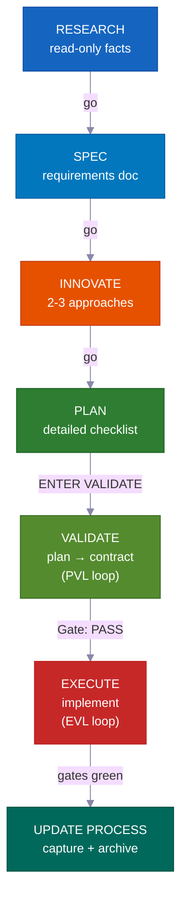

**Interactive mode में**, हर phase आगे बढ़ने से पहले आपके "go" का इंतज़ार करती है — आप हर step पर loop में रहते हैं। **Autopilot या /goal mode में**, आप एक बार पहले approval देते हैं, फिर system खुद को done तक drive करता है। यह सिर्फ नीचे listed तीन specific hard stops पर रुकता है। **VALIDATE** और post-EXECUTE re-test optional नहीं हैं — ये hard gates हैं जो खराब काम को ship होने से रोकते हैं — और दोनों modes में automatically चलते हैं।

---

## The Vibe Coding Revolution

<div align="center">
<h3><em>"सबसे hot नई programming language English है।"</em></h3>
<strong>— Andrej Karpathy</strong>
</div>

<br>

**Vibe coding ने बदल दिया कि software कौन बना सकता है। Plan-first development बदलता है कि वे क्या ship कर सकते हैं।**

<table>
<tr>
<td align="center" width="50%"><h3>63%</h3><sub>vibe coding users <strong>developers नहीं हैं</strong></sub></td>
<td align="center" width="50%"><h3>16.2M</h3><sub>दुनिया भर में citizen developers<br>(38% YoY growth)</sub></td>
</tr>
<tr>
<td align="center" width="50%"><h3>$4.7B</h3><sub>vibe coding market<br>38% सालाना बढ़ रहा है</sub></td>
<td align="center" width="50%"><h3>25%</h3><sub>YC W25 startups के 95%+ AI-generated codebases थे</sub></td>
</tr>
</table>

ज़्यादातर tools आपको project शुरू करने में मदद करते हैं। यह kit आपको **उसे finish करने** में मदद करता है — ऐसे plans के साथ जिन्हें आपकी team review कर सके, knowledge जो कभी stale न हो, और safety checks जो गलतियों को ship होने से पहले पकड़ें।

---

## यह किसके लिए है?

<div align="center">
<h3><em>"मायने यह नहीं रखता कि किसने type किया। मायने यह रखता है कि क्या ship हुआ।"</em></h3>
<strong>— Garry Tan, YC</strong>
</div>

<br>

<table>
<tr>
<td width="50%" valign="top">
<h1>🧑‍💼</h1>
<strong>CEO / Founder</strong><br><br>
<em>"मेरे लिए auth, billing, और landing page के साथ एक SaaS बनाओ"</em><br><br>
Agent आपका stack research करता है, एक architecture plan लिखता है जिसे आप review कर सकते हैं, tests के साथ implement करता है, और हर decision को capture करता है ताकि आपका technical co-founder बाद में audit कर सके।
</td>
<td width="50%" valign="top">
<h1>📊</h1>
<strong>Product Manager</strong><br><br>
<em>"MRR, churn, और growth metrics दिखाने वाला dashboard बनाओ"</em><br><br>
यह PRD-style SPEC generate करता है, code लिखने से पहले आपकी approval लेता है, spec के अनुसार implement करता है, और plan को searchable project history के रूप में archive करता है।
</td>
</tr>
<tr>
<td width="50%" valign="top">
<h1>🎨</h1>
<strong>Designer</strong><br><br>
<em>"इस Figma screenshot को pixel-perfect match करो"</em><br><br>
Design-aware agent आपका mockup analyze करता है, आपके design tokens के साथ component-by-component implement करता है, और visual comparison checks spawn करता है।
</td>
<td width="50%" valign="top">
<h1>⚙️</h1>
<strong>Engineer</strong><br><br>
<em>"Auth module को zero downtime के साथ RBAC support करने के लिए refactor करो"</em><br><br>
यह आपका current auth code और दूसरे codebases ने RBAC को कैसे solve किया दोनों research करता है, कौन सी files affect हो सकती हैं यह map करने वाला migration plan लिखता है, फिर rollback notes के साथ safely build करता है।
</td>
</tr>
</table>

---

## तुलना

| Feature | vibecode-pro-max-kit | Superpowers | GSD | gstack |
|---------|---------------------|-------------|-----|--------|
| Plan-first lifecycle | Full RIPER-5 (research → spec → innovate → plan → validate → execute → update) | Mandatory workflows | Context-rot fix | Partial |
| Step-locked safety | Agent tools per phase restricted (read-only research, innovate में कोई writing नहीं) | Skill-based constraints | Phase separation | None |
| Quality check loops | **दो** — PVL (plan check) + EVL (tests independently re-run) | Per-skill | None automatic | None |
| Multi-tool support | 7 tools via `AGENTS.md` + `SKILL.md` open standards | Claude Code plugin | 14 runtimes | 1 tool |
| Auto-improving knowledge | Topic-grouped knowledge, हर feature के बाद update | Plugin memory | Disk-persisted state | Manual |
| Team collaboration | Shared plans, specs, और review files | Solo | Solo | Solo |
| Skills system | 33 auto-discovered, हर prompt पर keyword-matched | 86 composable skills | Meta-prompting | 23 role tools |
| Large multi-phase projects | Umbrella plans + per-phase inner loop with regression checks | Single task | Single task | Single task |
| Hands-free mode | Autopilot (3 lanes) + standing `/goal` consent | Manual | Manual | Manual |
| Installation | 30s `curl` + auto-routed setup | Plugin marketplace | npx one-liner | git clone |

> **Runtime breadth के बारे में:** GSD 14 runtimes support करता है। हम 7 को गहराई से support करते हैं — full agent harnesses, skill discovery, और हर platform पर lifecycle hooks के साथ। Breadth बनाम depth: आपकी पसंद।

---

## ⚡ यह अलग क्यों है

<table>
<tr>
<td width="50%" valign="top">
<h1>🔒</h1>
<strong>Step-Locked Tool Restrictions</strong><br><br>
आपका agent research के दौरान literally <strong>code नहीं लिख सकता</strong>। RESEARCH read-only है, INNOVATE में Write नहीं है, PLAN/VALIDATE सिर्फ <code>process/</code> में लिखते हैं। <strong>वास्तविक capability limits</strong>, सिर्फ suggestions नहीं।
</td>
<td width="50%" valign="top">
<h1>🎯</h1>
<strong>Lead Agent कभी Code नहीं छूता</strong><br><br>
Coordinator routes, monitors, और loops drive करता है — यह <strong>कभी source files edit नहीं करता और खुद tests नहीं चलाता</strong>। हर edit और हर test run एक dedicated sub-agent के अंदर होता है। कोई hidden काम नहीं।
</td>
</tr>
<tr>
<td width="50%" valign="top">
<h1>🔍</h1>
<strong>Automatic Skill Discovery</strong><br><br>
किसी भी request को handle करने से पहले, यह <strong>33 skills</strong> scan करता है और keywords match करता है। "add webhook support" कहें और <code>vc-security</code> + <code>vc-scenario</code> automatically pull in हो जाते हैं।
</td>
<td width="50%" valign="top">
<h1>💾</h1>
<strong>Session Resets से बचता है</strong><br><br>
Plans, reports, knowledge docs, और learnings सब disk पर रहते हैं। Startup hook session reset के बाद approval gates restore करता है। <strong>कुछ भी नहीं खोता।</strong>
</td>
</tr>
<tr>
<td width="50%" valign="top">
<h1>🛡️</h1>
<strong>Self-Policing Step Guard</strong><br><br>
जब agent कोई required step skip करने वाला होता है, तो वह खुद रुक जाता है: <em>"PHASE JUMPING PREVENTED।"</em> एक <strong>built-in guard against shortcuts</strong>।
</td>
<td width="50%" valign="top">
<h1>🔄</h1>
<strong>7 AI Coding Tools पर काम करता है</strong><br><br>
दो open standards — <code>AGENTS.md</code> और <code>SKILL.md</code> — का मतलब है <strong>zero adapters, zero plugins।</strong> Claude Code में शुरू करें, Cursor में switch करें, Codex में जारी रखें।
</td>
</tr>
</table>

---

## 🧭 यह कैसे काम करता है — Coordinator

आपका main session एक **coordinator** (orchestrator कहलाता है) है, worker नहीं। यह चार काम करता है और कुछ नहीं:

```
आपका request
  → Step 0: Skill Discovery (33 skills scan करें, keywords match करें, candidates attach करें)
  → Intent detect करें (feature / bug / question / refactor / UI) + ambiguity score करें
  → सही agent को fresh context window में route करें
  → Monitor: step compliance, status codes, loop driving
```

<table>
<tr>
<td width="50%" valign="top">
<h1>🧑‍✈️</h1>
<strong>यह delegate करता है, implement नहीं</strong><br><br>
Research → <code>vc-research-agent</code>। Plan → <code>vc-plan-agent</code>। Code → <code>vc-execute-agent</code>। Coordinator सही context handoff करता है और इंतज़ार करता है — यह खुद कभी actual काम नहीं करता।
</td>
<td width="50%" valign="top">
<h1>🚫</h1>
<strong>कोई hidden execution — कभी नहीं</strong><br><br>
जैसे ही agreed checklist वाला plan exist करता है, "ENTER EXECUTE MODE" <strong>हमेशा</strong> <code>vc-execute-agent</code> launch करता है। एक-line fix भी इससे गुज़रती है। Tests सिर्फ dedicated <code>vc-tester</code> के अंदर चलते हैं। यह change size की परवाह किए बिना लागू होता है।
</td>
</tr>
<tr>
<td width="50%" valign="top">
<h1>📨</h1>
<strong>स्पष्ट status codes, अस्पष्ट signals नहीं</strong><br><br>
हर sub-agent इनमें से एक के साथ समाप्त होता है: <code>DONE</code> · <code>DONE_WITH_CONCERNS</code> · <code>BLOCKED</code> · <code>NEEDS_CONTEXT</code>। Coordinator कभी blocker ignore नहीं करता और कभी same blocked approach तीन बार retry नहीं करता।
</td>
<td width="50%" valign="top">
<h1>🔁</h1>
<strong>यह fix loops drive करता है</strong><br><br>
Sub-agents एक बार चलते हैं, result report करते हैं, और रुक जाते हैं। सिर्फ coordinator उन्हें re-launch करता है। यह PVL (plan-check-fix) और EVL (test-check-fix) दोनों loops drive करता है और सारी tracking own करता है।
</td>
</tr>
</table>

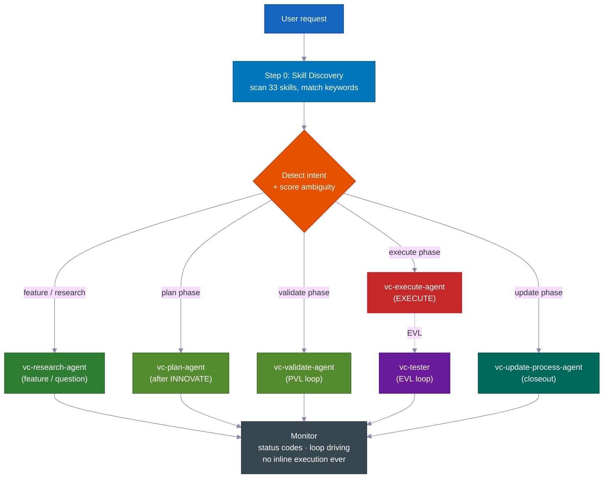

> **यह क्यों मायने रखता है:** एक agent जो decide भी कर सकता है और चुपचाप edit भी, plan skip करने के तरीके ढूंढ लेगा। Coordinator को workers (sub-agents) से अलग करके, process structurally honest बन जाता है — code लिखने का एकमात्र तरीका required steps से गुज़रना है।

---
## 📊 RIPER-5 जीवनचक्र

| चरण | क्या होता है | एजेंट | आप क्या कहते हैं |
|-------|-------------|-------|---------|
| 🔍 **RESEARCH** | केवल पढ़ने वाला तथ्य-संग्रह — कोडबेस और वेब। फ़ाइलें कभी नहीं बदलता। | `vc-research-agent` | *(फीचर अनुरोधों पर स्वतः)* |
| 📝 **SPEC** | उत्पाद-खोज आवश्यकताओं का दस्तावेज़ — उपयोगकर्ता कहानियाँ, स्वीकृति मापदंड, दायरे से बाहर — **किसी भी डिज़ाइन से पहले आपकी समीक्षा के लिए**। | `vc-spec-agent` | `go` / `ENTER SPEC MODE` |
| 💡 **INNOVATE** | 2-3 दृष्टिकोण उनके फायदे-नुकसान के साथ। निर्णय सारांश (चुना हुआ + अस्वीकृत + कारण)। | `vc-innovate-agent` | `go` |
| 📋 **PLAN** | विस्तृत योजना लिखना: संपर्क बिंदु, सार्वजनिक अनुबंध, कौन सी फ़ाइलें छुई जाएंगी, सत्यापन प्रमाण, हैंडऑफ़। | `vc-plan-agent` | `go` |
| ✅ **VALIDATE** | योजना को एक सहमत चेकलिस्ट (V1–V7 जाँच बिंदु) में बदलना। निर्णय: **PASS / CONDITIONAL / BLOCKED**। PVL लूप चलाता है। | `vc-validate-agent` | `ENTER VALIDATE MODE` |
| ⚡ **EXECUTE** | योजना को *ठीक वैसे* लागू करना। चरण रिपोर्ट में प्रगति नोट्स, विचलन प्रोटोकॉल, स्व-समीक्षा। फिर EVL लूप जाँच बिंदु फिर से चलाता है। | `vc-execute-agent` | `ENTER EXECUTE MODE` |
| 🧠 **UPDATE PROCESS** | सीखी गई बातें दर्ज करना, संदर्भ अपडेट करना, योजना संग्रहीत करना, क्लोज़आउट पैकेट लिखना। | `vc-update-process-agent` | *(गैर-मामूली काम के बाद सुझाया गया)* |

> 📝 **SPEC अपना अलग चरण क्यों है:** अधिकांश प्रणालियाँ "समझना" से सीधे "डिज़ाइन करना" पर कूद जाती हैं। एक उत्पाद-खोज SPEC चरण जोड़ने से *आप* (या आपके उत्पाद प्रबंधक) यह तय करते हैं कि **क्या** बनाया जा रहा है — सरल उपयोगकर्ता कहानियों और स्वीकृति मापदंडों में — एजेंट **कैसे** करें यह बहस करने से *पहले*। किसी गलतफहमी को पकड़ने का यह सबसे सस्ता मौका है। (किसी चरण कार्यक्रम के आंतरिक लूप में SPEC छोड़ दिया जाता है — छाता SPEC सभी चरणों पर लागू होता है।)
>
> **SPEC मापने की छड़ी है।** यह अपेक्षित व्यवहार को सरल शब्दों में बताता है जिसे आप एक मिनट में देख सकते हैं। इसके बाद का हर चरण — Innovate, Plan, Validate, Execute — इसके विरुद्ध जाँचता है और वही सवाल पूछता है: *क्या हम जो बना रहे हैं वह वास्तव में वही है जो आपने माँगा था?* जब काम भटकने लगता है, SPEC ही उसे पकड़ता है।

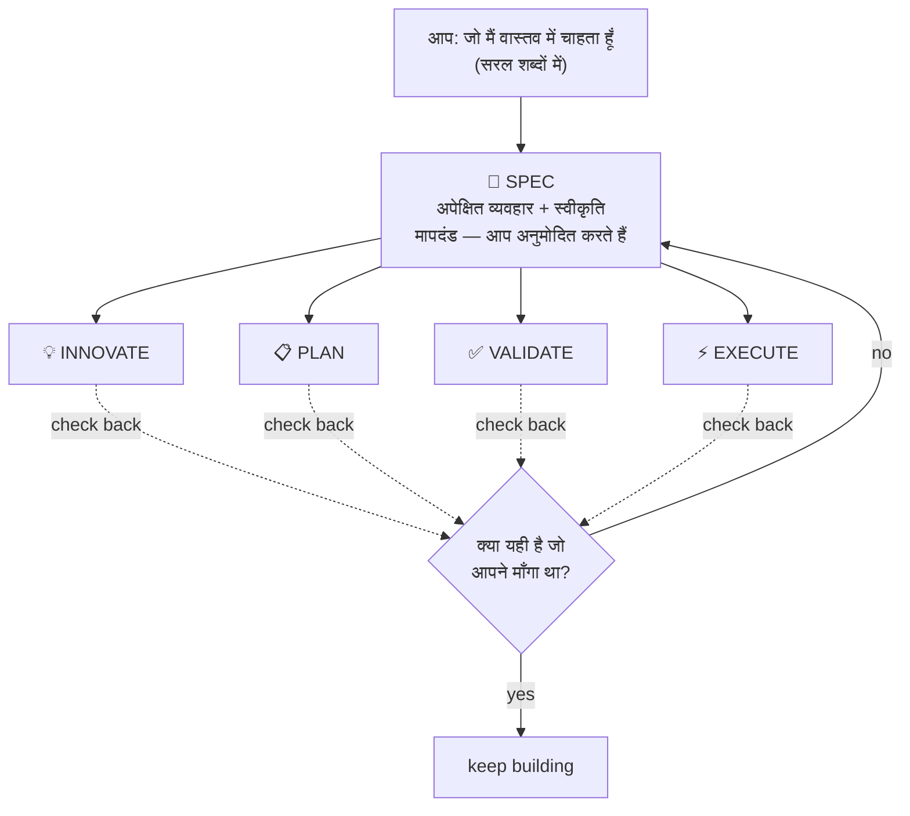

<br>

### 💻 उदाहरण सत्र

```
# 🆕 Feature request
You: "add webhook support to the API"
→ Skill discovery surfaces: vc-scenario, vc-security
→ research-agent gathers context (read-only, can't touch code)
→ "go" → spec-agent writes requirements doc → you approve
→ "go" → innovate-agent compares approaches → decision summary
→ "go" → plan-agent writes the plan, listing which files it will touch
→ "ENTER VALIDATE MODE" → validate-agent gates the plan (PVL loop) → Gate: PASS
→ "ENTER EXECUTE MODE" → execute-agent implements → tester re-runs gates (EVL) → reviewer → git-manager
→ Closeout packet: what changed, what's verified, recommended next step
```

```
# 🐛 Bug fix
You: "login redirect is broken"
→ Routes to vc-debugger → gathers evidence FIRST → 2-3 competing hypotheses
→ Systematically eliminates each → root cause with proof chain
→ execute-agent implements the fix → EVL re-test → quality pipeline
```

```
# ⏩ Fast mode
You: "ENTER FAST MODE - add rate limiting middleware"
→ Compressed RESEARCH + SPEC + INNOVATE + PLAN + VALIDATE in one pass
→ Mandatory safety pause after VALIDATE → you review → "ENTER EXECUTE MODE"
```

```
# 🤖 Autopilot (hands-free)
You: "autopilot full: build a notifications system"
→ ONE consolidated clarification round → provisional /goal block (standing consent)
→ Drives the full RIPER-5 sequence autonomously, pausing only on hard stops
```

```
# 🏗️ Large program
You: "build a full testing platform"
→ Umbrella plan + phase plans in a feature folder
→ Each phase inner loop: research → innovate → plan → PVL → execute → EVL → update
→ Progress survives context compaction — durable reports on disk
```

---

## 🎯 इरादे का स्पष्टीकरण

रूटिंग से पहले, मुख्य एजेंट आपके अनुरोध की अस्पष्टता को **4 द्विआधारी संकेतों (0–4)** पर मापता है और एक स्तर चुनता है। यह सवाल केवल तभी पूछता है *जब वे वास्तव में इसकी कार्रवाई बदल देंगे।*

| स्तर | कब | व्यवहार |
|---|---|---|
| **Tier 0** — चुप स्वतः-रूटिंग | स्कोर 0–1, या आपने "go" / "just do it" कहा, या कोई योजना फिर से शुरू हो रही है | तुरंत रूट करता है, कोई सवाल नहीं |
| **Tier 1** — इनलाइन सारांश | स्कोर 2 | अपनी समझ + चुना हुआ मार्ग एक पंक्ति में बताता है, फिर आगे बढ़ता है |
| **Tier 2** — सवाल | स्कोर 3+ | रूटिंग से पहले केंद्रित बहुविकल्पीय प्रश्न पूछता है |

> 🧠 **अधिकतम दो दौर।** यदि Tier 2 के बाद भी अस्पष्ट रहे, तो एक अंतिम सरल प्रश्न पूछता है, फिर सबसे संकीर्ण उचित दायरे के साथ रिसर्च पर डिफ़ॉल्ट करता है। यह स्पष्टीकरण को कभी अनंत लूप में नहीं डालता। RESEARCH के बाद, इरादे की फिर से जाँच होती है — यदि रिसर्च दिखाती है कि अनुरोध जो माना गया था उससे अलग था, तो वह फिर प्रस्तुत करता है; यदि पुष्टि हो, तो दोबारा पूछे बिना आगे बढ़ता है।

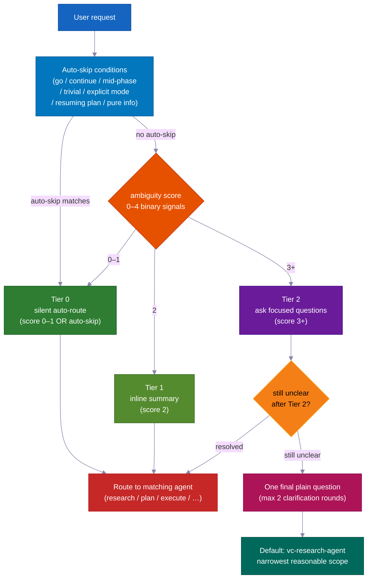

---

## ✅ दो गुणवत्ता लूप — PVL + EVL

अधिकांश प्रणालियाँ एक बार जाँचती हैं, यदि बिल्कुल करती हैं। यह प्रणाली EXECUTE को **दो स्वतंत्र लूप** में लपेटती है — एक कोड लिखे जाने से पहले, एक बाद में।

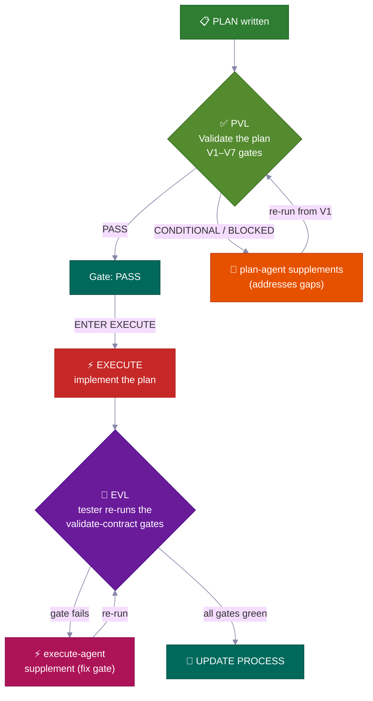

<table>
<tr>
<td width="50%" valign="top">
<h3>📋 PVL — Plan-Validate-Fix</h3>
EXECUTE से पहले, <code>vc-validate-agent</code> योजना को <strong>V1–V7 जाँच बिंदुओं</strong> से गुज़ारता है — बुनियादी ढाँचे, परीक्षण कवरेज, ब्रेकिंग परिवर्तन, सुरक्षा, और प्रति-अनुभाग व्यवहार्यता को कवर करने के लिए कई एजेंटों में काम बाँटता है। पहली बार का <strong>CONDITIONAL</strong> या <strong>BLOCKED</strong> कभी अंत नहीं होता — यह <code>vc-plan-agent</code> को योजना अपडेट करने के लिए वापस भेजता है, फिर V1 से दोबारा जाँचता है।
<br><br>
<sub><code>vc-autoresearch</code> (domain: plan) द्वारा ट्रैक किया गया — एक खामियाँ ढूँढो और ठीक करो लूप। 10-चक्र सीमा। पठार का पता लगाना। केवल <strong>Gate: PASS</strong> (या CONDITIONAL जिसे आप स्पष्ट रूप से स्वीकार करते हैं) EXECUTE को अनलॉक करता है।</sub>
</td>
<td width="50%" valign="top">
<h3>🧪 EVL — Execute-Validate-Fix</h3>
EXECUTE के पूरा होने की रिपोर्ट के बाद — <strong>भले ही यह दावा करे कि सभी जाँच बिंदु हरे हैं</strong> — मुख्य एजेंट <strong>हमेशा</strong> <code>vc-tester</code> को स्वतंत्र रूप से सटीक सहमत-चेकलिस्ट परीक्षण आदेश फिर से चलाने के लिए बुलाता है। एक विफल जाँच बिंदु एक सीमित <code>vc-execute-agent</code> सुधार को रूट करता है, फिर दोबारा परीक्षण करता है।
<br><br>
<sub><code>vc-autoresearch</code> (domain: tests) द्वारा ट्रैक किया गया। 10-चक्र सीमा। execute-agent का अपना आंतरिक "हरा होने तक दोहराओ" लूप <strong>कभी नहीं</strong> इस स्वतंत्र पुष्टि का विकल्प बनता है।</sub>
</td>
</tr>
</table>

> 💎 **निर्णय की सीढ़ी:** **PASS** → आगे बढ़ें · **CONDITIONAL** → ठीक करने योग्य खामियाँ; लूप चलता है (या आप उन्हें रिकॉर्ड में स्वीकार करते हैं) · **BLOCKED** → गहरी समस्या; PLAN पर वापस जाता है (ऑटोपायलट के तहत: खामी बैकलॉग में जाती है और रन जारी रहता है)।

### 🔁 vc-autoresearch — साझा लूप इंजन

PVL और EVL दोनों एक ही ट्रैकिंग परत का उपयोग करते हैं: **`vc-autoresearch`** — एक खामियाँ ढूँढो → ठीक करो → दोहराओ लूप। मुख्य एजेंट लूप चलाता है — यह राउंड काउंटर, प्रति-राउंड रिपोर्ट, TSV लॉग, और पठार/सीमा/प्रतिगमन जाँच का मालिक है। कार्यकर्ता एजेंट एकमुश्त होते हैं: वे परिणाम लौटाते हैं और रुक जाते हैं। कोई भी एजेंट स्वयं को या किसी अन्य चरण एजेंट को दोबारा नहीं बुलाता।

वही इंजन अपने आप भी चल सकता है: "इस स्पेक को मज़बूत करो", "सभी lint ठीक करो", "परीक्षण कवरेज सुधारो", "ये दस्तावेज़ सुधारो" — 6 डोमेन (spec · tests · ux · docs · plan · errors) में कोई भी बार-बार खामियाँ ढूँढो-और-ठीक करो कार्य।

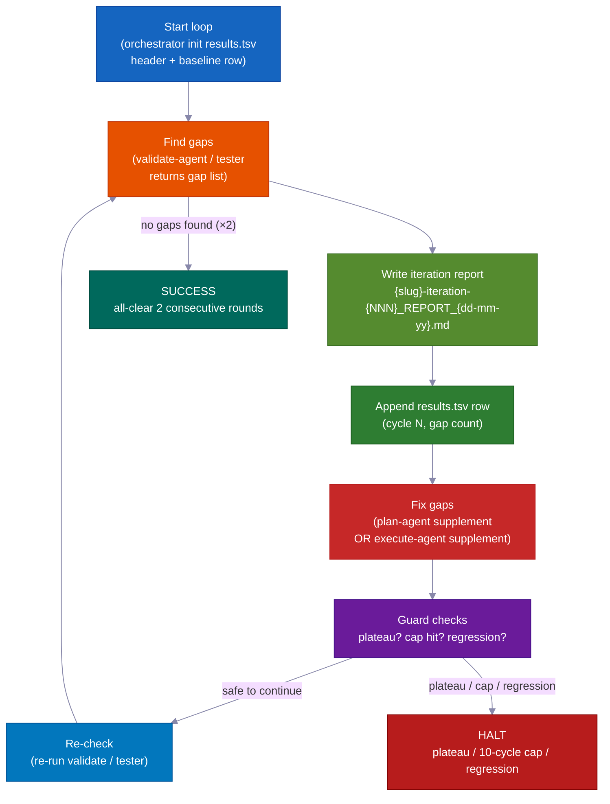

| मोड | क्या करता है | कब रुकता है |
|---|---|---|
| `vc-autoresearch` (core) | खामियाँ ढूँढो → ठीक करो → दोहराओ | कोई खामी न मिले या मेट्रिक लक्ष्य पूरा हो |
| `vc-autoresearch:probe` | 8 व्यक्तित्व संतृप्ति तक सामग्री से पूछताछ करते हैं | 3 राउंड के लिए कोई नई बाधा नहीं |
| `vc-autoresearch:reason` | अंधे न्यायाधीशों के साथ विरोधी बहस | न्यायाधीश एकमत होते हैं या पुनरावृत्ति सीमा |
| `vc-autoresearch:evals` | TSV परिणामों का विश्लेषण — रुझान, पठार, सुझाव | केवल विश्लेषण |

**रुकने की स्थितियाँ:** SUCCESS (लगातार दो राउंड सब साफ) · HALT_PLATEAU (3 राउंड तक कोई प्रगति नहीं) · HALT_CAP (10-राउंड की सख्त सीमा) · HALT_REGRESSION (जो जाँच पास हो रही थी अब विफल होती है)।

---

## 👥 रणनीति तुलना + मॉडल नीति

**हर चरण के बदलाव पर**, मुख्य एजेंट `vc-agent-strategy-compare` को अगले चरण को कैसे चलाएं — लागत अनुमान के साथ — इसकी सिफारिश करने के लिए बुलाता है।

| रणनीति | कब | समन्वय |
|---|---|---|
| **Sequential** | काम पूर्व आउटपुट पर निर्भर | एक समय में एक एजेंट |
| **Parallel subagents** | स्वतंत्र आयाम, एकमुश्त | कोई नहीं — मुख्य एजेंट परिणाम एकत्र + जोड़ता है |
| **Workflow** | किसी सूची में काम का अनुमानित विभाजन | स्क्रिप्टेड चरण |
| **Agent team** | एजेंटों को रन के बीच में एक-दूसरे से बात करनी होती है (जैसे हर एक 3+ चरण योजनाओं में अलग-अलग फ़ाइलें छूता है) | TeamCreate + साझा कार्य सूची + SendMessage |

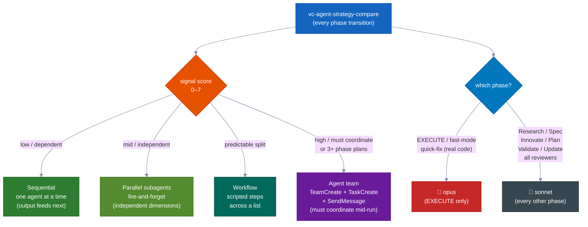

> ⚠️ **"Agent team" का मतलब असली मशीनरी है** — नामित साथी, एक साझा कार्य सूची, और इंटर-एजेंट संदेशन — *न कि* केवल समानांतर एजेंट जिन्हें "टीम" कहा जाए। यह 3+ चरण योजनाएं बनाने और बहु-फ़ाइल संपादन के लिए **आवश्यक** है (वैकल्पिक नहीं) जहाँ एजेंटों को प्रत्येक अपनी फ़ाइलों में रहना होता है। केवल एक सच्ची टीम ही चलते समय संवाद कर सकती है।

### 🧮 मॉडल चयन नीति

| चरण | मॉडल | क्यों |
|---|---|---|
| **EXECUTE** (+ fast-mode, quick-fix वास्तविक कोड करते समय) | 🔴 **opus** | वास्तविक स्रोत संपादन, बिल्ड, माइग्रेशन |
| Research · Spec · Innovate · Plan · Validate · Update · सभी समीक्षक/शोधकर्ता | 🔵 **sonnet** | योजना और विश्लेषण — सस्ता, काफी सक्षम |

> जब काम कई एजेंटों में विभाजित हो, केवल *कोडिंग* एजेंट opus का उपयोग करता है। हर समीक्षक, शोधकर्ता, सत्यापनकर्ता, और योजनाकार sonnet का उपयोग करता है। मुख्य एजेंट हर बार कार्यकर्ता बुलाते समय मॉडल का नाम बताता है।

---

## 🤖 ऑटोपायलट मोड — हैंड्स-फ्री RIPER-5

**`autopilot [task]`** कहें (या `run autopilot`, `autonomous mode`, `ENTER AUTOPILOT MODE`) और एजेंट शुरुआत में **एक** स्पष्टीकरण दौर के साथ *पूरी* शेष RIPER-5 अनुक्रम चलाता है — फिर पूरा होने तक कोई रुकावट नहीं।

**कहीं से भी ट्रिगर करें:** ऑटोपायलट सत्र की शुरुआत में *या* किसी भी बिंदु पर बीच में शुरू हो सकता है। ट्रिगर पर, मुख्य एजेंट डिस्क पर सहेजी गई फ़ाइलें पढ़ता है यह जानने के लिए कि आप पहले से किस RIPER-5 चरण में हैं, फिर वहीं से उठाता है और बाकी खुद चलाता है।

| डिस्क पर स्थिति | प्रवेश चरण |
|---|---|
| कोई SPEC फ़ाइल नहीं | RESEARCH से शुरू करें |
| SPEC फ़ाइल मौजूद | post-SPEC (INNOVATE) तक छोड़ें |
| Plan फ़ाइल मौजूद | post-PLAN (VALIDATE) तक छोड़ें |
| PASS/CONDITIONAL के साथ Validate-contract | EXECUTE तक छोड़ें |

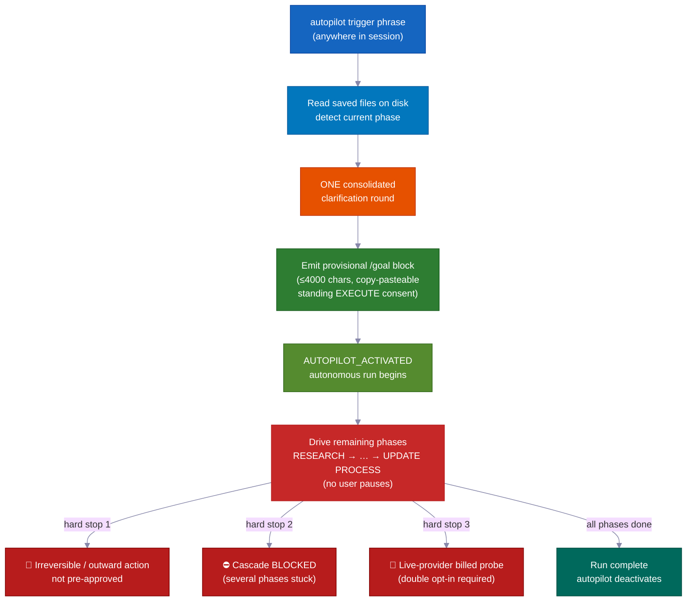

```
You: "autopilot full: add team invitations with email + role management"
→ Reads saved files → detects current phase → enters there
→ ONE consolidated clarification round (scope, hard stops, autonomy boundaries, first-phase strategy)
→ Provisional /goal block emitted (≤4000 chars, copy-pasteable, standing EXECUTE consent)
→ AUTOPILOT_ACTIVATED → drives remaining phases on its own
→ Stops ONLY for hard stops
```

### तीन लेन — जोखिम के अनुसार प्रक्रिया चुनें

| लेन | ट्रिगर | प्रवाह |
|---|---|---|
| 🟢 **quick** | `autopilot quick: [task]` | Scout → संपादन → सीमित जाँच। कोई योजना नहीं, कोई अनुबंध नहीं, कोई EVL नहीं। |
| 🟡 **fast** | `autopilot fast: [task]` | संकुचित R→S→I→P→V → EXECUTE + EVL। |
| 🔴 **full** | `autopilot [task]` / `autopilot full:` | पूरा RIPER-5 (डिफ़ॉल्ट)। |

### 🌙 हैंड्स-फ्री: एक वाक्य, सोते समय काम

`autopilot full: [task]` कहें — या `/goal` ब्लॉक पेस्ट करें — और निम्नलिखित सब **बिना किसी मानवीय इनपुट के** होता है:

- **योजना-जाँच-और-सुधार लूप** — योजना में खामियाँ ढूँढता है, उन्हें ठीक करता है, और फिर से जाँचता है। अपने आप 10 राउंड तक।
- **बनाओ-परीक्षण करो-और-ठीक करो लूप** — कोड लिखता है, परीक्षण चलाता है, विफलताओं को ठीक करता है, फिर से चलाता है। अपने आप 10 राउंड तक। यह कभी अपने "सब हरा" पर भरोसा नहीं करता — एक अलग जाँचकर्ता (vc-tester) पुष्टि के लिए स्वतंत्र रूप से हर परीक्षण फिर से चलाता है।
- **चरण-से-चरण प्रगति** — रिसर्च से योजना से कोड से पूरा तक बिना आपका इंतज़ार किए आगे बढ़ता है।
- **मेमोरी रीसेट के बाद उठाता है** — योजनाएं, रिपोर्ट, और प्रगति सभी डिस्क पर फ़ाइलों के रूप में हैं। संकुचन (जब AI की अल्पकालिक मेमोरी साफ होती है) के बाद, अगला सत्र उन फ़ाइलों को पढ़ता है और ठीक वहीं से जारी रहता है।
- **अटकी हुई सुविधा? अलग रखें, आगे बढ़ते रहें** — यदि एक चरण हल नहीं हो सकता, तो एजेंट एक बैकलॉग नोट लिखता है और अगली सुविधा पर आगे बढ़ता है। आप एक ब्लॉकर से सब कुछ रोके बिना कई सुविधाएं समानांतर में चला सकते हैं।
- **समानांतर सुविधाओं के लिए एजेंटों की टीम** — कई एजेंट एक ही समय में अलग-अलग सुविधाएं बना सकते हैं, प्रत्येक अपनी फ़ाइलों तक सीमित ताकि वे कभी टकराएं नहीं। अटकी सुविधा रोक दी जाती है, बाकी के लिए ब्लॉकर नहीं।

### हार्ड स्टॉप हमेशा सामने आते हैं (ऑटोपायलट पर भी)

ये **केवल तीन बार** हैं जब यह रुककर आपसे पूछता है:

- 🛑 कुछ भी जो वापस न किया जा सके, या जो बाहरी दुनिया तक पहुँचे और पहले से अनुमोदित न हो (लाइव जाना, असली संदेश भेजना, पैसे चार्ज करना)
- ⛔ लगातार कई चरण बिना किसी प्रगति के अटक जाते हैं — एक वास्तविक गतिरोध जो आपकी नज़र का हकदार है
- 💸 एक परीक्षण जो किसी भुगतान वाली बाहरी सेवा पर असली पैसे खर्च करेगा — चलाने से पहले पूछता है

---

### 🎯 /goal — स्वायत्त रन टोकन

**आवश्यक, सजावट नहीं:** हर VALIDATE चरण पूरा होने के बाद, मुख्य एजेंट को EXECUTE शुरू होने से पहले एक कॉपी-करने योग्य `/goal` ब्लॉक देना *होगा*। यह एक आवश्यक हैंडऑफ़ फ़ाइल है — वैकल्पिक टिप्पणी नहीं।

**प्रारूप बाधाएं:**

| ब्लॉक प्रकार | आवश्यक फ़ील्ड | सख्त सीमा |
|---|---|---|
| Post-VALIDATE ब्लॉक | SESSION GOAL · Charter+umbrella plan · Autonomy · Hard stop conditions · Next phase · Validate contract · Execute start | ≤ 4000 chars |
| Provisional (autopilot) ब्लॉक | SESSION GOAL · ENTRY PHASE · REMAINING PHASES · CLARIFICATIONS LOCKED · EXECUTE CONSENT · DECISION POLICY · HARD STOPS · TEST GATES · START (+ वैकल्पिक LANE) | ≤ 4000 chars |

`/goal` कमांड 4000 अक्षरों से लंबे ब्लॉक अस्वीकार करता है। इसे संक्षिप्त रखें — आवश्यक फ़ील्ड को संरचना के रूप में उपयोग करें, गद्य निबंध नहीं।

**स्वतंत्र /goal मोड:** एक `/goal` ब्लॉक को नए सत्र में पेस्ट करें और रन `START` में नामित चरण से उठाता है। स्पष्टीकरण और निर्णय नियम पहले से निर्धारित हैं — कोई नया स्पष्टीकरण दौर नहीं। एक स्थायी `/goal` के तहत, एजेंट हर प्रतिवर्ती चरण पर स्वयं निर्णय लेता है, BLOCKED आइटम बैकलॉग में भेजता है, और अपनी रिपोर्ट लिखता है — लेकिन **कार्यकर्ता एजेंट प्रतिनिधित्व अनिवार्य रहता है।** ऑटोपायलट केवल *अनुमोदन विराम* हटाता है, no-inline-execution नियम कभी नहीं।

`validate-autopilot-goal-block.mjs` द्वारा सत्यापित।

---

## 🔬 व्यवहार्यता जाँच + सत्यापनकर्ता सुरक्षा जाल

### 🔬 व्यवहार्यता जाँच — बनाने से पहले धारणा का परीक्षण करें

जब SPEC, INNOVATE, या VALIDATE किसी मुख्य धारणा से टकराती है जिसे वह केवल पढ़कर पुष्टि नहीं कर सकती, तो वह `VC-FEASIBILITY-PROBE-NEEDED` भेजती है और रुक जाती है। मुख्य एजेंट `vc-debugger` को एक वास्तविक परीक्षण चलाने और एक **VERDICT** लिखने के लिए बुलाता है:

| निर्णय | अर्थ |
|---|---|
| ✅ **VIABLE** | धारणा सही है — डिज़ाइन इस पर निर्भर हो सकता है |
| ❌ **NOT-VIABLE** | धारणा गलत है — वह दृष्टिकोण वर्जित है |
| ❓ **INCONCLUSIVE** | सिद्ध नहीं हो सका — ज्ञात-खामी के रूप में आगे ले जाया गया |

प्रत्येक निर्णय के साथ 3-भाग का डिज़ाइन नोट आता है: **परिणाम क्या अनुमति देता है · क्या नकारता है · क्या अभी भी अनिश्चित है** — शब्द-दर-शब्द रुके हुए चरण में वापस डाला जाता है। जाँच **लागत-वर्गीकृत** हैं (`cheap-local` / `needs-container` / `needs-live-provider` → दोहरी सहमति / `needs-browser` / `needs-cf`) ताकि कोई भुगतान या साझा-संसाधन जाँच चुपचाप न चले।

### 🛡️ 36 सत्यापनकर्ता — यांत्रिक सटीकता, राय नहीं

किट **36 सत्यापनकर्ता स्क्रिप्ट** के साथ आती है जो "क्या एजेंट ने नियमों का पालन किया?" को स्पष्ट पास/फेल परिणाम में बदलती है। ये किसी भी चरण के बाद चलती हैं जो हार्नेस फ़ाइलें छूता है, और UPDATE PROCESS में आवश्यक जाँच बिंदुओं के रूप में:

| सत्यापनकर्ता परिवार | जाँच करता है |
|---|---|
| `vc-audit-vc` | एजेंट समानता (Claude/Codex), कौशल रजिस्ट्री, किट पोर्टेबिलिटी, एजेंट फ्रंटमैटर |
| `vc-audit-context` | संदर्भ रूटिंग, खोज फ्रंटमैटर, कौशल कीवर्ड |
| `vc-audit-plans` | योजना सूची, छाता स्थिति, चरण पूर्णता, चरण रिपोर्ट, बैकलॉग नोट्स |
| 14 VC-system व्यवहार सत्यापनकर्ता | प्रत्येक के पास पास/फेल फिक्सचर जोड़ी है — strategy-compare आउटपुट, closeout, intent-clarify, feasibility verdict, autoresearch लॉग, और अधिक |

---

## 🛡️ अंतर्निहित सुरक्षा प्रणालियाँ

ये दिशानिर्देश नहीं हैं — ये **सख्त नियम** हैं जो हर एजेंट में बने हुए हैं।

<table>
<tr>
<td width="50%" valign="top">
<h1>📝</h1>
<strong>प्रगति नोट्स, रन के बीच विराम नहीं</strong><br><br>
कोडिंग के दौरान एजेंट काम करते समय चरण रिपोर्ट फ़ाइल में प्रगति नोट्स लिखता है। कोई रन के बीच विराम नहीं, कोई "जारी रखें या वापस जाएं?" प्रश्न नहीं। यदि कोई समस्या आती है जिसमें योजना बदलाव चाहिए, तो यह रुकता है और PLAN पर वापस जाता है। अन्यथा चलता रहता है।
</td>
<td width="50%" valign="top">
<h1>🚫</h1>
<strong>कभी चुपचाप विचलित न हों</strong><br><br>
यदि कोडिंग किसी समस्या से टकराती है जिसमें योजना बदलाव चाहिए, तो एजेंट <strong>तुरंत रुकता है</strong>, बताता है, और PLAN पर वापस जाता है। कोई चुपचाप सुधार नहीं।
</td>
</tr>
<tr>
<td width="50%" valign="top">
<h1>🔐</h1>
<strong>गोपनीयता सुरक्षा हुक</strong><br><br>
एजेंट को बिना स्पष्ट अनुमोदन के <code>.env</code>, क्रेडेंशियल, SSH कुंजी, और <code>.pem</code> फ़ाइलें पढ़ने से <strong>रोका गया</strong> है।
</td>
<td width="50%" valign="top">
<h1>⚠️</h1>
<strong>उच्च-जोखिम साक्ष्य पैक</strong><br><br>
auth, billing, schema माइग्रेशन, या public-API परिवर्तनों के लिए, सिस्टम को काम "पूरा" कहने से पहले एक औपचारिक <strong>5-फ़ाइल साक्ष्य पैक</strong> की आवश्यकता होती है — हमेशा मैन्युअल, कभी स्वतः-बायपास नहीं।
</td>
</tr>
<tr>
<td width="50%" valign="top">
<h1>📨</h1>
<strong>स्टेटस-कोड अनुशासन</strong><br><br>
कार्यकर्ता एजेंटों को <code>DONE</code> / <code>DONE_WITH_CONCERNS</code> / <code>BLOCKED</code> / <code>NEEDS_CONTEXT</code> के साथ बंद करना होगा। ब्लॉकर कभी नज़रअंदाज़ नहीं किए जाते; सटीकता संबंधी चिंताएं कार्य आइटम बन जाती हैं।
</td>
<td width="50%" valign="top">
<h1>📊</h1>
<strong>Closeout + Drift स्कोरिंग</strong><br><br>
कोडिंग के बाद, एक closeout पैकेट तात्कालिकता को मापता है: <strong>LOW</strong> (हल्का स्पर्श) → <strong>MEDIUM</strong> (महत्वपूर्ण) → <strong>HIGH</strong> (हार्नेस/प्रोटोकॉल फ़ाइलें छुई गईं), और अगला सुरक्षित कदम सुझाता है।
</td>
</tr>
</table>

---

## 🔍 कार्यान्वयन-पूर्व बुद्धिमत्ता

कोड की एक भी पंक्ति लिखे जाने से पहले, तीन विशेषज्ञ कौशल समस्याएं पकड़ सकते हैं:

<table>
<tr>
<td width="50%" valign="top">
<h1>🎭</h1>
<strong>5-व्यक्तित्व बहस — <code>vc-predict</code></strong><br><br>
Architect, Security, Performance, UX, और Devil's Advocate आपकी योजना पर बहस करते हैं। एक पंक्ति लिखने से पहले <strong>GO / CAUTION / STOP</strong> का निर्णय देता है।
</td>
<td width="50%" valign="top">
<h1>🎲</h1>
<strong>12-आयाम एज केस — <code>vc-scenario</code></strong><br><br>
किसी सुविधा को 12 आयामों में विघटित करता है (उपयोगकर्ता प्रकार, इनपुट सीमाएं, टाइमिंग, स्केल, स्थिति, परिवेश, त्रुटियाँ, auth, डेटा, एकीकरण, अनुपालन, व्यावसायिक तर्क)। आउटपुट परीक्षण विशिष्टताओं के रूप में भी काम करता है।
</td>
</tr>
<tr>
<td width="50%" valign="top">
<h1>🔐</h1>
<strong>STRIDE + OWASP ऑडिट — <code>vc-security</code></strong><br><br>
दोहरी-पद्धति सुरक्षा ऑडिट dependency auditing, secret detection, और एक **auto-fix मोड** के साथ जो गंभीरता से क्रमबद्ध करता है और regression guards के साथ Critical पहले ठीक करता है।
</td>
<td width="50%" valign="top">
<h1>🔬</h1>
<strong>साक्ष्य-प्रथम डीबगिंग — <code>vc-debugger</code></strong><br><br>
साक्ष्य एकत्र करता है → 2-3 प्रतिस्पर्धी परिकल्पनाएं बनाता है → प्रत्येक का परीक्षण करता है → उन्मूलन पथ दस्तावेज़ीकरण करता है। <strong>कभी अनुमान नहीं लगाता — सिद्ध करता है।</strong>
</td>
</tr>
</table>

---

## ✅ गुणवत्ता पाइपलाइन — निष्पादन में अंतर्निहित

**पहले परीक्षण, फिर कोड।** सहमत चेकलिस्ट (किसी कोड को छूने से पहले लिखी गई) सटीक परीक्षण परिभाषित करती है जो पास होने चाहिए। execute-agent तब तक कोड लिखता है जब तक वे परीक्षण हरे न हों। फिर एक अलग जाँचकर्ता — `vc-tester` — पुष्टि के लिए अपने आप हर परीक्षण फिर से चलाता है। execute-agent का अपना "सब हरा" कभी सच नहीं माना जाता। अंत में, समीक्षक जाँचता है कि पूरा प्रोजेक्ट अभी भी एक साथ काम करता है, न केवल नया टुकड़ा।

execute-agent केवल कोड नहीं लिखता और पूरा नहीं बोलता। यह स्वतः एक **गुणवत्ता पाइपलाइन** से गुज़रता है:

<br>

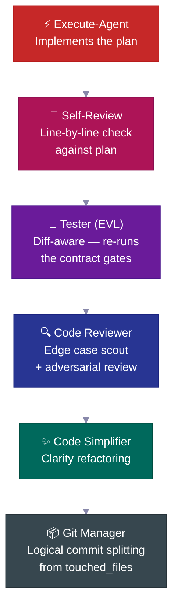

| चरण | क्या करता है |
|---|---|
| 🔎 **Self-review** | योजना के विरुद्ध हर चेकलिस्ट आइटम जाँचता है, कोई विचलन दर्ज करता है |
| 🧪 **Tester (EVL)** | सहमत-चेकलिस्ट परीक्षण स्वतंत्र रूप से फिर से चलाता है; बदली गई फ़ाइलें → परीक्षण फ़ाइलें मैप करता है, >70% मैप होने पर पूरे suite में बढ़ता है |
| 🔍 **Code reviewer** | समीक्षा से *पहले* एज-केस scout भेजता है; N+1 queries, auth paths, data leaks जाँचता है |
| ✨ **Simplifier** | समीक्षा के बाद स्पष्टता के लिए कोड साफ करता है — कोई व्यवहार परिवर्तन नहीं |
| 📦 **Git manager** | `touched_files` प्राप्त करता है, तार्किक conventional commits में विभाजित करता है, अज्ञात फ़ाइलें अस्वीकार करता है |

---
## 📋 योजना का जीवन-चक्र

हर महत्वपूर्ण फ़ीचर एक **योजना-जीवन-चक्र** से गुज़रता है — एक लिखित विनिर्देशन जो बनाई जाती है, समीक्षा की जाती है, उसके अनुसार काम किया जाता है, और फिर स्थायी परियोजना इतिहास के रूप में संग्रहीत की जाती है।

<br>

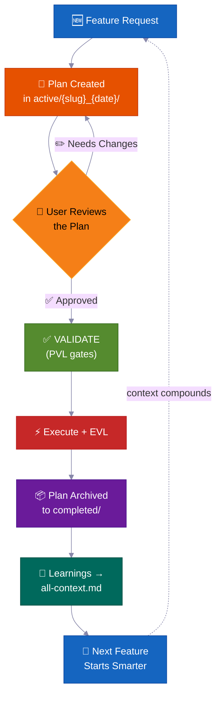

> 💡 छह महीने बाद, जब कोई पूछे *"हमने auth इस तरह क्यों बनाया?"* — जवाब `completed/` में मिलेगा। Slack के किसी पुराने धागे में खोना नहीं पड़ेगा।

**योजनाएँ कहाँ रहती हैं — टास्क-फ़ोल्डर नियम:**

```
process/
├── general-plans/
│   ├── active/
│   │   └── webhooks_28-05-26/          # 📋 Task folder: plan + colocated reports/refs
│   │       └── webhooks_PLAN_28-05-26.md
│   ├── completed/                       # ✅ Archived (searchable history)
│   └── backlog/                         # 📌 Deferred work
└── features/
    └── billing/                         # 🏷️ Feature-scoped (5+ artifacts)
        ├── active/{slug}_{date}/
        ├── completed/
        └── backlog/
```

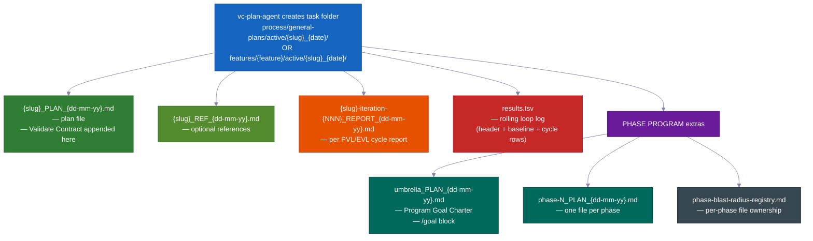

> हर योजना में होता है: 📍 **संपर्क-बिंदु** (बनाई/बदली गई फ़ाइलें) · 📜 **सार्वजनिक अनुबंध** · 💥 **कौन-सी फ़ाइलें छू सकती है** (क्या टूट सकता है, क्या परखना है) · ✅ **सत्यापन प्रमाण** · 🔄 **कार्य-पुनः-शुरू करने की जानकारी**। `vc-plan-discovery` सही योजना खोजता है; `post-write-plan-check` हर योजना-लेखन पर संरचना जाँचता है।

---

## 🏗️ फ़ेज़ प्रोग्राम — बड़े प्रोजेक्ट जो बिखरते नहीं

सामान्य फ़ीचर के लिए एक योजना काफ़ी है। **बड़े बहु-चरण प्रोजेक्ट** के लिए एक फ़ेज़ प्रोग्राम होता है — एक छाता-योजना और प्रति-चरण अलग योजनाएँ, जिनमें से हर एक पूरे **7-चरणीय आंतरिक लूप** से गुज़रती है — अपने स्वयं के चेकपॉइंट और सहेजी गई रिपोर्ट के साथ।

<br>

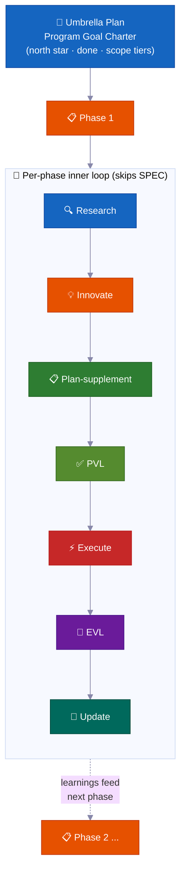

| | विशेषता | क्यों ज़रूरी है |
|---|---|---|
| 🔄 | **हर चरण में नई रिसर्च** | कोड में बदलाव की जाँच करता है, नई रिपोर्टें पढ़ता है, पुरानी धारणाएँ ताज़ा करता है |
| ✅ | **प्रति-चरण चेकपॉइंट** | कोई चरण तब तक पूरा नहीं होता जब तक सबूत न हो। सच्ची स्थिति: `PLANNED → CODE DONE → TESTING → VERIFIED` या `BLOCKED` |
| 📄 | **सहेजी गई रिपोर्टें** | हर चरण परिणाम डिस्क पर लिखता है — मेमोरी रीसेट होने पर भी प्रगति बनी रहती है |
| 🧠 | **सीख आगे जाती है** | Phase 1 की खोजें Phase 2 की योजना को कोडिंग शुरू होने से पहले अपडेट करती हैं |
| 🏗️ | **नींव बनाम विस्तार** | "वास्तुकला सिद्ध करो" और "सब कुछ लागू करो" को स्पष्ट रूप से अलग करता है |
| 🚧 | **ईमानदार बाधा-प्रबंधन** | अटके चरण `BLOCKED` रहते हैं — सबूत के साथ। हरी स्थिति का नाटक नहीं होता |

<br>

### 🔀 प्रोग्राम खुद को सीखते हुए बदलता है

शुरुआत में लिखी योजना एक मोटा नक्शा है, पक्का अनुबंध नहीं। जैसे-जैसे प्रोग्राम चलता है, वह खुद को समायोजित करता है — ताकि आपको हर कदम पहले से न सोचना पड़े।

**यह काम के बीच में नया चरण जोड़ सकता है।**
काम करते समय एजेंट एक ज़रूरी कदम खोज सकता है — कुछ ऐसा जो अगले चरण से पहले होना ज़रूरी है। ऐसे में वह वहीं एक नया चरण जोड़ता है, बाकी को पुनः क्रमांकित करता है, और आगे बढ़ता है। किसी इंसान की ज़रूरत नहीं। (आंतरिक संकेत: `MID_PROGRAM_PLAN_CREATED` — नई योजना डिस्क पर लिखी जाती है और रजिस्ट्री में स्वतः जोड़ी जाती है।)

**यह चरणों का क्रम बदल सकता है।**
रिसर्च कभी-कभी दिखाती है कि योजना का क्रम गलत है — जैसे Phase 3 को कुछ ऐसी चीज़ चाहिए जो Phase 4 बनाएगा। एजेंट बचे हुए चरणों को पुनः व्यवस्थित करता है और कारण दर्ज करता है। (आंतरिक संकेत: `PHASE_RESTRUCTURE_NOTICE` — फ़ेज़ रिपोर्ट में ऑडिट ट्रेल के रूप में सहेजा जाता है, रुकावट नहीं।)

**यह कोडिंग से ठीक पहले हर चरण की अपनी योजना अपडेट करता है।**
किसी भी चरण की कोडिंग शुरू होने से पहले, एक त्वरित रिसर्च पास यह देखता है कि प्रोग्राम ने अब तक क्या सीखा है। फिर उस चरण की जाँच-सूची में नई जानकारी जोड़ता है। इसे **plan-supplement** चरण कहते हैं। योजनाएँ कभी जमी नहीं रहतीं — वे पहले के चरणों से नई बातें सोखती हैं।

**यह वह काम छोड़ देता है जो अभी शुरू नहीं हो सकता।**
अगर कोई चरण किसी ऐसी चीज़ पर निर्भर है जो अभी तैयार नहीं — कोई सेवा जो बनी नहीं, कोई निर्णय जो हुआ नहीं — तो एजेंट उस चरण को dependency-blocked चिह्नित करता है, अलग रखता है, और अगले पर बढ़ता है। एक चरण के इंतज़ार में पूरा प्रोग्राम नहीं रुकता।

**यह जानता है कब रुककर पूछना है।**
एक अटका चरण बस बैकलॉग में चला जाता है और प्रोग्राम जारी रहता है। लेकिन अगर कई चरण लगातार बिना प्रगति के दीवार से टकराते हैं, तो एजेंट इसे असली गतिरोध मानता है — एक **cascade stop** — और रुककर आपको बताता है क्या हुआ। एक अटका चरण सामान्य है। कई लगातार अटके चरण बताते हैं कि कुछ मूलभूत गलत है।

**यह एक लाइव स्कोरबोर्ड रखता है।**
हर प्रोग्राम की छाता-योजना में एक-पेज की स्थिति-अनुभाग होती है — कौन-सा चरण चल रहा है, पूरा हुआ या नहीं, रिपोर्ट कहाँ है। कोई भी — या एजेंट खुद मेमोरी रीसेट के बाद — इसे पढ़ सकता है और ठीक-ठीक जान सकता है कहाँ चीज़ें खड़ी हैं। यह एक सरल फ़ाइल रजिस्ट्री भी रखता है ताकि एक ही समय काम करने वाले दो चरण कभी एक ही फ़ाइल न बदलें।

**एक बड़ी अंतिम जाँच।**
पूरे प्रोग्राम के अंत में, एजेंट एक end-to-end परीक्षण चलाता है कि पूरा प्रोजेक्ट अभी भी मिलकर काम करता है — न सिर्फ़ हर टुकड़ा अपने आप। प्रति-चरण चेकपॉइंट हर हिस्से को सिद्ध करते हैं; यह अंतिम जाँच सिद्ध करती है कि हिस्से एक साथ काम करते हैं।

---

### 🧠 यह अपनी जगह कभी नहीं भूलता (मेमोरी रीसेट से बचता है)

लंबे काम सही तरीके से पूरे होते हैं — भले ही AI की मेमोरी बीच में रीसेट हो जाए। योजना, प्रगति, और प्रमाण — सब डिस्क पर फ़ाइलों में रहते हैं, सिर्फ़ एजेंट के दिमाग में नहीं।

AI एजेंट की कार्यशील मेमोरी सीमित होती है। किसी लंबे काम में वह भर जाती है और सिकुड़ जाती है — जानकारी धुंधली हो सकती है। जब नया सत्र शुरू होता है (या मेमोरी साफ होती है), एजेंट अंदाज़ा नहीं लगाता कि वह कहाँ था। वह फ़ाइलें पढ़ता है।

यह ठीक इस तरह काम करता है:

**1. हर चरण के बाद एक छोटी रिपोर्ट लिखता है।**
जब कोई चरण पूरा होता है, एक रिपोर्ट फ़ाइल डिस्क पर लिखी जाती है। प्रगति आपके प्रोजेक्ट फ़ोल्डर में रहती है, सिर्फ़ एजेंट के दिमाग में नहीं। मेमोरी सिकुड़ने से फ़ाइल नहीं मिटती।

**2. किन कदमों का काम हुआ, इसकी जाँच-सूची रखता है।**
हर चरण-योजना में एक **Phase Loop Progress** सूची होती है — हर कदम के लिए टिक-बॉक्स (रिसर्च, योजना-जाँच, निर्माण, परीक्षण, सीख दर्ज करना)। रीसेट के बाद एजेंट वे बॉक्स पढ़ता है और ठीक अगला कदम जानता है। उसे अपडेट करने की ज़रूरत नहीं।

**3. हर चरण की शुरुआत में एक संक्षिप्त "लिफ़ाफ़ा"।**
हर वर्कर एजेंट (एक केंद्रित सहायक जो काम का एक चरण करता है) शुरू में एक **Context Envelope** उत्सर्जित करता है — 10 क्षेत्रों की एक नोट: कौन-सा फ़ीचर, कौन-सा चरण, कौन-सी शाखा, कौन-सी योजना-फ़ाइल, कौन-से परीक्षण चलाने हैं। पढ़ने में कुछ सेकंड लगते हैं। कुछ भी करने से पहले एजेंट तैयार हो जाता है।

**4. यह फ़ाइलों पर अपनी मेमोरी से ज़्यादा भरोसा करता है।**
पुनः-शुरू होने पर एजेंट जाँचता है कि कोड और git इतिहास में वास्तव में क्या है बनाम योजना क्या कहती है। असली स्थिति जीतती है। पुरानी पड़ी योजना एजेंट को काम दोहराने या कदम छोड़ने के लिए भ्रमित नहीं कर सकती।

**5. एक चलता स्कोरबोर्ड और प्रति-दौर रिपोर्टें।**
हर फ़िक्स-लूप (योजना-जाँच लूप और निर्माण-परीक्षण लूप) एक `results.tsv` स्कोरबोर्ड फ़ाइल रखता है — प्रति दौर एक पंक्ति, यह ट्रैक करते हुए कि कितने मुद्दे बचे हैं। जब कोई सत्र लूप के बीच में समाप्त होता है, अगला सत्र गिनती पढ़ता है, सही दौर पर उठाता है, और जारी रखता है। कोई दौर नहीं खोता।

**6. पुनः-शुरू होने पर एक अनुस्मारक स्वतः डाला जाता है।**
जब मेमोरी सिकुड़ती है, सिस्टम स्वतः नवीनतम स्थिति-नोट नए सत्र में फिर से लोड करता है। अगर कोई स्वीकृति लंबित थी — जैसे एक चेकपॉइंट जिसे आगे बढ़ने के लिए "हाँ" चाहिए था — तो अनुस्मारक उसे चिह्नित करता है। कुछ भी चुपके से नहीं छूटता।

> 💡 संक्षेप में: आप एक autopilot रन शुरू कर सकते हैं, लैपटॉप बंद कर सकते हैं, और घंटों बाद वापस आ सकते हैं। एजेंट ठीक वहाँ होगा जहाँ होना चाहिए — या आखिरी सहेजे चेकपॉइंट से शुरू करेगा, डिस्क पर सबूत के साथ।

---

## 🧠 संदर्भ समूह

परियोजना की जानकारी **संदर्भ समूहों** में व्यवस्थित है — स्थिर ज्ञान-क्षेत्र, जिनमें से प्रत्येक के पास एक `all-{group}.md` राउटर फ़ाइल है जो एजेंटों को बताती है क्या पढ़ें और कब। एजेंट राउटर का पालन करते हैं, केवल प्रासंगिक चीज़ें लोड करते हैं — हर बार पूरा ज्ञान-भंडार नहीं।

<br>

```
process/context/
├── all-context.md              # 🧭 Root router — architecture, stack, patterns, conventions
├── tests/all-tests.md          # 🧪 Test runners, commands, debugging procedures
├── container/all-container.md   # 🐳 Docker, deployment, infra procedures
├── uxui/all-uxui.md            # 🎨 Components, design tokens, patterns
├── infra/all-infra.md          # 🖥️ Server infrastructure, deployment
└── {your-domain}/all-{domain}.md  # 📚 Any domain with 3+ durable docs (auto-promoted)
```

| | यह कैसे काम करता है |
|---|---|
| 🧭 **राउटर पैटर्न** | एजेंट केवल अपने काम के लिए प्रासंगिक चीज़ें पढ़ते हैं |
| 📏 **स्वतः-पदोन्नति** | 3+ दस्तावेज़ों वाले विषय (या बहुत बड़ी एकल फ़ाइल) को अपना समूह मिलता है |
| 🔄 **हमेशा अद्यतन** | हर महत्वपूर्ण फ़ीचर के बाद `vc-update-process-agent` अपडेट करता है |
| 🧪 **ऑडिट-योग्य** | `vc-audit-context` रूटिंग, डिस्कवरी फ्रंटमैटर और संगति जाँचता है |
| 📨 **Context Envelope** | हर आंतरिक-लूप एजेंट शुरुआत में 10 क्षेत्रों की नोट उत्सर्जित करता है (feature → phase → session-goal → branch → worktree → context-group → blast-radius-packages → active-plan → test-runner → validate-contract) ताकि नया वर्कर एजेंट जाने वह कहाँ खड़ा है |

> किट केवल प्रोटोकॉल बीज भेजती है — आपके संदर्भ समूह **आपके प्रोजेक्ट के लिए** `vc-setup` द्वारा बनाए जाते हैं, आपके असली कोड को स्कैन करके। ये एक पैटर्न हैं, तय सूची नहीं।

---

## 📁 फ़ीचर फ़ोल्डर

जब किसी विषय में 5 या उससे ज़्यादा फ़ाइलें जमा हो जाती हैं, तो उसे अपना **फ़ीचर फ़ोल्डर** मिलता है — एक पूर्ण जीवन-चक्र कंटेनर।

```
process/features/{feature}/
├── active/{slug}_{date}/   # 📋 Plans being worked on (reports/refs colocated)
├── completed/              # ✅ Archived plans (searchable decision history)
└── backlog/                # 📌 Deferred work (agents check before duplicating)
```

| | क्या होता है |
|---|---|
| 🆕 | नया काम `active/` में शुरू होता है → रिपोर्टें जमा होती हैं → योजना `completed/` में संग्रहीत होती है |
| 📌 | स्थगित काम `backlog/` में जाता है — एजेंट डुप्लीकेट योजनाएँ बनाने से पहले इसे जाँचते हैं |
| 📦 | जब सामान्य आर्टिफ़ैक्ट 5+ हो जाते हैं तो फ़ीचर-पदोन्नति स्वतः होती है |
| 🔍 | हर फ़ीचर का पूर्ण, स्व-संपूर्ण इतिहास है — योजनाएँ, निर्णय, रिपोर्टें, रिसर्च |

---

## 🧱 स्किल परतें

33 स्किल तीन परतों में बँटी हैं। हर `SKILL.md` फ्रंटमैटर में अपना `layer` + `trigger_keywords` घोषित करता है, और एक जनरेटेड कैटलॉग खोज को तेज़ रखता है।

<table>
<tr>
<td width="33%" valign="top">
<h1>🎭</h1>
<strong>Actor agents</strong><br><br>
किसी चरण या भूमिका के मालिक। <code>.claude/agents/</code> में रहते हैं — ये 15 एजेंट हैं, स्किल नहीं।
</td>
<td width="33%" valign="top">
<h1>📜</h1>
<strong>Contract skills (20)</strong><br><br>
हर एक एक विशिष्ट फ़ाइल या सहमत आउटपुट बनाता है — <code>vc-generate-plan</code>, <code>vc-validate-findings</code>, <code>vc-autopilot</code>, ऑडिट। परिणाम जाँचे जा सकते हैं।
</td>
<td width="33%" valign="top">
<h1>🛠️</h1>
<strong>Helper skills (13)</strong><br><br>
एजेंट <em>कैसे</em> काम करते हैं, इसे बेहतर बनाते हैं, अपनी कोई फ़ाइल नहीं बनाते — <code>vc-scout</code>, <code>vc-sequential-thinking</code>, <code>vc-problem-solving</code>, <code>vc-docs-seeker</code>।
</td>
</tr>
</table>

---

## 🧠 खुद को बेहतर बनाती परियोजना-स्मृति

हर पूरा हुआ फ़ीचर सीख को वापस संदर्भ प्रणाली में फीड करता है — **ज्ञान जमा होता रहता है, रीसेट नहीं होता।**

अधिकांश AI-सहायक कोडबेस में इसका उल्टा होता है: हर नया सत्र ठंडे से शुरू होता है। एजेंट वही फ़ाइलें फिर पढ़ता है, वही पैटर्न फिर खोजता है, वही निर्णय फिर लेता है — क्योंकि पिछले सत्र की समझ केवल एक चैट विंडो में जीई। किट का जवाब कोई प्रॉम्प्ट तरकीब नहीं है। यह एक **टिकाऊ संदर्भ-फ़ाइल प्रणाली** (`process/context/`) है जिसे हर एजेंट सत्र शुरू में पढ़ता है, हर वैलिडेटर बचाता है, और हर पूरा हुआ फ़ीचर समृद्ध करता है।

छह महीने और कई मेमोरी रीसेट के बाद भी, एजेंट जानता है *क्यों* आपका auth उस तरह काम करता है — क्योंकि वह ज्ञान डिस्क पर है, रूटेड है, और ऑडिट-योग्य है, किसी मृत सत्र में बंद नहीं।

<br>

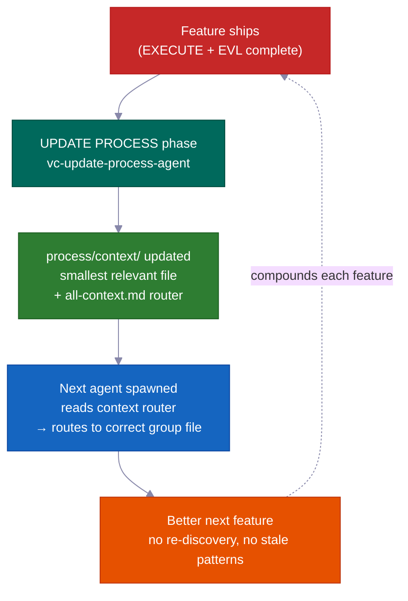

### मुख्य तंत्र: `process/context/` एक पोर्टेबल, साझा स्मृति के रूप में

`process/context/` में विषय-समूहों में व्यवस्थित संरचित ज्ञान है — वास्तुकला निर्णय, कोडिंग नियम, तैनाती चरण, परीक्षण पैटर्न, अवसंरचना तथ्य। चैट इतिहास के विपरीत, यह ज्ञान:

- **हर वर्कर एजेंट में जाता है** — `vc-context-discovery` हर स्पॉन्ड एजेंट को उसके काम के लिए सही `all-{group}.md` राउटर तक रूट करता है, फिर सबसे छोटी प्रासंगिक गहरी फ़ाइल तक। एक रिसर्च एजेंट, एक योजना एजेंट, और एक कोडिंग एजेंट सभी एक ही साझा समझ से शुरू होते हैं
- **मेमोरी रीसेट से बचता है** — यह डिस्क पर है, context window में नहीं; एक सिकुड़ा सत्र इसमें से कुछ नहीं खोता
- **Claude और Codex दोनों पढ़ सकते हैं** — `.agents/skills` `.claude/skills/` का शॉर्टकट लिंक है, इसलिए वही संदर्भ प्रणाली दोनों एजेंटों को डुप्लीकेशन के बिना सेवा देती है

रूट राउटर (`all-context.md`) समूह राउटरों (`all-{group}.md`) की ओर इशारा करता है, जो सबसे छोटी प्रासंगिक गहरी फ़ाइल तक रूट करते हैं। एजेंट राउटर का पालन करते हैं — वे फ़ाइल पथ हार्डकोड नहीं करते। इसका मतलब है कि नाम बदलने और समूह विभाजन के लिए केवल राउटर संपादन की ज़रूरत होती है, पूरे कोडबेस में खोज की नहीं।

```
process/context/
├── all-context.md                  ← root router (architecture, stack, patterns)
├── tests/all-tests.md              ← test runners, debugging, commands
├── container/all-container.md      ← Docker, deployment, infra procedures
├── uxui/all-uxui.md                ← components, design tokens, visual conventions
└── {domain}/all-{domain}.md        ← any domain with 3+ durable docs (auto-promoted)
```

<br>

### इसे खुद-बेहतर बनाने वाला क्या बनाता है ("जीवित दस्तावेज़" से अलग)

"जीवित दस्तावेज़" का मतलब आमतौर पर होता है "दस्तावेज़ जिन्हें हम अपडेट रखने का इरादा रखते हैं लेकिन ज़्यादातर भूल जाते हैं।" यह प्रणाली इरादे को यांत्रिक रूप से लागू करती है।

**UPDATE PROCESS चरण को बंद होने से पहले प्रति-फ़ाइल संदर्भ समीक्षा चाहिए।** `vc-update-process-agent` कोई चरण तब तक पूरा नहीं कर सकता जब तक हर संभावित-प्रभावित संदर्भ फ़ाइल की प्रति-फ़ाइल ठोस कारण के साथ समीक्षा न हो। "कोई अपडेट ज़रूरी नहीं" की अनुमति है — लेकिन इसे हर समीक्षित फ़ाइल का नाम और क्यों का स्पष्टीकरण देना होगा। अस्पष्ट कारण अस्वीकार किए जाते हैं। चेकपॉइंट बाइनरी है: समीक्षा दर्ज करें, या चरण बंद नहीं होगा।

हर पूरे हुए फ़ीचर के लिए पूरी फीडबैक लूप:

| चरण | मालिक | क्या होता है |
|------|-------|-------------|
| 1. Git diff विश्लेषण | `vc-scout` | बदली फ़ाइलें → प्रभावित संदर्भ क्षेत्र मैप करता है |
| 2. प्रति-फ़ाइल समीक्षा | `vc-update-process-agent` | हर संदर्भ फ़ाइल का नाम लेता है, अपडेट या स्पष्ट "कोई बदलाव नहीं + कारण" बताता है |
| 3. अपडेट लागू | समानांतर वर्कर एजेंट | हर क्षेत्र की संदर्भ फ़ाइल नए पैटर्न, निर्णय, सीख से अपडेट होती है |
| 4. रूटिंग जाँच | `validate-context-discovery.mjs` | पुष्टि करता है कि हर दस्तावेज़ इंडेक्स्ड है और राउटर संगत हैं |
| 5. डिस्कवरी पुष्टि | `validate-all-context.mjs` | पुष्टि करता है कि `all-context.md` और समूह राउटर डिस्क की मौजूदा फ़ाइलों से मेल खाते हैं |

आपका 100वाँ फ़ीचर पहले 99 में सीखी हर चीज़ से लाभान्वित होता है — आकांक्षा के रूप में नहीं, बल्कि एक यांत्रिक गारंटी के रूप में।

<br>

### आगे की झलक: सीख पीछे नहीं, आगे भी जाती है

हर चरण रिपोर्ट में एक `## Forward Preview` अनुभाग होता है जो *अगले* चरण के एजेंट के लिए लिखा गया है। यह उन्हें सटीक कमांड देता है जो हरी रखनी हैं, निर्भरता बदलाव, और चरण के बीच मिली फ़ाइल-दायरे की जानकारी। Phase 3 उठाने वाले एजेंट को Phase 2 का पूरा आउटपुट फिर से पढ़कर अंदाज़ा नहीं लगाना पड़ता। उसे एक केंद्रित ब्रीफ दी जाती है।

यह संदर्भ दस्तावेज़ों से अलग है: संदर्भ दस्तावेज़ *स्थायी* ज्ञान रखते हैं (निर्णय जो फ़ीचर के पार सच रहते हैं); Forward Preview *अस्थायी* हैंडऑफ़ स्थिति रखता है (अगले कार्य-सत्र को अभी क्या जानना है)।

<br>

### वैलिडेटर सूट सड़न रोकती है

स्थायी ज्ञान पुराना पड़ जाता है जब कोई जाँचता नहीं। किट ऐसे वैलिडेटर भेजती है जो हर चरण बंद होने पर चलते हैं:

| वैलिडेटर | क्या पकड़ता है |
|-----------|----------------|
| `validate-context-discovery.mjs` | किसी राउटर द्वारा इंडेक्स न किए गए दस्तावेज़; टूटे लिंक; लापता फ्रंटमैटर |
| `validate-all-context.mjs` | `all-context.md` डिस्क की वास्तविक फ़ाइलों से असंगत |
| `validate-skill-keywords.mjs` | `trigger_keywords` या `layer` फ़ील्ड गायब स्किल (रूटिंग Step 0 टूट जाता है) |
| `validate-protocol-discovery.mjs` | `process/development-protocols/` में डिस्कवरी फ्रंटमैटर गायब प्रोटोकॉल फ़ाइलें |

ये स्वचालित जाँच की तरह चलते हैं — एक पुराना या अनाथ दस्तावेज़ फेल होता है। सिस्टम अपनी सेहत खुद जाँचता है।

<br>

### संदर्भ समूह खुद व्यवस्थित होते हैं

जब कोई विषय 3+ दस्तावेज़ों तक पहुँचता है या एकल फ़ाइल ~800 पंक्तियों से बड़ी हो जाती है, तो समूह स्वतः बनते हैं। एजेंट राउटर का पालन करते हैं और पथ हार्डकोड नहीं करते — इसलिए नया समूह जोड़ना (जैसे `process/context/billing/all-billing.md`) केवल राउटर अपडेट चाहता है, billing का उल्लेख करने वाले हर एजेंट में बदलाव नहीं। राउटर स्थिर संदर्भ है; उसके पीछे की फ़ाइलें स्वतंत्र रूप से पुनर्गठित हो सकती हैं।

> किट आपके असली कोडबेस से संदर्भ समूह तैयार करती है (`vc-setup` के ज़रिए)। समूह तय सूची नहीं हैं — ये एक पैटर्न हैं। जैसे-जैसे प्रोजेक्ट बढ़ता है, आपका auth क्षेत्र, infra क्षेत्र, payments क्षेत्र — सभी प्रथम-श्रेणी रूटेबल ज्ञान बन जाते हैं।

---

## 🤖 अंदर क्या है

<br>

### 15 Agents

<details>
<summary>एजेंट रोस्टर देखने के लिए क्लिक करें</summary>

<br>

**मुख्य वर्कफ़्लो एजेंट** — RIPER-5 के प्रति चरण एक (R → SPEC → I → P → V → E → UP):

| Agent | Model | भूमिका |
|-------|:---:|------|
| 🔍 `vc-research-agent` | sonnet | कोडबेस + वेब रिसर्च, केवल पढ़ना। अंतर्निर्मित विरोधाभास ट्रैकिंग |
| 📝 `vc-spec-agent` | sonnet | INNOVATE से पहले उत्पाद-खोज आवश्यकता दस्तावेज़। `*_SPEC_*.md` बनाता है |
| 💡 `vc-innovate-agent` | sonnet | 2-3 दृष्टिकोण तुलना। PLAN से पहले निर्णय सारांश (चुना + अस्वीकृत) |
| 📋 `vc-plan-agent` | sonnet | एंटी-शॉर्टकट गार्ड के साथ योजना लिखता है। "मुझे पहले से पता है" कोई योजना नहीं है |
| ✅ `vc-validate-agent` | sonnet | योजना → सहमत जाँच-सूची (V1–V7)। चेकपॉइंट: PASS/CONDITIONAL/BLOCKED |
| ⚡ `vc-execute-agent` | **opus** | योजना के अनुसार लागू करें। चरण रिपोर्ट में प्रगति नोट, विचलन प्रोटोकॉल, स्व-समीक्षा |
| ⏩ `vc-fast-mode-agent` | **opus** | संकुचित R→S→I→P→V, EXECUTE से पहले ज़रूरी सुरक्षा विराम के साथ |
| 🔧 `vc-quick-fix-agent` | **opus** | QUICK FIX लेन: एक छोटा कम-जोखिम संपादन + केवल छुई फ़ाइलों की जाँच, कोई योजना/validate नहीं |
| 🧠 `vc-update-process-agent` | sonnet | 7-चरण बंद करना: संग्रहण, संदर्भ अपडेट, पुराने आर्टिफ़ैक्ट स्कैन, सीख |

<br>

**विशेषज्ञ एजेंट** — EXECUTE के दौरान या स्वतंत्र रूप से बुलाए जाते हैं:

| Agent | भूमिका |
|-------|------|
| 🐛 `vc-debugger` | परिकल्पना बनाने से पहले सबूत जमा करता है। प्रतिस्पर्धी परिकल्पनाएँ, उन्मूलन श्रृंखलाएँ, व्यवहार्यता जाँच |
| 🧪 `vc-tester` | परिवर्तन-जागरूक। सहमत-जाँच-सूची परीक्षण (EVL) फिर चलाता है। config बदलाव पर स्वतः वृद्धि |
| 🔎 `vc-code-reviewer` | समीक्षा से पहले edge-case स्काउट भेजता है। N+1 पहचान, auth-path जाँच |
| ✨ `vc-code-simplifier` | व्यवहार बदले बिना स्पष्टता के लिए कोड साफ करता है |
| 🎨 `vc-ui-ux-designer` | डिज़ाइन-जागरूक फ्रंटएंड। निर्माण के बीच रिसर्च वर्कर स्पॉन कर सकता है |
| 📦 `vc-git-manager` | `touched_files` से तार्किक कमिट में विभाजित करता है। अज्ञात फ़ाइलें अस्वीकार करता है |

</details>

<br>

### 33 Skills (स्वतः-खोजे जाते हैं)

<details>
<summary>स्किल सूची देखने के लिए क्लिक करें (20 contract + 13 helper)</summary>

<br>

**📜 Contract skills (20)** — एक आर्टिफ़ैक्ट के मालिक: `vc-generate-plan` · `vc-generate-context` · `vc-generate-spec` · `vc-generate-closeout` · `vc-generate-phase-program` · `vc-audit-context` · `vc-audit-plans` · `vc-audit-vc` · `vc-update` · `vc-publish` · `vc-feasibility-test` · `vc-risk-evidence-pack` · `vc-test-coverage-plan` · `vc-validate-findings` · `vc-autoresearch` · `vc-intent-clarify` · `vc-autopilot` · `vc-agent-strategy-compare` · `vc-plan-discovery` · `vc-context-discovery`

**🛠️ Helper skills (13)** — एजेंट कैसे काम करते हैं, इसे बेहतर बनाते हैं: `vc-review-situation` · `vc-sequential-thinking` · `vc-problem-solving` · `vc-scout` · `vc-debug` · `vc-docs-seeker` · `vc-frontend-design` · `vc-agent-browser` · `vc-web-testing` · `vc-setup` · `vc-predict` · `vc-scenario` · `vc-security`

</details>

> **⚠️ नामकरण नियम:** अपनी स्किल या एजेंट के लिए `vc-` उपसर्ग का उपयोग न करें — वह नेमस्पेस किट-भेजी फ़ाइलों के लिए आरक्षित है, और पुराने-हटाने का गार्ड `.claude/skills/` और `.claude/agents/` के तहत किसी भी `vc-*` पथ को किट-स्वामित्व मानता है। इसके बजाय `my-`, `team-`, या `proj-` उपयोग करें।

<br>

### 🪝 10 Hooks

| Hook | क्या करता है |
|------|-------------|
| 🔐 `privacy-block.cjs` | `.env`, credentials, SSH keys पढ़ना रोकता है। स्पष्ट अनुमोदन आवश्यक |
| 🚫 `scout-block.cjs` | `node_modules/`, `dist/` में भटकने से रोकता है। Gitignore-syntax `.ckignore` |
| 🧠 `session-init.cjs` | स्टैक पहचानता है, env इंजेक्ट करता है, compaction के बाद अनुमोदन गेट पुनर्प्राप्त करता है |
| 💉 `subagent-init.cjs` | हर सबएजेंट में एक संक्षिप्त संदर्भ ब्लॉक इंजेक्ट करता है |
| ✨ `post-edit-simplify-reminder.cjs` | 5+ संपादनों के बाद, simplifier चलाने का सुझाव देता है (गैर-अवरोधक, थ्रॉटल्ड) |
| 📛 `descriptive-name.cjs` | हर Write पर भाषा-जागरूक फ़ाइल-नामकरण नियम |
| 📊 `session-state.cjs` | सत्र मेट्रिक्स + टोकन जागरूकता |
| 📋 `post-write-plan-check.mjs` | `*_PLAN_*.md` पर हर Write पर योजना-आर्टिफ़ैक्ट संरचना जाँचता है |
| 🧹 `post-commit-lint.mjs` | हर `git commit` पर conventional-commits उपसर्ग जाँचता है |
| 🔍 `stop-validator-sweep.cjs` | सत्र रुकने पर मुख्य हार्नेस वैलिडेटर चलाता है |

<br>

**सब कुछ कहाँ रहता है:**

```text
your-project/
├── .claude/{agents,skills,hooks}/   # 🤖 15 agents · ⚡ 33 skills · 🪝 10 hooks
├── .codex/agents/                   # 🔄 Mirrored for Codex
├── .agents/skills -> .claude/skills # 🔗 Symlink for Codex discovery
├── CLAUDE.md · AGENTS.md            # 📋 Orchestrator config + cross-tool registry
└── process/
    ├── context/                     # 🧠 Auto-routed knowledge domains
    ├── general-plans/               # 📋 Cross-cutting plans + task folders
    ├── features/                    # 🏷️ Feature-scoped lifecycle folders
    └── development-protocols/       # 📜 22 shared workflow docs
```

---

## ⚡ Quick Fix + Fast Mode

दो हल्के विकल्प जब पूरा RIPER-5 प्रोसेस काम से ज़्यादा लग रहा हो:

<table>
<tr>
<td width="50%" valign="top">
<h1>🔧</h1>
<strong>Quick Fix</strong> — <code>"quick fix: …"</code><br><br>
एक मामूली one-liner से बड़ा, "योजना चाहिए" से छोटा। लीड एजेंट केवल-पढ़ने में स्काउट करता है → एक-पंक्ति पुष्टि → छुई फ़ाइलों पर संपादन + सीमित जाँच के लिए <code>vc-quick-fix-agent</code> स्पॉन करता है। <strong>कोई योजना नहीं, कोई सहमत जाँच-सूची नहीं, कोई EVL नहीं।</strong>
<br><br>
<sub>तुरंत रद्द हो जाता है अगर बदलाव schema, auth, API, billing, या migration को छुए — फिर पूरे RESEARCH पर रूट होता है।</sub>
</td>
<td width="50%" valign="top">
<h1>⏩</h1>
<strong>Fast Mode</strong> — <code>"ENTER FAST MODE - …"</code><br><br>
RESEARCH + SPEC + INNOVATE + PLAN + VALIDATE को एक पास में दबाता है — लेकिन फिर भी <strong>योजना लिखता है, सहमत जाँच-सूची लिखता है, और EXECUTE से पहले रुकता है।</strong>
<br><br>
<sub>सामान्य Fast Mode में VALIDATE के बाद विराम होता है — आप समीक्षा करते हैं, फिर "ENTER EXECUTE MODE" कहते हैं। उस विराम को हटाने और बिना रुके पूरे रास्ते चलाने के लिए <code>autopilot fast: [task]</code> उपयोग करें।</sub>
</td>
</tr>
</table>

---

## 🔄 किट जीवन-चक्र: Install · Setup · Update · Publish

| कमांड | क्या करता है | कब |
|---|---|---|
| `curl … install.sh \| bash` | किट फ़ाइलें आपकी फ़ाइलें ओवरराइट किए बिना सिंक करता है; fresh बनाम upgrade स्वतः पहचानता है | पहली install + हर upgrade |
| **Run vc-setup** | स्टैक पहचानता है, `process/` बनाता है, कोडबेस गहराई से स्कैन करता है, असली संदर्भ भरता है | fresh install के बाद |
| **Run vc-update** | सटीक diff गणना करता है, क्या बदलेगा दिखाता है, आपकी OK का इंतज़ार करता है; पुराने-फॉर्मेट योजनाएँ/फ़ोल्डर बिना डेटा खोए माइग्रेट करता है | हर upgrade पर |
| **Run vc-publish** *(maintainers)* | हार्नेस बदलाव वापस किट रेपो में प्रकाशित करता है | किट में योगदान देते समय |

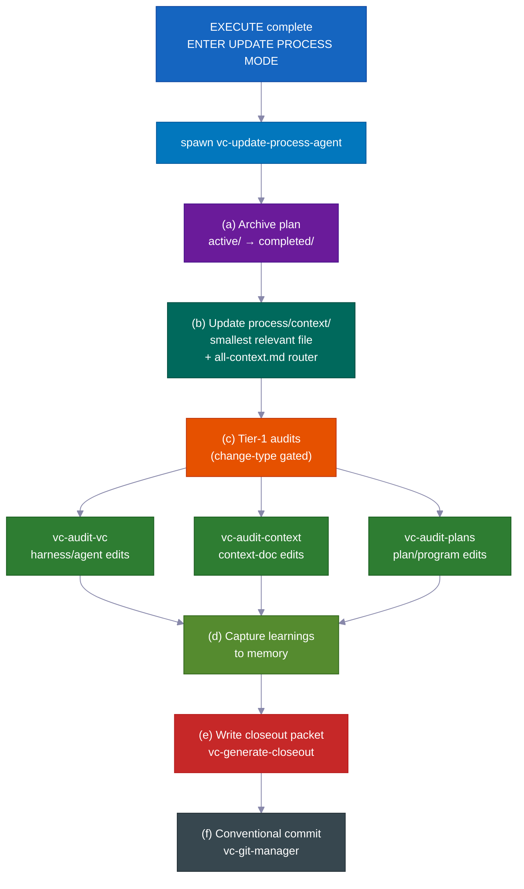

> 💡 `vc-update` एक preview diff दिखाता है और आपकी OK का इंतज़ार करता है। आपका `process/` directory और प्रोजेक्ट-विशिष्ट सामग्री **कभी** चुपके से नहीं बदली जाती। install दोबारा चलाना सुरक्षित है।

---

## 💡 और कारण यह बस काम करता है

कई छोटे, स्मार्ट डिफ़ॉल्ट मिलकर कम निगरानी और कम लागत बनाते हैं।

- **हर भूमिका को केवल वही उपकरण मिलते हैं जो उसे चाहिए।** योजना बनाते समय एजेंट शाब्दिक रूप से कोड संपादित नहीं कर सकता — वे उपकरण बंद हैं। यह एजेंट को आगे कूदकर योजना मंजूर होने से पहले चीज़ें बदलने से रोकता है। सिस्टम बस इसकी अनुमति नहीं देता।

- **यह premium AI model केवल वहाँ उपयोग करता है जहाँ ज़रूरी है।** कोड लिखने में शीर्ष model उपयोग होता है। योजना, रिसर्च, समीक्षा, और जाँच — सभी में एक सस्ता, तेज़ model। परिणाम: सब कुछ के लिए शीर्ष model चलाने की तुलना में लगभग 60–70% कम लागत — उस काम में कोई गुणवत्ता हानि नहीं जो मायने रखता है।

- **यह निर्माण से पहले जोखिम भरे अनुमानों का परीक्षण करता है।** जब एजेंट को यकीन न हो कि कुछ काम करेगा — एक विशिष्ट API व्यवहार, एक लाइब्रेरी फ़ीचर, एक अवसंरचना धारणा — तो पहले एक छोटा असली प्रयोग करता है। परिणाम स्पष्ट: काम करता है, काम नहीं करता, या अस्पष्ट। वह निर्णय और एक सरल-भाषा नोट सीधे योजना में जाते हैं। एजेंट गलत धारणा पर घंटों निर्माण नहीं करता।

- **साफ, सार्थक save points।** बदलाव स्पष्ट संदेशों के साथ साफ, तार्किक टुकड़ों में स्वतः commit होते हैं। इतिहास पढ़ना और एक-एक टुकड़ा पूर्ववत करना आसान है।

- **उपयोगी स्वचालित अनुस्मारक।** छोटे अंतर्निर्मित सहायक बदली फ़ाइलों पर सही जाँच चलाने, कोड सरल रखने, और उचित commit संदेश लिखने जैसी चीज़ों के लिए सुझाव देते हैं। आपको इसे पुलिस किए बिना गुणवत्ता ऊँची रहती है।

- **आप खुद-सुधार लूप को अकेले चला सकते हैं।** वही "समस्याएँ खोजो, ठीक करो, दोहराओ" इंजन जो योजना-जाँच और परीक्षण-सुधार चलाता है, किसी भी गड़बड़ क्षेत्र पर स्वतंत्र उपकरण के रूप में भी काम करता है — एक विनिर्देशन, दस्तावेज़, परीक्षण, एक त्रुटि सूची। इसे उपयोग करने के लिए पूर्ण फ़ीचर निर्माण की ज़रूरत नहीं।

- **वर्कफ़्लो नियम वास्तव में काम करते हैं — इसका अंतर्निर्मित प्रमाण।** किट अपने साथ अपना परीक्षण सूट भेजती है: जाने-माने-अच्छे और जाने-माने-बुरे उदाहरणों के साथ जाँचों का एक सेट जो साबित करता है कि वर्कफ़्लो नियम सही व्यवहार करते हैं। सिस्टम खुद की जाँच करता है। आपको यह भरोसा नहीं करना होगा कि गार्डरेल लगे हैं — आप जाँचें चला सकते हैं और देख सकते हैं।

---

## Contributing

हम योगदान का स्वागत करते हैं! दिशानिर्देशों के लिए [CONTRIBUTING.md](CONTRIBUTING.md) देखें।

<br>

**त्वरित लिंक:**

- 🐛 [बग रिपोर्ट करें](https://github.com/withkynam/vibecode-pro-max-kit/issues/new?template=1.bug_report.yml)
- 💡 [फ़ीचर अनुरोध](https://github.com/withkynam/vibecode-pro-max-kit/issues/new?template=2.feature_request.yml)
- ⚡ [स्किल सबमिट करें](https://github.com/withkynam/vibecode-pro-max-kit/issues/new?template=3.skill_submission.yml)
- 🌐 [अनुवाद जोड़ें](https://github.com/withkynam/vibecode-pro-max-kit/issues/new?template=5.translation.yml)

<br>

<a href="https://github.com/withkynam/vibecode-pro-max-kit/graphs/contributors">
  
</a>

<br>

### 🙏 Credits

vibecode-pro-max-kit spec-driven development framework और self-improving context organization पर ध्यान केंद्रित करती है, बिना आपको 80+ skills से बोझिल किए। कम उपकरण, अधिक संरचना।

---

## ⭐ Star History

<a href="https://star-history.com/#withkynam/vibecode-pro-max-kit&Date">
 <picture>
   <source media="(prefers-color-scheme: dark)" srcset="https://api.star-history.com/svg?repos=withkynam/vibecode-pro-max-kit&type=Date&theme=dark" />
   <source media="(prefers-color-scheme: light)" srcset="https://api.star-history.com/svg?repos=withkynam/vibecode-pro-max-kit&type=Date" />
   
 </picture>
</a>

---

## 📄 License

MIT
