<p align="center">
  <a href="../../README.md">English</a> |
  <a href="README.zh-CN.md">简体中文</a> |
  <strong>日本語</strong> |
  <a href="README.ko-KR.md">한국어</a> |
  <a href="README.vi-VN.md">Tiếng Việt</a> |
  <a href="README.pt-BR.md">Português</a> |
  <a href="README.es.md">Español</a> |
  <a href="README.de.md">Deutsch</a> |
  <a href="README.fr.md">Français</a> |
  <a href="README.hi.md">हिंदी</a>
</p>

<div align="center">

<a href="https://flowser.ai">
  
</a>

*世界トップクラスのエンジニアが、バイブコーダーのために開発*<br>
*[flowser.ai](https://flowser.ai) — GTM向けコンピュータ付きAIエージェント*

<br>

# vibecode-pro-max-kit

<br>

<p align="center">
  
  <br><br>
  <em>「全集中——スペックの呼吸 拾ノ型・ヴァイブの流れは決して途切れない。」</em><br>
  <strong>——竈門炭治郎</strong>
</p>

*プロジェクトにドロップするだけ。AIエージェントが完全なプラン優先の開発プロセスを手に入れます——7つのゲート付きフェーズ、自己修復チェックループ、最初から最後まで場所を失わずに動くオートパイロット。*

<table align="center">
<tr>
<td width="50%" valign="top"><strong>📦 ワンコマンドインストール</strong><br>1行の<code>curl</code>でどんなプロジェクトにも導入できます。新規・既存ユーザーを自動判別し、既存ファイルを上書きしません。</td>
<td width="50%" valign="top"><strong>🌐 どこでも動作</strong><br>あらゆるテックスタック、あらゆる言語、あらゆるAIコーディングエージェント——Claude Code、Codex、Cursor、Windsurf、Copilotなど。</td>
</tr>
<tr>
<td valign="top"><strong>🧭 RIPER-5 プラン優先ワークフロー</strong><br>7つのゲート付きフェーズ（Research → Spec → Innovate → Plan → Validate → Execute → Update-Process）でエージェントが即コードに飛びつくのを防ぎます。</td>
<td valign="top"><strong>🚀 オートパイロットモード（quick / fast / full）</strong><br>1つのフレーズでどのフェーズからでもハンズフリー実行を開始できます。3つのレーンでリスクに合わせた手順を選択。</td>
</tr>
<tr>
<td valign="top"><strong>🎯 <code>/goal</code> ——完了まで走り続けるトークン</strong><br>1つのコピペ可能なブロックで、エージェントがフェーズをまたいで止まらず走り続けます——新しいセッションでも再開できます。</td>
<td valign="top"><strong>🔁 PVL + EVL 自己修復ループ</strong><br>プランチェックと修正、テストチェックと修正のループが自動でギャップを見つけて修正し、再確認します——それぞれ最大10サイクル。</td>
</tr>
<tr>
<td valign="top"><strong>🔍 vc-autoresearch</strong><br>プラン、テスト、スペック、ドキュメント、評価に向けられる再利用可能なギャップ発見→修正→繰り返しループ。</td>
<td valign="top"><strong>🧪 フィージビリティプローブ</strong><br>エージェントが設計アプローチを確定する前に、実装前検証（VIABLE / NOT-VIABLE）を行います。</td>
</tr>
<tr>
<td valign="top"><strong>🎛️ スマート戦略選択</strong><br>各フェーズ前に、1エージェントか複数か協調チームかをコスト見積もり付きで比較し、最安値の適切な選択をします。</td>
<td valign="top"><strong>🧮 スマートなモデル活用</strong><br>高コストモデルはコード作成のみ。それ以外はすべて安価なモデルが担当。コストを下げつつ品質を維持。</td>
</tr>
<tr>
<td valign="top"><strong>🤔 インテント明確化</strong><br>リクエストが曖昧な場合、エージェントは推測して間違ったものを作る代わりに、事前にいくつかの的確な質問をします。</td>
<td valign="top"><strong>🛡️ 36バリデーター</strong><br>意見ではなく機械的な正確性チェック——キット自体の構造を守り、問題が出荷前にドリフトを検出します。</td>
</tr>
<tr>
<td valign="top"><strong>🏗️ フェーズプログラム</strong><br>大規模プロジェクトを品質ゲート付きの独立フェーズに分割するので、大きな作業が途中で崩壊しません。</td>
<td valign="top"><strong>🔀 学びながら自己再構成するプログラム</strong><br>学習しながら、エージェントが新フェーズを挿入し、作業を並べ替え、ブロックされたステップをスキップします——プランは動的に適応します。</td>
</tr>
<tr>
<td valign="top"><strong>🧠 場所を失わない</strong><br>進捗はフェーズごとにディスクに書き込まれるので、メモリリセットが起きても実行が継続し、正確に中断した場所から再開します。</td>
<td valign="top"><strong>📚 自己改善型プロジェクトメモリ</strong><br>セットアップ時にコードベースを学習し、機能をリリースするたびに共有メモを最新状態に保ちます。ドキュメントが古くなりません。</td>
</tr>
<tr>
<td valign="top"><strong>⚡ Quick Fix + Fast Mode</strong><br>小さな変更向けの軽量レーン。1行の修正は1行のままで済みます。</td>
<td valign="top"><strong>🧱 レイヤー化された自動発見スキル</strong><br>スキルは明確なレイヤーに整理され、自動的に発見されます——エージェントは常にそのステップに適切なツールを見つけます。</td>
</tr>
<tr>
<td valign="top"><strong>🤖 15エージェント · 33スキル · 10フック</strong><br>専門化されたエージェント、再利用可能なスキル、セーフティフックのフルチームが最初からすべて連携済み。</td>
<td valign="top"><strong>🔄 フルキットライフサイクル</strong><br>インストール、セットアップ、アップデート、パブリッシュがそれぞれ1コマンド——すべてのプロジェクトを安全に最新キットで維持。</td>
</tr>
<tr>
<td valign="top"><strong>📝 SPEC——平易な言葉での合意</strong><br>設計の前に、シンプルなユーザーストーリーで何を作るかを明記します——誤解を最も安くキャッチできる場所。</td>
<td valign="top"><strong>🎯 常にインテントを確認</strong><br>後続のすべてのフェーズがSPECに照らし合わせます：作っているものは本当に求められているものか？</td>
</tr>
</table>

<p>
  <a href="https://github.com/withkynam/vibecode-pro-max-kit/stargazers"></a>
  <a href="https://github.com/withkynam/vibecode-pro-max-kit/network/members"></a>
  <a href="LICENSE"></a>
  <a href="https://github.com/withkynam/vibecode-pro-max-kit/graphs/contributors"></a>
  <a href="https://github.com/withkynam/vibecode-pro-max-kit/actions/workflows/validate.yml"></a>
  <a href="CHANGELOG.md"></a>
  
  
  
  
</p>

<p>
  <strong>最もシンプルで、最も柔軟で、チームフレンドリーなコーディングキット</strong><br><br>
  <a href="https://github.com/anthropics/claude-code"></a>&nbsp;
  <a href="https://github.com/openai/codex"></a>&nbsp;
  <a href="https://cursor.com"></a>&nbsp;
  <a href="https://windsurf.com"></a><br>
  <a href="https://github.com/google-gemini/gemini-cli"></a>&nbsp;
  <a href="https://github.com/opencode-ai/opencode"></a>&nbsp;
  <a href="https://github.com/features/copilot"></a>
</p>

<p>
  <em>あらゆるテックスタック、あらゆる言語、あらゆるプロジェクトで動作</em><br><br>
  <picture>
    <source media="(prefers-color-scheme: dark)" srcset="https://skillicons.dev/icons?i=ts%2Cjs%2Creact%2Cnextjs%2Cvue%2Cnuxt%2Csvelte%2Cangular%2Cnodejs%2Cexpress%2Cbun%2Cpython%2Cdjango%2Cflask%2Cfastapi&theme=dark&perline=15" />
    <source media="(prefers-color-scheme: light)" srcset="https://skillicons.dev/icons?i=ts%2Cjs%2Creact%2Cnextjs%2Cvue%2Cnuxt%2Csvelte%2Cangular%2Cnodejs%2Cexpress%2Cbun%2Cpython%2Cdjango%2Cflask%2Cfastapi&theme=light&perline=15" />
    
  </picture>
  <br>
  <picture>
    <source media="(prefers-color-scheme: dark)" srcset="https://skillicons.dev/icons?i=ruby%2Crails%2Cgo%2Crust%2Cjava%2Cspring%2Ckotlin%2Cswift%2Cphp%2Claravel%2Ccs%2Cdotnet%2Celixir%2Cgraphql%2Cprisma&theme=dark&perline=15" />
    <source media="(prefers-color-scheme: light)" srcset="https://skillicons.dev/icons?i=ruby%2Crails%2Cgo%2Crust%2Cjava%2Cspring%2Ckotlin%2Cswift%2Cphp%2Claravel%2Ccs%2Cdotnet%2Celixir%2Cgraphql%2Cprisma&theme=light&perline=15" />
    
  </picture>
  <br>
  <picture>
    <source media="(prefers-color-scheme: dark)" srcset="https://skillicons.dev/icons?i=supabase%2Cfirebase%2Cpostgres%2Cmongodb%2Credis%2Cdocker%2Ckubernetes%2Caws%2Cgcp%2Cazure%2Cvercel%2Ccloudflare%2Ctailwind%2Celectron&theme=dark&perline=15" />
    <source media="(prefers-color-scheme: light)" srcset="https://skillicons.dev/icons?i=supabase%2Cfirebase%2Cpostgres%2Cmongodb%2Credis%2Cdocker%2Ckubernetes%2Caws%2Cgcp%2Cazure%2Cvercel%2Ccloudflare%2Ctailwind%2Celectron&theme=light&perline=15" />
    
  </picture>
  <br>
  <p><em>デコレーションではありません。<code>vc-setup</code>を実行すると、エージェントがコードベースをスキャンし、<br>
  スタックを検出して、すべてのスキルが動作前に参照するプロジェクト固有のナレッジグループを構築します。<br>
  他のハーネスはエージェントを1言語にロックします——<code>rust-review-agent</code>、<code>python-linter</code>——他では役に立ちません。<br>
  このキットは上記のあらゆる組み合わせに適応し、機能をリリースするたびに知識を蓄積します。</em></p>
</p>

</div>

---

## ⚡ はじめる——1コマンド、30秒

> **前提条件：** Node.js ≥ 22、git、bash（macOS / Linux / WSL；Alpineの場合：`apk add bash`）。

**コマンドは1つだけで、誰でも同じです。** プロジェクトフォルダー内で実行してください。新規か既存ユーザーかを自動検出し、ファイルを上書きせずに安全にインストールし、*次に何を言えばいいかを正確に教えてくれます。*

```bash
curl -fsSL https://raw.githubusercontent.com/withkynam/vibecode-pro-max-kit/main/install.sh | bash
```

完了したら2つのメッセージのいずれかが表示されます——**出力の最後を読んで、そこに書いてある通りにしてください：**

<table>
<tr>
<td width="50%" valign="top">
<h3>🆕 新規プロジェクト</h3>
インストーラーがハーネスを検出せず、次のように表示します：
<br><br>
<code>Next: Run: claude → Say: "Run vc-setup"</code>
<br><br>
<strong>→ エージェントを開いて <code>Run vc-setup</code> と言ってください</strong>
<br><br>
<sub>vc-setupがテックスタックを検出し、<code>process/</code>フォルダーを作成し、コードベースをスキャンして、実際のアーキテクチャ、規約、テストコマンドを書き込みます——チェックリストではなく会話です。</sub>
</td>
<td width="50%" valign="top">
<h3>🔄 既存ハーネス（アップグレード）</h3>
インストーラーが以前のインストールを検出し、次のように表示します：
<br><br>
<code>Next (upgrade detected): Run: claude → Say: "Run vc-update"</code>
<br><br>
<strong>→ エージェントを開いて <code>Run vc-update</code> と言ってください</strong>
<br><br>
<sub>vc-updateが最新バージョンを取得し、古いフォーマットのプランやフォルダーが見つかれば、<strong>データ損失ゼロ</strong>で移行するための貼り付け可能なプロンプトを提供します。<code>process/</code>には一切触れません。</sub>
</td>
</tr>
</table>

> 💡 **コマンドを推測する必要はありません。** `install.sh`がルーティングします：新規 → `vc-setup`、アップグレード → `vc-update`。インストールを再実行しても常に安全です——何も壊しません。**Codexユーザー：** チャットで言う代わりに `/vc-setup`（または `/vc-update`）を実行してください。

<br>

<details>
<summary><strong>📦 インストールがディスクに置くもの（非破壊的）</strong></summary>

<br>

```
your-project/
├── .claude/
│   ├── agents/              # 🤖 15のエージェント定義（.md）
│   ├── skills/              # ⚡ 33のスキル（各ディレクトリにSKILL.md）
│   └── hooks/               # 🪝 10のライフサイクルフック（.cjs / .mjs）
├── .codex/agents/           # 🔄 Codex用ミラーエージェント
├── .agents/skills →         # 🔗 .claude/skillsへのシンボリックリンク（Codex発見用）
├── CLAUDE.md                # 📋 オーケストレーター＋ルーティングルール
├── AGENTS.md                # 📖 エージェント＋スキルレジストリ（クロスツール）
└── process/
    └── development-protocols/  # 📜 22の共有ワークフロードキュメント（installで配置）
                                #    context/、プラン、フィーチャー → vc-setupで構築
```

- **非破壊的。** 既存の`.claude/skills/`、`.claude/agents/`、`process/`、`settings.json`は一切削除されません。キット所有のファイルのみ書き込み・更新されます。
- **既存の設定がある？** `.vibecode-backup/`にバックアップされ、`settings.json`はその後復元されます。
- **既存の`CLAUDE.md`がある？** `CLAUDE.md.pre-vibecode`としてバックアップされます。
- **既存の`process/`がある？** installは一切触れません——`vc-setup` / `vc-update`が差分を先に見せた上でインタラクティブに移行します。

> **初回インストール時の注意：** `vc-`で始まる（キット予約済みネームスペース）カスタムスキル/エージェントがあり、今まで一度もインストールしたことがない場合、古いファイルの削除ステップでフラグが立つことがあります。インストール後、`ls .claude/skills/ .claude/agents/`で確認してください。独自追加には`my-`、`team-`、`proj-`プレフィックスを使えば完全に回避できます。

</details>

<details>
<summary><strong>🤖 エージェントからセットアップしたい方向け（フルプロンプト）</strong></summary>

<br>

> **プロジェクトフォルダーを作業ディレクトリにしてClaude CodeまたはCodexを開き**、次を貼り付けてください：

```
First, install the vibecode-pro-max-kit agent harness by running this command:

curl -fsSL https://raw.githubusercontent.com/withkynam/vibecode-pro-max-kit/main/install.sh | bash

After install completes, run vc-setup and follow the full interactive flow:

1. DETECT — Read package.json (or go.mod, Cargo.toml, pyproject.toml, etc.), detect my
   stack: framework, package manager, monorepo structure, test framework, database, auth.
   Also check for any existing .claude/, process/, or context files.
2. SHOW ME WHAT YOU FOUND — Summarize detection and wait for me to confirm. If this is an
   existing project, tell me what looks good vs what could be improved.
3. ASK ME ABOUT THE PROJECT — Have a real conversation. Ask follow-ups, probe anything
   vague, keep going until you genuinely understand it. Summarize back and confirm.
4. SCAFFOLD — Create the process/ directory. If process/ already exists, show me the plan
   and wait for approval. Never silently move or delete my files.
5. STUDY — Deep-scan and populate process/context/all-context.md with REAL content: repo
   structure, stack + versions, patterns, import aliases, env vars, routes, schema, tests.
   No placeholder text.
6. VALIDATE — Run all validation checks to confirm everything is wired correctly.

Rules: read and preserve good existing context; show me a summary before each major change
and wait for my OK; never create empty placeholder files; ask before reorganizing.
```

</details>

<details>
<summary>目次</summary>

- [一目でわかる概要](#-一目でわかる概要) · [課題](#-課題) · [解決策](#️-解決策)
- [バイブコーディング革命](#バイブコーディング革命) · [誰のためのツール？](#誰のためのツール) · [比較](#比較) · [何が違うのか](#-何が違うのか)
- [仕組み：コーディネーター](#-仕組みコーディネーター) · [RIPER-5ライフサイクル](#-riper-5ライフサイクル) · [インテント明確化](#-インテント明確化)
- [2つの品質ループ（PVL + EVL）](#-2つの品質ループpvl--evl) · [戦略比較＋モデルポリシー](#-戦略比較モデルポリシー) · [オートパイロットモード](#-オートパイロットモードハンズフリーriper-5) · [フィージビリティプローブ＋バリデーター](#-フィージビリティプローブバリデーターセーフティネット)
- [組み込みセーフティシステム](#️-組み込みセーフティシステム) · [実装前インテリジェンス](#-実装前インテリジェンス) · [品質パイプライン](#-品質パイプライン実行に組み込み済み)
- [プランライフサイクル](#-プランライフサイクル) · [フェーズプログラム](#️-フェーズプログラム崩壊しない大規模プロジェクト) · [コンテキストグループ](#-コンテキストグループ) · [フィーチャーフォルダー](#-フィーチャーフォルダー) · [スキルレイヤー](#-スキルレイヤー) · [自己改善型プロジェクトメモリ](#-自己改善型プロジェクトメモリ)
- [中身の紹介](#-中身の紹介) · [Quick Fix + Fast Mode](#-quick-fix--fast-mode) · [キットライフサイクル](#-キットライフサイクルinstall--setup--update--publish) · [コントリビュート](#コントリビュート)

</details>

---

## 🎁 一目でわかる概要

<table>
<tr>
<td align="center" width="25%" valign="top"><h1>🤖</h1><h3>15</h3><strong>エージェント</strong><br><sub>フェーズごとに1つ＋6つの専門エージェント</sub></td>
<td align="center" width="25%" valign="top"><h1>⚡</h1><h3>33</h3><strong>スキル</strong><br><sub>20のワークフロー＋13のヘルパー、キーワードマッチング</sub></td>
<td align="center" width="25%" valign="top"><h1>🪝</h1><h3>10</h3><strong>フック</strong><br><sub>セーフティレール＋自動コンテキスト読み込み</sub></td>
<td align="center" width="25%" valign="top"><h1>📜</h1><h3>22</h3><strong>プロトコル</strong><br><sub>全エージェントが従う共有ルール</sub></td>
</tr>
<tr>
<td align="center" width="25%" valign="top"><h1>🛡️</h1><h3>36</h3><strong>バリデーター</strong><br><sub>出荷前にエラーを検出する自動チェック</sub></td>
<td align="center" width="25%" valign="top"><h1>🔧</h1><h3>7</h3><strong>ツール</strong><br><sub>Claude Code · Codex · Cursor · Windsurf · Antigravity · OpenCode · Copilot</sub></td>
<td align="center" width="25%" valign="top"><h1>🌍</h1><h3>10</h3><strong>言語</strong><br><sub>EN · 中文 · 日本語 · 한국어 · VI · PT · DE · FR · ES · हिन्दी</sub></td>
<td align="center" width="25%" valign="top"><h1>⚡</h1><h3>30s</h3><strong>インストール</strong><br><sub>1コマンド、あとはエージェントが案内</sub></td>
</tr>
<tr>
<td align="center" width="25%" valign="top"><h1>🛩️</h1><strong>オートパイロット</strong><br><sub>3レーン（quick / fast / full）——どのフェーズからでも開始、止まらずに最後まで走る</sub></td>
<td align="center" width="25%" valign="top"><h1>📌</h1><strong>/goal ブロック</strong><br><sub>リセット後でもハンズフリー実行をセッションをまたいで再開できる短いコピペテキスト</sub></td>
<td align="center" width="25%" valign="top"><h1>🔁</h1><strong>vc-autoresearch</strong><br><sub>ギャップ発見→修正→繰り返しループ（プラン、テスト、評価の共有ツール）</sub></td>
<td align="center" width="25%" valign="top"><h1>🔬</h1><strong>フィージビリティプローブ</strong><br><sub>設計を確定する前の実装前検証（VIABLE / NOT-VIABLE）</sub></td>
</tr>
</table>

---

## 🔥 課題

Claudeに「Webhook対応を追加して」と頼むと、すぐにコードを書き始めます。アーキテクチャについて質問もしない。既存パターンのチェックもしない。プランもなし。コードベースに合わない400行ができあがって、修正に1時間かかります。

**でもこれは表面的な問題に過ぎません。** より深い問題が重くのしかかります：

<table>
<tr>
<td width="50%" valign="top">
<h1>🧠</h1>
<strong>セッションごとにコンテキストが消える</strong><br><br>
エージェントは学んだことを全部忘れます。毎回同じミス、同じ質問。記憶もなく、知識の蓄積もありません。
</td>
<td width="50%" valign="top">
<h1>📄</h1>
<strong>ドキュメントが一瞬で古くなる</strong><br><br>
先週いいコンテキストドキュメントを書いたのに、もう古くなっています。コードベースの変化に合わせて自動更新する仕組みがありません。
</td>
</tr>
<tr>
<td width="50%" valign="top">
<h1>💥</h1>
<strong>大きなタスクが途中で破綻する</strong><br><br>
コンテキストウィンドウがいっぱいになり、状態が失われ、エージェントがハルシネーションを始めます。3時間目にゼロからやり直しです。
</td>
<td width="50%" valign="top">
<h1>🤝</h1>
<strong>スペックもレビューもコラボレーションもない</strong><br><br>
PMがエージェントのビルド内容をレビューできません。コードを書く前に共有・議論・承認できる成果物がありません。
</td>
</tr>
<tr>
<td width="50%" valign="top">
<h1>🎭</h1>
<strong>アーキテクチャの判断がハルシネーションされる</strong><br><br>
エージェントは他のコードベースがどう解決したかを調べずに、パターンをでっち上げます。
</td>
<td width="50%" valign="top">
<h1>🚀</h1>
<strong>「完了」を証明するものがない</strong><br><br>
エージェントは「すべてのテストがパス」と言います——でも独立してテストを再実行したわけではありません。本番で発覚します。
</td>
</tr>
</table>

**あなたのエージェントには知性があっても、プロセスも記憶もチームとのコラボレーション手段もないのです。** 開発者であれ、PMであれ、バイブコーディングを始めたばかりのCEOであれ——この問題は誰にとっても同じです。解決策も同じです：**エージェントに本物の開発プロセスを与えること。**

---

## 🛠️ 解決策

このキットは単なる`CLAUDE.md`ではなく、**15の専門エージェント、33のスキル、10のフック、22のプロトコル**という完全な開発システムをプロジェクトにインストールします——エージェントが**理解してからビルドし、証明してから出荷する**ステップロック型ワークフロー付きで。

<br>

<table>
<tr>
<td align="center" width="50%" valign="top"><h1>📋</h1><strong>プラン優先アプローチ</strong><br><br><sub>コードを一行も書く前に、PMと開発者が同じ成文化されたプランをレビューします</sub></td>
<td align="center" width="50%" valign="top"><h1>🔄</h1><strong>自己改善型ナレッジ</strong><br><br><sub>機能リリースのたびに自動更新——ドキュメントが古くなりません</sub></td>
</tr>
<tr>
<td align="center" width="50%" valign="top"><h1>⚡</h1><strong>ハンズフリー実行</strong><br><br><sub>セッションリセットを生き延びます——分単位ではなく時間単位で動きます</sub></td>
<td align="center" width="50%" valign="top"><h1>🧬</h1><strong>アーキテクチャリサーチ</strong><br><br><sub>設計判断の前に実際のコードベースを調査します</sub></td>
</tr>
<tr>
<td align="center" width="50%" valign="top"><h1>✅</h1><strong>2つの品質チェック</strong><br><br><sub>コード作成前にプランを確認し、作成後に独立してテストを再実行します</sub></td>
<td align="center" width="50%" valign="top"><h1>🧭</h1><strong>スマートナレッジルーティング</strong><br><br><sub>毎回ナレッジベース全体ではなく、関連するものだけを読み込みます</sub></td>
</tr>
</table>

<br>

### フルRIPER-5フロー——7フェーズ、すべてのステップにゲート

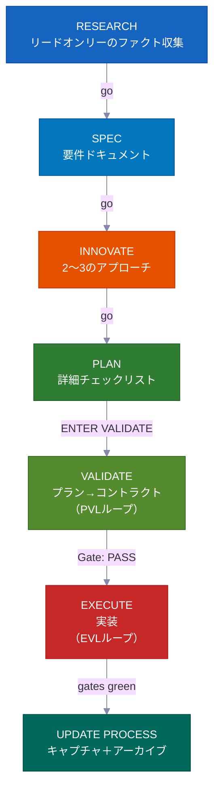

**インタラクティブモード**では、各フェーズが「go」を待ってから次に進みます——あなたはすべてのステップでループに入っています。**オートパイロットまたは /goal モード**では、最初に1回承認すれば、システムが完了まで自動で動かします。以下の3つの特定のハードストップのみで止まります。**VALIDATE**と実行後の再テストは省略不可能で——バグ作業が出荷されるのを防ぐハードゲートです——どちらのモードでも自動実行されます。

---

## バイブコーディング革命

<div align="center">
<h3><em>「最もホットな新しいプログラミング言語は英語だ。」</em></h3>
<strong>——Andrej Karpathy</strong>
</div>

<br>

**バイブコーディングはソフトウェアを作れる人を変えました。プラン優先開発は出荷できるものを変えます。**

<table>
<tr>
<td align="center" width="50%"><h3>63%</h3><sub>のバイブコーディングユーザーは<strong>開発者ではありません</strong></sub></td>
<td align="center" width="50%"><h3>16.2M</h3><sub>人のシチズンデベロッパーが世界中に<br>（前年比38%成長）</sub></td>
</tr>
<tr>
<td align="center" width="50%"><h3>$4.7B</h3><sub>のバイブコーディング市場<br>年38%成長中</sub></td>
<td align="center" width="50%"><h3>25%</h3><sub>のYC W25スタートアップがAI生成コード95%以上</sub></td>
</tr>
</table>

ほとんどのツールはプロジェクトの開始を助けます。このキットは**完成させる**ことを助けます——チームがレビューできるプラン、古くならないナレッジ、ミスが出荷される前にキャッチするセーフティチェックとともに。

---

## 誰のためのツール？

<div align="center">
<h3><em>「重要なのは誰がタイプしたかじゃない。何が出荷されたかだ。」</em></h3>
<strong>——Garry Tan, YC</strong>
</div>

<br>

<table>
<tr>
<td width="50%" valign="top">
<h1>🧑‍💼</h1>
<strong>CEO / 創業者</strong><br><br>
<em>「認証、課金、ランディングページ付きのSaaSを作って」</em><br><br>
エージェントがスタックを調査し、レビュー可能なアーキテクチャプランを書き、テスト付きで実装し、後から技術共同創業者が監査できるようにすべての判断を記録します。
</td>
<td width="50%" valign="top">
<h1>📊</h1>
<strong>プロダクトマネージャー</strong><br><br>
<em>「MRR、チャーン率、成長指標を表示するダッシュボードを作って」</em><br><br>
PRDスタイルのSPECを生成し、コードを書く前にあなたの承認を得て、スペック通りに実装し、検索可能なプロジェクト履歴としてプランをアーカイブします。
</td>
</tr>
<tr>
<td width="50%" valign="top">
<h1>🎨</h1>
<strong>デザイナー</strong><br><br>
<em>「このFigmaスクリーンショットをピクセルパーフェクトに再現して」</em><br><br>
デザイン対応エージェントがモックアップを分析し、デザイントークンを使ってコンポーネントごとに実装し、ビジュアル比較チェックを起動します。
</td>
<td width="50%" valign="top">
<h1>⚙️</h1>
<strong>エンジニア</strong><br><br>
<em>「認証モジュールをゼロダウンタイムでRBAC対応にリファクタして」</em><br><br>
現在の認証コードと他のコードベースがRBACをどう解決したかを調査し、影響ファイルをマッピングしたマイグレーションプランを作成し、ロールバックノート付きで安全に実装します。
</td>
</tr>
</table>

---

## 比較

| 機能 | vibecode-pro-max-kit | Superpowers | GSD | gstack |
|---------|---------------------|-------------|-----|--------|
| プラン優先ライフサイクル | フルRIPER-5（research → spec → innovate → plan → validate → execute → update） | 必須ワークフロー | コンテキスト腐敗の修正 | 部分的 |
| ステップロック安全性 | フェーズごとのツール制限（リードオンリーリサーチ、innovateでは書き込み不可） | スキルベース制約 | フェーズ分離 | なし |
| 品質チェックループ | **2つ**——PVL（プランを確認）＋EVL（テストを独立して再実行） | スキルごと | 自動なし | なし |
| マルチツール対応 | `AGENTS.md`＋`SKILL.md`オープン標準で7ツール | Claude Codeプラグイン | 14ランタイム | 1ツール |
| 自動改善ナレッジ | トピックグループ化されたナレッジ、機能完了ごとに更新 | プラグインメモリ | ディスク永続状態 | 手動 |
| チームコラボレーション | 共有プラン、スペック、レビューファイル | ソロ | ソロ | ソロ |
| スキルシステム | 33の自動発見、毎プロンプトでキーワードマッチング | 86の合成可能スキル | メタプロンプティング | 23のロールツール |
| 大規模マルチフェーズプロジェクト | アンブレラプラン＋フェーズごとのインナーループとリグレッションチェック | シングルタスク | シングルタスク | シングルタスク |
| ハンズフリーモード | オートパイロット（3レーン）＋スタンディング `/goal` 同意 | 手動 | 手動 | 手動 |
| インストール | 30秒の`curl`＋自動ルーティングセットアップ | プラグインマーケットプレイス | npxワンライナー | git clone |

> **ランタイムの幅について：** GSDは14ランタイムをサポートしています。私たちは7つを深くサポートします——すべてのプラットフォームにフルエージェントハーネス、スキル発見、ライフサイクルフックを備えています。幅 vs 深さ：あなたの選択です。

---

## ⚡ 何が違うのか

<table>
<tr>
<td width="50%" valign="top">
<h1>🔒</h1>
<strong>ステップロック型ツール制限</strong><br><br>
エージェントはリサーチ中に文字通り<strong>コードを書くことができません</strong>。RESEARCHはリードオンリー、INNOVATEはWriteなし、PLAN/VALIDATEは<code>process/</code>のみ書き込み可能。<strong>実際の能力制限</strong>であり、単なる提案ではありません。
</td>
<td width="50%" valign="top">
<h1>🎯</h1>
<strong>リードエージェントはコードに触れない</strong><br><br>
コーディネーターはルーティング、監視、ループ駆動を行います——<strong>ソースファイルの編集もテストの実行も自分では行いません</strong>。すべての編集とテスト実行は専用のサブエージェント内で行われます。隠れた作業はありません。
</td>
</tr>
<tr>
<td width="50%" valign="top">
<h1>🔍</h1>
<strong>自動スキル発見</strong><br><br>
リクエストを処理する前に<strong>33のスキル</strong>をスキャンしてキーワードをマッチング。「add webhook support」と言えば`vc-security`＋`vc-scenario`が自動的にサーフェスされます。
</td>
<td width="50%" valign="top">
<h1>💾</h1>
<strong>セッションリセットを生き延びる</strong><br><br>
プラン、レポート、ナレッジドキュメント、学びはすべてディスクに保存。スタートアップフックがセッションリセット後に承認ゲートを復元します。<strong>何も失われません。</strong>
</td>
</tr>
<tr>
<td width="50%" valign="top">
<h1>🛡️</h1>
<strong>自己監視型ステップガード</strong><br><br>
エージェントが必須ステップをスキップしようとすると、自ら止まります：<em>「PHASE JUMPING PREVENTED」</em>。<strong>ショートカットへの組み込みガード</strong>です。
</td>
<td width="50%" valign="top">
<h1>🔄</h1>
<strong>7つのAIコーディングツールで動作</strong><br><br>
2つのオープン標準——<code>AGENTS.md</code>と<code>SKILL.md</code>——により、<strong>アダプターもプラグインもゼロ。</strong>Claude Codeで始めて、Cursorに切り替え、Codexで続行。
</td>
</tr>
</table>

---

## 🧭 仕組み：コーディネーター

メインセッションは**コーディネーター**（オーケストレーターとも呼ばれます）であり、ワーカーではありません。4つのことのみを行います：

```
Your request
  → Step 0: Skill Discovery (scan 33 skills, match keywords, attach candidates)
  → Detect intent (feature / bug / question / refactor / UI) + score ambiguity
  → Route to the right agent in a fresh context window
  → Monitor: step compliance, status codes, loop driving
```

<table>
<tr>
<td width="50%" valign="top">
<h1>🧑‍✈️</h1>
<strong>委任するが、実装しない</strong><br><br>
Research → <code>vc-research-agent</code>。Plan → <code>vc-plan-agent</code>。Code → <code>vc-execute-agent</code>。コーディネーターは適切なコンテキストを渡して待ちます——実際の作業は自分では行いません。
</td>
<td width="50%" valign="top">
<h1>🚫</h1>
<strong>隠れた実行は一切なし</strong><br><br>
合意済みチェックリスト付きのプランが存在する瞬間、「ENTER EXECUTE MODE」は<strong>常に</strong><code>vc-execute-agent</code>を起動します。1行の修正でもそれを経由します。テストは専用の<code>vc-tester</code>内でのみ実行されます。変更の大きさにかかわらず同様です。
</td>
</tr>
<tr>
<td width="50%" valign="top">
<h1>📨</h1>
<strong>明確なステータスコード、曖昧なシグナルではない</strong><br><br>
すべてのサブエージェントは次のいずれかで終わります：<code>DONE</code> · <code>DONE_WITH_CONCERNS</code> · <code>BLOCKED</code> · <code>NEEDS_CONTEXT</code>。コーディネーターはブロッカーを無視せず、同じブロックされたアプローチを3回繰り返しません。
</td>
<td width="50%" valign="top">
<h1>🔁</h1>
<strong>修正ループを駆動する</strong><br><br>
サブエージェントは1回実行して結果を報告して止まります。コーディネーターのみが再起動します。PVL（プラン確認修正）とEVL（テスト確認修正）の両ループを駆動し、すべてのトラッキングを所有します。
</td>
</tr>
</table>

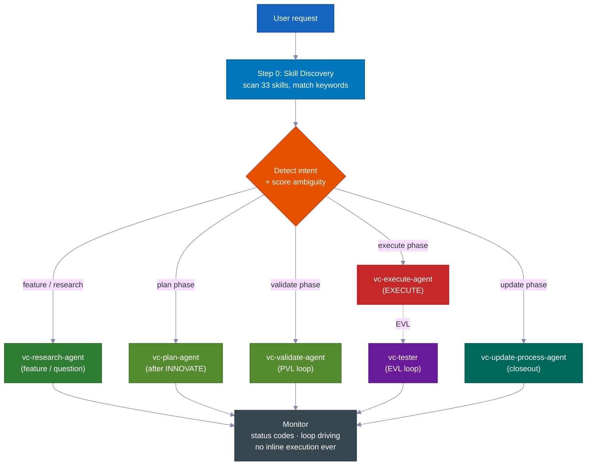

> **なぜこれが重要か：** 決定も秘密の編集もできるエージェントはプランをスキップする方法を見つけます。コーディネーターとワーカー（サブエージェント）を分離することで、プロセスが構造的に正直になります——コードを書く唯一の方法は必須ステップを経由することです。

---

## 📊 RIPER-5ライフサイクル

| フェーズ | 何が起きるか | エージェント | あなたが言うこと |
|-------|-------------|-------|---------|
| 🔍 **RESEARCH** | リードオンリーのファクト収集——コードベース＋Web。ファイルを変更しません。 | `vc-research-agent` | *（機能リクエスト時に自動）* |
| 📝 **SPEC** | プロダクトディスカバリー要件ドキュメント——ユーザーストーリー、受け入れ基準、スコープ外——**設計前にあなたがレビュー**。 | `vc-spec-agent` | `go` / `ENTER SPEC MODE` |
| 💡 **INNOVATE** | トレードオフ付きで2〜3のアプローチを探索。意思決定サマリー（選択・却下・理由）。 | `vc-innovate-agent` | `go` |
| 📋 **PLAN** | 詳細スペックを作成：タッチポイント、パブリックコントラクト、触れるファイル、検証エビデンス、再開ハンドオフ。 | `vc-plan-agent` | `go` |
| ✅ **VALIDATE** | プランを合意済みチェックリストに変換（V1〜V7チェックポイント）。判定：**PASS / CONDITIONAL / BLOCKED**。PVLループを実行。 | `vc-validate-agent` | `ENTER VALIDATE MODE` |
| ⚡ **EXECUTE** | プラン*通りに*実装。フェーズレポートへの進捗ノート、逸脱プロトコル、セルフレビュー。その後EVLループがチェックポイントを再実行。 | `vc-execute-agent` | `ENTER EXECUTE MODE` |
| 🧠 **UPDATE PROCESS** | 学びをキャプチャ、コンテキスト更新、プランアーカイブ、クローズアウトパケット作成。 | `vc-update-process-agent` | *（重要な作業の後に推奨）* |

> 📝 **SPECが独自フェーズである理由：** ほとんどのハーネスは「理解」から「設計」へ直接ジャンプします。プロダクトディスカバリーSPECステップを挿入することで、エージェントが**どのように**作るかを議論する*前*に、*あなた*（またはPM）が**何を**作るかを——シンプルなユーザーストーリーと受け入れ基準で——承認できます。誤解をキャッチする最も安価な場所です。（フェーズプログラムのインナーループでは、SPECはスキップされます——アンブレラSPECが全フェーズを管轄します。）
>
> **SPECは測定基準です。** 1分でスキャンできるシンプルな言葉で期待される動作を示します。その後のすべてのフェーズ——Innovate、Plan、Validate、Execute——が照らし合わせて同じ質問をします：*作っているものは本当に求められているものか？* 作業がずれ始めたとき、SPECがそれを検出します。

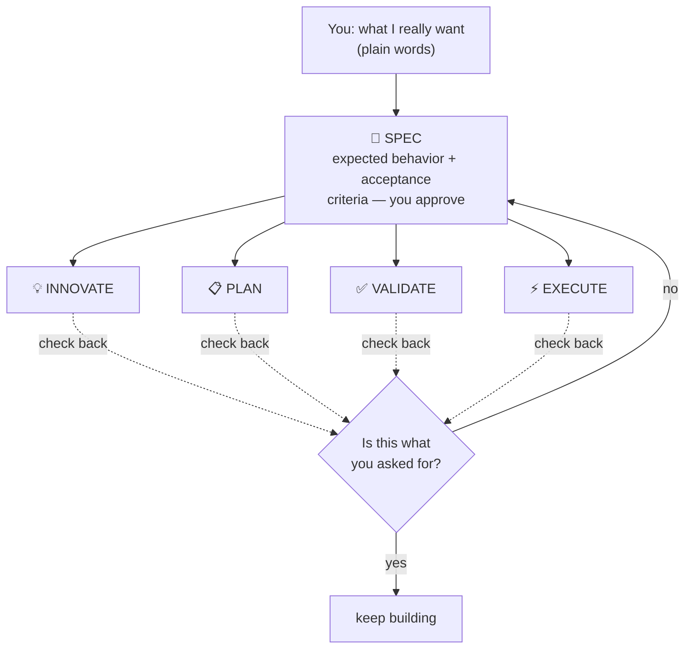

<br>

### 💻 セッション例

```
# 🆕 Feature request
You: "add webhook support to the API"
→ Skill discovery surfaces: vc-scenario, vc-security
→ research-agent gathers context (read-only, can't touch code)
→ "go" → spec-agent writes requirements doc → you approve
→ "go" → innovate-agent compares approaches → decision summary
→ "go" → plan-agent writes the plan, listing which files it will touch
→ "ENTER VALIDATE MODE" → validate-agent gates the plan (PVL loop) → Gate: PASS
→ "ENTER EXECUTE MODE" → execute-agent implements → tester re-runs gates (EVL) → reviewer → git-manager
→ Closeout packet: what changed, what's verified, recommended next step
```

```
# 🐛 Bug fix
You: "login redirect is broken"
→ Routes to vc-debugger → gathers evidence FIRST → 2-3 competing hypotheses
→ Systematically eliminates each → root cause with proof chain
→ execute-agent implements the fix → EVL re-test → quality pipeline
```

```
# ⏩ Fast mode
You: "ENTER FAST MODE - add rate limiting middleware"
→ Compressed RESEARCH + SPEC + INNOVATE + PLAN + VALIDATE in one pass
→ Mandatory safety pause after VALIDATE → you review → "ENTER EXECUTE MODE"
```

```
# 🤖 Autopilot (hands-free)
You: "autopilot full: build a notifications system"
→ ONE consolidated clarification round → provisional /goal block (standing consent)
→ Drives the full RIPER-5 sequence autonomously, pausing only on hard stops
```

```
# 🏗️ Large program
You: "build a full testing platform"
→ Umbrella plan + phase plans in a feature folder
→ Each phase inner loop: research → innovate → plan → PVL → execute → EVL → update
→ Progress survives context compaction — durable reports on disk
```

---

## 🎯 インテント明確化

ルーティング前に、リードエージェントはリクエストの曖昧さを**4つの2値シグナル（0〜4）**でスコアリングし、層を選択します。実際に何をするかが変わる場合のみ質問します。

| 層 | いつ | 動作 |
|---|---|---|
| **層0** ——サイレント自動ルーティング | スコア0〜1、または「go」/「just do it」と言った、またはプランを再開中 | 即座にルーティング、質問なし |
| **層1** ——インラインサマリー | スコア2 | 理解を1行で述べて選択したルートを示してから進む |
| **層2** ——質問 | スコア3以上 | ルーティング前に集中した選択式の質問をする |

> 🧠 **最大2ラウンド。** 層2の後もまだ不明な場合、最後に1つの平易な質問をして、最も狭い合理的なスコープのリサーチにデフォルトします。明確化を永遠にループしません。RESEARCH後、インテントを再確認します——リサーチが当初の想定と異なることを示した場合は再提示し、確認された場合は再質問せずに進みます。

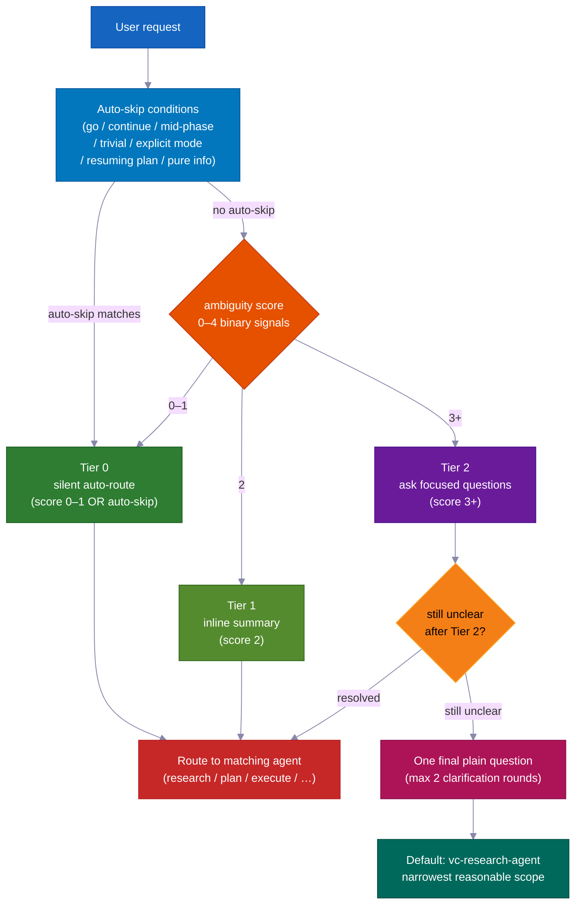

---

## ✅ 2つの品質ループ——PVL + EVL

ほとんどのハーネスは1回だけ確認します（あっても）。このキットはEXECUTEを**2つの独立したループ**で囲みます——1つはコードを書く前、もう1つは後。

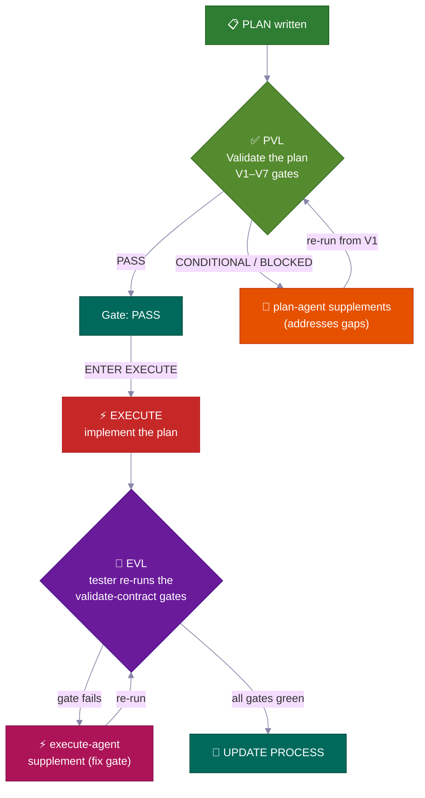

<table>
<tr>
<td width="50%" valign="top">
<h3>📋 PVL——Plan-Validate-Fix</h3>
EXECUTE前に<code>vc-validate-agent</code>がプランを<strong>V1〜V7チェックポイント</strong>に通します——インフラ、テストカバレッジ、破壊的変更、セキュリティ、各セクションのフィージビリティをカバーするために複数のエージェントに分割します。初回パスの<strong>CONDITIONAL</strong>または<strong>BLOCKED</strong>は終わりではありません——<code>vc-plan-agent</code>に戻ってプランを更新し、V1から再確認します。
<br><br>
<sub><code>vc-autoresearch</code>（domain: plan）によって追跡——ギャップ発見・修正ループ。10サイクル上限。プラトー検出。<strong>Gate: PASS</strong>（または明示的に受け入れたCONDITIONAL）のみがEXECUTEのロックを解除します。</sub>
</td>
<td width="50%" valign="top">
<h3>🧪 EVL——Execute-Validate-Fix</h3>
EXECUTEが完了を報告した後——<strong>すべてのチェックポイントがグリーンと主張している場合でも</strong>——リードエージェントは<strong>常に</strong><code>vc-tester</code>を起動して、合意済みチェックリストのテストコマンドを独立して再実行します。失敗したチェックポイントはスコープを絞った<code>vc-execute-agent</code>修正にルーティングされ、その後再テストされます。
<br><br>
<sub><code>vc-autoresearch</code>（domain: tests）によって追跡。10サイクル上限。execute-agent自身の内部「グリーンになるまで繰り返す」ループは、この独立した確認の<strong>代替にはなりません。</strong></sub>
</td>
</tr>
</table>

> 💎 **判定ラダー：** **PASS** → 続行 · **CONDITIONAL** → 修正可能なギャップ；ループが起動（またはあなたが記録上受け入れる） · **BLOCKED** → より深い問題；PLANに戻る（オートパイロット下：ギャップはバックログに入り実行は継続）。

### 🔁 vc-autoresearch——共有ループエンジン

PVLとEVLは同じトラッキングレイヤーを使用します：**`vc-autoresearch`**——ギャップ発見→修正→繰り返しループ。リードエージェントがループを駆動します——ラウンドカウンター、ラウンドごとのレポート、TSVログ、プラトー/上限/リグレッションチェックを所有します。ワーカーエージェントはファイア・アンド・フォーゲット：結果を返して止まります。エージェントが自分自身を再起動したり別のフェーズエージェントを起動したりすることはありません。

同じエンジンを単独でも使えます：「このスペックを強化して」、「すべてのリントを修正して」、「テストカバレッジを改善して」、「これらのドキュメントを改善して」——6つのドメイン（spec · tests · ux · docs · plan · errors）にわたるあらゆる繰り返しギャップ発見・修正タスク。

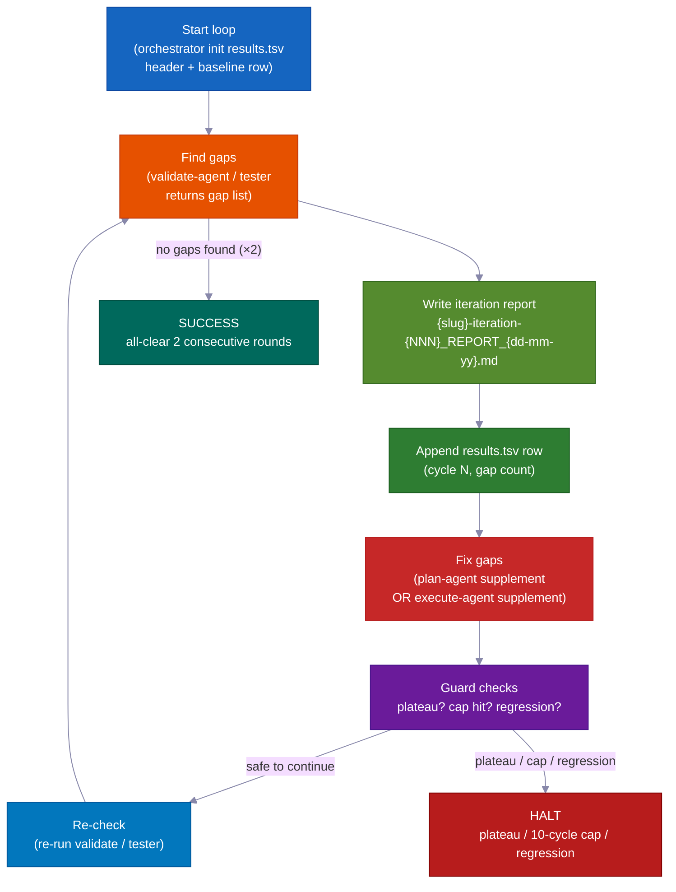

| モード | 何をするか | いつ停止するか |
|---|---|---|
| `vc-autoresearch`（コア） | ギャップ発見→修正→繰り返し | ギャップなし または メトリクスゴール達成 |
| `vc-autoresearch:probe` | 8ペルソナがコーパスを飽和まで尋問 | 3ラウンド新しい制約なし |
| `vc-autoresearch:reason` | ブラインドジャッジとの敵対的ディベート | ジャッジ収束または繰り返し上限 |
| `vc-autoresearch:evals` | TSV結果を分析——トレンド、プラトー、推奨事項 | 分析のみ |

**停止条件：** SUCCESS（2ラウンド連続オールクリア）· HALT_PLATEAU（3ラウンド進捗なし）· HALT_CAP（10ラウンドのハードリミット）· HALT_REGRESSION（以前パスしていたチェックが失敗）。

---

## 👥 戦略比較＋モデルポリシー

**すべてのフェーズ遷移時**に、リードエージェントは`vc-agent-strategy-compare`を呼び出して、コスト見積もり付きで次のフェーズの実行方法を推奨します。

| 戦略 | いつ | 調整 |
|---|---|---|
| **Sequential** | 作業が前の出力に依存する場合 | 1度に1エージェント |
| **Parallel subagents** | 独立した次元、ファイア・アンド・フォーゲット | なし——リードエージェントが結果を収集・統合 |
| **Workflow** | リストにわたる作業の予測可能な分割 | スクリプト化されたステップ |
| **Agent team** | エージェントが実行中に互いに話す必要がある場合（例：3つ以上のフェーズプランにわたってそれぞれ別のファイルを担当する） | TeamCreate＋共有タスクリスト＋SendMessage |

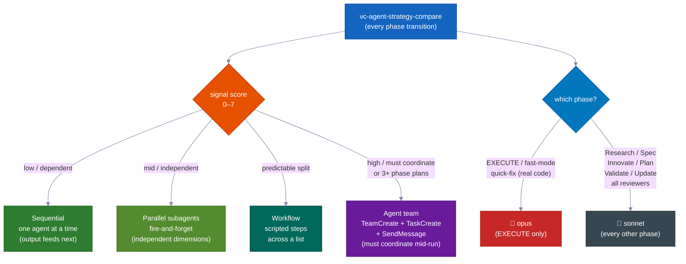

> ⚠️ **「エージェントチーム」は本物の機構を意味します**——名前付きのチームメイト、共有タスクリスト、エージェント間メッセージング——単に「チーム」と呼んだ並列エージェントではありません。3つ以上のフェーズプランの作成と、エージェントがそれぞれ自分のファイルに留まる必要があるマルチファイル編集には**必須**（オプションではない）です。真のチームのみが実行中に通信できます。

### 🧮 モデル選択ポリシー

| フェーズ | モデル | 理由 |
|---|---|---|
| **EXECUTE**（＋fast-mode、実際のコードを書くquick-fix） | 🔴 **opus** | 実際のソース編集、ビルド、マイグレーション |
| Research · Spec · Innovate · Plan · Validate · Update · すべてのレビュアー/リサーチャー | 🔵 **sonnet** | プランニングと分析——安価で十分な能力 |

> 作業を複数のエージェントに分割する場合、*コーディング*エージェントのみがopusを使用します。すべてのレビュアー、リサーチャー、バリデーター、プランナーはsonnetを使用します。リードエージェントはワーカーを起動するたびにモデルを明示します。

---

## 🤖 オートパイロットモード——ハンズフリーRIPER-5

**`autopilot [task]`**（または`run autopilot`、`autonomous mode`、`ENTER AUTOPILOT MODE`）と言えば、エージェントが残りのRIPER-5シーケンス*全体*を最初に**1回**の明確化ラウンドで実行し——完了するまで一時停止しません。

**どこからでもトリガー：** オートパイロットはセッションの開始時*または*途中のどの時点からでも開始できます。トリガー時、リードエージェントはディスクに保存されたファイルを読み取って、すでにどのRIPER-5フェーズにいるかを把握し、そこから引き継いで残りを自律的に進めます。

| ディスク上の状態 | エントリーフェーズ |
|---|---|
| SPECファイルなし | RESEARCHから開始 |
| SPECファイルあり | SPEC後（INNOVATE）にスキップ |
| プランファイルあり | PLAN後（VALIDATE）にスキップ |
| PASS/CONDITIONAL付きvalidate-contract | EXECUTEにスキップ |

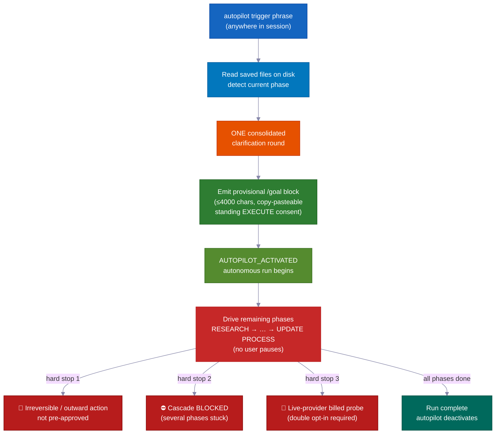

```
You: "autopilot full: add team invitations with email + role management"
→ Reads saved files → detects current phase → enters there
→ ONE consolidated clarification round (scope, hard stops, autonomy boundaries, first-phase strategy)
→ Provisional /goal block emitted (≤4000 chars, copy-pasteable, standing EXECUTE consent)
→ AUTOPILOT_ACTIVATED → drives remaining phases on its own
→ Stops ONLY for hard stops
```

### 3つのレーン——リスクに合わせた手順

| レーン | トリガー | フロー |
|---|---|---|
| 🟢 **quick** | `autopilot quick: [task]` | スカウト→編集→スコープ内チェック。プランなし、コントラクトなし、EVLなし。 |
| 🟡 **fast** | `autopilot fast: [task]` | 圧縮R→S→I→P→V→EXECUTE＋EVL。 |
| 🔴 **full** | `autopilot [task]` / `autopilot full:` | 完全なRIPER-5（デフォルト）。 |

### 🌙 ハンズフリー：1フレーズで、寝ている間に構築

`autopilot full: [task]`と言う——または`/goal`ブロックを貼り付ける——と、次のすべてが**ゼロの人間入力**で起こります：

- **プランチェック・修正ループ**——プランのギャップを見つけ、修正し、再確認。自力で最大10ラウンド。
- **ビルド・テスト・修正ループ**——コードを書き、テストを実行し、失敗を修正し、再実行。自力で最大10ラウンド。自分の「オールグリーン」を信頼しません——別のチェッカー（vc-tester）がすべてのテストを独立して再実行して確認します。
- **フェーズ間の自動進行**——リサーチからプラン、コード、完了まであなたを待たずに進みます。
- **メモリリセット後も再開**——プラン、レポート、進捗はすべてディスク上のファイルとして保存されています。コンパクション後（AIの短期記憶がクリアされた後）、次のセッションがそれらのファイルを読み込んで、中断した正確な場所から続行します。
- **詰まった機能を脇に置いて続行**——1つのフェーズが解決できない場合、エージェントはバックログノートを書いて次の機能に進みます。1つのブロッカーがすべてを止めることなく、複数の機能を並行して実行できます。
- **並列機能のエージェントチーム**——複数のエージェントが同時に別々の機能を構築でき、それぞれが自分のファイルにロックされているので衝突しません。詰まった機能は停車されますが、残りのブロッカーにはなりません。

### ハードストップは常にサーフェスされます（オートパイロット中でも）

**止まってあなたに尋ねる唯一の3回：**

- 🛑 取り消せないもの、または事前承認なしに外の世界に達するもの（本番公開、実際のメッセージ送信、課金）
- ⛔ 複数のフェーズが連続して行き詰まり進捗なし——本物の行き詰まりで目を向ける価値がある
- 💸 有料の外部サービスに実際のお金を使うテスト——実行前に確認を求めます

---

### 🎯 /goal——自律実行トークン

**必須、飾りではありません：** すべてのVALIDATEフェーズが完了した後、リードエージェントはEXECUTE開始前にコピペ可能な`/goal`ブロックを*必ず*出力しなければなりません。これは必須のハンドオフファイルです——オプションのコメントではありません。

**フォーマット制約：**

| ブロックタイプ | 必須フィールド | ハードリミット |
|---|---|---|
| VALIDATE後ブロック | SESSION GOAL · Charter+umbrella plan · Autonomy · Hard stop conditions · Next phase · Validate contract · Execute start | ≤ 4000 chars |
| プロビジョナル（オートパイロット）ブロック | SESSION GOAL · ENTRY PHASE · REMAINING PHASES · CLARIFICATIONS LOCKED · EXECUTE CONSENT · DECISION POLICY · HARD STOPS · TEST GATES · START（＋オプションLANE） | ≤ 4000 chars |

`/goal`コマンドは4000文字を超えるブロックを拒否します。短く保ちましょう——必須フィールドを構造として使い、散文のエッセイにしないでください。

**スタンドアロン /goal モード：** 新しいセッションに`/goal`ブロックを貼り付けると、`START`に名前付きのフェーズから実行が再開されます。明確化と決定ルールはすでに設定されています——新しい明確化ラウンドはありません。スタンディング`/goal`下では、エージェントはすべての可逆的なステップで自律的に決定し、BLOCKEDアイテムをバックログに送り、自分でレポートを書きます——しかし**ワーカーエージェントの委任は必須のまま**です。オートパイロットが削除するのは*承認一時停止*のみで、インライン実行禁止ルールは削除しません。

`validate-autopilot-goal-block.mjs`で検証されます。

---

## 🔬 フィージビリティプローブ＋バリデーターセーフティネット

### 🔬 フィージビリティプローブ——構築前に前提をテストする

SPEC、INNOVATE、またはVALIDATEが読み取りだけでは確認できない重要な前提に当たったとき、`VC-FEASIBILITY-PROBE-NEEDED`を出力して停止します。リードエージェントが`vc-debugger`を起動して実際のテストを実行し、**VERDICT**を書き込みます：

| 判定 | 意味 |
|---|---|
| ✅ **VIABLE** | 前提が成立——設計はこれに依拠できる |
| ❌ **NOT-VIABLE** | 前提が誤り——そのアプローチは禁止 |
| ❓ **INCONCLUSIVE** | 証明できなかった——既知のギャップとして繰り越し |

各判定には3部構成の設計ノートが付きます：**結果が許可するもの · 禁止するもの · まだ不確かなもの**——一字一句そのまま一時停止したフェーズに戻されます。プローブは**コストクラス分け**されています（`cheap-local` / `needs-container` / `needs-live-provider` → ダブルオプトイン / `needs-browser` / `needs-cf`）ので、有料または共有リソースのプローブが無音で実行されることはありません。

### 🛡️ 36バリデーター——機械的な正確性、意見ではない

このキットには**36のバリデータースクリプト**が付属し、「エージェントはルールに従ったか？」を明確なパス/フェイル結果に変えます。ハーネスファイルに触れるあらゆるフェーズの後、およびUPDATE PROCESSの必須チェックポイントとして実行されます：

| バリデーターファミリー | チェック内容 |
|---|---|
| `vc-audit-vc` | エージェントパリティ（Claude/Codex）、スキルレジストリ、キットポータビリティ、エージェントフロントマター |
| `vc-audit-context` | コンテキストルーティング、発見フロントマター、スキルキーワード |
| `vc-audit-plans` | プラン目録、アンブレラ状態、フェーズ完全性、フェーズレポート、バックログノート |
| 14のVC-systemビヘイビアーバリデーター | 各々パス/フェイルフィクスチャペアを所有——戦略比較出力、クローズアウト、インテント明確化、フィージビリティ判定、autoresearchログなど |

---

## 🛡️ 組み込みセーフティシステム

これらはガイドラインではありません——すべてのエージェントに組み込まれた**ハードルール**です。

<table>
<tr>
<td width="50%" valign="top">
<h1>📝</h1>
<strong>実行中断なしの進捗ノート</strong><br><br>
コーディング中、エージェントは作業しながらフェーズレポートファイルに進捗ノートを書きます。実行中断なし、「続行か戻るか？」プロンプトなし。プラン変更が必要な問題に当たったら、停止してPLANに戻ります。それ以外は続行します。
</td>
<td width="50%" valign="top">
<h1>🚫</h1>
<strong>黙って逸脱しない</strong><br><br>
コーディングでプラン変更が必要な問題に当たったら、エージェントは<strong>即座に停止</strong>して説明し、PLANに戻ります。黙ったアドリブはありません。
</td>
</tr>
<tr>
<td width="50%" valign="top">
<h1>🔐</h1>
<strong>プライバシーガードレールフック</strong><br><br>
エージェントは明示的な承認なしに<code>.env</code>、クレデンシャル、SSHキー、<code>.pem</code>ファイルの<strong>読み取りをブロック</strong>されます。
</td>
<td width="50%" valign="top">
<h1>⚠️</h1>
<strong>ハイリスクエビデンスパック</strong><br><br>
認証、課金、スキーママイグレーション、パブリックAPI変更では、作業を「完了」と呼ぶ前に正式な<strong>5ファイルエビデンスパック</strong>が必要です——常に手動で、自動バイパスは絶対にありません。
</td>
</tr>
<tr>
<td width="50%" valign="top">
<h1>📨</h1>
<strong>ステータスコードの規律</strong><br><br>
ワーカーエージェントは<code>DONE</code> / <code>DONE_WITH_CONCERNS</code> / <code>BLOCKED</code> / <code>NEEDS_CONTEXT</code>のいずれかで終了しなければなりません。ブロッカーは無視されず、正確性に関する懸念はアクションアイテムになります。
</td>
<td width="50%" valign="top">
<h1>📊</h1>
<strong>クローズアウト＋ドリフトスコアリング</strong><br><br>
コーディング後、クローズアウトパケットが緊急度をスコアリングします：<strong>LOW</strong>（軽いタッチ）→ <strong>MEDIUM</strong>（重大）→ <strong>HIGH</strong>（ハーネス/プロトコルファイルに触れた）、そして次の安全なステップを推奨します。
</td>
</tr>
</table>

---

## 🔍 実装前インテリジェンス

コードを1行も書く前に、3つの専門スキルが問題をキャッチできます：

<table>
<tr>
<td width="50%" valign="top">
<h1>🎭</h1>
<strong>5ペルソナディベート——<code>vc-predict</code></strong><br><br>
アーキテクト、セキュリティ、パフォーマンス、UX、デビルズアドボケイトがあなたのプランをディベートします。1行書く前に<strong>GO / CAUTION / STOP</strong>の判定を出します。
</td>
<td width="50%" valign="top">
<h1>🎲</h1>
<strong>12次元エッジケース——<code>vc-scenario</code></strong><br><br>
機能を12次元で分解します（ユーザータイプ、入力の極端値、タイミング、スケール、状態、環境、エラー、認証、データ、インテグレーション、コンプライアンス、ビジネスロジック）。出力はそのままテストスペックとして使用可能。
</td>
</tr>
<tr>
<td width="50%" valign="top">
<h1>🔐</h1>
<strong>STRIDE + OWASPセキュリティ監査——<code>vc-security</code></strong><br><br>
デュアルメソドロジーのセキュリティ監査。依存関係監査、シークレット検出、重大度順にソートしてCriticalから修正する<strong>自動修正モード</strong>付き（リグレッションガード付き）。
</td>
<td width="50%" valign="top">
<h1>🔬</h1>
<strong>エビデンスファーストデバッグ——<code>vc-debugger</code></strong><br><br>
証拠を収集→2〜3の対立仮説を立てる→各仮説をテストする→除外パスをドキュメント化。<strong>推測しない——証明します。</strong>
</td>
</tr>
</table>

---

## ✅ 品質パイプライン——実行に組み込み済み

**テスト優先、その後コード。** 合意済みチェックリスト（コードに触れる前に作成）が通過しなければならない正確なテストを定義します。execute-agentはそれらのテストがグリーンになるまでコードを書きます。その後、別のチェッカー——`vc-tester`——がすべてのテストを独立して再実行して確認します。execute-agent自身の「オールグリーン」は額面通りに受け取られません。最後に、レビュアーが新しい部分だけでなく、プロジェクト全体がまだ一緒に動作することを確認します。

execute-agentはコードを書いて終わりではありません。**品質パイプライン**を自動的に経由します：

<br>

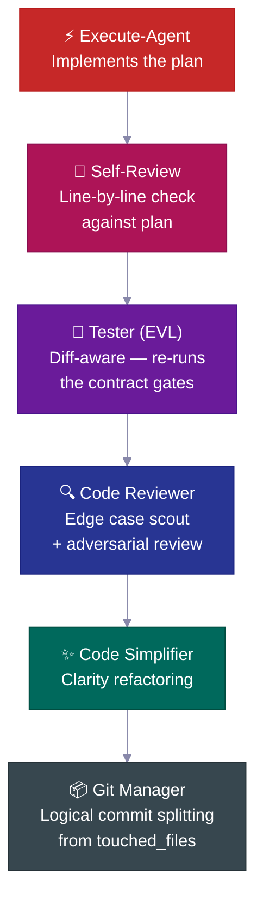

| ステップ | 何をするか |
|---|---|
| 🔎 **セルフレビュー** | プランに対してすべてのチェックリスト項目を確認し、逸脱を記録 |
| 🧪 **テスター（EVL）** | 合意済みチェックリストのテストを独立して再実行；変更ファイル→テストファイルにマッピング、70%以上マッピング時はフルスイートにエスカレーション |
| 🔍 **コードレビュアー** | レビュー前にエッジケーススカウトを送る；N+1クエリ、認証パス、データリークを確認 |
| ✨ **シンプリファイアー** | レビュー後にわかりやすさのためにコードを整理——動作変更なし |
| 📦 **Gitマネージャー** | `touched_files`を受け取り、論理的なconventional commitsに分割し、不明なファイルを拒否 |

---

## 📋 プランライフサイクル

すべての重要な機能は**プランライフサイクル**に従います——作成され、レビューされ、その通りに構築され、永続的なプロジェクト履歴としてアーカイブされる成文化されたスペック。

<br>

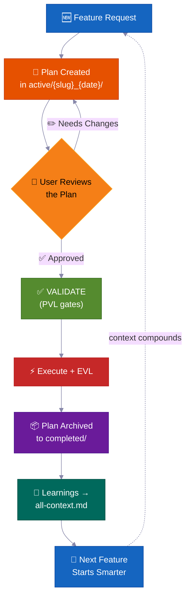

> 💡 6ヶ月後に誰かが*「なんでこの認証方式にしたんだっけ？」*と聞いた時、答えは`completed/`にあります。Slackのスレッドに埋もれてはいません。

**プランの保存場所——タスクフォルダー規約：**

```
process/
├── general-plans/
│   ├── active/
│   │   └── webhooks_28-05-26/          # 📋 タスクフォルダー：プラン＋コロケートされたレポート/refs
│   │       └── webhooks_PLAN_28-05-26.md
│   ├── completed/                       # ✅ アーカイブ済み（検索可能な履歴）
│   └── backlog/                         # 📌 延期された作業
└── features/
    └── billing/                         # 🏷️ フィーチャースコープ（5以上のアーティファクト）
        ├── active/{slug}_{date}/
        ├── completed/
        └── backlog/
```

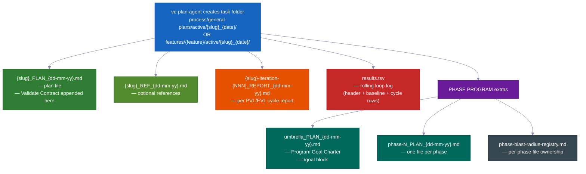

> すべてのプランには次が含まれます：📍 **タッチポイント**（作成・変更されるファイル）· 📜 **パブリックコントラクト** · 💥 **触れるファイル**（何が壊れる可能性があるか、何をテストするか）· ✅ **検証エビデンス** · 🔄 **再開ハンドオフ**。`vc-plan-discovery`が再開する適切なプランを見つけ、`post-write-plan-check`フックがすべてのプラン書き込み時にプラン構造を確認します。

---

## 🏗️ フェーズプログラム——崩壊しない大規模プロジェクト

通常の機能は1つのプランを使います。**大規模なマルチフェーズプロジェクト**はフェーズプログラムを使います——アンブレラプランとフェーズごとのプラン、それぞれ独自のチェックポイントと保存されたレポートを持つ**7ステップのインナーループ**全体を実行します。

<br>

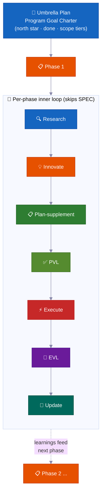

| | 機能 | なぜ重要か |
|---|---|---|
| 🔄 | **フェーズごとに再リサーチ** | コードドリフトを確認し、最新レポートを読み、前提を更新 |
| ✅ | **フェーズごとのチェックポイント** | エビデンスが証明するまでフェーズは完了しません。正直なステータス：`PLANNED → CODE DONE → TESTING → VERIFIED`または`BLOCKED` |
| 📄 | **保存されたレポート** | 各フェーズがディスクに結果を書き込みます——進捗はメモリリセットを生き延びます |
| 🧠 | **学びが前進する** | フェーズ1の発見がコーディング開始前にフェーズ2のプランを更新 |
| 🏗️ | **基盤 vs 拡張** | 「アーキテクチャを証明する」と「すべてを実装する」を明示的に分離 |
| 🚧 | **正直なブロッカー処理** | 詰まったフェーズはエビデンス付きで`BLOCKED`のまま。グリーンステータスを偽らない |

<br>

### 🔀 学びながらプログラムが自己再構成する

最初に書いたプランは粗削りな地図であり、固定のコントラクトではありません。プログラムが実行されるにつれ、調整します——すべてのステップを事前に予測する必要はありません。

**実行の途中に新しいフェーズを追加できます。**
作業中、エージェントが欠けているステップを発見することがあります——次のフェーズが進む前に行わなければならないこと。その場合、そこに新しいフェーズを挿入し、残りの番号を付け直して続行します。人間の介入は不要です。（内部シグナル：`MID_PROGRAM_PLAN_CREATED`——新しいプランがディスクに書き込まれ、自動的にレジストリに追加されます。）

**フェーズを並べ替えることができます。**
リサーチで計画した順序が間違っていることが判明する場合があります——例えば、フェーズ3がフェーズ4が生成するものに依存している場合など。エージェントは残りのフェーズを並べ替えて理由を記録します。（内部シグナル：`PHASE_RESTRUCTURE_NOTICE`——監査証跡としてフェーズレポートに保存され、ブロッカーにはなりません。）

**各フェーズのプランをコーディング直前に更新します。**
フェーズのコーディングが始まる前に、クイックリサーチパスがプログラムがこれまでに学んだことを確認します。その後、そのフェーズのチェックリストを新しい発見で更新します。これは**プランサプリメント**ステップと呼ばれます。プランは固定されません——前のフェーズからの新しい事実を吸収します。

**まだ開始できない作業をスキップします。**
フェーズがまだ準備できていないものに依存している場合——まだ構築されていないサービス、まだ決定されていない決定——エージェントそのフェーズを依存関係ブロックとしてマークし、脇に置いて次に進みます。1つのフェーズが待っているためにプログラム全体が止まることはありません。

**いつ停止して質問すべきかを知っています。**
詰まった1つのフェーズはバックログに入れられてプログラムが続行します。しかし複数のフェーズが連続して壁にぶつかり進捗がない場合、エージェントはそれを本物の行き詰まり——**カスケードストップ**——として扱い、何が起きたかを示して一時停止します。1つの詰まったフェーズは正常です。連続して複数が詰まると構造的な問題を示します。

**ライブスコアボードを維持します。**
すべてのプログラムには、アンブレラプランに1ページのステータスセクションがあり、どのフェーズが現在進行中か、完了しているか、レポートがどこにあるかを示します。誰でも——またはメモリリセット後のエージェント自身でも——読んでどこにいるかを正確に把握できます。また、同時に作業している2つのフェーズが同じファイルを編集しないようにシンプルなファイルレジストリも維持します。

**最後に1つの大きな最終チェック。**
プログラム全体の終わりに、エージェントがプロジェクト全体がまだ一緒に動作するエンドツーエンドテストを実行します——各部品が単独でではなく。個々のフェーズチェックポイントが各部品が動作することを証明し、この最終チェックが部品が全体として動作することを証明します。

---

### 🧠 場所を失わない（メモリリセットを生き延びる）

長い仕事は正確に完了します——AIのメモリが途中でリセットされても。プラン、進捗、証拠はすべてディスク上のファイルに保存され、エージェントの頭の中だけにあるわけではありません。

AIエージェントには限られたワーキングメモリがあります。長い仕事ではそのメモリが埋まり圧縮されます——詳細がぼやけることがあります。新しいセッションが始まったとき（またはメモリがクリアされたとき）、エージェントはどこで止まったかを推測しません。ファイルを読みます。

正確にこう動作します：

**1. フェーズごとに短いレポートを書きます。**
フェーズが完了したら、レポートファイルがディスクに書き込まれます。進捗はエージェントの頭の中だけでなく、プロジェクトフォルダーに保存されます。メモリ圧縮でファイルは消えません。

**2. どのステップが完了したかのチェックリストを維持します。**
各フェーズプランには**Phase Loop Progress**リスト——すべてのステップ（リサーチ、プランチェック、ビルド、テスト、学びのキャプチャ）のチェックボックスがあります。リセット後、エージェントはそれらのボックスを読んで正確な次のステップを把握します。追いつかせる必要はありません。

**3. 各フェーズの開始時に短い「エンベロープ」。**
すべてのワーカーエージェント（作業の1フェーズを担う集中したヘルパー）は**Context Envelope**——10フィールドのノート：どの機能、どのフェーズ、どのブランチ、どのプランファイル、どのテストを実行するか——を出力することから始めます。読むのに数秒かかります。エージェントは何かする前に準備完了です。

**4. 自分のメモリよりファイルを信頼します。**
再開時、エージェントはコードとgit履歴に実際に何があるかをプランが言うことと照合します。実際の状態が勝ちます。古くなったプランはエージェントを誤って作業を繰り返させたりステップをスキップさせたりすることができません。

**5. 実行中のスコアボードとラウンドごとのレポート。**
すべての修正ループ（プランチェックループとビルドテストループ）は`results.tsv`スコアボードファイルを維持します——残っている問題数を追跡するラウンドごとの行。セッションがループの途中で終了したとき、次のセッションがカウントを読み、適切なラウンドから再開し、続行します。ラウンドは失われません。

**6. 再開時にリマインダーを再注入します。**
メモリが圧縮されたとき、システムは自動的に最新のステータスノートを新しいセッションにリロードします。承認待ちがあった場合——例えば、先に進む前に「はい」が必要なチェックポイント——リマインダーがそれをフラグします。何も黙ってスキップされません。

> 💡 要するに：オートパイロット実行を開始し、ラップトップを閉じて、数時間後に戻ることができます。エージェントはあるべき場所に正確にいるか——または最後に保存されたチェックポイントから再開し、ディスク上の証拠でそれを証明します。

---

## 🧠 コンテキストグループ

プロジェクトの知識は**コンテキストグループ**に整理されます——安定したナレッジエリアで、それぞれにエージェントに何をいつ読むべきかを指示する`all-{group}.md`ルーターファイルがあります。エージェントはルーターに従い、毎回ナレッジベース全体ではなく関連するものだけを読み込みます。

<br>

```
process/context/
├── all-context.md              # 🧭 ルートルーター——アーキテクチャ、スタック、パターン、規約
├── tests/all-tests.md          # 🧪 テストランナー、コマンド、デバッグ手順
├── container/all-container.md   # 🐳 Docker、デプロイ、インフラ手順
├── uxui/all-uxui.md            # 🎨 コンポーネント、デザイントークン、パターン
├── infra/all-infra.md          # 🖥️ サーバーインフラ、デプロイ
└── {your-domain}/all-{domain}.md  # 📚 3つ以上の永続ドキュメントがあるドメイン（自動昇格）
```

| | 仕組み |
|---|---|
| 🧭 **ルーターパターン** | エージェントはタスクに関連するものだけを読む |
| 📏 **自動昇格** | 3つ以上のドキュメント（または単一ファイルが大きくなりすぎた場合）を持つトピックが独自のグループを取得 |
| 🔄 **常に最新** | 重要な機能ごとに`vc-update-process-agent`によって更新 |
| 🧪 **監査可能** | `vc-audit-context`がルーティング、発見フロントマター、一貫性を確認 |
| 📨 **Context Envelope** | すべてのインナーループエージェントが開始時に10フィールドのノートを出力（feature → phase → session-goal → branch → worktree → context-group → blast-radius-packages → active-plan → test-runner → validate-contract）し、新しいワーカーエージェントが自分の立場を正確に把握できる |

> キットはプロトコルシードのみを提供します——コンテキストグループは`vc-setup`によって**あなたのプロジェクト向けに構築されます**（実際のコードをスキャン）。これらはパターンであり、固定リストではありません。

---

## 📁 フィーチャーフォルダー

トピックが5つ以上のファイルを積み重ねると、独自の**フィーチャーフォルダー**が付与されます——完全なライフサイクルコンテナです。

```
process/features/{feature}/
├── active/{slug}_{date}/   # 📋 作業中のプラン（レポート/refsがコロケート）
├── completed/              # ✅ アーカイブ済みプラン（検索可能な意思決定履歴）
└── backlog/                # 📌 延期された作業（エージェントが重複作成前にチェック）
```

| | 何が起きるか |
|---|---|
| 🆕 | 新しい作業は`active/`で開始→レポートが蓄積→プランが`completed/`にアーカイブ |
| 📌 | 延期された作業は`backlog/`へ——エージェントは重複プラン作成前にチェック |
| 📦 | 一般アーティファクトが5以上に達すると自動的にフィーチャー昇格 |
| 🔍 | すべてのフィーチャーに完全で自己完結した履歴——プラン、決定、レポート、リサーチ |

---

## 🧱 スキルレイヤー

33のスキルは3つのレイヤーに分類されます。すべての`SKILL.md`がフロントマターで`layer`と`trigger_keywords`を宣言し、生成されたカタログが発見を高速化します。

<table>
<tr>
<td width="33%" valign="top">
<h1>🎭</h1>
<strong>アクターエージェント</strong><br><br>
フェーズまたはロールを所有します。<code>.claude/agents/</code>に保存——これらは15のエージェントであり、スキルではありません。
</td>
<td width="33%" valign="top">
<h1>📜</h1>
<strong>コントラクトスキル（20）</strong><br><br>
それぞれが特定のファイルまたは合意された出力を生成します——<code>vc-generate-plan</code>、<code>vc-validate-findings</code>、<code>vc-autopilot</code>、監査。結果は確認できます。
</td>
<td width="33%" valign="top">
<h1>🛠️</h1>
<strong>ヘルパースキル（13）</strong><br><br>
エージェントの*動き方*を改善し、独自のファイルを生成しません——<code>vc-scout</code>、<code>vc-sequential-thinking</code>、<code>vc-problem-solving</code>、<code>vc-docs-seeker</code>。
</td>
</tr>
</table>

---

## 🧠 自己改善型プロジェクトメモリ

完了したすべての機能が学びをコンテキストシステムにフィードバックします——**ナレッジは積み重なり、リセットされません。**

AIアシスト型コードベースのほとんどは逆の特性を持ちます：新しいセッションはコールドスタートします。エージェントは同じファイルを再読し、同じパターンを再発見し、同じ決定を再び行います——前のセッションの洞察がチャットウィンドウにしか存在しなかったから。キットの答えはプロンプトのトリックではありません。**永続的なコンテキストファイルシステム**（`process/context/`）——すべてのエージェントがセッション開始時に読み、すべてのバリデーターが保護し、すべての完了した機能が豊かにする——です。

6ヶ月後、多くのメモリリセットを経ても、エージェントは*なぜ*認証がそのように機能するかを知っています——その知識がディスクに、ルーティングされた形で、監査可能な形でオンディスクにあるから、死んだセッションに閉じ込められているのではなく。

<br>

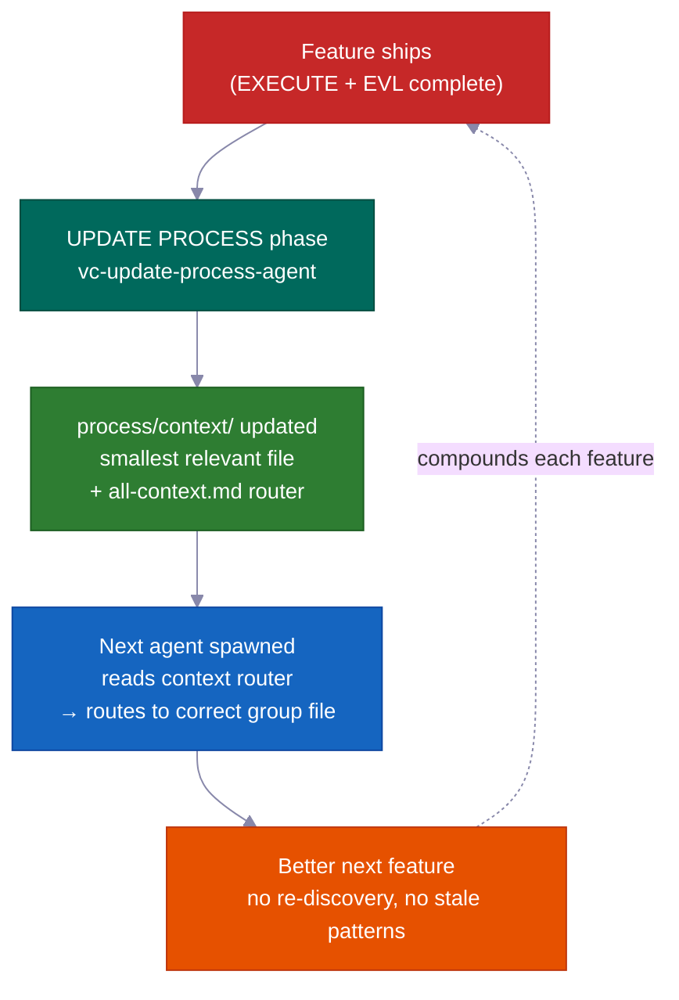

### 核となるメカニズム：ポータブルな共有メモリとしての`process/context/`

`process/context/`はトピックグループに整理された構造化されたナレッジを保持します——アーキテクチャの決定、コーディング規約、デプロイ手順、テストパターン、インフラの事実。チャット履歴とは異なり、このナレッジは：

- **すべてのワーカーエージェントに伝わります**——`vc-context-discovery`が起動された各エージェントをタスクに適した`all-{group}.md`ルーターに、そして最小の関連するディープファイルにルーティングします。リサーチエージェント、プランエージェント、コーディングエージェントがすべて同じ共有理解でスタートします
- **メモリリセットを生き延びます**——コンテキストウィンドウではなくディスクにあります；圧縮されたセッションはそれを失いません
- **ClaudeとCodexの両方で読めます**——`.agents/skills`は`.claude/skills/`へのショートカットリンクであり、同じコンテキストシステムが重複なく両方のエージェントに機能します

ルートルーター（`all-context.md`）がグループルーター（`all-{group}.md`）を指し、グループルーターが最小の関連するディープファイルにルーティングします。エージェントはルーターに従います——ファイルパスをハードコードしません。これはリネームやグループ分割にルーターの編集のみが必要で、コードベース全体の検索は不要になることを意味します。

```
process/context/
├── all-context.md                  ← ルートルーター（アーキテクチャ、スタック、パターン）
├── tests/all-tests.md              ← テストランナー、デバッグ、コマンド
├── container/all-container.md      ← Docker、デプロイ、インフラ手順
├── uxui/all-uxui.md                ← コンポーネント、デザイントークン、ビジュアル規約
└── {domain}/all-{domain}.md        ← 3つ以上の永続ドキュメントがあるドメイン（自動昇格）
```

<br>

### 自己改善する理由（単なる「リビングドキュメント」ではない）

「リビングドキュメント」というフレーズは通常「更新し続けるつもりだが大抵忘れるドキュメント」を意味します。このシステムは意図を機械的に強制します。

**UPDATE PROCESSフェーズは、終了する前にファイルごとのコンテキストレビューを必要とします。** `vc-update-process-agent`は、潜在的に影響を受けるすべてのコンテキストファイルをファイルごとに具体的な理由でレビューするまでフェーズを終了できません。「更新不要」は許可されます——しかしレビューした各ファイルを名前を挙げて理由を説明しなければなりません。曖昧な理由は拒否されます。チェックポイントは二値：レビューを記録するか、フェーズは終了しないかです。

完了した機能ごとのフルフィードバックループ：

| ステップ | 所有者 | 何が起きるか |
|------|-------|-------------|
| 1. git差分分析 | `vc-scout` | 変更されたファイル→影響を受けるコンテキストエリアをマッピング |
| 2. ファイルごとのレビュー | `vc-update-process-agent` | 各コンテキストファイルを名前を挙げ、更新または明示的な「変更なし＋理由」を述べる |
| 3. 更新の適用 | 並列ワーカーエージェント | 各エリアのコンテキストファイルを新しいパターン、決定、学びで更新 |
| 4. ルーティング検証 | `validate-context-discovery.mjs` | すべてのドキュメントがインデックスされ、ルーターが一貫していることを確認 |
| 5. 発見確認 | `validate-all-context.mjs` | `all-context.md`とグループルーターがディスク上の現在のファイルと一致することを確認 |

100番目の機能は最初の99で学んだすべてから恩恵を受けます——願望ではなく、機械的な保証として。

<br>

### 前進プレビュー：学びは後ろだけでなく前にも伝わる

すべてのフェーズレポートには、*次の*フェーズのエージェントのために書かれた`## Forward Preview`セクションがあります。グリーンを維持するための正確なコマンド、依存関係の変更、フェーズ途中に見つかったファイルスコープの変更を提供します。フェーズ3を引き継ぐエージェントはフェーズ2の出力を再読して何が重要かを推測する必要はありません。集中したブリーフが手渡されます。

これはコンテキストドキュメントとは異なります：コンテキストドキュメントは*永続的な*ナレッジ（機能をまたいで真実であり続ける決定）を保持し；Forward Previewは*一時的な*ハンドオフ状態（次の作業セッションが今すぐ知る必要があること）を保持します。

<br>

### バリデータースイートが腐敗を防ぐ

永続的なナレッジは誰も確認しないと古くなります。キットはすべてのフェーズクローズアウトの一部として実行されるバリデーターを提供します：

| バリデーター | 何を検出するか |
|-----------|----------------|
| `validate-context-discovery.mjs` | どのルーターにもインデックスされていないドキュメント；壊れたリンク；欠落したフロントマター |
| `validate-all-context.mjs` | `all-context.md`がディスク上の実際のファイルと非同期 |
| `validate-skill-keywords.mjs` | `trigger_keywords`または`layer`フィールドが欠落しているスキル（ルーティングStep 0を壊す） |
| `validate-protocol-discovery.mjs` | `process/development-protocols/`内のプロトコルファイルに発見フロントマターが欠落 |

自動チェックのように実行されます——古いまたは孤立したドキュメントは失敗します。システムは自身の健全性を監視します。

<br>

### コンテキストグループは自己整理する

グループはトピックが3つ以上のドキュメントに達したとき、または単一のファイルが約800行を超えたときに自動的に作成されます。エージェントはルーターに従いパスをハードコードしません——新しいグループ（例：`process/context/billing/all-billing.md`）を追加するにはルーターの更新のみが必要で、billingに言及するすべてのエージェントへの変更は不要です。ルーターが安定した参照であり；その背後のファイルは自由に再整理できます。

> キットは実際のコードベース（`vc-setup`経由）からコンテキストグループをシードします。グループは固定リストではありません——パターンです。認証エリア、インフラエリア、支払いエリアはそれぞれプロジェクトの成長に合わせてファーストクラスのルーティング可能なナレッジになります。

---

## 🤖 中身の紹介

<br>

### 15エージェント

<details>
<summary>クリックでエージェントリストを展開</summary>

<br>

**コアワークフローエージェント**——RIPER-5フェーズごとに1つ（R → SPEC → I → P → V → E → UP）：

| エージェント | モデル | 役割 |
|-------|:---:|------|
| 🔍 `vc-research-agent` | sonnet | コードベース＋Webリサーチ、リードオンリー。矛盾追跡内蔵 |
| 📝 `vc-spec-agent` | sonnet | INNOVATE前のプロダクトディスカバリー要件ドキュメント。`*_SPEC_*.md`を生成 |
| 💡 `vc-innovate-agent` | sonnet | 2〜3のアプローチを比較。PLAN前に意思決定サマリー（選択・却下） |
| 📋 `vc-plan-agent` | sonnet | ショートカット防止ガード付きでプランを作成。「やり方はもう分かってる」はプランではない |
| ✅ `vc-validate-agent` | sonnet | プラン→合意済みチェックリストに変換（V1〜V7）。チェックポイント：PASS/CONDITIONAL/BLOCKED |
| ⚡ `vc-execute-agent` | **opus** | プラン通りに実装。フェーズレポートへの進捗ノート、逸脱プロトコル、セルフレビュー |
| ⏩ `vc-fast-mode-agent` | **opus** | EXECUTE前に必須の安全一時停止付きでR→S→I→P→Vを圧縮 |
| 🔧 `vc-quick-fix-agent` | **opus** | QUICK FIXレーン：1つの小さな低リスク編集＋スコープ内チェック、プラン/バリデート不要 |
| 🧠 `vc-update-process-agent` | sonnet | 7フェーズクローズアウト：アーカイブ、コンテキスト更新、古いアーティファクトスキャン、学びのキャプチャ |

<br>

**スペシャリストエージェント**——EXECUTE中またはスタンドアロンで呼び出し：

| エージェント | 役割 |
|-------|------|
| 🐛 `vc-debugger` | 仮説を立てる前に証拠を収集。対立仮説、除外チェーン、フィージビリティプローブ |
| 🧪 `vc-tester` | 変更対応。合意済みチェックリストのテストを再実行（EVL）。設定変更時に自動エスカレーション |
| 🔎 `vc-code-reviewer` | レビュー前にエッジケーススカウトを送る。N+1検出、認証パス確認 |
| ✨ `vc-code-simplifier` | 動作を変えずにわかりやすさのためにコードを整理 |
| 🎨 `vc-ui-ux-designer` | デザイン対応フロントエンド。ビルド中にリサーチワーカーを起動可能 |
| 📦 `vc-git-manager` | `touched_files`から論理的なコミットに分割。不明なファイルを拒否 |

</details>

<br>

### 33スキル（自動発見）

<details>
<summary>クリックでスキルリストを展開（20コントラクト＋13ヘルパー）</summary>

<br>

**📜 コントラクトスキル（20）**——アーティファクトを所有：`vc-generate-plan` · `vc-generate-context` · `vc-generate-spec` · `vc-generate-closeout` · `vc-generate-phase-program` · `vc-audit-context` · `vc-audit-plans` · `vc-audit-vc` · `vc-update` · `vc-publish` · `vc-feasibility-test` · `vc-risk-evidence-pack` · `vc-test-coverage-plan` · `vc-validate-findings` · `vc-autoresearch` · `vc-intent-clarify` · `vc-autopilot` · `vc-agent-strategy-compare` · `vc-plan-discovery` · `vc-context-discovery`

**🛠️ ヘルパースキル（13）**——エージェントの動き方を改善：`vc-review-situation` · `vc-sequential-thinking` · `vc-problem-solving` · `vc-scout` · `vc-debug` · `vc-docs-seeker` · `vc-frontend-design` · `vc-agent-browser` · `vc-web-testing` · `vc-setup` · `vc-predict` · `vc-scenario` · `vc-security`

</details>

> **⚠️ 命名ルール：** 独自のスキルやエージェントに`vc-`プレフィックスを**使用しないでください**——そのネームスペースはキット提供ファイル用に予約されており、古いファイル削除ガードが`.claude/skills/`と`.claude/agents/`下のあらゆる`vc-*`パスをキット所有として扱います。代わりに`my-`、`team-`、または`proj-`を使用してください。

<br>

### 🪝 10のフック

| フック | 何をするか |
|------|-------------|
| 🔐 `privacy-block.cjs` | `.env`、クレデンシャル、SSHキーの読み取りをブロック。明示的な承認が必要 |
| 🚫 `scout-block.cjs` | `node_modules/`、`dist/`への侵入を防止。gitignore構文の`.ckignore` |
| 🧠 `session-init.cjs` | スタックを検出し、envを注入し、コンパクション後に承認ゲートを復元 |
| 💉 `subagent-init.cjs` | すべてのサブエージェントにコンパクトなコンテキストブロックを注入 |
| ✨ `post-edit-simplify-reminder.cjs` | 5回以上の編集後、シンプリファイアーの実行を促す（ノンブロッキング、スロットリング付き） |
| 📛 `descriptive-name.cjs` | すべてのWriteに言語対応のファイル命名規約を適用 |
| 📊 `session-state.cjs` | セッションメトリクス＋トークン認識 |
| 📋 `post-write-plan-check.mjs` | `*_PLAN_*.md`へのすべてのWriteでプランアーティファクト構造を検証 |
| 🧹 `post-commit-lint.mjs` | すべての`git commit`でconventional-commitsプレフィックスを確認 |
| 🔍 `stop-validator-sweep.cjs` | セッション停止時にコアハーネスバリデーターを実行 |

<br>

**すべての配置場所：**

```text
your-project/
├── .claude/{agents,skills,hooks}/   # 🤖 15エージェント · ⚡ 33スキル · 🪝 10フック
├── .codex/agents/                   # 🔄 Codex用ミラー
├── .agents/skills -> .claude/skills # 🔗 Codex発見用シンボリックリンク
├── CLAUDE.md · AGENTS.md            # 📋 オーケストレーター設定＋クロスツールレジストリ
└── process/
    ├── context/                     # 🧠 自動ルーティングされるナレッジドメイン
    ├── general-plans/               # 📋 横断的なプラン＋タスクフォルダー
    ├── features/                    # 🏷️ フィーチャースコープのライフサイクルフォルダー
    └── development-protocols/       # 📜 22の共有ワークフロードキュメント
```

---

## ⚡ Quick Fix + Fast Mode

フルRIPER-5プロセスが仕事に対して過剰な場合の2つの軽量オプション：

<table>
<tr>
<td width="50%" valign="top">
<h1>🔧</h1>
<strong>Quick Fix</strong> — <code>"quick fix: …"</code><br><br>
単純な1行より大きく、「プランが必要」より小さい変更。リードエージェントがリードオンリーでスカウト→1行の確認→<code>vc-quick-fix-agent</code>を起動して編集＋触れたファイルのみのスコープ内チェック。<strong>プランなし、合意済みチェックリストなし、EVLなし。</strong>
<br><br>
<sub>変更がスキーマ、認証、API、課金、またはマイグレーションサーフェスに触れた場合は即座にキャンセル——その場合はフルRESEARCHにルーティングされます。</sub>
</td>
<td width="50%" valign="top">
<h1>⏩</h1>
<strong>Fast Mode</strong> — <code>"ENTER FAST MODE - …"</code><br><br>
RESEARCH＋SPEC＋INNOVATE＋PLAN＋VALIDATEを1パスに圧縮します——しかし**プランを書き、合意済みチェックリストを書き、EXECUTE前に一時停止します。**
<br><br>
<sub>プレーンFast Modeでは、VALIDATE後に一時停止があります——あなたがレビューして「ENTER EXECUTE MODE」と言います。<code>autopilot fast: [task]</code>を使えば一時停止を取り除き、止まらずに最後まで実行できます。</sub>
</td>
</tr>
</table>

---

## 🔄 キットライフサイクル：Install · Setup · Update · Publish

| コマンド | 何をするか | いつ |
|---|---|---|
| `curl … install.sh \| bash` | あなたのファイルを上書きせずにキットファイルを同期；新規かアップグレードかを自動検出してルーティング | 初回インストール＋すべてのアップグレード |
| **Run vc-setup** | スタックを検出し、`process/`をスキャフォルド、コードベースをディープスキャン、実際のコンテキストを入力 | 新規インストール後 |
| **Run vc-update** | 精密な差分を計算し、何が変わるかを表示し、OKを待つ；古いフォーマットのプラン/フォルダーをデータ損失ゼロで移行 | すべてのアップグレード時 |
| **Run vc-publish** *（メンテナー向け）* | ハーネスの変更をキットリポジトリに公開 | キット自体へのコントリビュート時 |

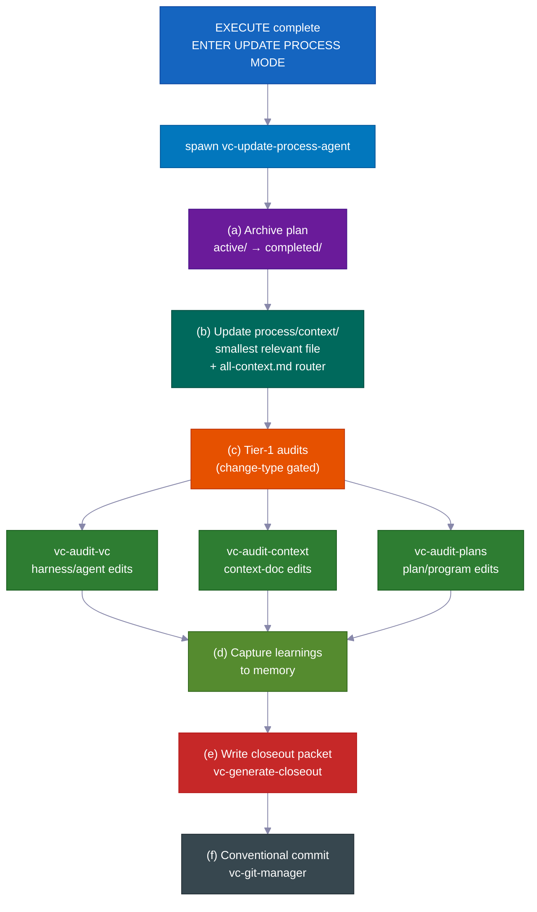

> 💡 `vc-update`はプレビュー差分を表示してOKを待ちます。`process/`ディレクトリとプロジェクト固有のコンテンツは**決して**黙って変更されません。インストールを再実行しても安全に2回実行できます。

---

## 💡 うまく動く理由

多くの小さくスマートなデフォルトが積み重なって、手間が減り、コストが下がります。

- **各ロールは必要なツールだけを持ちます。** プランニング中、エージェントは文字通りコードを編集できません——そのツールがオフになっています。これはエージェントがプランが承認される前に先走って変更するのを防ぎます。システムが単純にそれを許しません。

- **プレミアムAIモデルを本当に重要な場所だけに使います。** コード作成には最高モデルを使用。プランニング、リサーチ、レビュー、チェックはすべてより安価で速いモデルを使用します。結果：すべてに最高モデルを使う場合と比べて約60〜70%のコスト削減——重要な作業の品質は失わずに。

- **構築前にリスクのある推測をテストします。** エージェントが何かが動作するか確信が持てない場合——特定のAPI動作、ライブラリの機能、インフラの前提——最初に小さな実際の実験を実行します。結果は明確です：動作する、動作しない、または不明。その判定と平易な英語のノートがプランに直接フィードバックされます。エージェントは間違った前提の上に何時間も費やしません。

- **きれいで意味のあるセーブポイント。** 変更は明確なメッセージを持つ論理的なクリーンなチャンクでコミットされます——自動的に。履歴は読みやすく、1つずつ取り消しやすいです。

- **役立つ自動リマインダー。** 小さな組み込みヘルパーが、変更されたファイルに正しいチェックを実行すること、コードをシンプルに保つこと、適切なコミットメッセージを書くことなどを促します。あなたが監視しなくても品質が高く保たれます。

- **自己改善ループを単独で実行できます。** プランチェックとテスト修正を駆動する同じ「問題を見つけ、修正し、繰り返す」エンジンが、どんな雑然とした領域——スペック、ドキュメント、テスト、エラーリスト——にもスタンドアロンツールとして機能します。それを使うためにフルの機能ビルドは必要ありません。

- **ワークフロールールが実際に動作することの組み込みの証明。** キットには独自のテストスイートが付属します：ワークフロールールが正しく動作することを証明する既知の良い例と悪い例のセット。システムが自分自身を確認します。ガードレールがオンになっていると信頼する必要はありません——チェックを実行して確認できます。

---

## コントリビュート

コントリビューションを歓迎します！ガイドラインは[CONTRIBUTING.md](CONTRIBUTING.md)をご覧ください。

<br>

**クイックリンク：**

- 🐛 [バグを報告する](https://github.com/withkynam/vibecode-pro-max-kit/issues/new?template=1.bug_report.yml)
- 💡 [機能をリクエストする](https://github.com/withkynam/vibecode-pro-max-kit/issues/new?template=2.feature_request.yml)
- ⚡ [スキルを提出する](https://github.com/withkynam/vibecode-pro-max-kit/issues/new?template=3.skill_submission.yml)
- 🌐 [翻訳を追加する](https://github.com/withkynam/vibecode-pro-max-kit/issues/new?template=5.translation.yml)

<br>

<a href="https://github.com/withkynam/vibecode-pro-max-kit/graphs/contributors">
  
</a>

<br>

### 🙏 クレジット

vibecode-pro-max-kitはスペック駆動の開発フレームワークと自己改善型コンテキスト整理に焦点を当て、80以上のスキルで肥大化させません。ツールは少なく、構造を重視。

---

## ⭐ Star History

<a href="https://star-history.com/#withkynam/vibecode-pro-max-kit&Date">
 <picture>
   <source media="(prefers-color-scheme: dark)" srcset="https://api.star-history.com/svg?repos=withkynam/vibecode-pro-max-kit&type=Date&theme=dark" />
   <source media="(prefers-color-scheme: light)" srcset="https://api.star-history.com/svg?repos=withkynam/vibecode-pro-max-kit&type=Date" />
   
 </picture>
</a>

---

## 📄 ライセンス

MIT
