<p align="center">
  <a href="../../README.md">English</a> |
  <a href="README.zh-CN.md">简体中文</a> |
  <a href="README.ja-JP.md">日本語</a> |
  <strong>한국어</strong> |
  <a href="README.vi-VN.md">Tiếng Việt</a> |
  <a href="README.pt-BR.md">Português</a> |
  <a href="README.es.md">Español</a> |
  <a href="README.de.md">Deutsch</a> |
  <a href="README.fr.md">Français</a> |
  <a href="README.hi.md">हिंदी</a>
</p>

<div align="center">

<a href="https://flowser.ai">
  
</a>

*세계적 수준의 엔지니어들이 바이브코더를 위해 만들었어요*<br>
*[flowser.ai](https://flowser.ai) — GTM을 위한 컴퓨터 기반 AI 에이전트*

<br>

# vibecode-pro-max-kit

<br>

<p align="center">
  
  <br><br>
  <em>"전집중 — 스펙의 호흡, 열 번째 형: 바이브의 흐름은 절대 끊기지 않는다."</em><br>
  <strong>— 카마도 탄지로</strong>
</p>

*이걸 어떤 프로젝트에든 넣으세요. AI 에이전트가 플랜 우선 개발 프로세스를 갖추게 돼요 — 7단계 게이트, 자가 치유 루프, 그리고 처음부터 끝까지 자리를 잃지 않고 달리는 오토파일럿.*

<table align="center">
<tr>
<td width="50%" valign="top"><strong>📦 명령 한 줄로 설치</strong><br><code>curl</code> 한 줄로 어떤 프로젝트에든 설치돼요. 신규 vs. 재설치를 감지하고 파일을 덮어쓰지 않아요.</td>
<td width="50%" valign="top"><strong>🌐 어디서든 동작</strong><br>어떤 기술 스택, 어떤 언어, 어떤 AI 코딩 에이전트에서도 — Claude Code, Codex, Cursor, Windsurf, Copilot 등.</td>
</tr>
<tr>
<td valign="top"><strong>🧭 RIPER-5 플랜 우선 워크플로우</strong><br>7단계 게이트 (Research → Spec → Innovate → Plan → Validate → Execute → Update-Process) 가 에이전트가 바로 코딩으로 뛰어드는 걸 막아요.</td>
<td valign="top"><strong>🚀 오토파일럿 모드 (quick / fast / full)</strong><br>한 마디로 어느 단계에서든 핸즈프리 실행을 시작해요. 세 가지 레인이 위험도에 맞는 절차를 적용해요.</td>
</tr>
<tr>
<td valign="top"><strong>🎯 <code>/goal</code> — 완료까지 달리는 토큰</strong><br>복붙 가능한 블록 하나로 에이전트가 단계마다 멈추지 않고 계속 실행되고, 새 세션에서도 이어서 재개돼요.</td>
<td valign="top"><strong>🔁 PVL + EVL 자가 치유 루프</strong><br>플랜 검사-수정, 테스트 검사-수정 루프가 문제를 찾고, 고치고, 다시 검사해요 — 각각 최대 10회.</td>
</tr>
<tr>
<td valign="top"><strong>🔍 vc-autoresearch</strong><br>플랜, 테스트, 스펙, 문서, 이벨에 적용할 수 있는 재사용 가능한 gaps 찾기 → 수정 → 반복 루프.</td>
<td valign="top"><strong>🧪 실현 가능성 프로브</strong><br>어떤 설계 방식을 확정하기 전에 만들기 전에 테스트하는 VIABLE / NOT-VIABLE 판정.</td>
</tr>
<tr>
<td valign="top"><strong>🎛️ 스마트 전략 선택기</strong><br>각 단계 전에 에이전트 하나 vs. 여럿 vs. 팀을 — 비용 추정과 함께 — 따져보고 가장 저렴하게 맞는 걸 선택해요.</td>
<td valign="top"><strong>🧮 스마트 모델 사용</strong><br>비싼 모델은 코드 작성에만 써요. 그 외 모든 작업은 저렴한 모델이 해요. 비용은 낮고, 품질은 동일.</td>
</tr>
<tr>
<td valign="top"><strong>🤔 의도 명확화</strong><br>요청이 모호하면 에이전트가 추측하고 엉뚱한 걸 만들기 전에 몇 가지 핵심 질문을 먼저 해요.</td>
<td valign="top"><strong>🛡️ 36개 검증기</strong><br>의견이 아닌 기계적 정확성 검사 — 킷 자체 구조를 지키고 출시 전 드리프트를 잡아요.</td>
</tr>
<tr>
<td valign="top"><strong>🏗️ 페이즈 프로그램</strong><br>대형 프로젝트를 독립 페이즈로 나누고 사이에 품질 게이트를 두어, 큰 작업이 무너지지 않아요.</td>
<td valign="top"><strong>🔀 스스로 재편성하는 프로그램</strong><br>배우면서 에이전트가 새 페이즈를 삽입하고, 작업을 재순서하고, 막힌 단계를 건너뛰어요 — 플랜이 실시간으로 적응해요.</td>
</tr>
<tr>
<td valign="top"><strong>🧠 자리를 절대 잃지 않아요</strong><br>매 단계마다 진행 상황을 디스크에 기록해요. 메모리가 리셋되어도 실행이 살아남아 정확히 멈춘 곳에서 재개해요.</td>
<td valign="top"><strong>📚 자기 개선 프로젝트 메모리</strong><br>설치 시 코드베이스를 학습하고, 기능이 출시될 때마다 공유 노트를 최신 상태로 유지해요. 문서가 낡지 않아요.</td>
</tr>
<tr>
<td valign="top"><strong>⚡ Quick Fix + Fast Mode</strong><br>소규모 변경을 위한 가벼운 레인은 무거운 절차를 건너뛰어요. 한 줄짜리 수정은 한 줄짜리 수정으로 남아요.</td>
<td valign="top"><strong>🧱 레이어로 정리된 자동 탐색 스킬</strong><br>스킬이 명확한 레이어로 정리되고 자동으로 탐색돼요 — 에이전트가 단계에 맞는 도구를 항상 찾아요.</td>
</tr>
<tr>
<td valign="top"><strong>🤖 15 에이전트 · 33 스킬 · 10 훅</strong><br>전문 에이전트, 재사용 가능한 스킬, 안전 훅으로 구성된 완전한 팀이 기본으로 연결돼 있어요.</td>
<td valign="top"><strong>🔄 킷 전체 라이프사이클</strong><br>설치, 설정, 업데이트, 게시가 각각 명령 하나씩 — 모든 프로젝트를 안전하게 최신 킷으로 유지해요.</td>
</tr>
<tr>
<td valign="top"><strong>📝 SPEC — 평이한 언어로 하는 승인</strong><br>어떤 설계 전에도, 만들 것을 간단한 사용자 스토리로 서술해요 — 오해를 잡는 가장 저렴한 지점이에요.</td>
<td valign="top"><strong>🎯 항상 의도를 확인해요</strong><br>이후 모든 단계가 SPEC에 대조해요: 지금 만들고 있는 게 정말 요청한 것인가요?</td>
</tr>
</table>

<p>
  <a href="https://github.com/withkynam/vibecode-pro-max-kit/stargazers"></a>
  <a href="https://github.com/withkynam/vibecode-pro-max-kit/network/members"></a>
  <a href="LICENSE"></a>
  <a href="https://github.com/withkynam/vibecode-pro-max-kit/graphs/contributors"></a>
  <a href="https://github.com/withkynam/vibecode-pro-max-kit/actions/workflows/validate.yml"></a>
  <a href="CHANGELOG.md"></a>
  
  
  
  
</p>

<p>
  <strong>가장 심플하고, 유연하고, 팀 친화적인 코딩 킷</strong><br><br>
  <a href="https://github.com/anthropics/claude-code"></a>&nbsp;
  <a href="https://github.com/openai/codex"></a>&nbsp;
  <a href="https://cursor.com"></a>&nbsp;
  <a href="https://windsurf.com"></a><br>
  <a href="https://github.com/google-gemini/gemini-cli"></a>&nbsp;
  <a href="https://github.com/opencode-ai/opencode"></a>&nbsp;
  <a href="https://github.com/features/copilot"></a>
</p>

<p>
  <em>어떤 기술 스택, 어떤 언어, 어떤 프로젝트에서도 동작해요</em><br><br>
  <picture>
    <source media="(prefers-color-scheme: dark)" srcset="https://skillicons.dev/icons?i=ts%2Cjs%2Creact%2Cnextjs%2Cvue%2Cnuxt%2Csvelte%2Cangular%2Cnodejs%2Cexpress%2Cbun%2Cpython%2Cdjango%2Cflask%2Cfastapi&theme=dark&perline=15" />
    <source media="(prefers-color-scheme: light)" srcset="https://skillicons.dev/icons?i=ts%2Cjs%2Creact%2Cnextjs%2Cvue%2Cnuxt%2Csvelte%2Cangular%2Cnodejs%2Cexpress%2Cbun%2Cpython%2Cdjango%2Cflask%2Cfastapi&theme=light&perline=15" />
    
  </picture>
  <br>
  <picture>
    <source media="(prefers-color-scheme: dark)" srcset="https://skillicons.dev/icons?i=ruby%2Crails%2Cgo%2Crust%2Cjava%2Cspring%2Ckotlin%2Cswift%2Cphp%2Claravel%2Ccs%2Cdotnet%2Celixir%2Cgraphql%2Cprisma&theme=dark&perline=15" />
    <source media="(prefers-color-scheme: light)" srcset="https://skillicons.dev/icons?i=ruby%2Crails%2Cgo%2Crust%2Cjava%2Cspring%2Ckotlin%2Cswift%2Cphp%2Claravel%2Ccs%2Cdotnet%2Celixir%2Cgraphql%2Cprisma&theme=light&perline=15" />
    
  </picture>
  <br>
  <picture>
    <source media="(prefers-color-scheme: dark)" srcset="https://skillicons.dev/icons?i=supabase%2Cfirebase%2Cpostgres%2Cmongodb%2Credis%2Cdocker%2Ckubernetes%2Caws%2Cgcp%2Cazure%2Cvercel%2Ccloudflare%2Ctailwind%2Celectron&theme=dark&perline=15" />
    <source media="(prefers-color-scheme: light)" srcset="https://skillicons.dev/icons?i=supabase%2Cfirebase%2Cpostgres%2Cmongodb%2Credis%2Cdocker%2Ckubernetes%2Caws%2Cgcp%2Cazure%2Cvercel%2Ccloudflare%2Ctailwind%2Celectron&theme=light&perline=15" />
    
  </picture>
  <br>
  <p><em>단순 장식이 아닙니다. <code>vc-setup</code>을 실행하면 에이전트가 코드베이스를 스캔하고,<br>
  스택을 감지하여 모든 스킬이 작동 전에 읽는 프로젝트 전용 컨텍스트 그룹을 구축합니다.<br>
  다른 하네스는 에이전트를 특정 언어에 고정합니다——<code>rust-review-agent</code>, <code>python-linter</code>——다른 곳에서는 쓸모없습니다.<br>
  이 킷은 위의 어떤 조합에도 적응하고 기능을 ship할수록 지식을 축적합니다.</em></p>
</p>

</div>

---

## ⚡ 시작하기 — 명령 한 줄, 30초

> **사전 요건:** Node.js ≥ 22, git, bash (macOS / Linux / WSL; Alpine이라면: `apk add bash`).

**명령은 하나뿐이고, 모든 사람에게 동일해요.** 프로젝트 폴더 안에서 실행하세요. 신규 또는 재방문 사용자를 감지하고, 파일을 덮어쓰지 않고 안전하게 설치한 뒤 *정확히 다음에 할 말을 알려줘요.*

```bash
curl -fsSL https://raw.githubusercontent.com/withkynam/vibecode-pro-max-kit/main/install.sh | bash
```

끝나면 두 메시지 중 하나를 출력해요 — **출력 하단을 읽고 그대로 하세요:**

<table>
<tr>
<td width="50%" valign="top">
<h3>🆕 새 프로젝트</h3>
설치기가 하네스를 감지하지 못하고 출력해요:
<br><br>
<code>Next: Run: claude → Say: "Run vc-setup"</code>
<br><br>
<strong>→ 에이전트를 열고 <code>Run vc-setup</code>이라고 말하세요</strong>
<br><br>
<sub>vc-setup이 기술 스택을 감지하고, <code>process/</code> 폴더를 만들고, 코드베이스를 스캔해서 실제 아키텍처, 컨벤션, 테스트 명령을 채워요 — 체크리스트가 아니라 진짜 대화예요.</sub>
</td>
<td width="50%" valign="top">
<h3>🔄 기존 하네스 (업그레이드)</h3>
설치기가 이전 설치를 감지하고 출력해요:
<br><br>
<code>Next (upgrade detected): Run: claude → Say: "Run vc-update"</code>
<br><br>
<strong>→ 에이전트를 열고 <code>Run vc-update</code>라고 말하세요</strong>
<br><br>
<sub>vc-update가 최신 버전을 가져오고, 구형 포맷의 플랜이나 폴더를 발견하면 <strong>데이터 손실 없이</strong> 마이그레이션할 복붙 프롬프트를 줘요. <code>process/</code>는 절대 건드리지 않아요.</sub>
</td>
</tr>
</table>

> 💡 **명령을 추측할 필요가 없어요.** `install.sh`가 라우팅해줘요: 신규 → `vc-setup`, 업그레이드 → `vc-update`. 설치를 다시 실행해도 항상 안전해요 — 아무것도 망가뜨리지 않아요. **Codex 사용자:** 채팅에서 말하는 대신 `/vc-setup` (또는 `/vc-update`)을 실행하세요.

<br>

<details>
<summary><strong>📦 설치가 디스크에 올리는 것들 (비파괴적)</strong></summary>

<br>

```
your-project/
├── .claude/
│   ├── agents/              # 🤖 15개 에이전트 정의 (.md)
│   ├── skills/              # ⚡ 33개 스킬 (각각 SKILL.md가 있는 디렉토리)
│   └── hooks/               # 🪝 10개 라이프사이클 훅 (.cjs / .mjs)
├── .codex/agents/           # 🔄 Codex용 미러링된 에이전트
├── .agents/skills →         # 🔗 .claude/skills 심볼릭 링크 (Codex 탐색)
├── CLAUDE.md                # 📋 오케스트레이터 + 라우팅 규칙
├── AGENTS.md                # 📖 에이전트 + 스킬 레지스트리 (크로스 툴)
└── process/
    └── development-protocols/  # 📜 22개 공유 워크플로우 문서 (install이 씨앗 파일 생성)
                                #    context/, plans, features → vc-setup이 구축
```

- **비파괴적.** 기존 `.claude/skills/`, `.claude/agents/`, `process/`, `settings.json`은 절대 삭제되지 않아요. 킷 소유 파일만 작성 또는 업데이트돼요.
- **기존 설정이 있다면?** `.vibecode-backup/`에 백업되고, 설치 후 `settings.json`이 복원돼요.
- **기존 `CLAUDE.md`가 있다면?** `CLAUDE.md.pre-vibecode`로 백업돼요.
- **기존 `process/`가 있다면?** install은 절대 건드리지 않아요 — `vc-setup` / `vc-update`가 대화식으로 마이그레이션해줘요.

> **최초 설치 주의사항:** 이름이 `vc-`로 시작하는 커스텀 스킬/에이전트가 있고 *install을 실행한 적이 없다면*, 오래된 파일 제거 단계에서 플래그가 생길 수 있어요. 설치 후 `ls .claude/skills/ .claude/agents/`로 확인하세요. 이걸 완전히 피하려면 직접 추가한 것에 `vc-` 대신 `my-`, `team-`, `proj-` 접두사를 사용하세요.

</details>

<details>
<summary><strong>🤖 에이전트에서 설정을 진행하고 싶다면? (전체 프롬프트)</strong></summary>

<br>

> **프로젝트 폴더를 작업 디렉토리로 해서** Claude Code 또는 Codex를 열고 아래를 붙여넣으세요:

```
First, install the vibecode-pro-max-kit agent harness by running this command:

curl -fsSL https://raw.githubusercontent.com/withkynam/vibecode-pro-max-kit/main/install.sh | bash

After install completes, run vc-setup and follow the full interactive flow:

1. DETECT — Read package.json (or go.mod, Cargo.toml, pyproject.toml, etc.), detect my
   stack: framework, package manager, monorepo structure, test framework, database, auth.
   Also check for any existing .claude/, process/, or context files.
2. SHOW ME WHAT YOU FOUND — Summarize detection and wait for me to confirm. If this is an
   existing project, tell me what looks good vs what could be improved.
3. ASK ME ABOUT THE PROJECT — Have a real conversation. Ask follow-ups, probe anything
   vague, keep going until you genuinely understand it. Summarize back and confirm.
4. SCAFFOLD — Create the process/ directory. If process/ already exists, show me the plan
   and wait for approval. Never silently move or delete my files.
5. STUDY — Deep-scan and populate process/context/all-context.md with REAL content: repo
   structure, stack + versions, patterns, import aliases, env vars, routes, schema, tests.
   No placeholder text.
6. VALIDATE — Run all validation checks to confirm everything is wired correctly.

Rules: read and preserve good existing context; show me a summary before each major change
and wait for my OK; never create empty placeholder files; ask before reorganizing.
```

</details>

<details>
<summary>목차</summary>

- [한눈에 보기](#-한눈에-보기) · [문제점](#-문제점) · [해결책](#️-해결책)
- [바이브 코딩 혁명](#바이브-코딩-혁명) · [누구를 위한 건가요](#누구를-위한-건가요) · [비교 분석](#비교-분석) · [차별점](#-차별점)
- [오케스트레이터 작동 방식](#-작동-방식--오케스트레이터) · [RIPER-5 라이프사이클](#-riper-5-라이프사이클) · [의도 명확화](#-의도-명확화)
- [두 가지 품질 루프 (PVL + EVL)](#-두-가지-품질-루프--pvl--evl) · [전략 비교 + 모델 정책](#-전략-비교--모델-정책) · [오토파일럿 모드](#-오토파일럿-모드--핸즈프리-riper-5) · [실현 가능성 프로브 + 검증기](#-실현-가능성-프로브--검증기-안전망)
- [내장 안전 시스템](#️-내장-안전-시스템) · [구현 전 사전 분석](#-구현-전-사전-분석) · [품질 파이프라인](#-품질-파이프라인--실행에-내장)
- [플랜 라이프사이클](#-플랜-라이프사이클) · [페이즈 프로그램](#️-페이즈-프로그램--무너지지-않는-대형-프로젝트) · [컨텍스트 그룹](#-컨텍스트-그룹) · [기능 폴더](#-기능-폴더) · [스킬 레이어](#-스킬-레이어) · [자기 개선 메모리](#-자기-개선-프로젝트-메모리)
- [구성 요소](#-구성-요소) · [Quick Fix + Fast Mode](#-quick-fix--fast-mode) · [킷 라이프사이클](#-킷-라이프사이클-설치--설정--업데이트--게시) · [기여하기](#기여하기)

</details>

---

## 🎁 한눈에 보기

<table>
<tr>
<td align="center" width="25%" valign="top"><h1>🤖</h1><h3>15</h3><strong>에이전트</strong><br><sub>페이즈마다 하나 + 전문가 에이전트 6개</sub></td>
<td align="center" width="25%" valign="top"><h1>⚡</h1><h3>33</h3><strong>스킬</strong><br><sub>워크플로우 20개 + 헬퍼 13개, 키워드로 매칭</sub></td>
<td align="center" width="25%" valign="top"><h1>🪝</h1><h3>10</h3><strong>훅</strong><br><sub>안전 가드레일 + 자동 컨텍스트 로딩</sub></td>
<td align="center" width="25%" valign="top"><h1>📜</h1><h3>22</h3><strong>프로토콜</strong><br><sub>모든 에이전트가 따르는 공유 규칙</sub></td>
</tr>
<tr>
<td align="center" width="25%" valign="top"><h1>🛡️</h1><h3>36</h3><strong>검증기</strong><br><sub>출시 전 오류를 잡는 자동화 검사</sub></td>
<td align="center" width="25%" valign="top"><h1>🔧</h1><h3>7</h3><strong>도구</strong><br><sub>Claude Code · Codex · Cursor · Windsurf · Antigravity · OpenCode · Copilot</sub></td>
<td align="center" width="25%" valign="top"><h1>🌍</h1><h3>10</h3><strong>언어</strong><br><sub>EN · 中文 · 日本語 · 한국어 · VI · PT · DE · FR · ES · हिन्दी</sub></td>
<td align="center" width="25%" valign="top"><h1>⚡</h1><h3>30초</h3><strong>설치</strong><br><sub>명령 하나, 그다음은 에이전트가 안내해요</sub></td>
</tr>
<tr>
<td align="center" width="25%" valign="top"><h1>🛩️</h1><strong>오토파일럿</strong><br><sub>3개 레인 (quick / fast / full) — 어느 단계에서든 시작, 멈추지 않고 처음부터 끝까지</sub></td>
<td align="center" width="25%" valign="top"><h1>📌</h1><strong>/goal 블록</strong><br><sub>리셋 후에도 핸즈프리 실행을 세션 간에 재개하는 짧은 복붙 텍스트</sub></td>
<td align="center" width="25%" valign="top"><h1>🔁</h1><strong>vc-autoresearch</strong><br><sub>gaps 찾기 → 수정 → 반복 루프 (플랜, 테스트, 이벨에 공유)</sub></td>
<td align="center" width="25%" valign="top"><h1>🔬</h1><strong>실현 가능성 프로브</strong><br><sub>설계를 확정하기 전에 만들기 전에 테스트하는 VIABLE / NOT-VIABLE 판정</sub></td>
</tr>
</table>

---

## 🔥 문제점

Claude한테 "webhook 지원 추가해줘"라고 하면 바로 코드를 쓰기 시작해요. 아키텍처에 대한 질문도 없고, 기존 패턴 확인도 없고, 계획도 없어요. 코드베이스에 안 맞는 400줄짜리 코드를 받고, 고치느라 한 시간을 날리게 돼요.

**근데 이건 표면적인 문제일 뿐이에요.** 진짜 심각한 문제는 따로 있어요:

<table>
<tr>
<td width="50%" valign="top">
<h1>🧠</h1>
<strong>세션마다 컨텍스트가 사라져요</strong><br><br>
에이전트가 배운 걸 다 잊어버려요. 매번 같은 실수, 같은 질문. 메모리도 없고, 지식이 누적되지도 않아요.
</td>
<td width="50%" valign="top">
<h1>📄</h1>
<strong>문서가 순식간에 낡아져요</strong><br><br>
지난주에 훌륭한 컨텍스트 문서를 작성했는데 벌써 구식이에요. 코드베이스가 진화하면서 자동으로 업데이트해주는 게 아무것도 없어요.
</td>
</tr>
<tr>
<td width="50%" valign="top">
<h1>💥</h1>
<strong>큰 작업은 중간에 무너져요</strong><br><br>
컨텍스트 윈도우가 차고, 상태가 날아가고, 에이전트가 환각을 시작해요. 3시간째에 처음부터 다시 시작하게 돼요.
</td>
<td width="50%" valign="top">
<h1>🤝</h1>
<strong>스펙도 없고, 리뷰도 없고, 협업도 없어요</strong><br><br>
PM이 에이전트가 뭘 만들려는지 리뷰할 수가 없어요. 코드 작성 전에 공유하고, 논의하고, 승인할 수 있는 산출물이 없어요.
</td>
</tr>
<tr>
<td width="50%" valign="top">
<h1>🎭</h1>
<strong>아키텍처 결정이 환각이에요</strong><br><br>
에이전트가 다른 코드베이스에서 같은 문제를 어떻게 해결했는지 리서치하는 대신 패턴을 지어내요.
</td>
<td width="50%" valign="top">
<h1>🚀</h1>
<strong>"완료"를 검증하는 게 없어요</strong><br><br>
에이전트가 "모든 테스트 통과"라고 말하지만 — 독립적으로 다시 실행한 적이 없어요. 프로덕션에서 알게 돼요.
</td>
</tr>
</table>

**에이전트에 지능은 있지만 프로세스도 없고, 메모리도 없고, 팀과 협업할 방법도 없어요.** 개발자든, PM이든, 바이브 코딩을 이제 막 시작한 CEO든 — 이 문제는 모두에게 똑같이 찾아와요. 해결책도 같아요: **에이전트에게 진짜 개발 프로세스를 줘야 해요.**

---

## 🛠️ 해결책

이 킷은 프로젝트에 완전한 개발 시스템을 설치해요 — 그냥 `CLAUDE.md` 하나가 아니라, **15개의 전문 에이전트, 33개의 스킬, 10개의 훅, 22개의 프로토콜** — 에이전트가 **만들기 전에 이해하고, 출시 전에 증명하도록** 만드는 단계 잠금 워크플로우와 함께요.

<br>

<table>
<tr>
<td align="center" width="50%" valign="top"><h1>📋</h1><strong>플랜 우선 접근법</strong><br><br><sub>PM과 개발자가 코드 작성 전에 동일한 서면 플랜을 리뷰해요</sub></td>
<td align="center" width="50%" valign="top"><h1>🔄</h1><strong>자기 개선 지식</strong><br><sub>기능이 출시될 때마다 자동 업데이트 — 문서가 절대 낡지 않아요</sub></td>
</tr>
<tr>
<td align="center" width="50%" valign="top"><h1>⚡</h1><strong>핸즈프리 실행</strong><br><br><sub>세션 리셋에서도 살아남아요 — 몇 분이 아니라 몇 시간 동안 실행돼요</sub></td>
<td align="center" width="50%" valign="top"><h1>🧬</h1><strong>아키텍처 리서치</strong><br><br><sub>설계 결정 전에 실제 코드베이스를 연구해요</sub></td>
</tr>
<tr>
<td align="center" width="50%" valign="top"><h1>✅</h1><strong>두 가지 품질 검사</strong><br><br><sub>코딩 전에 플랜을 검사하고, 코딩 후에 테스트를 독립적으로 재실행해요</sub></td>
<td align="center" width="50%" valign="top"><h1>🧭</h1><strong>스마트 지식 라우팅</strong><br><br><sub>관련된 것만 로드해요 — 매번 전체 지식 베이스를 불러오지 않아요</sub></td>
</tr>
</table>

<br>

### 전체 RIPER-5 흐름 — 7단계, 모든 단계 게이트

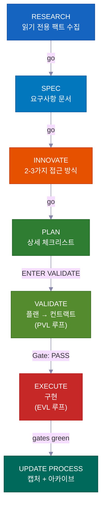

**대화형 모드**에서는 각 단계가 다음으로 넘어가기 전에 여러분의 "go"를 기다려요 — 모든 단계에서 제어권이 유지돼요. **오토파일럿 또는 /goal 모드**에서는 처음에 한 번 승인하면 시스템이 완료까지 스스로 달려요. 아래에 나열된 세 가지 하드 스톱에만 멈춰요. **VALIDATE**와 EXECUTE 후 재테스트는 선택이 아니에요 — 불량 작업이 출시되는 걸 막는 하드 게이트이며, 두 모드 모두 자동으로 실행돼요.

---

## 바이브 코딩 혁명

<div align="center">
<h3><em>"가장 핫한 프로그래밍 언어는 영어다."</em></h3>
<strong>— Andrej Karpathy</strong>
</div>

<br>

**바이브 코딩은 누가 소프트웨어를 만들 수 있는지를 바꿨어요. 플랜 우선 개발은 그들이 무엇을 출시할 수 있는지를 바꿔요.**

<table>
<tr>
<td align="center" width="50%"><h3>63%</h3><sub>바이브 코딩 사용자가 개발자가 <strong>아니에요</strong></sub></td>
<td align="center" width="50%"><h3>16.2M</h3><sub>전 세계 시민 개발자<br>(연간 38% 성장)</sub></td>
</tr>
<tr>
<td align="center" width="50%"><h3>$4.7B</h3><sub>바이브 코딩 시장<br>연간 38% 성장</sub></td>
<td align="center" width="50%"><h3>25%</h3><sub>YC W25 스타트업이 95%+ AI 생성 코드베이스를 보유</sub></td>
</tr>
</table>

대부분의 도구는 프로젝트를 시작하는 데 도움을 줘요. 이 킷은 프로젝트를 **완성**하는 데 도움을 줘요 — 팀이 리뷰할 수 있는 플랜, 절대 낡지 않는 지식, 실수를 출시 전에 잡아내는 안전 검사와 함께요.

---

## 누구를 위한 건가요?

<div align="center">
<h3><em>"중요한 건 누가 타이핑했느냐가 아니라 무엇이 출시됐느냐다."</em></h3>
<strong>— Garry Tan, YC</strong>
</div>

<br>

<table>
<tr>
<td width="50%" valign="top">
<h1>🧑‍💼</h1>
<strong>CEO / 창업자</strong><br><br>
<em>"인증, 빌링, 랜딩 페이지가 있는 SaaS를 만들어줘"</em><br><br>
에이전트가 스택을 리서치하고, 리뷰할 수 있는 아키텍처 플랜을 작성하고, 테스트와 함께 구현하고, 나중에 기술 공동창업자가 감사할 수 있도록 모든 결정을 기록해요.
</td>
<td width="50%" valign="top">
<h1>📊</h1>
<strong>프로덕트 매니저</strong><br><br>
<em>"MRR, 이탈률, 성장 지표를 보여주는 대시보드를 만들어줘"</em><br><br>
PRD 스타일의 SPEC을 생성하고, 코드 작성 전에 승인을 받고, 스펙대로 구현하고, 플랜을 검색 가능한 프로젝트 히스토리로 아카이브해요.
</td>
</tr>
<tr>
<td width="50%" valign="top">
<h1>🎨</h1>
<strong>디자이너</strong><br><br>
<em>"이 Figma 스크린샷을 픽셀 퍼펙트로 맞춰줘"</em><br><br>
디자인 인식 에이전트가 목업을 분석하고, 디자인 토큰으로 컴포넌트별로 구현하고, 시각적 비교 검사를 실행해요.
</td>
<td width="50%" valign="top">
<h1>⚙️</h1>
<strong>엔지니어</strong><br><br>
<em>"인증 모듈을 다운타임 없이 RBAC를 지원하도록 리팩토링해줘"</em><br><br>
현재 인증 코드와 다른 코드베이스가 RBAC를 어떻게 해결했는지 리서치하고, 영향 받을 파일을 표시한 마이그레이션 플랜을 작성하고, 롤백 노트와 함께 안전하게 구현해요.
</td>
</tr>
</table>

---

## 비교 분석

| 기능 | vibecode-pro-max-kit | Superpowers | GSD | gstack |
|---------|---------------------|-------------|-----|--------|
| 플랜 우선 라이프사이클 | 완전한 RIPER-5 (research → spec → innovate → plan → validate → execute → update) | 필수 워크플로우 | 컨텍스트 부패 해결 | 부분적 |
| 단계 잠금 안전성 | 에이전트 도구를 페이즈별로 제한 (읽기 전용 리서치, innovate에서 쓰기 없음) | 스킬 기반 제약 | 페이즈 분리 | 없음 |
| 품질 검사 루프 | **두 개** — PVL (플랜 검사) + EVL (독립적으로 테스트 재실행) | 스킬별 | 자동 없음 | 없음 |
| 멀티 툴 지원 | `AGENTS.md` + `SKILL.md` 오픈 표준으로 7개 도구 | Claude Code 플러그인 | 14개 런타임 | 1개 도구 |
| 자동 개선 지식 | 주제 그룹화 지식, 기능 완료마다 업데이트 | 플러그인 메모리 | 디스크 영속 상태 | 수동 |
| 팀 협업 | 공유 플랜, 스펙, 리뷰 파일 | 솔로 | 솔로 | 솔로 |
| 스킬 시스템 | 33개 자동 탐색, 모든 프롬프트에서 키워드 매칭 | 86개 조합형 스킬 | 메타 프롬프팅 | 23개 역할 도구 |
| 대형 멀티 페이즈 프로젝트 | Umbrella 플랜 + 페이즈별 내부 루프 + 리그레션 검사 | 단일 작업 | 단일 작업 | 단일 작업 |
| 핸즈프리 모드 | 오토파일럿 (3개 레인) + 상시 `/goal` 동의 | 수동 | 수동 | 수동 |
| 설치 | 30초 `curl` + 자동 라우팅 설정 | 플러그인 마켓플레이스 | npx 한 줄 | git clone |

> **런타임 범위에 대해:** GSD는 14개 런타임을 지원해요. 저희는 7개를 깊이 있게 지원해요 — 모든 플랫폼에 완전한 에이전트 하네스, 스킬 탐색, 라이프사이클 훅이 있어요. 범위 vs. 깊이: 여러분의 선택이에요.

---

## ⚡ 차별점

<table>
<tr>
<td width="50%" valign="top">
<h1>🔒</h1>
<strong>단계 잠금 도구 제한</strong><br><br>
에이전트가 리서치 중에는 말 그대로 코드를 <strong>작성할 수 없어요</strong>. RESEARCH는 읽기 전용, INNOVATE에는 쓰기 없음, PLAN/VALIDATE는 <code>process/</code>에만 써요. 제안이 아닌 <strong>실제 기능 제한</strong>이에요.
</td>
<td width="50%" valign="top">
<h1>🎯</h1>
<strong>리드 에이전트는 코드를 절대 건드리지 않아요</strong><br><br>
오케스트레이터는 라우팅하고, 모니터링하고, 루프를 구동해요 — <strong>소스 파일을 편집하거나 테스트를 직접 실행하지 않아요</strong>. 모든 편집과 테스트 실행은 전용 서브 에이전트 내에서 이루어져요. 숨겨진 작업은 없어요.
</td>
</tr>
<tr>
<td width="50%" valign="top">
<h1>🔍</h1>
<strong>자동 스킬 탐색</strong><br><br>
요청을 처리하기 전에 <strong>33개 스킬</strong>을 스캔하고 키워드를 매칭해요. "add webhook support"라고 하면 <code>vc-security</code> + <code>vc-scenario</code>가 자동으로 가져와져요.
</td>
<td width="50%" valign="top">
<h1>💾</h1>
<strong>세션 리셋에서 살아남아요</strong><br><br>
플랜, 리포트, 지식 문서, 학습 내용이 모두 디스크에 있어요. 시작 훅이 세션 리셋 후 승인 게이트를 복원해요. <strong>아무것도 잃지 않아요.</strong>
</td>
</tr>
<tr>
<td width="50%" valign="top">
<h1>🛡️</h1>
<strong>자체 감시 단계 가드</strong><br><br>
에이전트가 필수 단계를 건너뛰려 할 때 스스로 멈춰요: <em>"PHASE JUMPING PREVENTED."</em> <strong>지름길에 대한 내장 방어 장치</strong>예요.
</td>
<td width="50%" valign="top">
<h1>🔄</h1>
<strong>7개 AI 코딩 도구에서 동작해요</strong><br><br>
두 가지 오픈 표준 — <code>AGENTS.md</code>와 <code>SKILL.md</code> — 덕분에 <strong>어댑터도, 플러그인도 없어요.</strong> Claude Code에서 시작하고, Cursor로 전환하고, Codex에서 이어서 작업하세요.
</td>
</tr>
</table>

---

## 🧭 작동 방식 — 오케스트레이터

메인 세션은 작업자가 아닌 **코디네이터**(오케스트레이터라고 불러요)예요. 네 가지 일만 하고 그 외에는 하지 않아요:

```
여러분의 요청
  → 0단계: 스킬 탐색 (33개 스킬 스캔, 키워드 매칭, 후보 연결)
  → 의도 감지 (기능 / 버그 / 질문 / 리팩토링 / UI) + 모호성 점수
  → 적합한 에이전트에 새 컨텍스트 윈도우로 라우팅
  → 모니터링: 단계 준수, 상태 코드, 루프 구동
```

<table>
<tr>
<td width="50%" valign="top">
<h1>🧑‍✈️</h1>
<strong>위임하고, 절대 직접 구현하지 않아요</strong><br><br>
리서치 → <code>vc-research-agent</code>. 플랜 → <code>vc-plan-agent</code>. 코드 → <code>vc-execute-agent</code>. 오케스트레이터는 올바른 컨텍스트를 전달하고 기다려요 — 실제 작업은 직접 하지 않아요.
</td>
<td width="50%" valign="top">
<h1>🚫</h1>
<strong>숨겨진 실행 없음 — 절대로</strong><br><br>
합의된 체크리스트가 있는 플랜이 존재하는 순간, "ENTER EXECUTE MODE"는 <strong>항상</strong> <code>vc-execute-agent</code>를 실행해요. 한 줄 수정도 그것을 통해요. 테스트는 전용 <code>vc-tester</code> 안에서만 실행돼요. 변경 크기와 상관없이요.
</td>
</tr>
<tr>
<td width="50%" valign="top">
<h1>📨</h1>
<strong>명확한 상태 코드, 모호한 신호 없음</strong><br><br>
모든 서브 에이전트는 다음 중 하나로 끝나요: <code>DONE</code> · <code>DONE_WITH_CONCERNS</code> · <code>BLOCKED</code> · <code>NEEDS_CONTEXT</code>. 오케스트레이터는 블로커를 절대 무시하지 않고, 같은 막힌 접근법을 세 번 재시도하지 않아요.
</td>
<td width="50%" valign="top">
<h1>🔁</h1>
<strong>수정 루프를 구동해요</strong><br><br>
서브 에이전트는 한 번 실행되고, 결과를 보고하고, 멈춰요. 오케스트레이터만 재실행해요. PVL (플랜 검사-수정)과 EVL (테스트 검사-수정) 루프를 모두 구동하고 모든 추적을 소유해요.
</td>
</tr>
</table>

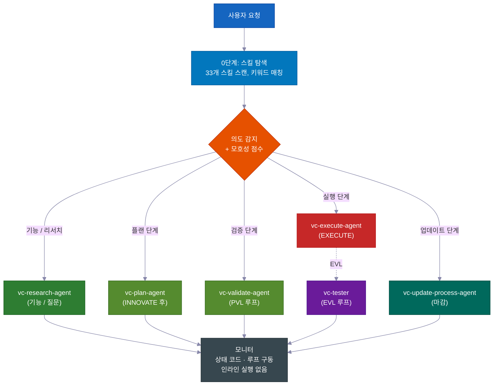

> **왜 중요한가:** 결정과 편집을 모두 할 수 있는 에이전트는 플랜을 건너뛸 방법을 찾아요. 오케스트레이터와 작업자(서브 에이전트)를 분리함으로써 프로세스가 구조적으로 정직해져요 — 코드를 작성하는 유일한 방법은 필수 단계를 통과하는 것이에요.

---

## 📊 RIPER-5 라이프사이클

| 단계 | 무슨 일이 일어나는지 | 에이전트 | 여러분이 할 말 |
|-------|-------------|-------|---------|
| 🔍 **RESEARCH** | 읽기 전용 팩트 수집 — 코드베이스 + 웹. 파일 수정 없음. | `vc-research-agent` | *(기능 요청 시 자동)* |
| 📝 **SPEC** | 프로덕트 디스커버리 요구사항 문서 — 사용자 스토리, 인수 기준, 범위 외 — **설계 전에 여러분의 검토를 위해**. | `vc-spec-agent` | `go` / `ENTER SPEC MODE` |
| 💡 **INNOVATE** | 트레이드오프와 함께 2-3가지 접근 방식 탐색. 결정 요약 (선택 + 거절 + 이유). | `vc-innovate-agent` | `go` |
| 📋 **PLAN** | 상세 스펙 작성: 터치포인트, 공개 컨트랙트, 건드릴 수 있는 파일, 검증 증거, 재개 핸드오프. | `vc-plan-agent` | `go` |
| ✅ **VALIDATE** | 플랜을 합의된 체크리스트로 변환 (V1–V7 체크포인트). 판정: **PASS / CONDITIONAL / BLOCKED**. PVL 루프 실행. | `vc-validate-agent` | `ENTER VALIDATE MODE` |
| ⚡ **EXECUTE** | 플랜을 *정확히* 구현. 페이즈 리포트에 진행 노트, 이탈 프로토콜, 셀프 리뷰. 그다음 EVL 루프가 체크포인트를 재실행해요. | `vc-execute-agent` | `ENTER EXECUTE MODE` |
| 🧠 **UPDATE PROCESS** | 학습 내용 캡처, 컨텍스트 업데이트, 플랜 아카이브, 마감 패킷 작성. | `vc-update-process-agent` | *(중요한 작업 후 권장)* |

> 📝 **SPEC이 자체 단계인 이유:** 대부분의 하네스는 "이해"에서 "설계"로 바로 넘어가요. 프로덕트 디스커버리 SPEC 단계를 삽입하면 에이전트가 **어떻게** 구현할지 논의하기 *전에* 여러분(또는 PM)이 **무엇을** 만들지를 — 간단한 사용자 스토리와 인수 기준으로 — 승인할 수 있어요. 오해를 잡는 가장 저렴한 지점이에요. (페이즈 프로그램의 내부 루프에서는 SPEC이 건너뛰어져요 — umbrella SPEC이 모든 페이즈를 관할해요.)
>
> **SPEC은 측정 기준이에요.** 예상 동작을 간단한 말로 서술해서 1분 안에 스캔할 수 있어요. 그 후의 모든 단계 — Innovate, Plan, Validate, Execute — 가 SPEC에 대조하며 같은 질문을 해요: *지금 만들고 있는 게 정말 요청한 것인가요?* 작업이 흐트러지기 시작할 때 SPEC이 잡아줘요.

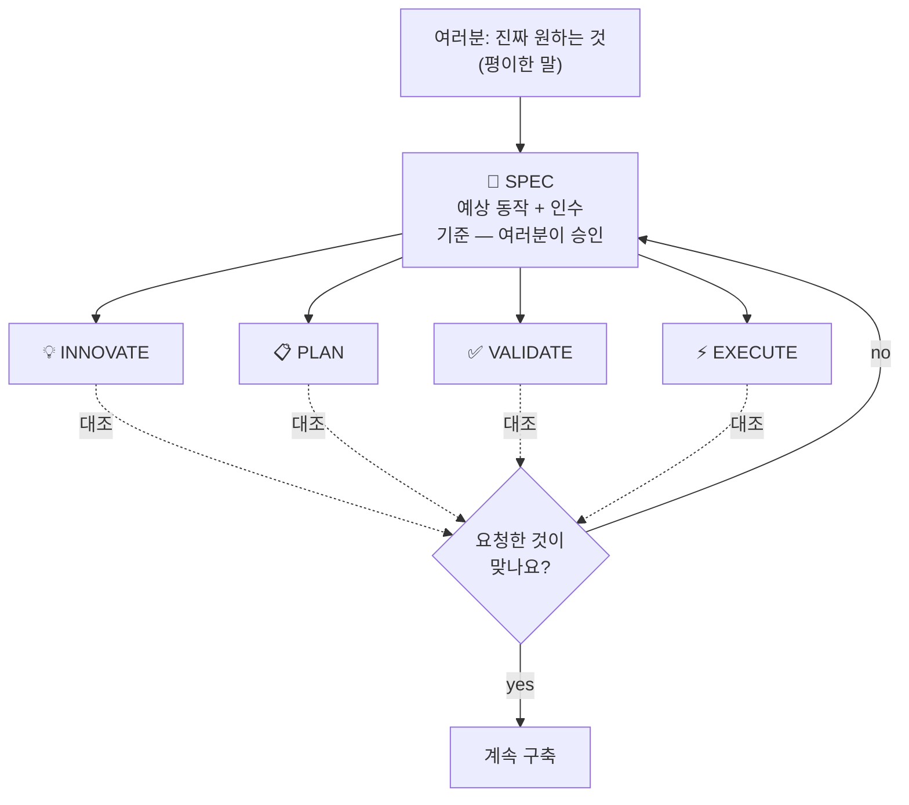

<br>

### 💻 예시 세션

```
# 🆕 기능 요청
You: "add webhook support to the API"
→ Skill discovery surfaces: vc-scenario, vc-security
→ research-agent gathers context (read-only, can't touch code)
→ "go" → spec-agent writes requirements doc → you approve
→ "go" → innovate-agent compares approaches → decision summary
→ "go" → plan-agent writes the plan, listing which files it will touch
→ "ENTER VALIDATE MODE" → validate-agent gates the plan (PVL loop) → Gate: PASS
→ "ENTER EXECUTE MODE" → execute-agent implements → tester re-runs gates (EVL) → reviewer → git-manager
→ Closeout packet: what changed, what's verified, recommended next step
```

```
# 🐛 버그 수정
You: "login redirect is broken"
→ Routes to vc-debugger → gathers evidence FIRST → 2-3 competing hypotheses
→ Systematically eliminates each → root cause with proof chain
→ execute-agent implements the fix → EVL re-test → quality pipeline
```

```
# ⏩ Fast mode
You: "ENTER FAST MODE - add rate limiting middleware"
→ Compressed RESEARCH + SPEC + INNOVATE + PLAN + VALIDATE in one pass
→ Mandatory safety pause after VALIDATE → you review → "ENTER EXECUTE MODE"
```

```
# 🤖 오토파일럿 (핸즈프리)
You: "autopilot full: build a notifications system"
→ ONE consolidated clarification round → provisional /goal block (standing consent)
→ Drives the full RIPER-5 sequence autonomously, pausing only on hard stops
```

```
# 🏗️ 대형 프로그램
You: "build a full testing platform"
→ Umbrella plan + phase plans in a feature folder
→ Each phase inner loop: research → innovate → plan → PVL → execute → EVL → update
→ Progress survives context compaction — durable reports on disk
```

---

## 🎯 의도 명확화

라우팅 전에 리드 에이전트가 요청의 모호성을 **4개의 이진 신호 (0–4)**로 점수를 매기고 티어를 선택해요. *실제로 할 일을 바꿀 때만* 질문해요.

| 티어 | 언제 | 동작 |
|---|---|---|
| **티어 0** — 자동 라우팅 | 점수 0–1, 또는 "go" / "just do it" 이라고 했거나, 플랜을 재개 중 | 즉시 라우팅, 질문 없음 |
| **티어 1** — 인라인 요약 | 점수 2 | 이해한 내용 + 선택한 경로를 한 줄로 서술하고 진행 |
| **티어 2** — 질문 | 점수 3+ | 라우팅 전에 집중적인 객관식 질문 |

> 🧠 **최대 두 번.** 티어 2 후에도 명확하지 않으면 마지막으로 평이한 질문 한 가지를 하고, 그다음 가장 좁은 범위로 리서치를 기본값으로 사용해요. 명확화를 영원히 반복하지 않아요. RESEARCH 후에 의도를 재확인해요 — 리서치가 가정과 다른 걸 보여주면 재제시하고, 확인되면 재질문 없이 진행해요.

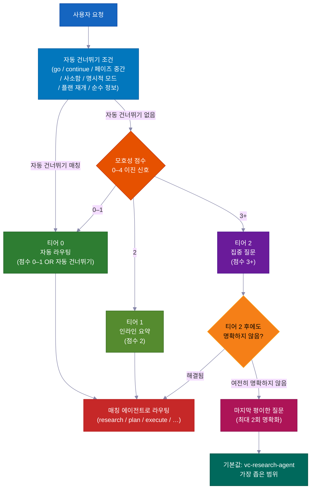

---

## ✅ 두 가지 품질 루프 — PVL + EVL

대부분의 하네스는 기껏해야 한 번 검사해요. 이 킷은 EXECUTE를 **두 개의 독립 루프**로 감싸요 — 코드 작성 전 하나, 후에 하나.

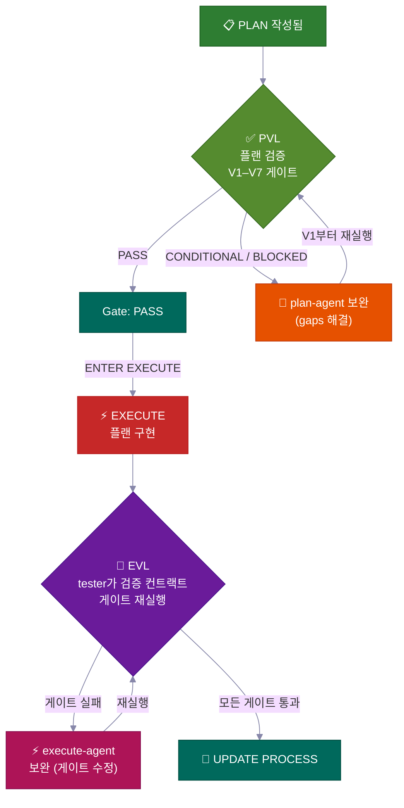

<table>
<tr>
<td width="50%" valign="top">
<h3>📋 PVL — Plan-Validate-Fix</h3>
EXECUTE 전에 <code>vc-validate-agent</code>가 플랜을 <strong>V1–V7 체크포인트</strong>로 통과시켜요 — 여러 에이전트에 분산해서 인프라, 테스트 커버리지, 브레이킹 체인지, 보안, 섹션별 실현 가능성을 커버해요. 첫 번째 <strong>CONDITIONAL</strong>이나 <strong>BLOCKED</strong>는 끝이 아니에요 — <code>vc-plan-agent</code>로 돌아가 플랜을 업데이트하고 V1부터 다시 확인해요.
<br><br>
<sub><code>vc-autoresearch</code> (domain: plan)로 추적 — gaps 찾기-수정 루프. 10회 상한. 고원 감지. <strong>Gate: PASS</strong>(또는 명시적으로 수락한 CONDITIONAL)만 EXECUTE를 해제해요.</sub>
</td>
<td width="50%" valign="top">
<h3>🧪 EVL — Execute-Validate-Fix</h3>
EXECUTE가 완료를 보고한 후 — <strong>모든 체크포인트가 통과했다고 주장해도</strong> — 리드 에이전트는 <strong>항상</strong> <code>vc-tester</code>를 실행해서 합의된 체크리스트 테스트 명령을 독립적으로 재실행해요. 실패한 체크포인트는 범위를 좁힌 <code>vc-execute-agent</code> 수정으로 라우팅되고, 재테스트해요.
<br><br>
<sub><code>vc-autoresearch</code> (domain: tests)로 추적. 10회 상한. execute-agent의 내부 "반복해서 통과까지" 루프는 <strong>절대로</strong> 이 독립 확인을 대체하지 않아요.</sub>
</td>
</tr>
</table>

> 💎 **판정 계단:** **PASS** → 진행 · **CONDITIONAL** → 수정 가능한 gaps; 루프가 작동하거나 기록으로 수락 · **BLOCKED** → 더 깊은 문제; PLAN으로 돌아감 (오토파일럿에서: gap은 백로그로 가고 실행 계속).

### 🔁 vc-autoresearch — 공유 루프 엔진

PVL과 EVL 모두 동일한 추적 레이어를 사용해요: **`vc-autoresearch`** — gaps 찾기 → 수정 → 반복 루프. 리드 에이전트가 루프를 구동해요 — 라운드 카운터, 라운드별 리포트, TSV 로그, 고원/상한/리그레션 검사를 소유해요. 작업자 에이전트는 fire-and-forget: 결과를 반환하고 멈춰요. 어떤 에이전트도 스스로 재실행하거나 다른 페이즈 에이전트를 실행하지 않아요.

같은 엔진을 독립적으로 실행할 수 있어요: "이 스펙 강화", "모든 린트 수정", "테스트 커버리지 개선", "이 문서 개선" — 6개 도메인(spec · tests · ux · docs · plan · errors)에 걸친 반복적인 gaps 찾기-수정 작업.

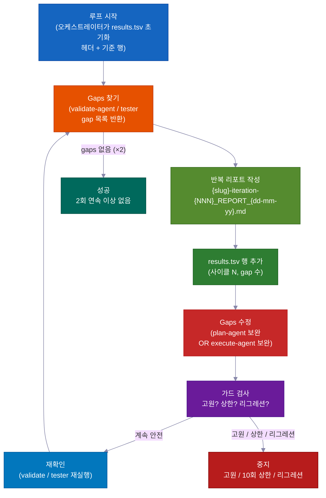

| 모드 | 하는 일 | 멈출 때 |
|---|---|---|
| `vc-autoresearch` (기본) | gaps 찾기 → 수정 → 반복 | gaps 없음 OR 메트릭 목표 달성 |
| `vc-autoresearch:probe` | 8개 페르소나가 포화까지 자료를 심문 | 3라운드 동안 새 제약 없음 |
| `vc-autoresearch:reason` | 블라인드 심사관으로 적대적 토론 | 심사관 수렴 또는 반복 상한 |
| `vc-autoresearch:evals` | TSV 결과 분석 — 추세, 고원, 권고 | 분석만 |

**중지 조건:** SUCCESS (2라운드 연속 이상 없음) · HALT_PLATEAU (3라운드 진전 없음) · HALT_CAP (10라운드 하드 한계) · HALT_REGRESSION (통과하던 검사가 실패).

---

## 👥 전략 비교 + 모델 정책

**모든 단계 전환**에서 리드 에이전트가 `vc-agent-strategy-compare`를 실행해서 다음 단계를 *어떻게* 실행할지 추천해요 — 비용 추정과 함께.

| 전략 | 언제 | 조율 |
|---|---|---|
| **순차** | 작업이 이전 출력에 의존 | 한 번에 에이전트 하나 |
| **병렬 서브에이전트** | 독립 차원, fire-and-forget | 없음 — 리드 에이전트가 결과 수집 + 결합 |
| **워크플로우** | 목록에 걸쳐 예측 가능한 작업 분할 | 스크립트된 단계 |
| **에이전트 팀** | 에이전트들이 실행 중에 서로 대화해야 할 때 (예: 3개 이상의 페이즈 플랜에 걸쳐 각자 별도 파일 수정) | TeamCreate + 공유 작업 목록 + SendMessage |

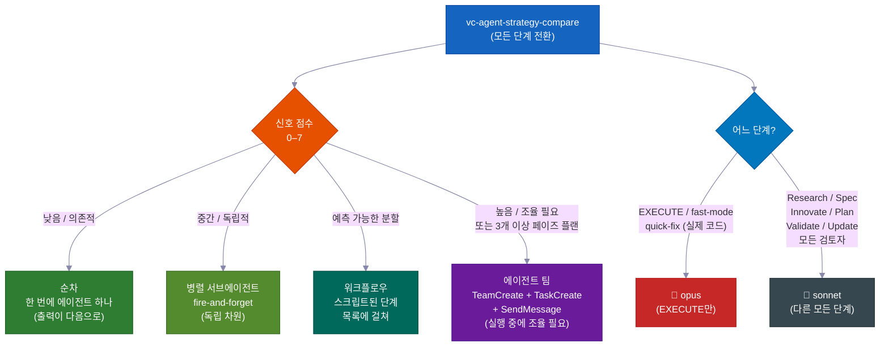

> ⚠️ **"에이전트 팀"은 실제 장치를 의미해요** — 이름 있는 팀원, 공유 작업 목록, 에이전트 간 메시지 — *"팀"이라고 부르는 병렬 에이전트*가 아니에요. 3개 이상의 페이즈 플랜 생성과 에이전트들이 각자 파일을 유지해야 하는 멀티 파일 편집에 **필수** (선택 아님)이에요. 진정한 팀만이 실행 중에 소통할 수 있어요.

### 🧮 모델 선택 정책

| 단계 | 모델 | 이유 |
|---|---|---|
| **EXECUTE** (+ fast-mode, 실제 코드를 하는 quick-fix) | 🔴 **opus** | 실제 소스 편집, 빌드, 마이그레이션 |
| Research · Spec · Innovate · Plan · Validate · Update · 모든 검토자/연구자 | 🔵 **sonnet** | 계획과 분석 — 더 저렴하고 충분히 유능함 |

> 여러 에이전트로 작업을 분할할 때 *코딩* 에이전트만 opus를 써요. 모든 검토자, 연구자, 검증자, 계획자는 sonnet을 써요. 리드 에이전트는 작업자를 실행할 때마다 모델을 명시해요.

---

## 🤖 오토파일럿 모드 — 핸즈프리 RIPER-5

**`autopilot [task]`** (또는 `run autopilot`, `autonomous mode`, `ENTER AUTOPILOT MODE`)라고 하면 에이전트가 *전체* 남은 RIPER-5 시퀀스를 처음에 **한 번** 명확화 라운드만 하고 — 그다음 완료까지 일시 정지 없이 — 실행해요.

**어디서든 트리거:** 오토파일럿은 세션 시작 *또는* 중간 어느 시점에서든 시작할 수 있어요. 트리거되면 리드 에이전트가 디스크의 저장된 파일을 읽어 이미 어느 RIPER-5 단계에 있는지 파악하고, 거기서 이어받아 나머지를 스스로 진행해요.

| 디스크 상태 | 진입 단계 |
|---|---|
| SPEC 파일 없음 | RESEARCH에서 시작 |
| SPEC 파일 있음 | post-SPEC (INNOVATE)으로 건너뜀 |
| 플랜 파일 있음 | post-PLAN (VALIDATE)으로 건너뜀 |
| PASS/CONDITIONAL 검증 컨트랙트 있음 | EXECUTE로 건너뜀 |

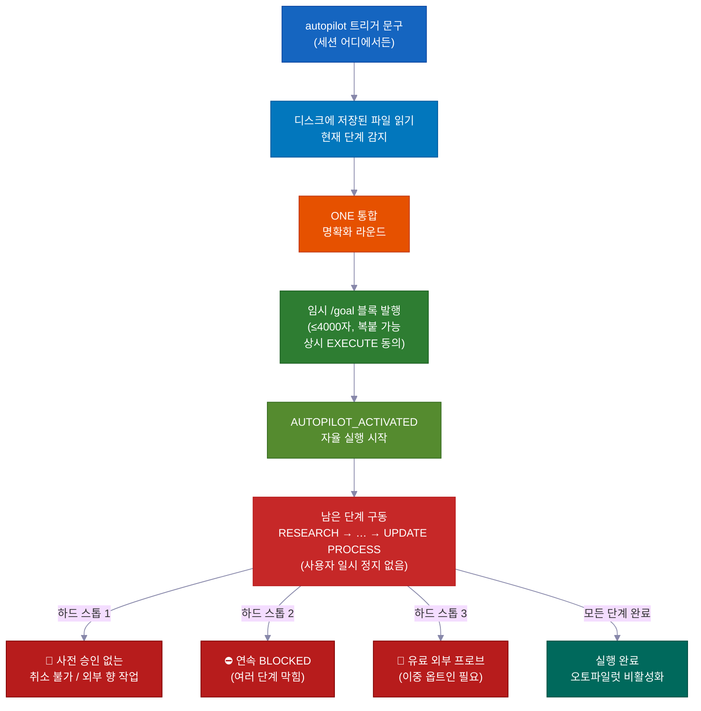

```
You: "autopilot full: add team invitations with email + role management"
→ Reads saved files → detects current phase → enters there
→ ONE consolidated clarification round (scope, hard stops, autonomy boundaries, first-phase strategy)
→ Provisional /goal block emitted (≤4000 chars, copy-pasteable, standing EXECUTE consent)
→ AUTOPILOT_ACTIVATED → drives remaining phases on its own
→ Stops ONLY for hard stops
```

### 세 가지 레인 — 위험도에 맞는 절차

| 레인 | 트리거 | 흐름 |
|---|---|---|
| 🟢 **quick** | `autopilot quick: [task]` | 스카우트 → 편집 → 범위 내 검사. 플랜 없음, 컨트랙트 없음, EVL 없음. |
| 🟡 **fast** | `autopilot fast: [task]` | 압축 R→S→I→P→V → EXECUTE + EVL. |
| 🔴 **full** | `autopilot [task]` / `autopilot full:` | 완전한 RIPER-5 (기본값). |

### 🌙 핸즈프리: 한 마디, 자는 동안 구축

`autopilot full: [task]` 라고 말하거나 `/goal` 블록을 붙여넣으면 다음이 모두 **사람 입력 없이** 일어나요:

- **플랜 검사-수정 루프** — 플랜의 gaps를 찾고, 수정하고, 재확인해요. 스스로 최대 10라운드.
- **빌드-테스트-수정 루프** — 코드를 작성하고, 테스트를 실행하고, 실패를 수정하고, 재실행해요. 스스로 최대 10라운드. 자체 "모두 통과"를 절대 믿지 않아요 — 별도의 검사기 (vc-tester)가 독립적으로 모든 테스트를 재실행해 확인해요.
- **단계 간 진행** — 리서치에서 플랜, 코드, 완료까지 여러분을 기다리지 않고 이동해요.
- **메모리 리셋 후 이어받기** — 플랜, 리포트, 진행 상황이 모두 디스크의 파일로 있어요. 압축 후 (AI의 단기 메모리가 지워질 때), 다음 세션이 그 파일을 읽고 정확히 멈춘 곳에서 계속해요.
- **막힌 기능? 옆에 두고 계속** — 한 단계를 해결할 수 없으면 에이전트가 백로그 노트를 작성하고 다음 기능으로 이동해요. 하나의 블로커가 모든 것을 막지 않고 여러 기능을 병렬로 실행할 수 있어요.
- **병렬 기능을 위한 에이전트 팀** — 여러 에이전트가 동시에 별도 기능을 구축할 수 있고, 각각 자신의 파일에 잠겨 있어 충돌이 없어요. 막힌 기능은 주차되고, 나머지에 블로커가 되지 않아요.

### 하드 스톱은 항상 표면화돼요 (오토파일럿에서도)

**에이전트가 멈추고 묻는 유일한 세 가지:**

- 🛑 취소할 수 없거나 외부 세계에 영향을 미치고 사전 승인이 없는 것 (라이브 배포, 실제 메시지 전송, 결제)
- ⛔ 여러 단계가 연속으로 진전 없이 막힘 — 여러분의 눈이 필요한 실제 막다른 곳
- 💸 유료 외부 서비스에 실제 돈을 쓸 테스트 — 실행 전에 물어봐요

---

### 🎯 /goal — 자율 실행 토큰

**필수, 장식이 아니에요:** VALIDATE 단계가 완료된 후, 리드 에이전트는 EXECUTE가 시작되기 전에 복붙 가능한 `/goal` 블록을 *반드시* 발행해야 해요. 이것은 필수 핸드오프 파일이에요 — 선택 주석이 아니에요.

**포맷 제약:**

| 블록 유형 | 필수 필드 | 하드 한계 |
|---|---|---|
| Post-VALIDATE 블록 | SESSION GOAL · Charter+umbrella plan · Autonomy · Hard stop conditions · Next phase · Validate contract · Execute start | ≤ 4000자 |
| 임시 (오토파일럿) 블록 | SESSION GOAL · ENTRY PHASE · REMAINING PHASES · CLARIFICATIONS LOCKED · EXECUTE CONSENT · DECISION POLICY · HARD STOPS · TEST GATES · START (+ 선택적 LANE) | ≤ 4000자 |

`/goal` 명령은 4000자를 초과하는 블록을 거부해요. 짧게 유지하세요 — 필수 필드를 구조로 사용하고, 산문 에세이가 되지 않도록요.

**독립 /goal 모드:** 새 세션에 `/goal` 블록을 붙여넣으면 `START`에 명명된 단계에서 재개해요. 명확화와 결정 규칙이 이미 설정되어 있어요 — 새 명확화 라운드 없음. 상시 `/goal`에서 에이전트는 모든 가역적 단계를 스스로 결정하고, BLOCKED 항목을 백로그로 보내고, 자체 리포트를 작성해요 — 하지만 **작업자 에이전트 위임은 필수로 유지돼요.** 오토파일럿은 *승인 일시 정지*만 제거하고, no-inline-execution 규칙은 절대 아니에요.

`validate-autopilot-goal-block.mjs`로 검증돼요.

---

## 🔬 실현 가능성 프로브 + 검증기 안전망

### 🔬 실현 가능성 프로브 — 만들기 전에 가정을 테스트해요

SPEC, INNOVATE, 또는 VALIDATE가 읽기만으로는 확인할 수 없는 핵심 가정에 부딪히면 `VC-FEASIBILITY-PROBE-NEEDED`를 발행하고 멈춰요. 리드 에이전트가 `vc-debugger`를 실행해서 실제 테스트를 하고 **VERDICT**를 작성해요:

| 판정 | 의미 |
|---|---|
| ✅ **VIABLE** | 가정이 성립 — 설계가 이에 의존할 수 있음 |
| ❌ **NOT-VIABLE** | 가정이 거짓 — 해당 접근법은 금지됨 |
| ❓ **INCONCLUSIVE** | 증명 불가 — 알려진 gap으로 이어짐 |

각 판정에는 3부분 설계 노트가 따라와요: **결과가 허용하는 것 · 배제하는 것 · 여전히 불확실한 것** — 일시 정지된 단계로 그대로 피드백돼요. 프로브는 **비용 분류됨** (`cheap-local` / `needs-container` / `needs-live-provider` → 이중 옵트인 / `needs-browser` / `needs-cf`)되어 유료나 공유 자원 프로브가 조용히 실행되지 않아요.

### 🛡️ 36개 검증기 — 의견이 아닌 기계적 정확성

킷에 **36개 검증기 스크립트**가 포함되어 "에이전트가 규칙을 따랐나?"를 명확한 통과/실패 결과로 바꿔줘요. 하네스 파일을 건드리는 단계 후와 UPDATE PROCESS의 필수 체크포인트에서 실행돼요:

| 검증기 계열 | 검사 내용 |
|---|---|
| `vc-audit-vc` | 에이전트 패리티 (Claude/Codex), 스킬 레지스트리, 킷 이식성, 에이전트 프론트매터 |
| `vc-audit-context` | 컨텍스트 라우팅, 탐색 프론트매터, 스킬 키워드 |
| `vc-audit-plans` | 플랜 인벤토리, umbrella 상태, 페이즈 완전성, 페이즈 리포트, 백로그 노트 |
| 14개 VC-시스템 행동 검증기 | 각각 통과/실패 픽스처 쌍을 소유 — 전략 비교 출력, 마감, 의도 명확화, 실현 가능성 판정, autoresearch 로그 등 |

---

## 🛡️ 내장 안전 시스템

이것은 가이드라인이 아니에요 — 모든 에이전트에 내장된 **하드 규칙**이에요.

<table>
<tr>
<td width="50%" valign="top">
<h1>📝</h1>
<strong>실행 중 일시 정지 없이 진행 노트</strong><br><br>
코딩 중 에이전트가 작업하면서 페이즈 리포트 파일에 진행 노트를 작성해요. 실행 중 일시 정지 없고, "계속할까요, 돌아갈까요?" 프롬프트 없음. 플랜 변경이 필요한 문제가 생기면 멈추고 PLAN으로 돌아가요. 그 외에는 계속 진행해요.
</td>
<td width="50%" valign="top">
<h1>🚫</h1>
<strong>조용히 이탈하지 않아요</strong><br><br>
코딩 중 플랜 변경이 필요한 문제가 생기면 에이전트가 <strong>즉시 멈추고</strong>, 설명하고, PLAN으로 돌아가요. 조용한 즉흥 없음.
</td>
</tr>
<tr>
<td width="50%" valign="top">
<h1>🔐</h1>
<strong>프라이버시 가드레일 훅</strong><br><br>
에이전트가 명시적 승인 없이 <code>.env</code>, 자격 증명, SSH 키, <code>.pem</code> 파일을 <strong>읽는 것이 차단</strong>돼요.
</td>
<td width="50%" valign="top">
<h1>⚠️</h1>
<strong>고위험 증거 팩</strong><br><br>
인증, 빌링, 스키마 마이그레이션, 또는 공개 API 변경의 경우 시스템이 작업을 "완료"라고 부르기 전에 공식 **5파일 증거 팩**을 요구해요 — 항상 수동, 자동 우회 없음.
</td>
</tr>
<tr>
<td width="50%" valign="top">
<h1>📨</h1>
<strong>상태 코드 규율</strong><br><br>
작업자 에이전트는 <code>DONE</code> / <code>DONE_WITH_CONCERNS</code> / <code>BLOCKED</code> / <code>NEEDS_CONTEXT</code> 중 하나로 끝내야 해요. 블로커는 절대 무시되지 않고, 정확성 우려는 실행 항목이 돼요.
</td>
<td width="50%" valign="top">
<h1>📊</h1>
<strong>마감 + 드리프트 점수</strong><br><br>
코딩 후 마감 패킷이 긴급도를 점수화해요: <strong>LOW</strong> (가벼운 터치) → <strong>MEDIUM</strong> (상당함) → <strong>HIGH</strong> (하네스/프로토콜 파일 수정), 그다음 안전한 단계를 권고해요.
</td>
</tr>
</table>

---

## 🔍 구현 전 사전 분석

코드 한 줄 쓰기 전에, 세 가지 전문 스킬이 문제를 잡을 수 있어요:

<table>
<tr>
<td width="50%" valign="top">
<h1>🎭</h1>
<strong>5페르소나 토론 — <code>vc-predict</code></strong><br><br>
Architect, Security, Performance, UX, Devil's Advocate가 플랜을 토론해요. 한 줄 쓰기 전에 <strong>GO / CAUTION / STOP</strong> 판정을 내려요.
</td>
<td width="50%" valign="top">
<h1>🎲</h1>
<strong>12차원 엣지 케이스 — <code>vc-scenario</code></strong><br><br>
기능을 12개 차원(사용자 유형, 입력 극단값, 타이밍, 규모, 상태, 환경, 오류, 인증, 데이터, 통합, 규정, 비즈니스 로직)에 걸쳐 분해해요. 출력이 테스트 스펙으로도 사용돼요.
</td>
</tr>
<tr>
<td width="50%" valign="top">
<h1>🔐</h1>
<strong>STRIDE + OWASP 감사 — <code>vc-security</code></strong><br><br>
의존성 감사, 시크릿 감지, 그리고 심각도별로 정렬해 Critical을 먼저 수정하는 리그레션 가드가 있는 **자동 수정 모드**를 갖춘 이중 방법론 보안 감사예요.
</td>
<td width="50%" valign="top">
<h1>🔬</h1>
<strong>증거 우선 디버깅 — <code>vc-debugger</code></strong><br><br>
증거 수집 → 2-3개의 경쟁 가설 형성 → 각각 테스트 → 소거 경로 문서화. <strong>절대 추측하지 않아요 — 증명해요.</strong>
</td>
</tr>
</table>

---

## ✅ 품질 파이프라인 — 실행에 내장

**테스트 먼저, 그다음 코드.** 합의된 체크리스트(코드를 건드리기 전에 작성됨)가 통과해야 하는 정확한 테스트를 정의해요. execute-agent는 테스트가 통과할 때까지 코드를 작성해요. 그다음 별도의 검사기 — `vc-tester` — 가 모든 테스트를 스스로 재실행해서 확인해요. execute-agent의 자체 "모두 통과"는 액면 그대로 받아들이지 않아요. 맨 마지막에 검토자가 새 부분만이 아니라 전체 프로젝트가 함께 잘 작동하는지 확인해요.

execute-agent는 코드만 작성하고 끝이라고 하지 않아요. 자동으로 **품질 파이프라인**을 통과해요:

<br>

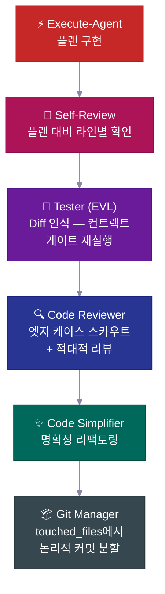

| 단계 | 하는 일 |
|---|---|
| 🔎 **Self-review** | 모든 체크리스트 항목을 플랜과 비교하고, 이탈을 기록해요 |
| 🧪 **Tester (EVL)** | 합의된 체크리스트 테스트를 독립적으로 재실행해요; 변경된 파일을 테스트 파일에 매핑하고, 70% 이상 매핑되면 전체 스위트로 에스컬레이션해요 |
| 🔍 **Code reviewer** | 리뷰 전에 엣지 케이스 스카우트를 보내요; N+1 쿼리, 인증 경로, 데이터 누출을 검사해요 |
| ✨ **Simplifier** | 리뷰 후 명확성을 위한 코드 정리 — 동작 변경 없음 |
| 📦 **Git manager** | `touched_files`를 받아 논리적 conventional 커밋으로 분할하고, 알 수 없는 파일은 거부해요 |

---

## 📋 플랜 라이프사이클

모든 중요한 기능은 **플랜 라이프사이클**을 따라요 — 생성하고, 리뷰하고, 구현하고, 영구 프로젝트 히스토리로 아카이브되는 서면 스펙이에요.

<br>

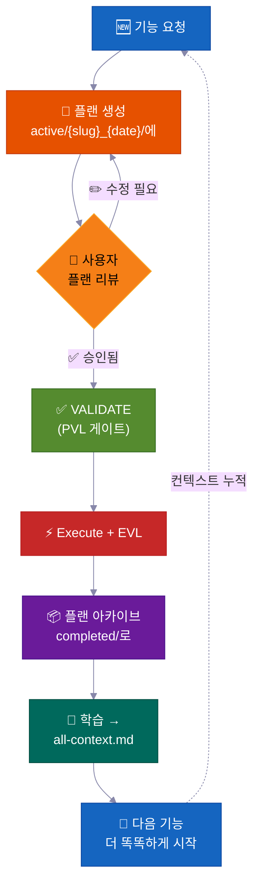

> 💡 6개월 후에 누군가 *"왜 인증을 이렇게 만들었지?"*라고 물으면, 답이 `completed/`에 있어요. Slack 스레드 어딘가에 묻힌 게 아니라요.

**플랜이 있는 위치 — 태스크 폴더 컨벤션:**

```
process/
├── general-plans/
│   ├── active/
│   │   └── webhooks_28-05-26/          # 📋 태스크 폴더: 플랜 + 함께 있는 reports/refs
│   │       └── webhooks_PLAN_28-05-26.md
│   ├── completed/                       # ✅ 아카이브 (검색 가능한 히스토리)
│   └── backlog/                         # 📌 지연된 작업
└── features/
    └── billing/                         # 🏷️ 기능 범위 (산출물 5개 이상)
        ├── active/{slug}_{date}/
        ├── completed/
        └── backlog/
```

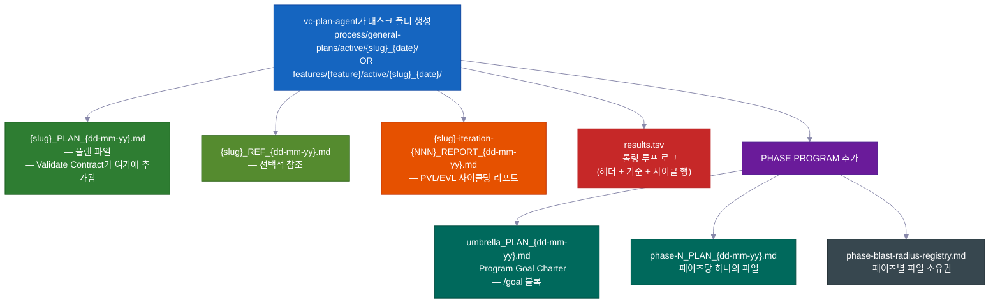

> 모든 플랜에 포함: 📍 **터치포인트** (생성/수정된 파일) · 📜 **공개 컨트랙트** · 💥 **건드릴 수 있는 파일** (뭐가 깨질 수 있는지, 어떤 테스트를 할지) · ✅ **검증 증거** · 🔄 **재개 핸드오프**. `vc-plan-discovery`가 재개할 올바른 플랜을 찾고, `post-write-plan-check` 훅이 모든 플랜 작성 시 플랜 구조를 확인해요.

---

## 🏗️ 페이즈 프로그램 — 무너지지 않는 대형 프로젝트

일반 기능은 플랜 하나를 써요. **대형 멀티 페이즈 프로젝트**는 페이즈 프로그램을 써요 — umbrella 플랜 + 페이즈별 플랜, 각각 자체 체크포인트와 저장된 리포트로 완전한 **7단계 내부 루프**를 실행해요.

<br>

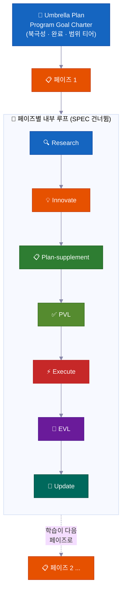

| | 기능 | 왜 중요한지 |
|---|---|---|
| 🔄 | **매 페이즈마다 재리서치** | 코드 드리프트를 확인하고, 최신 리포트를 읽고, 가정을 갱신해요 |
| ✅ | **페이즈별 체크포인트** | 증거가 증명할 때까지 페이즈는 완료가 아니에요. 정직한 상태: `PLANNED → CODE DONE → TESTING → VERIFIED` or `BLOCKED` |
| 📄 | **저장된 리포트** | 매 페이즈가 결과를 디스크에 기록해요 — 메모리 리셋에서도 진행 상황이 살아남아요 |
| 🧠 | **학습이 앞으로 전달** | 페이즈 1의 발견이 코딩 시작 전에 페이즈 2의 플랜을 업데이트해요 |
| 🏗️ | **기반 vs. 확장** | "아키텍처 증명"과 "모든 것 구현"을 명시적으로 분리해요 |
| 🚧 | **정직한 블로커 처리** | 막힌 페이즈는 증거와 함께 `BLOCKED` 상태를 유지해요. 강제로 녹색으로 만들지 않아요 |

<br>

### 🔀 프로그램이 배우면서 스스로 재편성해요

시작할 때 작성한 플랜은 거친 지도이지, 고정된 계약이 아니에요. 프로그램이 실행되면서 조정돼요 — 모든 단계를 미리 예측할 필요가 없어요.

**실행 중 새 페이즈를 삽입할 수 있어요.**
작업 중 에이전트가 빠진 단계를 발견할 수 있어요 — 다음 페이즈가 진행되기 전에 일어나야 하는 것. 그 경우 바로 거기에 새 페이즈를 삽입하고, 나머지를 재번호 매기고, 계속해요. 사람 개입 필요 없음. (내부 신호: `MID_PROGRAM_PLAN_CREATED` — 새 플랜이 디스크에 작성되고 레지스트리에 자동으로 추가돼요.)

**페이즈를 재순서할 수 있어요.**
리서치가 계획된 순서가 틀렸음을 보여줄 때가 있어요 — 예를 들어, 페이즈 3이 페이즈 4가 만드는 것에 의존하는 경우. 에이전트가 남은 페이즈를 재배열하고 이유를 기록해요. (내부 신호: `PHASE_RESTRUCTURE_NOTICE` — 블로커가 아닌 감사 추적으로 페이즈 리포트에 저장.)

**각 페이즈의 플랜을 코딩 직전에 업데이트해요.**
어느 페이즈든 코딩을 시작하기 전에, 빠른 리서치 과정이 프로그램이 지금까지 배운 것을 검토해요. 그다음 새로운 발견으로 해당 페이즈의 체크리스트를 업데이트해요. 이것을 **plan-supplement** 단계라고 불러요. 플랜은 절대 동결되지 않아요 — 이전 페이즈의 신선한 사실을 흡수해요.

**아직 시작할 수 없는 작업을 건너뛸 수 있어요.**
페이즈가 아직 준비되지 않은 것에 의존한다면 — 아직 구축되지 않은 서비스, 아직 내려지지 않은 결정 — 에이전트가 해당 페이즈를 의존성 차단으로 표시하고, 다음 페이즈로 이동해요. 전체 프로그램이 하나의 페이즈가 기다리는 것 때문에 멈추지 않아요.

**언제 멈추고 물어볼지 알아요.**
하나의 막힌 페이즈는 백로그에 주차되고 프로그램이 계속돼요. 하지만 여러 페이즈가 연속으로 진전 없이 막히면 에이전트는 그것을 실제 막다른 곳으로 — **연속 중지** — 취급하고, 무슨 일이 있었는지 보여주기 위해 일시 정지해요. 하나의 막힌 페이즈는 정상이에요. 여러 개가 연속으로 있으면 구조적으로 문제가 있다는 신호예요.

**실시간 스코어보드를 유지해요.**
모든 프로그램은 umbrella 플랜에 현재 페이즈, 완료 여부, 리포트 위치를 보여주는 한 페이지 상태 섹션이 있어요. 누구든 — 또는 메모리 리셋 후의 에이전트 자신도 — 읽고 정확히 상황을 알 수 있어요. 동시에 작업 중인 두 페이즈가 같은 파일을 편집하지 않도록 간단한 파일 레지스트리도 유지해요.

**최종 큰 검사 하나.**
전체 프로그램 끝에서 에이전트가 전체 프로젝트가 함께 잘 작동하는지 — 각 부분만이 아니라 — 종단 간 테스트를 실행해요. 개별 페이즈 체크포인트는 각 부분이 작동하는 것을 증명하고, 이 최종 검사는 부분들이 전체로서 작동하는 것을 증명해요.

---

### 🧠 자리를 절대 잃지 않아요 (메모리 리셋에서 살아남아요)

긴 작업은 도중에 AI 메모리가 리셋되어도 올바르게 완료돼요. 플랜, 진행 상황, 증거가 모두 에이전트의 머릿속만이 아닌 디스크의 파일로 있어요.

AI 에이전트는 제한된 작업 메모리를 가져요. 긴 작업에서 그 메모리가 차고 압축돼요 — 세부 사항이 흐려질 수 있어요. 새 세션이 시작될 때 (또는 메모리가 지워질 때) 에이전트는 어디서 멈췄는지 추측하지 않아요. 파일을 읽어요.

정확히 어떻게 작동하는지:

**1. 매 페이즈 후 짧은 리포트를 작성해요.**
페이즈가 끝나면 리포트 파일이 디스크에 작성돼요. 진행 상황이 에이전트의 머릿속만이 아닌 프로젝트 폴더에 있어요. 메모리 압축이 파일을 지울 수 없어요.

**2. 어떤 단계가 완료됐는지 체크리스트를 유지해요.**
각 페이즈 플랜은 **Phase Loop Progress** 목록을 갖고 있어요 — 모든 단계(리서치, 플랜 검사, 빌드, 테스트, 학습 캡처)의 체크박스. 리셋 후 에이전트가 그 체크박스를 읽고 정확히 다음 단계를 알아요. 따라잡을 필요가 없어요.

**3. 매 페이즈 시작 시 짧은 "봉투."**
모든 작업자 에이전트(한 단계의 작업을 하는 집중된 도우미)가 **Context Envelope** — 10개 필드 노트를 발행하며 시작해요: 어느 기능, 어느 페이즈, 어느 브랜치, 어느 플랜 파일, 어떤 테스트를 실행할지. 읽는 데 몇 초면 돼요. 에이전트가 뭔가 하기 전에 준비돼요.

**4. 파일을 자체 메모리보다 믿어요.**
재개 시, 에이전트가 코드와 git 히스토리에 실제로 있는 것 대 플랜이 말하는 것을 확인해요. 실제 상태가 이겨요. 오래된 플랜이 에이전트를 오도해서 작업을 반복하거나 단계를 건너뛰게 할 수 없어요.

**5. 실시간 스코어보드와 라운드별 리포트.**
모든 수정 루프(플랜 검사 루프와 빌드-테스트 루프)는 `results.tsv` 스코어보드 파일을 유지해요 — 라운드당 한 행, 남은 문제 수를 추적해요. 루프 중간에 세션이 끝나면 다음 세션이 카운트를 읽고, 올바른 라운드에서 이어받아 계속해요. 라운드가 손실되지 않아요.

**6. 재개 시 리마인더를 재주입해요.**
메모리가 압축되면 시스템이 자동으로 최신 상태 노트를 새 세션에 다시 로드해요. 승인이 보류 중이었다면 — 예를 들어 계속 진행하기 전에 "예"가 필요한 체크포인트 — 리마인더가 플래그를 세워요. 조용히 건너뛰어지는 것은 없어요.

> 💡 요약: 오토파일럿 실행을 시작하고, 노트북을 닫고, 몇 시간 후에 돌아올 수 있어요. 에이전트는 정확히 있어야 할 곳에 있거나 — 마지막 저장된 체크포인트에서 이어받고, 디스크에 증거가 있어 증명해요.

---

## 🧠 컨텍스트 그룹

프로젝트 지식이 **컨텍스트 그룹**으로 정리돼요 — 안정적인 지식 영역이고, 각각 `all-{group}.md` 라우터 파일이 에이전트에게 무엇을 언제 읽어야 하는지 알려줘요. 에이전트는 라우터를 따르고, 관련된 것만 로드해요 — 매번 전체 지식 베이스가 아니라요.

<br>

```
process/context/
├── all-context.md              # 🧭 루트 라우터 — 아키텍처, 스택, 패턴, 컨벤션
├── tests/all-tests.md          # 🧪 테스트 러너, 명령어, 디버깅 절차
├── container/all-container.md   # 🐳 Docker, 배포, 인프라 절차
├── uxui/all-uxui.md            # 🎨 컴포넌트, 디자인 토큰, 패턴
├── infra/all-infra.md          # 🖥️ 서버 인프라, 배포
└── {your-domain}/all-{domain}.md  # 📚 지속적인 문서 3개 이상인 모든 도메인 (자동 승격)
```

| | 작동 방식 |
|---|---|
| 🧭 **라우터 패턴** | 에이전트가 작업에 관련된 것만 읽어요 |
| 📏 **자동 승격** | 문서 3개 이상 (또는 단일 파일이 너무 커지면) 자체 그룹을 받아요 |
| 🔄 **항상 최신** | 중요한 기능 완료 후 `vc-update-process-agent`가 업데이트해요 |
| 🧪 **감사 가능** | `vc-audit-context`가 라우팅, 탐색 프론트매터, 일관성을 확인해요 |
| 📨 **Context Envelope** | 모든 내부 루프 에이전트가 시작 시 10개 필드 노트를 발행해요 (기능 → 페이즈 → 세션 목표 → 브랜치 → worktree → 컨텍스트 그룹 → blast-radius-packages → 활성 플랜 → 테스트 러너 → 검증 컨트랙트) 신선한 작업자 에이전트가 정확히 어디에 있는지 알 수 있도록 |

> 킷은 프로토콜 씨앗 파일만 포함해요 — 여러분의 컨텍스트 그룹은 `vc-setup`이 실제 코드를 스캔해서 **여러분의 프로젝트를 위해** 구축돼요. 고정된 목록이 아닌 패턴이에요.

---

## 📁 기능 폴더

주제가 5개 이상의 파일을 쌓으면 자체 **기능 폴더** — 완전한 라이프사이클 컨테이너 — 를 받아요.

```
process/features/{feature}/
├── active/{slug}_{date}/   # 📋 작업 중인 플랜 (reports/refs 함께 있음)
├── completed/              # ✅ 아카이브된 플랜 (검색 가능한 결정 히스토리)
└── backlog/                # 📌 지연된 작업 (에이전트가 중복 생성 전 확인)
```

| | 무슨 일이 일어나는지 |
|---|---|
| 🆕 | 새 작업이 `active/`에서 시작 → 리포트 쌓임 → 플랜이 `completed/`에 아카이브 |
| 📌 | 지연된 작업은 `backlog/`로 — 에이전트가 중복 플랜 만들기 전에 여기를 확인 |
| 📦 | 일반 산출물이 5개 이상이면 자동으로 기능 승격 |
| 🔍 | 모든 기능이 완전하고 자체 완결적인 히스토리를 가져요 — 플랜, 결정, 리포트, 리서치 |

---

## 🧱 스킬 레이어

33개 스킬이 세 가지 레이어로 나뉘어요. 모든 `SKILL.md`가 프론트매터에 `layer` + `trigger_keywords`를 선언하고, 생성된 카탈로그가 탐색을 빠르게 유지해요.

<table>
<tr>
<td width="33%" valign="top">
<h1>🎭</h1>
<strong>액터 에이전트</strong><br><br>
페이즈나 역할을 소유해요. <code>.claude/agents/</code>에 있어요 — 스킬이 아닌 15개 에이전트예요.
</td>
<td width="33%" valign="top">
<h1>📜</h1>
<strong>Contract skills (20)</strong><br><br>
각각 특정 파일이나 합의된 출력물을 생성해요 — <code>vc-generate-plan</code>, <code>vc-validate-findings</code>, <code>vc-autopilot</code>, 감사들. 결과를 확인할 수 있어요.
</td>
<td width="33%" valign="top">
<h1>🛠️</h1>
<strong>Helper skills (13)</strong><br><br>
에이전트가 *어떻게* 작동하는지를 개선하고, 자체 파일을 생성하지 않아요 — <code>vc-scout</code>, <code>vc-sequential-thinking</code>, <code>vc-problem-solving</code>, <code>vc-docs-seeker</code>.
</td>
</tr>
</table>

---

## 🧠 자기 개선 프로젝트 메모리

완료된 모든 기능이 학습 내용을 컨텍스트 시스템에 피드백해요 — **지식이 누적되고, 리셋되지 않아요.**

대부분의 AI 지원 코드베이스는 반대 속성을 가져요: 모든 새 세션이 냉랭하게 시작해요. 에이전트가 같은 파일을 다시 읽고, 같은 패턴을 다시 발견하고, 같은 결정을 다시 내려요 — 마지막 세션의 통찰이 채팅 창에만 있었으니까요. 킷의 답은 프롬프트 트릭이 아니에요. 모든 에이전트가 세션 시작 시 읽고, 모든 검증기가 보호하고, 완료된 모든 기능이 풍부하게 만드는 **지속적인 컨텍스트 파일 시스템** (`process/context/`)이에요.

6개월과 많은 메모리 리셋 후에도 에이전트는 여러분의 인증이 왜 그렇게 작동하는지 알아요 — 그 지식이 디스크에 있고, 라우팅되고, 감사 가능하며, 죽은 세션에 갇히지 않으니까요.

<br>

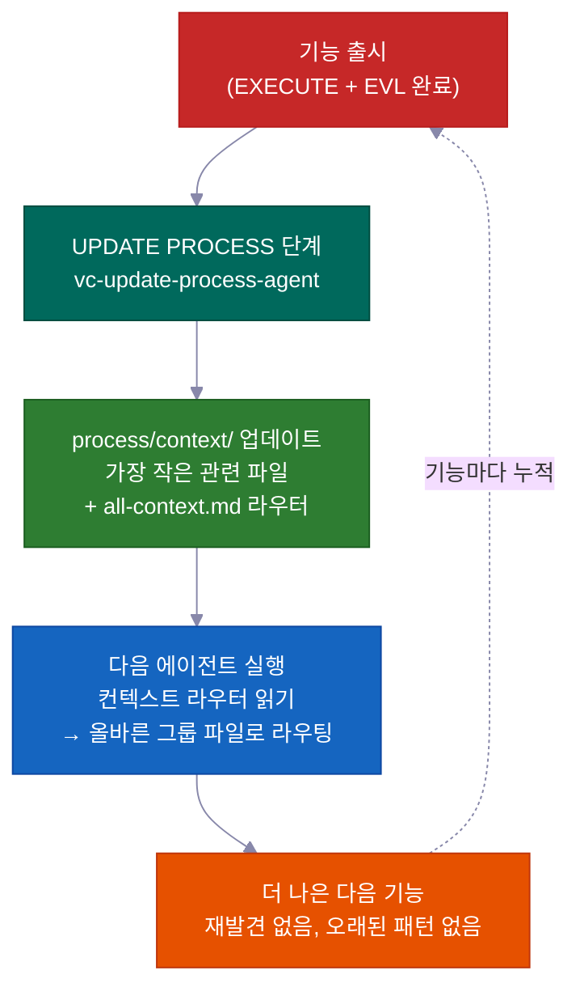

### 핵심 메커니즘: `process/context/`를 이식 가능한 공유 메모리로

`process/context/`는 주제 그룹으로 정리된 구조화된 지식을 담아요 — 아키텍처 결정, 코딩 컨벤션, 배포 단계, 테스트 패턴, 인프라 사실. 채팅 히스토리와 달리 이 지식은:

- **모든 작업자 에이전트에게 전달돼요** — `vc-context-discovery`가 실행된 각 에이전트를 작업에 맞는 `all-{group}.md` 라우터로, 그다음 가장 작은 관련 심층 파일로 라우팅해요. 리서치 에이전트, 플랜 에이전트, 코딩 에이전트 모두 같은 공유 이해로 시작해요
- **메모리 리셋에서 살아남아요** — 디스크에 있고, 컨텍스트 윈도우에 있지 않아요; 압축된 세션은 이것을 잃지 않아요
- **Claude와 Codex 모두가 읽을 수 있어요** — `.agents/skills`는 `.claude/skills/`의 바로가기 링크라서 같은 컨텍스트 시스템이 중복 없이 두 에이전트를 모두 서비스해요

루트 라우터(`all-context.md`)가 그룹 라우터(`all-{group}.md`)를 가리키고, 이것이 가장 작은 관련 심층 파일로 라우팅해요. 에이전트는 라우터를 따르고 파일 경로를 하드코딩하지 않아요. 즉 이름 변경과 그룹 분할이 에이전트 전체 검색이 아닌 라우터 편집만 필요해요.

```
process/context/
├── all-context.md                  ← 루트 라우터 (아키텍처, 스택, 패턴)
├── tests/all-tests.md              ← 테스트 러너, 디버깅, 명령어
├── container/all-container.md      ← Docker, 배포, 인프라 절차
├── uxui/all-uxui.md                ← 컴포넌트, 디자인 토큰, 시각 컨벤션
└── {domain}/all-{domain}.md        ← 지속적인 문서 3개 이상인 모든 도메인 (자동 승격)
```

<br>

### 자기 개선이 되는 이유 ("살아있는 문서"가 아닌)

"살아있는 문서"는 보통 "최신 상태로 유지하려 하지만 대부분 잊어버리는 문서"를 의미해요. 이 시스템은 그 의도를 기계적으로 강제해요.

**UPDATE PROCESS 단계는 닫히기 전에 파일별 컨텍스트 검토를 필요로 해요.** `vc-update-process-agent`는 잠재적으로 영향 받은 모든 컨텍스트 파일이 파일당 구체적인 이유로 검토될 때까지 페이즈를 완료할 수 없어요. "업데이트 불필요"는 허용되지만 각 검토된 파일을 명시하고 이유를 설명해야 해요. 모호한 이유는 거부돼요. 체크포인트는 이진: 검토를 기록하거나, 페이즈가 닫히지 않거나.

완료된 기능당 전체 피드백 루프:

| 단계 | 소유자 | 무슨 일이 일어나는지 |
|------|-------|-------------|
| 1. Git diff 분석 | `vc-scout` | 변경된 파일 → 영향 받은 컨텍스트 영역 매핑 |
| 2. 파일별 검토 | `vc-update-process-agent` | 각 컨텍스트 파일을 명시하고, 업데이트 또는 명시적 "변경 없음 + 이유" 서술 |
| 3. 업데이트 적용 | 병렬 작업자 에이전트 | 각 영역의 컨텍스트 파일이 새 패턴, 결정, 학습으로 업데이트됨 |
| 4. 라우팅 검증 | `validate-context-discovery.mjs` | 모든 문서가 인덱싱되고 라우터가 일관됨을 확인 |
| 5. 탐색 확인 | `validate-all-context.mjs` | `all-context.md`와 그룹 라우터가 디스크의 현재 파일과 일치함을 확인 |

100번째 기능이 처음 99개에서 배운 모든 것의 혜택을 받아요 — 열망으로서가 아니라 기계적 보증으로서.

<br>

### 앞으로 미리 보기: 학습이 뒤가 아닌 앞으로 전달돼요

모든 페이즈 리포트는 *다음* 페이즈의 에이전트를 위해 작성된 `## Forward Preview` 섹션을 담아요. 녹색을 유지할 정확한 명령, 의존성 변경, 페이즈 중간에 발견된 파일 범위 변경을 줘요. 페이즈 3을 맡는 에이전트가 페이즈 2의 출력을 다시 읽고 중요한 것을 추측할 필요가 없어요. 집중된 브리핑이 전달돼요.

이것은 컨텍스트 문서와 달라요: 컨텍스트 문서는 *지속적인* 지식 (기능 간에 진실인 결정)을 담고; Forward Preview는 *임시* 핸드오프 상태 (다음 작업 세션이 지금 알아야 할 것)를 담아요.

<br>

### 검증기 스위트가 부패를 방지해요

지속적인 지식은 아무도 확인하지 않으면 낡아요. 킷은 모든 페이즈 마감의 일부로 실행되는 검증기를 포함해요:

| 검증기 | 잡는 것 |
|-----------|----------------|
| `validate-context-discovery.mjs` | 어떤 라우터에도 인덱싱되지 않은 문서; 깨진 링크; 없는 프론트매터 |
| `validate-all-context.mjs` | `all-context.md`가 디스크의 실제 파일과 동기화 안 됨 |
| `validate-skill-keywords.mjs` | `trigger_keywords`나 `layer` 필드가 없는 스킬 (라우팅 0단계를 깨뜨림) |
| `validate-protocol-discovery.mjs` | `process/development-protocols/`의 프로토콜 파일에 탐색 프론트매터 없음 |

자동화 검사처럼 실행돼요 — 오래된 또는 고아 문서는 실패해요. 시스템이 자체 건강을 지켜요.

<br>

### 컨텍스트 그룹이 스스로 조직돼요

주제가 문서 3개 이상이나 단일 파일이 ~800줄을 넘으면 그룹이 자동으로 만들어져요. 에이전트는 라우터를 따르고 경로를 하드코딩하지 않아요 — 그래서 새 그룹 추가(예: `process/context/billing/all-billing.md`)는 라우터 업데이트만 필요하고, 빌링을 언급하는 모든 에이전트를 변경할 필요가 없어요. 라우터가 안정적인 참조이고; 뒤의 파일들은 자유롭게 재조직될 수 있어요.

> 킷은 실제 코드베이스에서 컨텍스트 그룹을 씨앗 파일로 생성해요 (`vc-setup`을 통해). 그룹은 고정된 목록이 아니에요 — 패턴이에요. 여러분의 인증 영역, 인프라 영역, 결제 영역이 프로젝트가 성장하면서 각각 1등급 라우팅 가능한 지식이 돼요.

---

## 🤖 구성 요소

<br>

### 15개 에이전트

<details>
<summary>에이전트 목록 펼치기</summary>

<br>

**핵심 워크플로우 에이전트** — RIPER-5 페이즈당 하나 (R → SPEC → I → P → V → E → UP):

| 에이전트 | 모델 | 역할 |
|-------|:---:|------|
| 🔍 `vc-research-agent` | sonnet | 코드베이스 + 웹 리서치, 읽기 전용. 모순 추적 내장 |
| 📝 `vc-spec-agent` | sonnet | INNOVATE 전 프로덕트 디스커버리 요구사항 문서. `*_SPEC_*.md` 생성 |
| 💡 `vc-innovate-agent` | sonnet | 2-3가지 접근 방식 비교. PLAN 전 결정 요약 (선택 + 거절) |
| 📋 `vc-plan-agent` | sonnet | 지름길 방지 가드와 함께 플랜 작성. "이미 알아요"는 플랜이 아님 |
| ✅ `vc-validate-agent` | sonnet | 플랜 → 합의된 체크리스트 (V1–V7). 체크포인트: PASS/CONDITIONAL/BLOCKED |
| ⚡ `vc-execute-agent` | **opus** | 플랜대로 구현. 페이즈 리포트에 진행 노트, 이탈 프로토콜, 셀프 리뷰 |
| ⏩ `vc-fast-mode-agent` | **opus** | EXECUTE 전 필수 안전 일시 정지와 함께 압축 R→S→I→P→V |
| 🔧 `vc-quick-fix-agent` | **opus** | QUICK FIX 레인: 소규모 저위험 편집 하나 + 범위 내 검사, 플랜/검증 없음 |
| 🧠 `vc-update-process-agent` | sonnet | 7단계 마감: 아카이브, 컨텍스트 업데이트, 오래된 산출물 스캔, 학습 |

<br>

**전문가 에이전트** — EXECUTE 중 또는 독립 실행:

| 에이전트 | 역할 |
|-------|------|
| 🐛 `vc-debugger` | 가설 형성 전 증거 수집. 경쟁 가설, 소거 체인, 실현 가능성 프로브 |
| 🧪 `vc-tester` | 변경 인식. 합의된 체크리스트 테스트 재실행 (EVL). 설정 변경 시 자동 에스컬레이션 |
| 🔎 `vc-code-reviewer` | 리뷰 전 엣지 케이스 스카우트 발송. N+1 감지, 인증 경로 확인 |
| ✨ `vc-code-simplifier` | 동작 변경 없는 명확성 코드 정리 |
| 🎨 `vc-ui-ux-designer` | 디자인 인식 프론트엔드. 구현 중 리서치 작업자 실행 가능 |
| 📦 `vc-git-manager` | `touched_files`에서 논리적 커밋으로 분할. 알 수 없는 파일 거부 |

</details>

<br>

### 33개 스킬 (자동 탐색)

<details>
<summary>스킬 목록 펼치기 (contract 20개 + helper 13개)</summary>

<br>

**📜 Contract skills (20)** — 산출물 소유: `vc-generate-plan` · `vc-generate-context` · `vc-generate-spec` · `vc-generate-closeout` · `vc-generate-phase-program` · `vc-audit-context` · `vc-audit-plans` · `vc-audit-vc` · `vc-update` · `vc-publish` · `vc-feasibility-test` · `vc-risk-evidence-pack` · `vc-test-coverage-plan` · `vc-validate-findings` · `vc-autoresearch` · `vc-intent-clarify` · `vc-autopilot` · `vc-agent-strategy-compare` · `vc-plan-discovery` · `vc-context-discovery`

**🛠️ Helper skills (13)** — 에이전트 작동 방식 개선: `vc-review-situation` · `vc-sequential-thinking` · `vc-problem-solving` · `vc-scout` · `vc-debug` · `vc-docs-seeker` · `vc-frontend-design` · `vc-agent-browser` · `vc-web-testing` · `vc-setup` · `vc-predict` · `vc-scenario` · `vc-security`

</details>

> **⚠️ 이름 규칙:** 직접 만드는 스킬이나 에이전트에 `vc-` 접두사를 사용하지 마세요 — 해당 네임스페이스는 킷 파일용으로 예약되어 있고, 오래된 파일 제거 가드가 `.claude/skills/`와 `.claude/agents/` 아래의 모든 `vc-*` 경로를 킷 소유로 처리해요. 대신 `my-`, `team-`, `proj-`를 사용하세요.

<br>

### 🪝 10개 훅

| 훅 | 하는 일 |
|------|-------------|
| 🔐 `privacy-block.cjs` | `.env`, 자격 증명, SSH 키 읽기를 차단해요. 명시적 승인 필요 |
| 🚫 `scout-block.cjs` | `node_modules/`, `dist/`로 방황하는 것을 방지해요. Gitignore 문법 `.ckignore` |
| 🧠 `session-init.cjs` | 스택을 감지하고, 환경 변수를 주입하고, 압축 후 승인 게이트를 복구해요 |
| 💉 `subagent-init.cjs` | 모든 서브에이전트에 컴팩트 컨텍스트 블록을 주입해요 |
| ✨ `post-edit-simplify-reminder.cjs` | 5회 이상 편집 후 simplifier 실행을 넛지해요 (논블로킹, 쓰로틀링) |
| 📛 `descriptive-name.cjs` | 모든 Write에 언어별 파일 네이밍 컨벤션 적용 |
| 📊 `session-state.cjs` | 세션 메트릭 + 토큰 인식 |
| 📋 `post-write-plan-check.mjs` | `*_PLAN_*.md` 파일에 쓸 때마다 플랜 산출물 구조를 검증해요 |
| 🧹 `post-commit-lint.mjs` | `git commit` Bash 호출 시 conventional-commits 접두사를 확인해요 |
| 🔍 `stop-validator-sweep.cjs` | 세션이 중지될 때 핵심 하네스 검증기를 실행해요 |

<br>

**모든 것이 있는 위치:**

```text
your-project/
├── .claude/{agents,skills,hooks}/   # 🤖 15개 에이전트 · ⚡ 33개 스킬 · 🪝 10개 훅
├── .codex/agents/                   # 🔄 Codex용 미러링
├── .agents/skills -> .claude/skills # 🔗 Codex 탐색용 심볼릭 링크
├── CLAUDE.md · AGENTS.md            # 📋 오케스트레이터 설정 + 크로스 툴 레지스트리
└── process/
    ├── context/                     # 🧠 자동 라우팅 지식 도메인
    ├── general-plans/               # 📋 범용 플랜 + 태스크 폴더
    ├── features/                    # 🏷️ 기능 범위 라이프사이클 폴더
    └── development-protocols/       # 📜 22개 공유 워크플로우 문서
```

---

## ⚡ Quick Fix + Fast Mode

전체 RIPER-5 프로세스가 필요 이상일 때를 위한 두 가지 가벼운 옵션:

<table>
<tr>
<td width="50%" valign="top">
<h1>🔧</h1>
<strong>Quick Fix</strong> — <code>"quick fix: …"</code><br><br>
사소한 한 줄짜리보다 크고, "플랜이 필요해"보다 작아요. 리드 에이전트가 읽기 전용으로 스카우트 → 한 줄 확인 → 편집 + 건드린 파일만 범위 내 검사를 위해 <code>vc-quick-fix-agent</code>를 실행해요. <strong>플랜 없음, 합의된 체크리스트 없음, EVL 없음.</strong>
<br><br>
<sub>변경이 스키마, 인증, API, 빌링, 또는 마이그레이션 표면을 건드리면 즉시 취소되고 완전한 RESEARCH로 라우팅돼요.</sub>
</td>
<td width="50%" valign="top">
<h1>⏩</h1>
<strong>Fast Mode</strong> — <code>"ENTER FAST MODE - …"</code><br><br>
RESEARCH + SPEC + INNOVATE + PLAN + VALIDATE를 한 번에 압축해요 — 하지만 여전히 <strong>플랜을 작성하고, 합의된 체크리스트를 작성하고, EXECUTE 전에 일시 정지해요.</strong>
<br><br>
<sub>일반 Fast Mode에서는 post-VALIDATE 일시 정지가 있어요 — 검토하고 "ENTER EXECUTE MODE"라고 하면 돼요. 그 일시 정지를 제거하고 끝까지 멈추지 않고 실행하려면 <code>autopilot fast: [task]</code>를 사용하세요.</sub>
</td>
</tr>
</table>

---

## 🔄 킷 라이프사이클: 설치 · 설정 · 업데이트 · 게시

| 명령 | 하는 일 | 언제 |
|---|---|---|
| `curl … install.sh \| bash` | 여러분의 파일을 덮어쓰지 않고 킷 파일을 동기화해요; 신규 vs 업그레이드를 자동 감지하고 라우팅해요 | 첫 설치 + 모든 업그레이드 |
| **Run vc-setup** | 스택 감지, `process/` 스캐폴딩, 코드베이스 딥스캔, 실제 컨텍스트 채우기 | 새 설치 후 |
| **Run vc-update** | 정확한 diff를 계산하고, 변경될 것을 보여주고, OK를 기다려요; 데이터 손실 없이 구형 포맷 플랜/폴더 마이그레이션 | 모든 업그레이드 시 |
| **Run vc-publish** *(관리자)* | 하네스 변경을 킷 레포지토리로 다시 게시해요 | 킷 자체에 기여할 때 |

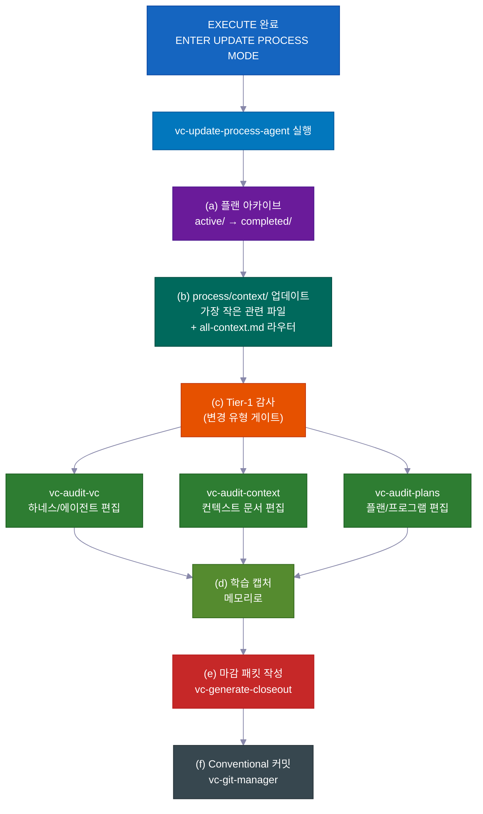

> 💡 `vc-update`는 미리 보기 diff를 보여주고 OK를 기다려요. `process/` 디렉토리와 프로젝트별 내용은 **절대** 조용히 변경되지 않아요. 설치를 두 번 실행해도 안전해요.

---

## 💡 그냥 동작하는 이유들

많은 작은 스마트한 기본값들이 쌓여서 덜 돌봐도 되고 비용이 낮아져요.

- **각 역할은 필요한 도구만 받아요.** 계획 중에는 에이전트가 말 그대로 코드를 편집할 수 없어요 — 그 도구들이 꺼져 있어요. 이것이 에이전트가 플랜이 승인되기 전에 앞서가서 것들을 바꾸는 걸 막아요. 시스템이 그냥 허용하지 않아요.

- **프리미엄 AI 모델을 중요한 곳에만 써요.** 코드 작성은 최상위 모델을 사용해요. 계획, 리서치, 리뷰, 확인은 모두 더 저렴하고 빠른 모델을 사용해요. 결과: 모든 것에 최상위 모델을 사용하는 것에 비해 비용이 대략 60–70% 낮아져요 — 중요한 작업에서 품질 손실 없이.

- **만들기 전에 위험한 추측을 테스트해요.** 에이전트가 무언가 작동할지 확신하지 못할 때 — 특정 API 동작, 라이브러리 기능, 인프라 가정 — 먼저 작은 실제 실험을 실행해요. 결과가 명확해요: 동작, 동작 안 함, 또는 불명확. 그 판정과 평이한 영어 노트가 플랜으로 바로 피드백돼요. 에이전트가 틀린 가정에 기반해서 시간을 낭비하지 않아요.

- **깔끔하고 의미 있는 세이브 포인트.** 변경이 깔끔하고 논리적인 청크로, 명확한 메시지와 함께 — 자동으로 커밋돼요. 히스토리가 읽기 쉽고 한 번에 한 조각씩 취소하기 쉬워요.

- **유용한 자동 리마인더.** 작은 내장 도우미들이 변경된 파일에 올바른 검사를 실행하고, 코드를 단순하게 유지하고, 적절한 커밋 메시지를 작성하는 것을 넛지해요. 여러분이 경찰 역할을 하지 않아도 품질이 높게 유지돼요.

- **자기 개선 루프를 독립적으로 실행할 수 있어요.** 플랜 검사와 테스트 수정을 구동하는 같은 "문제 찾고, 수정하고, 반복" 엔진이 지저분한 영역 — 스펙, 문서, 테스트, 오류 목록 — 에 독립적인 도구로도 동작해요. 그것을 사용하기 위해 완전한 기능 빌드가 필요하지 않아요.

- **워크플로우 규칙이 실제로 작동한다는 내장 증거.** 킷이 자체 테스트 스위트와 함께 출시돼요: 워크플로우 규칙이 올바르게 동작하는 것을 증명하는 알려진 좋은 예와 나쁜 예가 있는 검사 세트예요. 시스템이 스스로를 검사해요. 가드레일이 켜져 있다는 걸 믿을 필요가 없어요 — 검사를 실행하고 볼 수 있어요.

---

## 기여하기

기여를 환영해요! 가이드라인은 [CONTRIBUTING.md](../../CONTRIBUTING.md)를 참고해주세요.

<br>

**바로가기:**

- 🐛 [버그 신고](https://github.com/withkynam/vibecode-pro-max-kit/issues/new?template=1.bug_report.yml)
- 💡 [기능 요청](https://github.com/withkynam/vibecode-pro-max-kit/issues/new?template=2.feature_request.yml)
- ⚡ [스킬 제출](https://github.com/withkynam/vibecode-pro-max-kit/issues/new?template=3.skill_submission.yml)
- 🌐 [번역 추가](https://github.com/withkynam/vibecode-pro-max-kit/issues/new?template=5.translation.yml)

<br>

<a href="https://github.com/withkynam/vibecode-pro-max-kit/graphs/contributors">
  
</a>

<br>

### 🙏 크레딧

vibecode-pro-max-kit은 스펙 기반 개발 프레임워크와 자기 개선 컨텍스트 구성에 집중하며, 80개 이상의 스킬로 부풀리지 않아요. 도구는 적게, 구조는 더 많이.

---

## ⭐ Star History

<a href="https://star-history.com/#withkynam/vibecode-pro-max-kit&Date">
 <picture>
   <source media="(prefers-color-scheme: dark)" srcset="https://api.star-history.com/svg?repos=withkynam/vibecode-pro-max-kit&type=Date&theme=dark" />
   <source media="(prefers-color-scheme: light)" srcset="https://api.star-history.com/svg?repos=withkynam/vibecode-pro-max-kit&type=Date" />
   
 </picture>
</a>

---

## 📄 라이선스

MIT
