<p align="center">
  <a href="../../README.md">English</a> |
  <a href="README.zh-CN.md">简体中文</a> |
  <a href="README.ja-JP.md">日本語</a> |
  <a href="README.ko-KR.md">한국어</a> |
  <a href="README.vi-VN.md">Tiếng Việt</a> |
  <strong>Português</strong> |
  <a href="README.es.md">Español</a> |
  <a href="README.de.md">Deutsch</a> |
  <a href="README.fr.md">Français</a> |
  <a href="README.hi.md">हिंदी</a>
</p>

<div align="center">

<a href="https://flowser.ai">
  
</a>

*Feito por engenheiros de classe mundial, para vibecoders na*<br>
*[flowser.ai](https://flowser.ai) — Agentes de IA com computadores para GTM*

<br>

# vibecode-pro-max-kit

<br>

<p align="center">
  
  <br><br>
  <em>"Concentração Total — Respiração do Spec, Décima Forma: o Fluxo do Vibe nunca quebra."</em><br>
  <strong>— Tanjiro Kamado</strong>
</p>

*Instale em qualquer projeto. Seu agente de IA recebe um processo de desenvolvimento completo com planejamento obrigatório — 7 fases com portões de verificação, loops de autocorreção e piloto automático que executa do início ao fim sem perder o fio.*

<table align="center">
<tr>
<td width="50%" valign="top"><strong>📦 Instalação em um comando</strong><br>Uma linha de <code>curl</code> instala em qualquer projeto. Detecta se é novo ou retorno e nunca sobrescreve seus arquivos.</td>
<td width="50%" valign="top"><strong>🌐 Funciona em qualquer lugar</strong><br>Qualquer stack, qualquer linguagem e qualquer agente de IA — Claude Code, Codex, Cursor, Windsurf, Copilot e muito mais.</td>
</tr>
<tr>
<td valign="top"><strong>🧭 Fluxo de trabalho RIPER-5 com planejamento obrigatório</strong><br>7 fases com portões (Research → Spec → Innovate → Plan → Validate → Execute → Update-Process) impedem o agente de pular direto para o código.</td>
<td valign="top"><strong>🚀 Modo piloto automático (quick / fast / full)</strong><br>Inicie uma execução sem intervenção em qualquer fase com uma única frase. Três modos adequam a cerimônia ao risco.</td>
</tr>
<tr>
<td valign="top"><strong>🎯 <code>/goal</code> — o token de execução contínua</strong><br>Um bloco copiável mantém o agente rodando fase após fase sem parar — e retoma a execução em uma nova sessão.</td>
<td valign="top"><strong>🔁 Loops de autocorreção PVL + EVL</strong><br>Os loops de verificação e correção de plano e de testes encontram as lacunas, corrigem e reverificam sozinhos — até 10 ciclos cada.</td>
</tr>
<tr>
<td valign="top"><strong>🔍 vc-autoresearch</strong><br>Um loop reutilizável de encontrar lacunas → corrigir → repetir que você aponta para planos, testes, specs, docs ou avaliações.</td>
<td valign="top"><strong>🧪 Sondas de viabilidade</strong><br>Veredictos de testar-antes-de-construir (VIABLE / NOT-VIABLE) antes que o agente se comprometa com qualquer abordagem de design.</td>
</tr>
<tr>
<td valign="top"><strong>🎛️ Seletor inteligente de estratégia</strong><br>Antes de cada fase, avalia um agente vs. vários vs. uma equipe coordenada — com estimativas de custo — e escolhe o mais econômico que atende ao caso.</td>
<td valign="top"><strong>🧮 Uso inteligente de modelos</strong><br>O modelo mais caro só escreve código; o mais barato faz todo o resto. Menor custo, mesma qualidade.</td>
</tr>
<tr>
<td valign="top"><strong>🤔 Esclarecimento de intenção</strong><br>Quando um pedido é vago, o agente faz algumas perguntas objetivas logo de início em vez de adivinhar e construir a coisa errada.</td>
<td valign="top"><strong>🛡️ 36 validadores</strong><br>Verificações mecânicas de correção — não opiniões — protegem a estrutura do kit e detectam desvios antes de entrarem em produção.</td>
</tr>
<tr>
<td valign="top"><strong>🏗️ Programas de fases</strong><br>Projetos grandes são divididos em fases independentes com portões de qualidade entre elas, para que trabalhos grandes não desmoronem.</td>
<td valign="top"><strong>🔀 Programas que se reorganizam</strong><br>À medida que aprende, o agente insere novas fases, reordena o trabalho e pula etapas bloqueadas — o plano se adapta em tempo real.</td>
</tr>
<tr>
<td valign="top"><strong>🧠 Nunca perde o fio</strong><br>As anotações de progresso são gravadas em disco a cada fase, para que uma execução sobreviva a um reset de memória e continue exatamente de onde parou.</td>
<td valign="top"><strong>📚 Memória de projeto que melhora sozinha</strong><br>Aprende seu código-fonte na configuração e mantém suas notas compartilhadas atualizadas após cada entrega, para que a documentação nunca fique desatualizada.</td>
</tr>
<tr>
<td valign="top"><strong>⚡ Quick Fix + Fast Mode</strong><br>Modos leves para pequenas alterações pulam a cerimônia pesada, para que uma correção de uma linha continue sendo uma correção de uma linha.</td>
<td valign="top"><strong>🧱 Habilidades em camadas e com descoberta automática</strong><br>As habilidades são organizadas em camadas claras e descobertas automaticamente — o agente sempre encontra a ferramenta certa para a etapa.</td>
</tr>
<tr>
<td valign="top"><strong>🤖 15 agents · 33 skills · 10 hooks</strong><br>Uma equipe completa de agentes especializados, habilidades reutilizáveis e ganchos de segurança, todos integrados desde o início.</td>
<td valign="top"><strong>🔄 Ciclo de vida completo do kit</strong><br>Instalar, configurar, atualizar e publicar são, cada um, um único comando — mantendo todos os projetos na versão mais recente do kit com segurança.</td>
</tr>
<tr>
<td valign="top"><strong>📝 SPEC — sua aprovação em linguagem simples</strong><br>Antes de qualquer design, você descreve o que construir em histórias de usuário simples — o lugar mais barato para detectar mal-entendidos.</td>
<td valign="top"><strong>🎯 Sempre verifica sua intenção</strong><br>Cada fase posterior confronta com seu SPEC: o que estamos construindo é realmente o que você pediu?</td>
</tr>
</table>

<p>
  <a href="https://github.com/withkynam/vibecode-pro-max-kit/stargazers"></a>
  <a href="https://github.com/withkynam/vibecode-pro-max-kit/network/members"></a>
  <a href="LICENSE"></a>
  <a href="https://github.com/withkynam/vibecode-pro-max-kit/graphs/contributors"></a>
  <a href="https://github.com/withkynam/vibecode-pro-max-kit/actions/workflows/validate.yml"></a>
  <a href="CHANGELOG.md"></a>
  
  
  
  
</p>

<p>
  <strong>O kit de programação mais simples, flexível e amigável para equipes para</strong><br><br>
  <a href="https://github.com/anthropics/claude-code"></a>&nbsp;
  <a href="https://github.com/openai/codex"></a>&nbsp;
  <a href="https://cursor.com"></a>&nbsp;
  <a href="https://windsurf.com"></a><br>
  <a href="https://github.com/google-gemini/gemini-cli"></a>&nbsp;
  <a href="https://github.com/opencode-ai/opencode"></a>&nbsp;
  <a href="https://github.com/features/copilot"></a>
</p>

<p>
  <em>Funciona em qualquer stack, qualquer linguagem, qualquer projeto</em><br><br>
  <picture>
    <source media="(prefers-color-scheme: dark)" srcset="https://skillicons.dev/icons?i=ts%2Cjs%2Creact%2Cnextjs%2Cvue%2Cnuxt%2Csvelte%2Cangular%2Cnodejs%2Cexpress%2Cbun%2Cpython%2Cdjango%2Cflask%2Cfastapi&theme=dark&perline=15" />
    <source media="(prefers-color-scheme: light)" srcset="https://skillicons.dev/icons?i=ts%2Cjs%2Creact%2Cnextjs%2Cvue%2Cnuxt%2Csvelte%2Cangular%2Cnodejs%2Cexpress%2Cbun%2Cpython%2Cdjango%2Cflask%2Cfastapi&theme=light&perline=15" />
    
  </picture>
  <br>
  <picture>
    <source media="(prefers-color-scheme: dark)" srcset="https://skillicons.dev/icons?i=ruby%2Crails%2Cgo%2Crust%2Cjava%2Cspring%2Ckotlin%2Cswift%2Cphp%2Claravel%2Ccs%2Cdotnet%2Celixir%2Cgraphql%2Cprisma&theme=dark&perline=15" />
    <source media="(prefers-color-scheme: light)" srcset="https://skillicons.dev/icons?i=ruby%2Crails%2Cgo%2Crust%2Cjava%2Cspring%2Ckotlin%2Cswift%2Cphp%2Claravel%2Ccs%2Cdotnet%2Celixir%2Cgraphql%2Cprisma&theme=light&perline=15" />
    
  </picture>
  <br>
  <picture>
    <source media="(prefers-color-scheme: dark)" srcset="https://skillicons.dev/icons?i=supabase%2Cfirebase%2Cpostgres%2Cmongodb%2Credis%2Cdocker%2Ckubernetes%2Caws%2Cgcp%2Cazure%2Cvercel%2Ccloudflare%2Ctailwind%2Celectron&theme=dark&perline=15" />
    <source media="(prefers-color-scheme: light)" srcset="https://skillicons.dev/icons?i=supabase%2Cfirebase%2Cpostgres%2Cmongodb%2Credis%2Cdocker%2Ckubernetes%2Caws%2Cgcp%2Cazure%2Cvercel%2Ccloudflare%2Ctailwind%2Celectron&theme=light&perline=15" />
    
  </picture>
  <br>
  <p><em>Não é só enfeite. Quando você executa <code>vc-setup</code>, os agentes varrem seu código-fonte,<br>
  detectam sua stack e constroem grupos de conhecimento específicos do projeto que cada habilidade lê antes de trabalhar.<br>
  Outros kits trancam os agentes em uma linguagem — <code>rust-review-agent</code>, <code>python-linter</code> — inúteis em outros contextos.<br>
  Este se adapta a qualquer combinação acima e acumula conhecimento a cada entrega.</em></p>
</p>

</div>

---

## ⚡ Comece Agora — Um Comando, 30 Segundos

> **Pré-requisitos:** Node.js ≥ 22, git, bash (macOS / Linux / WSL; no Alpine: `apk add bash`).

**Existe apenas um comando, e ele funciona para todos.** Execute-o dentro da pasta do seu projeto. Ele detecta se você é novo ou se já usou antes, instala com segurança sem sobrescrever seus arquivos e *informa exatamente o que fazer a seguir.*

```bash
curl -fsSL https://raw.githubusercontent.com/withkynam/vibecode-pro-max-kit/main/install.sh | bash
```

Quando terminar, ele exibe uma de duas mensagens — **leia o final da saída e siga exatamente o que ela diz:**

<table>
<tr>
<td width="50%" valign="top">
<h3>🆕 Projeto novo</h3>
O instalador não detecta nenhum kit e exibe:
<br><br>
<code>Next: Run: claude → Say: "Run vc-setup"</code>
<br><br>
<strong>→ Abra seu agente e diga <code>Run vc-setup</code></strong>
<br><br>
<sub>O vc-setup detecta sua stack, cria a pasta <code>process/</code>, varre seu código-fonte e preenche sua arquitetura <em>real</em>, convenções e comandos de teste — uma conversa, não um checklist.</sub>
</td>
<td width="50%" valign="top">
<h3>🔄 Kit existente (atualização)</h3>
O instalador detecta uma instalação anterior e exibe:
<br><br>
<code>Next (upgrade detected): Run: claude → Say: "Run vc-update"</code>
<br><br>
<strong>→ Abra seu agente e diga <code>Run vc-update</code></strong>
<br><br>
<sub>O vc-update baixa a versão mais recente e, se encontrar planos ou pastas no formato antigo, fornece um prompt pronto para colar e concluir a migração com <strong>zero perda de dados</strong>. Sua pasta <code>process/</code> nunca é tocada.</sub>
</td>
</tr>
</table>

> 💡 **Você nunca precisa adivinhar o comando.** O `install.sh` te encaminha: novo → `vc-setup`, atualização → `vc-update`. Rodar o instalador novamente é sempre seguro — ele nunca quebra nada. **Usuários do Codex:** execute `/vc-setup` (ou `/vc-update`) em vez de digitar no chat.

<br>

<details>
<summary><strong>📦 O que o instalador coloca no disco (não destrutivo)</strong></summary>

<br>

```
your-project/
├── .claude/
│   ├── agents/              # 🤖 15 agent definitions (.md)
│   ├── skills/              # ⚡ 33 skills (each a dir with SKILL.md)
│   └── hooks/               # 🪝 10 lifecycle hooks (.cjs / .mjs)
├── .codex/agents/           # 🔄 Mirrored agents for Codex
├── .agents/skills →         # 🔗 Symlink to .claude/skills (Codex discovery)
├── CLAUDE.md                # 📋 Orchestrator + routing rules
├── AGENTS.md                # 📖 Agent + skill registry (cross-tool)
└── process/
    └── development-protocols/  # 📜 22 shared workflow docs (seeded by install)
                                #    context/, plans, features → built by vc-setup
```

- **Não destrutivo.** Seus `.claude/skills/`, `.claude/agents/`, `process/` e `settings.json` existentes nunca são apagados. Apenas os arquivos pertencentes ao kit são escritos ou atualizados.
- **Configuração existente?** Salva em `.vibecode-backup/`; seu `settings.json` é restaurado em seguida.
- **`CLAUDE.md` existente?** Salvo como `CLAUDE.md.pre-vibecode`.
- **`process/` existente?** Nunca tocado pelo instalador — o `vc-setup` / `vc-update` o migra de forma interativa, mostrando o diff antes.

> **Aviso para a primeira instalação:** se você tem habilidades ou agentes personalizados cujos nomes começam com `vc-` (o namespace reservado do kit) e *nunca* executou o instalador antes, a etapa de remoção de arquivos obsoletos pode sinalizá-los. Após a instalação, execute `ls .claude/skills/ .claude/agents/` para confirmar. Use um prefixo que não seja `vc-` (`my-`, `team-`, `proj-`) em suas adições para evitar isso por completo.

</details>

<details>
<summary><strong>🤖 Prefere conduzir a configuração pelo seu agente? (prompt completo)</strong></summary>

<br>

> Abra o Claude Code ou o Codex **com a pasta do seu projeto como diretório de trabalho** e cole:

```
First, install the vibecode-pro-max-kit agent harness by running this command:

curl -fsSL https://raw.githubusercontent.com/withkynam/vibecode-pro-max-kit/main/install.sh | bash

After install completes, run vc-setup and follow the full interactive flow:

1. DETECT — Read package.json (or go.mod, Cargo.toml, pyproject.toml, etc.), detect my
   stack: framework, package manager, monorepo structure, test framework, database, auth.
   Also check for any existing .claude/, process/, or context files.
2. SHOW ME WHAT YOU FOUND — Summarize detection and wait for me to confirm. If this is an
   existing project, tell me what looks good vs what could be improved.
3. ASK ME ABOUT THE PROJECT — Have a real conversation. Ask follow-ups, probe anything
   vague, keep going until you genuinely understand it. Summarize back and confirm.
4. SCAFFOLD — Create the process/ directory. If process/ already exists, show me the plan
   and wait for approval. Never silently move or delete my files.
5. STUDY — Deep-scan and populate process/context/all-context.md with REAL content: repo
   structure, stack + versions, patterns, import aliases, env vars, routes, schema, tests.
   No placeholder text.
6. VALIDATE — Run all validation checks to confirm everything is wired correctly.

Rules: read and preserve good existing context; show me a summary before each major change
and wait for my OK; never create empty placeholder files; ask before reorganizing.
```

</details>

<details>
<summary>Índice</summary>

- [Visão Geral](#-visão-geral) · [O Problema](#-o-problema) · [A Solução](#-a-solução)
- [A Revolução do Vibe Coding](#a-revolução-do-vibe-coding) · [Para Quem é Este Kit](#para-quem-é-este-kit) · [Como se Compara](#como-se-compara) · [O que Torna Este Kit Diferente](#-o-que-torna-este-kit-diferente)
- [Como Funciona: O Coordenador](#-como-funciona--o-coordenador) · [O Ciclo de Vida RIPER-5](#-o-ciclo-de-vida-riper-5) · [Esclarecimento de Intenção](#-esclarecimento-de-intenção)
- [Os Dois Loops de Qualidade (PVL + EVL)](#-os-dois-loops-de-qualidade--pvl--evl) · [Comparação de Estratégias + Política de Modelos](#-comparação-de-estratégias--política-de-modelos) · [Modo Piloto Automático](#-modo-piloto-automático--riper-5-sem-intervenção) · [Sondas de Viabilidade + Validadores](#-sondas-de-viabilidade--a-rede-de-segurança-de-validadores)
- [Sistemas de Segurança Integrados](#-sistemas-de-segurança-integrados) · [Inteligência Pré-Implementação](#-inteligência-pré-implementação) · [Pipeline de Qualidade](#-pipeline-de-qualidade--integrado-à-execução)
- [Ciclo de Vida do Plano](#-o-ciclo-de-vida-do-plano) · [Programas de Fases](#-programas-de-fases--projetos-grandes-que-não-desmoronam) · [Grupos de Contexto](#-grupos-de-contexto) · [Pastas de Funcionalidades](#-pastas-de-funcionalidades) · [Camadas de Habilidades](#-camadas-de-habilidades) · [Memória que Melhora Sozinha](#-memória-de-projeto-que-melhora-sozinha)
- [O que Está Incluído](#-o-que-está-incluído) · [Quick Fix + Fast Mode](#-quick-fix--fast-mode) · [Ciclo de Vida do Kit](#-ciclo-de-vida-do-kit-install--setup--update--publish) · [Como Contribuir](#como-contribuir)

</details>

---

## 🎁 Visão Geral

<table>
<tr>
<td align="center" width="25%" valign="top"><h1>🤖</h1><h3>15</h3><strong>Agents</strong><br><sub>Um por fase + 6 agentes especialistas</sub></td>
<td align="center" width="25%" valign="top"><h1>⚡</h1><h3>33</h3><strong>Skills</strong><br><sub>20 de fluxo de trabalho + 13 auxiliares, ativados por palavra-chave</sub></td>
<td align="center" width="25%" valign="top"><h1>🪝</h1><h3>10</h3><strong>Hooks</strong><br><sub>Trilhos de segurança + carregamento automático de contexto</sub></td>
<td align="center" width="25%" valign="top"><h1>📜</h1><h3>22</h3><strong>Protocolos</strong><br><sub>Regras compartilhadas que todos os agentes seguem</sub></td>
</tr>
<tr>
<td align="center" width="25%" valign="top"><h1>🛡️</h1><h3>36</h3><strong>Validadores</strong><br><sub>Verificações automáticas que detectam erros antes de entrarem em produção</sub></td>
<td align="center" width="25%" valign="top"><h1>🔧</h1><h3>7</h3><strong>Ferramentas</strong><br><sub>Claude Code · Codex · Cursor · Windsurf · Antigravity · OpenCode · Copilot</sub></td>
<td align="center" width="25%" valign="top"><h1>🌍</h1><h3>10</h3><strong>Idiomas</strong><br><sub>EN · 中文 · 日本語 · 한국어 · VI · PT · DE · FR · ES · हिन्दी</sub></td>
<td align="center" width="25%" valign="top"><h1>⚡</h1><h3>30s</h3><strong>Instalação</strong><br><sub>Um comando, depois seu agente guia o restante</sub></td>
</tr>
<tr>
<td align="center" width="25%" valign="top"><h1>🛩️</h1><strong>Piloto automático</strong><br><sub>3 modos (quick / fast / full) — inicia em qualquer fase, roda do início ao fim sem parar</sub></td>
<td align="center" width="25%" valign="top"><h1>📌</h1><strong>Blocos /goal</strong><br><sub>Textos curtos e copiáveis que retomam execuções sem intervenção entre sessões após um reset</sub></td>
<td align="center" width="25%" valign="top"><h1>🔁</h1><strong>vc-autoresearch</strong><br><sub>Loop de encontrar lacunas → corrigir → repetir (ferramenta compartilhada para planos, testes e avaliações)</sub></td>
<td align="center" width="25%" valign="top"><h1>🔬</h1><strong>Sondas de viabilidade</strong><br><sub>Veredictos de testar-antes-de-construir (VIABLE / NOT-VIABLE) antes de definir um design</sub></td>
</tr>
</table>

---

## 🔥 O Problema

Você pede ao Claude para "adicionar suporte a webhook." Ele começa a escrever código imediatamente. Nenhuma pergunta sobre sua arquitetura. Nenhuma verificação dos padrões existentes. Sem plano. Você recebe 400 linhas que não se encaixam no seu código, e passa uma hora corrigindo.

**Mas isso é só a superfície.** Os problemas mais profundos doem mais:

<table>
<tr>
<td width="50%" valign="top">
<h1>🧠</h1>
<strong>O contexto morre a cada sessão</strong><br><br>
Seu agente esquece tudo que aprendeu. Mesmos erros, mesmas perguntas, toda vez. Sem memória, sem conhecimento acumulado.
</td>
<td width="50%" valign="top">
<h1>📄</h1>
<strong>A documentação fica obsoleta na hora</strong><br><br>
Você escreveu ótimos documentos de contexto na semana passada. Já estão desatualizados. Nada os atualiza automaticamente conforme o código evolui.
</td>
</tr>
<tr>
<td width="50%" valign="top">
<h1>💥</h1>
<strong>Tarefas grandes desmoronam no meio</strong><br><br>
A janela de contexto enche, o estado se perde, o agente começa a alucinar. Você recomeça do zero na terceira hora.
</td>
<td width="50%" valign="top">
<h1>🤝</h1>
<strong>Sem specs, sem revisão, sem colaboração</strong><br><br>
Seu PM não consegue revisar o que o agente está prestes a construir. Não há plano escrito para compartilhar, discutir ou aprovar antes de o código ser escrito.
</td>
</tr>
<tr>
<td width="50%" valign="top">
<h1>🎭</h1>
<strong>Decisões de arquitetura são inventadas</strong><br><br>
O agente inventa padrões em vez de pesquisar como outros projetos resolveram o mesmo problema.
</td>
<td width="50%" valign="top">
<h1>🚀</h1>
<strong>Nada verifica se está "pronto"</strong><br><br>
O agente diz "todos os testes passaram" — mas nunca os reexecutou de forma independente. Você descobre isso em produção.
</td>
</tr>
</table>

**Seu agente tem inteligência, mas não tem processo, não tem memória e não tem como colaborar com sua equipe.** Seja você um desenvolvedor, um PM ou um CEO que acabou de começar a vibe code — isso afeta a todos da mesma forma, e a solução é a mesma: **dê ao seu agente um processo de desenvolvimento real.**

---

## 🛠️ A Solução

Este kit instala um sistema de desenvolvimento completo no seu projeto — não apenas um `CLAUDE.md`, mas **15 agentes especializados, 33 habilidades, 10 hooks e 22 protocolos** — com um fluxo de trabalho travado por etapas que faz seu agente **entender antes de construir, e provar antes de entregar.**

<br>

<table>
<tr>
<td align="center" width="50%" valign="top"><h1>📋</h1><strong>Abordagem com planejamento obrigatório</strong><br><br><sub>PMs e desenvolvedores revisam o mesmo plano escrito antes de qualquer código ser escrito</sub></td>
<td align="center" width="50%" valign="top"><h1>🔄</h1><strong>Conhecimento que melhora sozinho</strong><br><br><sub>Se atualiza toda vez que uma funcionalidade é entregue — a documentação nunca fica obsoleta</sub></td>
</tr>
<tr>
<td align="center" width="50%" valign="top"><h1>⚡</h1><strong>Execução sem intervenção</strong><br><br><sub>Sobrevive a resets de sessão — roda por horas, não minutos</sub></td>
<td align="center" width="50%" valign="top"><h1>🧬</h1><strong>Pesquisa de arquitetura</strong><br><br><sub>Estuda projetos reais antes de tomar decisões de design</sub></td>
</tr>
<tr>
<td align="center" width="50%" valign="top"><h1>✅</h1><strong>Duas verificações de qualidade</strong><br><br><sub>Os planos são verificados antes de codificar; os testes são reexecutados de forma independente depois</sub></td>
<td align="center" width="50%" valign="top"><h1>🧭</h1><strong>Roteamento inteligente de conhecimento</strong><br><br><sub>Carrega apenas o que é relevante — não toda a sua base de conhecimento toda vez</sub></td>
</tr>
</table>

<br>

### O fluxo RIPER-5 completo — 7 fases, cada etapa com portão

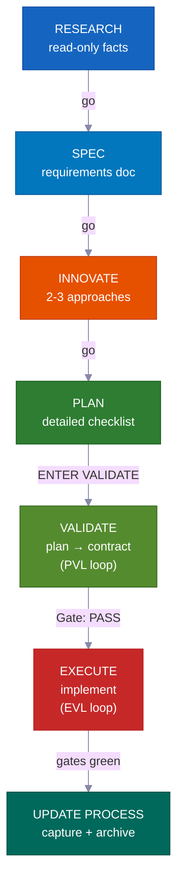

**No modo interativo**, cada fase aguarda seu "go" antes de avançar — você permanece no controle em cada etapa. **No modo piloto automático ou /goal**, você aprova uma vez no início e o sistema se conduz até o fim. Ele para apenas para três hard stops específicos listados abaixo. **VALIDATE** e o reteste pós-EXECUTE não são opcionais — são portões rígidos que bloqueiam trabalho ruim de entrar em produção — e são executados automaticamente em ambos os modos.

---

## A Revolução do Vibe Coding

<div align="center">
<h3><em>"A linguagem de programação mais quente do momento é o inglês."</em></h3>
<strong>— Andrej Karpathy</strong>
</div>

<br>

**O vibe coding mudou quem pode construir software. O desenvolvimento com planejamento obrigatório muda o que eles conseguem entregar.**

<table>
<tr>
<td align="center" width="50%"><h3>63%</h3><sub>dos usuários de vibe coding <strong>NÃO</strong> são desenvolvedores</sub></td>
<td align="center" width="50%"><h3>16,2M</h3><sub>desenvolvedores cidadãos no mundo<br>(crescimento de 38% ao ano)</sub></td>
</tr>
<tr>
<td align="center" width="50%"><h3>$4,7B</h3><sub>mercado de vibe coding<br>crescendo 38% ao ano</sub></td>
<td align="center" width="50%"><h3>25%</h3><sub>das startups do YC W25 tinham bases de código com 95%+ gerado por IA</sub></td>
</tr>
</table>

A maioria das ferramentas te ajuda a *começar* um projeto. Este kit te ajuda a **terminá-lo** — com planos que sua equipe pode revisar, conhecimento que nunca fica desatualizado e verificações de segurança que detectam erros antes de entrarem em produção.

---

## Para Quem é Este Kit?

<div align="center">
<h3><em>"O que importa não é quem digitou. É o que foi entregue."</em></h3>
<strong>— Garry Tan, YC</strong>
</div>

<br>

<table>
<tr>
<td width="50%" valign="top">
<h1>🧑‍💼</h1>
<strong>CEO / Fundador</strong><br><br>
<em>"Crie um SaaS com autenticação, cobrança e uma landing page"</em><br><br>
O agente pesquisa sua stack, escreve um plano de arquitetura que você pode revisar, implementa com testes e registra cada decisão para seu cofundador técnico auditar depois.
</td>
<td width="50%" valign="top">
<h1>📊</h1>
<strong>Product Manager</strong><br><br>
<em>"Crie um dashboard mostrando MRR, churn e métricas de crescimento"</em><br><br>
Ele gera um SPEC no estilo PRD, obtém sua aprovação antes de escrever código, implementa conforme o spec e arquiva o plano como histórico de projeto pesquisável.
</td>
</tr>
<tr>
<td width="50%" valign="top">
<h1>🎨</h1>
<strong>Designer</strong><br><br>
<em>"Reproduza esta captura do Figma com perfeição pixel a pixel"</em><br><br>
O agente com consciência de design analisa seu mockup, implementa componente por componente com seus tokens de design e aciona verificações de comparação visual.
</td>
<td width="50%" valign="top">
<h1>⚙️</h1>
<strong>Engenheiro</strong><br><br>
<em>"Refatore o módulo de autenticação para suportar RBAC com zero downtime"</em><br><br>
Ele pesquisa seu código de autenticação atual e como outros projetos resolveram RBAC, escreve um plano de migração que mapeia quais arquivos podem ser afetados e constrói com segurança, com notas de rollback.
</td>
</tr>
</table>

---

## Como se Compara

| Funcionalidade | vibecode-pro-max-kit | Superpowers | GSD | gstack |
|---------|---------------------|-------------|-----|--------|
| Ciclo de vida com planejamento obrigatório | RIPER-5 completo (research → spec → innovate → plan → validate → execute → update) | Fluxos obrigatórios | Correção de context-rot | Parcial |
| Segurança por etapas travadas | Ferramentas do agente restritas por fase (research somente leitura, sem escrita no innovate) | Restrições baseadas em habilidades | Separação de fases | Nenhuma |
| Loops de verificação de qualidade | **Dois** — PVL (verificar o plano) + EVL (reexecutar testes de forma independente) | Por habilidade | Nenhum automático | Nenhum |
| Suporte a múltiplas ferramentas | 7 ferramentas via padrões abertos `AGENTS.md` + `SKILL.md` | Plugin Claude Code | 14 runtimes | 1 ferramenta |
| Conhecimento que melhora sozinho | Conhecimento agrupado por tema, atualizado após cada funcionalidade | Memória por plugin | Estado persistido em disco | Manual |
| Colaboração em equipe | Planos, specs e arquivos de revisão compartilhados | Individual | Individual | Individual |
| Sistema de habilidades | 33 com descoberta automática e ativação por palavra-chave em cada prompt | 86 habilidades combináveis | Meta-prompting | 23 ferramentas de papel |
| Projetos grandes multifase | Planos guarda-chuva + loop interno por fase com verificações de regressão | Tarefa única | Tarefa única | Tarefa única |
| Modo sem intervenção | Piloto automático (3 modos) + consentimento permanente `/goal` | Manual | Manual | Manual |
| Instalação | `curl` em 30s + configuração com roteamento automático | Marketplace de plugins | npx em uma linha | git clone |

> **Sobre abrangência de runtimes:** o GSD suporta 14 runtimes. Nós suportamos 7 com profundidade — com kits completos de agentes, descoberta de habilidades e hooks de ciclo de vida em cada plataforma. Abrangência vs. profundidade: você escolhe.

---

## ⚡ O que Torna Este Kit Diferente

<table>
<tr>
<td width="50%" valign="top">
<h1>🔒</h1>
<strong>Restrições de Ferramentas por Etapa Travada</strong><br><br>
Seu agente literalmente <strong>não consegue</strong> escrever código durante a pesquisa. RESEARCH é somente leitura, INNOVATE não tem Write, PLAN/VALIDATE só escrevem em <code>process/</code>. <strong>Limites de capacidade reais</strong>, não apenas sugestões.
</td>
<td width="50%" valign="top">
<h1>🎯</h1>
<strong>O Agente Principal Nunca Toca no Código</strong><br><br>
O coordenador roteia, monitora e conduz loops — ele <strong>nunca edita arquivos-fonte nem executa testes por conta própria</strong>. Cada edição e cada execução de teste acontece dentro de um subagente dedicado. Sem trabalho oculto.
</td>
</tr>
<tr>
<td width="50%" valign="top">
<h1>🔍</h1>
<strong>Descoberta Automática de Habilidades</strong><br><br>
Antes de atender qualquer solicitação, ele varre <strong>33 habilidades</strong> e faz correspondência por palavras-chave. Diga "adicionar suporte a webhook" e <code>vc-security</code> + <code>vc-scenario</code> são ativados automaticamente.
</td>
<td width="50%" valign="top">
<h1>💾</h1>
<strong>Sobrevive a Resets de Sessão</strong><br><br>
Planos, relatórios, documentos de conhecimento e aprendizados vivem em disco. O hook de inicialização restaura os portões de aprovação após um reset de sessão. <strong>Nada se perde.</strong>
</td>
</tr>
<tr>
<td width="50%" valign="top">
<h1>🛡️</h1>
<strong>Guarda de Etapa Autopoliciada</strong><br><br>
Quando o agente está prestes a pular uma etapa obrigatória, ele se detém: <em>"PHASE JUMPING PREVENTED."</em> Uma <strong>proteção integrada contra atalhos</strong>.
</td>
<td width="50%" valign="top">
<h1>🔄</h1>
<strong>Funciona em 7 Ferramentas de IA para Código</strong><br><br>
Dois padrões abertos — <code>AGENTS.md</code> e <code>SKILL.md</code> — significam <strong>zero adaptadores, zero plugins.</strong> Comece no Claude Code, mude para o Cursor, continue no Codex.
</td>
</tr>
</table>

---

## 🧭 Como Funciona — O Coordenador

Sua sessão principal é um **coordenador** (chamado de orquestrador), não um trabalhador. Ele faz quatro coisas e nada mais:

```
Sua solicitação
  → Step 0: Skill Discovery (scan 33 skills, match keywords, attach candidates)
  → Detectar intenção (funcionalidade / bug / pergunta / refatoração / UI) + pontuar ambiguidade
  → Rotear para o agente certo em uma janela de contexto nova
  → Monitorar: conformidade de etapas, códigos de status, condução de loops
```

<table>
<tr>
<td width="50%" valign="top">
<h1>🧑‍✈️</h1>
<strong>Ele delega, nunca implementa</strong><br><br>
Research → <code>vc-research-agent</code>. Plan → <code>vc-plan-agent</code>. Código → <code>vc-execute-agent</code>. O coordenador repassa o contexto certo e aguarda — ele nunca faz o trabalho real por conta própria.
</td>
<td width="50%" valign="top">
<h1>🚫</h1>
<strong>Sem execução oculta — nunca</strong><br><br>
No momento em que existe um plano com um checklist acordado, "ENTER EXECUTE MODE" <strong>sempre</strong> lança o <code>vc-execute-agent</code>. Até uma correção de uma linha passa por ele. Os testes só rodam dentro de um <code>vc-tester</code> dedicado. Isso vale independentemente do tamanho da mudança.
</td>
</tr>
<tr>
<td width="50%" valign="top">
<h1>📨</h1>
<strong>Códigos de status claros, não sinais vagos</strong><br><br>
Todo subagente termina com um de: <code>DONE</code> · <code>DONE_WITH_CONCERNS</code> · <code>BLOCKED</code> · <code>NEEDS_CONTEXT</code>. O coordenador nunca ignora um bloqueio e nunca tenta a mesma abordagem bloqueada três vezes.
</td>
<td width="50%" valign="top">
<h1>🔁</h1>
<strong>Ele conduz os loops de correção</strong><br><br>
Os subagentes rodam uma vez, reportam um resultado e param. Apenas o coordenador os relança. Ele conduz tanto o loop PVL (verificação-correção de plano) quanto o EVL (verificação-correção de testes) e possui todo o rastreamento.
</td>
</tr>
</table>

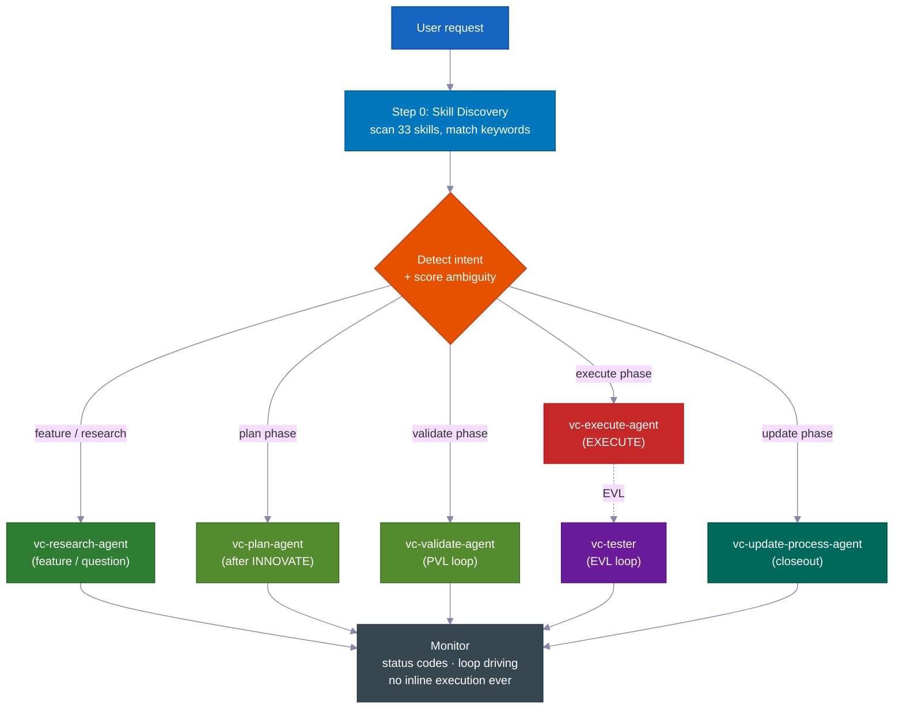

> **Por que isso importa:** um agente que pode tanto decidir *quanto* editar secretamente sempre encontra formas de pular o plano. Ao separar o coordenador dos trabalhadores (subagentes), o processo se torna estruturalmente honesto — a única forma de escrever código é passar pelas etapas obrigatórias.

---
## 📊 O Ciclo de Vida RIPER-5

| Fase | O que acontece | Agente | Você diz |
|-------|-------------|-------|---------|
| 🔍 **RESEARCH** | Coleta de informações somente leitura — base de código + web. Nunca modifica arquivos. | `vc-research-agent` | *(automático em pedidos de funcionalidade)* |
| 📝 **SPEC** | Documento de requisitos de descoberta de produto — histórias de usuário, critérios de aceitação, fora de escopo — **para sua revisão antes de qualquer design**. | `vc-spec-agent` | `go` / `ENTER SPEC MODE` |
| 💡 **INNOVATE** | Exploração de 2 a 3 abordagens com trade-offs. Resumo da decisão (escolhida + rejeitadas + justificativa). | `vc-innovate-agent` | `go` |
| 📋 **PLAN** | Escreve a especificação detalhada: pontos de contato, contratos públicos, quais arquivos pode tocar, evidências de verificação, entregável de retomada. | `vc-plan-agent` | `go` |
| ✅ **VALIDATE** | Transforma o plano em uma lista de verificação acordada (checkpoints V1–V7). Veredicto: **PASS / CONDITIONAL / BLOCKED**. Executa o loop PVL. | `vc-validate-agent` | `ENTER VALIDATE MODE` |
| ⚡ **EXECUTE** | Implementa *exatamente* o plano. Notas de progresso no relatório de fase, protocolo de desvio, auto-revisão. Em seguida, o loop EVL re-executa os checkpoints. | `vc-execute-agent` | `ENTER EXECUTE MODE` |
| 🧠 **UPDATE PROCESS** | Registra aprendizados, atualiza contexto, arquiva o plano, escreve o pacote de encerramento. | `vc-update-process-agent` | *(recomendado após trabalho não trivial)* |

> 📝 **Por que SPEC é uma fase própria:** a maioria dos sistemas pula de "entender" para "projetar". Inserir uma etapa de SPEC de descoberta de produto significa que *você* (ou seu gerente de produto) aprova **o quê** está sendo construído — em histórias de usuário e critérios de aceitação simples — *antes* de o agente debater **como**. É o momento mais barato possível para corrigir um mal-entendido. (No loop interno de um programa de fases, o SPEC é omitido — o SPEC geral governa todas as fases.)
>
> **O SPEC é a régua de medição.** Ele descreve o comportamento esperado em termos simples que você consegue revisar em um minuto. Toda fase seguinte — Innovate, Plan, Validate, Execute — volta a ele e faz a mesma pergunta: *o que estamos construindo é realmente o que você pediu?* Quando o trabalho começa a desviar, o SPEC é o que detecta isso.

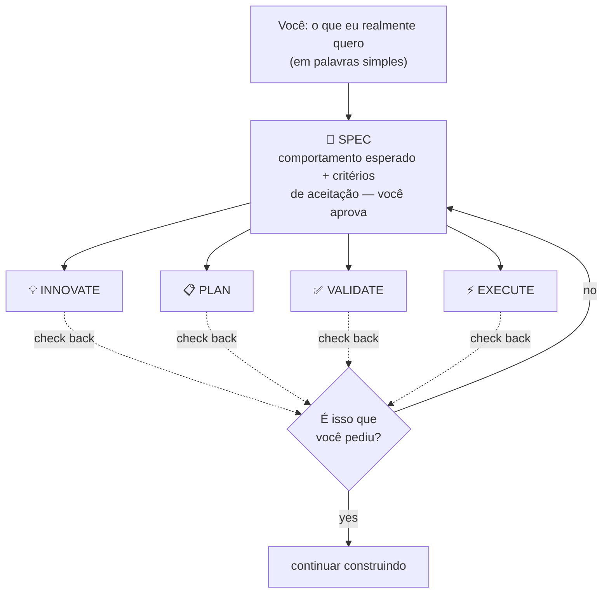

<br>

### 💻 Exemplos de sessões

```
# 🆕 Feature request
You: "add webhook support to the API"
→ Skill discovery surfaces: vc-scenario, vc-security
→ research-agent gathers context (read-only, can't touch code)
→ "go" → spec-agent writes requirements doc → you approve
→ "go" → innovate-agent compares approaches → decision summary
→ "go" → plan-agent writes the plan, listing which files it will touch
→ "ENTER VALIDATE MODE" → validate-agent gates the plan (PVL loop) → Gate: PASS
→ "ENTER EXECUTE MODE" → execute-agent implements → tester re-runs gates (EVL) → reviewer → git-manager
→ Closeout packet: what changed, what's verified, recommended next step
```

```
# 🐛 Bug fix
You: "login redirect is broken"
→ Routes to vc-debugger → gathers evidence FIRST → 2-3 competing hypotheses
→ Systematically eliminates each → root cause with proof chain
→ execute-agent implements the fix → EVL re-test → quality pipeline
```

```
# ⏩ Fast mode
You: "ENTER FAST MODE - add rate limiting middleware"
→ Compressed RESEARCH + SPEC + INNOVATE + PLAN + VALIDATE in one pass
→ Mandatory safety pause after VALIDATE → you review → "ENTER EXECUTE MODE"
```

```
# 🤖 Autopilot (hands-free)
You: "autopilot full: build a notifications system"
→ ONE consolidated clarification round → provisional /goal block (standing consent)
→ Drives the full RIPER-5 sequence autonomously, pausing only on hard stops
```

```
# 🏗️ Large program
You: "build a full testing platform"
→ Umbrella plan + phase plans in a feature folder
→ Each phase inner loop: research → innovate → plan → PVL → execute → EVL → update
→ Progress survives context compaction — durable reports on disk
```

---

## 🎯 Clarificação de Intenção

Antes de encaminhar, o agente principal avalia a ambiguidade do seu pedido em **4 sinais binários (0–4)** e escolhe um nível. Ele faz perguntas *somente quando elas mudariam o que ele fará.*

| Nível | Quando | Comportamento |
|---|---|---|
| **Nível 0** — encaminhamento silencioso automático | Pontuação 0–1, ou você disse "go" / "just do it", ou retomando um plano | Encaminha imediatamente, sem perguntas |
| **Nível 1** — resumo inline | Pontuação 2 | Declara seu entendimento + rota escolhida em uma linha, depois prossegue |
| **Nível 2** — perguntas | Pontuação 3+ | Faz perguntas de múltipla escolha focadas antes de encaminhar |

> 🧠 **No máximo duas rodadas.** Se ainda não estiver claro após o Nível 2, ele faz uma última pergunta direta e, depois, recorre ao agente de pesquisa com o escopo mais restrito possível. Ele nunca fica em um loop de clarificação infinito. Após a RESEARCH, ele verifica novamente a intenção — se a pesquisa mostrar que o pedido era diferente do que foi assumido, ele reapresenta; se confirmado, prossegue sem perguntar de novo.

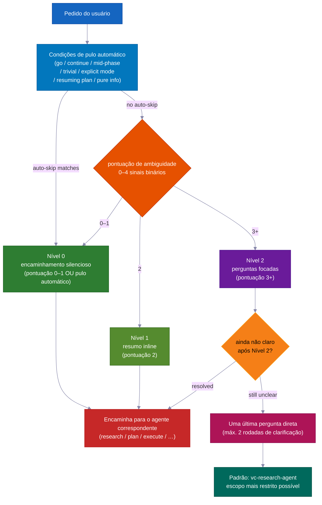

---

## ✅ Os Dois Loops de Qualidade — PVL + EVL

A maioria dos sistemas verifica *uma vez*, quando verifica. Este envolve o EXECUTE em **dois loops independentes** — um antes do código ser escrito, outro depois.

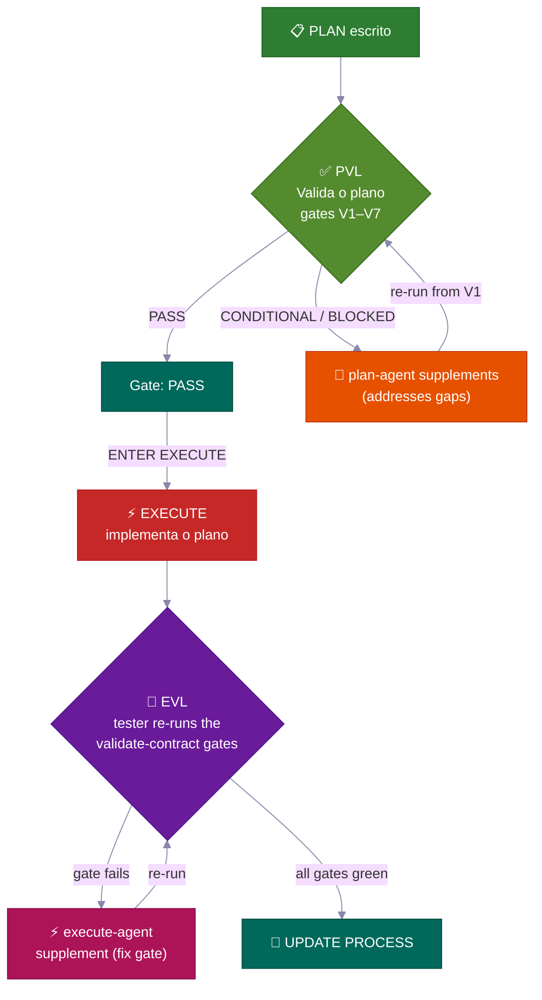

<table>
<tr>
<td width="50%" valign="top">
<h3>📋 PVL — Plan-Validate-Fix</h3>
Antes do EXECUTE, <code>vc-validate-agent</code> submete o plano a <strong>checkpoints V1–V7</strong> — distribuindo o trabalho entre vários agentes para cobrir infraestrutura, cobertura de testes, mudanças que quebram compatibilidade, segurança e viabilidade por seção. Um resultado <strong>CONDITIONAL</strong> ou <strong>BLOCKED</strong> na primeira passagem nunca é o fim — ele retorna ao <code>vc-plan-agent</code> para atualizar o plano e então re-verifica desde o V1.
<br><br>
<sub>Controlado por <code>vc-autoresearch</code> (domain: plan) — um loop de encontrar-lacunas-e-corrigir. Limite de 10 ciclos. Detecção de platô. Apenas <strong>Gate: PASS</strong> (ou um CONDITIONAL que você aceitar explicitamente) libera o EXECUTE.</sub>
</td>
<td width="50%" valign="top">
<h3>🧪 EVL — Execute-Validate-Fix</h3>
Após o EXECUTE reportar conclusão — <strong>mesmo quando afirma que todos os checkpoints estão verdes</strong> — o agente principal <strong>sempre</strong> aciona <code>vc-tester</code> para re-executar de forma independente exatamente os comandos de teste da lista acordada. Um checkpoint com falha é encaminhado para uma correção pontual no <code>vc-execute-agent</code> e então re-testado.
<br><br>
<sub>Controlado por <code>vc-autoresearch</code> (domain: tests). Limite de 10 ciclos. O próprio loop interno "iterar até ficar verde" do execute-agent <strong>nunca</strong> substitui essa confirmação independente.</sub>
</td>
</tr>
</table>

> 💎 **A escada de veredictos:** **PASS** → prosseguir · **CONDITIONAL** → lacunas corrigíveis; o loop é acionado (ou você as aceita como registro) · **BLOCKED** → problema mais profundo; retorna ao PLAN (em modo autopilot: a lacuna vai para um backlog e a execução continua).

### 🔁 vc-autoresearch — Motor Compartilhado dos Loops

Tanto o PVL quanto o EVL usam a mesma camada de rastreamento: **`vc-autoresearch`** — um loop de encontrar-lacunas → corrigir → repetir. O agente principal conduz o loop — ele é responsável pelo contador de rodadas, relatórios por rodada, registro TSV e verificações de platô/limite/regressão. Os agentes trabalhadores são acionados e encerrados: retornam um resultado e param. Nenhum agente se re-aciona nem aciona outro agente de fase.

O mesmo motor pode funcionar de forma independente: "fortaleça esta especificação", "corrija todo o lint", "melhore a cobertura de testes", "melhore esta documentação" — qualquer tarefa repetida de encontrar-lacunas-e-corrigir em 6 domínios (spec · tests · ux · docs · plan · errors).

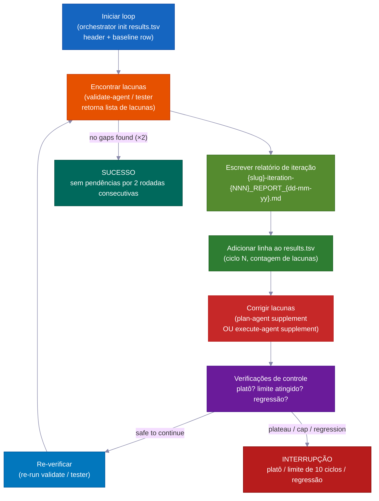

| Modo | Faz | Para quando |
|---|---|---|
| `vc-autoresearch` (núcleo) | encontrar lacunas → corrigir → repetir | nenhuma lacuna encontrada OU meta de métrica atingida |
| `vc-autoresearch:probe` | 8 personas interrogam o corpus até saturação | nenhuma nova restrição por 3 rodadas |
| `vc-autoresearch:reason` | debate adversarial com juízes independentes | juízes convergem ou limite de iterações |
| `vc-autoresearch:evals` | analisa resultados TSV — tendências, platôs, recomendações | somente análise |

**Condições de parada:** SUCESSO (sem pendências por duas rodadas consecutivas) · HALT_PLATEAU (sem progresso por 3 rodadas) · HALT_CAP (limite rígido de 10 rodadas) · HALT_REGRESSION (uma verificação que estava passando agora falha).

---

## 👥 Comparação de Estratégias + Política de Modelos

A cada **transição de fase**, o agente principal aciona `vc-agent-strategy-compare` para recomendar *como* executar a próxima fase — com estimativas de custo.

| Estratégia | Quando | Coordenação |
|---|---|---|
| **Sequencial** | O trabalho depende da saída anterior | Um agente por vez |
| **Subagentes paralelos** | Dimensões independentes, acionados e encerrados | Nenhuma — o agente principal coleta e combina os resultados |
| **Workflow** | Divisão previsível do trabalho em uma lista | Etapas roteirizadas |
| **Equipe de agentes** | Os agentes precisam se comunicar entre si durante a execução (ex.: cada um toca arquivos separados em 3+ planos de fase) | TeamCreate + lista de tarefas compartilhada + SendMessage |

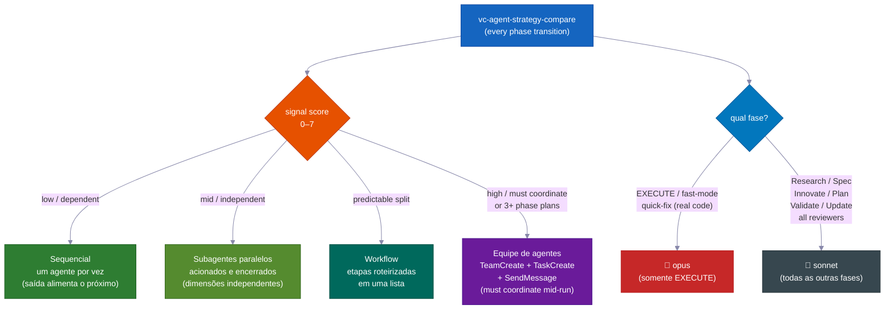

> ⚠️ **"Equipe de agentes" significa a maquinaria real** — colegas com nomes definidos, uma lista de tarefas compartilhada e troca de mensagens entre agentes — *não* agentes paralelos sem coordenação chamados de "equipe". É **obrigatório** (não opcional) para criar 3+ planos de fase e para edições em múltiplos arquivos onde cada agente deve permanecer nos seus próprios arquivos. Somente uma equipe verdadeira consegue se comunicar durante a execução.

### 🧮 Política de seleção de modelo

| Fase | Modelo | Por quê |
|---|---|---|
| **EXECUTE** (+ fast-mode, quick-fix com código real) | 🔴 **opus** | Edições reais no código-fonte, builds, migrações |
| Research · Spec · Innovate · Plan · Validate · Update · todos os revisores/pesquisadores | 🔵 **sonnet** | Planejamento e análise — mais econômico e suficientemente capaz |

> Quando o trabalho é dividido entre vários agentes, apenas o agente de *codificação* usa o opus. Todos os revisores, pesquisadores, validadores e planejadores usam o sonnet. O agente principal indica o modelo toda vez que aciona um agente trabalhador.

---

## 🤖 Modo Autopilot — RIPER-5 Sem Intervenção

Diga **`autopilot [task]`** (ou `run autopilot`, `autonomous mode`, `ENTER AUTOPILOT MODE`) e o agente executa *toda* a sequência RIPER-5 restante com **uma** rodada de clarificação inicial — depois, sem mais pausas até terminar.

**Acionado em qualquer ponto:** o autopilot pode começar no início de uma sessão *ou* em qualquer momento no meio dela. Ao ser acionado, o agente principal lê os arquivos salvos em disco para identificar em qual fase RIPER-5 você já está e, a partir daí, conduz o restante por conta própria.

| Estado em disco | Fase de entrada |
|---|---|
| Sem arquivo SPEC | Começa em RESEARCH |
| Arquivo SPEC presente | Pula para pós-SPEC (INNOVATE) |
| Arquivo de plano presente | Pula para pós-PLAN (VALIDATE) |
| Validate-contract com PASS/CONDITIONAL | Pula para EXECUTE |

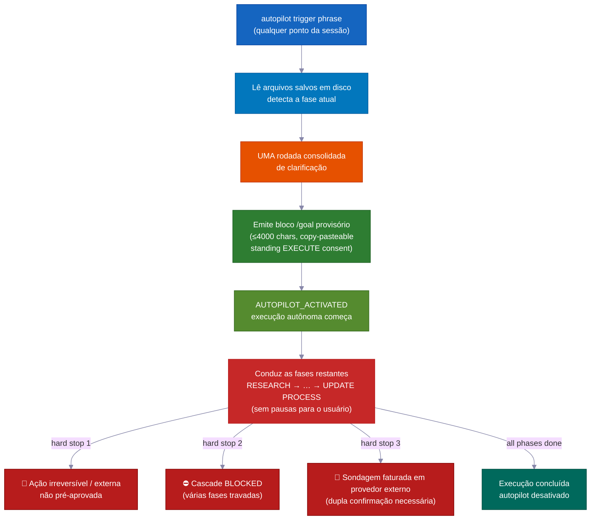

```
You: "autopilot full: add team invitations with email + role management"
→ Reads saved files → detects current phase → enters there
→ ONE consolidated clarification round (scope, hard stops, autonomy boundaries, first-phase strategy)
→ Provisional /goal block emitted (≤4000 chars, copy-pasteable, standing EXECUTE consent)
→ AUTOPILOT_ACTIVATED → drives remaining phases on its own
→ Stops ONLY for hard stops
```

### Três faixas — adeque a cerimônia ao risco

| Faixa | Gatilho | Fluxo |
|---|---|---|
| 🟢 **quick** | `autopilot quick: [task]` | Explorar → editar → verificação pontual. Sem plano, sem contrato, sem EVL. |
| 🟡 **fast** | `autopilot fast: [task]` | R→S→I→P→V comprimidos → EXECUTE + EVL. |
| 🔴 **full** | `autopilot [task]` / `autopilot full:` | RIPER-5 completo (padrão). |

### 🌙 Sem Intervenção: Uma Frase, Pronto Enquanto Você Dorme

Diga `autopilot full: [task]` — ou cole um bloco `/goal` — e tudo isso acontece com **zero intervenção humana**:

- **Loop de verificar-e-corrigir o plano** — encontra lacunas no plano, corrige e re-verifica. Até 10 rodadas por conta própria.
- **Loop de construir-testar-e-corrigir** — escreve código, executa testes, corrige falhas, re-executa. Até 10 rodadas por conta própria. Ele nunca confia no próprio "tudo verde" — um verificador separado (`vc-tester`) re-executa todos os testes de forma independente para confirmar.
- **Avanço de fase em fase** — passa de pesquisa para plano, para código, para conclusão sem esperar por você.
- **Retoma após reinício de memória** — planos, relatórios e progresso ficam salvos como arquivos em disco. Após a compactação (quando a memória de curto prazo da IA é limpa), a próxima sessão lê esses arquivos e continua exatamente de onde parou.
- **Funcionalidade travada? Deixe de lado e continue** — se uma fase não puder ser resolvida, o agente registra uma nota de backlog e avança para a próxima funcionalidade. Você pode executar muitas funcionalidades em paralelo sem que um bloqueio pare tudo.
- **Equipes de agentes para funcionalidades paralelas** — múltiplos agentes podem construir funcionalidades separadas ao mesmo tempo, cada um restrito aos seus próprios arquivos para nunca haver colisões. Uma funcionalidade travada fica em espera, sem bloquear o restante.

### Paradas obrigatórias sempre aparecem (mesmo no autopilot)

Estas são as **únicas três ocasiões em que ele para e pergunta**:

- 🛑 Qualquer coisa que não pode ser desfeita ou que alcança o mundo externo sem aprovação prévia (entrar em produção, enviar mensagens reais, cobrar dinheiro)
- ⛔ Várias fases seguidas ficam travadas sem progresso — um verdadeiro impasse que merece sua atenção
- 💸 Um teste que gastaria dinheiro real em um serviço externo pago — ele pergunta antes de executar

---

### 🎯 /goal — o token de execução autônoma

**Obrigatório, não decorativo:** após cada fase VALIDATE ser concluída, o agente principal *deve* emitir um bloco `/goal` copiável antes do EXECUTE começar. Este é um arquivo de entrega obrigatório — não um comentário opcional.

**Restrições de formato:**

| Tipo de bloco | Campos obrigatórios | Limite rígido |
|---|---|---|
| Bloco pós-VALIDATE | SESSION GOAL · Charter+umbrella plan · Autonomy · Hard stop conditions · Next phase · Validate contract · Execute start | ≤ 4000 chars |
| Bloco provisório (autopilot) | SESSION GOAL · ENTRY PHASE · REMAINING PHASES · CLARIFICATIONS LOCKED · EXECUTE CONSENT · DECISION POLICY · HARD STOPS · TEST GATES · START (+ LANE opcional) | ≤ 4000 chars |

O comando `/goal` rejeita blocos com mais de 4000 caracteres. Mantenha curto — use os campos obrigatórios como estrutura, não como um texto corrido.

**Modo /goal independente:** cole um bloco `/goal` em uma nova sessão e a execução retoma a partir da fase indicada em `START`. As clarificações e regras de decisão já estão definidas — sem nova rodada de clarificação. Com um `/goal` ativo, o agente decide por conta própria em cada etapa reversível, envia itens BLOCKED para um backlog e escreve seus próprios relatórios — mas **a delegação para agentes trabalhadores continua sendo obrigatória.** O autopilot remove apenas as *pausas de aprovação*, nunca a regra de não execução inline.

Validado por `validate-autopilot-goal-block.mjs`.

---

## 🔬 Sondagens de Viabilidade + A Rede de Segurança dos Validadores

### 🔬 Sondagens de viabilidade — teste a hipótese antes de construir sobre ela

Quando SPEC, INNOVATE ou VALIDATE encontra uma hipótese-chave que não pode confirmar apenas pela leitura, ele emite `VC-FEASIBILITY-PROBE-NEEDED` e para. O agente principal aciona `vc-debugger` para executar um teste real e escrever um **VERDICT**:

| Veredicto | Significado |
|---|---|
| ✅ **VIABLE** | A hipótese se confirma — o design pode se basear nela |
| ❌ **NOT-VIABLE** | A hipótese é falsa — essa abordagem está vetada |
| ❓ **INCONCLUSIVE** | Não foi possível provar — registrada como uma lacuna conhecida |

Cada veredicto vem com uma nota de design em 3 partes: **o que o resultado permite · o que ele exclui · o que ainda é incerto** — passada palavra por palavra de volta à fase pausada. As sondagens têm **classificação de custo** (`cheap-local` / `needs-container` / `needs-live-provider` → dupla confirmação / `needs-browser` / `needs-cf`) para que nenhuma sondagem faturada ou que use recursos compartilhados seja executada silenciosamente.

### 🛡️ 36 validadores — correção mecânica, não opinião

O kit inclui **36 scripts de validação** que transformam "o agente seguiu as regras?" em um resultado claro de aprovado/reprovado. Eles são executados após qualquer fase que toque nos arquivos do sistema, e como checkpoints obrigatórios no UPDATE PROCESS:

| Família de validadores | Verifica |
|---|---|
| `vc-audit-vc` | Paridade de agentes (Claude/Codex), registro de skills, portabilidade do kit, frontmatter dos agentes |
| `vc-audit-context` | Roteamento de contexto, frontmatter de descoberta, palavras-chave de skills |
| `vc-audit-plans` | Inventário de planos, estado do plano geral, completude de fases, relatórios de fase, notas de backlog |
| 14 validadores de comportamento do sistema VC | Cada um tem um par de fixture aprovado/reprovado — saída de comparação de estratégia, encerramento, clarificação de intenção, veredicto de viabilidade, log de autoresearch e mais |

---

## 🛡️ Sistemas de Segurança Integrados

Estas não são diretrizes — são **regras rígidas** incorporadas em cada agente.

<table>
<tr>
<td width="50%" valign="top">
<h1>📝</h1>
<strong>Notas de Progresso, Não Pausas no Meio da Execução</strong><br><br>
Durante a codificação, o agente registra notas de progresso no arquivo de relatório da fase enquanto trabalha. Sem pausa no meio da execução, sem pergunta "continuar ou voltar?". Se encontrar um problema que exige mudança de plano, ele para e retorna ao PLAN. Caso contrário, segue em frente.
</td>
<td width="50%" valign="top">
<h1>🚫</h1>
<strong>Nunca Desviar Silenciosamente</strong><br><br>
Se a codificação encontrar um problema que exige mudança de plano, o agente <strong>para imediatamente</strong>, explica e retorna ao PLAN. Sem improvisos silenciosos.
</td>
</tr>
<tr>
<td width="50%" valign="top">
<h1>🔐</h1>
<strong>Proteção de Privacidade por Hook</strong><br><br>
O agente fica <strong>impedido de ler</strong> arquivos <code>.env</code>, credenciais, chaves SSH e arquivos <code>.pem</code> sem aprovação explícita.
</td>
<td width="50%" valign="top">
<h1>⚠️</h1>
<strong>Pacotes de Evidência para Alto Risco</strong><br><br>
Para autenticação, faturamento, migrações de schema ou mudanças em APIs públicas, o sistema exige um <strong>pacote formal de 5 arquivos de evidência</strong> antes de considerar o trabalho "concluído" — sempre manual, nunca ignorado automaticamente.
</td>
</tr>
<tr>
<td width="50%" valign="top">
<h1>📨</h1>
<strong>Disciplina de Código de Status</strong><br><br>
Os agentes trabalhadores devem encerrar com <code>DONE</code> / <code>DONE_WITH_CONCERNS</code> / <code>BLOCKED</code> / <code>NEEDS_CONTEXT</code>. Bloqueios nunca são ignorados; preocupações de correção tornam-se itens de ação.
</td>
<td width="50%" valign="top">
<h1>📊</h1>
<strong>Encerramento + Pontuação de Desvio</strong><br><br>
Após a codificação, um pacote de encerramento avalia a urgência: <strong>LOW</strong> (leve) → <strong>MEDIUM</strong> (significativo) → <strong>HIGH</strong> (arquivos de sistema/protocolo tocados), e recomenda o próximo passo seguro.
</td>
</tr>
</table>

---

## 🔍 Inteligência Pré-Implementação

Antes de uma única linha de código ser escrita, três skills especializadas podem detectar problemas:

<table>
<tr>
<td width="50%" valign="top">
<h1>🎭</h1>
<strong>Debate de 5 Personas — <code>vc-predict</code></strong><br><br>
Arquiteto, Segurança, Desempenho, UX e Advogado do Diabo debatem o seu plano. Produz um veredicto de <strong>GO / CAUTION / STOP</strong> antes de você escrever uma linha.
</td>
<td width="50%" valign="top">
<h1>🎲</h1>
<strong>Casos Extremos em 12 Dimensões — <code>vc-scenario</code></strong><br><br>
Decompõe uma funcionalidade em 12 dimensões (tipos de usuário, extremos de entrada, tempo, escala, estado, ambiente, erros, autenticação, dados, integrações, conformidade, regras de negócio). A saída também serve como especificações de teste.
</td>
</tr>
<tr>
<td width="50%" valign="top">
<h1>🔐</h1>
<strong>Auditoria STRIDE + OWASP — <code>vc-security</code></strong><br><br>
Auditoria de segurança com dupla metodologia, incluindo auditoria de dependências, detecção de segredos e um <strong>modo de correção automática</strong> que ordena por gravidade e corrige as Críticas primeiro com proteções contra regressão.
</td>
<td width="50%" valign="top">
<h1>🔬</h1>
<strong>Depuração Baseada em Evidências — <code>vc-debugger</code></strong><br><br>
Coleta evidências → formula 2 a 3 hipóteses concorrentes → testa cada uma → documenta o caminho de eliminação. <strong>Nunca adivinha — prova.</strong>
</td>
</tr>
</table>

---

## ✅ Pipeline de Qualidade — Integrado à Execução

**Testes primeiro, depois código.** A lista de verificação acordada (escrita antes de qualquer código ser tocado) define os testes exatos que devem passar. O execute-agent escreve código até esses testes ficarem verdes. Então um verificador separado — `vc-tester` — re-executa todos os testes por conta própria para confirmar. O próprio "tudo verde" do execute-agent nunca é aceito pelo valor de face. No final, o revisor verifica se o projeto inteiro ainda funciona em conjunto, não apenas a nova parte.

O execute-agent não apenas escreve código e encerra. Ele percorre automaticamente um **pipeline de qualidade**:

<br>

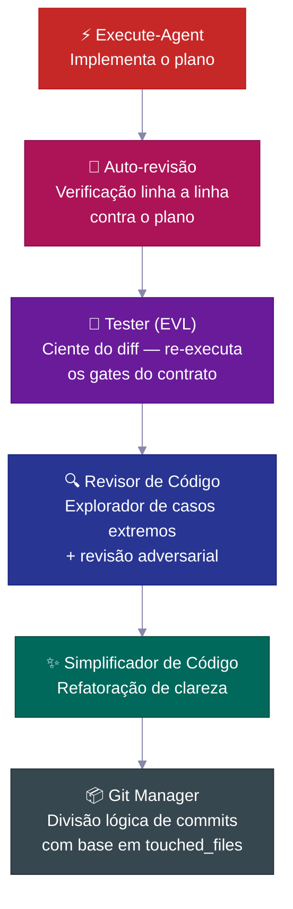

| Etapa | O que faz |
|---|---|
| 🔎 **Auto-revisão** | Verifica cada item da lista de verificação contra o plano, registra qualquer desvio |
| 🧪 **Tester (EVL)** | Re-executa os testes da lista acordada de forma independente; mapeia arquivos alterados → arquivos de teste, escala para a suíte completa quando >70% mapeado |
| 🔍 **Revisor de código** | Envia um explorador de casos extremos *antes* da revisão; verifica consultas N+1, fluxos de autenticação, vazamentos de dados |
| ✨ **Simplificador** | Organiza o código para maior clareza após a revisão — sem mudanças de comportamento |
| 📦 **Git manager** | Recebe `touched_files`, divide em commits convencionais lógicos, recusa arquivos desconhecidos |

---
## 📋 O Ciclo de Vida do Plano

Todo recurso não trivial segue um **ciclo de vida de plano** — uma especificação escrita que é criada, revisada, utilizada como base para o desenvolvimento e depois arquivada como histórico permanente do projeto.

<br>

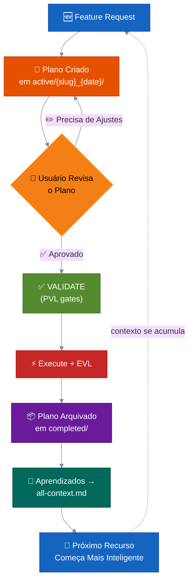

> 💡 Daqui a seis meses, quando alguém perguntar *"por que construímos a autenticação dessa forma?"*, a resposta estará em `completed/`. Não perdida em uma thread do Slack.

**Onde os planos ficam — convenção de pasta de tarefa:**

```
process/
├── general-plans/
│   ├── active/
│   │   └── webhooks_28-05-26/          # 📋 Pasta de tarefa: plano + relatórios/refs colocalizados
│   │       └── webhooks_PLAN_28-05-26.md
│   ├── completed/                       # ✅ Arquivado (histórico consultável)
│   └── backlog/                         # 📌 Trabalho adiado
└── features/
    └── billing/                         # 🏷️ Escopo de recurso (5+ artefatos)
        ├── active/{slug}_{date}/
        ├── completed/
        └── backlog/
```

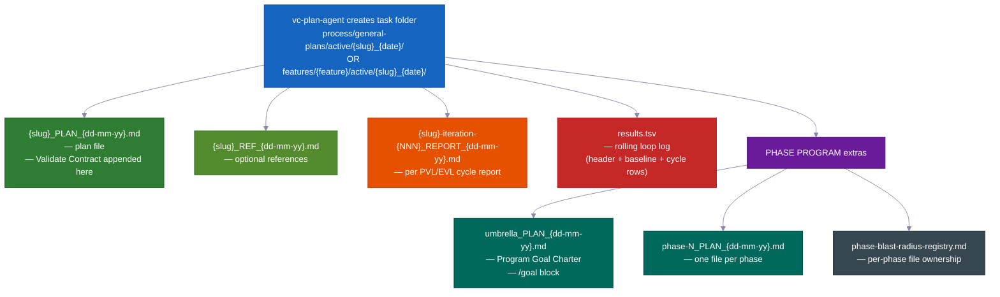

> Todo plano contém: 📍 **pontos de contato** (arquivos criados/modificados) · 📜 **contratos públicos** · 💥 **quais arquivos pode tocar** (o que pode quebrar, o que testar) · ✅ **evidências de verificação** · 🔄 **entrega para retomada**. `vc-plan-discovery` encontra o plano certo para retomar; o hook `post-write-plan-check` verifica a estrutura do plano a cada gravação.

---

## 🏗️ Programas de Fase — Projetos Grandes que Não Desmoronam

Recursos normais usam um plano. **Grandes projetos de múltiplas fases** usam um programa de fase — um plano guarda-chuva mais planos por fase, cada um executando um **loop interno de 7 etapas** com seus próprios pontos de controle e um relatório salvo.

<br>

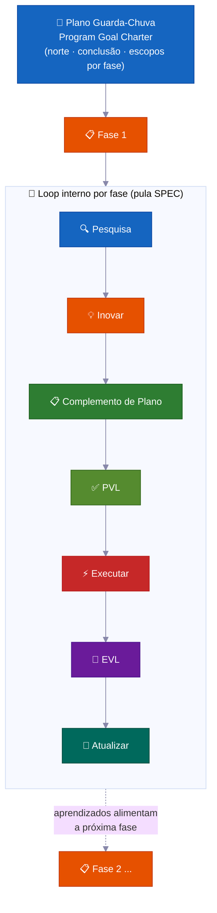

| | Funcionalidade | Por que importa |
|---|---|---|
| 🔄 | **Nova pesquisa em cada fase** | Verifica desvios no código, lê relatórios mais recentes, atualiza premissas |
| ✅ | **Pontos de controle por fase** | Uma fase não está concluída até que evidências o provem. Status honesto: `PLANNED → CODE DONE → TESTING → VERIFIED` ou `BLOCKED` |
| 📄 | **Relatórios salvos** | Cada fase grava resultados em disco — o progresso sobrevive a uma reinicialização de memória |
| 🧠 | **Aprendizados se propagam** | As descobertas da Fase 1 atualizam o plano da Fase 2 antes que a codificação comece |
| 🏗️ | **Base vs. expansão** | Separa explicitamente "prove a arquitetura" de "implemente tudo" |
| 🚧 | **Tratamento honesto de bloqueios** | Fases travadas ficam como `BLOCKED` com evidências. Sem fingir status verde |

<br>

### 🔀 O programa se reconfigura conforme aprende

O plano que você escreve no início é um mapa aproximado, não um contrato fixo. Conforme o programa avança, ele se ajusta — para que você não precise prever cada etapa antecipadamente.

**Ele pode adicionar uma nova fase no meio da execução.**
Enquanto trabalha, o agente pode descobrir uma etapa faltante — algo que precisa acontecer antes que a próxima fase possa prosseguir. Quando isso ocorre, ele insere uma nova fase ali mesmo, renumera o restante e continua. Sem necessidade de intervenção humana. (Sinal interno: `MID_PROGRAM_PLAN_CREATED` — o novo plano é gravado em disco e adicionado ao registro automaticamente.)

**Ele pode reordenar fases.**
A pesquisa às vezes mostra que a ordem planejada está errada — por exemplo, a Fase 3 depende de algo que só a Fase 4 produz. O agente reorganiza as fases restantes e registra o motivo. (Sinal interno: `PHASE_RESTRUCTURE_NOTICE` — salvo no relatório da fase como trilha de auditoria, não como bloqueio.)

**Ele atualiza o plano de cada fase logo antes de codificá-la.**
Antes de qualquer fase iniciar a codificação, uma rápida pesquisa revisa o que o programa aprendeu até o momento. Em seguida, atualiza a lista de verificação daquela fase com novas descobertas. Isso é chamado de etapa de **complemento de plano**. Os planos nunca são congelados — eles absorvem fatos novos das fases anteriores.

**Ele pula trabalhos que ainda não podem começar.**
Se uma fase depende de algo ainda não pronto — um serviço ainda não construído, uma decisão ainda não tomada — o agente marca essa fase como bloqueada por dependência, a deixa de lado e passa para a próxima. O programa inteiro não trava por causa de uma fase em espera.

**Ele sabe quando parar e perguntar.**
Uma fase travada simplesmente vai para um backlog e o programa continua. Mas se várias fases seguidas batem numa parede sem progresso, o agente trata isso como um beco sem saída real — uma **parada em cascata** — e pausa para mostrar o que aconteceu. Uma fase travada é normal. Várias seguidas indicam que algo estrutural está errado.

**Ele mantém um placar ao vivo.**
Todo programa tem uma seção de status de uma página no plano guarda-chuva mostrando qual fase está em andamento, se está concluída e onde o relatório está. Qualquer pessoa — ou o próprio agente após uma reinicialização de memória — pode lê-lo e saber exatamente onde as coisas estão. Ele também mantém um registro simples de arquivos para que duas fases trabalhando ao mesmo tempo nunca editem os mesmos arquivos.

**Uma grande verificação final.**
Ao final de todo o programa, o agente executa um teste de ponta a ponta para confirmar que o projeto inteiro ainda funciona em conjunto — não apenas cada peça separadamente. Os pontos de controle de cada fase provam que cada parte funciona; essa verificação final prova que as partes funcionam como um todo.

---

### 🧠 Ele Nunca Perde o Lugar (Sobrevive a uma Reinicialização de Memória)

Trabalhos longos são concluídos corretamente — mesmo quando a memória da IA reinicia no meio do caminho. O plano, o progresso e as evidências vivem em arquivos no disco, não apenas na cabeça do agente.

Agentes de IA têm memória de trabalho limitada. Em um trabalho longo, essa memória se enche e é comprimida — detalhes podem se perder. Quando uma nova sessão começa (ou a memória é limpa), o agente não tenta adivinhar onde parou. Ele lê os arquivos.

Veja exatamente como isso funciona:

**1. Ele escreve um relatório curto após cada fase.**
Quando uma fase termina, um arquivo de relatório é gravado em disco. O progresso fica na sua pasta de projeto, não apenas na cabeça do agente. Uma compressão de memória não pode apagar um arquivo.

**2. Ele mantém uma lista de verificação de quais etapas estão concluídas.**
Cada plano de fase tem uma lista de **Phase Loop Progress** — caixas de seleção para cada etapa (pesquisa, verificação de plano, construção, teste, captura de aprendizados). Após uma reinicialização, o agente lê essas caixas e sabe exatamente qual é a próxima etapa. Sem precisar ser atualizado.

**3. Um breve "envelope" no início de cada fase.**
Todo agente trabalhador (um auxiliar focado que executa uma fase do trabalho) começa emitindo um **Context Envelope** — uma nota de 10 campos: qual recurso, qual fase, qual branch, qual arquivo de plano, quais testes executar. Leva segundos para ler. O agente está pronto antes de fazer qualquer coisa.

**4. Ele confia nos arquivos mais do que na própria memória.**
Ao retomar, o agente verifica o que realmente está no código e no histórico git em comparação com o que o plano diz. O estado real vence. Um plano desatualizado não pode induzir o agente a repetir trabalho ou pular etapas.

**5. Um placar contínuo e relatórios por rodada.**
Todo loop de correção (o loop de verificação de plano e o loop de construção e teste) mantém um arquivo de placar `results.tsv` — uma linha por rodada, rastreando quantos problemas restam. Quando uma sessão termina no meio de um loop, a próxima sessão lê a contagem, retoma na rodada certa e continua. Nenhuma rodada é perdida.

**6. Ele reinjecta um lembrete ao retomar.**
Quando a memória é comprimida, o sistema recarrega automaticamente a nota de status mais recente na nova sessão. Se alguma aprovação estava pendente — digamos, um ponto de controle que precisava de um "sim" antes de avançar — o lembrete sinaliza isso. Nada é ignorado silenciosamente.

> 💡 Resumindo: você pode iniciar uma execução em piloto automático, fechar o laptop e voltar horas depois. O agente estará exatamente onde deveria estar — ou retomará do último ponto de controle salvo, com evidências em disco para comprová-lo.

---

## 🧠 Grupos de Contexto

O conhecimento do projeto é organizado em **grupos de contexto** — áreas de conhecimento estáveis, cada uma com um arquivo roteador `all-{group}.md` que diz aos agentes o que ler e quando. Os agentes seguem o roteador, carregando apenas o que é relevante — não toda a base de conhecimento a cada vez.

<br>

```
process/context/
├── all-context.md              # 🧭 Roteador raiz — arquitetura, stack, padrões, convenções
├── tests/all-tests.md          # 🧪 Executores de teste, comandos, procedimentos de depuração
├── container/all-container.md   # 🐳 Docker, implantação, procedimentos de infra
├── uxui/all-uxui.md            # 🎨 Componentes, tokens de design, padrões
├── infra/all-infra.md          # 🖥️ Infraestrutura de servidor, implantação
└── {your-domain}/all-{domain}.md  # 📚 Qualquer domínio com 3+ docs duráveis (promovido automaticamente)
```

| | Como funciona |
|---|---|
| 🧭 **Padrão de roteador** | Os agentes leem apenas o que é relevante para sua tarefa |
| 📏 **Promoção automática** | Tópicos com 3+ docs (ou um único arquivo que fica grande demais) ganham seu próprio grupo |
| 🔄 **Sempre atualizado** | Atualizado por `vc-update-process-agent` após todo recurso não trivial |
| 🧪 **Auditável** | `vc-audit-context` verifica roteamento, frontmatter de descoberta e consistência |
| 📨 **Context Envelope** | Todo agente do loop interno emite uma nota de 10 campos no início (feature → phase → session-goal → branch → worktree → context-group → blast-radius-packages → active-plan → test-runner → validate-contract) para que um novo agente trabalhador saiba exatamente onde está |

> O kit fornece apenas a semente do protocolo — seus grupos de contexto são **construídos para o seu projeto** pelo `vc-setup`, que escaneia seu código real. Eles são um padrão, não uma lista fixa.

---

## 📁 Pastas de Recurso

Quando um tópico acumula 5 ou mais arquivos, ele ganha sua própria **pasta de recurso** — um contêiner completo de ciclo de vida.

```
process/features/{feature}/
├── active/{slug}_{date}/   # 📋 Planos em andamento (relatórios/refs colocalizados)
├── completed/              # ✅ Planos arquivados (histórico consultável de decisões)
└── backlog/                # 📌 Trabalho adiado (agentes verificam antes de duplicar)
```

| | O que acontece |
|---|---|
| 🆕 | Novo trabalho começa em `active/` → relatórios se acumulam → plano é arquivado em `completed/` |
| 📌 | Trabalho adiado vai para `backlog/` — agentes verificam antes de criar planos duplicados |
| 📦 | A promoção de recurso ocorre automaticamente quando artefatos gerais chegam a 5+ |
| 🔍 | Todo recurso tem histórico completo e autocontido — planos, decisões, relatórios, pesquisas |

---

## 🧱 Camadas de Skill

As 33 skills se dividem em três camadas. Todo `SKILL.md` declara sua `layer` + `trigger_keywords` no frontmatter, e um catálogo gerado mantém a descoberta rápida.

<table>
<tr>
<td width="33%" valign="top">
<h1>🎭</h1>
<strong>Agentes atores</strong><br><br>
Possuem uma fase ou papel. Ficam em <code>.claude/agents/</code> — são os 15 agentes, não skills.
</td>
<td width="33%" valign="top">
<h1>📜</h1>
<strong>Skills de contrato (20)</strong><br><br>
Cada uma produz um arquivo específico ou resultado acordado — <code>vc-generate-plan</code>, <code>vc-validate-findings</code>, <code>vc-autopilot</code>, as auditorias. Os resultados podem ser verificados.
</td>
<td width="33%" valign="top">
<h1>🛠️</h1>
<strong>Skills auxiliares (13)</strong><br><br>
Melhoram <em>como</em> os agentes trabalham, sem produzir arquivos próprios — <code>vc-scout</code>, <code>vc-sequential-thinking</code>, <code>vc-problem-solving</code>, <code>vc-docs-seeker</code>.
</td>
</tr>
</table>

---

## 🧠 Memória de Projeto Auto-Aprimorável

Todo recurso concluído alimenta os aprendizados de volta ao sistema de contexto — **o conhecimento se acumula, não reinicia.**

A maioria das bases de código assistidas por IA tem a propriedade oposta: toda nova sessão começa do zero. O agente relê os mesmos arquivos, redescobre os mesmos padrões e retoma as mesmas decisões — porque o insight da última sessão vivia apenas em uma janela de chat. A resposta do kit não é um truque de prompt. É um **sistema de arquivos de contexto durável** (`process/context/`) que todo agente lê no início da sessão, todo validador protege e todo recurso concluído enriquece.

Seis meses e muitas reinicializações de memória depois, o agente ainda sabe *por que* sua autenticação funciona dessa forma — porque esse conhecimento está em disco, roteado e auditável, não preso em uma sessão morta.

<br>

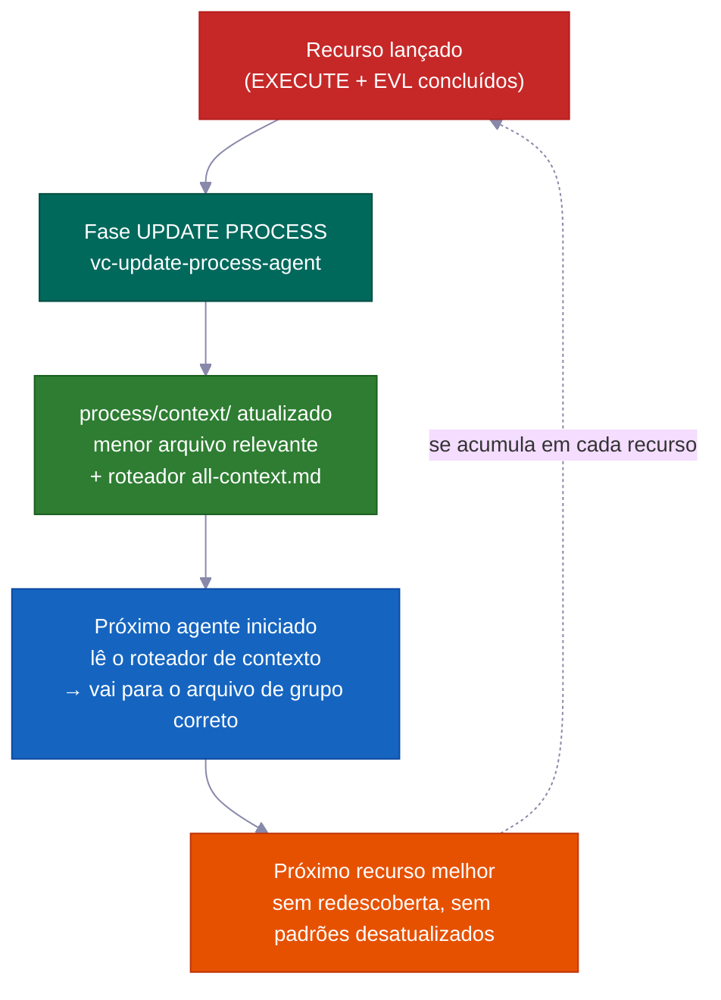

### O mecanismo central: `process/context/` como memória portátil e compartilhada

`process/context/` contém conhecimento estruturado organizado em grupos de tópicos — decisões de arquitetura, convenções de código, etapas de implantação, padrões de teste, fatos de infraestrutura. Ao contrário de um histórico de chat, esse conhecimento:

- **viaja para todo agente trabalhador** — `vc-context-discovery` encaminha cada agente iniciado ao roteador `all-{group}.md` correto para sua tarefa, depois ao menor arquivo profundo relevante. Um agente de pesquisa, um agente de plano e um agente de codificação todos começam com o mesmo entendimento compartilhado
- **sobrevive a uma reinicialização de memória** — está em disco, não em uma janela de contexto; uma sessão comprimida não perde nada
- **é legível tanto pelo Claude quanto pelo Codex** — `.agents/skills` é um link de atalho para `.claude/skills/`, então o mesmo sistema de contexto serve a ambos os agentes sem duplicação

O roteador raiz (`all-context.md`) aponta para roteadores de grupo (`all-{group}.md`), que encaminham para o menor arquivo profundo relevante. Os agentes seguem o roteador — eles nunca codificam caminhos de arquivo fixos. Isso significa que renomeações e divisões de grupo requerem apenas edições no roteador, não uma busca em toda a base de código.

```
process/context/
├── all-context.md                  ← roteador raiz (arquitetura, stack, padrões)
├── tests/all-tests.md              ← executores de teste, depuração, comandos
├── container/all-container.md      ← Docker, implantação, procedimentos de infra
├── uxui/all-uxui.md                ← componentes, tokens de design, convenções visuais
└── {domain}/all-{domain}.md        ← qualquer domínio com 3+ docs duráveis (promovido automaticamente)
```

<br>

### O que o torna auto-aprimorável (não apenas "docs vivos")

A expressão "docs vivos" geralmente significa "docs que pretendemos manter atualizados, mas que na maioria das vezes esquecemos." Este sistema aplica a intenção mecanicamente.

**A fase UPDATE PROCESS exige uma revisão de contexto por arquivo antes de poder fechar.** `vc-update-process-agent` não pode concluir uma fase até que cada arquivo de contexto potencialmente afetado tenha sido revisado com um motivo concreto por arquivo. "Nenhuma atualização necessária" é permitido — mas deve nomear cada arquivo revisado e explicar o porquê. Motivos vagos são rejeitados. O ponto de controle é binário: registre a revisão, ou a fase não fecha.

O loop de feedback completo por recurso concluído:

| Etapa | Responsável | O que acontece |
|------|-------|-------------|
| 1. Análise de git diff | `vc-scout` | Mapeia arquivos alterados → áreas de contexto afetadas |
| 2. Revisão por arquivo | `vc-update-process-agent` | Nomeia cada arquivo de contexto, declara a atualização ou um explícito "sem mudança + motivo" |
| 3. Atualizações aplicadas | agentes trabalhadores paralelos | O arquivo de contexto de cada área é atualizado com novos padrões, decisões, aprendizados |
| 4. Roteamento verificado | `validate-context-discovery.mjs` | Confirma que todo doc está indexado e os roteadores estão consistentes |
| 5. Descoberta confirmada | `validate-all-context.mjs` | Confirma que `all-context.md` e os roteadores de grupo correspondem aos arquivos atuais em disco |

Seu 100º recurso se beneficia de tudo aprendido nos primeiros 99 — não como uma aspiração, mas como uma garantia mecânica.

<br>

### Visualização futura: aprendizados se propagam para frente, não apenas para trás

Todo relatório de fase carrega uma seção `## Forward Preview` escrita para o agente da *próxima* fase. Ela fornece os comandos exatos para manter tudo funcionando, mudanças de dependência e alterações de escopo de arquivo encontradas durante a fase. O agente que inicia a Fase 3 não precisa reler o resultado da Fase 2 e adivinhar o que importa. Ele recebe um resumo focado.

Isso é diferente dos docs de contexto: os docs de contexto carregam conhecimento *duradouro* (decisões que permanecem verdadeiras entre recursos); o Forward Preview carrega estado de entrega *temporário* (o que a próxima sessão de trabalho precisa saber agora).

<br>

### Suite de validadores previne deterioração

Conhecimento duradouro fica desatualizado quando ninguém o verifica. O kit fornece validadores que rodam como parte do encerramento de cada fase:

| Validador | O que detecta |
|-----------|----------------|
| `validate-context-discovery.mjs` | Docs não indexados por nenhum roteador; links quebrados; frontmatter ausente |
| `validate-all-context.mjs` | `all-context.md` fora de sincronia com os arquivos reais em disco |
| `validate-skill-keywords.mjs` | Skills sem campos `trigger_keywords` ou `layer` (quebra a Etapa 0 de roteamento) |
| `validate-protocol-discovery.mjs` | Arquivos de protocolo em `process/development-protocols/` sem frontmatter de descoberta |

Esses rodam como verificações automatizadas — um doc desatualizado ou órfão falha. O sistema monitora sua própria saúde.

<br>

### Grupos de contexto se auto-organizam

Grupos são criados automaticamente quando um tópico atinge 3+ docs ou um único arquivo ultrapassa ~800 linhas. Os agentes seguem roteadores e nunca codificam caminhos fixos — então adicionar um novo grupo (ex.: `process/context/billing/all-billing.md`) requer apenas uma atualização no roteador, não mudanças em todo agente que menciona faturamento. O roteador é a referência estável; os arquivos por trás dele podem se reorganizar livremente.

> O kit semeia grupos de contexto a partir da sua base de código real (via `vc-setup`). Os grupos não são uma lista fixa — são um padrão. Sua área de autenticação, sua área de infra, sua área de pagamentos cada uma se torna conhecimento roteável de primeira classe conforme o projeto cresce.

---

## 🤖 O Que Está Dentro

<br>

### 15 Agentes

<details>
<summary>Clique para expandir a lista de agentes</summary>

<br>

**Agentes de fluxo principal** — um por fase RIPER-5 (R → SPEC → I → P → V → E → UP):

| Agente | Modelo | Papel |
|-------|:---:|------|
| 🔍 `vc-research-agent` | sonnet | Pesquisa de base de código + web, somente leitura. Rastreamento de contradições integrado |
| 📝 `vc-spec-agent` | sonnet | Documento de requisitos de descoberta de produto antes do INNOVATE. Produz `*_SPEC_*.md` |
| 💡 `vc-innovate-agent` | sonnet | Compara 2-3 abordagens. Resumo de decisão (escolhida + rejeitadas) antes do PLAN |
| 📋 `vc-plan-agent` | sonnet | Escreve o plano com proteções anti-atalho. "Já sei como" não é um plano |
| ✅ `vc-validate-agent` | sonnet | Transforma plano → lista de verificação acordada (V1–V7). Ponto de controle: PASS/CONDITIONAL/BLOCKED |
| ⚡ `vc-execute-agent` | **opus** | Implementa conforme o plano. Notas de progresso no relatório de fase, protocolo de desvio, auto-revisão |
| ⏩ `vc-fast-mode-agent` | **opus** | R→S→I→P→V comprimidos com uma pausa de segurança obrigatória antes do EXECUTE |
| 🔧 `vc-quick-fix-agent` | **opus** | Raia QUICK FIX: uma edição pequena e de baixo risco + verificação de escopo, sem plano/validação |
| 🧠 `vc-update-process-agent` | sonnet | Encerramento de 7 fases: arquivamento, atualização de contexto, varredura de artefatos desatualizados, aprendizados |

<br>

**Agentes especialistas** — chamados durante EXECUTE ou de forma independente:

| Agente | Papel |
|-------|------|
| 🐛 `vc-debugger` | Coleta evidências antes de formular hipótese. Hipóteses concorrentes, cadeias de eliminação, sondas de viabilidade |
| 🧪 `vc-tester` | Ciente de mudanças. Reexecuta testes da lista acordada (EVL). Auto-escala em mudanças de configuração |
| 🔎 `vc-code-reviewer` | Envia um explorador de casos extremos ANTES da revisão. Detecção de N+1, verificação de caminho de autenticação |
| ✨ `vc-code-simplifier` | Organiza o código para clareza sem alterar comportamento |
| 🎨 `vc-ui-ux-designer` | Frontend ciente de design. Pode iniciar um agente de pesquisa durante a construção |
| 📦 `vc-git-manager` | Divide em commits lógicos a partir de `touched_files`. Recusa arquivos desconhecidos |

</details>

<br>

### 33 Skills (descobertas automaticamente)

<details>
<summary>Clique para expandir a lista de skills (20 de contrato + 13 auxiliares)</summary>

<br>

**📜 Skills de contrato (20)** — possuem um artefato: `vc-generate-plan` · `vc-generate-context` · `vc-generate-spec` · `vc-generate-closeout` · `vc-generate-phase-program` · `vc-audit-context` · `vc-audit-plans` · `vc-audit-vc` · `vc-update` · `vc-publish` · `vc-feasibility-test` · `vc-risk-evidence-pack` · `vc-test-coverage-plan` · `vc-validate-findings` · `vc-autoresearch` · `vc-intent-clarify` · `vc-autopilot` · `vc-agent-strategy-compare` · `vc-plan-discovery` · `vc-context-discovery`

**🛠️ Skills auxiliares (13)** — melhoram como os agentes trabalham: `vc-review-situation` · `vc-sequential-thinking` · `vc-problem-solving` · `vc-scout` · `vc-debug` · `vc-docs-seeker` · `vc-frontend-design` · `vc-agent-browser` · `vc-web-testing` · `vc-setup` · `vc-predict` · `vc-scenario` · `vc-security`

</details>

> **⚠️ Regra de nomenclatura:** NÃO use o prefixo `vc-` para suas próprias skills ou agentes — esse namespace é reservado para arquivos fornecidos pelo kit, e o guarda de remoção de itens desatualizados trata qualquer caminho `vc-*` em `.claude/skills/` e `.claude/agents/` como pertencente ao kit. Use `my-`, `team-` ou `proj-` em vez disso.

<br>

### 🪝 10 Hooks

| Hook | O que faz |
|------|-------------|
| 🔐 `privacy-block.cjs` | Bloqueia leitura de `.env`, credenciais, chaves SSH. Requer aprovação explícita |
| 🚫 `scout-block.cjs` | Impede acesso a `node_modules/`, `dist/`. `.ckignore` com sintaxe gitignore |
| 🧠 `session-init.cjs` | Detecta stack, injeta env, recupera aprovações pendentes após compressão |
| 💉 `subagent-init.cjs` | Injeta um bloco de contexto compacto em todo subagente |
| ✨ `post-edit-simplify-reminder.cjs` | Após 5+ edições, sugere executar o simplificador (não bloqueante, com limitação de frequência) |
| 📛 `descriptive-name.cjs` | Convenções de nomenclatura de arquivos com reconhecimento de linguagem em todo Write |
| 📊 `session-state.cjs` | Métricas de sessão + consciência de tokens |
| 📋 `post-write-plan-check.mjs` | Valida estrutura do artefato de plano em todo Write para `*_PLAN_*.md` |
| 🧹 `post-commit-lint.mjs` | Verifica prefixo de conventional-commits em todo `git commit` |
| 🔍 `stop-validator-sweep.cjs` | Executa validadores principais do harness quando a sessão para |

<br>

**Onde tudo fica:**

```text
your-project/
├── .claude/{agents,skills,hooks}/   # 🤖 15 agentes · ⚡ 33 skills · 🪝 10 hooks
├── .codex/agents/                   # 🔄 Espelhado para Codex
├── .agents/skills -> .claude/skills # 🔗 Link para descoberta do Codex
├── CLAUDE.md · AGENTS.md            # 📋 Config do orquestrador + registro multi-ferramenta
└── process/
    ├── context/                     # 🧠 Domínios de conhecimento com roteamento automático
    ├── general-plans/               # 📋 Planos transversais + pastas de tarefa
    ├── features/                    # 🏷️ Pastas de ciclo de vida por recurso
    └── development-protocols/       # 📜 22 documentos de fluxo compartilhado
```

---

## ⚡ Quick Fix + Fast Mode

Duas opções mais leves para quando o processo RIPER-5 completo é mais do que o trabalho exige:

<table>
<tr>
<td width="50%" valign="top">
<h1>🔧</h1>
<strong>Quick Fix</strong> — <code>"quick fix: …"</code><br><br>
Maior do que um simples one-liner, menor do que "precisa de um plano." O agente principal explora somente leitura → confirma em uma linha → inicia <code>vc-quick-fix-agent</code> para a edição + uma verificação de escopo somente nos arquivos tocados. <strong>Sem plano, sem lista de verificação acordada, sem EVL.</strong>
<br><br>
<sub>Cancelado imediatamente se a mudança tocar esquema, autenticação, API, faturamento ou superfícies de migração — então é encaminhado para RESEARCH completo.</sub>
</td>
<td width="50%" valign="top">
<h1>⏩</h1>
<strong>Fast Mode</strong> — <code>"ENTER FAST MODE - …"</code><br><br>
Comprime RESEARCH + SPEC + INNOVATE + PLAN + VALIDATE em uma passagem — mas ainda <strong>escreve um plano, escreve uma lista de verificação acordada e pausa antes do EXECUTE.</strong>
<br><br>
<sub>No Fast Mode padrão, há uma pausa pós-VALIDATE — você revisa, depois diz "ENTER EXECUTE MODE." Use <code>autopilot fast: [task]</code> para remover essa pausa e executar até o fim sem parar.</sub>
</td>
</tr>
</table>

---

## 🔄 Ciclo de Vida do Kit: Instalar · Configurar · Atualizar · Publicar

| Comando | O que faz | Quando |
|---|---|---|
| `curl … install.sh \| bash` | Sincroniza arquivos do kit sem sobrescrever os seus; detecta automaticamente instalação nova vs. atualização e encaminha | Primeira instalação + toda atualização |
| **Executar vc-setup** | Detecta stack, cria estrutura em `process/`, escaneia profundamente a base de código, popula contexto real | Após uma instalação nova |
| **Executar vc-update** | Calcula um diff preciso, mostra o que vai mudar, aguarda sua aprovação; migra planos/pastas em formato antigo sem perda de dados | Em toda atualização |
| **Executar vc-publish** *(mantenedores)* | Publica alterações do harness de volta ao repositório do kit | Contribuindo para o kit em si |

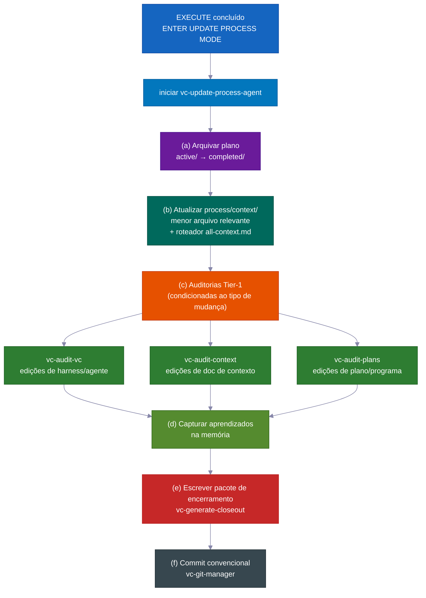

> 💡 `vc-update` mostra uma prévia do diff e aguarda sua aprovação. Seu diretório `process/` e conteúdo específico do projeto **nunca** são alterados silenciosamente. Reexecutar a instalação é seguro.

---

## 💡 Mais Razões pelas Quais Simplesmente Funciona

Muitos padrões inteligentes e pequenos somam menos supervisão e menor custo.

- **Cada papel só recebe as ferramentas de que precisa.** Durante o planejamento, o agente literalmente não pode editar código — essas ferramentas estão desativadas. Isso impede o agente de pular etapas e alterar coisas antes que o plano seja aprovado. O sistema simplesmente não permite.

- **Ele usa o modelo de IA premium apenas onde importa.** A escrita de código usa o modelo principal. Planejamento, pesquisa, revisão e verificação usam um modelo mais barato e rápido. O resultado: custo aproximadamente 60–70% menor em comparação com usar o modelo principal para tudo — sem perda de qualidade no que importa.

- **Ele testa suposições arriscadas antes de construir com base nelas.** Quando o agente não tem certeza se algo vai funcionar — um comportamento específico de API, uma funcionalidade de biblioteca, uma suposição de infraestrutura — ele executa um pequeno experimento real primeiro. O resultado é claro: funciona, não funciona ou incerto. Esse veredicto e uma nota em linguagem simples são incorporados diretamente ao plano. O agente não passa horas construindo sobre uma suposição errada.

- **Pontos de salvamento organizados e significativos.** As mudanças são commitadas em blocos limpos e lógicos com mensagens claras — automaticamente. O histórico é fácil de ler e fácil de desfazer peça por peça.

- **Lembretes automáticos úteis.** Pequenos auxiliares integrados incentivam coisas como executar as verificações corretas em arquivos alterados, manter o código simples e escrever uma mensagem de commit adequada. A qualidade se mantém elevada sem que você precise monitorar.

- **Você pode executar o loop de auto-aprimoramento por conta própria.** O mesmo motor de "encontrar problemas, corrigi-los, repetir" que orienta a verificação de planos e a correção de testes também funciona como uma ferramenta independente em qualquer área problemática — uma especificação, os docs, os testes, uma lista de erros. Você não precisa de uma construção de recurso completa para usá-lo.

- **Prova integrada de que as regras de fluxo realmente funcionam.** O kit vem com sua própria suite de testes: um conjunto de verificações com exemplos conhecidamente bons e ruins que provam que as regras de fluxo se comportam corretamente. O sistema verifica a si mesmo. Você não precisa confiar que as proteções estão ativas — você pode executar as verificações e ver.

---

## Contribuindo

Contribuições são bem-vindas! Veja [CONTRIBUTING.md](CONTRIBUTING.md) para as diretrizes.

<br>

**Links rápidos:**

- 🐛 [Reportar um bug](https://github.com/withkynam/vibecode-pro-max-kit/issues/new?template=1.bug_report.yml)
- 💡 [Solicitar um recurso](https://github.com/withkynam/vibecode-pro-max-kit/issues/new?template=2.feature_request.yml)
- ⚡ [Enviar uma skill](https://github.com/withkynam/vibecode-pro-max-kit/issues/new?template=3.skill_submission.yml)
- 🌐 [Adicionar uma tradução](https://github.com/withkynam/vibecode-pro-max-kit/issues/new?template=5.translation.yml)

<br>

<a href="https://github.com/withkynam/vibecode-pro-max-kit/graphs/contributors">
  
</a>

<br>

### 🙏 Créditos

vibecode-pro-max-kit foca no framework de desenvolvimento orientado a especificações e na organização de contexto auto-aprimorável, sem sobrecarregar você com 80+ skills. Menos ferramentas, mais estrutura.

---

## ⭐ Histórico de Estrelas

<a href="https://star-history.com/#withkynam/vibecode-pro-max-kit&Date">
 <picture>
   <source media="(prefers-color-scheme: dark)" srcset="https://api.star-history.com/svg?repos=withkynam/vibecode-pro-max-kit&type=Date&theme=dark" />
   <source media="(prefers-color-scheme: light)" srcset="https://api.star-history.com/svg?repos=withkynam/vibecode-pro-max-kit&type=Date" />
   
 </picture>
</a>

---

## 📄 Licença

MIT
