<p align="center">
  <a href="../../README.md">English</a> |
  <a href="README.zh-CN.md">简体中文</a> |
  <a href="README.ja-JP.md">日本語</a> |
  <a href="README.ko-KR.md">한국어</a> |
  <strong>Tiếng Việt</strong> |
  <a href="README.pt-BR.md">Português</a> |
  <a href="README.es.md">Español</a> |
  <a href="README.de.md">Deutsch</a> |
  <a href="README.fr.md">Français</a> |
  <a href="README.hi.md">हिंदी</a>
</p>

<div align="center">

<a href="https://flowser.ai">
  
</a>

*Được xây dựng bởi những kỹ sư hàng đầu, dành cho vibecoders tại*<br>
*[flowser.ai](https://flowser.ai) — AI Agents với máy tính cho GTM*

<br>

# vibecode-pro-max-kit

<br>

<p align="center">
  
  <br><br>
  <em>"Toàn Tập Trung — Hơi Thở Đặc Kỹ, Thức Thứ Mười: Vibe Flow không bao giờ đứt."</em><br>
  <strong>— Tanjiro Kamado</strong>
</p>

*Thả vào bất kỳ dự án nào. AI agent của bạn sẽ có ngay một quy trình phát triển lập kế hoạch trước hoàn chỉnh — 7 giai đoạn có kiểm soát, vòng lặp tự sửa lỗi, và chế độ tự động chạy từ đầu đến cuối mà không mất chỗ.*

<table align="center">
<tr>
<td width="50%" valign="top"><strong>📦 Cài đặt một lệnh</strong><br>Một dòng <code>curl</code> là xong với bất kỳ dự án nào. Tự nhận biết người dùng mới hay cũ và không bao giờ ghi đè file của bạn.</td>
<td width="50%" valign="top"><strong>🌐 Dùng được ở mọi nơi</strong><br>Bất kỳ công nghệ, ngôn ngữ nào, và bất kỳ AI coding agent nào — Claude Code, Codex, Cursor, Windsurf, Copilot, và nhiều hơn nữa.</td>
</tr>
<tr>
<td valign="top"><strong>🧭 Quy trình lập kế hoạch trước RIPER-5</strong><br>7 giai đoạn có kiểm soát (Research → Spec → Innovate → Plan → Validate → Execute → Update-Process) ngăn agent nhảy thẳng vào viết code.</td>
<td valign="top"><strong>🚀 Chế độ Autopilot (quick / fast / full)</strong><br>Bắt đầu chạy tự động từ bất kỳ giai đoạn nào chỉ với một câu lệnh. Ba chế độ khớp với mức độ phức tạp của công việc.</td>
</tr>
<tr>
<td valign="top"><strong>🎯 <code>/goal</code> — token chạy đến khi xong</strong><br>Một đoạn văn bản ngắn có thể dán vào giúp agent chạy liên tục từ giai đoạn này sang giai đoạn khác — và tiếp tục được trong phiên làm việc mới.</td>
<td valign="top"><strong>🔁 Vòng lặp tự sửa PVL + EVL</strong><br>Vòng lặp kiểm tra-sửa kế hoạch và kiểm tra-sửa bài test tự tìm lỗ hổng, sửa chúng, và kiểm tra lại — tối đa 10 lần mỗi vòng.</td>
</tr>
<tr>
<td valign="top"><strong>🔍 vc-autoresearch</strong><br>Vòng lặp tìm lỗ hổng → sửa → lặp lại có thể tái sử dụng, áp dụng được cho kế hoạch, bài test, spec, tài liệu, hoặc đánh giá.</td>
<td valign="top"><strong>🧪 Kiểm tra tính khả thi</strong><br>Kết quả VIABLE / NOT-VIABLE trước khi agent cam kết với bất kỳ phương án thiết kế nào.</td>
</tr>
<tr>
<td valign="top"><strong>🎛️ Chọn chiến lược thông minh</strong><br>Trước mỗi giai đoạn, đánh giá một agent hay nhiều agent hay một nhóm phối hợp — kèm ước tính chi phí — và chọn phương án rẻ nhất phù hợp.</td>
<td valign="top"><strong>🧮 Dùng model thông minh</strong><br>Model đắt tiền chỉ viết code; model rẻ hơn làm mọi việc còn lại. Chi phí thấp hơn, chất lượng như cũ.</td>
</tr>
<tr>
<td valign="top"><strong>🤔 Làm rõ yêu cầu</strong><br>Khi yêu cầu mơ hồ, agent hỏi một vài câu ngắn gọn trước thay vì đoán và xây nhầm thứ.</td>
<td valign="top"><strong>🛡️ 36 validator</strong><br>Kiểm tra tính chính xác theo cơ chế — không phải ý kiến chủ quan — bảo vệ cấu trúc của kit và phát hiện sai lệch trước khi xuất bản.</td>
</tr>
<tr>
<td valign="top"><strong>🏗️ Chương trình theo giai đoạn</strong><br>Các dự án lớn được chia thành các giai đoạn độc lập với cổng kiểm tra giữa chúng, để công việc lớn không sụp đổ giữa chừng.</td>
<td valign="top"><strong>🔀 Chương trình tự điều chỉnh</strong><br>Khi học được thêm, agent chèn giai đoạn mới, sắp xếp lại công việc, và bỏ qua bước bị chặn — kế hoạch thích nghi theo thời gian thực.</td>
</tr>
<tr>
<td valign="top"><strong>🧠 Không bao giờ mất chỗ</strong><br>Ghi chú tiến độ được lưu xuống đĩa sau mỗi giai đoạn, nên một lần chạy có thể tồn qua reset bộ nhớ và tiếp tục đúng chỗ đã dừng.</td>
<td valign="top"><strong>📚 Bộ nhớ dự án tự cải thiện</strong><br>Tìm hiểu codebase của bạn khi cài đặt và cập nhật ghi chú dùng chung sau mỗi tính năng được xuất bản, nên tài liệu không bao giờ lỗi thời.</td>
</tr>
<tr>
<td valign="top"><strong>⚡ Quick Fix + Fast Mode</strong><br>Chế độ nhẹ dành cho thay đổi nhỏ bỏ qua nghi thức phức tạp, để sửa một dòng vẫn chỉ là sửa một dòng.</td>
<td valign="top"><strong>🧱 Skill theo lớp, tự khám phá</strong><br>Skill được tổ chức theo lớp rõ ràng và tự động khám phá — agent luôn tìm đúng công cụ cho từng bước.</td>
</tr>
<tr>
<td valign="top"><strong>🤖 15 agents · 33 skills · 10 hooks</strong><br>Một đội đầy đủ gồm các agent chuyên biệt, skill tái sử dụng được, và hook an toàn, tất cả được kết nối sẵn ngay từ đầu.</td>
<td valign="top"><strong>🔄 Vòng đời kit đầy đủ</strong><br>Cài đặt, thiết lập, cập nhật, và xuất bản đều chỉ một lệnh mỗi thao tác — giữ mọi dự án luôn ở phiên bản kit mới nhất một cách an toàn.</td>
</tr>
<tr>
<td valign="top"><strong>📝 SPEC — xác nhận bằng ngôn ngữ thông thường của bạn</strong><br>Trước bất kỳ thiết kế nào, bạn mô tả những gì cần xây dựng bằng user story đơn giản — đây là nơi rẻ nhất để phát hiện hiểu lầm.</td>
<td valign="top"><strong>🎯 Luôn kiểm tra lại ý định của bạn</strong><br>Mỗi giai đoạn tiếp theo đều đối chiếu lại với SPEC của bạn: những gì đang xây dựng có thực sự là những gì bạn yêu cầu không?</td>
</tr>
</table>

<p>
  <a href="https://github.com/withkynam/vibecode-pro-max-kit/stargazers"></a>
  <a href="https://github.com/withkynam/vibecode-pro-max-kit/network/members"></a>
  <a href="LICENSE"></a>
  <a href="https://github.com/withkynam/vibecode-pro-max-kit/graphs/contributors"></a>
  <a href="https://github.com/withkynam/vibecode-pro-max-kit/actions/workflows/validate.yml"></a>
  <a href="CHANGELOG.md"></a>
  
  
  
  
</p>

<p>
  <strong>Bộ kit lập trình đơn giản nhất, linh hoạt nhất, thân thiện với nhóm dành cho</strong><br><br>
  <a href="https://github.com/anthropics/claude-code"></a>&nbsp;
  <a href="https://github.com/openai/codex"></a>&nbsp;
  <a href="https://cursor.com"></a>&nbsp;
  <a href="https://windsurf.com"></a><br>
  <a href="https://github.com/google-gemini/gemini-cli"></a>&nbsp;
  <a href="https://github.com/opencode-ai/opencode"></a>&nbsp;
  <a href="https://github.com/features/copilot"></a>
</p>

<p>
  <em>Hoạt động trên mọi công nghệ, ngôn ngữ, dự án</em><br><br>
  <picture>
    <source media="(prefers-color-scheme: dark)" srcset="https://skillicons.dev/icons?i=ts%2Cjs%2Creact%2Cnextjs%2Cvue%2Cnuxt%2Csvelte%2Cangular%2Cnodejs%2Cexpress%2Cbun%2Cpython%2Cdjango%2Cflask%2Cfastapi&theme=dark&perline=15" />
    <source media="(prefers-color-scheme: light)" srcset="https://skillicons.dev/icons?i=ts%2Cjs%2Creact%2Cnextjs%2Cvue%2Cnuxt%2Csvelte%2Cangular%2Cnodejs%2Cexpress%2Cbun%2Cpython%2Cdjango%2Cflask%2Cfastapi&theme=light&perline=15" />
    
  </picture>
  <br>
  <picture>
    <source media="(prefers-color-scheme: dark)" srcset="https://skillicons.dev/icons?i=ruby%2Crails%2Cgo%2Crust%2Cjava%2Cspring%2Ckotlin%2Cswift%2Cphp%2Claravel%2Ccs%2Cdotnet%2Celixir%2Cgraphql%2Cprisma&theme=dark&perline=15" />
    <source media="(prefers-color-scheme: light)" srcset="https://skillicons.dev/icons?i=ruby%2Crails%2Cgo%2Crust%2Cjava%2Cspring%2Ckotlin%2Cswift%2Cphp%2Claravel%2Ccs%2Cdotnet%2Celixir%2Cgraphql%2Cprisma&theme=light&perline=15" />
    
  </picture>
  <br>
  <picture>
    <source media="(prefers-color-scheme: dark)" srcset="https://skillicons.dev/icons?i=supabase%2Cfirebase%2Cpostgres%2Cmongodb%2Credis%2Cdocker%2Ckubernetes%2Caws%2Cgcp%2Cazure%2Cvercel%2Ccloudflare%2Ctailwind%2Celectron&theme=dark&perline=15" />
    <source media="(prefers-color-scheme: light)" srcset="https://skillicons.dev/icons?i=supabase%2Cfirebase%2Cpostgres%2Cmongodb%2Credis%2Cdocker%2Ckubernetes%2Caws%2Cgcp%2Cazure%2Cvercel%2Ccloudflare%2Ctailwind%2Celectron&theme=light&perline=15" />
    
  </picture>
  <br>
  <p><em>Không chỉ để trưng bày. Khi bạn chạy <code>vc-setup</code>, các agent quét codebase,<br>
  phát hiện công nghệ bạn dùng, và xây dựng nhóm kiến thức dành riêng cho dự án mà mọi skill đọc trước khi làm việc.<br>
  Các bộ harness khác khóa agent vào một ngôn ngữ — <code>rust-review-agent</code>, <code>python-linter</code> — vô dụng ở nơi khác.<br>
  Cái này thích nghi với mọi tổ hợp ở trên và tích lũy kiến thức khi bạn phát triển.</em></p>
</p>

</div>

---

## ⚡ Bắt Đầu — Một Lệnh, 30 Giây

> **Yêu cầu:** Node.js ≥ 22, git, bash (macOS / Linux / WSL; trên Alpine: `apk add bash`).

**Chỉ có một lệnh duy nhất, và nó dùng được cho tất cả mọi người.** Chạy trong thư mục dự án của bạn. Nó tự phát hiện bạn là người dùng mới hay cũ, cài đặt an toàn mà không ghi đè file của bạn, rồi *cho bạn biết chính xác câu tiếp theo cần nói.*

```bash
curl -fsSL https://raw.githubusercontent.com/withkynam/vibecode-pro-max-kit/main/install.sh | bash
```

Khi xong, nó in ra một trong hai thông báo — **đọc phần cuối của output và làm đúng theo những gì nó nói:**

<table>
<tr>
<td width="50%" valign="top">
<h3>🆕 Dự án mới</h3>
Installer phát hiện chưa có harness và in:
<br><br>
<code>Next: Run: claude → Say: "Run vc-setup"</code>
<br><br>
<strong>→ Mở agent của bạn và nói <code>Run vc-setup</code></strong>
<br><br>
<sub>vc-setup phát hiện công nghệ bạn dùng, tạo thư mục <code>process/</code>, quét codebase, và điền vào kiến trúc, quy ước, và lệnh test <em>thực tế</em> của bạn — một cuộc trò chuyện, không phải danh sách việc cần làm.</sub>
</td>
<td width="50%" valign="top">
<h3>🔄 Có harness cũ (nâng cấp)</h3>
Installer phát hiện lần cài trước và in:
<br><br>
<code>Next (upgrade detected): Run: claude → Say: "Run vc-update"</code>
<br><br>
<strong>→ Mở agent của bạn và nói <code>Run vc-update</code></strong>
<br><br>
<sub>vc-update kéo phiên bản mới nhất và nếu tìm thấy kế hoạch hay thư mục định dạng cũ, sẽ cung cấp prompt sẵn để hoàn tất việc chuyển đổi với <strong>không mất dữ liệu</strong>. Thư mục <code>process/</code> của bạn không bao giờ bị đụng tới.</sub>
</td>
</tr>
</table>

> 💡 **Bạn không bao giờ phải đoán lệnh.** `install.sh` dẫn đường: mới → `vc-setup`, nâng cấp → `vc-update`. Chạy lại install luôn an toàn — không bao giờ làm hỏng gì. **Người dùng Codex:** chạy `/vc-setup` (hoặc `/vc-update`) thay vì nói trong chat.

<br>

<details>
<summary><strong>📦 Install đưa gì lên đĩa (không phá hủy)</strong></summary>

<br>

```
your-project/
├── .claude/
│   ├── agents/              # 🤖 15 agent definitions (.md)
│   ├── skills/              # ⚡ 33 skills (each a dir with SKILL.md)
│   └── hooks/               # 🪝 10 lifecycle hooks (.cjs / .mjs)
├── .codex/agents/           # 🔄 Mirrored agents for Codex
├── .agents/skills →         # 🔗 Symlink to .claude/skills (Codex discovery)
├── CLAUDE.md                # 📋 Orchestrator + routing rules
├── AGENTS.md                # 📖 Agent + skill registry (cross-tool)
└── process/
    └── development-protocols/  # 📜 22 shared workflow docs (seeded by install)
                                #    context/, plans, features → built by vc-setup
```

- **Không phá hủy.** Các file `.claude/skills/`, `.claude/agents/`, `process/`, và `settings.json` hiện có của bạn không bao giờ bị xóa. Chỉ có file thuộc kit mới được ghi hoặc cập nhật.
- **Có config sẵn?** Được sao lưu vào `.vibecode-backup/`; `settings.json` của bạn được khôi phục sau đó.
- **Có `CLAUDE.md` sẵn?** Được sao lưu thành `CLAUDE.md.pre-vibecode`.
- **Có `process/` sẵn?** Install không bao giờ đụng tới — `vc-setup` / `vc-update` di chuyển tương tác, cho bạn xem diff trước.

> **Lưu ý một lần khi cài lần đầu:** nếu bạn có skill/agent tùy chỉnh mà tên bắt đầu bằng `vc-` (namespace dành riêng cho kit) và *chưa bao giờ* chạy install trước đây, bước xóa file cũ có thể đánh dấu chúng. Sau khi install, chạy `ls .claude/skills/ .claude/agents/` để xác nhận. Dùng tiền tố không phải `vc-` (`my-`, `team-`, `proj-`) cho các bổ sung của riêng bạn để tránh hoàn toàn vấn đề này.

</details>

<details>
<summary><strong>🤖 Muốn để agent dẫn dắt quá trình cài đặt? (prompt đầy đủ)</strong></summary>

<br>

> Mở Claude Code hoặc Codex **với thư mục dự án của bạn làm thư mục làm việc**, rồi dán:

```
First, install the vibecode-pro-max-kit agent harness by running this command:

curl -fsSL https://raw.githubusercontent.com/withkynam/vibecode-pro-max-kit/main/install.sh | bash

After install completes, run vc-setup and follow the full interactive flow:

1. DETECT — Read package.json (or go.mod, Cargo.toml, pyproject.toml, etc.), detect my
   stack: framework, package manager, monorepo structure, test framework, database, auth.
   Also check for any existing .claude/, process/, or context files.
2. SHOW ME WHAT YOU FOUND — Summarize detection and wait for me to confirm. If this is an
   existing project, tell me what looks good vs what could be improved.
3. ASK ME ABOUT THE PROJECT — Have a real conversation. Ask follow-ups, probe anything
   vague, keep going until you genuinely understand it. Summarize back and confirm.
4. SCAFFOLD — Create the process/ directory. If process/ already exists, show me the plan
   and wait for approval. Never silently move or delete my files.
5. STUDY — Deep-scan and populate process/context/all-context.md with REAL content: repo
   structure, stack + versions, patterns, import aliases, env vars, routes, schema, tests.
   No placeholder text.
6. VALIDATE — Run all validation checks to confirm everything is wired correctly.

Rules: read and preserve good existing context; show me a summary before each major change
and wait for my OK; never create empty placeholder files; ask before reorganizing.
```

</details>

<details>
<summary>Mục Lục</summary>

- [Tổng Quan](#-at-a-glance) · [Vấn Đề](#-the-problem) · [Giải Pháp](#-the-fix)
- [Cuộc Cách Mạng Vibe Coding](#the-vibe-coding-revolution) · [Dành Cho Ai](#who-is-this-for) · [So Sánh](#how-this-compares) · [Điểm Khác Biệt](#-what-makes-this-different)
- [Cách Hoạt Động: Coordinator](#-how-it-works--the-coordinator) · [Vòng Đời RIPER-5](#-the-riper-5-lifecycle) · [Làm Rõ Yêu Cầu](#-intent-clarification)
- [Hai Vòng Lặp Chất Lượng (PVL + EVL)](#-the-two-quality-loops--pvl--evl) · [So Sánh Chiến Lược + Chính Sách Model](#-strategy-compare--model-policy) · [Chế Độ Autopilot](#-autopilot-mode--hands-free-riper-5) · [Kiểm Tra Tính Khả Thi + Validator](#-feasibility-probes--the-validator-safety-net)
- [Hệ Thống An Toàn Tích Hợp](#-built-in-safety-systems) · [Nghiên Cứu Trước Khi Triển Khai](#-pre-implementation-intelligence) · [Pipeline Chất Lượng](#-quality-pipeline--built-into-execution)
- [Vòng Đời Kế Hoạch](#-the-plan-lifecycle) · [Chương Trình Theo Giai Đoạn](#-phase-programs--large-projects-that-dont-fall-apart) · [Nhóm Ngữ Cảnh](#-context-groups) · [Thư Mục Tính Năng](#-feature-folders) · [Các Lớp Skill](#-skill-layers) · [Bộ Nhớ Tự Cải Thiện](#-self-improving-project-memory)
- [Nội Dung Bên Trong](#-whats-inside) · [Quick Fix + Fast Mode](#-quick-fix--fast-mode) · [Vòng Đời Kit](#-kit-lifecycle-install--setup--update--publish) · [Đóng Góp](#contributing)

</details>

---

## 🎁 Tổng Quan

<table>
<tr>
<td align="center" width="25%" valign="top"><h1>🤖</h1><h3>15</h3><strong>Agents</strong><br><sub>Một agent mỗi giai đoạn + 6 agent chuyên biệt</sub></td>
<td align="center" width="25%" valign="top"><h1>⚡</h1><h3>33</h3><strong>Skills</strong><br><sub>20 workflow + 13 hỗ trợ, khớp theo từ khóa</sub></td>
<td align="center" width="25%" valign="top"><h1>🪝</h1><h3>10</h3><strong>Hooks</strong><br><sub>Thanh chắn an toàn + tải ngữ cảnh tự động</sub></td>
<td align="center" width="25%" valign="top"><h1>📜</h1><h3>22</h3><strong>Giao Thức</strong><br><sub>Quy tắc dùng chung mà mọi agent đều tuân theo</sub></td>
</tr>
<tr>
<td align="center" width="25%" valign="top"><h1>🛡️</h1><h3>36</h3><strong>Validator</strong><br><sub>Kiểm tra tự động phát hiện lỗi trước khi xuất bản</sub></td>
<td align="center" width="25%" valign="top"><h1>🔧</h1><h3>7</h3><strong>Công Cụ</strong><br><sub>Claude Code · Codex · Cursor · Windsurf · Antigravity · OpenCode · Copilot</sub></td>
<td align="center" width="25%" valign="top"><h1>🌍</h1><h3>10</h3><strong>Ngôn Ngữ</strong><br><sub>EN · 中文 · 日本語 · 한국어 · VI · PT · DE · FR · ES · हिन्दी</sub></td>
<td align="center" width="25%" valign="top"><h1>⚡</h1><h3>30s</h3><strong>Cài Đặt</strong><br><sub>Một lệnh, rồi agent hướng dẫn phần còn lại</sub></td>
</tr>
<tr>
<td align="center" width="25%" valign="top"><h1>🛩️</h1><strong>Autopilot</strong><br><sub>3 chế độ (quick / fast / full) — bắt đầu từ bất kỳ giai đoạn nào, chạy từ đầu đến cuối không dừng</sub></td>
<td align="center" width="25%" valign="top"><h1>📌</h1><strong>/goal blocks</strong><br><sub>Đoạn văn ngắn có thể dán vào để tiếp tục chạy tự động qua các phiên sau khi reset</sub></td>
<td align="center" width="25%" valign="top"><h1>🔁</h1><strong>vc-autoresearch</strong><br><sub>Vòng lặp tìm lỗ hổng → sửa → lặp lại (công cụ dùng chung cho kế hoạch, bài test, và đánh giá)</sub></td>
<td align="center" width="25%" valign="top"><h1>🔬</h1><strong>Kiểm tra tính khả thi</strong><br><sub>Kết quả VIABLE / NOT-VIABLE trước khi cam kết với một thiết kế</sub></td>
</tr>
</table>

---

## 🔥 Vấn Đề

Bạn yêu cầu Claude "thêm hỗ trợ webhook." Nó lập tức bắt đầu viết code. Không hỏi về kiến trúc của bạn. Không kiểm tra các mẫu hiện có. Không có kế hoạch. Bạn nhận được 400 dòng không phù hợp với codebase, và mất một giờ để sửa.

**Nhưng đó chỉ là bề mặt.** Các vấn đề sâu hơn còn nặng nề hơn:

<table>
<tr>
<td width="50%" valign="top">
<h1>🧠</h1>
<strong>Ngữ cảnh chết sau mỗi phiên</strong><br><br>
Agent quên hết những gì nó đã học. Cùng những lỗi đó, cùng những câu hỏi đó, mỗi lần. Không có bộ nhớ, không có kiến thức tích lũy.
</td>
<td width="50%" valign="top">
<h1>📄</h1>
<strong>Tài liệu lỗi thời ngay lập tức</strong><br><br>
Bạn đã viết tài liệu ngữ cảnh tốt tuần trước. Chúng đã lỗi thời rồi. Không có gì tự cập nhật chúng khi codebase phát triển.
</td>
</tr>
<tr>
<td width="50%" valign="top">
<h1>💥</h1>
<strong>Tác vụ lớn sụp đổ giữa chừng</strong><br><br>
Context window đầy, trạng thái mất, agent bắt đầu ảo tưởng. Bạn bắt đầu lại từ đầu sau 3 giờ làm việc.
</td>
<td width="50%" valign="top">
<h1>🤝</h1>
<strong>Không có spec, không có review, không có cộng tác</strong><br><br>
PM của bạn không thể xem lại những gì agent sắp xây dựng. Không có kế hoạch bằng văn bản để chia sẻ, thảo luận, hoặc phê duyệt trước khi code được viết.
</td>
</tr>
<tr>
<td width="50%" valign="top">
<h1>🎭</h1>
<strong>Quyết định kiến trúc được bịa ra</strong><br><br>
Agent tự bịa ra các mẫu thay vì nghiên cứu cách các codebase khác giải quyết cùng vấn đề.
</td>
<td width="50%" valign="top">
<h1>🚀</h1>
<strong>Không có gì xác nhận "xong"</strong><br><br>
Agent nói "tất cả bài test đều pass" — nhưng nó chưa bao giờ chạy lại độc lập. Bạn phát hiện ra trong môi trường production.
</td>
</tr>
</table>

**Agent của bạn có trí thông minh nhưng không có quy trình, không có bộ nhớ, và không có cách cộng tác với nhóm của bạn.** Dù bạn là lập trình viên, PM, hay CEO vừa bắt đầu vibe coding — điều này ảnh hưởng đến tất cả mọi người theo cách giống nhau, và giải pháp cũng giống nhau: **cho agent của bạn một quy trình phát triển thực sự.**

---

## 🛠️ Giải Pháp

Bộ kit này cài đặt một hệ thống phát triển hoàn chỉnh vào dự án của bạn — không chỉ là một `CLAUDE.md`, mà là **15 agent chuyên biệt, 33 skill, 10 hook, và 22 giao thức** — với quy trình khóa từng bước khiến agent của bạn **hiểu trước khi xây dựng, và chứng minh trước khi xuất bản.**

<br>

<table>
<tr>
<td align="center" width="50%" valign="top"><h1>📋</h1><strong>Phương pháp lập kế hoạch trước</strong><br><br><sub>PM và dev cùng xem xét một kế hoạch bằng văn bản trước khi viết bất kỳ dòng code nào</sub></td>
<td align="center" width="50%" valign="top"><h1>🔄</h1><strong>Kiến thức tự cải thiện</strong><br><br><sub>Tự cập nhật mỗi khi một tính năng được xuất bản — tài liệu không bao giờ lỗi thời</sub></td>
</tr>
<tr>
<td align="center" width="50%" valign="top"><h1>⚡</h1><strong>Chạy tự động không cần tay</strong><br><br><sub>Sống qua các lần reset phiên — chạy hàng giờ, không phải hàng phút</sub></td>
<td align="center" width="50%" valign="top"><h1>🧬</h1><strong>Nghiên cứu kiến trúc</strong><br><br><sub>Nghiên cứu codebase thực tế trước khi đưa ra quyết định thiết kế</sub></td>
</tr>
<tr>
<td align="center" width="50%" valign="top"><h1>✅</h1><strong>Hai lần kiểm tra chất lượng</strong><br><br><sub>Kế hoạch được kiểm tra trước khi code; bài test được chạy lại độc lập sau đó</sub></td>
<td align="center" width="50%" valign="top"><h1>🧭</h1><strong>Định tuyến kiến thức thông minh</strong><br><br><sub>Chỉ tải những gì liên quan — không phải toàn bộ cơ sở kiến thức mỗi lần</sub></td>
</tr>
</table>

<br>

### Luồng RIPER-5 đầy đủ — 7 giai đoạn, mỗi bước đều có cổng kiểm soát

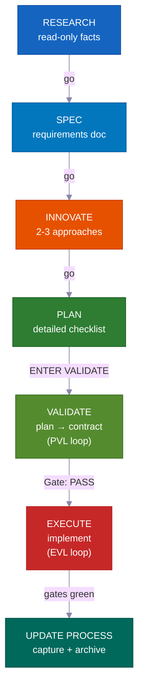

**Ở chế độ tương tác**, mỗi giai đoạn chờ "go" của bạn trước khi tiếp tục — bạn luôn nắm quyền kiểm soát ở mỗi bước. **Ở chế độ autopilot hoặc /goal**, bạn phê duyệt một lần từ đầu, rồi hệ thống tự chạy đến khi xong. Nó chỉ dừng ở ba hard stop cụ thể liệt kê bên dưới. **VALIDATE** và bài test chạy lại sau EXECUTE không phải tùy chọn — chúng là cổng cứng ngăn công việc kém chất lượng được xuất bản — và chạy tự động ở cả hai chế độ.

---

## Cuộc Cách Mạng Vibe Coding

<div align="center">
<h3><em>"Ngôn ngữ lập trình hot nhất hiện nay là tiếng Anh."</em></h3>
<strong>— Andrej Karpathy</strong>
</div>

<br>

**Vibe coding thay đổi ai có thể xây dựng phần mềm. Phát triển lập kế hoạch trước thay đổi những gì họ có thể xuất bản.**

<table>
<tr>
<td align="center" width="50%"><h3>63%</h3><sub>người dùng vibe coding <strong>KHÔNG</strong> phải là lập trình viên</sub></td>
<td align="center" width="50%"><h3>16.2M</h3><sub>citizen developer trên toàn thế giới<br>(tăng trưởng 38% mỗi năm)</sub></td>
</tr>
<tr>
<td align="center" width="50%"><h3>$4.7B</h3><sub>thị trường vibe coding<br>tăng trưởng 38% hàng năm</sub></td>
<td align="center" width="50%"><h3>25%</h3><sub>startup YC W25 có hơn 95% codebase được tạo bởi AI</sub></td>
</tr>
</table>

Hầu hết các công cụ giúp bạn bắt đầu một dự án. Bộ kit này giúp bạn **hoàn thành nó** — với kế hoạch mà nhóm của bạn có thể xem xét, kiến thức không bao giờ lỗi thời, và kiểm tra an toàn phát hiện lỗi trước khi xuất bản.

---

## Dành Cho Ai?

<div align="center">
<h3><em>"Điều quan trọng không phải là ai đã gõ nó. Mà là cái gì đã được xuất bản."</em></h3>
<strong>— Garry Tan, YC</strong>
</div>

<br>

<table>
<tr>
<td width="50%" valign="top">
<h1>🧑‍💼</h1>
<strong>CEO / Nhà Sáng Lập</strong><br><br>
<em>"Xây cho tôi một SaaS với xác thực, thanh toán, và trang đích"</em><br><br>
Agent nghiên cứu công nghệ của bạn, viết một kế hoạch kiến trúc bạn có thể xem xét, triển khai với bài test, và lưu lại mọi quyết định để đồng sáng lập kỹ thuật của bạn kiểm tra sau.
</td>
<td width="50%" valign="top">
<h1>📊</h1>
<strong>Product Manager</strong><br><br>
<em>"Tạo dashboard hiển thị MRR, churn, và chỉ số tăng trưởng"</em><br><br>
Nó tạo ra SPEC kiểu PRD, lấy sự chấp thuận của bạn trước khi viết code, triển khai đúng spec, và lưu trữ kế hoạch như lịch sử dự án có thể tìm kiếm được.
</td>
</tr>
<tr>
<td width="50%" valign="top">
<h1>🎨</h1>
<strong>Designer</strong><br><br>
<em>"Khớp màn hình Figma này hoàn hảo từng pixel"</em><br><br>
Agent nhận biết thiết kế phân tích mockup của bạn, triển khai từng component với design token của bạn, và tạo kiểm tra so sánh hình ảnh.
</td>
<td width="50%" valign="top">
<h1>⚙️</h1>
<strong>Kỹ Sư</strong><br><br>
<em>"Refactor module xác thực để hỗ trợ RBAC mà không có downtime"</em><br><br>
Nó nghiên cứu code xác thực hiện tại của bạn và cách các codebase khác giải quyết RBAC, viết kế hoạch migration ánh xạ các file có thể bị ảnh hưởng, rồi xây dựng an toàn với ghi chú rollback.
</td>
</tr>
</table>

---

## So Sánh

| Tính năng | vibecode-pro-max-kit | Superpowers | GSD | gstack |
|---------|---------------------|-------------|-----|--------|
| Vòng đời lập kế hoạch trước | RIPER-5 đầy đủ (research → spec → innovate → plan → validate → execute → update) | Quy trình bắt buộc | Sửa context-rot | Một phần |
| An toàn khóa từng bước | Tool của agent bị giới hạn theo giai đoạn (nghiên cứu chỉ đọc, không ghi trong innovate) | Ràng buộc dựa trên skill | Tách giai đoạn | Không có |
| Vòng lặp kiểm tra chất lượng | **Hai** — PVL (kiểm tra kế hoạch) + EVL (chạy lại bài test độc lập) | Theo skill | Không tự động | Không có |
| Hỗ trợ nhiều công cụ | 7 công cụ qua chuẩn mở `AGENTS.md` + `SKILL.md` | Plugin Claude Code | 14 runtime | 1 công cụ |
| Kiến thức tự cải thiện | Kiến thức theo chủ đề, cập nhật sau mỗi tính năng | Bộ nhớ plugin | Trạng thái lưu trên đĩa | Thủ công |
| Cộng tác nhóm | Kế hoạch, spec, và file review dùng chung | Cá nhân | Cá nhân | Cá nhân |
| Hệ thống skill | 33 tự khám phá, khớp từ khóa ở mỗi prompt | 86 skill có thể kết hợp | Meta-prompting | 23 role tool |
| Dự án lớn nhiều giai đoạn | Kế hoạch umbrella + vòng lặp nội bộ theo giai đoạn với kiểm tra hồi quy | Tác vụ đơn lẻ | Tác vụ đơn lẻ | Tác vụ đơn lẻ |
| Chế độ tự động | Autopilot (3 chế độ) + đồng ý `/goal` thường trực | Thủ công | Thủ công | Thủ công |
| Cài đặt | `curl` 30 giây + thiết lập tự định tuyến | Plugin marketplace | npx một dòng | git clone |

> **Về độ rộng runtime:** GSD hỗ trợ 14 runtime. Chúng tôi hỗ trợ 7 theo chiều sâu — với agent harness đầy đủ, khám phá skill, và lifecycle hook trên mọi nền tảng. Rộng hay sâu: tùy bạn chọn.

---

## ⚡ Điểm Khác Biệt

<table>
<tr>
<td width="50%" valign="top">
<h1>🔒</h1>
<strong>Giới Hạn Tool Khóa Theo Bước</strong><br><br>
Agent của bạn <strong>thực sự không thể</strong> viết code trong khi nghiên cứu. RESEARCH chỉ đọc, INNOVATE không có Write, PLAN/VALIDATE chỉ ghi vào <code>process/</code>. <strong>Giới hạn năng lực thực sự</strong>, không chỉ là gợi ý.
</td>
<td width="50%" valign="top">
<h1>🎯</h1>
<strong>Agent Dẫn Đầu Không Bao Giờ Chạm Vào Code</strong><br><br>
Coordinator định tuyến, giám sát, và điều khiển vòng lặp — nó <strong>không bao giờ chỉnh sửa file nguồn hay tự chạy bài test</strong>. Mọi chỉnh sửa và mọi lần chạy test đều xảy ra bên trong một sub-agent chuyên dụng. Không có công việc ẩn.
</td>
</tr>
<tr>
<td width="50%" valign="top">
<h1>🔍</h1>
<strong>Khám Phá Skill Tự Động</strong><br><br>
Trước khi xử lý bất kỳ yêu cầu nào, nó quét <strong>33 skill</strong> và khớp từ khóa. Nói "thêm hỗ trợ webhook" và <code>vc-security</code> + <code>vc-scenario</code> được kéo vào tự động.
</td>
<td width="50%" valign="top">
<h1>💾</h1>
<strong>Sống Qua Các Lần Reset Phiên</strong><br><br>
Kế hoạch, báo cáo, tài liệu kiến thức, và bài học đều tồn tại trên đĩa. Hook khởi động khôi phục cổng phê duyệt sau khi reset phiên. <strong>Không có gì bị mất.</strong>
</td>
</tr>
<tr>
<td width="50%" valign="top">
<h1>🛡️</h1>
<strong>Tự Cảnh Báo Bỏ Qua Bước</strong><br><br>
Khi agent sắp bỏ qua một bước bắt buộc, nó tự dừng lại: <em>"PHASE JUMPING PREVENTED."</em> Một <strong>cơ chế bảo vệ tích hợp chống lại việc tắt tắt quy trình</strong>.
</td>
<td width="50%" valign="top">
<h1>🔄</h1>
<strong>Hoạt Động Trên 7 Công Cụ AI Coding</strong><br><br>
Hai chuẩn mở — <code>AGENTS.md</code> và <code>SKILL.md</code> — nghĩa là <strong>không cần adapter, không cần plugin.</strong> Bắt đầu trong Claude Code, chuyển sang Cursor, tiếp tục trong Codex.
</td>
</tr>
</table>

---

## 🧭 Cách Hoạt Động — The Coordinator

Phiên làm việc chính của bạn là một **coordinator** (gọi là orchestrator), không phải người thực thi. Nó làm bốn việc và không có gì khác:

```
Yêu cầu của bạn
  → Bước 0: Khám phá Skill (quét 33 skill, khớp từ khóa, đính kèm ứng viên)
  → Phát hiện ý định (tính năng / bug / câu hỏi / refactor / UI) + đánh giá mức độ mơ hồ
  → Định tuyến đến agent phù hợp trong context window mới
  → Giám sát: tuân thủ bước, mã trạng thái, điều khiển vòng lặp
```

<table>
<tr>
<td width="50%" valign="top">
<h1>🧑‍✈️</h1>
<strong>Ủy quyền, không bao giờ tự triển khai</strong><br><br>
Nghiên cứu → <code>vc-research-agent</code>. Kế hoạch → <code>vc-plan-agent</code>. Code → <code>vc-execute-agent</code>. Coordinator bàn giao đúng ngữ cảnh và chờ — nó không bao giờ tự làm công việc thực tế.
</td>
<td width="50%" valign="top">
<h1>🚫</h1>
<strong>Không có thực thi ẩn — bao giờ hết</strong><br><br>
Khi một kế hoạch với checklist đã thống nhất tồn tại, "ENTER EXECUTE MODE" <strong>luôn luôn</strong> khởi chạy <code>vc-execute-agent</code>. Ngay cả sửa một dòng cũng phải qua đó. Bài test chỉ chạy bên trong một <code>vc-tester</code> chuyên dụng. Điều này áp dụng bất kể quy mô thay đổi.
</td>
</tr>
<tr>
<td width="50%" valign="top">
<h1>📨</h1>
<strong>Mã trạng thái rõ ràng, không phải tín hiệu mơ hồ</strong><br><br>
Mỗi sub-agent kết thúc với một trong các mã: <code>DONE</code> · <code>DONE_WITH_CONCERNS</code> · <code>BLOCKED</code> · <code>NEEDS_CONTEXT</code>. Coordinator không bao giờ bỏ qua trình chặn và không bao giờ thử lại cùng phương pháp bị chặn ba lần.
</td>
<td width="50%" valign="top">
<h1>🔁</h1>
<strong>Điều khiển vòng lặp sửa lỗi</strong><br><br>
Sub-agent chạy một lần, báo cáo kết quả, và dừng. Chỉ coordinator mới khởi chạy lại chúng. Nó điều khiển cả vòng lặp PVL (kiểm tra-sửa kế hoạch) và EVL (kiểm tra-sửa bài test) và sở hữu tất cả việc theo dõi.
</td>
</tr>
</table>

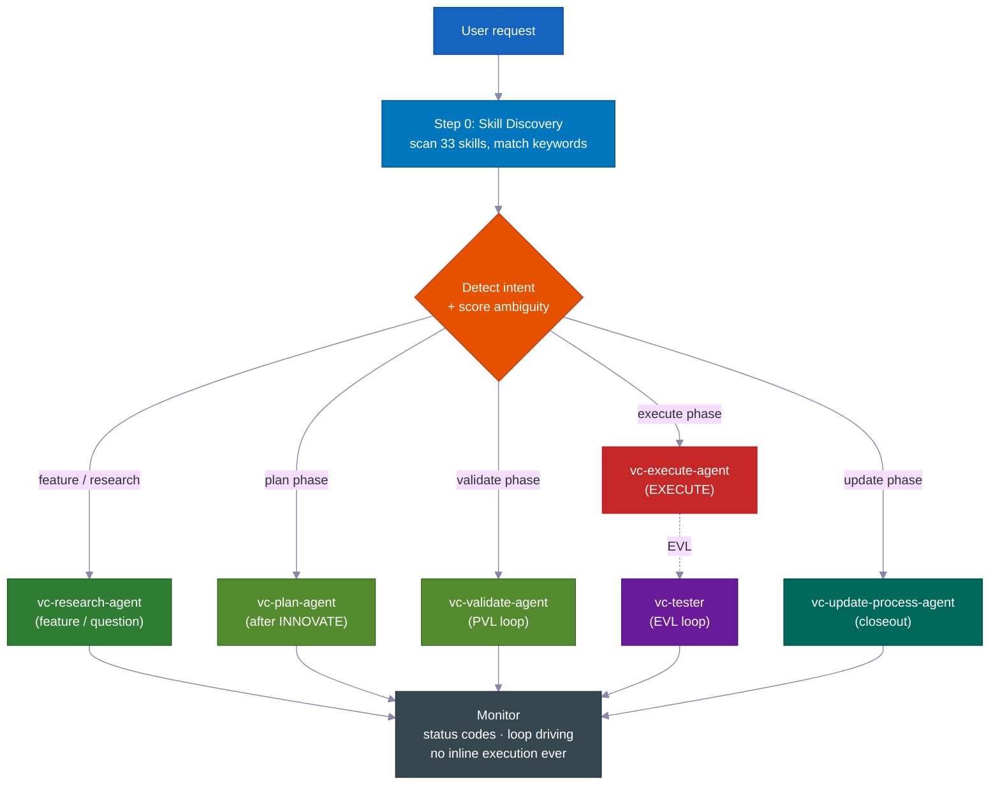

> **Tại sao điều này quan trọng:** một agent vừa có thể quyết định *vừa* bí mật chỉnh sửa sẽ tìm cách bỏ qua kế hoạch. Bằng cách tách coordinator khỏi các worker (sub-agent), quy trình trở nên trung thực về mặt cấu trúc — cách duy nhất để viết code là đi qua các bước bắt buộc.

---
## 📊 Vòng đời RIPER-5

| Giai đoạn | Nội dung | Agent | Bạn nói |
|-------|-------------|-------|---------|
| 🔍 **RESEARCH** | Thu thập thông tin chỉ đọc — codebase và web. Không bao giờ sửa file. | `vc-research-agent` | *(tự động khi có yêu cầu tính năng)* |
| 📝 **SPEC** | Tài liệu yêu cầu khám phá sản phẩm — câu chuyện người dùng, tiêu chí chấp nhận, phạm vi ngoài — để **bạn xem xét trước khi thiết kế**. | `vc-spec-agent` | `go` / `ENTER SPEC MODE` |
| 💡 **INNOVATE** | Khám phá 2-3 hướng tiếp cận kèm đánh đổi. Tóm tắt quyết định (được chọn + bị loại + lý do). | `vc-innovate-agent` | `go` |
| 📋 **PLAN** | Viết đặc tả chi tiết: các điểm chạm, hợp đồng công khai, file được phép sửa, bằng chứng xác minh, bàn giao tiếp nối. | `vc-plan-agent` | `go` |
| ✅ **VALIDATE** | Chuyển kế hoạch thành danh sách kiểm tra đã thống nhất (các checkpoint V1–V7). Kết quả: **PASS / CONDITIONAL / BLOCKED**. Chạy vòng lặp PVL. | `vc-validate-agent` | `ENTER VALIDATE MODE` |
| ⚡ **EXECUTE** | Triển khai *đúng theo* kế hoạch. Ghi chú tiến độ vào báo cáo giai đoạn, quy trình xử lý sai lệch, tự đánh giá. Sau đó vòng lặp EVL chạy lại các checkpoint. | `vc-execute-agent` | `ENTER EXECUTE MODE` |
| 🧠 **UPDATE PROCESS** | Ghi lại bài học, cập nhật ngữ cảnh, lưu trữ kế hoạch, viết gói đóng gói. | `vc-update-process-agent` | *(khuyến nghị sau công việc không tầm thường)* |

> 📝 **Lý do SPEC là giai đoạn riêng:** hầu hết các hệ thống agent nhảy thẳng từ "hiểu" sang "thiết kế." Việc thêm bước khám phá sản phẩm SPEC có nghĩa là *bạn* (hoặc PM của bạn) phê duyệt **cái gì** sẽ được xây dựng — dưới dạng câu chuyện người dùng và tiêu chí chấp nhận đơn giản — *trước khi* agent tranh luận về **cách** làm. Đây là nơi rẻ nhất có thể để phát hiện hiểu nhầm. (Trong vòng lặp bên trong của chương trình theo giai đoạn, SPEC bị bỏ qua — SPEC tổng quát điều hành tất cả các giai đoạn.)
>
> **SPEC là thước đo.** Nó phát biểu hành vi kỳ vọng bằng ngôn ngữ đơn giản bạn có thể đọc lướt trong một phút. Mỗi giai đoạn sau nó — Innovate, Plan, Validate, Execute — đều kiểm tra lại và đặt cùng một câu hỏi: *thứ chúng ta đang xây có thực sự là thứ bạn yêu cầu không?* Khi công việc bắt đầu lệch hướng, SPEC là thứ phát hiện ra điều đó.

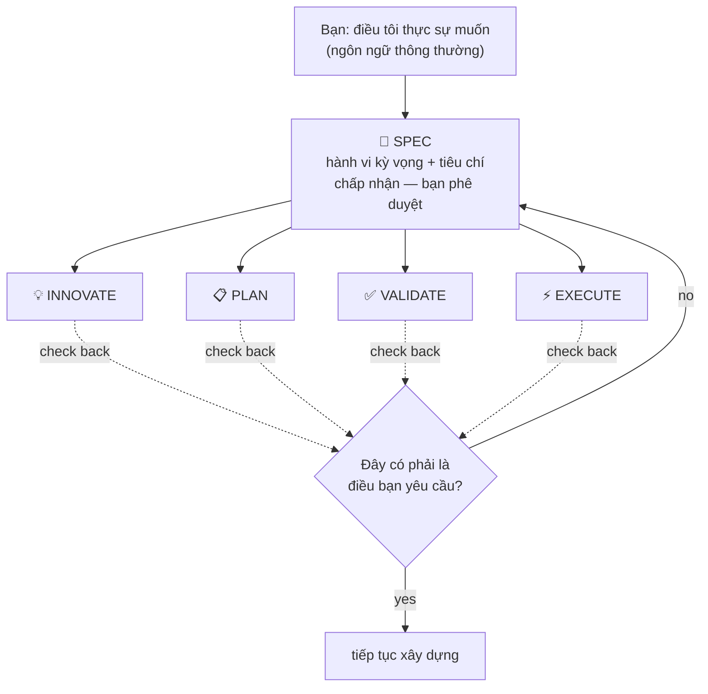

<br>

### 💻 Ví dụ phiên làm việc

```
# 🆕 Feature request
You: "add webhook support to the API"
→ Skill discovery surfaces: vc-scenario, vc-security
→ research-agent gathers context (read-only, can't touch code)
→ "go" → spec-agent writes requirements doc → you approve
→ "go" → innovate-agent compares approaches → decision summary
→ "go" → plan-agent writes the plan, listing which files it will touch
→ "ENTER VALIDATE MODE" → validate-agent gates the plan (PVL loop) → Gate: PASS
→ "ENTER EXECUTE MODE" → execute-agent implements → tester re-runs gates (EVL) → reviewer → git-manager
→ Closeout packet: what changed, what's verified, recommended next step
```

```
# 🐛 Bug fix
You: "login redirect is broken"
→ Routes to vc-debugger → gathers evidence FIRST → 2-3 competing hypotheses
→ Systematically eliminates each → root cause with proof chain
→ execute-agent implements the fix → EVL re-test → quality pipeline
```

```
# ⏩ Fast mode
You: "ENTER FAST MODE - add rate limiting middleware"
→ Compressed RESEARCH + SPEC + INNOVATE + PLAN + VALIDATE in one pass
→ Mandatory safety pause after VALIDATE → you review → "ENTER EXECUTE MODE"
```

```
# 🤖 Autopilot (hands-free)
You: "autopilot full: build a notifications system"
→ ONE consolidated clarification round → provisional /goal block (standing consent)
→ Drives the full RIPER-5 sequence autonomously, pausing only on hard stops
```

```
# 🏗️ Large program
You: "build a full testing platform"
→ Umbrella plan + phase plans in a feature folder
→ Each phase inner loop: research → innovate → plan → PVL → execute → EVL → update
→ Progress survives context compaction — durable reports on disk
```

---

## 🎯 Làm rõ ý định

Trước khi định tuyến, agent dẫn dắt đánh giá mức độ mơ hồ trong yêu cầu của bạn theo **4 tín hiệu nhị phân (0–4)** và chọn một cấp độ. Nó chỉ đặt câu hỏi *khi câu trả lời thực sự thay đổi những gì nó sẽ làm.*

| Cấp độ | Khi nào | Hành vi |
|---|---|---|
| **Cấp 0** — tự động định tuyến im lặng | Điểm 0–1, hoặc bạn nói "go" / "just do it", hoặc đang tiếp tục một kế hoạch | Định tuyến ngay lập tức, không hỏi |
| **Cấp 1** — tóm tắt nội tuyến | Điểm 2 | Trình bày cách hiểu + tuyến đã chọn trong một dòng, rồi tiến hành |
| **Cấp 2** — câu hỏi | Điểm 3+ | Đặt câu hỏi trắc nghiệm có trọng tâm trước khi định tuyến |

> 🧠 **Tối đa hai vòng.** Nếu vẫn chưa rõ sau Cấp 2, nó đặt một câu hỏi cuối cùng đơn giản, rồi mặc định chuyển sang nghiên cứu với phạm vi hợp lý hẹp nhất. Nó không bao giờ lặp vô tận việc làm rõ. Sau RESEARCH, nó kiểm tra lại ý định — nếu nghiên cứu cho thấy yêu cầu khác với giả định ban đầu, nó trình bày lại; nếu được xác nhận, nó tiến hành mà không hỏi lại.

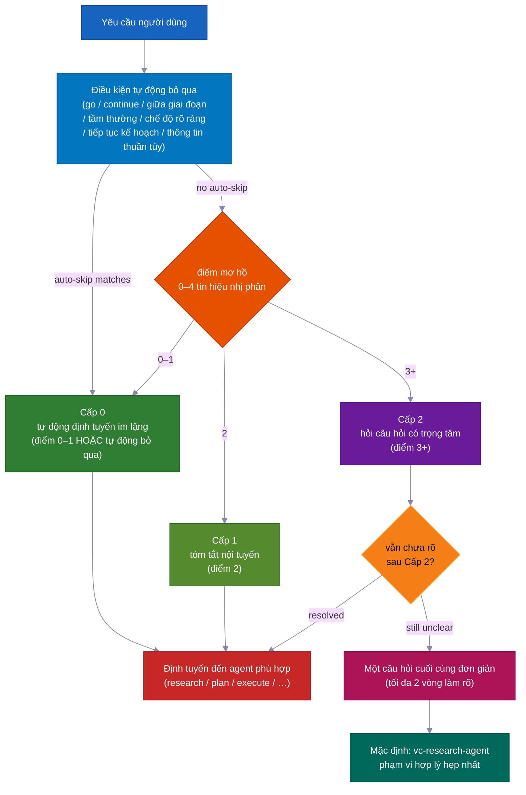

---

## ✅ Hai vòng lặp chất lượng — PVL + EVL

Hầu hết các hệ thống agent chỉ kiểm tra *một lần*, nếu có. Hệ thống này bọc EXECUTE trong **hai vòng lặp độc lập** — một vòng trước khi code được viết, một vòng sau.

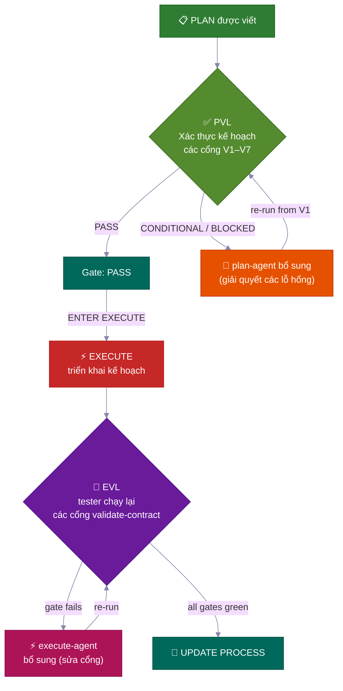

<table>
<tr>
<td width="50%" valign="top">
<h3>📋 PVL — Plan-Validate-Fix</h3>
Trước EXECUTE, <code>vc-validate-agent</code> chạy kế hoạch qua <strong>các checkpoint V1–V7</strong> — phân chia công việc cho nhiều agent để bao phủ hạ tầng, độ phủ kiểm thử, thay đổi phá vỡ, bảo mật, và tính khả thi từng phần. Kết quả <strong>CONDITIONAL</strong> hoặc <strong>BLOCKED</strong> ở lần chạy đầu không bao giờ là kết thúc — nó định tuyến về <code>vc-plan-agent</code> để cập nhật kế hoạch, rồi kiểm tra lại từ V1.
<br><br>
<sub>Được theo dõi bởi <code>vc-autoresearch</code> (domain: plan) — vòng lặp tìm-lỗ hổng-và-sửa. Giới hạn 10 vòng. Phát hiện bình nguyên. Chỉ <strong>Gate: PASS</strong> (hoặc CONDITIONAL bạn chấp nhận rõ ràng) mới mở khóa EXECUTE.</sub>
</td>
<td width="50%" valign="top">
<h3>🧪 EVL — Execute-Validate-Fix</h3>
Sau khi EXECUTE báo cáo xong — <strong>ngay cả khi nó tuyên bố tất cả checkpoint đều xanh</strong> — agent dẫn dắt <strong>luôn luôn</strong> triển khai <code>vc-tester</code> để độc lập chạy lại đúng các lệnh kiểm thử trong danh sách đã thống nhất. Checkpoint thất bại sẽ định tuyến đến <code>vc-execute-agent</code> sửa lỗi có phạm vi, rồi kiểm thử lại.
<br><br>
<sub>Được theo dõi bởi <code>vc-autoresearch</code> (domain: tests). Giới hạn 10 vòng. Vòng lặp "lặp cho đến khi xanh" nội bộ của execute-agent <strong>không bao giờ</strong> thay thế được bước xác nhận độc lập này.</sub>
</td>
</tr>
</table>

> 💎 **Bậc thang kết quả:** **PASS** → tiếp tục · **CONDITIONAL** → lỗ hổng có thể sửa; vòng lặp kích hoạt (hoặc bạn chấp nhận chúng có ghi chú) · **BLOCKED** → vấn đề sâu hơn; quay về PLAN (khi dùng autopilot: lỗ hổng vào backlog và quá trình tiếp tục).

### 🔁 vc-autoresearch — Động cơ vòng lặp chung

Cả PVL lẫn EVL đều dùng cùng một lớp theo dõi: **`vc-autoresearch`** — vòng lặp tìm-lỗ hổng → sửa → lặp lại. Agent dẫn dắt điều khiển vòng lặp — nó sở hữu bộ đếm vòng, báo cáo mỗi vòng, nhật ký TSV, và kiểm tra bình nguyên/giới hạn/hồi quy. Các agent làm việc là fire-and-forget: chúng trả về kết quả và dừng. Không agent nào tự triển khai lại hay triển khai agent giai đoạn khác.

Cùng một động cơ có thể chạy độc lập: "củng cố đặc tả này", "sửa tất cả lint", "cải thiện độ phủ kiểm thử", "cải thiện tài liệu này" — bất kỳ tác vụ tìm-lỗ hổng-và-sửa lặp đi lặp lại nào trên 6 miền (spec · tests · ux · docs · plan · errors).

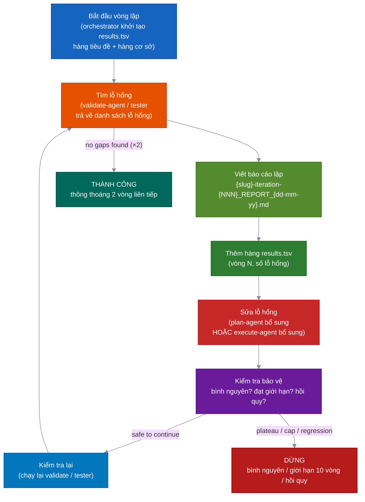

| Chế độ | Làm gì | Dừng khi |
|---|---|---|
| `vc-autoresearch` (cốt lõi) | tìm lỗ hổng → sửa → lặp lại | không còn lỗ hổng HOẶC đạt mục tiêu chỉ số |
| `vc-autoresearch:probe` | 8 chân dung hỏi vặn corpus cho đến bão hòa | không có ràng buộc mới trong 3 vòng |
| `vc-autoresearch:reason` | tranh luận đối nghịch với giám khảo mù | giám khảo hội tụ hoặc đạt giới hạn lặp |
| `vc-autoresearch:evals` | phân tích kết quả TSV — xu hướng, bình nguyên, khuyến nghị | chỉ phân tích |

**Điều kiện dừng:** SUCCESS (thông thoáng hai vòng liên tiếp) · HALT_PLATEAU (không tiến triển trong 3 vòng) · HALT_CAP (giới hạn cứng 10 vòng) · HALT_REGRESSION (một kiểm tra đang pass nay thất bại).

---

## 👥 So sánh chiến lược + Chính sách chọn model

Tại **mỗi lần chuyển giai đoạn**, agent dẫn dắt gọi `vc-agent-strategy-compare` để khuyến nghị *cách* chạy giai đoạn tiếp theo — kèm ước tính chi phí.

| Chiến lược | Khi nào | Phối hợp |
|---|---|---|
| **Sequential** | Công việc phụ thuộc vào đầu ra trước | Một agent mỗi lúc |
| **Parallel subagents** | Các chiều độc lập, fire-and-forget | Không có — agent dẫn dắt thu thập + kết hợp kết quả |
| **Workflow** | Phân chia công việc có thể đoán trước trên một danh sách | Các bước được lập trình |
| **Agent team** | Các agent phải nói chuyện với nhau trong khi chạy (ví dụ: mỗi agent chạm vào file riêng biệt trên 3+ kế hoạch giai đoạn) | TeamCreate + danh sách tác vụ chung + SendMessage |

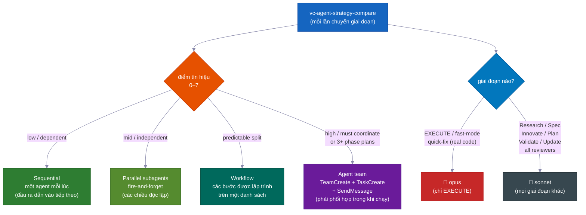

> ⚠️ **"Agent team" có nghĩa là máy móc thực sự** — các đồng đội được đặt tên, một danh sách tác vụ chung, và nhắn tin giữa các agent — *không phải* các agent song song đơn thuần được gọi là "team." Nó là **bắt buộc** (không tùy chọn) khi tạo 3+ kế hoạch giai đoạn và cho các chỉnh sửa nhiều file mà mỗi agent phải ở trong file của riêng mình. Chỉ một team thực sự mới có thể giao tiếp trong khi chạy.

### 🧮 Chính sách chọn model

| Giai đoạn | Model | Lý do |
|---|---|---|
| **EXECUTE** (+ fast-mode, quick-fix làm code thực) | 🔴 **opus** | Chỉnh sửa mã nguồn thực, build, migration |
| Research · Spec · Innovate · Plan · Validate · Update · tất cả reviewer/researcher | 🔵 **sonnet** | Lập kế hoạch và phân tích — rẻ hơn, đủ năng lực |

> Khi công việc được chia cho nhiều agent, chỉ agent *coding* dùng opus. Mọi reviewer, researcher, validator và planner đều dùng sonnet. Agent dẫn dắt đặt tên model mỗi khi triển khai một agent.

---

## 🤖 Chế độ Autopilot — RIPER-5 Không Cần Tay

Nói **`autopilot [task]`** (hoặc `run autopilot`, `autonomous mode`, `ENTER AUTOPILOT MODE`) và agent chạy *toàn bộ* chuỗi RIPER-5 còn lại với **một** vòng làm rõ trước — sau đó không dừng nữa cho đến khi xong.

**Kích hoạt bất cứ đâu:** autopilot có thể bắt đầu từ đầu phiên *hoặc* bất kỳ lúc nào giữa chừng. Khi kích hoạt, agent dẫn dắt đọc các file đã lưu trên đĩa để xác định bạn đang ở giai đoạn RIPER-5 nào, rồi tiếp tục từ đó và tự điều khiển phần còn lại.

| Trạng thái trên đĩa | Giai đoạn vào |
|---|---|
| Không có file SPEC | Bắt đầu tại RESEARCH |
| Có file SPEC | Bỏ qua đến sau-SPEC (INNOVATE) |
| Có file kế hoạch | Bỏ qua đến sau-PLAN (VALIDATE) |
| Validate-contract với PASS/CONDITIONAL | Bỏ qua đến EXECUTE |

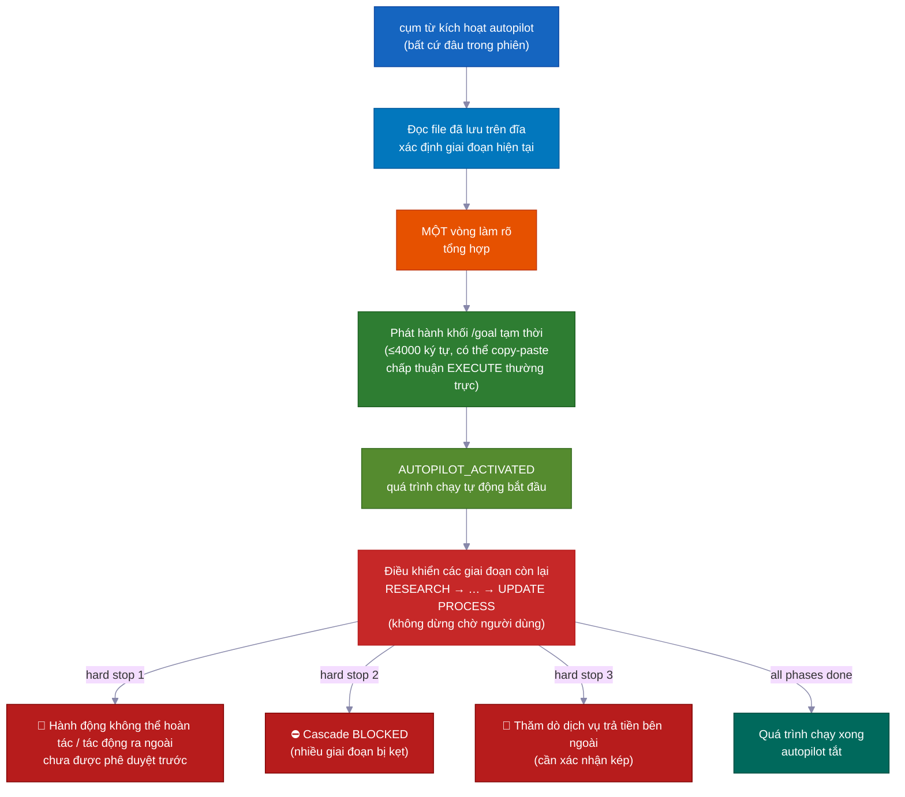

```
You: "autopilot full: add team invitations with email + role management"
→ Reads saved files → detects current phase → enters there
→ ONE consolidated clarification round (scope, hard stops, autonomy boundaries, first-phase strategy)
→ Provisional /goal block emitted (≤4000 chars, copy-pasteable, standing EXECUTE consent)
→ AUTOPILOT_ACTIVATED → drives remaining phases on its own
→ Stops ONLY for hard stops
```

### Ba làn — chọn mức độ phù hợp với rủi ro

| Làn | Kích hoạt | Luồng |
|---|---|---|
| 🟢 **quick** | `autopilot quick: [task]` | Trinh sát → chỉnh sửa → kiểm tra có phạm vi. Không kế hoạch, không hợp đồng, không EVL. |
| 🟡 **fast** | `autopilot fast: [task]` | Nén R→S→I→P→V → EXECUTE + EVL. |
| 🔴 **full** | `autopilot [task]` / `autopilot full:` | RIPER-5 đầy đủ (mặc định). |

### 🌙 Không Cần Tay: Một Câu Lệnh, Xây Trong Khi Bạn Ngủ

Nói `autopilot full: [task]` — hoặc dán một khối `/goal` — và tất cả những điều sau xảy ra với **không cần input từ người dùng**:

- **Vòng lặp kiểm tra-và-sửa kế hoạch** — tìm lỗ hổng trong kế hoạch, sửa chúng, và kiểm tra lại. Tự chạy đến 10 vòng.
- **Vòng lặp xây dựng-kiểm thử-và-sửa** — viết code, chạy kiểm thử, sửa lỗi, chạy lại. Tự chạy đến 10 vòng. Nó không bao giờ tin vào "tất cả xanh" của chính mình — một người kiểm tra riêng biệt (vc-tester) độc lập chạy lại mọi kiểm thử để xác nhận.
- **Chuyển giai đoạn tự động** — chuyển từ nghiên cứu sang kế hoạch sang code sang xong mà không chờ bạn.
- **Tiếp tục sau reset bộ nhớ** — kế hoạch, báo cáo và tiến độ đều là file trên đĩa. Sau khi nén (khi bộ nhớ ngắn hạn của AI bị xóa), phiên tiếp theo đọc những file đó và tiếp tục đúng chỗ đã dừng.
- **Tính năng bị kẹt? Gác lại, tiếp tục** — nếu một giai đoạn không thể giải quyết được, agent viết ghi chú backlog và chuyển sang tính năng tiếp theo. Bạn có thể chạy nhiều tính năng song song mà không bị một tắc nghẽn chặn tất cả.
- **Nhóm agent cho các tính năng song song** — nhiều agent có thể xây dựng các tính năng riêng biệt cùng lúc, mỗi agent bị khóa vào file của riêng mình để không bao giờ xung đột. Tính năng bị kẹt được gác lại, không chặn phần còn lại.

### Điểm dừng cứng luôn xuất hiện (ngay cả khi autopilot)

Đây là **ba lần duy nhất nó dừng và hỏi bạn**:

- 🛑 Bất cứ điều gì không thể hoàn tác, hoặc tác động ra thế giới bên ngoài mà chưa được phê duyệt trước (đưa lên live, gửi tin nhắn thực, tính tiền)
- ⛔ Nhiều giai đoạn liên tiếp bị kẹt mà không có tiến triển — một ngõ cụt thực sự đáng để bạn xem
- 💸 Một bài kiểm tra sẽ tiêu tiền thật trên dịch vụ bên ngoài trả tiền — nó hỏi trước khi chạy

---

### 🎯 /goal — token chạy tự động

**Bắt buộc, không phải trang trí:** sau mỗi lần hoàn thành giai đoạn VALIDATE, agent dẫn dắt *phải* phát hành một khối `/goal` có thể copy-paste trước khi EXECUTE bắt đầu. Đây là file bàn giao bắt buộc — không phải bình luận tùy chọn.

**Ràng buộc định dạng:**

| Loại khối | Trường bắt buộc | Giới hạn cứng |
|---|---|---|
| Khối sau-VALIDATE | SESSION GOAL · Charter+umbrella plan · Autonomy · Hard stop conditions · Next phase · Validate contract · Execute start | ≤ 4000 ký tự |
| Khối tạm thời (autopilot) | SESSION GOAL · ENTRY PHASE · REMAINING PHASES · CLARIFICATIONS LOCKED · EXECUTE CONSENT · DECISION POLICY · HARD STOPS · TEST GATES · START (+ LANE tùy chọn) | ≤ 4000 ký tự |

Lệnh `/goal` từ chối các khối dài hơn 4000 ký tự. Giữ ngắn gọn — dùng các trường bắt buộc làm cấu trúc, không phải bài văn xuôi.

**Chế độ /goal độc lập:** dán một khối `/goal` vào phiên mới và quá trình chạy tiếp tục từ giai đoạn được đặt tên trong `START`. Các làm rõ và quy tắc quyết định đã được thiết lập — không có vòng làm rõ mới. Với một `/goal` thường trực, agent tự quyết định ở mọi bước có thể hoàn tác, gửi các mục BLOCKED vào backlog, và tự viết báo cáo — nhưng **ủy quyền cho agent làm việc vẫn bắt buộc.** Autopilot chỉ loại bỏ *các điểm dừng phê duyệt*, không bao giờ bỏ quy tắc không-thực-thi-trực-tiếp.

Được xác thực bởi `validate-autopilot-goal-block.mjs`.

---

## 🔬 Thăm dò tính khả thi + Lưới an toàn Validator

### 🔬 Thăm dò tính khả thi — kiểm tra giả định trước khi xây dựng trên đó

Khi SPEC, INNOVATE, hoặc VALIDATE gặp một giả định then chốt không thể xác nhận chỉ bằng đọc, nó phát hành `VC-FEASIBILITY-PROBE-NEEDED` và dừng. Agent dẫn dắt triển khai `vc-debugger` để chạy kiểm thử thực và viết một **VERDICT**:

| Kết quả | Ý nghĩa |
|---|---|
| ✅ **VIABLE** | Giả định đúng — thiết kế có thể dựa vào nó |
| ❌ **NOT-VIABLE** | Giả định sai — hướng tiếp cận đó bị cấm |
| ❓ **INCONCLUSIVE** | Không thể chứng minh — được chuyển tiếp là lỗ hổng đã biết |

Mỗi kết quả kèm theo ghi chú thiết kế 3 phần: **điều kết quả cho phép · điều nó loại trừ · điều còn không chắc** — được đưa nguyên văn trở lại giai đoạn đã tạm dừng. Các thăm dò được **phân loại chi phí** (`cheap-local` / `needs-container` / `needs-live-provider` → xác nhận kép / `needs-browser` / `needs-cf`) để thăm dò tốn tiền hoặc dùng tài nguyên chung không bao giờ chạy âm thầm.

### 🛡️ 36 validator — tính đúng đắn cơ học, không phải ý kiến

Bộ kit đi kèm **36 script validator** biến "agent có tuân theo quy tắc không?" thành kết quả pass/fail rõ ràng. Chúng chạy sau bất kỳ giai đoạn nào chạm vào file harness, và như các checkpoint bắt buộc trong UPDATE PROCESS:

| Nhóm Validator | Kiểm tra |
|---|---|
| `vc-audit-vc` | Parity agent (Claude/Codex), registry skill, tính di động kit, frontmatter agent |
| `vc-audit-context` | Định tuyến ngữ cảnh, frontmatter khám phá, từ khóa skill |
| `vc-audit-plans` | Kiểm kê kế hoạch, trạng thái umbrella, tính đầy đủ giai đoạn, báo cáo giai đoạn, ghi chú backlog |
| 14 validator hành vi hệ thống VC | Mỗi validator sở hữu một cặp fixture pass/fail — đầu ra strategy-compare, closeout, intent-clarify, kết quả khả thi, nhật ký autoresearch, và nhiều hơn |

---

## 🛡️ Hệ thống an toàn tích hợp

Đây không phải là hướng dẫn — chúng là **các quy tắc cứng** được tích hợp vào mọi agent.

<table>
<tr>
<td width="50%" valign="top">
<h1>📝</h1>
<strong>Ghi chú tiến độ, không dừng giữa chừng</strong><br><br>
Trong khi coding, agent ghi ghi chú tiến độ vào file báo cáo giai đoạn khi làm việc. Không dừng giữa chừng, không có lời nhắc "tiếp tục hay quay lại?". Nếu gặp vấn đề cần thay đổi kế hoạch, nó dừng và quay về PLAN. Nếu không, nó tiếp tục.
</td>
<td width="50%" valign="top">
<h1>🚫</h1>
<strong>Không bao giờ lặng lẽ sai lệch</strong><br><br>
Nếu coding gặp vấn đề cần thay đổi kế hoạch, agent <strong>dừng ngay lập tức</strong>, giải thích, và quay về PLAN. Không tự ứng biến im lặng.
</td>
</tr>
<tr>
<td width="50%" valign="top">
<h1>🔐</h1>
<strong>Hook bảo vệ quyền riêng tư</strong><br><br>
Agent bị <strong>chặn đọc</strong> <code>.env</code>, thông tin xác thực, khóa SSH, và file <code>.pem</code> mà không có phê duyệt rõ ràng.
</td>
<td width="50%" valign="top">
<h1>⚠️</h1>
<strong>Gói bằng chứng rủi ro cao</strong><br><br>
Đối với auth, billing, migration schema, hoặc thay đổi API công khai, hệ thống yêu cầu một <strong>gói bằng chứng 5 file</strong> chính thức trước khi gọi công việc là "xong" — luôn thủ công, không bao giờ bỏ qua tự động.
</td>
</tr>
<tr>
<td width="50%" valign="top">
<h1>📨</h1>
<strong>Kỷ luật mã trạng thái</strong><br><br>
Các agent làm việc phải kết thúc bằng <code>DONE</code> / <code>DONE_WITH_CONCERNS</code> / <code>BLOCKED</code> / <code>NEEDS_CONTEXT</code>. Các vấn đề tắc nghẽn không bao giờ bị bỏ qua; mối lo về tính đúng đắn trở thành các hạng mục hành động.
</td>
<td width="50%" valign="top">
<h1>📊</h1>
<strong>Đóng gói + Chấm điểm trượt</strong><br><br>
Sau khi coding, một gói đóng gói chấm điểm mức độ khẩn cấp: <strong>LOW</strong> (nhẹ) → <strong>MEDIUM</strong> (đáng kể) → <strong>HIGH</strong> (chạm file harness/protocol), và khuyến nghị bước an toàn tiếp theo.
</td>
</tr>
</table>

---

## 🔍 Thông minh trước khi triển khai

Trước khi một dòng code nào được viết, ba skill chuyên biệt có thể phát hiện vấn đề:

<table>
<tr>
<td width="50%" valign="top">
<h1>🎭</h1>
<strong>Tranh luận 5 chân dung — <code>vc-predict</code></strong><br><br>
Kiến trúc sư, Bảo mật, Hiệu suất, UX, và Người biện hộ phản đối tranh luận về kế hoạch của bạn. Tạo ra kết quả <strong>GO / CAUTION / STOP</strong> trước khi bạn viết một dòng.
</td>
<td width="50%" valign="top">
<h1>🎲</h1>
<strong>Trường hợp biên 12 chiều — <code>vc-scenario</code></strong><br><br>
Phân tách một tính năng theo 12 chiều (loại người dùng, giá trị cực biên đầu vào, thời gian, quy mô, trạng thái, môi trường, lỗi, auth, dữ liệu, tích hợp, tuân thủ, logic nghiệp vụ). Đầu ra kiêm luôn làm spec kiểm thử.
</td>
</tr>
<tr>
<td width="50%" valign="top">
<h1>🔐</h1>
<strong>Kiểm tra STRIDE + OWASP — <code>vc-security</code></strong><br><br>
Kiểm tra bảo mật hai phương pháp kèm kiểm tra phụ thuộc, phát hiện secret, và <strong>chế độ tự động sửa</strong> sắp xếp theo mức độ nghiêm trọng và sửa Critical trước với bảo vệ hồi quy.
</td>
<td width="50%" valign="top">
<h1>🔬</h1>
<strong>Gỡ lỗi dựa trên bằng chứng — <code>vc-debugger</code></strong><br><br>
Thu thập bằng chứng → hình thành 2-3 giả thuyết cạnh tranh → kiểm thử từng cái → ghi lại con đường loại trừ. <strong>Không bao giờ đoán — chứng minh.</strong>
</td>
</tr>
</table>

---

## ✅ Quy trình chất lượng — Tích hợp trong quá trình thực thi

**Kiểm thử trước, rồi code.** Danh sách kiểm tra đã thống nhất (được viết trước khi bất kỳ code nào được chạm vào) xác định chính xác các kiểm thử phải pass. Execute-agent viết code cho đến khi những kiểm thử đó chuyển xanh. Sau đó một người kiểm tra riêng biệt — `vc-tester` — tự chạy lại mọi kiểm thử để xác nhận. "Tất cả xanh" của execute-agent không bao giờ được chấp nhận mặt giá trị. Cuối cùng, reviewer kiểm tra rằng toàn bộ dự án vẫn hoạt động cùng nhau, không chỉ phần mới.

Execute-agent không chỉ viết code và gọi là xong. Nó đi qua một **quy trình chất lượng** tự động:

<br>

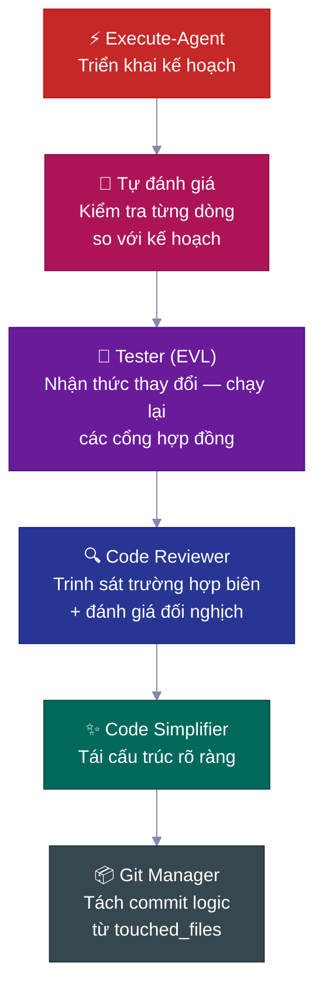

| Bước | Làm gì |
|---|---|
| 🔎 **Tự đánh giá** | Kiểm tra mọi hạng mục danh sách so với kế hoạch, ghi lại mọi sai lệch |
| 🧪 **Tester (EVL)** | Chạy lại các kiểm thử trong danh sách đã thống nhất độc lập; ánh xạ file đã thay đổi → file kiểm thử, leo thang lên toàn bộ bộ kiểm thử khi >70% được ánh xạ |
| 🔍 **Code reviewer** | Gửi trinh sát trường hợp biên *trước* khi đánh giá; kiểm tra truy vấn N+1, đường dẫn auth, rò rỉ dữ liệu |
| ✨ **Simplifier** | Gọn gàng code để rõ ràng sau khi đánh giá — không thay đổi hành vi |
| 📦 **Git manager** | Nhận `touched_files`, tách thành các commit thông thường có logic, từ chối file không rõ nguồn gốc |

---
## 📋 Vòng Đời Của Kế Hoạch

Mọi tính năng không tầm thường đều tuân theo **vòng đời kế hoạch** — một bản đặc tả được viết ra, xem xét, xây dựng theo đó, rồi lưu trữ như lịch sử dự án vĩnh viễn.

<br>

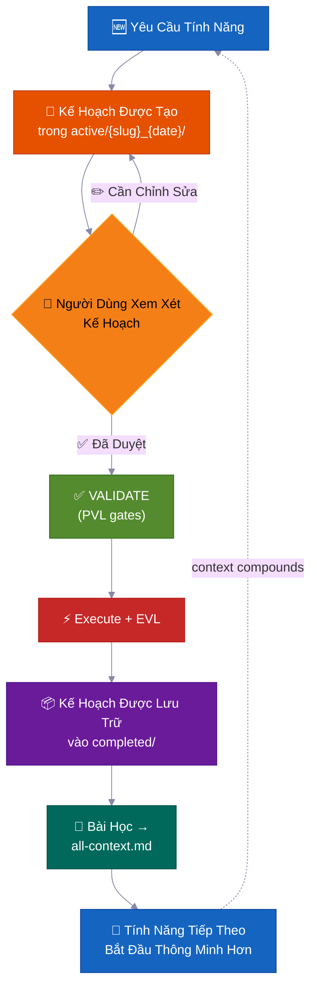

> 💡 Sáu tháng sau, khi ai đó hỏi *"tại sao chúng ta xây dựng xác thực theo cách này?"*, câu trả lời nằm trong `completed/`. Không bị mất trong một luồng Slack.

**Nơi các kế hoạch tồn tại — quy ước thư mục nhiệm vụ:**

```
process/
├── general-plans/
│   ├── active/
│   │   └── webhooks_28-05-26/          # 📋 Task folder: plan + colocated reports/refs
│   │       └── webhooks_PLAN_28-05-26.md
│   ├── completed/                       # ✅ Archived (searchable history)
│   └── backlog/                         # 📌 Deferred work
└── features/
    └── billing/                         # 🏷️ Feature-scoped (5+ artifacts)
        ├── active/{slug}_{date}/
        ├── completed/
        └── backlog/
```

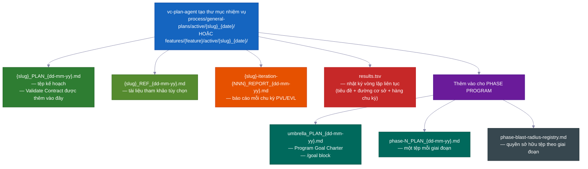

> Mỗi kế hoạch đều có: 📍 **điểm tiếp xúc** (tệp được tạo/sửa đổi) · 📜 **hợp đồng công khai** · 💥 **tệp nào có thể chạm vào** (điều gì có thể hỏng, điều gì cần kiểm thử) · ✅ **bằng chứng xác minh** · 🔄 **chuyển giao để tiếp tục**. `vc-plan-discovery` tìm đúng kế hoạch để tiếp tục; hook `post-write-plan-check` kiểm tra cấu trúc kế hoạch mỗi lần ghi kế hoạch.

---

## 🏗️ Chương Trình Theo Giai Đoạn — Dự Án Lớn Không Bị Sụp Đổ

Các tính năng thông thường dùng một kế hoạch. **Dự án lớn nhiều giai đoạn** dùng chương trình theo giai đoạn — một kế hoạch tổng thể cộng với các kế hoạch riêng mỗi giai đoạn, mỗi cái chạy một **vòng lặp bên trong 7 bước** với các điểm kiểm tra riêng và một báo cáo được lưu lại.

<br>

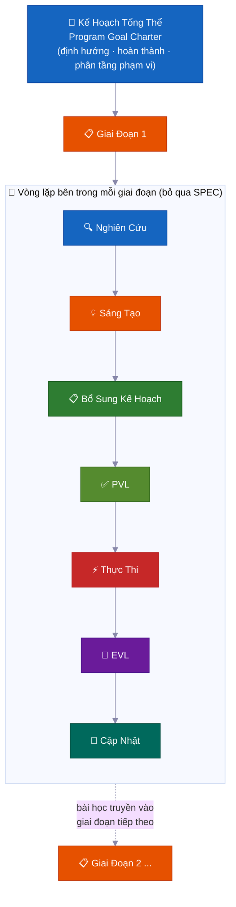

| | Tính năng | Tại sao quan trọng |
|---|---|---|
| 🔄 | **Nghiên cứu lại mỗi giai đoạn** | Kiểm tra độ trôi của code, đọc báo cáo mới nhất, làm mới các giả định |
| ✅ | **Điểm kiểm tra mỗi giai đoạn** | Một giai đoạn chưa xong cho đến khi bằng chứng chứng minh. Trạng thái thực: `PLANNED → CODE DONE → TESTING → VERIFIED` hoặc `BLOCKED` |
| 📄 | **Báo cáo được lưu** | Mỗi giai đoạn ghi kết quả ra đĩa — tiến độ sống sót sau khi bộ nhớ bị reset |
| 🧠 | **Bài học truyền tiếp** | Khám phá Giai đoạn 1 cập nhật kế hoạch Giai đoạn 2 trước khi bắt đầu lập trình |
| 🏗️ | **Nền tảng vs mở rộng** | Phân biệt rõ ràng "chứng minh kiến trúc" với "triển khai tất cả" |
| 🚧 | **Xử lý trở ngại trung thực** | Các giai đoạn bị mắc kẹt giữ trạng thái `BLOCKED` kèm bằng chứng. Không giả vờ màu xanh |

<br>

### 🔀 Chương Trình Tự Điều Chỉnh Khi Học

Kế hoạch bạn viết lúc đầu là bản đồ phác thảo, không phải hợp đồng cố định. Khi chương trình chạy, nó điều chỉnh — vì vậy bạn không cần dự đoán mọi bước trước.

**Nó có thể thêm một giai đoạn mới ở giữa quá trình chạy.**
Trong khi làm việc, AI có thể phát hiện một bước còn thiếu — điều phải xảy ra trước khi giai đoạn tiếp theo có thể tiến hành. Khi điều đó xảy ra, nó chèn một giai đoạn mới ngay đó, đánh số lại phần còn lại, và tiếp tục. Không cần người. (Tín hiệu nội bộ: `MID_PROGRAM_PLAN_CREATED` — kế hoạch mới được ghi ra đĩa và thêm vào sổ đăng ký tự động.)

**Nó có thể sắp xếp lại các giai đoạn.**
Nghiên cứu đôi khi cho thấy thứ tự đã lên kế hoạch là sai — ví dụ, Giai đoạn 3 phụ thuộc vào thứ mà chỉ Giai đoạn 4 tạo ra. AI sắp xếp lại các giai đoạn còn lại và ghi lại lý do. (Tín hiệu nội bộ: `PHASE_RESTRUCTURE_NOTICE` — được lưu trong báo cáo giai đoạn như hồ sơ kiểm toán, không phải vật cản.)

**Nó cập nhật kế hoạch riêng của mỗi giai đoạn ngay trước khi lập trình.**
Trước khi bất kỳ giai đoạn nào bắt đầu lập trình, một lượt nghiên cứu nhanh xem xét những gì chương trình đã học được cho đến nay. Sau đó nó cập nhật danh sách kiểm tra của giai đoạn đó với những phát hiện mới. Đây được gọi là bước **bổ sung kế hoạch**. Kế hoạch không bao giờ bị đóng băng — chúng hấp thụ dữ kiện mới từ các giai đoạn trước.

**Nó bỏ qua công việc chưa thể bắt đầu.**
Nếu một giai đoạn phụ thuộc vào thứ gì đó chưa sẵn sàng — một dịch vụ chưa được xây dựng, một quyết định chưa được đưa ra — AI đánh dấu giai đoạn đó là bị chặn do phụ thuộc, đặt sang một bên, và tiếp tục giai đoạn kế tiếp. Toàn bộ chương trình không bị đình trệ vì một giai đoạn đang chờ.

**Nó biết khi nào cần dừng và hỏi.**
Một giai đoạn bị mắc kẹt đơn thuần chỉ bị đưa vào danh sách chờ và chương trình tiếp tục. Nhưng nếu nhiều giai đoạn liên tiếp đều gặp bế tắc mà không có tiến triển, AI coi đó là ngõ cụt thực sự — **dừng theo chuỗi** — và tạm dừng để cho bạn thấy điều gì đã xảy ra. Một giai đoạn bị mắc kẹt là bình thường. Nhiều giai đoạn liên tiếp báo hiệu có gì đó sai về mặt cấu trúc.

**Nó duy trì bảng điểm trực tiếp.**
Mọi chương trình đều có phần trạng thái một trang trong kế hoạch tổng thể cho biết giai đoạn nào đang hiện tại, liệu nó đã xong chưa, và báo cáo nằm ở đâu. Bất kỳ ai — hoặc chính AI sau khi bộ nhớ bị reset — đều có thể đọc và biết chính xác tình hình. Nó cũng duy trì một sổ đăng ký tệp đơn giản để hai giai đoạn làm việc đồng thời không bao giờ chỉnh sửa cùng một tệp.

**Một lần kiểm tra cuối toàn diện.**
Vào cuối toàn bộ chương trình, AI chạy kiểm thử end-to-end để đảm bảo toàn bộ dự án vẫn hoạt động cùng nhau — không chỉ từng phần riêng lẻ. Các điểm kiểm tra mỗi giai đoạn chứng minh từng phần hoạt động; lần kiểm tra cuối này chứng minh các phần hoạt động như một thể thống nhất.

---

### 🧠 Nó Không Bao Giờ Mất Vị Trí (Sống Sót Sau Khi Bộ Nhớ Bị Reset)

Các công việc dài hoàn thành đúng — ngay cả khi bộ nhớ AI bị reset giữa chừng. Kế hoạch, tiến độ, và bằng chứng đều tồn tại trong các tệp trên đĩa, không chỉ trong đầu AI.

AI có bộ nhớ làm việc giới hạn. Trong một công việc dài, bộ nhớ đó đầy và bị nén xuống — chi tiết có thể bị nhòa. Khi một phiên mới bắt đầu (hoặc bộ nhớ bị xóa), AI không đoán mình đã dừng ở đâu. Nó đọc các tệp.

Đây là cách hoạt động cụ thể:

**1. Nó viết báo cáo ngắn sau mỗi giai đoạn.**
Khi một giai đoạn kết thúc, một tệp báo cáo được ghi ra đĩa. Tiến độ tồn tại trong thư mục dự án của bạn, không chỉ trong đầu AI. Việc bộ nhớ bị nén không thể xóa một tệp.

**2. Nó duy trì danh sách kiểm tra về các bước đã hoàn thành.**
Mỗi kế hoạch giai đoạn có danh sách **Phase Loop Progress** — các ô đánh dấu cho mọi bước (nghiên cứu, kiểm tra kế hoạch, xây dựng, kiểm thử, ghi lại bài học). Sau khi reset, AI đọc các ô đó và biết bước tiếp theo chính xác. Không cần bắt kịp nó.

**3. Một "phong bì" ngắn ở đầu mỗi giai đoạn.**
Mọi AI công việc (trợ lý tập trung thực hiện một giai đoạn công việc) bắt đầu bằng cách phát ra **Context Envelope** — ghi chú 10 trường: tính năng nào, giai đoạn nào, nhánh nào, tệp kế hoạch nào, kiểm thử nào cần chạy. Chỉ mất vài giây để đọc. AI sẵn sàng trước khi làm bất cứ điều gì.

**4. Nó tin tưởng tệp hơn bộ nhớ của mình.**
Khi tiếp tục, AI kiểm tra những gì thực sự có trong code và lịch sử git so với những gì kế hoạch nói. Trạng thái thực tế thắng. Một kế hoạch đã lỗi thời không thể đánh lừa AI lặp lại công việc hoặc bỏ qua các bước.

**5. Bảng điểm liên tục và báo cáo mỗi vòng.**
Mọi vòng sửa lỗi (vòng kiểm tra kế hoạch và vòng xây dựng-kiểm thử) đều duy trì tệp bảng điểm `results.tsv` — một hàng mỗi vòng, theo dõi còn bao nhiêu vấn đề. Khi một phiên kết thúc giữa vòng lặp, phiên tiếp theo đọc số đếm, tiếp tục từ đúng vòng đó, và tiếp tục. Không có vòng nào bị mất.

**6. Nó tiêm lại nhắc nhở khi tiếp tục.**
Khi bộ nhớ bị nén, hệ thống tự động tải lại ghi chú trạng thái mới nhất vào phiên mới. Nếu có bất kỳ phê duyệt nào đang chờ — chẳng hạn điểm kiểm tra cần "có" trước khi tiếp tục — nhắc nhở đánh dấu nó. Không có gì bị bỏ qua lặng lẽ.

> 💡 Tóm lại: bạn có thể bắt đầu chạy tự động, đóng máy tính, và quay lại vài giờ sau. AI sẽ đúng ở nơi nó phải ở — hoặc sẽ tiếp tục từ điểm kiểm tra đã lưu cuối cùng, với bằng chứng trên đĩa để chứng minh.

---

## 🧠 Nhóm Ngữ Cảnh

Kiến thức dự án được tổ chức thành **nhóm ngữ cảnh** — các lĩnh vực kiến thức ổn định, mỗi cái có tệp định tuyến `all-{group}.md` cho AI biết cần đọc gì và khi nào. AI theo tệp định tuyến, chỉ tải những gì liên quan — không phải toàn bộ cơ sở kiến thức mỗi lần.

<br>

```
process/context/
├── all-context.md              # 🧭 Định tuyến gốc — kiến trúc, stack, mẫu, quy ước
├── tests/all-tests.md          # 🧪 Bộ chạy kiểm thử, lệnh, quy trình gỡ lỗi
├── container/all-container.md   # 🐳 Docker, triển khai, quy trình hạ tầng
├── uxui/all-uxui.md            # 🎨 Thành phần, token thiết kế, mẫu
├── infra/all-infra.md          # 🖥️ Hạ tầng máy chủ, triển khai
└── {your-domain}/all-{domain}.md  # 📚 Bất kỳ lĩnh vực nào có 3+ tài liệu lâu dài (tự động thăng cấp)
```

| | Cách hoạt động |
|---|---|
| 🧭 **Mẫu định tuyến** | AI chỉ đọc những gì liên quan đến nhiệm vụ của nó |
| 📏 **Tự động thăng cấp** | Chủ đề có 3+ tài liệu (hoặc một tệp duy nhất trở nên quá lớn) có nhóm riêng |
| 🔄 **Luôn cập nhật** | Được cập nhật bởi `vc-update-process-agent` sau mỗi tính năng không tầm thường |
| 🧪 **Có thể kiểm toán** | `vc-audit-context` kiểm tra định tuyến, siêu dữ liệu khám phá, và tính nhất quán |
| 📨 **Context Envelope** | Mọi AI vòng lặp bên trong phát ra ghi chú 10 trường khi bắt đầu (tính năng → giai đoạn → mục tiêu phiên → nhánh → worktree → nhóm ngữ cảnh → gói blast-radius → kế hoạch hiện tại → bộ chạy kiểm thử → validate-contract) để AI công việc mới biết chính xác mình đang đứng ở đâu |

> Bộ kit chỉ cung cấp hạt giống giao thức — các nhóm ngữ cảnh của bạn được **xây dựng cho dự án của bạn** bởi `vc-setup`, quét code thực tế của bạn. Chúng là mẫu, không phải danh sách cố định.

---

## 📁 Thư Mục Tính Năng

Khi một chủ đề tích lũy 5 tệp trở lên, nó có **thư mục tính năng** riêng — một vùng chứa toàn bộ vòng đời.

```
process/features/{feature}/
├── active/{slug}_{date}/   # 📋 Kế hoạch đang được làm (báo cáo/tham khảo cùng vị trí)
├── completed/              # ✅ Kế hoạch đã lưu trữ (lịch sử quyết định có thể tìm kiếm)
└── backlog/                # 📌 Công việc bị hoãn (AI kiểm tra trước khi tạo bản trùng)
```

| | Điều gì xảy ra |
|---|---|
| 🆕 | Công việc mới bắt đầu trong `active/` → báo cáo tích lũy → kế hoạch lưu vào `completed/` |
| 📌 | Công việc bị hoãn vào `backlog/` — AI kiểm tra trước khi tạo kế hoạch trùng lặp |
| 📦 | Thăng cấp tính năng xảy ra tự động khi tài liệu tổng quát đạt 5+ |
| 🔍 | Mọi tính năng đều có lịch sử đầy đủ, khép kín — kế hoạch, quyết định, báo cáo, nghiên cứu |

---

## 🧱 Các Tầng Kỹ Năng

33 kỹ năng chia thành ba tầng. Mỗi `SKILL.md` khai báo `layer` + `trigger_keywords` trong siêu dữ liệu, và một danh mục được tạo tự động giúp khám phá nhanh.

<table>
<tr>
<td width="33%" valign="top">
<h1>🎭</h1>
<strong>AI đóng vai</strong><br><br>
Sở hữu một giai đoạn hoặc vai trò. Sống trong <code>.claude/agents/</code> — đây là 15 AI, không phải kỹ năng.
</td>
<td width="33%" valign="top">
<h1>📜</h1>
<strong>Kỹ năng hợp đồng (20)</strong><br><br>
Mỗi cái tạo ra một tệp cụ thể hoặc kết quả đã thỏa thuận — <code>vc-generate-plan</code>, <code>vc-validate-findings</code>, <code>vc-autopilot</code>, các kiểm toán. Kết quả có thể được kiểm tra.
</td>
<td width="33%" valign="top">
<h1>🛠️</h1>
<strong>Kỹ năng hỗ trợ (13)</strong><br><br>
Cải thiện <em>cách</em> AI làm việc, không tạo ra tệp riêng — <code>vc-scout</code>, <code>vc-sequential-thinking</code>, <code>vc-problem-solving</code>, <code>vc-docs-seeker</code>.
</td>
</tr>
</table>

---

## 🧠 Bộ Nhớ Dự Án Tự Cải Thiện

Mỗi tính năng hoàn thành đều đưa bài học trở lại hệ thống ngữ cảnh — **kiến thức tích lũy, không reset.**

Hầu hết các codebase được hỗ trợ bởi AI đều có tính chất ngược lại: mọi phiên mới đều bắt đầu lạnh. AI đọc lại các tệp tương tự, khám phá lại các mẫu tương tự, và đưa ra các quyết định tương tự — vì hiểu biết của phiên trước chỉ tồn tại trong cửa sổ trò chuyện. Câu trả lời của bộ kit không phải là mẹo prompt. Đó là **hệ thống tệp ngữ cảnh lâu dài** (`process/context/`) mà mọi AI đọc khi bắt đầu phiên, mọi trình xác thực bảo vệ, và mọi tính năng hoàn thành làm phong phú thêm.

Sáu tháng và nhiều lần reset bộ nhớ sau, AI vẫn biết *tại sao* xác thực của bạn hoạt động theo cách đó — vì kiến thức đó trên đĩa, được định tuyến, và có thể kiểm toán, không bị mắc kẹt trong một phiên đã chết.

<br>

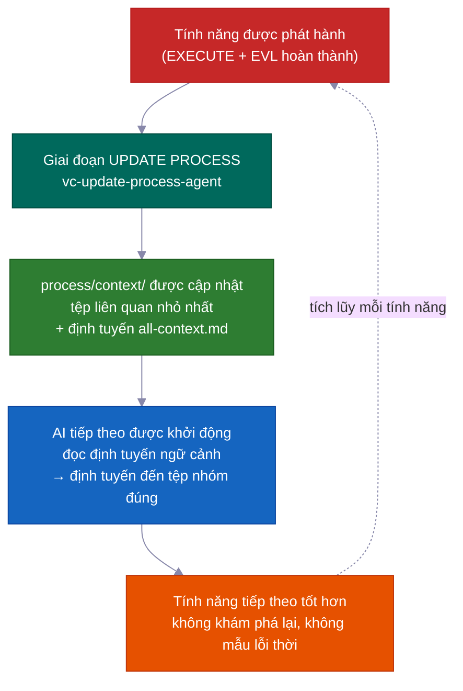

### Cơ chế cốt lõi: `process/context/` như bộ nhớ di động, dùng chung

`process/context/` chứa kiến thức có cấu trúc được tổ chức thành các nhóm chủ đề — quyết định kiến trúc, quy ước lập trình, các bước triển khai, mẫu kiểm thử, dữ kiện hạ tầng. Không giống lịch sử trò chuyện, kiến thức này:

- **truyền vào mỗi AI công việc** — `vc-context-discovery` định tuyến mỗi AI được khởi động đến đúng định tuyến `all-{group}.md` cho nhiệm vụ của nó, rồi đến tệp sâu liên quan nhỏ nhất. AI nghiên cứu, AI kế hoạch, và AI lập trình đều bắt đầu với sự hiểu biết chung như nhau
- **sống sót sau khi bộ nhớ bị reset** — nó trên đĩa, không trong cửa sổ ngữ cảnh; một phiên bị nén không mất gì trong đó
- **có thể đọc bởi cả Claude và Codex** — `.agents/skills` là liên kết tắt đến `.claude/skills/`, vì vậy cùng một hệ thống ngữ cảnh phục vụ cả hai AI mà không trùng lặp

Định tuyến gốc (`all-context.md`) trỏ đến các định tuyến nhóm (`all-{group}.md`), những cái này định tuyến đến tệp sâu liên quan nhỏ nhất. AI theo định tuyến — chúng không bao giờ mã cứng đường dẫn tệp. Điều này có nghĩa là đổi tên và tách nhóm chỉ cần chỉnh sửa định tuyến, không phải tìm kiếm toàn bộ codebase.

```
process/context/
├── all-context.md                  ← định tuyến gốc (kiến trúc, stack, mẫu)
├── tests/all-tests.md              ← bộ chạy kiểm thử, gỡ lỗi, lệnh
├── container/all-container.md      ← Docker, triển khai, quy trình hạ tầng
├── uxui/all-uxui.md                ← thành phần, token thiết kế, quy ước trực quan
└── {domain}/all-{domain}.md        ← bất kỳ lĩnh vực nào có 3+ tài liệu lâu dài (tự động thăng cấp)
```

<br>

### Điều gì làm nó tự cải thiện (không chỉ là "tài liệu sống")

Cụm từ "tài liệu sống" thường có nghĩa là "tài liệu chúng ta dự định cập nhật nhưng hầu như quên." Hệ thống này thực thi ý định một cách máy móc.

**Giai đoạn UPDATE PROCESS yêu cầu xem xét ngữ cảnh mỗi tệp trước khi có thể đóng.** `vc-update-process-agent` không thể hoàn thành một giai đoạn cho đến khi mọi tệp ngữ cảnh có thể bị ảnh hưởng đã được xem xét với lý do cụ thể mỗi tệp. "Không cần cập nhật" được phép — nhưng phải nêu tên từng tệp đã xem xét và giải thích tại sao. Lý do mơ hồ bị từ chối. Điểm kiểm tra là nhị phân: ghi lại đánh giá, hoặc giai đoạn không đóng.

Vòng phản hồi đầy đủ mỗi tính năng hoàn thành:

| Bước | Chủ sở hữu | Điều gì xảy ra |
|------|-------|-------------|
| 1. Phân tích git diff | `vc-scout` | Ánh xạ tệp đã thay đổi → các lĩnh vực ngữ cảnh bị ảnh hưởng |
| 2. Xem xét mỗi tệp | `vc-update-process-agent` | Nêu tên từng tệp ngữ cảnh, ghi lại cập nhật hoặc "không thay đổi + lý do" rõ ràng |
| 3. Cập nhật được áp dụng | các AI công việc song song | Tệp ngữ cảnh của mỗi lĩnh vực được cập nhật với mẫu mới, quyết định, bài học |
| 4. Định tuyến được xác minh | `validate-context-discovery.mjs` | Xác nhận mọi tài liệu được lập chỉ mục và các định tuyến nhất quán |
| 5. Khám phá được xác nhận | `validate-all-context.mjs` | Xác nhận `all-context.md` và các định tuyến nhóm khớp với tệp hiện tại trên đĩa |

Tính năng thứ 100 của bạn hưởng lợi từ mọi thứ đã học trong 99 tính năng đầu tiên — không phải như kỳ vọng, mà như đảm bảo máy móc.

<br>

### Xem Trước Tiến Lên: bài học truyền tiếp, không chỉ lùi

Mỗi báo cáo giai đoạn có phần `## Forward Preview` được viết cho AI của *giai đoạn tiếp theo*. Nó cung cấp các lệnh chính xác để giữ màu xanh, thay đổi phụ thuộc, và thay đổi phạm vi tệp được tìm thấy giữa giai đoạn. AI tiếp quản Giai đoạn 3 không phải đọc lại kết quả Giai đoạn 2 và đoán điều gì quan trọng. Nó được trao một bản tóm tắt tập trung.

Điều này khác với tài liệu ngữ cảnh: tài liệu ngữ cảnh mang *kiến thức lâu dài* (quyết định đúng trong nhiều tính năng); Forward Preview mang *trạng thái chuyển giao tạm thời* (điều phiên làm việc tiếp theo cần biết ngay bây giờ).

<br>

### Bộ trình xác thực ngăn ngừa lỗi thời

Kiến thức lâu dài trở nên lỗi thời khi không ai kiểm tra. Bộ kit cung cấp các trình xác thực chạy như một phần của mỗi lần đóng giai đoạn:

| Trình xác thực | Điều nó phát hiện |
|-----------|----------------|
| `validate-context-discovery.mjs` | Tài liệu không được lập chỉ mục bởi bất kỳ định tuyến nào; liên kết hỏng; thiếu siêu dữ liệu |
| `validate-all-context.mjs` | `all-context.md` không đồng bộ với tệp thực tế trên đĩa |
| `validate-skill-keywords.mjs` | Kỹ năng thiếu trường `trigger_keywords` hoặc `layer` (làm hỏng bước định tuyến 0) |
| `validate-protocol-discovery.mjs` | Tệp giao thức trong `process/development-protocols/` thiếu siêu dữ liệu khám phá |

Chúng chạy như kiểm tra tự động — một tài liệu lỗi thời hoặc mồ côi sẽ thất bại. Hệ thống tự kiểm tra sức khỏe của mình.

<br>

### Các nhóm ngữ cảnh tự tổ chức

Các nhóm được tạo tự động khi một chủ đề đạt 3+ tài liệu hoặc một tệp duy nhất vượt quá ~800 dòng. AI theo định tuyến và không bao giờ mã cứng đường dẫn — vì vậy thêm một nhóm mới (ví dụ `process/context/billing/all-billing.md`) chỉ cần cập nhật định tuyến, không thay đổi mọi AI đề cập đến billing. Định tuyến là tham chiếu ổn định; các tệp đằng sau nó có thể tự do tổ chức lại.

> Bộ kit tạo ra các nhóm ngữ cảnh từ codebase thực tế của bạn (thông qua `vc-setup`). Các nhóm không phải danh sách cố định — chúng là mẫu. Lĩnh vực xác thực, hạ tầng, thanh toán của bạn đều trở thành kiến thức có thể định tuyến hạng nhất khi dự án phát triển.

---

## 🤖 Bên Trong Có Gì

<br>

### 15 AI

<details>
<summary>Nhấn để xem danh sách AI</summary>

<br>

**AI quy trình cốt lõi** — một AI mỗi giai đoạn RIPER-5 (R → SPEC → I → P → V → E → UP):

| AI | Mô hình | Vai trò |
|-------|:---:|------|
| 🔍 `vc-research-agent` | sonnet | Nghiên cứu codebase + web, chỉ đọc. Theo dõi mâu thuẫn tích hợp sẵn |
| 📝 `vc-spec-agent` | sonnet | Tài liệu yêu cầu khám phá sản phẩm trước INNOVATE. Tạo ra `*_SPEC_*.md` |
| 💡 `vc-innovate-agent` | sonnet | So sánh 2-3 phương án. Tóm tắt quyết định (được chọn + bị từ chối) trước PLAN |
| 📋 `vc-plan-agent` | sonnet | Viết kế hoạch với các biện pháp bảo vệ chống lối tắt. "Tôi đã biết cách làm" không phải là kế hoạch |
| ✅ `vc-validate-agent` | sonnet | Chuyển kế hoạch → danh sách kiểm tra đã thỏa thuận (V1–V7). Điểm kiểm tra: PASS/CONDITIONAL/BLOCKED |
| ⚡ `vc-execute-agent` | **opus** | Triển khai theo kế hoạch. Ghi chú tiến độ vào báo cáo giai đoạn, giao thức sai lệch, tự xem xét |
| ⏩ `vc-fast-mode-agent` | **opus** | R→S→I→P→V nén với tạm dừng an toàn bắt buộc trước EXECUTE |
| 🔧 `vc-quick-fix-agent` | **opus** | Làn QUICK FIX: một chỉnh sửa nhỏ ít rủi ro + kiểm tra có phạm vi, không kế hoạch/xác nhận |
| 🧠 `vc-update-process-agent` | sonnet | Đóng giai đoạn 7 bước: lưu trữ, cập nhật ngữ cảnh, quét tài liệu lỗi thời, bài học |

<br>

**AI chuyên biệt** — được gọi trong EXECUTE hoặc độc lập:

| AI | Vai trò |
|-------|------|
| 🐛 `vc-debugger` | Thu thập bằng chứng trước khi đưa ra giả thuyết. Giả thuyết cạnh tranh, chuỗi loại trừ, kiểm tra khả thi |
| 🧪 `vc-tester` | Nhận biết thay đổi. Chạy lại kiểm thử danh sách đã thỏa thuận (EVL). Tự động leo thang khi cấu hình thay đổi |
| 🔎 `vc-code-reviewer` | Gửi AI thám tử trường hợp biên TRƯỚC khi xem xét. Phát hiện N+1, kiểm tra đường dẫn xác thực |
| ✨ `vc-code-simplifier` | Dọn dẹp code để rõ ràng mà không thay đổi hành vi |
| 🎨 `vc-ui-ux-designer` | Frontend nhận biết thiết kế. Có thể khởi động AI nghiên cứu giữa quá trình xây dựng |
| 📦 `vc-git-manager` | Chia thành các commit logic từ `touched_files`. Từ chối các tệp không xác định |

</details>

<br>

### 33 Kỹ Năng (tự khám phá)

<details>
<summary>Nhấn để xem danh sách kỹ năng (20 hợp đồng + 13 hỗ trợ)</summary>

<br>

**📜 Kỹ năng hợp đồng (20)** — sở hữu một tài liệu: `vc-generate-plan` · `vc-generate-context` · `vc-generate-spec` · `vc-generate-closeout` · `vc-generate-phase-program` · `vc-audit-context` · `vc-audit-plans` · `vc-audit-vc` · `vc-update` · `vc-publish` · `vc-feasibility-test` · `vc-risk-evidence-pack` · `vc-test-coverage-plan` · `vc-validate-findings` · `vc-autoresearch` · `vc-intent-clarify` · `vc-autopilot` · `vc-agent-strategy-compare` · `vc-plan-discovery` · `vc-context-discovery`

**🛠️ Kỹ năng hỗ trợ (13)** — cải thiện cách AI làm việc: `vc-review-situation` · `vc-sequential-thinking` · `vc-problem-solving` · `vc-scout` · `vc-debug` · `vc-docs-seeker` · `vc-frontend-design` · `vc-agent-browser` · `vc-web-testing` · `vc-setup` · `vc-predict` · `vc-scenario` · `vc-security`

</details>

> **⚠️ Quy tắc đặt tên:** KHÔNG dùng tiền tố `vc-` cho kỹ năng hoặc AI của riêng bạn — không gian tên đó được dành riêng cho các tệp do kit cung cấp, và bộ bảo vệ xóa cũ coi bất kỳ đường dẫn `vc-*` nào trong `.claude/skills/` và `.claude/agents/` là thuộc sở hữu của kit. Dùng `my-`, `team-`, hoặc `proj-` thay thế.

<br>

### 🪝 10 Hook

| Hook | Chức năng |
|------|-------------|
| 🔐 `privacy-block.cjs` | Chặn đọc `.env`, thông tin xác thực, khóa SSH. Yêu cầu phê duyệt rõ ràng |
| 🚫 `scout-block.cjs` | Ngăn lạc vào `node_modules/`, `dist/`. Cú pháp gitignore `.ckignore` |
| 🧠 `session-init.cjs` | Phát hiện stack, tiêm env, khôi phục cổng phê duyệt sau khi nén |
| 💉 `subagent-init.cjs` | Tiêm khối ngữ cảnh gọn vào mỗi AI phụ |
| ✨ `post-edit-simplify-reminder.cjs` | Sau 5+ chỉnh sửa, nhắc chạy trình đơn giản hóa (không chặn, có giới hạn) |
| 📛 `descriptive-name.cjs` | Quy ước đặt tên tệp nhận biết ngôn ngữ trên mỗi lần Ghi |
| 📊 `session-state.cjs` | Chỉ số phiên + nhận biết token |
| 📋 `post-write-plan-check.mjs` | Xác thực cấu trúc tài liệu kế hoạch trên mỗi lần Ghi vào `*_PLAN_*.md` |
| 🧹 `post-commit-lint.mjs` | Kiểm tra tiền tố conventional-commits trên mỗi `git commit` |
| 🔍 `stop-validator-sweep.cjs` | Chạy các trình xác thực harness cốt lõi khi phiên dừng |

<br>

**Mọi thứ nằm ở đâu:**

```text
your-project/
├── .claude/{agents,skills,hooks}/   # 🤖 15 AI · ⚡ 33 kỹ năng · 🪝 10 hook
├── .codex/agents/                   # 🔄 Được phản chiếu cho Codex
├── .agents/skills -> .claude/skills # 🔗 Liên kết tắt cho khám phá Codex
├── CLAUDE.md · AGENTS.md            # 📋 Cấu hình điều phối + sổ đăng ký đa công cụ
└── process/
    ├── context/                     # 🧠 Các lĩnh vực kiến thức định tuyến tự động
    ├── general-plans/               # 📋 Kế hoạch xuyên suốt + thư mục nhiệm vụ
    ├── features/                    # 🏷️ Thư mục vòng đời theo phạm vi tính năng
    └── development-protocols/       # 📜 22 tài liệu quy trình làm việc dùng chung
```

---

## ⚡ Quick Fix + Fast Mode

Hai tùy chọn nhẹ hơn cho khi quy trình RIPER-5 đầy đủ quá nhiều so với công việc cần:

<table>
<tr>
<td width="50%" valign="top">
<h1>🔧</h1>
<strong>Quick Fix</strong> — <code>"quick fix: …"</code><br><br>
Lớn hơn một dòng lệnh tầm thường, nhỏ hơn "cần kế hoạch." AI trưởng thám hiểm chỉ đọc → xác nhận một dòng → khởi động <code>vc-quick-fix-agent</code> để chỉnh sửa + kiểm tra có phạm vi chỉ trên tệp đã chạm. <strong>Không kế hoạch, không danh sách kiểm tra đã thỏa thuận, không EVL.</strong>
<br><br>
<sub>Bị hủy ngay lập tức nếu thay đổi chạm vào schema, xác thực, API, thanh toán, hoặc các bề mặt di chuyển — sau đó định tuyến đến RESEARCH đầy đủ.</sub>
</td>
<td width="50%" valign="top">
<h1>⏩</h1>
<strong>Fast Mode</strong> — <code>"ENTER FAST MODE - …"</code><br><br>
Nén RESEARCH + SPEC + INNOVATE + PLAN + VALIDATE vào một lượt — nhưng vẫn <strong>viết kế hoạch, viết danh sách kiểm tra đã thỏa thuận, và tạm dừng trước EXECUTE.</strong>
<br><br>
<sub>Trong Fast Mode thông thường, có tạm dừng sau VALIDATE — bạn xem xét, rồi nói "ENTER EXECUTE MODE." Dùng <code>autopilot fast: [task]</code> để bỏ tạm dừng đó và chạy xuyên suốt không dừng.</sub>
</td>
</tr>
</table>

---

## 🔄 Vòng Đời Bộ Kit: Cài Đặt · Thiết Lập · Cập Nhật · Xuất Bản

| Lệnh | Chức năng | Khi nào |
|---|---|---|
| `curl … install.sh \| bash` | Đồng bộ tệp kit mà không ghi đè tệp của bạn; tự động phát hiện cài mới vs nâng cấp và hướng dẫn bạn | Cài đầu tiên + mỗi lần nâng cấp |
| **Chạy vc-setup** | Phát hiện stack, tạo khung `process/`, quét sâu codebase, điền ngữ cảnh thực | Sau khi cài mới |
| **Chạy vc-update** | Tính toán diff chính xác, hiển thị những gì sẽ thay đổi, đợi sự đồng ý của bạn; di chuyển kế hoạch/thư mục định dạng cũ mà không mất dữ liệu | Mỗi lần nâng cấp |
| **Chạy vc-publish** *(người bảo trì)* | Xuất bản thay đổi harness trở lại kho kit | Đóng góp vào kit |

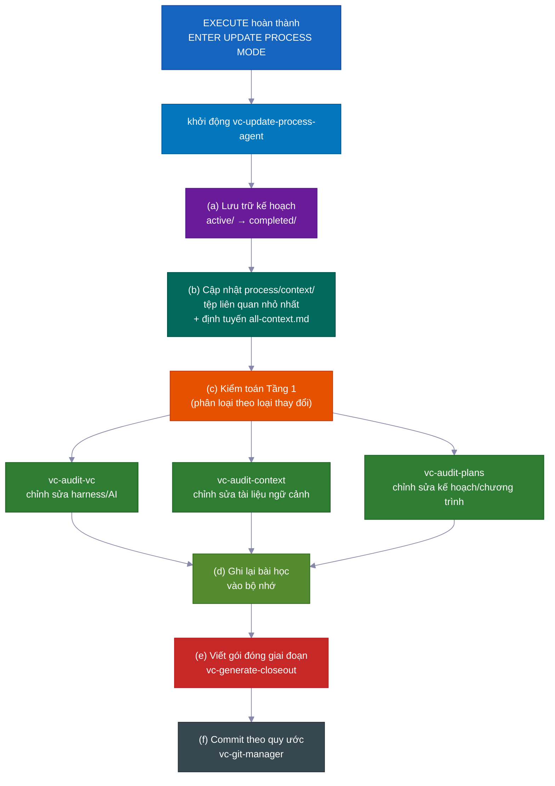

> 💡 `vc-update` hiển thị bản xem trước diff và đợi sự đồng ý của bạn. Thư mục `process/` và nội dung cụ thể của dự án **không bao giờ** bị thay đổi lặng lẽ. Chạy lại cài đặt là an toàn để chạy hai lần.

---

## 💡 Thêm Lý Do Nó Hoạt Động Tốt

Nhiều mặc định nhỏ, thông minh cộng lại giúp ít phải giám sát hơn và chi phí thấp hơn.

- **Mỗi vai trò chỉ nhận được các công cụ cần thiết.** Trong lúc lập kế hoạch, AI thực sự không thể chỉnh sửa code — các công cụ đó bị tắt. Điều này ngăn AI tiến lên và thay đổi mọi thứ trước khi kế hoạch được phê duyệt. Hệ thống đơn giản là không cho phép điều đó.

- **Nó chỉ dùng mô hình AI cao cấp khi cần thiết.** Viết code dùng mô hình hàng đầu. Lập kế hoạch, nghiên cứu, xem xét, và kiểm tra đều dùng mô hình rẻ hơn, nhanh hơn. Kết quả: chi phí thấp hơn khoảng 60–70% so với chạy mô hình hàng đầu cho mọi thứ — mà không mất chất lượng ở công việc quan trọng.

- **Nó kiểm thử các phỏng đoán rủi ro trước khi xây dựng trên đó.** Khi AI không chắc thứ gì đó sẽ hoạt động — một hành vi API cụ thể, tính năng thư viện, giả định hạ tầng — nó chạy một thí nghiệm thực nhỏ trước. Kết quả rõ ràng: hoạt động, không hoạt động, hoặc không chắc. Phán quyết đó và ghi chú tiếng thường được đưa thẳng vào kế hoạch. AI không mất hàng giờ xây dựng trên giả định sai.

- **Điểm lưu gọn gàng, có ý nghĩa.** Thay đổi được commit trong các khối sạch, logic với thông điệp rõ ràng — tự động. Lịch sử dễ đọc và dễ hoàn tác từng phần.

- **Nhắc nhở tự động hữu ích.** Các trợ lý tích hợp nhỏ nhắc những thứ như chạy đúng kiểm tra trên tệp đã thay đổi, giữ code đơn giản, và viết thông điệp commit đúng. Chất lượng duy trì cao mà không cần bạn phải kiểm soát.

- **Bạn có thể chạy vòng tự cải thiện độc lập.** Cùng một engine "tìm vấn đề, sửa, lặp lại" điều khiển kiểm tra kế hoạch và sửa lỗi kiểm thử cũng hoạt động như công cụ độc lập trên bất kỳ lĩnh vực lộn xộn nào — một bản đặc tả, tài liệu, kiểm thử, danh sách lỗi. Bạn không cần xây dựng tính năng đầy đủ để dùng nó.

- **Bằng chứng tích hợp rằng các quy tắc quy trình thực sự hoạt động.** Bộ kit cung cấp bộ kiểm thử riêng: một tập hợp các kiểm tra với ví dụ biết-tốt và biết-xấu chứng minh các quy tắc quy trình hoạt động đúng. Hệ thống tự kiểm tra. Bạn không phải tin rằng các biện pháp bảo vệ đang bật — bạn có thể chạy kiểm tra và xem.

---

## Đóng Góp

Chúng tôi hoan nghênh đóng góp! Xem [CONTRIBUTING.md](CONTRIBUTING.md) để biết hướng dẫn.

<br>

**Liên kết nhanh:**

- 🐛 [Báo cáo lỗi](https://github.com/withkynam/vibecode-pro-max-kit/issues/new?template=1.bug_report.yml)
- 💡 [Yêu cầu tính năng](https://github.com/withkynam/vibecode-pro-max-kit/issues/new?template=2.feature_request.yml)
- ⚡ [Gửi kỹ năng](https://github.com/withkynam/vibecode-pro-max-kit/issues/new?template=3.skill_submission.yml)
- 🌐 [Thêm bản dịch](https://github.com/withkynam/vibecode-pro-max-kit/issues/new?template=5.translation.yml)

<br>

<a href="https://github.com/withkynam/vibecode-pro-max-kit/graphs/contributors">
  
</a>

<br>

### 🙏 Ghi Nhận

vibecode-pro-max-kit tập trung vào khung phát triển theo đặc tả và tổ chức ngữ cảnh tự cải thiện, mà không làm bạn nặng nề với 80+ kỹ năng. Ít công cụ hơn, nhiều cấu trúc hơn.

---

## ⭐ Lịch Sử Ngôi Sao

<a href="https://star-history.com/#withkynam/vibecode-pro-max-kit&Date">
 <picture>
   <source media="(prefers-color-scheme: dark)" srcset="https://api.star-history.com/svg?repos=withkynam/vibecode-pro-max-kit&type=Date&theme=dark" />
   <source media="(prefers-color-scheme: light)" srcset="https://api.star-history.com/svg?repos=withkynam/vibecode-pro-max-kit&type=Date" />
   
 </picture>
</a>

---

## 📄 Giấy Phép

MIT
