<p align="center">
  <a href="../../README.md">English</a> |
  <strong>简体中文</strong> |
  <a href="README.ja-JP.md">日本語</a> |
  <a href="README.ko-KR.md">한국어</a> |
  <a href="README.vi-VN.md">Tiếng Việt</a> |
  <a href="README.pt-BR.md">Português</a> |
  <a href="README.es.md">Español</a> |
  <a href="README.de.md">Deutsch</a> |
  <a href="README.fr.md">Français</a> |
  <a href="README.hi.md">हिंदी</a>
</p>

<div align="center">

<a href="https://flowser.ai">
  
</a>

*由世界级工程师打造，为 vibecoders 而生*<br>
*[flowser.ai](https://flowser.ai) — 带计算机能力的 AI Agents，专注 GTM*

<br>

# vibecode-pro-max-kit

<br>

<p align="center">
  
  <br><br>
  <em>"全集中——Spec 呼吸，拾之型：Vibe 之流，永不中断。"</em><br>
  <strong>— 炭治郎</strong>
</p>

*放到任何项目里都能用。你的 AI agent 立刻拥有一套完整的先计划后开发流程——7 个有门禁的阶段、自我修复的检查循环，以及能从头跑到尾、不会丢失进度的 autopilot 模式。*

<table align="center">
<tr>
<td width="50%" valign="top"><strong>📦 一行命令安装</strong><br>一行 <code>curl</code> 命令即可安装到任何项目。自动识别新用户和老用户，不会覆盖你的文件。</td>
<td width="50%" valign="top"><strong>🌐 到处都能用</strong><br>支持任意技术栈、任意语言、任意 AI 编程 agent——Claude Code、Codex、Cursor、Windsurf、Copilot 等。</td>
</tr>
<tr>
<td valign="top"><strong>🧭 RIPER-5 先计划后开发工作流</strong><br>7 个有门禁的阶段（Research → Spec → Innovate → Plan → Validate → Execute → Update-Process），让 agent 不会直接跳去写代码。</td>
<td valign="top"><strong>🚀 Autopilot 模式（quick / fast / full）</strong><br>用一句话在任意阶段启动免手动运行。三种模式，根据风险匹配仪式感。</td>
</tr>
<tr>
<td valign="top"><strong>🎯 <code>/goal</code>——一直跑到完成的令牌</strong><br>一段可复制粘贴的文字，让 agent 一个阶段接一个阶段地运行而不停下——还能在新会话中恢复运行。</td>
<td valign="top"><strong>🔁 PVL + EVL 自我修复循环</strong><br>计划检查修复循环和测试检查修复循环，自动发现问题、修复、再检查——各最多 10 轮。</td>
</tr>
<tr>
<td valign="top"><strong>🔍 vc-autoresearch</strong><br>可复用的"找问题 → 修复 → 重复"循环，可用于计划、测试、规格、文档或评估。</td>
<td valign="top"><strong>🧪 可行性探针</strong><br>在 agent 确定设计方案前，先给出"先测后建"的裁定（VIABLE / NOT-VIABLE）。</td>
</tr>
<tr>
<td valign="top"><strong>🎛️ 智能策略选择器</strong><br>每个阶段前，自动权衡单个 agent、多个 agent 还是协作团队——带成本估算，选最便宜的合适方案。</td>
<td valign="top"><strong>🧮 智能模型选择</strong><br>昂贵的模型只负责写代码，便宜的模型处理其他一切。降低成本，不降质量。</td>
</tr>
<tr>
<td valign="top"><strong>🤔 意图确认</strong><br>请求模糊时，agent 会提前问几个关键问题，而不是乱猜然后做错东西。</td>
<td valign="top"><strong>🛡️ 36 个验证器</strong><br>机械式正确性检查——不是凭感觉——保护 kit 自身结构，在上线前捕获漂移。</td>
</tr>
<tr>
<td valign="top"><strong>🏗️ 阶段程序</strong><br>大型项目拆分为独立阶段，阶段之间有质量门，让大任务不会半途崩掉。</td>
<td valign="top"><strong>🔀 自我调整的程序</strong><br>随着学习，agent 会插入新阶段、重排工作、跳过被阻塞的步骤——计划随时自适应。</td>
</tr>
<tr>
<td valign="top"><strong>🧠 永不丢失进度</strong><br>每个阶段结束后进度都写入磁盘，运行可以在内存重置后继续，精确从中断处恢复。</td>
<td valign="top"><strong>📚 自我改进的项目记忆</strong><br>安装时就学习你的代码库，并在每个功能交付后自动更新共享笔记，文档永不过时。</td>
</tr>
<tr>
<td valign="top"><strong>⚡ Quick Fix + Fast Mode</strong><br>轻量通道，小改动跳过繁重仪式，一行修复就是一行修复。</td>
<td valign="top"><strong>🧱 分层自动发现的 skill</strong><br>Skill 按层次组织，自动发现——agent 总能在正确的步骤找到正确的工具。</td>
</tr>
<tr>
<td valign="top"><strong>🤖 15 个 agent · 33 个 skill · 10 个 hook</strong><br>一支完整的专业 agent 团队、可复用的 skill 和安全 hook，开箱即用全部连好。</td>
<td valign="top"><strong>🔄 完整的 kit 生命周期</strong><br>安装、设置、更新、发布各一条命令，安全地让每个项目保持最新版本。</td>
</tr>
<tr>
<td valign="top"><strong>📝 SPEC——你的白话确认书</strong><br>在任何设计之前，你用简单的用户故事说明要做什么——是发现误解最便宜的地方。</td>
<td valign="top"><strong>🎯 始终核对你的意图</strong><br>每个后续阶段都会对照你的 SPEC 确认：我们在做的，真的是你要的吗？</td>
</tr>
</table>

<p>
  <a href="https://github.com/withkynam/vibecode-pro-max-kit/stargazers"></a>
  <a href="https://github.com/withkynam/vibecode-pro-max-kit/network/members"></a>
  <a href="LICENSE"></a>
  <a href="https://github.com/withkynam/vibecode-pro-max-kit/graphs/contributors"></a>
  <a href="https://github.com/withkynam/vibecode-pro-max-kit/actions/workflows/validate.yml"></a>
  <a href="CHANGELOG.md"></a>
  
  
  
  
</p>

<p>
  <strong>最简洁、最灵活、最适合团队的编程 kit，支持</strong><br><br>
  <a href="https://github.com/anthropics/claude-code"></a>&nbsp;
  <a href="https://github.com/openai/codex"></a>&nbsp;
  <a href="https://cursor.com"></a>&nbsp;
  <a href="https://windsurf.com"></a><br>
  <a href="https://github.com/google-gemini/gemini-cli"></a>&nbsp;
  <a href="https://github.com/opencode-ai/opencode"></a>&nbsp;
  <a href="https://github.com/features/copilot"></a>
</p>

<p>
  <em>支持任意技术栈、任意语言、任意项目</em><br><br>
  <picture>
    <source media="(prefers-color-scheme: dark)" srcset="https://skillicons.dev/icons?i=ts%2Cjs%2Creact%2Cnextjs%2Cvue%2Cnuxt%2Csvelte%2Cangular%2Cnodejs%2Cexpress%2Cbun%2Cpython%2Cdjango%2Cflask%2Cfastapi&theme=dark&perline=15" />
    <source media="(prefers-color-scheme: light)" srcset="https://skillicons.dev/icons?i=ts%2Cjs%2Creact%2Cnextjs%2Cvue%2Cnuxt%2Csvelte%2Cangular%2Cnodejs%2Cexpress%2Cbun%2Cpython%2Cdjango%2Cflask%2Cfastapi&theme=light&perline=15" />
    
  </picture>
  <br>
  <picture>
    <source media="(prefers-color-scheme: dark)" srcset="https://skillicons.dev/icons?i=ruby%2Crails%2Cgo%2Crust%2Cjava%2Cspring%2Ckotlin%2Cswift%2Cphp%2Claravel%2Ccs%2Cdotnet%2Celixir%2Cgraphql%2Cprisma&theme=dark&perline=15" />
    <source media="(prefers-color-scheme: light)" srcset="https://skillicons.dev/icons?i=ruby%2Crails%2Cgo%2Crust%2Cjava%2Cspring%2Ckotlin%2Cswift%2Cphp%2Claravel%2Ccs%2Cdotnet%2Celixir%2Cgraphql%2Cprisma&theme=light&perline=15" />
    
  </picture>
  <br>
  <picture>
    <source media="(prefers-color-scheme: dark)" srcset="https://skillicons.dev/icons?i=supabase%2Cfirebase%2Cpostgres%2Cmongodb%2Credis%2Cdocker%2Ckubernetes%2Caws%2Cgcp%2Cazure%2Cvercel%2Ccloudflare%2Ctailwind%2Celectron&theme=dark&perline=15" />
    <source media="(prefers-color-scheme: light)" srcset="https://skillicons.dev/icons?i=supabase%2Cfirebase%2Cpostgres%2Cmongodb%2Credis%2Cdocker%2Ckubernetes%2Caws%2Cgcp%2Cazure%2Cvercel%2Ccloudflare%2Ctailwind%2Celectron&theme=light&perline=15" />
    
  </picture>
  <br>
  <p><em>不只是装饰。运行 <code>vc-setup</code> 时，agent 会扫描你的代码库，<br>
  检测你的技术栈，并构建项目专属的知识组——每个 skill 在工作前都会读取它。<br>
  其他 harness 把 agent 绑死在某个语言——<code>rust-review-agent</code>、<code>python-linter</code>——换个地方就没用了。<br>
  这个 kit 适配上方任意组合，并随着你持续交付积累知识。</em></p>
</p>

</div>

---

## ⚡ 快速开始——一行命令，30 秒搞定

> **前提条件：** Node.js ≥ 22、git、bash（macOS / Linux / WSL；Alpine 上运行 `apk add bash`）。

**只有一条命令，对所有人都适用。** 在你的项目文件夹内运行。它会自动识别你是新用户还是老用户，安全安装且不覆盖你的文件，然后*告诉你接下来该说什么*。

```bash
curl -fsSL https://raw.githubusercontent.com/withkynam/vibecode-pro-max-kit/main/install.sh | bash
```

安装完成后，它会打印两条消息之一——**读完输出底部的内容，按照它说的做：**

<table>
<tr>
<td width="50%" valign="top">
<h3>🆕 全新项目</h3>
安装程序检测到没有 harness，打印：
<br><br>
<code>Next: Run: claude → Say: "Run vc-setup"</code>
<br><br>
<strong>→ 打开你的 agent，说 <code>Run vc-setup</code></strong>
<br><br>
<sub>vc-setup 会检测你的技术栈，创建 <code>process/</code> 文件夹，扫描你的代码库，用<em>真实的</em>架构、规范和测试命令填充内容——是一次对话，不是走清单。</sub>
</td>
<td width="50%" valign="top">
<h3>🔄 已有 harness（升级）</h3>
安装程序检测到旧版本，打印：
<br><br>
<code>Next (upgrade detected): Run: claude → Say: "Run vc-update"</code>
<br><br>
<strong>→ 打开你的 agent，说 <code>Run vc-update</code></strong>
<br><br>
<sub>vc-update 拉取最新版本，如果发现旧格式的计划或文件夹，会给你一段可直接粘贴的提示词来完成迁移，<strong>零数据丢失</strong>。你的 <code>process/</code> 永远不会被动。</sub>
</td>
</tr>
</table>

> 💡 **你永远不需要猜命令。** `install.sh` 帮你路由：全新项目 → `vc-setup`，升级 → `vc-update`。重复运行安装脚本永远是安全的——不会破坏任何东西。**Codex 用户：** 输入 `/vc-setup`（或 `/vc-update`）而非在聊天中说出来。

<br>

<details>
<summary><strong>📦 安装在磁盘上放了什么（非破坏性）</strong></summary>

<br>

```
your-project/
├── .claude/
│   ├── agents/              # 🤖 15 个 agent 定义（.md）
│   ├── skills/              # ⚡ 33 个 skill（每个是含 SKILL.md 的目录）
│   └── hooks/               # 🪝 10 个生命周期 hook（.cjs / .mjs）
├── .codex/agents/           # 🔄 为 Codex 镜像的 agent
├── .agents/skills →         # 🔗 指向 .claude/skills 的符号链接（Codex 发现用）
├── CLAUDE.md                # 📋 Orchestrator + 路由规则
├── AGENTS.md                # 📖 Agent + skill 注册表（跨工具）
└── process/
    └── development-protocols/  # 📜 22 个共享工作流文档（由安装脚本播种）
                                #    context/、plans、features → 由 vc-setup 构建
```

- **非破坏性。** 你现有的 `.claude/skills/`、`.claude/agents/`、`process/` 和 `settings.json` 永远不会被清空。只有 kit 拥有的文件会被写入或更新。
- **已有配置？** 备份到 `.vibecode-backup/`；之后你的 `settings.json` 会被恢复。
- **已有 `CLAUDE.md`？** 备份为 `CLAUDE.md.pre-vibecode`。
- **已有 `process/`？** install 绝对不会碰它——`vc-setup` / `vc-update` 会交互式迁移，并先给你看 diff。

> **首次安装注意事项：** 如果你有自定义的 skill/agent，名字以 `vc-` 开头（kit 保留命名空间），且*从未*运行过 install，废弃文件清理步骤可能会标记它们。安装后运行 `ls .claude/skills/ .claude/agents/` 确认。用非 `vc-` 前缀（`my-`、`team-`、`proj-`）命名你自己的内容可以完全避免这个问题。

</details>

<details>
<summary><strong>🤖 想让 agent 来驱动安装？（完整提示词）</strong></summary>

<br>

> 以你的项目文件夹为工作目录打开 Claude Code 或 Codex，然后粘贴：

```
First, install the vibecode-pro-max-kit agent harness by running this command:

curl -fsSL https://raw.githubusercontent.com/withkynam/vibecode-pro-max-kit/main/install.sh | bash

After install completes, run vc-setup and follow the full interactive flow:

1. DETECT — Read package.json (or go.mod, Cargo.toml, pyproject.toml, etc.), detect my
   stack: framework, package manager, monorepo structure, test framework, database, auth.
   Also check for any existing .claude/, process/, or context files.
2. SHOW ME WHAT YOU FOUND — Summarize detection and wait for me to confirm. If this is an
   existing project, tell me what looks good vs what could be improved.
3. ASK ME ABOUT THE PROJECT — Have a real conversation. Ask follow-ups, probe anything
   vague, keep going until you genuinely understand it. Summarize back and confirm.
4. SCAFFOLD — Create the process/ directory. If process/ already exists, show me the plan
   and wait for approval. Never silently move or delete my files.
5. STUDY — Deep-scan and populate process/context/all-context.md with REAL content: repo
   structure, stack + versions, patterns, import aliases, env vars, routes, schema, tests.
   No placeholder text.
6. VALIDATE — Run all validation checks to confirm everything is wired correctly.

Rules: read and preserve good existing context; show me a summary before each major change
and wait for my OK; never create empty placeholder files; ask before reorganizing.
```

</details>

<details>
<summary>目录</summary>

- [一览](#-一览) · [问题所在](#-问题所在) · [解决方案](#️-解决方案)
- [Vibe Coding 革命](#vibe-coding-革命) · [适合哪些人](#适合哪些人) · [横向对比](#横向对比) · [与众不同之处](#-与众不同之处)
- [工作原理：协调者](#-工作原理协调者) · [RIPER-5 生命周期](#-riper-5-生命周期) · [意图确认](#-意图确认)
- [两大质量循环（PVL + EVL）](#-两大质量循环pvl--evl) · [策略比较 + 模型策略](#-策略比较--模型策略) · [Autopilot 模式](#-autopilot-模式免手动-riper-5) · [可行性探针 + 验证器](#-可行性探针--验证器安全网)
- [内置安全机制](#️-内置安全机制) · [实现前智能分析](#-实现前智能分析) · [质量流水线](#-质量流水线内嵌于执行)
- [计划生命周期](#-计划生命周期) · [阶段程序](#️-阶段程序大项目不崩盘) · [Context 组](#-context-组) · [功能文件夹](#-功能文件夹) · [Skill 层次](#-skill-层次) · [自我改进的项目记忆](#-自我改进的项目记忆)
- [里面有什么](#-里面有什么) · [Quick Fix + Fast Mode](#-quick-fix--fast-mode) · [Kit 生命周期](#-kit-生命周期安装--设置--更新--发布) · [贡献](#贡献)

</details>

---

## 🎁 一览

<table>
<tr>
<td align="center" width="25%" valign="top"><h1>🤖</h1><h3>15</h3><strong>Agent</strong><br><sub>每个阶段一个 + 6 个专家 agent</sub></td>
<td align="center" width="25%" valign="top"><h1>⚡</h1><h3>33</h3><strong>Skill</strong><br><sub>20 个工作流 + 13 个辅助，按关键词匹配</sub></td>
<td align="center" width="25%" valign="top"><h1>🪝</h1><h3>10</h3><strong>Hook</strong><br><sub>安全护栏 + 自动 context 加载</sub></td>
<td align="center" width="25%" valign="top"><h1>📜</h1><h3>22</h3><strong>协议</strong><br><sub>每个 agent 遵循的共享规则</sub></td>
</tr>
<tr>
<td align="center" width="25%" valign="top"><h1>🛡️</h1><h3>36</h3><strong>验证器</strong><br><sub>自动检查，在上线前捕获错误</sub></td>
<td align="center" width="25%" valign="top"><h1>🔧</h1><h3>7</h3><strong>工具</strong><br><sub>Claude Code · Codex · Cursor · Windsurf · Antigravity · OpenCode · Copilot</sub></td>
<td align="center" width="25%" valign="top"><h1>🌍</h1><h3>10</h3><strong>语言</strong><br><sub>EN · 中文 · 日本語 · 한국어 · VI · PT · DE · FR · ES · हिन्दी</sub></td>
<td align="center" width="25%" valign="top"><h1>⚡</h1><h3>30s</h3><strong>安装</strong><br><sub>一条命令，然后 agent 引导你完成其余步骤</sub></td>
</tr>
<tr>
<td align="center" width="25%" valign="top"><h1>🛩️</h1><strong>Autopilot</strong><br><sub>3 种模式（quick / fast / full）——从任意阶段启动，一路跑到完成不停歇</sub></td>
<td align="center" width="25%" valign="top"><h1>📌</h1><strong>/goal 块</strong><br><sub>简短的可复制粘贴文字，在会话重置后恢复免手动运行</sub></td>
<td align="center" width="25%" valign="top"><h1>🔁</h1><strong>vc-autoresearch</strong><br><sub>找问题 → 修复 → 重复循环（计划、测试、评估的共享工具）</sub></td>
<td align="center" width="25%" valign="top"><h1>🔬</h1><strong>可行性探针</strong><br><sub>在确定设计前给出"先测后建"裁定（VIABLE / NOT-VIABLE）</sub></td>
</tr>
</table>

---

## 🔥 问题所在

你让 Claude "加个 webhook 支持"。它立刻就开始写代码了。没问你架构，没查现有 pattern，没有计划。结果写了 400 行跟你代码库格格不入的东西，你花一个小时擦屁股。

**但这只是表面。** 深层问题更扎心：

<table>
<tr>
<td width="50%" valign="top">
<h1>🧠</h1>
<strong>每次会话 context 都丢了</strong><br><br>
agent 忘掉了之前学到的一切。同样的错误，同样的问题，每次都来一遍。没有记忆，没有积累。
</td>
<td width="50%" valign="top">
<h1>📄</h1>
<strong>文档立刻就过时了</strong><br><br>
上周写的好 context 文档，已经跟不上代码了。没有任何机制会随着代码库演进自动更新它们。
</td>
</tr>
<tr>
<td width="50%" valign="top">
<h1>💥</h1>
<strong>大任务做到一半就崩了</strong><br><br>
context 窗口满了，状态丢了，agent 开始瞎编。第三个小时你只能从头再来。
</td>
<td width="50%" valign="top">
<h1>🤝</h1>
<strong>没有 spec、没有审查、无法协作</strong><br><br>
PM 没法 review agent 要做什么。在写代码之前，没有任何可以分享、讨论或审批的书面计划。
</td>
</tr>
<tr>
<td width="50%" valign="top">
<h1>🎭</h1>
<strong>架构决策全靠编</strong><br><br>
agent 自己发明 pattern，而不是去研究其他代码库是如何解决同样问题的。
</td>
<td width="50%" valign="top">
<h1>🚀</h1>
<strong>没有东西验证"完成"</strong><br><br>
agent 说"所有测试通过"——但它根本没有独立重跑过。你在生产环境才发现问题。
</td>
</tr>
</table>

**你的 agent 有智力，但没有流程、没有记忆、也没有办法和团队协作。** 无论你是开发者、PM，还是刚开始 vibe coding 的 CEO——这个问题对每个人的打击都一样，解决方案也一样：**给你的 agent 一套真正的开发流程。**

---

## 🛠️ 解决方案

这个 kit 给你的项目安装了一套完整的开发体系——不只是一个 `CLAUDE.md`，而是 **15 个专用 agent、33 个 skill、10 个 hook 和 22 个协议**——配合阶段锁定的工作流，让你的 agent **先理解再动手，先证明再上线。**

<br>

<table>
<tr>
<td align="center" width="50%" valign="top"><h1>📋</h1><strong>先计划后开发</strong><br><br><sub>PM 和开发在写代码前审阅同一份书面计划</sub></td>
<td align="center" width="50%" valign="top"><h1>🔄</h1><strong>自我改进的知识</strong><br><br><sub>每次功能交付后自动更新——文档永不过时</sub></td>
</tr>
<tr>
<td align="center" width="50%" valign="top"><h1>⚡</h1><strong>免手动执行</strong><br><br><sub>会话重置也能继续——跑几小时而不是几分钟</sub></td>
<td align="center" width="50%" valign="top"><h1>🧬</h1><strong>架构调研</strong><br><br><sub>做设计决策前先研究真实代码库</sub></td>
</tr>
<tr>
<td align="center" width="50%" valign="top"><h1>✅</h1><strong>两次质量检查</strong><br><br><sub>写代码前检查计划；写完后独立重跑测试</sub></td>
<td align="center" width="50%" valign="top"><h1>🧭</h1><strong>智能知识路由</strong><br><br><sub>只加载相关内容——不是每次都把整个知识库塞进去</sub></td>
</tr>
</table>

<br>

### 完整的 RIPER-5 流程——7 个阶段，每步有门禁

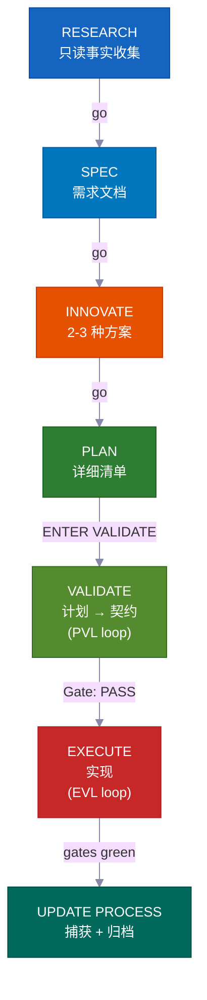

**在交互模式下**，每个阶段都会等你说"go"才继续——你在每一步都参与其中。**在 autopilot 或 /goal 模式下**，你提前给一次批准，然后系统自己一路跑到完成。只有下面列出的三个硬停才会中断。**VALIDATE** 和执行后的独立重测不是可选的——它们是硬门禁，阻止劣质代码上线——在两种模式下都自动运行。

---

## Vibe Coding 革命

<div align="center">
<h3><em>"最火的新编程语言是英语。"</em></h3>
<strong>— Andrej Karpathy</strong>
</div>

<br>

**Vibe coding 改变了谁能写软件。先计划后开发改变了他们能交付什么。**

<table>
<tr>
<td align="center" width="50%"><h3>63%</h3><sub>的 vibe coding 用户<strong>不是</strong>开发者</sub></td>
<td align="center" width="50%"><h3>1620 万</h3><sub>全球公民开发者<br>（年增长 38%）</sub></td>
</tr>
<tr>
<td align="center" width="50%"><h3>47 亿美元</h3><sub>vibe coding 市场<br>年增长 38%</sub></td>
<td align="center" width="50%"><h3>25%</h3><sub>的 YC W25 创业公司有 95%+ AI 生成的代码库</sub></td>
</tr>
</table>

大多数工具帮你启动项目。这个 kit 帮你**完成它**——有团队可以 review 的计划，永不过时的知识，以及在上线前就能抓住错误的安全检查。

---

## 适合哪些人？

<div align="center">
<h3><em>"关键不在于谁敲的代码。关键在于交付了什么。"</em></h3>
<strong>— Garry Tan, YC</strong>
</div>

<br>

<table>
<tr>
<td width="50%" valign="top">
<h1>🧑‍💼</h1>
<strong>CEO / 创始人</strong><br><br>
<em>"帮我搭一个带 auth、计费和 landing page 的 SaaS"</em><br><br>
agent 调研你的技术栈，写一份你可以 review 的架构方案，带测试地实现，并把每个决策都记录下来，方便你的技术合伙人以后审计。
</td>
<td width="50%" valign="top">
<h1>📊</h1>
<strong>产品经理</strong><br><br>
<em>"做一个展示 MRR、流失率和增长指标的仪表盘"</em><br><br>
它生成 PRD 风格的 SPEC，在写代码前获取你的批准，按 spec 实现，并把计划归档为可搜索的项目历史。
</td>
</tr>
<tr>
<td width="50%" valign="top">
<h1>🎨</h1>
<strong>设计师</strong><br><br>
<em>"按这个 Figma 截图像素级还原"</em><br><br>
设计感知的 agent 分析你的设计稿，用你的 design token 逐组件实现，并启动视觉对比检查。
</td>
<td width="50%" valign="top">
<h1>⚙️</h1>
<strong>工程师</strong><br><br>
<em>"把 auth 模块重构为支持 RBAC，零停机"</em><br><br>
它调研你当前的 auth 代码以及其他代码库如何解决 RBAC，写一份带文件影响分析的迁移方案，安全实现并附回滚说明。
</td>
</tr>
</table>

---

## 横向对比

| 功能 | vibecode-pro-max-kit | Superpowers | GSD | gstack |
|---------|---------------------|-------------|-----|--------|
| 先计划后开发生命周期 | 完整 RIPER-5（research → spec → innovate → plan → validate → execute → update） | 强制工作流 | 修复 context 腐烂 | 部分 |
| 阶段锁定安全机制 | 每个阶段工具受限（调研只读，innovate 不能写） | 基于 skill 的约束 | 阶段分离 | 无 |
| 质量检查循环 | **两个**——PVL（检查计划）+ EVL（独立重跑测试） | 每个 skill 独立 | 无自动化 | 无 |
| 多工具支持 | 7 个工具，通过 `AGENTS.md` + `SKILL.md` 开放标准 | Claude Code 插件 | 14 个运行时 | 1 个工具 |
| 自动改进知识 | 按主题分组的知识，每次功能完成后更新 | 插件记忆 | 磁盘持久化状态 | 手动 |
| 团队协作 | 共享的计划、spec 和 review 文件 | 单人 | 单人 | 单人 |
| Skill 系统 | 33 个自动发现，每次 prompt 关键词匹配 | 86 个可组合 skill | Meta-prompting | 23 个角色工具 |
| 大型多阶段项目 | Umbrella plan + 每阶段内循环带回归检查 | 单任务 | 单任务 | 单任务 |
| 免手动模式 | Autopilot（3 种模式）+ 持久 `/goal` 同意 | 手动 | 手动 | 手动 |
| 安装 | 30 秒 `curl` + 自动引导设置 | 插件市场 | npx 一行命令 | git clone |

> **关于运行时广度：** GSD 支持 14 个运行时。我们深度支持 7 个——每个平台都有完整的 agent harness、skill 发现和生命周期 hook。广度 vs 深度：由你选择。

---

## ⚡ 与众不同之处

<table>
<tr>
<td width="50%" valign="top">
<h1>🔒</h1>
<strong>阶段锁定的工具限制</strong><br><br>
你的 agent 在调研阶段字面上<strong>不能</strong>写代码。RESEARCH 是只读的，INNOVATE 没有 Write 权限，PLAN/VALIDATE 只能写到 <code>process/</code>。<strong>是真正的能力限制</strong>，不只是建议。
</td>
<td width="50%" valign="top">
<h1>🎯</h1>
<strong>主 agent 从不碰代码</strong><br><br>
协调者负责路由、监控和驱动循环——它<strong>从不自己编辑源文件或运行测试</strong>。每一次编辑和每一次测试运行都发生在专用的子 agent 内。没有隐藏操作。
</td>
</tr>
<tr>
<td width="50%" valign="top">
<h1>🔍</h1>
<strong>自动 Skill 发现</strong><br><br>
在处理任何请求前，它会扫描 <strong>33 个 skill</strong> 并匹配关键词。说"add webhook support"，<code>vc-security</code> + <code>vc-scenario</code> 就自动浮现。
</td>
<td width="50%" valign="top">
<h1>💾</h1>
<strong>会话重置也能存活</strong><br><br>
计划、报告、知识文档和经验全都存在磁盘上。启动 hook 在会话重置后恢复审批门禁。<strong>什么都不会丢。</strong>
</td>
</tr>
<tr>
<td width="50%" valign="top">
<h1>🛡️</h1>
<strong>自我纠错的步骤守卫</strong><br><br>
当 agent 即将跳过必要步骤时，它会自己停下来：<em>"PHASE JUMPING PREVENTED。"</em> 一个<strong>内置的防止走捷径的机制</strong>。
</td>
<td width="50%" valign="top">
<h1>🔄</h1>
<strong>支持 7 种 AI 编程工具</strong><br><br>
两个开放标准——<code>AGENTS.md</code> 和 <code>SKILL.md</code>——意味着<strong>零适配器、零插件。</strong>在 Claude Code 里开始，切到 Cursor，在 Codex 里继续。
</td>
</tr>
</table>

---

## 🧭 工作原理：协调者

你的主会话是一个**协调者**（称为 orchestrator），不是执行者。它只做四件事：

```
你的请求
  → 第 0 步：Skill 发现（扫描 33 个 skill，匹配关键词，附上候选 skill）
  → 识别意图（功能 / 缺陷 / 问题 / 重构 / UI）+ 模糊度评分
  → 路由到正确的 agent（在独立 context 窗口中）
  → 监控：步骤合规性、状态码、循环驱动
```

<table>
<tr>
<td width="50%" valign="top">
<h1>🧑‍✈️</h1>
<strong>它只委派，从不自己实现</strong><br><br>
Research → <code>vc-research-agent</code>。Plan → <code>vc-plan-agent</code>。Code → <code>vc-execute-agent</code>。协调者交接正确的 context 然后等待——它从不自己做实际工作。
</td>
<td width="50%" valign="top">
<h1>🚫</h1>
<strong>永远没有隐藏执行</strong><br><br>
一旦存在带有约定清单的计划，"ENTER EXECUTE MODE" <strong>始终</strong>会启动 <code>vc-execute-agent</code>。即使是一行修改也要经过它。测试只在专用的 <code>vc-tester</code> 内运行。不论改动大小，这条规则都适用。
</td>
</tr>
<tr>
<td width="50%" valign="top">
<h1>📨</h1>
<strong>清晰的状态码，不是模糊信号</strong><br><br>
每个子 agent 结束时必须给出其中之一：<code>DONE</code> · <code>DONE_WITH_CONCERNS</code> · <code>BLOCKED</code> · <code>NEEDS_CONTEXT</code>。协调者绝不忽略阻塞，也绝不重复尝试同一个被阻塞的方案三次。
</td>
<td width="50%" valign="top">
<h1>🔁</h1>
<strong>它驱动修复循环</strong><br><br>
子 agent 只跑一次，报告结果，然后停止。只有协调者才会重新启动它们。它驱动 PVL（计划检查修复）和 EVL（测试检查修复）两个循环，并拥有所有跟踪工作。
</td>
</tr>
</table>

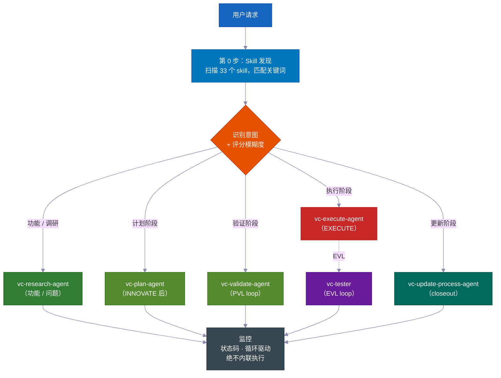

> **为什么这很重要：** 一个既能决策又能偷偷编辑的 agent，会想方设法跳过计划。把协调者和执行者（子 agent）分开，让流程在结构上变得诚实——写代码的唯一途径就是走完必要的步骤。

---

## 📊 RIPER-5 生命周期

| 阶段 | 做什么 | Agent | 你说 |
|-------|-------------|-------|---------|
| 🔍 **RESEARCH** | 只读事实收集——代码库 + 网络。不修改文件。 | `vc-research-agent` | *（功能请求时自动触发）* |
| 📝 **SPEC** | 产品发现需求文档——用户故事、验收标准、范围外——**供你在任何设计前审阅**。 | `vc-spec-agent` | `go` / `ENTER SPEC MODE` |
| 💡 **INNOVATE** | 探索 2-3 种方案及其权衡。决策总结（选中的 + 被拒绝的 + 原因）。 | `vc-innovate-agent` | `go` |
| 📋 **PLAN** | 写详细 spec：接触点、公开契约、可以碰哪些文件、验证证据、恢复交接。 | `vc-plan-agent` | `go` |
| ✅ **VALIDATE** | 将计划转化为约定清单（V1–V7 关卡）。裁定：**PASS / CONDITIONAL / BLOCKED**。运行 PVL 循环。 | `vc-validate-agent` | `ENTER VALIDATE MODE` |
| ⚡ **EXECUTE** | *严格按照*计划实现。进度记录到阶段报告，偏离协议，自审。然后 EVL 循环重跑关卡。 | `vc-execute-agent` | `ENTER EXECUTE MODE` |
| 🧠 **UPDATE PROCESS** | 捕获经验，更新 context，归档计划，写 closeout packet。 | `vc-update-process-agent` | *（非平凡工作后建议执行）* |

> 📝 **为什么 SPEC 是独立阶段：** 大多数 harness 从"理解"直接跳到"设计"。插入一个产品发现 SPEC 步骤，意味着*你*（或你的 PM）在 agent 讨论*如何*实现之前，先对**要做什么**——用简单的用户故事和验收标准——点头确认。这是发现误解最便宜的地方。（在阶段程序的内循环中，SPEC 会被跳过——umbrella SPEC 覆盖所有阶段。）
>
> **SPEC 是衡量标准。** 它用你一分钟就能扫完的简单语言说明预期行为。每个后续阶段——Innovate、Plan、Validate、Execute——都会对照它，问同一个问题：*我们在做的，真的是你要的吗？* 当工作开始偏离，SPEC 是发现的那个东西。

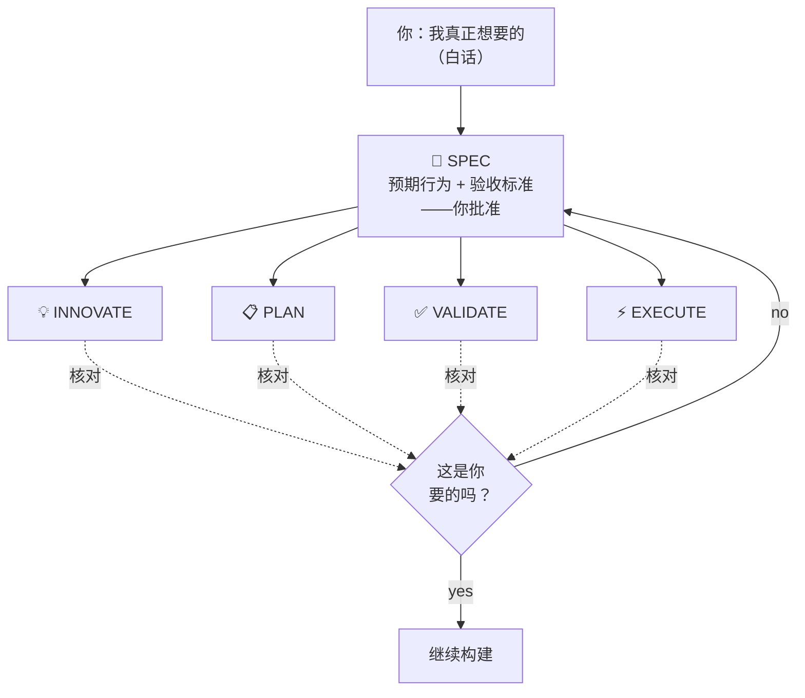

<br>

### 💻 示例会话

```
# 🆕 功能请求
You: "add webhook support to the API"
→ Skill discovery surfaces: vc-scenario, vc-security
→ research-agent gathers context (read-only, can't touch code)
→ "go" → spec-agent writes requirements doc → you approve
→ "go" → innovate-agent compares approaches → decision summary
→ "go" → plan-agent writes the plan, listing which files it will touch
→ "ENTER VALIDATE MODE" → validate-agent gates the plan (PVL loop) → Gate: PASS
→ "ENTER EXECUTE MODE" → execute-agent implements → tester re-runs gates (EVL) → reviewer → git-manager
→ Closeout packet: what changed, what's verified, recommended next step
```

```
# 🐛 缺陷修复
You: "login redirect is broken"
→ Routes to vc-debugger → gathers evidence FIRST → 2-3 competing hypotheses
→ Systematically eliminates each → root cause with proof chain
→ execute-agent implements the fix → EVL re-test → quality pipeline
```

```
# ⏩ Fast mode
You: "ENTER FAST MODE - add rate limiting middleware"
→ Compressed RESEARCH + SPEC + INNOVATE + PLAN + VALIDATE in one pass
→ Mandatory safety pause after VALIDATE → you review → "ENTER EXECUTE MODE"
```

```
# 🤖 Autopilot（免手动）
You: "autopilot full: build a notifications system"
→ ONE consolidated clarification round → provisional /goal block (standing consent)
→ Drives the full RIPER-5 sequence autonomously, pausing only on hard stops
```

```
# 🏗️ 大型程序
You: "build a full testing platform"
→ Umbrella plan + phase plans in a feature folder
→ Each phase inner loop: research → innovate → plan → PVL → execute → EVL → update
→ Progress survives context compaction — durable reports on disk
```

---

## 🎯 意图确认

在路由之前，主 agent 用 **4 个二进制信号（0–4）** 对你的请求模糊度打分，然后选择一个层级。它只在*确实会改变做法*的时候才问问题。

| 层级 | 什么时候 | 行为 |
|---|---|---|
| **层级 0** — 静默自动路由 | 分数 0–1，或你说了"go" / "just do it"，或在恢复一个计划 | 立即路由，不问问题 |
| **层级 1** — 内联摘要 | 分数 2 | 用一行说明它的理解 + 选择的路由，然后继续 |
| **层级 2** — 提问 | 分数 3+ | 在路由前提出有针对性的多选题 |

> 🧠 **最多两轮。** 层级 2 结束后还不清楚，它会问一个最终的直接问题，然后默认路由到调研 agent，使用最窄合理的范围。它永远不会无限循环确认。RESEARCH 结束后，它会重新确认意图——如果调研发现请求与假设大相径庭，它会重新呈现；如果确认了，就直接继续，不重复问。

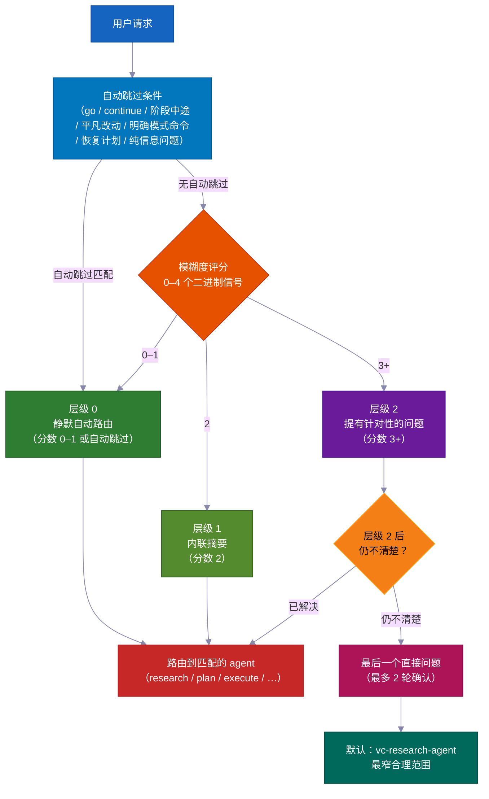

---

## ✅ 两大质量循环——PVL + EVL

大多数 harness 最多检查一次。这个在 EXECUTE 外包了**两个独立循环**——一个在写代码前，一个在写完后。

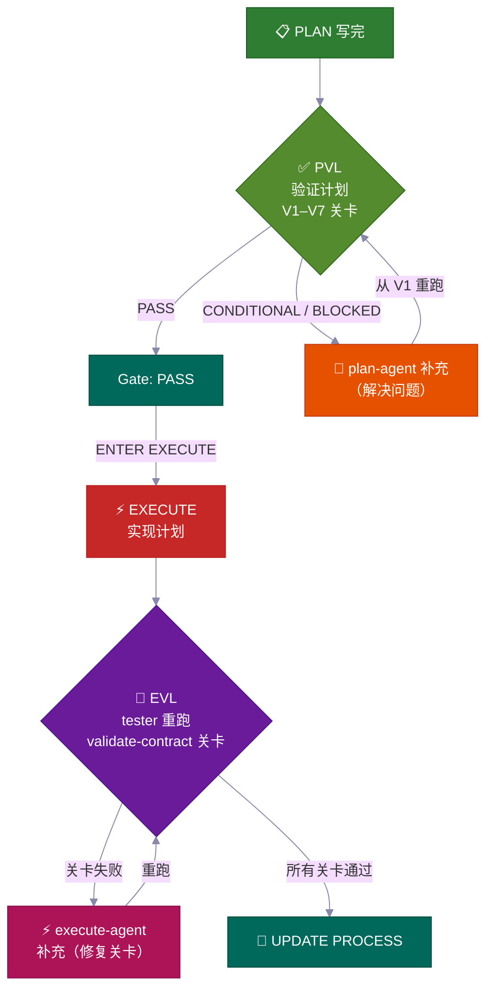

<table>
<tr>
<td width="50%" valign="top">
<h3>📋 PVL——Plan-Validate-Fix</h3>
在 EXECUTE 前，<code>vc-validate-agent</code> 对计划运行 <strong>V1–V7 关卡</strong>——将工作分配给多个 agent，分别覆盖基础设施、测试覆盖率、破坏性变更、安全性和逐部分可行性。第一次 <strong>CONDITIONAL</strong> 或 <strong>BLOCKED</strong> 不是终点——它路由回 <code>vc-plan-agent</code> 更新计划，然后从 V1 重检。
<br><br>
<sub>由 <code>vc-autoresearch</code>（domain: plan）跟踪——一个找问题修复循环。10 轮上限。平台检测。只有 <strong>Gate: PASS</strong>（或你明确接受的 CONDITIONAL）才能解锁 EXECUTE。</sub>
</td>
<td width="50%" valign="top">
<h3>🧪 EVL——Execute-Validate-Fix</h3>
EXECUTE 报告完成后——<strong>即使它声称所有关卡都通过了</strong>——主 agent <strong>始终</strong>会启动 <code>vc-tester</code>，独立重跑约定清单中的精确测试命令。关卡失败会路由到限定范围的 <code>vc-execute-agent</code> 修复，然后重测。
<br><br>
<sub>由 <code>vc-autoresearch</code>（domain: tests）跟踪。10 轮上限。execute-agent 自己的"迭代直到通过"循环<strong>绝不</strong>能代替这次独立确认。</sub>
</td>
</tr>
</table>

> 💎 **裁定阶梯：** **PASS** → 继续 · **CONDITIONAL** → 可修复的问题；循环启动（或你书面接受） · **BLOCKED** → 更深的问题；返回 PLAN（在 autopilot 下：问题进入 backlog，运行继续）。

### 🔁 vc-autoresearch——共享循环引擎

PVL 和 EVL 使用同一个跟踪层：**`vc-autoresearch`**——一个找问题 → 修复 → 重复循环。主 agent 驱动循环——它拥有轮次计数器、每轮报告、TSV 日志和平台/上限/回归检查。工作 agent 是即发即忘的：它们返回结果然后停止。没有 agent 会自己重新启动或启动另一个阶段 agent。

同样的引擎可以独立运行："加固这个 spec"、"修复所有 lint"、"提升测试覆盖率"、"改进这些文档"——任何跨 6 个域的重复找问题修复任务（spec · tests · ux · docs · plan · errors）。

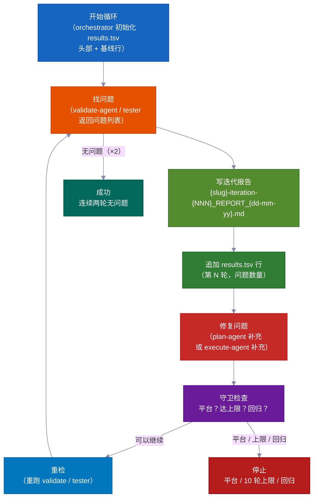

| 模式 | 做什么 | 停止条件 |
|---|---|---|
| `vc-autoresearch`（核心） | 找问题 → 修复 → 重复 | 无问题 或 达到指标目标 |
| `vc-autoresearch:probe` | 8 个角色审问语料库直到饱和 | 连续 3 轮无新约束 |
| `vc-autoresearch:reason` | 带盲评审的对抗性辩论 | 评审收敛或达到迭代上限 |
| `vc-autoresearch:evals` | 分析 TSV 结果——趋势、平台、建议 | 仅分析 |

**停止条件：** SUCCESS（连续两轮全通过）· HALT_PLATEAU（3 轮无进展）· HALT_CAP（10 轮硬上限）· HALT_REGRESSION（之前通过的检查现在失败了）。

---

## 👥 策略比较 + 模型策略

在**每次阶段切换时**，主 agent 调用 `vc-agent-strategy-compare` 来推荐*如何*运行下一个阶段——带成本估算。

| 策略 | 什么时候 | 协调方式 |
|---|---|---|
| **顺序** | 工作依赖前一个输出 | 每次一个 agent |
| **并行子 agent** | 独立维度，即发即忘 | 无——主 agent 收集并合并结果 |
| **工作流** | 跨列表的可预测工作拆分 | 脚本化步骤 |
| **Agent 团队** | Agent 必须在运行中互相通信（例如每个触碰跨 3+ 阶段计划的独立文件） | TeamCreate + 共享任务列表 + SendMessage |

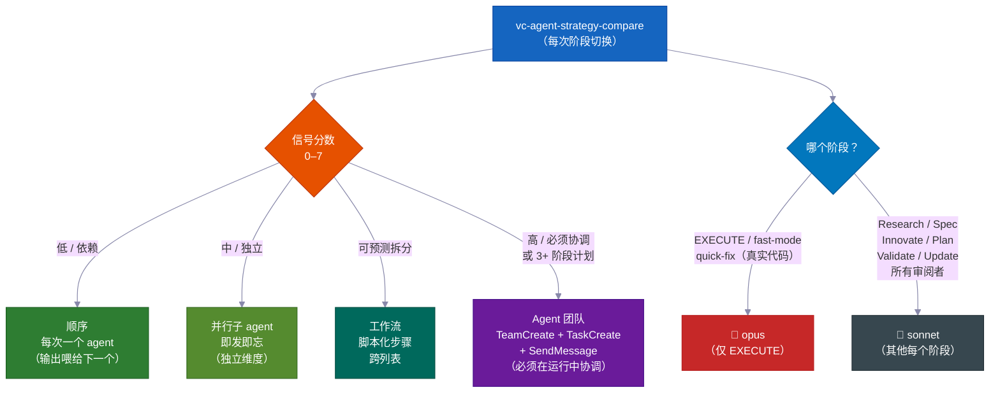

> ⚠️ **"Agent 团队"意味着真正的机制**——有名字的队友、共享任务列表和 agent 间消息传递——*而不是*被称为"团队"的并行 agent。对于创建 3+ 个阶段计划以及 agent 必须各自呆在自己文件里的多文件编辑，这是**必须**（不是可选）的。只有真正的团队才能在运行时通信。

### 🧮 模型选择策略

| 阶段 | 模型 | 原因 |
|---|---|---|
| **EXECUTE**（+ fast-mode、quick-fix 做真实代码） | 🔴 **opus** | 真实源码编辑、构建、迁移 |
| Research · Spec · Innovate · Plan · Validate · Update · 所有审阅者/研究员 | 🔵 **sonnet** | 规划和分析——更便宜，完全够用 |

> 当工作被分配给多个 agent 时，只有*编码* agent 使用 opus。每个审阅者、研究员、验证者和规划者都使用 sonnet。主 agent 在每次启动工作 agent 时都会指定模型。

---

## 🤖 Autopilot 模式——免手动 RIPER-5

说 **`autopilot [task]`**（或 `run autopilot`、`autonomous mode`、`ENTER AUTOPILOT MODE`），agent 就会用**一次**前期确认轮来运行*整个*剩余的 RIPER-5 序列——然后直到完成前不再暂停。

**随时触发：** autopilot 可以在会话开始*或*会话进行中的任意时刻启动。触发时，主 agent 读取磁盘上保存的文件，确认你已经在哪个 RIPER-5 阶段，然后从那里开始自己驱动剩余部分。

| 磁盘状态 | 入口阶段 |
|---|---|
| 无 SPEC 文件 | 从 RESEARCH 开始 |
| 存在 SPEC 文件 | 跳到 SPEC 后（INNOVATE） |
| 存在计划文件 | 跳到 PLAN 后（VALIDATE） |
| 带 PASS/CONDITIONAL 的 Validate-contract | 跳到 EXECUTE |

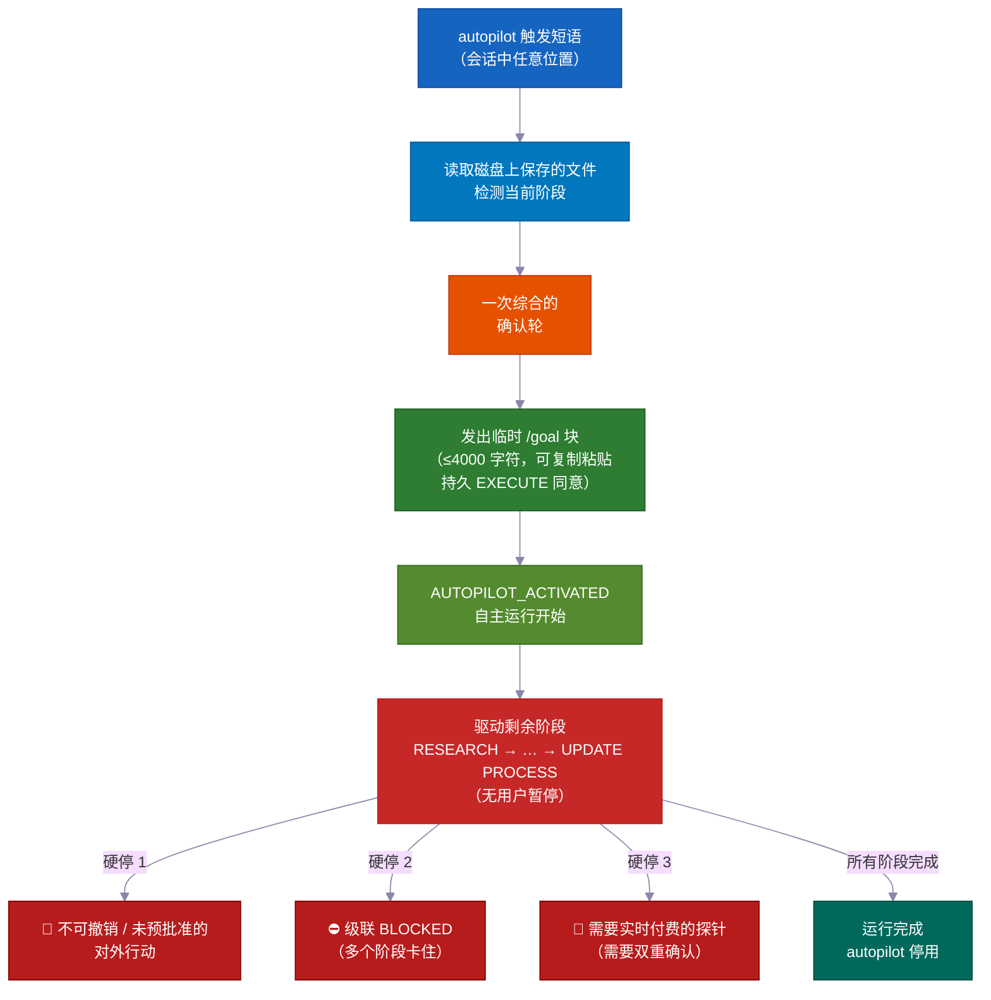

```
You: "autopilot full: add team invitations with email + role management"
→ Reads saved files → detects current phase → enters there
→ ONE consolidated clarification round (scope, hard stops, autonomy boundaries, first-phase strategy)
→ Provisional /goal block emitted (≤4000 chars, copy-pasteable, standing EXECUTE consent)
→ AUTOPILOT_ACTIVATED → drives remaining phases on its own
→ Stops ONLY for hard stops
```

### 三种模式——根据风险匹配仪式感

| 模式 | 触发 | 流程 |
|---|---|---|
| 🟢 **quick** | `autopilot quick: [task]` | 侦察 → 编辑 → 限定范围检查。无计划、无契约、无 EVL。 |
| 🟡 **fast** | `autopilot fast: [task]` | 压缩 R→S→I→P→V → EXECUTE + EVL。 |
| 🔴 **full** | `autopilot [task]` / `autopilot full:` | 完整 RIPER-5（默认）。 |

### 🌙 免手动：一句话，睡醒就好了

说 `autopilot full: [task]`——或粘贴一个 `/goal` 块——以下所有事情都会在**零人工干预**下发生：

- **计划检查修复循环**——找到计划中的问题，修复，重检。自己最多跑 10 轮。
- **构建测试修复循环**——写代码，跑测试，修复失败，重跑。自己最多跑 10 轮。它从不信任自己的"全通过"——一个独立检查器（vc-tester）会独立重跑每个测试来确认。
- **阶段间推进**——从调研推进到计划，推进到代码，推进到完成，无需等你。
- **内存重置后继续**——计划、进度和证明都以文件形式存在磁盘上，不只在 agent 的脑袋里。压缩后（AI 短期记忆清空时），下一个会话读取这些文件，从中断处继续。
- **功能卡住？搁置，继续前进**——如果一个阶段无法解决，agent 写一条 backlog 记录然后继续下一个功能。你可以并行运行多个功能，一个阻塞不会拖住所有东西。
- **并行功能的 agent 团队**——多个 agent 可以同时构建不同功能，每个锁定自己的文件，互不干扰。卡住的功能被停靠，不会成为其他功能的阻塞。

### 硬停总是会出现（即使在 autopilot 中）

这是**仅有的三次它会停下来问你**的情况：

- 🛑 任何它无法撤销的事，或触及外部世界且未经预批准的事（上线、发送真实消息、收费）
- ⛔ 连续多个阶段毫无进展地卡住——值得你注意的真正死路
- 💸 一个需要在付费外部服务上花真钱的测试——它在运行前会问你

---

### 🎯 /goal——自主运行令牌

**必须的，不是装饰：** 每次 VALIDATE 阶段完成后，主 agent *必须*在 EXECUTE 开始前发出一段可复制粘贴的 `/goal` 块。这是一个必须的交接文件——不是可选的注释。

**格式约束：**

| 块类型 | 必填字段 | 硬上限 |
|---|---|---|
| VALIDATE 后的块 | SESSION GOAL · Charter+umbrella plan · Autonomy · Hard stop conditions · Next phase · Validate contract · Execute start | ≤ 4000 字符 |
| 临时（autopilot）块 | SESSION GOAL · ENTRY PHASE · REMAINING PHASES · CLARIFICATIONS LOCKED · EXECUTE CONSENT · DECISION POLICY · HARD STOPS · TEST GATES · START（+ 可选 LANE） | ≤ 4000 字符 |

`/goal` 命令拒绝超过 4000 字符的块。保持简短——用必填字段作为结构，而不是散文长文。

**独立 /goal 模式：** 把一个 `/goal` 块粘贴到新会话中，运行就从 `START` 中指定的阶段恢复。确认和决策规则已经设置好——无需新的确认轮。在持久 `/goal` 下，agent 在每个可逆步骤自己决策，把 BLOCKED 事项发送到 backlog，自己写报告——但**工作 agent 委派仍然是强制的。** Autopilot 只移除*批准暂停*，从不移除禁止内联执行规则。

由 `validate-autopilot-goal-block.mjs` 验证。

---

## 🔬 可行性探针 + 验证器安全网

### 🔬 可行性探针——在基于假设构建之前先测试假设

当 SPEC、INNOVATE 或 VALIDATE 遇到一个无法仅靠阅读来确认的关键假设时，它会发出 `VC-FEASIBILITY-PROBE-NEEDED` 然后停止。主 agent 启动 `vc-debugger` 来运行真实测试并写一份 **VERDICT**：

| 裁定 | 含义 |
|---|---|
| ✅ **VIABLE** | 假设成立——设计可以依赖它 |
| ❌ **NOT-VIABLE** | 假设不成立——该方案被禁止 |
| ❓ **INCONCLUSIVE** | 无法证明——作为 known-gap 向前携带 |

每份裁定都附带一个 3 部分设计注释：**结果允许什么 · 结果排除什么 · 什么仍然不确定**——逐字喂回暂停的阶段。探针有**成本分类**（`cheap-local` / `needs-container` / `needs-live-provider` → 需要双重确认 / `needs-browser` / `needs-cf`），因此付费或共享资源的探针绝不会静默运行。

### 🛡️ 36 个验证器——机械式正确性，不是感觉

Kit 附带 **36 个验证器脚本**，把"agent 是否遵循了规则？"变成明确的通过/失败结果。它们在任何触碰 harness 文件的阶段后运行，并作为 UPDATE PROCESS 中的必要关卡：

| 验证器家族 | 检查内容 |
|---|---|
| `vc-audit-vc` | Agent 一致性（Claude/Codex）、skill 注册表、kit 可移植性、agent frontmatter |
| `vc-audit-context` | Context 路由、发现 frontmatter、skill 关键词 |
| `vc-audit-plans` | 计划清单、umbrella 状态、阶段完整性、阶段报告、backlog 记录 |
| 14 个 VC-system 行为验证器 | 每个拥有通过/失败 fixture 对——strategy-compare 输出、closeout、intent-clarify、可行性裁定、autoresearch 日志等 |

---

## 🛡️ 内置安全机制

这些不是指南——它们是**内置于每个 agent 的硬规则**。

<table>
<tr>
<td width="50%" valign="top">
<h1>📝</h1>
<strong>进度记录，而非运行中暂停</strong><br><br>
编码期间，agent 在工作过程中把进度记录写入阶段报告文件。不会在运行中暂停，不会有"继续还是返回？"的提示。如果遇到需要改计划的问题，它会停下来返回 PLAN。否则继续前进。
</td>
<td width="50%" valign="top">
<h1>🚫</h1>
<strong>绝不静默偏离</strong><br><br>
如果编码遇到需要改计划的问题，agent 会<strong>立即停下来</strong>，解释，然后返回 PLAN。不会静默自由发挥。
</td>
</tr>
<tr>
<td width="50%" valign="top">
<h1>🔐</h1>
<strong>隐私护栏 Hook</strong><br><br>
没有明确批准，agent <strong>被阻止读取</strong> <code>.env</code>、凭证、SSH 密钥和 <code>.pem</code> 文件。
</td>
<td width="50%" valign="top">
<h1>⚠️</h1>
<strong>高风险 Evidence Pack</strong><br><br>
对于 auth、计费、schema 迁移或公开 API 变更，系统要求一份正式的 <strong>5 文件 evidence pack</strong> 才能标记工作为"完成"——始终手动，绝不自动绕过。
</td>
</tr>
<tr>
<td width="50%" valign="top">
<h1>📨</h1>
<strong>状态码规范</strong><br><br>
工作 agent 必须以 <code>DONE</code> / <code>DONE_WITH_CONCERNS</code> / <code>BLOCKED</code> / <code>NEEDS_CONTEXT</code> 之一结束。阻塞永远不会被忽略；正确性问题会成为行动项。
</td>
<td width="50%" valign="top">
<h1>📊</h1>
<strong>Closeout + 漂移评分</strong><br><br>
编码后，closeout packet 对紧迫性评分：<strong>LOW</strong>（轻微改动）→ <strong>MEDIUM</strong>（重大变更）→ <strong>HIGH</strong>（触碰 harness/协议文件），并推荐下一个安全步骤。
</td>
</tr>
</table>

---

## 🔍 实现前智能分析

在写第一行代码之前，三个专家 skill 可以提前发现问题：

<table>
<tr>
<td width="50%" valign="top">
<h1>🎭</h1>
<strong>5 角色辩论——<code>vc-predict</code></strong><br><br>
架构师、安全专家、性能专家、UX 专家和魔鬼代言人辩论你的方案。在你写一行代码之前给出 <strong>GO / CAUTION / STOP</strong> 裁定。
</td>
<td width="50%" valign="top">
<h1>🎲</h1>
<strong>12 维度边界情况——<code>vc-scenario</code></strong><br><br>
从 12 个维度分解功能（用户类型、输入极端值、时序、规模、状态、环境、错误、auth、数据、集成、合规、业务逻辑）。输出可直接用作测试 spec。
</td>
</tr>
<tr>
<td width="50%" valign="top">
<h1>🔐</h1>
<strong>STRIDE + OWASP 审计——<code>vc-security</code></strong><br><br>
双方法论安全审计，含依赖审计、密钥检测，以及按严重性排序、先修 Critical 的<strong>自动修复模式</strong>——每步带回归防护。
</td>
<td width="50%" valign="top">
<h1>🔬</h1>
<strong>先证据后假设的调试——<code>vc-debugger</code></strong><br><br>
收集证据 → 形成 2-3 个竞争假设 → 逐一测试 → 记录排除路径。<strong>从不猜测——它证明。</strong>
</td>
</tr>
</table>

---

## ✅ 质量流水线——内嵌于执行

**先测试，后代码。** 约定清单（在任何代码被触碰前写就）定义了必须通过的精确测试。execute-agent 写代码直到这些测试变绿。然后一个独立检查器——`vc-tester`——自己独立重跑每个测试来确认。execute-agent 自己的"全通过"永远不会被轻信。最后，审阅者检查整个项目仍然协同工作，而不只是新部分。

execute-agent 不只是写代码就完事。它自动经过一条**质量流水线**：

<br>

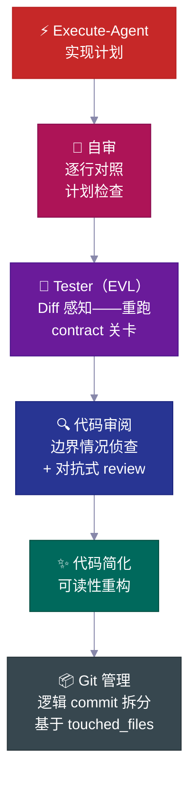

| 步骤 | 做什么 |
|---|---|
| 🔎 **自审** | 对照计划逐条检查清单，记录任何偏差 |
| 🧪 **Tester（EVL）** | 独立重跑约定清单测试；把变更文件映射到测试文件，映射率 >70% 时自动升级为全量测试 |
| 🔍 **代码审阅** | review 前先派边界情况侦查；检查 N+1 查询、auth 路径、数据泄露 |
| ✨ **简化** | review 后整理代码可读性——不改行为 |
| 📦 **Git 管理** | 接收 `touched_files`，拆分为逻辑 conventional commit，拒绝未知文件 |

---

## 📋 计划生命周期

每个非平凡功能都遵循**计划生命周期**——一份书面 spec，被创建、审阅、依此构建，然后归档为永久项目历史。

<br>

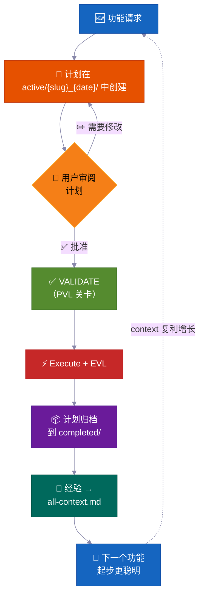

> 💡 六个月后有人问 *"我们当初为什么这样做 auth？"*，答案就在 `completed/` 里。不是埋在 Slack 聊天记录里找不到。

**计划在磁盘上的位置——任务文件夹约定：**

```
process/
├── general-plans/
│   ├── active/
│   │   └── webhooks_28-05-26/          # 📋 任务文件夹：计划 + 同位置报告/参考
│   │       └── webhooks_PLAN_28-05-26.md
│   ├── completed/                       # ✅ 归档（可搜索历史）
│   └── backlog/                         # 📌 延后的工作
└── features/
    └── billing/                         # 🏷️ 功能级别（5+ 产物）
        ├── active/{slug}_{date}/
        ├── completed/
        └── backlog/
```

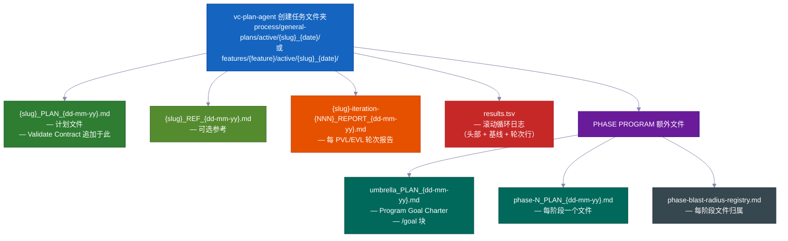

> 每份计划包含：📍 **接触点**（创建/修改的文件）· 📜 **公开契约** · 💥 **可触碰哪些文件**（什么可能挂掉，跑什么测试）· ✅ **验证证据** · 🔄 **恢复交接**。`vc-plan-discovery` 找到正确的计划来恢复；`post-write-plan-check` hook 在每次计划写入时检查计划结构。

---

## 🏗️ 阶段程序——大项目不崩盘

普通功能用一个计划。**大型多阶段项目**用阶段程序——一个 umbrella 计划加上每阶段计划，每个运行一个完整的 **7 步内循环**，有自己的关卡和保存的报告。

<br>

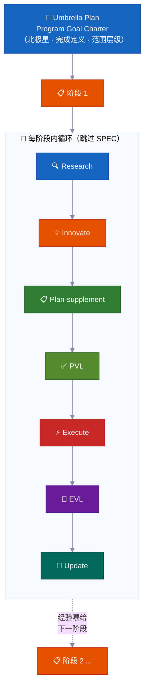

| | 特性 | 为什么重要 |
|---|---|---|
| 🔄 | **每阶段重新调研** | 检查代码漂移，读取最新报告，更新假设 |
| ✅ | **每阶段关卡** | 阶段没有证据证明完成就不算完成。诚实状态：`PLANNED → CODE DONE → TESTING → VERIFIED` 或 `BLOCKED` |
| 📄 | **保存的报告** | 每个阶段把结果写到磁盘——进度在内存重置后依然存活 |
| 🧠 | **经验向前传递** | 阶段 1 的发现在编码开始前更新阶段 2 的计划 |
| 🏗️ | **基础 vs 扩展** | 明确区分"证明架构"和"全面实现" |
| 🚧 | **诚实的阻塞处理** | 被卡住的阶段保持 `BLOCKED` 状态附带证据。不会伪造绿色状态 |

<br>

### 🔀 程序在学习中自我调整

你在开始时写的计划是粗略地图，不是固定契约。随着程序运行，它会调整——所以你不必提前预测每一步。

**它可以在运行中途插入新阶段。** 工作中，agent 可能发现缺失的一步——某件必须在下一阶段之前发生的事。当这种情况发生时，它就在那里插入新阶段，重新编号其余的，然后继续。无需人工干预。（内部信号：`MID_PROGRAM_PLAN_CREATED`——新计划写入磁盘并自动添加到注册表。）

**它可以重排阶段。** 调研有时会表明计划顺序是错的——例如阶段 3 依赖某些只有阶段 4 才能产生的东西。agent 重新排列剩余阶段并记录原因。（内部信号：`PHASE_RESTRUCTURE_NOTICE`——作为审计追踪保存在阶段报告中，不是阻塞。）

**它在编码前更新每个阶段自己的计划。** 在任何阶段开始编码前，一次快速调研回顾程序迄今为止学到的东西。然后用新发现更新该阶段的清单。这被称为 **plan-supplement** 步骤。计划永远不会冻结——它们吸收来自较早阶段的新事实。

**它跳过还无法开始的工作。** 如果一个阶段依赖某些尚未就绪的东西——还未构建的服务、还未做出的决定——agent 将该阶段标记为依赖阻塞，放到一边，继续下一个。整个程序不会因为一个阶段在等待而停滞。

**它知道什么时候停下来问你。** 单个卡住的阶段只会被放进 backlog，程序继续。但如果连续几个阶段都毫无进展地撞墙，agent 将此视为真正的死路——**级联停止**——并暂停向你展示发生了什么。一个卡住的阶段很正常。连续几个表明某些结构性的东西出了问题。

**它维护一个实时记分板。** 每个程序在 umbrella 计划中有一个单页状态部分，显示当前阶段、是否完成以及报告在哪里。任何人——或 agent 在内存重置后——都可以读取它，精确知道进展如何。它还保持一个简单的文件注册表，让同时工作的两个阶段永远不会编辑同一个文件。

**最后一次大检查。** 整个程序结束时，agent 运行一次端到端测试，验证整个项目仍然协同工作——不只是每个部分独立工作。各阶段关卡证明每个部分有效；这次最终检查证明各部分作为整体有效。

---

### 🧠 永不丢失进度（存活于内存重置）

长时间任务能正确完成——即使 AI 的内存在中途重置。计划、进度和证明都以文件形式存在磁盘上，不只在 agent 的脑袋里。

AI agent 有有限的工作记忆。在长时间任务中，记忆会填满并被压缩——细节可能变模糊。当新会话开始（或内存被清空）时，agent 不会猜测它停在哪里。它读取文件。

**工作原理：**

**1. 每个阶段结束后写一份简短报告。** 阶段完成时，一份报告文件被写入磁盘。进度存在你的项目文件夹里，不只在 agent 的脑袋里。内存压缩无法清除文件。

**2. 保持一份哪些步骤完成了的清单。** 每个阶段计划都有一个 **Phase Loop Progress** 列表——每个步骤的复选框（调研、计划检查、构建、测试、捕获经验）。重置后，agent 读取这些复选框，知道下一步确切是什么。不需要追上。

**3. 每个阶段开始时的简短"信封"。** 每个工作 agent（做一个阶段工作的专注助手）在开始时发出一个 **Context Envelope**——一个 10 字段的注释：哪个功能、哪个阶段、哪个分支、哪个计划文件、跑哪些测试。几秒就能读完。agent 在做任何事之前已经准备好了。

**4. 它信任文件而不是自己的记忆。** 恢复时，agent 检查代码和 git 历史中的实际内容与计划所说的内容。真实状态获胜。一个过时的计划无法误导 agent 重复工作或跳过步骤。

**5. 滚动记分板和每轮报告。** 每个修复循环（计划检查循环和构建测试循环）都保持一个 `results.tsv` 记分板文件——每轮一行，跟踪剩余问题数量。当会话在循环中途结束时，下一个会话读取计数，从正确的轮次继续，不丢失任何轮次。

**6. 恢复时重新注入提醒。** 当内存被压缩时，系统自动将最新状态说明重新加载到新会话中。如果任何批准正在等待——比如一个在继续前需要"是"的关卡——提醒会标记它。没有任何东西被静默跳过。

> 💡 简而言之：你可以启动一次 autopilot 运行，合上笔记本，几小时后回来。agent 将正好在它应该在的地方——或者从最后保存的关卡继续，磁盘上有证据证明。

---

## 🧠 Context 组

项目知识被组织成 **context 组**——稳定的知识域，每个都有一个 `all-{group}.md` 路由文件，告诉 agent 读什么、什么时候读。Agent 遵循路由器，只加载相关内容——不是每次都加载整个知识库。

<br>

```
process/context/
├── all-context.md              # 🧭 根路由——架构、技术栈、模式、规范
├── tests/all-tests.md          # 🧪 测试运行器、命令、调试流程
├── container/all-container.md   # 🐳 Docker、部署、基础设施流程
├── uxui/all-uxui.md            # 🎨 组件、设计 token、模式
├── infra/all-infra.md          # 🖥️ 服务器基础设施、部署
└── {your-domain}/all-{domain}.md  # 📚 任何有 3+ 持久文档的域（自动提升）
```

| | 工作方式 |
|---|---|
| 🧭 **路由模式** | Agent 只读与任务相关的内容 |
| 📏 **自动提升** | 有 3+ 文档（或单个文件过大）的主题获得自己的组 |
| 🔄 **始终最新** | 每次非平凡功能后由 `vc-update-process-agent` 更新 |
| 🧪 **可审计** | `vc-audit-context` 检查路由、发现 frontmatter 和一致性 |
| 📨 **Context Envelope** | 每个内循环 agent 在开始时发出一个 10 字段注释（feature → phase → session-goal → branch → worktree → context-group → blast-radius-packages → active-plan → test-runner → validate-contract），让新工作 agent 精确知道它的处境 |

> Kit 只播种协议——你的 context 组由 `vc-setup` **为你的项目构建**，扫描你的真实代码。它们是一个模式，不是固定列表。

---

## 📁 功能文件夹

当一个主题积累了 5 个或更多文件时，它获得自己的**功能文件夹**——一个完整的生命周期容器。

```
process/features/{feature}/
├── active/{slug}_{date}/   # 📋 正在处理的计划（报告/参考同位置）
├── completed/              # ✅ 归档的计划（可搜索的决策历史）
└── backlog/                # 📌 延后的工作（agent 在重复前检查这里）
```

| | 发生什么 |
|---|---|
| 🆕 | 新工作从 `active/` 开始 → 报告积累 → 计划归档到 `completed/` |
| 📌 | 延后的工作进入 `backlog/`——agent 在创建重复计划前检查它 |
| 📦 | 当通用产物达到 5+ 时，功能提升自动发生 |
| 🔍 | 每个功能都有完整的自包含历史——计划、决策、报告、调研 |

---

## 🧱 Skill 层次

33 个 skill 分为三个层次。每个 `SKILL.md` 在 frontmatter 中声明其 `layer` + `trigger_keywords`，一个生成的目录让发现保持快速。

<table>
<tr>
<td width="33%" valign="top">
<h1>🎭</h1>
<strong>Actor agent</strong><br><br>
拥有一个阶段或角色。存在于 <code>.claude/agents/</code>——这是 15 个 agent，不是 skill。
</td>
<td width="33%" valign="top">
<h1>📜</h1>
<strong>Contract skill（20 个）</strong><br><br>
每个产生一个特定文件或约定输出——<code>vc-generate-plan</code>、<code>vc-validate-findings</code>、<code>vc-autopilot</code>、审计类。结果可以被检查。
</td>
<td width="33%" valign="top">
<h1>🛠️</h1>
<strong>Helper skill（13 个）</strong><br><br>
改进 agent <em>如何</em>工作，不产生自己的文件——<code>vc-scout</code>、<code>vc-sequential-thinking</code>、<code>vc-problem-solving</code>、<code>vc-docs-seeker</code>。
</td>
</tr>
</table>

---

## 🧠 自我改进的项目记忆

每个完成的功能都把经验反馈回 context 系统——**知识在积累，不会重置。**

大多数 AI 辅助代码库有相反的特性：每个新会话从零开始。agent 重读同样的文件，重新发现同样的模式，重新做同样的决策——因为上一个会话的洞察只存在于聊天窗口中。这个 kit 的答案不是提示词技巧。它是一个**持久的 context 文件系统**（`process/context/`），每个 agent 在会话开始时读取，每个验证器保护，每个完成的功能丰富它。

六个月和许多次内存重置之后，agent 仍然知道*为什么*你的 auth 是这样的——因为那个知识在磁盘上，有路由，可审计，不是困在死会话里。

<br>

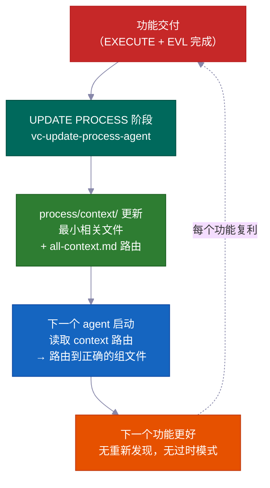

### 核心机制：`process/context/` 作为可移植的共享记忆

`process/context/` 持有按主题组织的结构化知识——架构决策、编码规范、部署步骤、测试模式、基础设施事实。与聊天历史不同，这些知识：

- **进入每个工作 agent**——`vc-context-discovery` 将每个启动的 agent 路由到其任务的正确 `all-{group}.md` 路由，然后到最小的相关深层文件。调研 agent、计划 agent 和编码 agent 都从同样的共享理解开始
- **在内存重置后存活**——它在磁盘上，不在 context 窗口中；被压缩的会话不会丢失任何内容
- **可被 Claude 和 Codex 读取**——`.agents/skills` 是 `.claude/skills/` 的快捷链接，所以同一个 context 系统无需重复服务两个 agent

根路由（`all-context.md`）指向组路由（`all-{group}.md`），组路由再指向最小的相关深层文件。Agent 遵循路由——它们从不硬编码文件路径。这意味着重命名和组拆分只需要路由编辑，不需要全代码库搜索。

```
process/context/
├── all-context.md                  ← 根路由（架构、技术栈、模式）
├── tests/all-tests.md              ← 测试运行器、调试、命令
├── container/all-container.md      ← Docker、部署、基础设施流程
├── uxui/all-uxui.md                ← 组件、设计 token、视觉规范
└── {domain}/all-{domain}.md        ← 任何有 3+ 持久文档的域（自动提升）
```

<br>

### 是什么让它自我改进（而不只是"活文档"）

"活文档"这个说法通常意味着"我们打算保持更新但大多忘了的文档"。这个系统用机械方式强制执行这个意图。

**UPDATE PROCESS 阶段在关闭前需要逐文件 context 审阅。** `vc-update-process-agent` 在每个可能受影响的 context 文件都被逐文件（附带具体原因）审阅之前无法完成阶段。"不需要更新"是允许的——但必须命名每个审阅过的文件并解释原因。模糊原因被拒绝。关卡是二元的：记录审阅，或者阶段不关闭。

每个完成功能的完整反馈循环：

| 步骤 | 负责人 | 发生什么 |
|------|-------|-------------|
| 1. Git diff 分析 | `vc-scout` | 把变更文件映射到受影响的 context 域 |
| 2. 逐文件审阅 | `vc-update-process-agent` | 命名每个 context 文件，说明更新或明确的"无变更 + 原因" |
| 3. 应用更新 | 并行工作 agent | 每个域的 context 文件用新模式、决策、经验更新 |
| 4. 路由验证 | `validate-context-discovery.mjs` | 确认每个文档都被索引，路由器一致 |
| 5. 发现确认 | `validate-all-context.mjs` | 确认 `all-context.md` 和组路由与磁盘上的当前文件匹配 |

你的第 100 个功能受益于前 99 个功能学到的一切——不是作为愿望，而是作为机械保证。

<br>

### 前向预览：经验向前传递，不只是向后

每份阶段报告都有一个 `## Forward Preview` 部分，专门为*下一个*阶段的 agent 写的。它给出保持绿色的精确命令、依赖变更以及阶段中途发现的文件范围变更。接手阶段 3 的 agent 不必重读阶段 2 的输出猜什么重要。它被交给一份聚焦的简报。

这与 context 文档不同：context 文档携带*持久*知识（跨功能保持真实的决策）；Forward Preview 携带*临时*交接状态（下一个工作会话现在需要知道的）。

<br>

### 验证器套件防止腐烂

持久知识在没有人检查时会过时。Kit 附带验证器，作为每次阶段关闭的一部分运行：

| 验证器 | 捕获什么 |
|-----------|----------------|
| `validate-context-discovery.mjs` | 未被任何路由索引的文档；损坏的链接；缺失的 frontmatter |
| `validate-all-context.mjs` | `all-context.md` 与磁盘上实际文件不同步 |
| `validate-skill-keywords.mjs` | Skill 缺少 `trigger_keywords` 或 `layer` 字段（破坏路由第 0 步） |
| `validate-protocol-discovery.mjs` | `process/development-protocols/` 中的协议文件缺少发现 frontmatter |

这些像自动检查一样运行——过时或孤立的文档会失败。系统自我维护健康。

<br>

### Context 组自我组织

当一个主题达到 3+ 个文档或单个文件超过约 800 行时，组会自动创建。Agent 遵循路由器，从不硬编码路径——所以添加新组（例如 `process/context/billing/all-billing.md`）只需要路由更新，不需要修改每个提到计费的 agent。路由器是稳定的参考；它背后的文件可以自由重组。

> Kit 从你的真实代码库中播种 context 组（通过 `vc-setup`）。这些组不是固定列表——它们是一个模式。你的 auth 域、你的基础设施域、你的支付域，随着项目成长，各自成为一等可路由知识。

---

## 🤖 里面有什么

<br>

### 15 个 Agent

<details>
<summary>点击展开 agent 名单</summary>

<br>

**核心工作流 agent**——每个 RIPER-5 阶段一个（R → SPEC → I → P → V → E → UP）：

| Agent | 模型 | 角色 |
|-------|:---:|------|
| 🔍 `vc-research-agent` | sonnet | 代码库 + 网络调研，只读。内置矛盾追踪 |
| 📝 `vc-spec-agent` | sonnet | INNOVATE 前的产品发现需求文档。产出 `*_SPEC_*.md` |
| 💡 `vc-innovate-agent` | sonnet | 比较 2-3 种方案。PLAN 前的决策总结（选中 + 被拒绝） |
| 📋 `vc-plan-agent` | sonnet | 带防走捷径守卫地写计划。"我已经知道怎么做"不是一个计划 |
| ✅ `vc-validate-agent` | sonnet | 把计划转化为约定清单（V1–V7）。关卡：PASS/CONDITIONAL/BLOCKED |
| ⚡ `vc-execute-agent` | **opus** | 按计划实现。进度记录到阶段报告，偏离协议，自审 |
| ⏩ `vc-fast-mode-agent` | **opus** | 压缩 R→S→I→P→V，EXECUTE 前有强制安全暂停 |
| 🔧 `vc-quick-fix-agent` | **opus** | QUICK FIX 通道：一个小低风险编辑 + 限定范围检查，无需计划/验证 |
| 🧠 `vc-update-process-agent` | sonnet | 7 阶段 closeout：归档、更新 context、过时产物扫描、经验 |

<br>

**专家 agent**——在 EXECUTE 期间调用或独立调用：

| Agent | 角色 |
|-------|------|
| 🐛 `vc-debugger` | 形成假设前先收集证据。竞争假设，排除链，可行性探针 |
| 🧪 `vc-tester` | 变更感知。重跑约定清单测试（EVL）。配置变更时自动升级 |
| 🔎 `vc-code-reviewer` | review 前先派边界情况侦查。N+1 检测，auth 路径检查 |
| ✨ `vc-code-simplifier` | 不改行为地整理代码可读性 |
| 🎨 `vc-ui-ux-designer` | 设计感知的前端。构建中可以启动调研工作 agent |
| 📦 `vc-git-manager` | 从 `touched_files` 拆分为逻辑 commit。拒绝未知文件 |

</details>

<br>

### 33 个 Skill（自动发现）

<details>
<summary>点击展开 skill 列表（20 个 contract + 13 个 helper）</summary>

<br>

**📜 Contract skill（20 个）**——拥有产物：`vc-generate-plan` · `vc-generate-context` · `vc-generate-spec` · `vc-generate-closeout` · `vc-generate-phase-program` · `vc-audit-context` · `vc-audit-plans` · `vc-audit-vc` · `vc-update` · `vc-publish` · `vc-feasibility-test` · `vc-risk-evidence-pack` · `vc-test-coverage-plan` · `vc-validate-findings` · `vc-autoresearch` · `vc-intent-clarify` · `vc-autopilot` · `vc-agent-strategy-compare` · `vc-plan-discovery` · `vc-context-discovery`

**🛠️ Helper skill（13 个）**——改进 agent 工作方式：`vc-review-situation` · `vc-sequential-thinking` · `vc-problem-solving` · `vc-scout` · `vc-debug` · `vc-docs-seeker` · `vc-frontend-design` · `vc-agent-browser` · `vc-web-testing` · `vc-setup` · `vc-predict` · `vc-scenario` · `vc-security`

</details>

> **⚠️ 命名规则：** 不要对你自己的 skill 或 agent 使用 `vc-` 前缀——该命名空间为 kit 自带文件保留，过时文件清理守卫将 `.claude/skills/` 和 `.claude/agents/` 下的任何 `vc-*` 路径视为 kit 所有。改用 `my-`、`team-` 或 `proj-`。

<br>

### 🪝 10 个 Hook

| Hook | 做什么 |
|------|-------------|
| 🔐 `privacy-block.cjs` | 阻止读取 `.env`、凭证、SSH 密钥。需要明确批准 |
| 🚫 `scout-block.cjs` | 防止进入 `node_modules/`、`dist/`。支持 gitignore 语法的 `.ckignore` |
| 🧠 `session-init.cjs` | 检测技术栈，注入环境变量，压缩后恢复审批门禁 |
| 💉 `subagent-init.cjs` | 向每个子 agent 注入紧凑 context 块 |
| ✨ `post-edit-simplify-reminder.cjs` | 5+ 次编辑后，提示运行简化器（非阻塞，节流） |
| 📛 `descriptive-name.cjs` | 每次 Write 时的语言感知文件命名规范 |
| 📊 `session-state.cjs` | 会话指标 + token 感知 |
| 📋 `post-write-plan-check.mjs` | 每次向 `*_PLAN_*.md` 写入时验证计划产物结构 |
| 🧹 `post-commit-lint.mjs` | 每次 `git commit` Bash 调用时检查 conventional-commits 前缀 |
| 🔍 `stop-validator-sweep.cjs` | 会话停止时运行核心 harness 验证器 |

<br>

**所有东西的位置：**

```text
your-project/
├── .claude/{agents,skills,hooks}/   # 🤖 15 个 agent · ⚡ 33 个 skill · 🪝 10 个 hook
├── .codex/agents/                   # 🔄 为 Codex 镜像
├── .agents/skills -> .claude/skills # 🔗 Codex 发现用的符号链接
├── CLAUDE.md · AGENTS.md            # 📋 Orchestrator 配置 + 跨工具注册表
└── process/
    ├── context/                     # 🧠 自动路由的知识域
    ├── general-plans/               # 📋 跨功能计划 + 任务文件夹
    ├── features/                    # 🏷️ 功能级别生命周期文件夹
    └── development-protocols/       # 📜 22 个共享工作流文档
```

---

## ⚡ Quick Fix + Fast Mode

当完整的 RIPER-5 流程比任务需要的更重时，有两个轻量选项：

<table>
<tr>
<td width="50%" valign="top">
<h1>🔧</h1>
<strong>Quick Fix</strong> — <code>"quick fix: …"</code><br><br>
比平凡的单行修改大，比"需要计划"的小。主 agent 只读侦察 → 一行确认 → 启动 <code>vc-quick-fix-agent</code> 进行编辑 + 只对触碰的文件做限定范围检查。<strong>无计划，无约定清单，无 EVL。</strong>
<br><br>
<sub>如果变更触碰 schema、auth、API、计费或迁移面，立即取消——然后路由到完整 RESEARCH。</sub>
</td>
<td width="50%" valign="top">
<h1>⏩</h1>
<strong>Fast Mode</strong> — <code>"ENTER FAST MODE - …"</code><br><br>
把 RESEARCH + SPEC + INNOVATE + PLAN + VALIDATE 压缩到一次通过——但仍然<strong>写计划、写约定清单，并在 EXECUTE 前暂停。</strong>
<br><br>
<sub>在普通 Fast Mode 中，VALIDATE 后有一次暂停——你审阅，然后说"ENTER EXECUTE MODE"。使用 <code>autopilot fast: [task]</code> 移除该暂停，一路跑到完成不停止。</sub>
</td>
</tr>
</table>

---

## 🔄 Kit 生命周期：安装 · 设置 · 更新 · 发布

| 命令 | 做什么 | 什么时候 |
|---|---|---|
| `curl … install.sh \| bash` | 同步 kit 文件而不覆盖你的；自动检测全新 vs 升级并引导你 | 首次安装 + 每次升级 |
| **Run vc-setup** | 检测技术栈，搭建 `process/`，深度扫描代码库，填充真实 context | 全新安装后 |
| **Run vc-update** | 计算精确 diff，显示将变更什么，等你确认；零数据丢失迁移旧格式计划/文件夹 | 每次升级时 |
| **Run vc-publish** *（维护者）* | 把 harness 变更发布回 kit 仓库 | 为 kit 本身贡献时 |

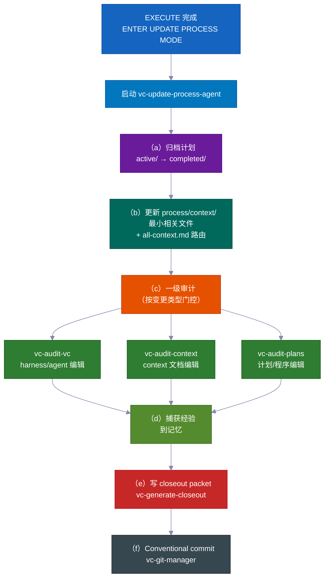

> 💡 `vc-update` 展示预览 diff 并等你确认。你的 `process/` 目录和项目特定内容**永远**不会被静默更改。重复运行安装脚本是安全的。

---

## 💡 更多让它好用的细节

许多小而智慧的默认设置加起来，减少了盯守和降低了成本。

- **每个角色只获得它需要的工具。** 规划期间，agent 字面上不能编辑代码——那些工具被关掉了。这阻止了 agent 提前跳过去在计划批准前修改东西。系统根本不允许这样做。

- **只在重要的地方使用高端 AI 模型。** 写代码使用顶级模型。规划、调研、审阅和检查都使用更便宜、更快的模型。结果：与对一切都用顶级模型相比，成本大约降低 60–70%——而在重要的工作上没有质量损失。

- **在基于猜测构建之前先测试。** 当 agent 不确定某事是否会工作——特定 API 行为、库功能、基础设施假设——它先进行一个小型真实实验。结果很清楚：有效、无效，或不确定。那个裁定和一段简单说明被直接喂入计划。agent 不会在错误假设上花几个小时构建。

- **整洁、有意义的保存点。** 变更以干净、逻辑的块和清晰的消息提交——自动。历史容易阅读，容易一块一块地撤销。

- **有用的自动提醒。** 内置的小助手会提示做对变更文件运行正确检查、保持代码简洁、写正确的提交消息等事情。质量保持高水平，无需你来监管。

- **你可以独立运行自我改进循环。** 驱动计划检查和测试修复的同一个"发现问题、修复、重复"引擎，也可以作为独立工具用于任何混乱的区域——spec、文档、测试、错误列表。你不需要完整的功能构建来使用它。

- **工作流规则实际工作的内置证明。** Kit 附带自己的测试套件：一组有已知好和已知坏示例的检查，证明工作流规则行为正确。系统检查自身。你不必相信护栏是开着的——你可以运行检查来看到。

---

## 贡献

欢迎贡献！详见 [CONTRIBUTING.md](../../CONTRIBUTING.md)。

<br>

**快速链接：**

- 🐛 [报告 Bug](https://github.com/withkynam/vibecode-pro-max-kit/issues/new?template=1.bug_report.yml)
- 💡 [功能请求](https://github.com/withkynam/vibecode-pro-max-kit/issues/new?template=2.feature_request.yml)
- ⚡ [提交 Skill](https://github.com/withkynam/vibecode-pro-max-kit/issues/new?template=3.skill_submission.yml)
- 🌐 [添加翻译](https://github.com/withkynam/vibecode-pro-max-kit/issues/new?template=5.translation.yml)

<br>

<a href="https://github.com/withkynam/vibecode-pro-max-kit/graphs/contributors">
  
</a>

<br>

### 🙏 致谢

vibecode-pro-max-kit 专注于规格驱动的开发框架和自我改进的 context 组织，不会用 80+ 个 skill 把你压垮。更少工具，更多结构。

---

## ⭐ Star 历史

<a href="https://star-history.com/#withkynam/vibecode-pro-max-kit&Date">
 <picture>
   <source media="(prefers-color-scheme: dark)" srcset="https://api.star-history.com/svg?repos=withkynam/vibecode-pro-max-kit&type=Date&theme=dark" />
   <source media="(prefers-color-scheme: light)" srcset="https://api.star-history.com/svg?repos=withkynam/vibecode-pro-max-kit&type=Date" />
   
 </picture>
</a>

---

## 📄 License

MIT
