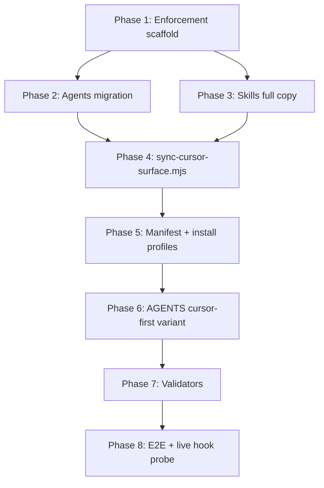

# Cursor-First Harness Full Migration — Implementation Plan

**Date** 08-07-26  
**Complexity** COMPLEX (8 sequential phases, single execution stream)  
**Status** ⏳ PLANNED (all phases)  
**SPEC:** `process/features/cursor-platform/active/cursor-first_08-07-26/cursor-first_SPEC_08-07-26.md`  
**Feasibility:** `process/features/cursor-platform/active/cursor-feasibility-probe_07-07-26/cursor-feasibility-probe_FEASIBILITY_07-07-26.md`

> **TL;DR:** Build a self-contained `.cursor/` harness (15 agents, 33 skill copies, rules, hooks + hard-deny write-guard), maintain it from `.claude/` via `sync-cursor-surface.mjs`, add `install.sh --profile cursor-first`, ship `AGENTS.cursor-first.md` as orchestrator, extend validators + e2e, and prove AC13–AC14 live hook deny (high-risk pack) before calling hooks production-ready.

## Quick Links

- [Context Envelope](#context-envelope)
- [Overview](#overview)
- [Architecture Decisions](#architecture-decisions)
- [Phase Structure](#phase-structure)
- [Acceptance Criteria](#acceptance-criteria)
- [Touchpoints](#touchpoints)
- [Public Contracts](#public-contracts)
- [Blast Radius](#blast-radius)
- [Implementation Checklist](#implementation-checklist)
- [Verification Evidence](#verification-evidence)
- [High-Risk Pack — AC13–AC14](#high-risk-pack--ac1314-live-hook-deny)
- [Risks](#risks)
- [Phase Loop Progress](#phase-loop-progress)
- [Validate Contract](#validate-contract)
- [Test Infra Improvement Notes](#test-infra-improvement-notes)
- [Resume and Execution Handoff](#resume-and-execution-handoff)

---

## Context Envelope

| Field | Value |
|-------|-------|
| feature | cursor-platform |
| phase | PLAN |
| session-goal | Cursor-first harness full migration — self-contained `.cursor/`, cursor-first install profile, layered enforcement |
| branch | main |
| worktree | d:\Erlangga\Personal\vibecode-pro-max-kit (clean) |
| context-group | planning, tests |
| blast-radius-packages | `.cursor/**`, `vc-manifest.json`, `resolve-manifest.mjs`, `install.sh`, `e2e-kit-flows.test.mjs`, `AGENTS.cursor-first.md`, `sync-cursor-surface.mjs`, `vc-audit-vc` validators, `process/context/` |
| active-plan | `process/features/cursor-platform/active/cursor-first_08-07-26/cursor-first_PLAN_08-07-26.md` |
| test-runner | node --test \| vitest (harness uses `node --test` only) |
| validate-contract | pending — vc-validate-agent writes after VALIDATE |

---

## Overview

Migrate the kit from Claude/Codex-only shipping to a **dual-tree maintainer model**: `.claude/` remains upstream-primary for Claude Code; a new **self-contained** `.cursor/` tree becomes canonical for Cursor-only consumers. A `cursor-first` install profile installs only `.cursor/**`, `AGENTS.md` (from `AGENTS.cursor-first.md`), and `process/` — never `.claude/`, `.codex/`, `CLAUDE.md`, or `.agents/`. The legacy **full** profile stays behavior-identical.

Enforcement is **layered** (rules + AGENTS.md + hooks + per-agent write-guard). Feasibility proved rules work after reload and hook **script logic** is viable; live `preToolUse` deny and subagent `readonly` alone are **not** production-grade — Phase 8 must achieve or formally document AC13–AC14.

All 15 cursor-first agents declare **Composer 2.5** (`model: composer-2.5` in frontmatter — exact slug validated against Cursor agent schema during Phase 2).

---

## Architecture Decisions

### AD-001: Dual-tree kit repo (`.claude/` primary + `sync-cursor-surface.mjs`)

**Decision:** Maintainers edit `.claude/agents/` and `.claude/skills/` as upstream; `sync-cursor-surface.mjs` regenerates `.cursor/agents/` and `.cursor/skills/` with deterministic transforms. Consumer `cursor-first` installs never depend on `.claude/` at runtime.

**Rationale:** Avoids three-way drift (Claude/Codex/Cursor); matches Codex mirror pattern; Windows-safe full skill copies.

**Rejected:** Single canonical `.claude/` with Cursor compat-only reads (superseded adapter SPEC).

### AD-002: Skills — FULL COPY to `.cursor/skills/` (no symlink)

**Decision:** `sync-cursor-surface.mjs` deep-copies each `vc-*` skill directory; validator fails on symlinks under `.cursor/skills/`.

**Rationale:** SPEC AC6; Windows without Developer Mode.

### AD-003: Hooks live under `.cursor/hooks/` (self-contained)

**Decision:** Copy portable hook scripts from `.claude/hooks/` into `.cursor/hooks/`; wire `.cursor/hooks.json` with paths rooted at `.cursor/hooks/`. Implement `agent-write-guard.mjs` in `.cursor/hooks/` with **hard deny** (non-zero exit + deny JSON). Also add advisory `.claude/hooks/agent-write-guard.mjs` (exit 0) to satisfy existing Claude frontmatter without behavior change.

### AD-004: Install profiles via manifest + `install.sh --profile`

**Decision:** Extend `vc-manifest.json` with `profiles.full` (current `include`/`exclude`/`symlinks`) and `profiles.cursor-first` (`.cursor/**`, `process/**` subset, `AGENTS.cursor-first.md` installed as `AGENTS.md`). `resolve-manifest.mjs` accepts `--profile <name>`; `install.sh` accepts `--profile cursor-first`.

### AD-005: Orchestrator — `AGENTS.cursor-first.md` → installed `AGENTS.md`

**Decision:** Source file `AGENTS.cursor-first.md` at repo root; cursor-first profile copies it to `AGENTS.md`. No `CLAUDE.md`, no `CURSOR.md` on cursor-first install.

### AD-006: Model policy — Composer 2.5 for all `.cursor/agents/`

**Decision:** Every `.cursor/agents/vc-*.md` frontmatter includes `model: composer-2.5`. Parity validator checks this field. Harness spawn policy in cursor-first AGENTS variant documents Composer 2.5 for all spawned agents (overrides generic opus/sonnet table for Cursor context).

### AD-007: Validators — self-contained `.cursor/` dimension

**Decision:** New `validate-cursor-self-contained.mjs` plus extensions to `validate-agent-parity.mjs`, `validate-kit-portability.mjs`, `validate-skills.mjs`. No `cursor_*` fields on `.claude/agents/`.

---

## Phase Structure

Eight phases, strict dependency order. Phases 2 and 3 may fan out in parallel **after** Phase 1 completes (agents ∥ skills), but both must finish before Phase 4 sync wiring is finalized.



| Phase | Name | Depends on | Proves (boundary) |
|-------|------|------------|-------------------|
| 1 | Enforcement scaffold | — | `.cursor/` skeleton, rules, hooks.json, write-guard stdin tests (AC8, AC11–AC12 partial) |
| 2 | Agents migration | 1 | 15 agents in `.cursor/agents/`, Composer 2.5, path rewrites (AC4, AC19) |
| 3 | Skills full copy | 1 | 33 skill dirs copied, no symlinks (AC5, AC6) |
| 4 | Sync script | 2, 3 | Regeneration is deterministic; kit CI can run sync |
| 5 | Manifest + install | 4 | Both profiles install correctly (AC1–AC3, AC7) |
| 6 | AGENTS variant | 5 | Cursor-first orchestrator doc only |
| 7 | Validators | 6 | Parity/portability/self-containment (AC15, AC18, AC20) |
| 8 | E2E + live hook probe | 7 | Full e2e green + AC13–AC14 high-risk pack (AC9, AC13–AC14, AC16–AC17) |

### Phase Completion Rules

A phase is **not** ✅ VERIFIED until:

1. All phase gate commands exit 0 (or documented CONDITIONAL only for AC13 with AC14 artifact)
2. No regression on full/legacy profile gates in the same commit
3. Phase report stub written to task folder if live probe was run

Status markers: ⏳ PLANNED | 🔨 CODE DONE | 🧪 TESTING | ✅ VERIFIED | 🚧 BLOCKED

Mark ✅ VERIFIED only after user-confirmed working behavior (live probe, install trial, or IDE check per phase).

---

## Acceptance Criteria

Mapped from SPEC — each row links to [Verification Evidence](#verification-evidence).

| ID | Criterion | Phase gate |
|----|-----------|------------|
| AC1 | cursor-first install: `.cursor/`, `AGENTS.md`, `process/`; no Claude/Codex surfaces | 5, 8 |
| AC2 | full/legacy install unchanged | 8 |
| AC3 | manifest indexes cursor-first ship paths | 5, 7 |
| AC4 | 15 agents under `.cursor/agents/` | 2, 7 |
| AC5 | 33 skills full copy under `.cursor/skills/` | 3, 7 |
| AC6 | no symlink skills in cursor-first tree | 3, 7 |
| AC7 | cursor-first: `AGENTS.md` only; no `CLAUDE.md`/`CURSOR.md` | 5, 8 |
| AC8 | write-guard stdin deny/allow | 1 |
| AC9 | Cursor live hard deny disallowed write | 8 |
| AC10 | alwaysApply rules visible after reload | 8 |
| AC11 | rules required in cursor-first ship | 1, 7 |
| AC12 | hook stdin deny/allow | 1 |
| AC13 | live preToolUse blocked write does not land | 8 (high-risk) |
| AC14 | live-hook diagnosis report artifact | 8 (high-risk) |
| AC15 | parity on self-contained `.cursor/agents/` | 7 |
| AC16 | e2e both profiles green | 8 |
| AC17 | enforcement not readonly-only | 8 |
| AC18 | Tier-1 vc-audit-vc pass | 8 |
| AC19 | Composer 2.5 on all cursor agents | 2, 7 |
| AC20 | validate-skills on cursor tree | 7 |

---

## Touchpoints

### New files (create)

| Path | Phase | Purpose |
|------|-------|---------|
| `.cursor/agents/vc-*.md` (15) | 2 | Canonical Cursor agent definitions |
| `.cursor/skills/vc-*/**` (33 trees) | 3 | Full skill copies |
| `.cursor/rules/riper5-orchestrator.mdc` | 1 | alwaysApply orchestrator rules |
| `.cursor/rules/riper5-phase-lock.mdc` | 1 | alwaysApply phase-boundary rules |
| `.cursor/hooks.json` | 1 | Cursor lifecycle hook wiring |
| `.cursor/hooks/**` | 1 | Copied/adapted hook scripts from `.claude/hooks/` |
| `.cursor/hooks/agent-write-guard.mjs` | 1 | Hard deny write guard (Cursor) |
| `.claude/hooks/agent-write-guard.mjs` | 1 | Advisory write guard (Claude — exit 0) |
| `sync-cursor-surface.mjs` | 4 | Maintainer sync: `.claude/` → `.cursor/` |
| `AGENTS.cursor-first.md` | 6 | Source orchestrator for cursor-first profile |
| `.claude/skills/vc-audit-vc/scripts/validate-cursor-self-contained.mjs` | 7 | Self-containment gate |
| `.claude/skills/vc-audit-vc/scripts/fixtures/validate-cursor-self-contained/` | 7 | pass/fail fixtures |
| `process/features/cursor-platform/active/cursor-first_08-07-26/cursor-first_REPORT_live-hook_08-07-26.md` | 8 | AC14 diagnosis artifact (if probe run) |

### Modified files

| Path | Phase | Change |
|------|-------|--------|
| `vc-manifest.json` | 5 | `profiles.full`, `profiles.cursor-first`, version bump |
| `resolve-manifest.mjs` | 5 | `--profile` flag, profile merge logic |
| `install.sh` | 5 | `--profile cursor-first`, skip Claude/Codex paths |
| `compute-sync-plan.mjs` | 5 | `isKitOwned()` includes `.cursor/**` |
| `e2e-kit-flows.test.mjs` | 8 | cursor-first install trial + dual-profile regression |
| `.claude/skills/vc-audit-vc/scripts/validate-agent-parity.mjs` | 7 | `.cursor/agents` dimension + model check |
| `.claude/skills/vc-audit-vc/scripts/validate-kit-portability.mjs` | 7 | Scan `.cursor/**`; cursor-first path rules |
| `.claude/skills/vc-audit-vc/scripts/validate-skills.mjs` | 7 | Optional `--skills-root .cursor/skills` |
| `.claude/skills/vc-context-discovery/scripts/discover-skills.mjs` | 7 | `--skills-root` for cursor-first smoke |
| `process/context/all-context.md` | 7 | `.cursor/` present; cursor-first profile |
| `process/context/tests/all-tests.md` | 7 | New validator commands |
| `process/features/cursor-platform/_GUIDE.md` | 6 | cursor-first scope (not adapter) |
| `CONTRIBUTING.md` | 8 | Profile install docs + sync workflow |

### Explicitly NOT modified (zero regression)

- `.codex/**` (except if portability scan list extended read-only)
- `CLAUDE.md` content for full profile
- `process/development-protocols/**` semantics
- `process/features/cursor-platform/backlog/cursor-adapter_07-07-26/` (read-only superseded)

### Agent inventory (15 — all get `.cursor/agents/<name>.md`)

`vc-research-agent`, `vc-spec-agent`, `vc-innovate-agent`, `vc-plan-agent`, `vc-validate-agent`, `vc-execute-agent`, `vc-fast-mode-agent`, `vc-update-process-agent`, `vc-quick-fix-agent`, `vc-tester`, `vc-debugger`, `vc-code-reviewer`, `vc-code-simplifier`, `vc-ui-ux-designer`, `vc-git-manager`

### Skill inventory (33 — all get `.cursor/skills/<name>/` copy)

`vc-agent-browser`, `vc-agent-strategy-compare`, `vc-audit-context`, `vc-audit-plans`, `vc-audit-vc`, `vc-autopilot`, `vc-autoresearch`, `vc-context-discovery`, `vc-debug`, `vc-docs-seeker`, `vc-feasibility-test`, `vc-frontend-design`, `vc-generate-closeout`, `vc-generate-context`, `vc-generate-phase-program`, `vc-generate-plan`, `vc-generate-spec`, `vc-intent-clarify`, `vc-plan-discovery`, `vc-predict`, `vc-problem-solving`, `vc-publish`, `vc-review-situation`, `vc-risk-evidence-pack`, `vc-scenario`, `vc-scout`, `vc-security`, `vc-sequential-thinking`, `vc-setup`, `vc-test-coverage-plan`, `vc-update`, `vc-validate-findings`, `vc-web-testing`

---

## Public Contracts

### PC-1: `install.sh --profile <name>`

| Profile | Args | Installs | Omits |
|---------|------|----------|-------|
| `full` (default) | none or `--profile full` | Current manifest `profiles.full` | — |
| `cursor-first` | `--profile cursor-first` | `.cursor/**`, `AGENTS.md` (from `AGENTS.cursor-first.md`), `process/development-protocols/**`, `process/context/generated-skills-catalog.json`, `process/_seeds/**` | `.claude/**`, `.codex/**`, `CLAUDE.md`, `.agents/**` |

Exit codes: `0` success; `1` preflight/manifest failure; `2` unknown profile.

### PC-2: `resolve-manifest.mjs --profile <name>`

- `--profile full` → identical to today’s resolved file set (backward compatible)
- `--profile cursor-first` → only cursor-first include globs
- JSON output gains `profile` field

### PC-3: `sync-cursor-surface.mjs`

```
node sync-cursor-surface.mjs [--check] [--agents-only] [--skills-only]
```

- Default: regenerate agents + skills under `.cursor/`
- `--check`: exit 1 if working tree would change (CI drift gate)
- Transforms documented in Phase 4 checklist

### PC-4: `agent-write-guard.mjs` (Cursor)

**Stdin:** JSON hook payload (Cursor `preToolUse` format)  
**Args:** `--agent <slug> --allowlist '<glob1>,<glob2>'`  
**Cursor behavior:** exit `2` + stdout `{"permission":"deny","userMessage":"..."}` when path outside allowlist for `Write`/`StrReplace`/`ApplyPatch`/`edit` tool names  
**Claude copy:** same logic, exit `0` always (advisory stderr only)

### PC-5: `.cursor/agents/*.md` frontmatter (required fields)

```yaml
name: vc-<slug>
description: <same as .claude>
model: composer-2.5
readonly: true   # phase-locked agents only; omit/false for execute/quick-fix/git-manager
tools: <Cursor tool list — mapped from Claude tools/disallowedTools>
skills:
  - <slug>   # paths resolve under .cursor/skills/
hooks:
  PreToolUse:
    - matcher: "Write|StrReplace|edit|ApplyPatch"
      hooks:
        - type: command
          command: "node .cursor/hooks/agent-write-guard.mjs --agent <slug> --allowlist '<globs>'"
```

### PC-6: `.cursor/rules/*.mdc`

```yaml
---
description: <short>
alwaysApply: true
---
```

Minimum two rules files shipped; portability validator fails if `.cursor/rules/*.mdc` count &lt; 1.

---

## Blast Radius

| Class | Scope | Risk |
|-------|-------|------|
| **High** | Live hook deny (AC13–AC14), `install.sh` profile branching | Wrong profile wipes user `.claude/` or fails open on writes |
| **Medium** | `vc-manifest.json`, `resolve-manifest.mjs`, e2e trials | Publish/install regression |
| **Medium** | 15 agents × prompt rewrites | Path leaks to `.claude/` break self-containment |
| **Low** | Context doc updates, CONTRIBUTING | Doc drift |
| **Isolated** | `process/features/cursor-platform/**` plans | No consumer runtime impact |

**File count estimate:** ~1,200+ new files (33 skills with scripts/references), ~25 modified, 0 deleted from full profile paths.

**Regression surface:** Full profile e2e trials 1–4 must remain green after every phase merge.

---

## Implementation Checklist

### Phase 1 — Enforcement scaffold ⏳

1. Create directory scaffold: `.cursor/agents/`, `.cursor/skills/`, `.cursor/rules/`, `.cursor/hooks/`, `.cursor/hooks/lib/` (mirror `.claude/hooks/lib` layout for copied scripts).
2. Author `.cursor/rules/riper5-orchestrator.mdc` — alwaysApply; content: orchestrator delegates, no inline EXECUTE when plan exists, RIPER-5 phase table summary, pointer to `AGENTS.md` + `process/development-protocols/`.
3. Author `.cursor/rules/riper5-phase-lock.mdc` — alwaysApply; content: RESEARCH/SPEC/INNOVATE read-only; PLAN writes only under `process/**`; EXECUTE writes only source + approved paths; cite layered enforcement (rules + hooks + write-guard).
4. Copy portable hook scripts from `.claude/hooks/` to `.cursor/hooks/` (include `post-write-plan-check.mjs`, `post-commit-lint.mjs`, `lib/**` dependencies for any copied `.cjs` hooks). Exclude Claude-only statusline hooks not applicable to Cursor unless needed for parity.
5. Implement `.cursor/hooks/agent-write-guard.mjs` — parse stdin JSON; extract file path from Write/StrReplace payloads; match allowlist globs (use `minimatch` pattern logic inline or port from scout-block glob style — no new npm deps); **hard deny** on Cursor.
6. Implement `.claude/hooks/agent-write-guard.mjs` — same matcher; **advisory only** (log stderr, exit 0).
7. Add `.claude/skills/vc-audit-vc/scripts/agent-write-guard.stdin.test.mjs` (or colocate under `.cursor/hooks/__tests__/`) — BLOCK path denied exit 2; ALLOW path exit 0.
8. Create `.cursor/hooks.json` with `preToolUse` matchers for write tools invoking `agent-write-guard.mjs` (global) plus `post-write-plan-check.mjs` on write success; model after `.codex/hooks.json` structure but paths under `.cursor/hooks/`.
9. Run stdin deny/allow probe — gate for Phase 1 complete.

### Phase 2 — Agents migration ⏳ (parallel with Phase 3 after Phase 1)

1. For each of 15 agents in `.claude/agents/vc-*.md`, generate `.cursor/agents/vc-*.md` via sync script template (initial manual seed acceptable; Phase 4 automates).
2. Set `model: composer-2.5` on every cursor agent file.
3. Set `readonly: true` on: `vc-research-agent`, `vc-spec-agent`, `vc-innovate-agent`, `vc-validate-agent`, `vc-tester`, `vc-debugger` (read-only phases). Omit or `false` on: `vc-plan-agent`, `vc-execute-agent`, `vc-update-process-agent`, `vc-quick-fix-agent`, `vc-code-reviewer`, `vc-code-simplifier`, `vc-ui-ux-designer`, `vc-fast-mode-agent`, `vc-git-manager`.
4. Rewrite body paths: `.claude/skills/` → `.cursor/skills/`; `.claude/agents/` → `.cursor/agents/`; `.claude/hooks/` → `.cursor/hooks/`; remove `CLAUDE.md` references → `AGENTS.md`; keep `process/` paths unchanged.
5. Map `tools` / `disallowedTools` to Cursor-native tool names (`Read`, `Write`, `StrReplace`, `Grep`, `Glob`, `Shell`, `Task`, etc.).
6. Copy per-agent `hooks.PreToolUse` blocks with `.cursor/hooks/agent-write-guard.mjs` paths and same allowlists as Claude frontmatter.
7. Verify no body string contains runtime dependency `.claude/` or `.codex/` (except optional maintainer comment in kit-only CONTRIBUTING — not in agent bodies).
8. Run count gate: exactly 15 files under `.cursor/agents/`.

### Phase 3 — Skills full copy ⏳ (parallel with Phase 2 after Phase 1)

1. For each of 33 `vc-*` directories under `.claude/skills/`, recursively copy to `.cursor/skills/<name>/` preserving `SKILL.md`, `scripts/`, `references/`, frontmatter, `.env.example`, `package.json` where present.
2. Exclude from copy: `node_modules/`, `__tests__/` under skills if manifest exclude applies; follow same exclude patterns as `vc-manifest.json` for skill trees.
3. Rewrite internal path references inside copied SKILL.md files: `.claude/skills/` → `.cursor/skills/`; `.agents/skills/` → `.cursor/skills/`.
4. Verify no symlink: `fs.lstat` walk fails build if `isSymbolicLink()` anywhere under `.cursor/skills/`.
5. Regenerate or verify `process/context/generated-skills-catalog.json` still lists 33 skills (catalog is shared; discovery uses catalog + on-disk skills).
6. Run `node .claude/skills/vc-context-discovery/scripts/discover-skills.mjs` from repo root with cursor skills present — smoke pass.

### Phase 4 — `sync-cursor-surface.mjs` ⏳

1. Create `sync-cursor-surface.mjs` at repo root (kitOnly surface alongside `compute-sync-plan.mjs`).
2. Implement agent transform: read `.claude/agents/*.md`, apply AD-002 path rewrites, inject `model: composer-2.5`, emit `.cursor/agents/*.md`.
3. Implement skills sync: deep copy `.claude/skills/vc-*` → `.cursor/skills/vc-*` with delete-stale (remove cursor skill dirs no longer in source).
4. Implement hooks sync: copy changed hook scripts from `.claude/hooks/` → `.cursor/hooks/` per allowlist manifest inside sync script (exclude `lib/__tests__`).
5. Do **not** overwrite hand-authored `.cursor/rules/*.mdc` or `AGENTS.cursor-first.md`.
6. Add `--check` mode for CI: `node sync-cursor-surface.mjs --check` exits 1 on drift.
7. Document in `CONTRIBUTING.md`: after editing `.claude/agents` or `.claude/skills`, run `node sync-cursor-surface.mjs`.
8. Add npm-free unit test `sync-cursor-surface.test.mjs` — transform snapshot for one agent file.

### Phase 5 — Manifest + install profiles ⏳

1. Bump `vc-manifest.json` version (e.g. 3.3.0).
2. Restructure manifest: move current top-level `include`/`exclude`/`symlinks`/`merge` into `profiles.full`; add `profiles.cursor-first` with includes: `.cursor/**`, `.cursor/**/.??*`, `process/development-protocols/**`, `process/context/generated-skills-catalog.json`, `process/_seeds/**`, `AGENTS.cursor-first.md`; empty `symlinks` for cursor-first; exclude same user-content paths as today.
3. Add `copyAs`: `{ "AGENTS.cursor-first.md": "AGENTS.md" }` under cursor-first profile (implement in resolver if not present).
4. Extend `resolve-manifest.mjs`: `--profile full|cursor-first` (default `full`); emit `profile` in JSON.
5. Extend `install.sh`: parse `--profile`; pass profile to resolver; for `cursor-first`, skip copying `.claude/`, `.codex/`, `CLAUDE.md`, `.agents/`; apply `copyAs` for AGENTS.
6. Update `compute-sync-plan.mjs` `isKitOwned()` to include `.cursor/skills/vc-`, `.cursor/agents/vc-`, `.cursor/hooks/`, `.cursor/rules/`.
7. Trial cursor-first install to temp dir — assert absent `.claude`, present `.cursor/agents` count 15.

### Phase 6 — AGENTS cursor-first variant ⏳

1. Create `AGENTS.cursor-first.md` — fork from current `AGENTS.md`; remove Codex-primary framing; set orchestrator entry for Cursor; document `.cursor/agents`, `.cursor/skills`, `.cursor/rules`, hooks; **Composer 2.5** model policy for all agents; no `CLAUDE.md` references; keep RIPER-5 tables and routing.
2. Add bootstrap guard identical to today (vc-setup if no `all-context.md`).
3. Document two profiles in intro section (cursor-first vs full for monorepo teams).
4. Ensure manifest `copyAs` installs this as `AGENTS.md` only under cursor-first.
5. Grep `AGENTS.cursor-first.md` for forbidden strings: `CLAUDE.md`, `.claude/agents`, `.codex/` as runtime deps.

### Phase 7 — Validators ⏳

1. Create `validate-cursor-self-contained.mjs` — checks: 15 agents, 33 skills, no symlinks in skills, no `.claude/` string in `.cursor/agents/*.md` bodies, `hooks.json` exists, ≥1 `.mdc` rule, `agent-write-guard.mjs` exists.
2. Extend `validate-agent-parity.mjs` — add `--cursor` mode comparing `.claude/agents` vs `.cursor/agents` normalized bodies + `model: composer-2.5` on cursor side.
3. Extend `validate-kit-portability.mjs` — walk `.cursor/skills`, `.cursor/agents`, `.cursor/rules`; require rules glob for cursor-first manifest section; symlink check.
4. Extend `validate-skills.mjs` — `--skills-root .cursor/skills` validates registry against catalog.
5. Extend `discover-skills.mjs` — optional `--skills-root .cursor/skills`.
6. Add D1 validator fixtures pass/fail under `fixtures/validate-cursor-self-contained/`.
7. Update `process/context/all-context.md` and `process/context/tests/all-tests.md` with commands.
8. Run Tier-1 bundle: `validate-agent-parity.mjs --strict`, `validate-kit-portability.mjs`, `validate-skills.mjs`, `validate-cursor-self-contained.mjs`.

### Phase 8 — E2E + live hook probe (high-risk pack) ⏳

1. Extend `e2e-kit-flows.test.mjs` — **Trial 5:** `cursor-first` install into temp dir; assert `.cursor/agents` count 15, `.cursor/skills` count 33, no `.claude`, no `CLAUDE.md`, `AGENTS.md` exists; **Trial 6:** full profile regression unchanged.
2. Add e2e assertion: skills not symlinks (`lstat` in test helper).
3. Run `node --test e2e-kit-flows.test.mjs` with `VC_KIT_SOURCE` — all trials green.
4. **AC13 live probe:** new Cursor window after reload; enable hooks in settings if off; attempt Write to `process/features/cursor-platform/active/cursor-first_08-07-26/LIVE_HOOK_PROBE_BLOCK.md` with hook deny rule active — file must **not** appear.
5. **AC14 artifact:** write `cursor-first_REPORT_live-hook_08-07-26.md` with: environment (OS, Cursor version), hooks enabled setting, tool_name observed in hook stdin log, outcome pass/fail, remediation steps if fail, or Known-Gap declaration with compensating controls (rules + write-guard only) — **CONDITIONAL** gate if Known-Gap.
6. **AC9 live write-guard:** spawn `vc-research-agent` readonly; attempt disallowed write — user-visible deny.
7. **AC10 hybrid:** user confirms rules visible in Customize → Rules after reload; agent reads rule in new chat.
8. **AC17 hybrid:** checklist in report — enforcement design cites readonly-not-sufficient per feasibility.
9. Run `vc-audit-vc` skill Tier-1 gate — no blocking failures.
10. If AC13 fails after remediation cycle: gate stays **CONDITIONAL**; do not mark program ✅ VERIFIED; backlog stub for hook runtime fix.

---

## Verification Evidence

| Gate / Scenario | Strategy | Proves SPEC criterion |
|-----------------|----------|----------------------|
| e2e Trial 5 — cursor-first install layout | Fully-Automated | AC1 |
| e2e Trial 1–4 — full/legacy install unchanged | Fully-Automated | AC2 |
| `validate-kit-portability.mjs` cursor-first paths | Fully-Automated | AC3, AC11 |
| `validate-cursor-self-contained.mjs` agent count 15 | Fully-Automated | AC4 |
| `discover-skills.mjs` + skill dir count 33 | Fully-Automated | AC5 |
| `validate-kit-portability.mjs` symlink scan `.cursor/skills` | Fully-Automated | AC6 |
| e2e Trial 5 — no `CLAUDE.md`; `AGENTS.md` present | Fully-Automated | AC7 |
| `agent-write-guard.stdin.test.mjs` deny/allow | Fully-Automated | AC8 |
| Live research-agent disallowed write blocked | Hybrid | AC9 |
| Rules visible post-reload + agent reads `.mdc` | Hybrid | AC10 |
| Portability rules glob required | Fully-Automated | AC11 |
| Hook stdin deny/allow probe | Fully-Automated | AC12 |
| Live `preToolUse` blocked write does not land | Agent-Probe | AC13 |
| `cursor-first_REPORT_live-hook_08-07-26.md` diagnosis | Hybrid | AC14 |
| `validate-agent-parity.mjs --strict --cursor` | Fully-Automated | AC15 |
| `node --test e2e-kit-flows.test.mjs` all trials | Fully-Automated | AC16 |
| Enforcement checklist readonly-not-sufficient | Hybrid | AC17 |
| `vc-audit-vc` Tier-1 | Fully-Automated | AC18 |
| `validate-agent-parity.mjs` model composer-2.5 | Fully-Automated | AC19 |
| `validate-skills.mjs --skills-root .cursor/skills` | Fully-Automated | AC20 |

### Validate-contract gate commands (draft — VALIDATE formalizes)

```bash
# Tier-0 plan artifact
node .claude/skills/vc-generate-plan/scripts/validate-plan-artifact.mjs process/features/cursor-platform/active/cursor-first_08-07-26/cursor-first_PLAN_08-07-26.md

# Sync drift (post Phase 4+)
node sync-cursor-surface.mjs --check

# Self-containment
node .claude/skills/vc-audit-vc/scripts/validate-cursor-self-contained.mjs

# Parity
node .claude/skills/vc-audit-vc/scripts/validate-agent-parity.mjs --strict --cursor

# Portability + skills
node .claude/skills/vc-audit-vc/scripts/validate-kit-portability.mjs
node .claude/skills/vc-audit-vc/scripts/validate-skills.mjs --skills-root .cursor/skills

# Write guard stdin
node .claude/skills/vc-audit-vc/scripts/agent-write-guard.stdin.test.mjs

# E2E both profiles
VC_KIT_SOURCE="$(pwd)" node --test e2e-kit-flows.test.mjs

# Manifest profiles
node resolve-manifest.mjs --profile cursor-first --json
node resolve-manifest.mjs --profile full --json
```

---

## High-Risk Pack — AC13–AC14 (Live Hook Deny)

**Classification:** Agent-Probe + Hybrid documentation (feasibility INCONCLUSIVE).

**Preconditions:**
- Cursor hooks enabled in user settings
- Window reloaded after `.cursor/hooks.json` install
- New chat session (not stale session)
- Probe path: `process/features/cursor-platform/active/cursor-first_08-07-26/LIVE_HOOK_PROBE_BLOCK.md`

**Diagnosis checklist (if deny fails):**

| # | Hypothesis | Check |
|---|------------|-------|
| 1 | Hooks disabled in settings | Cursor Settings → Hooks |
| 2 | `tool_name` mismatch | Log stdin in hook script; compare Write vs StrReplace vs `edit` |
| 3 | Windows path normalization | Compare normalized paths in guard vs payload |
| 4 | Hook command path wrong | Relative vs `node .cursor/hooks/...` from repo root |
| 5 | Fail-open IDE behavior | Cursor version changelog / forum |

**Pass:** AC13 satisfied — blocked write never hits disk.  
**CONDITIONAL:** AC14 documents Known-Gap; residual enforcement = rules + `.cursor/hooks/agent-write-guard.mjs` + orchestrator; hooks.json marked non-production until retest passes.

**Vacuous-green ban:** AC13 cannot be assigned Known-Gap as terminal PASS without AC14 artifact + CONDITIONAL program state.

---

## Risks

### Risk Predictions (vc-predict synthesis)

| Persona | Prediction | Mitigation |
|---------|------------|------------|
| Architect | Dual-tree drift if contributors skip sync | `--check` in CI; CONTRIBUTING mandatory sync step |
| Security | Fail-open hooks give false confidence | AC13–AC14; rules + write-guard always shipped |
| QA | e2e on Windows `/tmp` paths differ | Use `fs.mkdtempSync` with platform temp; Git Bash for install.sh |
| DX | 33 skill copies bloat repo size | Accept per SPEC; publish excludes dev-only paths |
| Maintainer | Agent body rewrite misses `.claude/` reference | `validate-cursor-self-contained.mjs` grep gate |

### Edge cases (vc-scenario — highest-risk items)

- **Sync partial failure:** stale skill dir in `.cursor/skills/` after rename — sync deletes orphans.
- **Profile mis-install:** user runs cursor-first on repo needing Codex — document profile choice in AGENTS variant.
- **Hook fires on allowed PLAN write:** allowlist must include `process/**/*_PLAN_*.md` for plan-agent.
- **Composer model slug drift:** validate exact `composer-2.5` string against Cursor docs at EXECUTE time.

---

## Phase Loop Progress

| Phase | Status | Gate |
|-------|--------|------|
| 1 — Enforcement scaffold | ⏳ PLANNED | stdin write-guard test pass |
| 2 — Agents | ⏳ PLANNED | 15 agents, composer-2.5 |
| 3 — Skills | ⏳ PLANNED | 33 copies, no symlink |
| 4 — Sync script | ⏳ PLANNED | `--check` clean |
| 5 — Manifest/install | ⏳ PLANNED | e2e Trial 5 layout |
| 6 — AGENTS variant | ⏳ PLANNED | no CLAUDE.md dep |
| 7 — Validators | ⏳ PLANNED | Tier-1 green |
| 8 — E2E + live probe | ⏳ PLANNED | AC13 or AC14 CONDITIONAL |

---

## Validate Contract

(placeholder — vc-validate-agent writes this section before EXECUTE)

---

## Test Infra Improvement Notes

- Add `agent-write-guard.stdin.test.mjs` in Phase 1 (new harness test — not application test).
- Add `sync-cursor-surface.test.mjs` in Phase 4 for transform regression.
- e2e Trial 5/6 require Git Bash or WSL on Windows maintainer machines — document in CONTRIBUTING.
- Live AC13 cannot run in CI — manual Agent-Probe with retained REPORT artifact.

---

## Resume and Execution Handoff

| Field | Value |
|-------|-------|
| **Selected plan file** | `process/features/cursor-platform/active/cursor-first_08-07-26/cursor-first_PLAN_08-07-26.md` |
| **Last completed phase** | None — ⏳ PLANNED |
| **Validate-contract status** | pending |
| **Supporting context loaded** | SPEC, feasibility verdict + supplement, `all-context.md`, `all-planning.md`, `all-tests.md`, INNOVATE Decision Summary |
| **Next step for fresh EXECUTE agent** | Enter VALIDATE → on PASS, ENTER EXECUTE MODE Phase 1 only; create `.cursor/` scaffold + rules + hooks + `agent-write-guard.mjs`; run stdin test gate before Phase 2/3 parallel work |

**Execution strategy (PLAN session):** 8 phases sequential with Phase 2∥3 parallel fan-out after Phase 1 — recommend **sequential EXECUTE** per phase for blast-radius control; Phase 2+3 may use **parallel subagents** (agents executor + skills executor) with opus/Composer implementers after Phase 1 gates green.

**Model policy (this program):** Composer 2.5 for all `.cursor/agents/` definitions and all Cursor spawn metadata.

**Superseded work:** `process/features/cursor-platform/backlog/cursor-adapter_07-07-26/` — do not implement Tier B adapter.

---

## Agent Routing Reference

| Phase | Primary agent | Helpers |
|-------|---------------|---------|
| 1–8 EXECUTE | vc-execute-agent | vc-tester after each phase; vc-debugger if AC13 fails |
| 8 live probe | vc-debugger + human | vc-feasibility-test patterns |
| Closeout | vc-update-process-agent | vc-audit-vc, vc-audit-context, vc-audit-plans |

---

## PLAN Session Strategy Compare (VALIDATE next)

| Option | Est. cost | Fit |
|--------|-----------|-----|
| Sequential validate | 1× vc-validate-agent | **Recommended** — single plan, unified contract |
| Parallel validate | 3× dimension agents | Overkill for one artifact |
| Workflow | n/a | No |
| Agent team | n/a | No |

**Recommendation:** Sequential vc-validate-agent on this plan file → VALIDATE contract → EXECUTE Phase 1 only per handoff.
